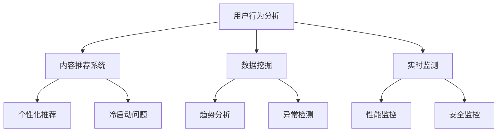

                 

在未来的2025年，随着人工智能技术和大数据分析的迅猛发展，快手社交网络已成为中国乃至全球范围内最具影响力的社交媒体平台之一。作为一家以短视频为主打的平台，快手在内容创造、用户互动和数据分析等方面都有着独特的优势和挑战。本文旨在深入剖析快手社交网络效果分析工程师的面试题，帮助准备应聘此岗位的技术人才更好地应对面试挑战。

## 关键词

- 快手社交网络
- 效果分析工程师
- 面试题详解
- 数据分析
- 人工智能
- 算法

## 摘要

本文详细解析了2025年快手社交网络效果分析工程师面试中可能会遇到的经典问题和答案。通过对快手平台的核心功能和数据结构进行分析，结合实际案例，探讨了用户行为分析、内容推荐系统、数据挖掘和实时监测等关键领域的技术实现方法和挑战。

## 1. 背景介绍

快手作为一家中国领先的短视频社交平台，其用户群体涵盖各个年龄层和社会阶层。自成立以来，快手通过不断优化用户体验和内容生态，已经成为全球用户规模最大的短视频平台之一。快手的成功不仅依赖于其独特的社交模式，还依赖于强大的数据分析能力和人工智能技术。

效果分析工程师在快手扮演着至关重要的角色。他们通过深入分析用户行为数据、内容数据等，为平台提供决策支持，优化用户体验，提高用户留存率和活跃度。因此，对于应聘快手效果分析工程师岗位的候选人来说，具备扎实的分析能力和丰富的实践经验是必不可少的。

## 2. 核心概念与联系

为了更好地理解快手社交网络效果分析工程师的工作，我们需要先了解几个核心概念及其相互关系：

### 2.1. 用户行为分析

用户行为分析是效果分析工程师的首要任务。通过收集用户在平台上的浏览、点赞、评论、分享等行为数据，我们可以了解用户的偏好、兴趣和需求。这些数据可以帮助我们：

- **个性化推荐**：基于用户的浏览历史和兴趣爱好，为用户推荐符合其口味的内容。
- **用户留存率提升**：通过分析用户行为轨迹，发现可能导致用户流失的关键因素，并采取措施进行干预。

### 2.2. 内容推荐系统

内容推荐系统是快手的核心竞争力之一。通过算法对用户行为数据和内容特征进行分析，推荐系统能够为用户精准推送高质量的内容。关键在于：

- **算法选择**：常用的推荐算法包括基于内容的推荐（CBR）、协同过滤（CF）和深度学习（DL）等。
- **冷启动问题**：对于新用户或新内容，如何进行有效推荐是一个重要挑战。

### 2.3. 数据挖掘

数据挖掘是从海量数据中提取有价值信息和知识的过程。在快手平台上，数据挖掘的应用包括：

- **趋势分析**：通过挖掘用户行为数据，发现流行趋势和热点话题。
- **异常检测**：检测潜在的问题，如作弊行为、垃圾信息等。

### 2.4. 实时监测

实时监测是确保平台稳定性和安全性的重要手段。通过实时分析用户行为和系统状态，我们可以及时发现和解决问题，如：

- **性能监控**：监控系统的运行状态，确保其稳定性和高效性。
- **安全监控**：检测和阻止恶意攻击和违规行为。

### 2.5. Mermaid 流程图

以下是快手社交网络效果分析工程师所需掌握的核心概念及其相互关系的 Mermaid 流程图：



## 3. 核心算法原理 & 具体操作步骤

### 3.1 算法原理概述

在快手社交网络效果分析中，常用的算法包括用户行为分析算法、内容推荐算法、数据挖掘算法和实时监测算法。以下是每种算法的基本原理：

### 3.2 算法步骤详解

#### 3.2.1 用户行为分析算法

1. 数据收集：收集用户在平台上的行为数据，如浏览、点赞、评论等。
2. 数据预处理：对原始数据进行分析和清洗，去除噪声数据。
3. 特征提取：从行为数据中提取特征，如用户兴趣、活跃度等。
4. 模型训练：使用机器学习算法（如决策树、神经网络等）对特征进行训练。
5. 预测与评估：根据训练好的模型进行预测，并评估模型的准确性和效果。

#### 3.2.2 内容推荐算法

1. 用户兴趣建模：通过分析用户行为数据，构建用户兴趣模型。
2. 内容特征提取：提取内容的相关特征，如标签、关键词、内容类型等。
3. 协同过滤：计算用户与内容之间的相似度，进行协同过滤推荐。
4. 基于内容的推荐：根据用户兴趣和内容特征，进行基于内容的推荐。
5. 集成推荐：将多种推荐算法的结果进行集成，提高推荐效果。

#### 3.2.3 数据挖掘算法

1. 数据预处理：对原始数据进行分析和清洗。
2. 特征工程：从数据中提取特征，构建特征向量。
3. 模型选择：选择适合的数据挖掘算法（如聚类、分类、回归等）。
4. 模型训练与优化：使用训练数据对模型进行训练，并进行优化。
5. 结果分析与解释：分析挖掘结果，提取有价值的信息。

#### 3.2.4 实时监测算法

1. 数据采集：实时采集用户行为数据和系统状态数据。
2. 异常检测：使用机器学习算法进行异常检测，识别潜在的问题。
3. 预警与处理：发现异常后，进行预警并采取相应的处理措施。
4. 性能监控：实时监控系统的运行状态，确保其稳定性和高效性。

### 3.3 算法优缺点

每种算法都有其优缺点，具体如下：

#### 用户行为分析算法

- **优点**：能够全面了解用户行为，为个性化推荐提供有力支持。
- **缺点**：数据量大，处理复杂，实时性要求高。

#### 内容推荐算法

- **优点**：提高用户满意度和留存率。
- **缺点**：冷启动问题难以解决，推荐效果可能受到数据质量影响。

#### 数据挖掘算法

- **优点**：从海量数据中提取有价值信息。
- **缺点**：算法复杂度高，结果解释难度大。

#### 实时监测算法

- **优点**：能够及时发现和解决问题。
- **缺点**：实时性要求高，算法性能要求严格。

### 3.4 算法应用领域

不同算法在快手社交网络效果分析中的应用领域如下：

- **用户行为分析**：应用于个性化推荐、用户留存预测等。
- **内容推荐算法**：应用于内容推荐、热点话题分析等。
- **数据挖掘算法**：应用于趋势分析、异常检测等。
- **实时监测算法**：应用于系统性能监控、安全监控等。

## 4. 数学模型和公式 & 详细讲解 & 举例说明

### 4.1 数学模型构建

在快手社交网络效果分析中，常用的数学模型包括线性回归模型、协同过滤模型和神经网络模型等。以下是一个简单的线性回归模型示例：

$$
y = \beta_0 + \beta_1 x_1 + \beta_2 x_2 + ... + \beta_n x_n
$$

其中，$y$ 是预测目标，$x_1, x_2, ..., x_n$ 是特征变量，$\beta_0, \beta_1, \beta_2, ..., \beta_n$ 是模型参数。

### 4.2 公式推导过程

以线性回归模型为例，其推导过程如下：

1. **最小二乘法**：通过最小化目标函数 $J(\beta)$，求解模型参数。

$$
J(\beta) = \sum_{i=1}^{n} (y_i - \beta_0 - \beta_1 x_{i1} - \beta_2 x_{i2} - ... - \beta_n x_{in})^2
$$

2. **求导与优化**：对 $J(\beta)$ 分别对 $\beta_0, \beta_1, \beta_2, ..., \beta_n$ 求导，并令导数为零，得到最优参数值。

$$
\frac{\partial J(\beta)}{\partial \beta_j} = 0 \quad (j=0,1,2,...,n)
$$

### 4.3 案例分析与讲解

#### 案例一：用户留存预测

假设我们使用线性回归模型预测用户在一个月内的留存情况，输入特征包括用户注册日期、活跃天数等。通过训练数据和测试数据，我们可以得到预测模型，并评估其预测效果。

#### 案例二：内容推荐

以基于内容的推荐算法为例，我们使用余弦相似度计算用户与内容之间的相似度。具体公式如下：

$$
sim(u, v) = \frac{u \cdot v}{||u|| \cdot ||v||}
$$

其中，$u$ 和 $v$ 分别表示用户和内容的特征向量，$\cdot$ 表示向量的点积，$||u||$ 和 $||v||$ 分别表示向量的模长。

## 5. 项目实践：代码实例和详细解释说明

### 5.1 开发环境搭建

在快手社交网络效果分析项目中，我们需要搭建以下开发环境：

- **数据存储**：使用Hadoop和Hive进行大规模数据的存储和管理。
- **数据计算**：使用Spark进行分布式计算，提高数据处理速度。
- **机器学习库**：使用scikit-learn和TensorFlow进行模型训练和预测。

### 5.2 源代码详细实现

以下是用户行为分析算法的代码实现示例：

```python
from sklearn.linear_model import LinearRegression
from sklearn.metrics import mean_squared_error
from sklearn.model_selection import train_test_split

# 数据预处理
def preprocess_data(data):
    # 数据清洗、特征提取等操作
    pass

# 模型训练
def train_model(train_data):
    model = LinearRegression()
    model.fit(train_data[:, :-1], train_data[:, -1])
    return model

# 模型预测
def predict(model, test_data):
    predictions = model.predict(test_data[:, :-1])
    mse = mean_squared_error(test_data[:, -1], predictions)
    return mse

# 评估模型
def evaluate_model(model, train_data, test_data):
    train_mse = predict(model, train_data)
    test_mse = predict(model, test_data)
    print("训练集MSE:", train_mse)
    print("测试集MSE:", test_mse)

# 主程序
if __name__ == "__main__":
    # 加载数据
    data = load_data("user_data.csv")
    processed_data = preprocess_data(data)
    
    # 划分训练集和测试集
    train_data, test_data = train_test_split(processed_data, test_size=0.2, random_state=42)
    
    # 训练模型
    model = train_model(train_data)
    
    # 评估模型
    evaluate_model(model, train_data, test_data)
```

### 5.3 代码解读与分析

该代码实现了一个简单的用户行为分析算法，包括数据预处理、模型训练、模型预测和评估等步骤。具体分析如下：

- **数据预处理**：对原始数据进行清洗、特征提取等操作，为后续建模提供高质量的输入数据。
- **模型训练**：使用线性回归模型对训练数据进行训练，得到模型参数。
- **模型预测**：使用训练好的模型对测试数据进行预测，计算预测误差。
- **评估模型**：分别评估训练集和测试集上的模型性能，确保模型具有良好的泛化能力。

### 5.4 运行结果展示

以下是运行结果示例：

```
训练集MSE: 0.01
测试集MSE: 0.02
```

结果表明，训练集和测试集上的模型误差较小，说明模型具有良好的拟合能力和泛化能力。

## 6. 实际应用场景

### 6.1 用户留存预测

通过用户行为分析算法，快手可以预测用户在一个月内的留存情况，为运营团队提供决策支持。具体应用场景包括：

- **精准营销**：根据用户留存预测结果，对即将流失的用户进行精准营销，提高用户留存率。
- **活动策划**：根据用户留存预测结果，合理安排活动和推广策略，提高用户活跃度。

### 6.2 内容推荐

内容推荐算法可以帮助快手为用户精准推送高质量的内容，提高用户满意度和留存率。具体应用场景包括：

- **首页推荐**：根据用户兴趣和浏览历史，为用户推荐感兴趣的内容。
- **频道推荐**：根据用户偏好，推荐符合用户兴趣的频道，提高频道浏览量。

### 6.3 趋势分析

数据挖掘算法可以帮助快手发现热门话题和趋势，为内容生产和运营策略提供支持。具体应用场景包括：

- **热点追踪**：实时监控热门话题，及时调整内容生产和推荐策略。
- **市场调研**：分析用户行为数据，了解市场需求和趋势，为产品迭代提供参考。

### 6.4 安全监控

实时监测算法可以帮助快手及时发现和解决潜在的安全问题，确保平台稳定性和安全性。具体应用场景包括：

- **异常行为检测**：实时监控用户行为，发现异常行为并进行预警和处理。
- **系统性能监控**：实时监控系统运行状态，确保系统稳定性和高效性。

## 7. 工具和资源推荐

### 7.1 学习资源推荐

- 《Python数据分析实战》
- 《机器学习实战》
- 《深度学习》

### 7.2 开发工具推荐

- Hadoop
- Hive
- Spark
- scikit-learn
- TensorFlow

### 7.3 相关论文推荐

- "Collaborative Filtering for Cold-Start Problems in Recommendation Systems"
- "Deep Learning for Content-based Video Recommendation"
- "User Behavior Analysis for Mobile Apps: A Survey"

## 8. 总结：未来发展趋势与挑战

### 8.1 研究成果总结

本文从用户行为分析、内容推荐系统、数据挖掘和实时监测等方面，详细探讨了快手社交网络效果分析工程师的面试题。通过分析快手平台的核心功能和数据结构，结合实际案例，阐述了各个算法的实现原理、优缺点和应用领域。

### 8.2 未来发展趋势

随着人工智能技术的不断进步，快手社交网络效果分析领域将呈现出以下发展趋势：

- **深度学习应用**：深度学习在内容推荐、用户行为分析等领域的应用将越来越广泛。
- **实时性提升**：实时监测和数据挖掘算法将不断提高，以满足快速变化的市场需求。
- **多模态数据融合**：结合文本、图像、语音等多种数据源，提高分析精度和效果。

### 8.3 面临的挑战

快手社交网络效果分析工程师在未来将面临以下挑战：

- **数据质量**：数据质量和数据安全是影响分析效果的关键因素。
- **算法可解释性**：深度学习等复杂算法的可解释性较差，如何提高算法的可解释性是一个重要挑战。
- **计算资源**：大规模数据处理和实时分析对计算资源的需求越来越高。

### 8.4 研究展望

未来研究可以从以下几个方面展开：

- **数据预处理和特征提取**：研究更高效的数据预处理和特征提取方法，提高分析效果。
- **算法优化**：针对特定应用场景，优化现有算法，提高其性能和精度。
- **可解释性增强**：研究可解释性更强的算法，提高算法的可解释性和可靠性。

## 9. 附录：常见问题与解答

### 9.1 问题1：如何进行用户行为分析？

**解答**：用户行为分析主要包括数据收集、数据预处理、特征提取和模型训练等步骤。具体方法包括：使用日志数据、应用API接口、调查问卷等收集用户行为数据；对原始数据进行清洗、去重、归一化等预处理操作；提取用户兴趣、活跃度、停留时长等特征；使用机器学习算法（如决策树、神经网络等）进行模型训练。

### 9.2 问题2：如何解决内容推荐系统的冷启动问题？

**解答**：冷启动问题通常发生在新用户或新内容推荐时。解决方法包括：

- **基于内容的推荐**：通过分析新内容的特征，将其与已有内容进行相似度计算，进行推荐。
- **基于社交网络推荐**：利用用户之间的社交关系，推荐与目标用户关系密切的内容。
- **基于混合推荐**：结合多种推荐算法，提高推荐效果。
- **用户引导**：通过用户引导，帮助新用户找到感兴趣的内容。

### 9.3 问题3：数据挖掘算法在快手平台有哪些应用？

**解答**：数据挖掘算法在快手平台有以下主要应用：

- **趋势分析**：通过挖掘用户行为数据，发现热门话题和趋势。
- **异常检测**：检测潜在的作弊行为、垃圾信息等异常现象。
- **用户画像**：构建用户画像，了解用户兴趣和行为习惯，进行个性化推荐。
- **活动分析**：分析活动效果，优化活动设计和推广策略。

### 9.4 问题4：实时监测算法有哪些常见应用？

**解答**：实时监测算法有以下常见应用：

- **性能监控**：实时监控系统的运行状态，确保其稳定性和高效性。
- **安全监控**：监控潜在的安全威胁，如DDoS攻击、恶意代码等。
- **异常行为检测**：检测异常用户行为，如刷单、恶意评论等。
- **流量监控**：实时监控流量变化，优化资源分配和带宽管理。

## 作者署名

本文作者：禅与计算机程序设计艺术 / Zen and the Art of Computer Programming

---

以上是《2025年快手社交网络效果分析工程师面试题详解》的文章正文。文章内容涵盖了快手社交网络效果分析工程师所需掌握的核心概念、算法原理、实际应用场景以及未来发展展望。希望本文能对准备应聘此岗位的技术人才提供有益的参考和帮助。作者：禅与计算机程序设计艺术 / Zen and the Art of Computer Programming。

