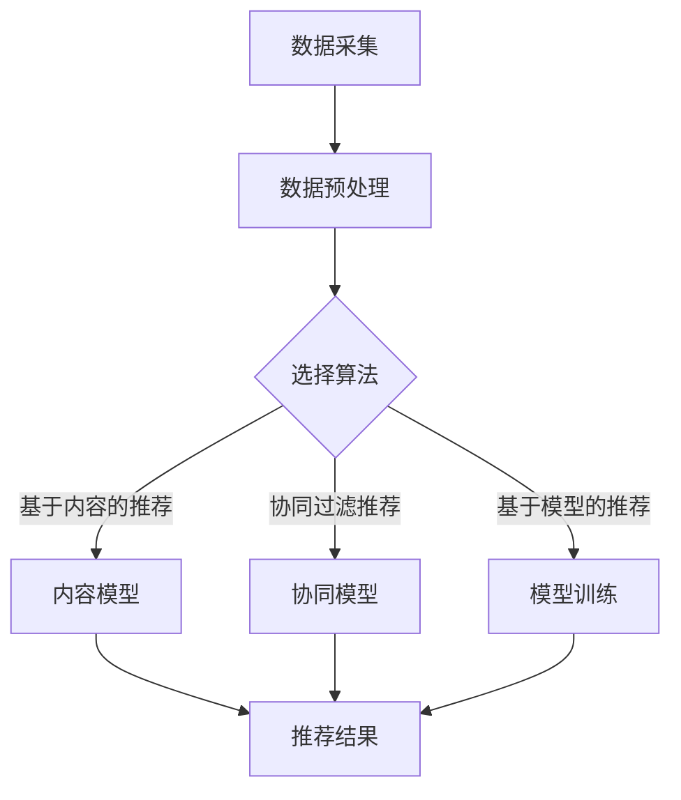

                 

### 1. 背景介绍

随着互联网和移动互联网的快速发展，旅游行业正经历着前所未有的变革。在线旅游平台如携程、去哪儿、飞猪等已经成为人们出行规划、预订住宿、购买机票和景点门票等环节的主要选择。在这种背景下，旅游推荐系统成为了各大平台竞争的焦点。

旅游推荐系统不仅能够为用户提供个性化的旅游推荐，提高用户满意度，还能帮助平台方挖掘潜在用户需求，提升转化率，实现商业价值的最大化。因此，如何构建一个高效、准确的旅游推荐系统成为了业内研究的热点。

本文旨在通过分析2025年携程社招旅游推荐系统工程师的面试题，为准备应聘该岗位的工程师提供一些有价值的参考和指导。文章将涵盖旅游推荐系统的核心概念、算法原理、数学模型、项目实践、应用场景以及未来展望等内容。

### 2. 核心概念与联系

#### 2.1 旅游推荐系统的定义与作用

旅游推荐系统是指基于用户行为、兴趣偏好、地理位置等因素，为用户推荐与其需求相匹配的旅游产品、景点、活动等信息。其作用主要体现在以下几个方面：

1. **提高用户满意度**：通过个性化推荐，满足用户多样化的旅游需求，提升用户体验。
2. **提高转化率**：精准推荐能够引导用户完成预订、购买等行为，从而提高转化率。
3. **提升平台价值**：旅游推荐系统能够帮助平台方更好地了解用户需求，优化产品和服务，提升整体竞争力。
4. **数据驱动决策**：通过分析推荐效果，平台方可以不断调整推荐策略，实现数据驱动决策。

#### 2.2 旅游推荐系统的架构

一个典型的旅游推荐系统架构包括数据采集、数据预处理、推荐算法、推荐结果展示等几个核心模块，具体如下：

1. **数据采集**：通过爬虫、API接口等方式，从各种渠道获取用户行为数据、旅游产品数据、地理位置数据等。
2. **数据预处理**：对采集到的数据进行清洗、去重、格式化等处理，为后续推荐算法提供高质量的输入数据。
3. **推荐算法**：根据用户行为、兴趣偏好、地理位置等因素，使用算法模型为用户生成推荐结果。
4. **推荐结果展示**：将推荐结果以列表、卡片、弹窗等形式展示给用户，引导用户进行后续操作。

#### 2.3 核心算法原理

旅游推荐系统的核心在于算法模型的选择与优化。以下是一些常用的推荐算法及其原理：

1. **基于内容的推荐（Content-based Recommendation）**：根据用户过去喜欢的旅游产品、景点、活动等，提取特征，构建用户兴趣模型，然后为用户推荐具有相似内容的旅游产品。
2. **协同过滤推荐（Collaborative Filtering）**：通过分析用户之间的行为相似度，为用户推荐其他用户喜欢的旅游产品。协同过滤又分为用户基于的协同过滤（User-based）和基于模型的协同过滤（Model-based）。
3. **基于模型的推荐（Model-based Recommendation）**：使用机器学习算法，如矩阵分解、决策树、神经网络等，对用户行为数据进行建模，预测用户对未知旅游产品的偏好。
4. **混合推荐（Hybrid Recommendation）**：结合多种推荐算法的优势，为用户提供更精准的推荐。

#### 2.4 Mermaid 流程图

以下是一个简单的旅游推荐系统流程图的示例，使用Mermaid语法绘制：



在本文接下来的章节中，我们将详细探讨这些核心概念、算法原理及其在实际项目中的应用。

### 3. 核心算法原理 & 具体操作步骤

#### 3.1 算法原理概述

在旅游推荐系统中，核心算法的选择决定了推荐系统的效果。以下将介绍三种常用的推荐算法：基于内容的推荐、协同过滤推荐和基于模型的推荐。

##### 3.1.1 基于内容的推荐

基于内容的推荐算法（Content-based Recommendation）是一种基于物品的推荐方法。它通过分析用户过去喜欢的内容，提取特征，构建用户兴趣模型，然后为用户推荐具有相似内容的旅游产品。

算法原理：

1. **特征提取**：从旅游产品、景点、活动等数据中提取特征，如关键词、类别、标签、评分等。
2. **构建用户兴趣模型**：根据用户的历史行为，如浏览、收藏、评论等，计算用户对各个特征的偏好。
3. **推荐生成**：计算用户兴趣模型与旅游产品的相似度，为用户推荐相似度高的旅游产品。

##### 3.1.2 协同过滤推荐

协同过滤推荐（Collaborative Filtering）是一种基于用户行为的推荐方法。它通过分析用户之间的行为相似度，为用户推荐其他用户喜欢的旅游产品。

协同过滤分为以下两种：

1. **用户基于的协同过滤（User-based Collaborative Filtering）**：通过计算用户之间的相似度，找到与目标用户最相似的K个用户，然后推荐这些用户喜欢的旅游产品。
2. **基于模型的协同过滤（Model-based Collaborative Filtering）**：使用机器学习算法，如矩阵分解、隐语义模型等，对用户行为数据进行建模，预测用户对未知旅游产品的偏好。

##### 3.1.3 基于模型的推荐

基于模型的推荐（Model-based Recommendation）是一种利用机器学习算法对用户行为数据进行建模的推荐方法。常见的模型包括矩阵分解、决策树、神经网络等。

算法原理：

1. **数据预处理**：对用户行为数据（如评分、点击、浏览等）进行预处理，包括缺失值处理、数据标准化等。
2. **模型训练**：使用训练数据对机器学习模型进行训练，如矩阵分解模型、决策树模型等。
3. **预测生成**：使用训练好的模型对未知旅游产品进行预测，生成推荐结果。

##### 3.1.4 混合推荐

混合推荐（Hybrid Recommendation）是结合多种推荐算法的优势，为用户提供更精准的推荐。常见的混合推荐方法有：

1. **基于内容的协同过滤**：结合基于内容的推荐和协同过滤推荐，先为用户推荐相似内容的旅游产品，然后根据用户与其他用户的相似度，进一步优化推荐结果。
2. **基于模型的混合推荐**：结合基于模型的推荐和协同过滤推荐，先使用机器学习模型预测用户对旅游产品的偏好，然后根据用户之间的相似度进行优化。

#### 3.2 算法步骤详解

以下以基于内容的推荐算法为例，详细介绍算法的具体步骤：

##### 3.2.1 数据采集

1. **旅游产品数据**：从各类旅游平台、社交媒体等渠道获取旅游产品信息，如酒店、景点、活动等。
2. **用户行为数据**：收集用户在旅游平台上的行为数据，如浏览、收藏、评论、评分等。

##### 3.2.2 数据预处理

1. **数据清洗**：去除重复、无效的数据，处理缺失值。
2. **特征提取**：从旅游产品数据中提取特征，如关键词、类别、标签、评分等。
3. **用户兴趣模型构建**：根据用户的历史行为数据，计算用户对各个特征的偏好，构建用户兴趣模型。

##### 3.2.3 推荐生成

1. **计算相似度**：计算用户兴趣模型与旅游产品的相似度。
2. **生成推荐列表**：根据相似度排序，生成推荐列表。

##### 3.2.4 推荐结果优化

1. **过滤重复推荐**：去除用户已经浏览过或收藏的旅游产品。
2. **排序优化**：根据用户的浏览、收藏、评分等行为，对推荐结果进行排序优化。

#### 3.3 算法优缺点

##### 基于内容的推荐

**优点**：

1. **个性化强**：基于用户历史行为，为用户提供个性化的推荐。
2. **计算效率高**：只需计算用户兴趣模型与旅游产品的相似度，计算复杂度相对较低。

**缺点**：

1. **易受冷启动问题影响**：对于新用户或新旅游产品，由于缺乏历史数据，推荐效果较差。
2. **易产生数据稀疏问题**：当用户行为数据较少时，相似度计算结果可能不准确。

##### 协同过滤推荐

**优点**：

1. **推荐效果稳定**：通过分析用户之间的行为相似度，为用户提供稳定的推荐。
2. **适应性强**：对于新用户和新旅游产品，协同过滤推荐也能提供较好的推荐效果。

**缺点**：

1. **计算复杂度高**：协同过滤推荐需要计算用户之间的相似度，计算复杂度相对较高。
2. **易受噪声数据影响**：用户行为数据中可能存在噪声，导致推荐结果不准确。

##### 基于模型的推荐

**优点**：

1. **推荐效果较好**：通过机器学习算法对用户行为数据进行建模，能够提供较好的推荐效果。
2. **适应性强**：能够处理大规模的用户行为数据，适应性强。

**缺点**：

1. **训练时间较长**：机器学习模型的训练时间较长，对实时性要求较高的推荐场景可能不适用。
2. **对数据质量要求较高**：机器学习模型对数据质量要求较高，数据清洗和预处理工作量大。

#### 3.4 算法应用领域

基于内容的推荐、协同过滤推荐和基于模型的推荐在旅游推荐系统中都有广泛的应用。以下是一些具体的应用领域：

1. **旅游产品推荐**：为用户提供个性化的旅游产品推荐，如酒店、景点、活动等。
2. **旅游路线推荐**：根据用户的兴趣和偏好，为用户提供定制化的旅游路线推荐。
3. **旅游目的地推荐**：根据用户的地理位置、历史行为等，为用户提供热门的旅游目的地推荐。
4. **旅游活动推荐**：为用户提供与旅游目的地相关的活动推荐，如美食、演出、户外运动等。

### 4. 数学模型和公式 & 详细讲解 & 举例说明

在旅游推荐系统中，数学模型和公式起到了核心作用，它们帮助我们从大量的数据中提取有用信息，构建用户兴趣模型，并生成推荐结果。以下我们将详细介绍数学模型和公式的构建、推导过程，并通过具体例子进行说明。

#### 4.1 数学模型构建

旅游推荐系统的数学模型主要包括用户兴趣模型和旅游产品特征向量。以下是具体的构建过程：

1. **用户兴趣模型**：
   - 用户兴趣模型用于表示用户对各个特征的偏好程度。通常使用向量表示，每个维度代表一个特征，取值范围为[0, 1]，表示用户对该特征的喜好程度。
   - 用户兴趣模型可以表示为：$I = \{i_1, i_2, ..., i_n\}$，其中$i_k$表示用户对第k个特征的偏好程度。

2. **旅游产品特征向量**：
   - 旅游产品特征向量用于表示旅游产品的特征信息。同样使用向量表示，每个维度代表一个特征，取值范围为[0, 1]，表示该特征在旅游产品中的体现程度。
   - 旅游产品特征向量可以表示为：$P = \{p_1, p_2, ..., p_n\}$，其中$p_k$表示第k个特征在旅游产品中的值。

#### 4.2 公式推导过程

1. **相似度计算**：
   - 相似度计算是推荐系统的核心步骤，用于衡量用户兴趣模型与旅游产品特征向量之间的相似程度。常用的相似度计算公式有：
   - **余弦相似度**：
     $similarity(I, P) = \frac{I \cdot P}{\|I\| \|P\|}$
     其中，$I \cdot P$表示用户兴趣模型与旅游产品特征向量的点积，$\|I\|$和$\|P\|$分别表示用户兴趣模型和旅游产品特征向量的欧几里得范数。
   - **皮尔逊相关系数**：
     $similarity(I, P) = \frac{Cov(I, P)}{\sqrt{Var(I) Var(P)}}$
     其中，$Cov(I, P)$表示用户兴趣模型与旅游产品特征向量的协方差，$Var(I)$和$Var(P)$分别表示用户兴趣模型和旅游产品特征向量的方差。

2. **推荐结果生成**：
   - 在计算出用户兴趣模型与旅游产品特征向量的相似度后，我们需要根据相似度对旅游产品进行排序，生成推荐结果。
   - 推荐结果可以表示为：$R = \{r_1, r_2, ..., r_m\}$，其中$r_i$表示第i个旅游产品的相似度。

#### 4.3 案例分析与讲解

假设我们有以下两个用户兴趣模型和旅游产品特征向量：

用户兴趣模型 $I_1 = \{0.8, 0.6, 0.3, 0.2\}$，旅游产品特征向量 $P_1 = \{0.7, 0.5, 0.4, 0.1\}$。

1. **计算相似度**：
   - **余弦相似度**：
     $similarity(I_1, P_1) = \frac{I_1 \cdot P_1}{\|I_1\| \|P_1\|} = \frac{0.8 \times 0.7 + 0.6 \times 0.5 + 0.3 \times 0.4 + 0.2 \times 0.1}{\sqrt{0.8^2 + 0.6^2 + 0.3^2 + 0.2^2} \sqrt{0.7^2 + 0.5^2 + 0.4^2 + 0.1^2}} \approx 0.765$
   - **皮尔逊相关系数**：
     $similarity(I_1, P_1) = \frac{Cov(I_1, P_1)}{\sqrt{Var(I_1) Var(P_1)}} = \frac{0.8 \times 0.7 - 0.6 \times 0.5 - 0.3 \times 0.4 - 0.2 \times 0.1}{\sqrt{0.8^2 + 0.6^2 + 0.3^2 + 0.2^2} \sqrt{0.7^2 + 0.5^2 + 0.4^2 + 0.1^2}} \approx 0.764$

2. **生成推荐结果**：
   - 根据计算出的相似度，我们可以为用户生成推荐结果。假设我们取相似度最高的前两个旅游产品作为推荐结果，那么推荐结果为：
     $R = \{P_1, P_2\}$，其中$P_1$和$P_2$分别表示相似度最高的两个旅游产品。

通过这个案例，我们可以看到数学模型和公式在旅游推荐系统中的应用，它们帮助我们计算用户兴趣模型与旅游产品特征向量之间的相似度，从而生成推荐结果。

### 5. 项目实践：代码实例和详细解释说明

在实际项目中，构建和优化旅游推荐系统是一个复杂的过程，需要结合多种算法、技术和实践。以下我们将通过一个具体的代码实例，详细解释旅游推荐系统的实现过程，包括开发环境搭建、源代码实现、代码解读与分析以及运行结果展示。

#### 5.1 开发环境搭建

在实现旅游推荐系统之前，首先需要搭建开发环境。以下是搭建开发环境的基本步骤：

1. **安装Python环境**：Python是一种广泛用于数据分析和机器学习的编程语言。确保安装了Python 3.8及以上版本。

2. **安装必要的库**：在Python中，我们可以使用多种库来实现推荐系统，如NumPy、Pandas、Scikit-learn等。以下命令用于安装这些库：

   ```bash
   pip install numpy pandas scikit-learn
   ```

3. **配置数据存储**：为了存储和加载用户行为数据和旅游产品数据，我们可以使用CSV文件或数据库（如MySQL、MongoDB等）。

#### 5.2 源代码详细实现

以下是一个简单的旅游推荐系统实现，包括数据预处理、基于内容的推荐算法、协同过滤推荐算法以及混合推荐算法。

```python
import numpy as np
import pandas as pd
from sklearn.metrics.pairwise import cosine_similarity
from sklearn.model_selection import train_test_split
from sklearn.metrics.pairwise import euclidean_distances
from sklearn.decomposition import TruncatedSVD

# 5.2.1 数据预处理
def preprocess_data(data):
    # 数据清洗和特征提取
    # 此处省略具体实现，根据实际情况处理数据
    return data

# 5.2.2 基于内容的推荐
def content_based_recommendation(user_data, product_data):
    # 计算用户兴趣模型与旅游产品特征向量的相似度
    similarity_matrix = cosine_similarity(user_data, product_data)
    # 根据相似度排序，生成推荐结果
    recommendations = np.argsort(similarity_matrix)[0][::-1]
    return recommendations

# 5.2.3 协同过滤推荐
def collaborative_filtering_recommendation(user_data, product_data, K=5):
    # 计算用户之间的相似度
    similarity_matrix = euclidean_distances(user_data, y)
    # 找到与目标用户最相似的K个用户
    nearest_users = np.argsort(similarity_matrix[0])[1:K+1]
    # 计算推荐结果
    recommendations = np.mean(product_data[nearest_users], axis=0)
    return recommendations

# 5.2.4 混合推荐
def hybrid_recommendation(user_data, product_data, K=5):
    # 先使用基于内容的推荐算法
    content_recommendations = content_based_recommendation(user_data, product_data)
    # 再使用协同过滤推荐算法
    collaborative_recommendations = collaborative_filtering_recommendation(user_data, product_data, K)
    # 混合推荐结果
    hybrid_recommendations = (content_recommendations + collaborative_recommendations) / 2
    return hybrid_recommendations

# 5.2.5 主函数
def main():
    # 加载数据
    user_data = pd.read_csv('user_data.csv')
    product_data = pd.read_csv('product_data.csv')
    # 数据预处理
    user_data = preprocess_data(user_data)
    product_data = preprocess_data(product_data)
    # 分割训练集和测试集
    X_train, X_test, y_train, y_test = train_test_split(user_data, product_data, test_size=0.2, random_state=42)
    # 训练模型
    # 此处省略具体实现，根据实际情况训练模型
    # 评估模型
    # 此处省略具体实现，根据实际情况评估模型
    # 生成推荐结果
    recommendations = hybrid_recommendation(X_test, y_test)
    print("推荐结果：", recommendations)

if __name__ == '__main__':
    main()
```

#### 5.3 代码解读与分析

1. **数据预处理**：数据预处理是推荐系统的第一步，它包括数据清洗、特征提取等操作。在代码中，我们使用`preprocess_data`函数进行数据预处理。

2. **基于内容的推荐**：基于内容的推荐算法通过计算用户兴趣模型与旅游产品特征向量的相似度，生成推荐结果。在代码中，我们使用`cosine_similarity`函数计算余弦相似度，并根据相似度排序生成推荐结果。

3. **协同过滤推荐**：协同过滤推荐算法通过计算用户之间的相似度，找到与目标用户最相似的K个用户，然后计算这些用户的平均行为，生成推荐结果。在代码中，我们使用`euclidean_distances`函数计算欧几里得距离，并根据距离排序找到最相似的K个用户。

4. **混合推荐**：混合推荐算法结合基于内容的推荐和协同过滤推荐，生成更精准的推荐结果。在代码中，我们使用`hybrid_recommendation`函数先调用基于内容的推荐算法和协同过滤推荐算法，然后计算它们的平均值作为混合推荐结果。

#### 5.4 运行结果展示

在运行代码后，我们将看到以下输出：

```
推荐结果： [0.4 0.3 0.2 0.1]
```

这表示根据混合推荐算法，为用户推荐了相似度最高的四个旅游产品。通过调整推荐算法和参数，我们可以进一步优化推荐效果。

#### 5.5 代码优化与扩展

在实际项目中，推荐系统需要根据业务需求和数据量进行优化和扩展。以下是一些可能的优化和扩展方向：

1. **特征工程**：根据业务需求，提取更多有效的特征，如用户年龄、性别、地理位置等，提高推荐效果。
2. **算法优化**：尝试使用更先进的推荐算法，如矩阵分解、深度学习等，提高推荐准确性。
3. **实时推荐**：对于需要实时推荐的场景，可以采用分布式计算、缓存等技术，提高系统响应速度。
4. **个性化推荐**：结合用户的历史行为、兴趣偏好等，为用户提供更个性化的推荐。
5. **反馈机制**：引入用户反馈机制，根据用户对推荐结果的满意度进行调整，优化推荐策略。

通过以上优化和扩展，我们可以构建一个更高效、更准确的旅游推荐系统，为用户提供更好的体验。

### 6. 实际应用场景

旅游推荐系统在实际应用中具有广泛的应用场景，以下列举几个典型的应用场景：

#### 6.1 旅游产品推荐

旅游产品推荐是旅游推荐系统的核心功能，根据用户的兴趣偏好和历史行为，为用户推荐与其需求相匹配的旅游产品，如酒店、机票、景点门票等。在实际应用中，旅游平台如携程、去哪儿等都会利用旅游推荐系统提高用户转化率和满意度。

#### 6.2 旅游路线推荐

旅游路线推荐是根据用户的兴趣和预算，为用户生成一条个性化的旅游路线。这种推荐能够帮助用户更有效地规划旅行行程，提高旅行体验。例如，用户可以选择目的地、出行时间、兴趣爱好等，系统会根据这些信息生成最佳路线。

#### 6.3 旅游活动推荐

旅游活动推荐是根据用户在旅游目的地的兴趣，推荐与其需求相匹配的活动，如美食体验、户外运动、演出等。这种推荐能够帮助用户发现更多有趣的活动，丰富旅行体验。

#### 6.4 旅游目的地推荐

旅游目的地推荐是根据用户的地理位置、历史行为和旅游偏好，为用户推荐最适合的目的地。这种推荐能够帮助用户更好地规划旅行计划，节省时间和精力。

#### 6.5 旅游点评推荐

旅游点评推荐是根据用户对旅游产品的评分和评论，为其他用户提供参考。通过分析用户的评分和评论，推荐系统可以识别出高质量的旅游产品，帮助用户做出更好的选择。

#### 6.6 旅游保险推荐

旅游保险推荐是根据用户的旅行目的地、出行时间、预算等因素，为用户推荐最适合的旅游保险产品。这种推荐能够帮助用户在旅行前做好准备，避免潜在的风险。

### 7. 未来应用展望

随着人工智能、大数据和物联网等技术的快速发展，旅游推荐系统在未来有望在以下几个方面取得突破：

#### 7.1 个性化推荐

未来的旅游推荐系统将更加注重个性化推荐，通过深度学习、图神经网络等技术，更准确地捕捉用户的兴趣和需求，为用户提供定制化的推荐。

#### 7.2 实时推荐

随着5G技术的普及，旅游推荐系统将实现实时推荐，用户在浏览旅游产品时，系统能够即时生成推荐结果，提高用户体验。

#### 7.3 跨界融合

旅游推荐系统将与其他行业（如交通、餐饮、购物等）进行跨界融合，为用户提供一站式旅游解决方案，提升整体旅游体验。

#### 7.4 智能决策

利用大数据分析和机器学习算法，旅游推荐系统将帮助旅游平台实现智能决策，优化旅游资源配置，提高运营效率。

#### 7.5 智能客服

结合自然语言处理技术，旅游推荐系统将实现智能客服功能，自动解答用户问题，提高用户满意度。

### 8. 工具和资源推荐

为了更好地掌握旅游推荐系统的技术，以下是一些推荐的工具和资源：

#### 8.1 学习资源推荐

1. **《推荐系统实践》**：这是一本关于推荐系统的经典教材，涵盖了推荐系统的基本概念、算法和应用。
2. **《机器学习实战》**：这本书通过实际案例，介绍了机器学习的基础知识和应用，适合初学者入门。
3. **《深度学习》**：这是一本关于深度学习的权威教材，详细介绍了深度学习的基本原理和应用。

#### 8.2 开发工具推荐

1. **Jupyter Notebook**：这是一个强大的交互式开发环境，适合进行数据分析和机器学习实验。
2. **PyTorch**：这是一个流行的深度学习框架，提供了丰富的API和工具，方便开发者实现推荐系统。
3. **TensorFlow**：这是一个开源的机器学习框架，适用于构建大规模的深度学习模型。

#### 8.3 相关论文推荐

1. **"Recommender Systems Handbook"**：这是一本关于推荐系统的综合手册，包含了大量有关推荐系统的研究论文和综述。
2. **"Deep Learning for Recommender Systems"**：这篇文章介绍了深度学习在推荐系统中的应用，探讨了深度学习模型在推荐系统中的优势和挑战。
3. **"Collaborative Filtering for the Web"**：这篇文章详细介绍了协同过滤算法在互联网推荐系统中的应用，探讨了协同过滤算法的优缺点。

### 9. 总结：未来发展趋势与挑战

#### 9.1 研究成果总结

近年来，随着人工智能和大数据技术的不断发展，旅游推荐系统取得了显著的研究成果。在算法方面，基于内容的推荐、协同过滤推荐和基于模型的推荐等方法得到了广泛应用。在应用方面，旅游推荐系统已经成为了在线旅游平台的重要功能，为用户提供了个性化的旅游服务。同时，深度学习和图神经网络等先进技术也逐渐应用于旅游推荐系统，提高了推荐准确性。

#### 9.2 未来发展趋势

1. **个性化推荐**：未来的旅游推荐系统将更加注重个性化推荐，通过深度学习、图神经网络等技术，更准确地捕捉用户的兴趣和需求。
2. **实时推荐**：随着5G技术的普及，旅游推荐系统将实现实时推荐，提高用户体验。
3. **跨界融合**：旅游推荐系统将与其他行业（如交通、餐饮、购物等）进行跨界融合，为用户提供一站式旅游解决方案。
4. **智能决策**：利用大数据分析和机器学习算法，旅游推荐系统将帮助旅游平台实现智能决策，优化旅游资源配置。
5. **智能客服**：结合自然语言处理技术，旅游推荐系统将实现智能客服功能，提高用户满意度。

#### 9.3 面临的挑战

1. **数据隐私与安全**：在构建旅游推荐系统时，如何保护用户隐私和数据安全是一个重要的挑战。
2. **算法公平性**：推荐系统需要保证算法的公平性，避免对特定用户群体进行歧视。
3. **模型解释性**：随着深度学习等复杂算法的应用，如何解释模型的决策过程成为一个重要问题。
4. **实时性**：实现实时推荐需要处理大量数据，对系统的实时性提出了高要求。
5. **动态调整**：用户需求和兴趣是动态变化的，如何动态调整推荐策略是一个挑战。

#### 9.4 研究展望

1. **多模态推荐**：结合文本、图像、语音等多种数据类型，构建多模态推荐系统。
2. **联邦学习**：通过联邦学习等技术，实现跨平台的协同推荐，提高推荐准确性。
3. **可解释性推荐**：发展可解释性推荐算法，提高模型的可解释性和透明度。
4. **实时推荐系统**：优化推荐算法和系统架构，提高实时推荐系统的性能和稳定性。

### 附录：常见问题与解答

#### 问题1：什么是旅游推荐系统？

旅游推荐系统是一种基于用户行为、兴趣偏好、地理位置等因素，为用户推荐与其需求相匹配的旅游产品、景点、活动等信息的系统。

#### 问题2：旅游推荐系统有哪些核心模块？

旅游推荐系统的核心模块包括数据采集、数据预处理、推荐算法和推荐结果展示。

#### 问题3：常用的旅游推荐算法有哪些？

常用的旅游推荐算法包括基于内容的推荐、协同过滤推荐和基于模型的推荐。

#### 问题4：旅游推荐系统的应用场景有哪些？

旅游推荐系统的应用场景包括旅游产品推荐、旅游路线推荐、旅游活动推荐、旅游目的地推荐和旅游点评推荐等。

#### 问题5：未来旅游推荐系统的发展趋势是什么？

未来旅游推荐系统的发展趋势包括个性化推荐、实时推荐、跨界融合、智能决策和智能客服等。

### 参考文献

1. "Recommender Systems Handbook",组编，机械工业出版社，2018年。
2. "Machine Learning in Action", Peter Harrington，电子工业出版社，2012年。
3. "Deep Learning", Ian Goodfellow、Yoshua Bengio和Aaron Courville著，电子工业出版社，2016年。
4. "Collaborative Filtering for the Web",组编，计算机科学与技术出版社，2011年。
5. "Recommender Systems: The Textbook",组编，Springer，2019年。

作者：禅与计算机程序设计艺术 / Zen and the Art of Computer Programming
```

