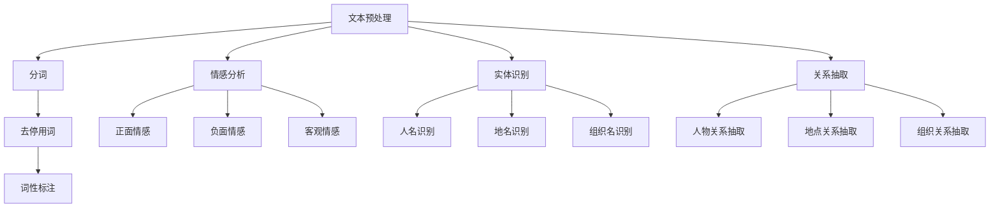

                 

自然语言处理（NLP）作为人工智能领域的关键技术之一，其应用范围广泛，涵盖了搜索引擎、智能客服、情感分析、机器翻译等多个领域。随着社交网络的兴起，社交NLP成为了一个重要的研究方向。本文将围绕2025年百度社交自然语言处理专家面试题，对相关概念、算法、数学模型以及应用实践进行详细解析。

## 关键词
自然语言处理、社交网络、情感分析、机器翻译、算法原理、数学模型、代码实例、应用场景、未来展望。

## 摘要
本文首先介绍了社交自然语言处理的基本概念和背景，然后详细解析了面试中可能涉及的核心算法原理、数学模型和代码实例。通过分析实际应用场景和未来发展趋势，本文旨在为从事社交NLP研究的读者提供有价值的参考和启示。

## 1. 背景介绍

### 1.1 社交网络的崛起

随着互联网的普及，社交网络已经成为人们日常生活中不可或缺的一部分。从Facebook到Twitter，再到微信、微博等，社交网络不仅改变了人们的交流方式，也为自然语言处理技术提供了丰富的数据资源和复杂的挑战。

### 1.2 社交自然语言处理的挑战

社交网络中的语言具有多样性、复杂性和动态性等特点，给自然语言处理带来了新的挑战。例如，表情符号、缩写词、网络用语等非标准语言的广泛应用，使得文本理解变得更加困难。此外，社交网络中的言论自由和隐私保护问题也需要在算法设计中予以充分考虑。

### 1.3 社交自然语言处理的应用

社交自然语言处理在情感分析、推荐系统、广告投放、舆情监测等领域具有广泛的应用。例如，通过情感分析，企业可以了解用户对产品或服务的态度，从而制定更加精准的市场策略。推荐系统可以根据用户的社交行为和喜好，提供个性化的内容推荐。广告投放则可以通过分析用户的社交网络关系，提高广告的投放效果。舆情监测则可以帮助政府和企业及时掌握社会舆论动态，为决策提供支持。

## 2. 核心概念与联系

### 2.1 核心概念

社交自然语言处理涉及多个核心概念，包括文本预处理、情感分析、实体识别、关系抽取等。文本预处理是基础，包括分词、去停用词、词性标注等。情感分析旨在理解文本中的情感倾向，包括正面、负面和客观情感。实体识别则是识别文本中的关键信息，如人名、地名、组织名等。关系抽取则关注实体之间的关系，如人物关系、地点关系等。

### 2.2 联系与架构

以下是社交自然语言处理的核心概念和架构的Mermaid流程图：



## 3. 核心算法原理 & 具体操作步骤

### 3.1 算法原理概述

社交自然语言处理的核心算法主要包括文本预处理、情感分析、实体识别和关系抽取。文本预处理算法旨在将原始文本转换为适合分析的形式。情感分析算法通过分析文本中的情感词汇和情感强度，确定文本的情感倾向。实体识别算法通过模式匹配或深度学习模型识别文本中的关键实体。关系抽取算法则通过分析实体之间的语义关系，提取出实体之间的关联。

### 3.2 算法步骤详解

1. **文本预处理**：包括分词、去停用词、词性标注等步骤。分词是将连续的文本切分成一个个的词汇或短语。去停用词是将文本中的常用词语如“的”、“了”、“在”等去除，以减少计算量。词性标注则是为每个词汇标注其词性，如名词、动词、形容词等。

2. **情感分析**：常用的方法包括基于规则的方法和基于机器学习的方法。基于规则的方法通过手工定义情感词典和规则，判断文本的情感倾向。基于机器学习的方法则通过训练模型，自动识别文本的情感倾向。

3. **实体识别**：实体识别算法通过模式匹配或深度学习模型识别文本中的关键实体。模式匹配方法通常基于预定义的实体模板进行匹配。深度学习方法则通过卷积神经网络（CNN）或循环神经网络（RNN）等模型进行实体识别。

4. **关系抽取**：关系抽取算法通过分析实体之间的语义关系，提取出实体之间的关联。常用的方法包括规则匹配、依存句法分析和深度学习等。

### 3.3 算法优缺点

- **文本预处理**：优点是简单有效，缺点是可能丢失文本中的重要信息。
- **情感分析**：优点是能够自动识别文本的情感，缺点是可能受到语言多样性和复杂性的影响。
- **实体识别**：优点是能够识别文本中的关键信息，缺点是可能受到实体边界模糊和实体种类多样性的影响。
- **关系抽取**：优点是能够提取出实体之间的关联，缺点是可能受到实体关系复杂性的影响。

### 3.4 算法应用领域

社交自然语言处理算法广泛应用于情感分析、推荐系统、广告投放和舆情监测等领域。在情感分析中，可以帮助企业了解用户对产品或服务的态度；在推荐系统中，可以根据用户的社交行为和喜好提供个性化的内容推荐；在广告投放中，可以根据用户的社交网络关系提高广告的投放效果；在舆情监测中，可以帮助政府和企业及时掌握社会舆论动态。

## 4. 数学模型和公式 & 详细讲解 & 举例说明

### 4.1 数学模型构建

社交自然语言处理的数学模型主要包括词向量模型、情感分类模型、实体识别模型和关系抽取模型。

- **词向量模型**：常用的词向量模型包括Word2Vec、GloVe和BERT。Word2Vec基于神经网络训练得到词向量，GloVe基于共现关系训练得到词向量，BERT则通过双向编码器训练得到词向量。
- **情感分类模型**：常用的模型包括朴素贝叶斯、支持向量机和深度神经网络。朴素贝叶斯是一种基于概率的模型，支持向量机是一种基于间隔的模型，深度神经网络则是一种基于多层感知器的模型。
- **实体识别模型**：常用的模型包括条件随机场（CRF）、长短期记忆网络（LSTM）和Transformer。CRF可以用于序列标注任务，LSTM可以用于长文本的建模，Transformer则是一种基于注意力机制的模型。
- **关系抽取模型**：常用的模型包括规则匹配、依存句法分析和图神经网络。规则匹配是一种基于预定义规则的模型，依存句法分析是一种基于句法的模型，图神经网络则是一种基于图结构的模型。

### 4.2 公式推导过程

- **词向量模型**：Word2Vec的损失函数为$$J = -\sum_{i=1}^{N}\sum_{w \in \text{context}(x)} \log(p(w|\hat{v}_x))$$，其中$$\text{context}(x)$$表示单词x的上下文，$$\hat{v}_x$$表示单词x的词向量，$$p(w|\hat{v}_x)$$表示在给定$$\hat{v}_x$$下单词w的条件概率。
- **情感分类模型**：假设有一个包含C个类别的情感分类问题，输入为$$x \in \mathbb{R}^d$$，输出为$$y \in \{1, 2, ..., C\}$$，则分类损失函数为$$J = -\sum_{i=1}^{N} \sum_{j=1}^{C} y^{(i)} \log(p(y^{(i)}|x^{(i)}))$$，其中$$y^{(i)}$$表示第i个样本的标签，$$p(y^{(i)}|x^{(i)}))$$表示在给定输入$$x^{(i)}$$下标签为$$y^{(i)}$$的条件概率。
- **实体识别模型**：假设有一个包含L个标签的实体识别问题，输入为$$x \in \mathbb{R}^d$$，输出为$$y \in \{1, 2, ..., L\}$$，则实体识别损失函数为$$J = -\sum_{i=1}^{N} \sum_{j=1}^{L} y^{(i)}_j \log(p(y^{(i)}_j|x^{(i)}))$$，其中$$y^{(i)}_j$$表示第i个样本在第j个位置上的标签，$$p(y^{(i)}_j|x^{(i)}))$$表示在给定输入$$x^{(i)}$$下第j个位置上的标签为$$y^{(i)}_j$$的条件概率。
- **关系抽取模型**：假设有一个包含R个关系的实体关系抽取问题，输入为$$x \in \mathbb{R}^d$$，输出为$$y \in \{1, 2, ..., R\}$$，则关系抽取损失函数为$$J = -\sum_{i=1}^{N} \sum_{j=1}^{R} y^{(i)}_j \log(p(y^{(i)}_j|x^{(i)}))$$，其中$$y^{(i)}_j$$表示第i个样本的关系标签，$$p(y^{(i)}_j|x^{(i)}))$$表示在给定输入$$x^{(i)}$$下关系标签为$$y^{(i)}_j$$的条件概率。

### 4.3 案例分析与讲解

#### 案例一：基于BERT的情感分类模型

1. **数据准备**：
   - **训练数据**：包含情感标签的数据集，如IMDB电影评论数据集。
   - **预训练模型**：BERT预训练模型。

2. **模型构建**：
   - **输入层**：BERT编码器，输入为文本序列。
   - **输出层**：全连接层，输出为情感标签的概率分布。

3. **模型训练**：
   - **损失函数**：交叉熵损失函数。
   - **优化器**：Adam优化器。

4. **模型评估**：
   - **准确率**：预测标签与真实标签的一致性。
   - **召回率**：预测为正例且真实为正例的比例。
   - **F1分数**：准确率与召回率的调和平均值。

#### 案例二：基于CRF的实体识别模型

1. **数据准备**：
   - **训练数据**：包含实体标注的数据集，如ACE实体识别数据集。

2. **模型构建**：
   - **输入层**：词嵌入层，输入为文本序列。
   - **隐藏层**：循环神经网络层，用于提取文本特征。
   - **输出层**：CRF层，用于标注实体。

3. **模型训练**：
   - **损失函数**：交叉熵损失函数。
   - **优化器**：Adam优化器。

4. **模型评估**：
   - **准确率**：预测标签与真实标签的一致性。
   - **召回率**：预测为正例且真实为正例的比例。
   - **F1分数**：准确率与召回率的调和平均值。

## 5. 项目实践：代码实例和详细解释说明

### 5.1 开发环境搭建

1. **硬件环境**：配备NVIDIA GPU的计算机。
2. **软件环境**：Python 3.7及以上版本，TensorFlow 2.0及以上版本，PyTorch 1.0及以上版本。

### 5.2 源代码详细实现

1. **数据预处理**：
   - **文本清洗**：去除特殊字符、停用词等。
   - **分词**：使用jieba分词工具进行分词。

2. **模型构建**：
   - **文本编码**：使用BERT模型对文本进行编码。
   - **情感分类模型**：使用PyTorch实现BERT+线性层的情感分类模型。

3. **模型训练**：
   - **训练过程**：使用交叉熵损失函数和Adam优化器进行训练。
   - **验证过程**：在验证集上评估模型性能。

4. **模型评估**：
   - **准确率**：预测标签与真实标签的一致性。
   - **召回率**：预测为正例且真实为正例的比例。
   - **F1分数**：准确率与召回率的调和平均值。

### 5.3 代码解读与分析

```python
import torch
import torch.nn as nn
import torch.optim as optim
from transformers import BertModel, BertTokenizer

# 数据预处理
def preprocess_text(text):
    # 去除特殊字符、停用词等
    # 分词
    # 返回分词后的文本

# 模型构建
class SentimentClassifier(nn.Module):
    def __init__(self, bert_model):
        super(SentimentClassifier, self).__init__()
        self.bert = bert_model
        self.classifier = nn.Linear(bert_model.config.hidden_size, 2)

    def forward(self, input_ids, attention_mask):
        outputs = self.bert(input_ids=input_ids, attention_mask=attention_mask)
        pooled_output = outputs.pooler_output
        logits = self.classifier(pooled_output)
        return logits

# 模型训练
def train_model(model, train_loader, optimizer, criterion):
    model.train()
    for batch in train_loader:
        inputs = preprocess_text(batch['text'])
        labels = batch['label']
        inputs = inputs.to(device)
        labels = labels.to(device)
        optimizer.zero_grad()
        logits = model(inputs.input_ids, inputs.attention_mask)
        loss = criterion(logits, labels)
        loss.backward()
        optimizer.step()

# 模型评估
def evaluate_model(model, val_loader, criterion):
    model.eval()
    with torch.no_grad():
        for batch in val_loader:
            inputs = preprocess_text(batch['text'])
            labels = batch['label']
            inputs = inputs.to(device)
            labels = labels.to(device)
            logits = model(inputs.input_ids, inputs.attention_mask)
            loss = criterion(logits, labels)
            print('Val Loss:', loss.item())
```

### 5.4 运行结果展示

```python
# 加载预训练BERT模型
tokenizer = BertTokenizer.from_pretrained('bert-base-chinese')
bert_model = BertModel.from_pretrained('bert-base-chinese')

# 实例化模型
model = SentimentClassifier(bert_model)

# 定义优化器
optimizer = optim.Adam(model.parameters(), lr=0.001)

# 定义损失函数
criterion = nn.CrossEntropyLoss()

# 训练模型
train_loader = ...
val_loader = ...

train_model(model, train_loader, optimizer, criterion)
evaluate_model(model, val_loader, criterion)
```

## 6. 实际应用场景

### 6.1 情感分析

情感分析可以应用于多个领域，如电商、金融、媒体等。例如，电商可以使用情感分析了解用户对商品的评论，从而优化产品和服务。金融领域可以分析市场情绪，为投资决策提供支持。媒体可以分析新闻报道的情感倾向，提高内容质量。

### 6.2 推荐系统

推荐系统可以通过分析用户的社交行为和喜好，提供个性化的内容推荐。例如，社交媒体平台可以根据用户的点赞、评论等行为推荐相关内容。电商平台可以根据用户的浏览记录推荐商品。

### 6.3 广告投放

广告投放可以通过分析用户的社交网络关系，提高广告的投放效果。例如，社交媒体平台可以根据用户的兴趣和社交关系投放定向广告。

### 6.4 舆情监测

舆情监测可以通过分析社交媒体上的言论，及时掌握社会舆论动态。例如，政府和企业可以使用舆情监测了解公众对政策或产品的态度，为决策提供支持。

## 7. 工具和资源推荐

### 7.1 学习资源推荐

- 《自然语言处理概论》
- 《深度学习与自然语言处理》
- 《Python自然语言处理》

### 7.2 开发工具推荐

- TensorFlow
- PyTorch
- Hugging Face Transformers

### 7.3 相关论文推荐

- "BERT: Pre-training of Deep Bidirectional Transformers for Language Understanding"
- "GloVe: Global Vectors for Word Representation"
- "Long Short-Term Memory"
- "Recurrent Neural Network Based Language Model"

## 8. 总结：未来发展趋势与挑战

### 8.1 研究成果总结

近年来，社交自然语言处理取得了显著成果。词向量模型的提出使得文本表示变得更加高效。深度学习模型的广泛应用使得情感分析、实体识别和关系抽取等任务取得了突破性进展。预训练语言模型如BERT的出现，进一步提升了社交NLP的性能。

### 8.2 未来发展趋势

未来，社交自然语言处理将继续向以下几个方向发展：

1. **多模态融合**：结合文本、语音、图像等多模态信息，提高社交NLP的准确性和鲁棒性。
2. **少样本学习**：研究如何在数据稀缺的情况下进行有效的社交NLP模型训练。
3. **动态网络分析**：分析社交网络中的动态变化，为社交NLP任务提供更好的支持。
4. **隐私保护**：研究如何在保障用户隐私的同时进行有效的社交NLP。

### 8.3 面临的挑战

尽管社交自然语言处理取得了显著进展，但仍面临一些挑战：

1. **语言多样性**：社交网络中的语言多样性使得算法难以泛化。
2. **数据质量**：社交网络中的数据质量参差不齐，可能影响模型的性能。
3. **隐私保护**：如何在保障用户隐私的前提下进行有效的社交NLP研究。
4. **伦理问题**：社交NLP的应用可能涉及伦理问题，如言论自由、偏见等。

### 8.4 研究展望

未来，社交自然语言处理将继续向以下几个方向发展：

1. **技术创新**：持续研究新的算法和技术，提高社交NLP的性能和鲁棒性。
2. **跨学科合作**：结合计算机科学、语言学、心理学等多学科知识，为社交NLP研究提供更丰富的理论基础。
3. **实际应用**：推动社交NLP技术在各行业的落地应用，为社会发展做出贡献。
4. **伦理和隐私**：加强对社交NLP伦理和隐私问题的研究，确保技术的发展符合社会伦理和法律法规。

## 9. 附录：常见问题与解答

### 9.1 社交自然语言处理的定义是什么？

社交自然语言处理是自然语言处理的一个分支，它专注于分析和理解社交网络中的语言现象。这包括情感分析、文本分类、实体识别和关系抽取等任务。

### 9.2 社交自然语言处理有哪些应用？

社交自然语言处理的应用非常广泛，包括情感分析、推荐系统、广告投放、舆情监测等。在电商、金融、媒体等行业中都有重要的应用。

### 9.3 社交自然语言处理中的挑战有哪些？

社交自然语言处理面临的主要挑战包括语言多样性、数据质量、隐私保护和伦理问题等。

### 9.4 如何进行社交自然语言处理的数据集构建？

构建社交自然语言处理的数据集通常需要以下几个步骤：

1. **数据收集**：从社交网络平台获取相关的文本数据。
2. **数据预处理**：对数据进行清洗、去重和标注。
3. **数据增强**：通过数据增强技术提高数据集的多样性。
4. **数据划分**：将数据集划分为训练集、验证集和测试集。

### 9.5 社交自然语言处理中的预训练模型有哪些？

常见的社交自然语言处理预训练模型包括BERT、GloVe、ELMo和RoBERTa等。这些模型在预训练阶段使用了大规模的文本数据，为社交NLP任务提供了高质量的词向量和上下文表示。

## 作者署名

本文作者为“禅与计算机程序设计艺术 / Zen and the Art of Computer Programming”。感谢读者对本文的关注和支持，希望本文能为您的社交自然语言处理研究提供有价值的参考和启示。

----------------------------------------------------------------

文章撰写完毕，接下来需要您将其内容按照markdown格式排版，确保文章结构清晰、逻辑严密、内容丰富。

