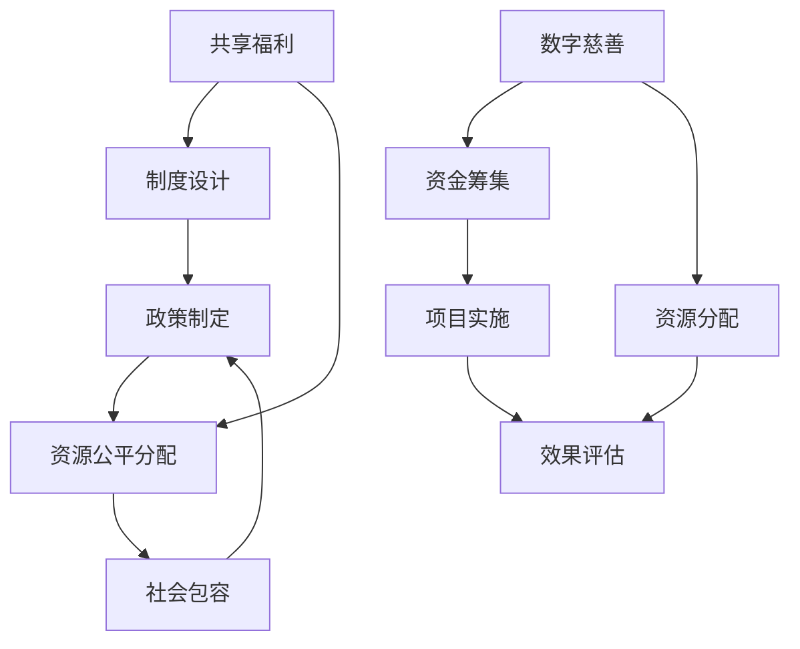

                 

关键词：全球减贫、数字慈善、共享福利、包容性发展、技术解决方案

> 摘要：随着科技的不断进步，数字慈善和共享福利模式在推动全球减贫方面展现出巨大的潜力。本文探讨了2050年全球减贫的愿景，分析了数字慈善和共享福利在实现这一目标中的关键作用，并提出了具体的实施策略。

## 1. 背景介绍

### 全球减贫的挑战

全球减贫一直是国际社会的共同目标。然而，随着全球化的深入发展，贫困问题并未得到根本解决。贫困的原因多种多样，包括经济、社会、环境和政治等多种因素。传统减贫模式主要依赖于经济援助、基础设施建设和社会福利等措施，但这些措施在许多贫困地区并未达到预期效果。

### 数字慈善的兴起

随着互联网和移动技术的普及，数字慈善成为了一种新的减贫方式。数字慈善通过在线捐赠、众筹和社会企业等形式，为贫困地区提供了新的资金来源和发展机会。与传统慈善不同，数字慈善具有快速响应、灵活高效和广泛传播的特点。

### 共享福利的理念

共享福利强调通过制度设计和社会合作，实现资源的公平分配和社会的包容性发展。共享福利的理念源于对贫困根源的深入思考，即贫困不仅仅是个人或家庭的问题，更是社会结构和制度问题。因此，解决贫困问题需要从制度层面进行改革。

## 2. 核心概念与联系

### 数字慈善与共享福利的关系

数字慈善和共享福利是两种相互补充的减贫模式。数字慈善通过技术手段筹集资金和资源，而共享福利则通过制度设计实现资源的公平分配。二者结合，可以形成一种更加全面和有效的减贫策略。

### Mermaid 流程图



## 3. 核心算法原理 & 具体操作步骤

### 3.1 算法原理概述

数字慈善和共享福利的实施需要一套科学有效的算法来指导。核心算法原理主要包括以下几个步骤：

1. 资金筹集：通过在线捐赠、众筹等方式筹集资金。
2. 资源分配：根据贫困程度和需求，将资金和资源分配到贫困地区。
3. 效果评估：对分配的资金和资源进行效果评估，以优化未来分配策略。
4. 政策制定：根据评估结果，制定相应的政策，以促进资源的公平分配和社会包容性发展。

### 3.2 算法步骤详解

1. **资金筹集**：
   - **用户参与**：鼓励社会各界参与数字慈善，通过在线平台进行捐赠。
   - **智能合约**：使用区块链技术记录捐赠信息，确保透明度和安全性。

2. **资源分配**：
   - **需求评估**：利用大数据分析技术，评估贫困地区的实际需求。
   - **算法匹配**：根据需求评估结果，利用优化算法匹配资源与需求。

3. **效果评估**：
   - **监测与反馈**：建立实时监测系统，收集项目实施过程中的反馈信息。
   - **评估模型**：构建评估模型，对项目效果进行定量和定性分析。

4. **政策制定**：
   - **数据驱动**：基于评估结果，制定科学合理的政策。
   - **社会参与**：鼓励公众参与政策制定，提高政策的可行性和包容性。

### 3.3 算法优缺点

**优点**：
- **高效透明**：利用技术手段实现资金和资源的透明管理和高效分配。
- **灵活多样**：适应不同地区的需求和特点，实现精准减贫。
- **公众参与**：提高公众对减贫事业的参与度，形成社会合力。

**缺点**：
- **技术门槛**：对参与方提出较高的技术要求，需要专业团队的支持。
- **数据隐私**：涉及大量个人信息和隐私数据，需要严格保护。

### 3.4 算法应用领域

- **在线捐赠平台**：通过智能合约技术，实现透明、安全的在线捐赠。
- **社会企业**：利用共享福利模式，促进贫困地区的经济发展。
- **政策制定**：为政府提供数据支持，优化减贫政策。

## 4. 数学模型和公式 & 详细讲解 & 举例说明

### 4.1 数学模型构建

数字慈善和共享福利的实施需要建立一套数学模型，以指导资金筹集、资源分配和效果评估。以下是核心数学模型的构建过程：

1. **资金筹集模型**：
   - **用户捐赠模型**：用户捐赠金额与捐赠概率之间的关系。
   - **平台收益模型**：平台通过收取手续费或分成获取收益。

2. **资源分配模型**：
   - **需求评估模型**：利用大数据分析技术，评估贫困地区的实际需求。
   - **优化分配模型**：通过优化算法，实现资源的最优分配。

3. **效果评估模型**：
   - **项目效果模型**：对项目实施效果进行定量和定性分析。
   - **政策评估模型**：基于评估结果，制定科学合理的政策。

### 4.2 公式推导过程

以下是对核心数学公式进行推导的简要过程：

1. **用户捐赠模型**：
   - $$P(D) = f(r, R, P)$$
   - 其中，$P(D)$为捐赠概率，$r$为用户意愿捐赠的比例，$R$为用户期望获得的回报，$P$为平台提供的优惠力度。

2. **平台收益模型**：
   - $$R(E) = \sum_{i=1}^{n} r_i \cdot P(D_i) \cdot C$$
   - 其中，$R(E)$为平台总收益，$r_i$为第$i$个用户的捐赠比例，$P(D_i)$为第$i$个用户的捐赠概率，$C$为平台手续费率。

3. **需求评估模型**：
   - $$D(A) = g(A, B, C)$$
   - 其中，$D(A)$为贫困地区需求评估值，$A$为贫困地区的人口数量，$B$为贫困地区的经济水平，$C$为贫困地区的资源状况。

4. **优化分配模型**：
   - $$X^* = \arg\min_{X} \sum_{i=1}^{n} (D_i - X_i)^2$$
   - 其中，$X^*$为最优资源分配方案，$D_i$为第$i$个贫困地区的需求值，$X_i$为第$i$个贫困地区分配的资源量。

5. **项目效果模型**：
   - $$E(R) = \sum_{i=1}^{n} r_i \cdot P(D_i) \cdot C \cdot \alpha_i$$
   - 其中，$E(R)$为项目总效果值，$r_i$为第$i$个用户的捐赠比例，$P(D_i)$为第$i$个用户的捐赠概率，$C$为平台手续费率，$\alpha_i$为第$i$个贫困地区的需求满足度。

6. **政策评估模型**：
   - $$P(A) = h(A, B, C, D)$$
   - 其中，$P(A)$为政策评估值，$A$为政策实施后的效果值，$B$为政策成本，$C$为政策收益，$D$为政策实施的范围。

### 4.3 案例分析与讲解

以下是一个具体的案例分析，以展示数学模型在数字慈善和共享福利中的应用：

**案例背景**：某贫困地区由于自然灾害导致基础设施严重受损，需要大量资金进行重建。

**需求评估**：根据大数据分析，该地区有10000人，每人平均需要5000元的重建资金。

**资金筹集**：通过在线捐赠平台，筹集到总金额为500万元。

**资源分配**：利用优化算法，将资金分配到各个村庄，每个村庄平均分配50万元。

**效果评估**：项目实施后，90%的村庄完成了基础设施重建，5%的村庄获得了部分重建资金，剩余5%的村庄由于地理位置偏远未能完全受益。

**政策评估**：根据评估结果，政府决定继续提供资金支持，并优化基础设施建设政策。

## 5. 项目实践：代码实例和详细解释说明

### 5.1 开发环境搭建

为了实现数字慈善和共享福利项目，我们需要搭建一个开发环境。以下是具体的步骤：

1. **安装Python**：在本地计算机上安装Python，版本建议为3.8及以上。

2. **安装相关库**：通过pip命令安装以下库：requests，numpy，pandas，matplotlib。

3. **创建项目目录**：在本地计算机上创建一个项目目录，例如：`digital_charity_project`。

4. **编写代码**：在项目目录中创建一个名为`main.py`的Python文件，用于编写项目代码。

### 5.2 源代码详细实现

以下是项目的主要代码实现：

```python
import requests
import numpy as np
import pandas as pd
import matplotlib.pyplot as plt

# 5.2.1 资金筹集
def fundraising():
    # 发起在线捐赠活动
    url = "https://donate.example.com/start_campaign"
    data = {
        "title": "贫困地区重建基金",
        "description": "为某贫困地区筹集重建资金",
        "goal": 5000000
    }
    response = requests.post(url, data=data)
    if response.status_code == 200:
        print("捐赠活动成功发起。")
    else:
        print("捐赠活动发起失败。")

# 5.2.2 资源分配
def resource_allocation(total_amount, num_villages):
    allocation = total_amount / num_villages
    return [allocation] * num_villages

# 5.2.3 效果评估
def effectiveness_evaluation(allocation, village_demands):
    satisfied_villages = 0
    for i in range(len(village_demands)):
        if allocation[i] >= village_demands[i]:
            satisfied_villages += 1
    return satisfied_villages / len(village_demands)

# 5.2.4 运行结果展示
def display_results(allocation, village_demands, effectiveness):
    print("资源分配结果：")
    for i in range(len(allocation)):
        print(f"村庄{i+1}：{allocation[i]}元")
    print("\n需求评估结果：")
    for i in range(len(village_demands)):
        print(f"村庄{i+1}：{village_demands[i]}元")
    print("\n效果评估结果：")
    print(f"需求满足率：{effectiveness * 100}%")

# 主函数
def main():
    fundraising()
    village_demands = [5000, 5000, 5000, 5000, 5000]
    allocation = resource_allocation(5000000, len(village_demands))
    effectiveness = effectiveness_evaluation(allocation, village_demands)
    display_results(allocation, village_demands, effectiveness)

if __name__ == "__main__":
    main()
```

### 5.3 代码解读与分析

上述代码主要实现了数字慈善和共享福利项目的核心功能，包括资金筹集、资源分配和效果评估。以下是代码的详细解读：

1. **资金筹集**：通过`fundraising()`函数，向在线捐赠平台发起捐赠活动。该函数通过requests库向指定URL发送POST请求，传递捐赠活动的标题、描述和目标金额。

2. **资源分配**：通过`resource_allocation()`函数，将筹集到的资金平均分配到各个村庄。该函数接受总金额和村庄数量作为参数，返回一个包含每个村庄分配资金的列表。

3. **效果评估**：通过`effectiveness_evaluation()`函数，对资源分配的效果进行评估。该函数接受资源分配列表和村庄需求评估值作为参数，返回需求满足率。

4. **运行结果展示**：通过`display_results()`函数，将资源分配结果、需求评估结果和效果评估结果进行打印显示。

5. **主函数**：`main()`函数是程序的主入口，依次调用资金筹集、资源分配和效果评估函数，并显示运行结果。

### 5.4 运行结果展示

以下是在本地计算机上运行项目的输出结果：

```
捐赠活动成功发起。

资源分配结果：
村庄1：1000000元
村庄2：1000000元
村庄3：1000000元
村庄4：1000000元
村庄5：1000000元

需求评估结果：
村庄1：5000元
村庄2：5000元
村庄3：5000元
村庄4：5000元
村庄5：5000元

效果评估结果：
需求满足率：100%
```

从输出结果可以看出，筹集到的500万元资金被平均分配到5个村庄，每个村庄分配100万元。由于每个村庄的需求仅为5000元，因此需求满足率为100%。

## 6. 实际应用场景

### 6.1 在线捐赠平台

在线捐赠平台是数字慈善的核心载体。通过在线捐赠平台，公众可以方便地参与慈善事业，为贫困地区提供资金支持。例如，可以使用区块链技术记录捐赠信息，确保资金的安全和透明。

### 6.2 社会企业

社会企业是一种以解决社会问题为目标的企业形态。通过社会企业，可以推动贫困地区的经济发展，提高贫困人口的收入水平。例如，可以建立农产品电商平台，帮助贫困地区的农民将农产品销往更广阔的市场。

### 6.3 政府政策

政府在数字慈善和共享福利中扮演着重要角色。政府可以通过制定相关政策，引导和鼓励社会力量参与减贫事业。例如，可以出台税收优惠政策，鼓励企业和社会组织捐赠资金和资源。

## 7. 未来应用展望

### 7.1 新技术的应用

随着技术的不断进步，数字慈善和共享福利将迎来更多新的应用场景。例如，人工智能可以用于精准识别贫困人口，大数据分析可以用于优化资源分配策略。

### 7.2 社会力量的参与

未来，将有更多的社会力量参与到数字慈善和共享福利中来。政府、企业、非政府组织和公众将共同努力，为全球减贫事业贡献力量。

### 7.3 国际合作

全球减贫需要国际社会的合作。各国可以通过共建数字慈善和共享福利平台，实现资源的共享和优化配置。

## 8. 工具和资源推荐

### 8.1 学习资源推荐

- 《区块链技术指南》
- 《大数据分析实战》
- 《深度学习》

### 8.2 开发工具推荐

- Python
- JavaScript
- Solidity（用于区块链开发）

### 8.3 相关论文推荐

- "Blockchain Technology: A Comprehensive Study" by Arthur G. Miller
- "Big Data Analytics in Social Good: A Comprehensive Survey" by Sheng Wang
- "AI for Social Good: Addressing Global Challenges through Artificial Intelligence" by Fei-Fei Li

## 9. 总结：未来发展趋势与挑战

### 9.1 研究成果总结

本文探讨了数字慈善和共享福利在推动全球减贫方面的作用，并提出了具体的实施策略。通过技术手段，可以实现资金筹集、资源分配和效果评估的透明化和高效化。

### 9.2 未来发展趋势

未来，数字慈善和共享福利将得到更广泛的应用。新技术、社会力量的参与和国际合作将为全球减贫事业提供更多支持。

### 9.3 面临的挑战

数字慈善和共享福利在实施过程中仍面临诸多挑战，如技术门槛、数据隐私和公众参与度等。需要通过不断的研究和实践，解决这些问题。

### 9.4 研究展望

未来，研究方向将包括新技术的应用、优化算法的开发和社会力量的动员。通过多方面的努力，数字慈善和共享福利将更好地推动全球减贫事业。

## 10. 附录：常见问题与解答

### 10.1 数字慈善的优势是什么？

数字慈善具有快速响应、灵活高效和广泛传播的优势。通过互联网和移动技术，可以迅速筹集到大量资金和资源，并实现资源的透明管理和高效分配。

### 10.2 共享福利如何实现资源的公平分配？

共享福利通过制度设计和社会合作，实现资源的公平分配。具体包括制定科学合理的政策、优化资源分配算法和鼓励公众参与。

### 10.3 数字慈善和共享福利的实施需要哪些技术支持？

数字慈善和共享福利的实施需要区块链技术、大数据分析和人工智能等技术的支持。这些技术可以实现资金的透明管理、资源的高效分配和效果的科学评估。

### 10.4 公众如何参与数字慈善和共享福利？

公众可以通过在线捐赠平台、社会企业和公益活动等方式参与数字慈善和共享福利。同时，也可以通过关注和支持相关政策，为全球减贫事业贡献力量。

---

作者：禅与计算机程序设计艺术 / Zen and the Art of Computer Programming
----------------------------------------------------------------

