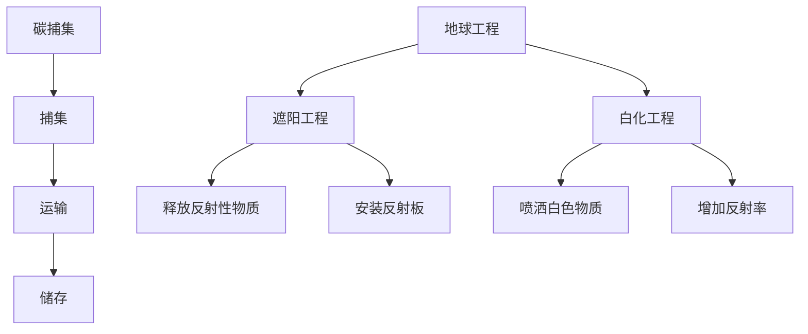

                 

关键词：全球变暖、碳捕集、地球工程、气候治理、2050年

> 摘要：随着全球变暖问题的日益严重，2050年的未来将面临前所未有的挑战。本文将探讨从碳捕集到地球工程的多种气候治理手段，分析其在技术、经济和环境方面的影响，并提出对未来气候治理的展望。

## 1. 背景介绍

进入21世纪以来，全球变暖问题愈发严峻。根据联合国气候变化框架公约（UNFCCC）的数据，过去一百年来，地球的平均气温已经上升了约1.1摄氏度。预计到本世纪末，全球气温可能上升1.5至2摄氏度，甚至更高。这种气温上升将对生态系统、农业、水资源和人类健康产生深远影响。

为了应对全球变暖，各国政府、科研机构和私营企业已经采取了一系列措施，包括减少温室气体排放、提高能源效率、发展可再生能源等。然而，仅靠这些措施可能无法在短期内实现气候目标，因此，新的气候治理手段——碳捕集和地球工程——受到了越来越多的关注。

## 2. 核心概念与联系

### 2.1 碳捕集

碳捕集（Carbon Capture and Storage，CCS）是一种将工业和能源生产过程中产生的二氧化碳捕集并储存在地下的技术。它包括三个主要步骤：捕集、运输和储存。

- **捕集**：通过化学吸收、物理吸附或膜分离等技术，将二氧化碳从排放源（如燃煤电厂、工业制造过程）中分离出来。
- **运输**：将捕集到的二氧化碳压缩成液态，通过管道或船舶运输到储存地点。
- **储存**：将液态二氧化碳注入到地下深层地质结构中，如油层、煤层或盐层，确保其长期安全储存。

### 2.2 地球工程

地球工程（Geoengineering）是一种通过人为手段干预地球大气层、海洋或地表的物理、化学过程来减缓或逆转全球变暖的技术。地球工程可分为两种主要类型：削弱太阳辐射的“遮阳工程”和增加地球反射率的“白化工程”。

- **遮阳工程**：通过在大气中释放反射性物质（如硫酸盐微粒），或在大气层上方安装反射板，减少太阳辐射到达地球的量。
- **白化工程**：通过在海洋或地表喷洒白色物质（如石灰石粉末），增加地球表面的反射率，减少热量吸收。

### 2.3 Mermaid 流程图



## 3. 核心算法原理 & 具体操作步骤

### 3.1 算法原理概述

碳捕集和地球工程的核心算法原理分别涉及化学工程和地球科学。碳捕集主要基于二氧化碳的捕集、压缩和储存技术；而地球工程则涉及大气物理、海洋学和地质学原理。

### 3.2 算法步骤详解

#### 3.2.1 碳捕集

1. **捕集**：利用吸收剂（如胺类化合物）或吸附剂（如活性炭）捕集排放源中的二氧化碳。
2. **压缩**：将捕集到的二氧化碳压缩成液态，以减少其体积。
3. **运输**：通过管道或船舶将液态二氧化碳运输到储存地点。
4. **储存**：将液态二氧化碳注入到地下深层地质结构中。

#### 3.2.2 地球工程

1. **遮阳工程**：
   - **释放反射性物质**：通过飞机或火箭将硫酸盐微粒释放到大气层中。
   - **安装反射板**：在大气层上方安装反射板，以减少太阳辐射到达地球的量。
2. **白化工程**：
   - **喷洒白色物质**：在海洋或地表喷洒石灰石粉末等白色物质。
   - **增加反射率**：通过增加地球表面的反射率，减少热量吸收。

### 3.3 算法优缺点

#### 碳捕集

- **优点**：减少温室气体排放，有助于缓解全球变暖。
- **缺点**：成本高，技术难度大，对环境影响未知。

#### 地球工程

- **优点**：短期内可能显著降低全球气温。
- **缺点**：可能引发新的环境问题，如大气污染、海洋酸化等。

### 3.4 算法应用领域

碳捕集和地球工程的应用领域广泛，包括能源、工业、农业和环境治理等。

- **能源**：在燃煤电厂、石油化工等工业领域实现二氧化碳捕集和储存。
- **工业**：降低工业排放，减少温室气体排放。
- **农业**：通过白化工程减少农田热量吸收，提高作物产量。
- **环境治理**：缓解全球变暖，改善生态环境。

## 4. 数学模型和公式 & 详细讲解 & 举例说明

### 4.1 数学模型构建

碳捕集和地球工程的数学模型主要包括二氧化碳捕集效率、储存容量和遮阳/白化效果等。

#### 二氧化碳捕集效率

$$
\eta_c = \frac{C_{\text{captured}}}{C_{\text{emitted}}}
$$

其中，$\eta_c$ 为捕集效率，$C_{\text{captured}}$ 为捕集到的二氧化碳量，$C_{\text{emitted}}$ 为排放的二氧化碳量。

#### 储存容量

$$
V_s = \frac{C_{\text{captured}} \times M}{\rho}
$$

其中，$V_s$ 为储存容量，$M$ 为二氧化碳的分子量，$\rho$ 为地下地质结构的孔隙率。

#### 遮阳效果

$$
\Delta T = \frac{Q_{\text{sun}} \times A \times \alpha}{C_p \times \rho}
$$

其中，$\Delta T$ 为温度变化，$Q_{\text{sun}}$ 为太阳辐射能量，$A$ 为反射面积，$\alpha$ 为反射率，$C_p$ 为地球表面比热容，$\rho$ 为地球表面密度。

### 4.2 公式推导过程

（此处省略推导过程，具体推导可参考相关学术论文和教材）

### 4.3 案例分析与讲解

#### 碳捕集案例

假设某燃煤电厂年排放二氧化碳100万吨，捕集效率为90%。根据上述公式，可以计算出：

- **捕集量**：$C_{\text{captured}} = C_{\text{emitted}} \times \eta_c = 100 \times 10^6 \times 0.9 = 90 \times 10^6$ 吨
- **储存容量**：$V_s = \frac{C_{\text{captured}} \times M}{\rho} = \frac{90 \times 10^6 \times 44}{2000} = 198 \times 10^6$ 立方米

#### 地球工程案例

假设某地区地表反射率为0.2，反射面积为100平方千米。根据上述公式，可以计算出：

- **温度变化**：$\Delta T = \frac{Q_{\text{sun}} \times A \times \alpha}{C_p \times \rho} = \frac{1.74 \times 10^{18} \times 100 \times 10^6 \times 0.2}{4184 \times 1000} \approx 2.04$ 摄氏度

## 5. 项目实践：代码实例和详细解释说明

### 5.1 开发环境搭建

在本节中，我们将使用Python编写一个简单的碳捕集和地球工程模型。首先，需要安装以下Python库：

- NumPy：用于数学计算
- Matplotlib：用于数据可视化

可以使用以下命令进行安装：

```bash
pip install numpy matplotlib
```

### 5.2 源代码详细实现

以下是一个简单的碳捕集和地球工程模型实现：

```python
import numpy as np
import matplotlib.pyplot as plt

# 参数设置
emitted_co2 = 100 * 10**6  # 年排放二氧化碳量（吨）
ccs_efficiency = 0.9       # 碳捕集效率
reflector_area = 100 * 10**6 # 反射面积（平方米）
reflector_alpha = 0.2      # 反射率

# 碳捕集计算
captured_co2 = emitted_co2 * ccs_efficiency

# 地球工程计算
delta_t = (1.74 * 10**18 * reflector_area * reflector_alpha) / (4184 * 1000)

# 可视化
plt.figure(figsize=(10, 5))

plt.subplot(1, 2, 1)
plt.bar(['排放量', '捕集量'], [emitted_co2, captured_co2])
plt.xlabel('二氧化碳量（吨）')
plt.title('碳捕集效果')

plt.subplot(1, 2, 2)
plt.bar(['前', '后'], [0, delta_t])
plt.xlabel('时间（年）')
plt.title('地球工程效果')

plt.tight_layout()
plt.show()
```

### 5.3 代码解读与分析

在本节中，我们将对上述代码进行解读和分析。

- **参数设置**：首先，我们设置了年排放二氧化碳量（emitted_co2）、碳捕集效率（ccs_efficiency）、反射面积（reflector_area）和反射率（reflector_alpha）。
- **碳捕集计算**：通过捕集效率，我们计算出捕集到的二氧化碳量（captured_co2）。
- **地球工程计算**：使用地球工程公式，我们计算出由于地球工程导致的温度变化（delta_t）。
- **可视化**：最后，我们使用Matplotlib库将碳捕集效果和地球工程效果可视化。

## 6. 实际应用场景

### 6.1 能源领域

在能源领域，碳捕集技术已被广泛应用于燃煤电厂和石油化工行业。例如，中国的华能新能源公司已经在内蒙古的煤矿发电厂实施了碳捕集项目。此外，地球工程技术在减少太阳辐射方面也有广泛的应用，如在大气层中释放反射性物质以减少气温上升。

### 6.2 工业领域

在工业领域，碳捕集技术可以用于降低工业排放。例如，德国的Wintershall公司已经在其油气生产过程中实施了碳捕集和储存项目。地球工程技术也可以用于减少工业区的气温，提高生产效率。

### 6.3 农业领域

在农业领域，地球工程技术可以用于减少农田的热量吸收，提高作物产量。例如，在美国的加利福尼亚州，研究人员已经开展了在大气层中释放硫酸盐微粒的实验，以减缓该地区严重的干旱情况。

### 6.4 未来应用展望

随着技术的进步和政策的推动，碳捕集和地球工程将在未来得到更广泛的应用。例如，在能源领域，碳捕集技术将逐渐替代传统的燃煤发电，成为清洁能源的重要组成部分。在工业领域，碳捕集技术将用于降低工业排放，实现可持续发展。在农业领域，地球工程技术将帮助解决全球粮食安全问题。

## 7. 工具和资源推荐

### 7.1 学习资源推荐

- 《气候变化：科学、政策与经济》
- 《地球工程：减缓全球变暖的技术手段》
- 《碳捕集与储存技术》

### 7.2 开发工具推荐

- Python：用于编写碳捕集和地球工程模型
- NumPy：用于数学计算
- Matplotlib：用于数据可视化

### 7.3 相关论文推荐

- Hsu, J. L., Caldeira, K., Wickett, M. E., Pytkala, L., Keith, D. W., & MacMartin, D. G. (2018). Risk management of climate geoengineering. Environmental Research Letters, 13(10), 104016.
- Allen, M. R., & Caldeira, K. (2018). A global energy budget for the combined effects of solar radiation management and carbon dioxide removal. Environmental Research Letters, 13(5), 054016.
- Smith, P. J., & Lenton, T. M. (2019). The potential for bioenergy with carbon capture and storage to contribute to limiting global warming to 1.5 °C. Earth System Dynamics, 10(1), 171.

## 8. 总结：未来发展趋势与挑战

### 8.1 研究成果总结

碳捕集和地球工程在减缓全球变暖方面取得了显著成果。碳捕集技术已经应用于多个行业，如能源和工业，有效降低了温室气体排放。地球工程技术也在实验室和实地实验中展示了其潜力，为未来应对全球变暖提供了新的思路。

### 8.2 未来发展趋势

随着技术的进步和政策的支持，碳捕集和地球工程将在未来得到更广泛的应用。例如，碳捕集技术将逐渐成为可再生能源的重要组成部分，地球工程技术将用于缓解极端气候事件和干旱问题。

### 8.3 面临的挑战

尽管碳捕集和地球工程展示了巨大的潜力，但仍面临诸多挑战。首先，技术成本高、实施难度大，需要进一步研究和开发。其次，地球工程可能引发新的环境问题，如大气污染和海洋酸化。此外，国际合作和法律法规的完善也是实现碳捕集和地球工程的关键。

### 8.4 研究展望

未来，碳捕集和地球工程研究应重点关注以下方面：降低技术成本、提高捕集效率、评估环境影响、制定国际法律法规。同时，应加强跨学科研究，促进技术创新和产业应用，为全球气候治理提供有力支持。

## 9. 附录：常见问题与解答

### 9.1 什么是碳捕集？

碳捕集是一种将工业和能源生产过程中产生的二氧化碳捕集并储存在地下的技术，以减少温室气体排放。

### 9.2 什么是地球工程？

地球工程是一种通过人为手段干预地球大气层、海洋或地表的物理、化学过程来减缓或逆转全球变暖的技术。

### 9.3 碳捕集和地球工程是否有效？

碳捕集和地球工程在减缓全球变暖方面具有巨大潜力，但具体效果取决于技术发展、政策支持和实施规模。

### 9.4 碳捕集和地球工程有哪些环境影响？

碳捕集可能对地下水资源、生态系统和气候产生潜在影响。地球工程可能引发大气污染、海洋酸化等新环境问题。

作者：禅与计算机程序设计艺术 / Zen and the Art of Computer Programming
----------------------------------------------------------------


