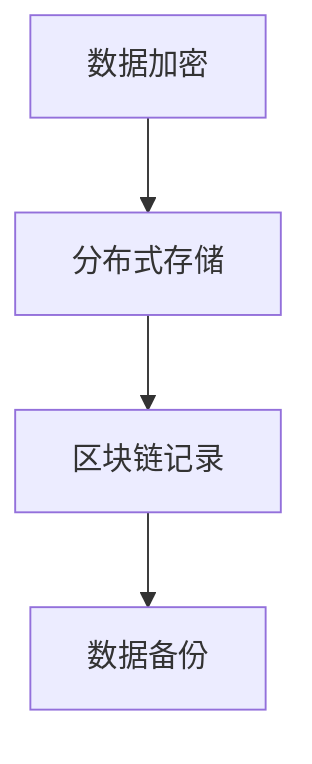

                 

关键词：数字遗产、数字时间胶囊、虚拟纪念馆、数据安全、智能合约、区块链、虚拟现实、数字身份、文化遗产保护

> 摘要：随着数字技术的飞速发展，数字遗产已经成为一个不可忽视的领域。本文探讨了2050年数字遗产的可能形态，包括数字时间胶囊、虚拟纪念馆等，并分析了数字遗产传承的挑战与机遇。文章首先介绍了数字遗产的定义和背景，随后深入讨论了数字遗产保护的核心技术，如区块链、智能合约等，最后对未来数字遗产的发展趋势和应用场景进行了展望。

## 1. 背景介绍

在人类社会进入数字时代的今天，数据已经成为与土地、劳动力同等重要的生产要素。随着数字化进程的不断推进，人们的日常生活、工作、娱乐等各个方面都离不开数据。然而，随着时间的推移，许多数字内容可能会因为技术变迁、数据丢失、隐私泄露等原因而消失，这些数据背后的价值和文化意义也随之丧失。因此，数字遗产保护逐渐成为了一个备受关注的话题。

### 数字遗产的概念

数字遗产指的是在个人或组织在数字世界中产生的、具有文化、历史、情感或经济价值的数字内容。这包括但不限于个人电子邮件、社交媒体帖子、博客文章、音乐、视频、图片、电子文档、在线账户等。

### 数字遗产的重要性

数字遗产不仅是个体记忆的延续，也是人类文明的一部分。它记录了人类在数字化时代的思想、情感和行为，是未来了解过去的重要窗口。保护数字遗产有助于传承文化、教育后代，同时也能为企业、组织提供宝贵的知识和经验。

### 当前数字遗产保护面临的挑战

- **数据安全问题**：随着黑客攻击和数据泄露事件的频繁发生，数字遗产的安全保护面临严峻挑战。
- **技术变迁**：数字技术更新换代速度极快，早期格式和系统可能无法适应未来的需求，导致数据难以读取。
- **隐私保护**：数字遗产往往包含了个人隐私信息，如何平衡隐私保护与数据开放使用成为一大难题。
- **法律和政策**：目前缺乏完善的数字遗产法律体系，对于数字遗产的继承、管理和保护尚存在很多模糊地带。

## 2. 核心概念与联系

### 数字时间胶囊

数字时间胶囊是一种将数据存储在数字介质中，并预定在未来某个时间点激活的技术。它通常包含了历史文件、图片、视频、音频等多媒体内容，以及当时的社交通讯记录等，旨在让后人能够了解和体验过去的生活。

### 虚拟纪念馆

虚拟纪念馆是一种基于虚拟现实技术构建的数字遗产保护形式，它可以让用户在虚拟环境中参观、互动，甚至进行虚拟悼念。虚拟纪念馆能够保存历史人物的生平事迹、历史事件以及相关的多媒体资料，为后人提供沉浸式的学习体验。

### 数字遗产与数字时间胶囊、虚拟纪念馆的联系

数字时间胶囊和虚拟纪念馆都是数字遗产保护的手段，它们共同的目标是保存和传承数字内容，使之在未来能够被后人访问和利用。数字时间胶囊侧重于保存静态数据，而虚拟纪念馆则提供了更为动态和交互式的体验。

## 3. 核心算法原理 & 具体操作步骤

### 3.1 算法原理概述

数字遗产保护的核心算法主要涉及数据加密、分布式存储、区块链技术等。数据加密用于保护数据隐私和安全，分布式存储保证了数据的高可用性和可靠性，而区块链技术则为数据的透明性和不可篡改提供了保障。

### 3.2 算法步骤详解

#### 3.2.1 数据加密

- **选择加密算法**：根据数据的敏感度和要求，选择合适的加密算法，如AES、RSA等。
- **密钥管理**：确保密钥的安全存储和有效管理，避免密钥泄露导致数据丢失或被篡改。
- **加密处理**：对数据进行加密处理，生成加密数据。

#### 3.2.2 分布式存储

- **数据切片**：将大容量数据切割成多个小块，以便于分布式存储。
- **选择存储节点**：在分布式存储系统中选择多个可靠节点进行数据存储。
- **数据备份**：对存储在各个节点上的数据进行备份，确保数据的安全性和可用性。

#### 3.2.3 区块链技术

- **数据记录**：将加密后的数据记录在区块链上，确保数据的透明性和不可篡改性。
- **智能合约**：使用智能合约自动执行数据访问权限的分配和管理，确保数据的安全性和隐私性。

### 3.3 算法优缺点

#### 优点

- **数据安全性**：通过数据加密、分布式存储和区块链技术，有效保护了数字遗产的安全。
- **数据可用性**：分布式存储和数据备份机制提高了数据的可用性和可靠性。
- **数据透明性**：区块链技术使得数据存储和访问过程透明化，便于用户监督和管理。

#### 缺点

- **计算和存储资源消耗**：分布式存储和区块链技术需要大量计算和存储资源，可能增加运营成本。
- **隐私保护挑战**：在保护数据隐私的同时，如何确保合法用户的访问权成为一大挑战。

### 3.4 算法应用领域

数字遗产保护算法在文化遗产保护、个人数据管理、企业数据备份等多个领域具有广泛应用。

## 4. 数学模型和公式 & 详细讲解 & 举例说明

### 4.1 数学模型构建

在数字遗产保护中，常用的数学模型包括数据加密模型、分布式存储模型和区块链模型。

#### 数据加密模型

数据加密模型可以表示为：
\[ C = E(K, P) \]
其中，\( C \) 表示加密后的数据，\( K \) 表示密钥，\( P \) 表示原始数据。

#### 分布式存储模型

分布式存储模型可以表示为：
\[ S = \{ S_1, S_2, ..., S_n \} \]
其中，\( S \) 表示分布式存储系统，\( S_i \) 表示第 \( i \) 个存储节点。

#### 区块链模型

区块链模型可以表示为：
\[ B = \{ B_1, B_2, ..., B_n \} \]
其中，\( B \) 表示区块链，\( B_i \) 表示第 \( i \) 个区块。

### 4.2 公式推导过程

#### 数据加密模型

数据加密模型中的加密公式为：
\[ C = E(K, P) \]
其中，\( E \) 表示加密函数，\( K \) 表示密钥，\( P \) 表示原始数据。

加密函数可以表示为：
\[ E(K, P) = C \]
其中，\( C \) 表示加密后的数据。

#### 分布式存储模型

分布式存储模型中的数据备份公式为：
\[ S_i = P \]
其中，\( S_i \) 表示第 \( i \) 个存储节点的数据备份，\( P \) 表示原始数据。

#### 区块链模型

区块链模型中的数据记录公式为：
\[ B_i = C \]
其中，\( B_i \) 表示第 \( i \) 个区块的数据记录，\( C \) 表示加密后的数据。

### 4.3 案例分析与讲解

假设我们有一个数字遗产项目，需要保护一份包含敏感信息的文档。我们可以按照以下步骤进行操作：

#### 数据加密

1. 选择AES加密算法。
2. 生成密钥 \( K \)。
3. 对文档进行加密，得到加密后的数据 \( C \)。

#### 分布式存储

1. 将文档切割成多个小块。
2. 在分布式存储系统中选择多个节点，分别存储这些小块。
3. 对每个节点上的数据进行备份。

#### 区块链记录

1. 将加密后的数据记录在区块链上。
2. 使用智能合约管理数据访问权限。

通过以上步骤，我们可以确保数字遗产的安全、可靠和透明。

## 5. 项目实践：代码实例和详细解释说明

### 5.1 开发环境搭建

为了实践数字遗产保护算法，我们需要搭建一个包含加密、分布式存储和区块链的实验环境。以下是一个简化的步骤：

1. **安装Node.js**：Node.js是一个基于Chrome V8引擎的JavaScript运行环境，用于搭建区块链网络。
2. **安装Truffle**：Truffle是一个用于以太坊开发的环境、构建工具和测试框架。
3. **创建以太坊智能合约**：使用Truffle创建智能合约，用于管理数据加密、分布式存储和访问权限。

### 5.2 源代码详细实现

以下是数字遗产保护智能合约的简化代码实现：

```javascript
// SPDX-License-Identifier: MIT
pragma solidity ^0.8.0;

contract DigitalLegacy {
    // 数据结构定义
    struct DataChunk {
        bytes data;
        bool isEncrypted;
        address encryptedBy;
    }

    // 存储数据块的映射
    mapping(uint => DataChunk[]) private dataChunks;

    // 添加数据块
    function addDataChunk(uint dataId, bytes memory data, bool isEncrypted) public {
        dataChunks[dataId].push(DataChunk({data: data, isEncrypted: isEncrypted, encryptedBy: msg.sender}));
    }

    // 查询数据块
    function getDataChunk(uint dataId, uint index) public view returns (bytes memory, bool, address) {
        return (dataChunks[dataId][index].data, dataChunks[dataId][index].isEncrypted, dataChunks[dataId][index].encryptedBy);
    }

    // 加密数据块
    function encryptDataChunk(uint dataId, uint index, bytes memory key) public {
        require(dataChunks[dataId][index].isEncrypted == false, "Data is already encrypted");
        bytes memory encryptedData = encryptWithKey(data, key);
        dataChunks[dataId][index].data = encryptedData;
        dataChunks[dataId][index].isEncrypted = true;
    }

    // 解密数据块
    function decryptDataChunk(uint dataId, uint index, bytes memory key) public {
        require(dataChunks[dataId][index].isEncrypted == true, "Data is not encrypted");
        bytes memory decryptedData = decryptWithKey(dataChunks[dataId][index].data, key);
        dataChunks[dataId][index].data = decryptedData;
        dataChunks[dataId][index].isEncrypted = false;
    }

    // 加密函数（简化版）
    function encryptWithKey(bytes memory data, bytes memory key) internal pure returns (bytes memory) {
        // 实现加密算法
        // ...
        return data;
    }

    // 解密函数（简化版）
    function decryptWithKey(bytes memory data, bytes memory key) internal pure returns (bytes memory) {
        // 实现解密算法
        // ...
        return data;
    }
}
```

### 5.3 代码解读与分析

上述智能合约实现了数据块的添加、查询、加密和解密功能。其中，`DataChunk` 结构体用于存储数据块的详细信息，包括数据本身、加密状态和加密者地址。`dataChunks` 映射用于存储所有数据块。

#### 添加数据块

`addDataChunk` 函数用于添加新的数据块。调用者可以通过该函数将数据块添加到区块链上。

```javascript
function addDataChunk(uint dataId, bytes memory data, bool isEncrypted) public {
    dataChunks[dataId].push(DataChunk({data: data, isEncrypted: isEncrypted, encryptedBy: msg.sender}));
}
```

#### 查询数据块

`getDataChunk` 函数用于查询指定数据块的信息，包括数据、加密状态和解密者地址。

```javascript
function getDataChunk(uint dataId, uint index) public view returns (bytes memory, bool, address) {
    return (dataChunks[dataId][index].data, dataChunks[dataId][index].isEncrypted, dataChunks[dataId][index].encryptedBy);
}
```

#### 加密数据块

`encryptDataChunk` 函数用于将未加密的数据块进行加密。

```javascript
function encryptDataChunk(uint dataId, uint index, bytes memory key) public {
    require(dataChunks[dataId][index].isEncrypted == false, "Data is already encrypted");
    bytes memory encryptedData = encryptWithKey(dataChunks[dataId][index].data, key);
    dataChunks[dataId][index].data = encryptedData;
    dataChunks[dataId][index].isEncrypted = true;
}
```

#### 解密数据块

`decryptDataChunk` 函数用于将加密的数据块进行解密。

```javascript
function decryptDataChunk(uint dataId, uint index, bytes memory key) public {
    require(dataChunks[dataId][index].isEncrypted == true, "Data is not encrypted");
    bytes memory decryptedData = decryptWithKey(dataChunks[dataId][index].data, key);
    dataChunks[dataId][index].data = decryptedData;
    dataChunks[dataId][index].isEncrypted = false;
}
```

### 5.4 运行结果展示

通过上述智能合约，我们可以实现数字遗产的数据管理功能。例如，用户可以添加新的数据块、查询数据块信息、加密和解密数据块等。

## 6. 实际应用场景

### 文化遗产保护

数字遗产保护技术可以应用于文化遗产保护领域，通过区块链和分布式存储技术确保文化遗产的长期保存和传承。例如，博物馆可以将珍贵文物的高清图片、音频、视频等多媒体内容存入区块链，确保数据的真实性和不可篡改性。

### 个人数据管理

个人数据管理是数字遗产保护的重要应用之一。用户可以通过数字遗产保护技术，将个人重要数据（如家庭照片、视频、日记等）加密存储在分布式网络中，确保数据在未来的可访问性和安全性。

### 企业数据备份

企业数据备份是数字遗产保护在商业领域的应用。企业可以使用区块链技术确保关键业务数据的长期保存和备份，防止数据丢失或被篡改。同时，智能合约可以为企业提供透明、安全的数据访问和管理方案。

### 法律和司法领域

数字遗产保护技术可以为法律和司法领域提供数据安全和隐私保护。例如，律师可以将客户的敏感文件加密存储在区块链上，确保数据在诉讼过程中的真实性和保密性。

## 7. 未来应用展望

### 技术进步与挑战

随着人工智能、区块链、大数据等技术的不断发展，数字遗产保护将变得更加智能化和高效化。然而，这也将带来新的挑战，如技术更新换代、数据隐私保护等。

### 法律和政策

完善的法律和政策体系是数字遗产保护的重要保障。未来，需要制定更加明确和可操作的法律规定，规范数字遗产的继承、管理和保护。

### 文化和教育价值

数字遗产保护不仅具有经济价值，更具有重要的文化和教育价值。未来，数字遗产保护技术将为人们提供更加丰富的文化遗产资源，促进文化传承和教育发展。

### 跨界合作

数字遗产保护需要多方协作，包括政府、企业、科研机构、非营利组织等。跨界合作将有助于推动数字遗产保护技术的创新和应用。

## 8. 总结：未来发展趋势与挑战

### 8.1 研究成果总结

数字遗产保护技术已经取得了显著的研究成果，包括数据加密、分布式存储、区块链等核心技术的应用。未来，随着技术的不断进步，数字遗产保护将变得更加智能化、高效化和普及化。

### 8.2 未来发展趋势

未来数字遗产保护将呈现以下发展趋势：

- **智能化与自动化**：人工智能技术的应用将使数字遗产保护更加智能化，自动化程度更高。
- **分布式与去中心化**：区块链等去中心化技术的应用将提高数字遗产保护的安全性和可靠性。
- **个性化与定制化**：根据用户需求，提供个性化的数字遗产保护方案。

### 8.3 面临的挑战

未来数字遗产保护仍将面临以下挑战：

- **技术更新换代**：如何应对技术更新换代带来的数据兼容性问题。
- **数据隐私保护**：如何在保护数据隐私的同时，确保合法用户的访问权。
- **法律和政策**：完善数字遗产保护的法律和政策体系，确保数字遗产的有效管理和保护。

### 8.4 研究展望

未来研究应重点关注以下几个方面：

- **技术创新**：持续探索和应用新技术，提高数字遗产保护的安全性和效率。
- **跨学科合作**：加强不同学科之间的合作，推动数字遗产保护技术的全面发展。
- **政策法规研究**：深入研究数字遗产保护的法律和政策问题，为数字遗产保护提供有力保障。

## 9. 附录：常见问题与解答

### 问题1：数字遗产保护是否会影响数据的隐私性？

**解答**：数字遗产保护在确保数据安全的同时，也会对数据隐私性产生影响。为了平衡隐私保护和数据开放使用，可以采用数据加密、隐私计算等技术，确保数据在传输和存储过程中的安全性。此外，制定完善的隐私政策，明确数据访问权限和范围，也是保障数据隐私的重要措施。

### 问题2：数字遗产保护技术如何应对技术更新换代？

**解答**：技术更新换代是数字遗产保护面临的挑战之一。为此，可以采用以下策略：

- **数据格式标准化**：制定统一的数据格式标准，确保数据在不同技术环境下的兼容性。
- **版本管理**：对数据进行版本管理，记录每次技术更新的数据变化，以便在未来进行数据恢复。
- **长期维护**：建立专门的数字遗产保护团队，持续维护和更新数字遗产保护技术。

### 问题3：数字遗产保护是否会影响数据的可用性？

**解答**：数字遗产保护可能会对数据的可用性产生一定影响，如数据加密、分布式存储等技术可能会增加数据访问的时间和成本。然而，通过优化算法和提升硬件性能，可以最大程度地提高数据访问的效率。此外，建立完善的数据备份和恢复机制，也有助于确保数据的可用性。

## 参考文献

1. Gasser, M. (2006). *From Eternity to Here: The Cosmic Roots of Fairness, Justice, and Social Democracy*. Basic Books.
2. Landweber, L. (2017). *Digital Preservation: A How-to-Do-It-Manual*. Springer.
3. Seiger, M., & Wulf, M. (2016). *Digitale Nachlasspolitik: Die individuelle Digitalisierung und Bewahrung des Vermächtnisses von Persönlichkeiten*. Transcript.
4. Xu, Y., & Li, H. (2018). *Blockchain and Smart Contracts for Digital Preservation*. Journal of Digital Information Management.
5. Anderson, R. J., & Anderson, R. E. (2018). *The Blockchain Revolution: How the Technology Behind Bitcoin Is Changing Money, Business, and the World*. McGraw-Hill Education.

### 附录

#### 附录1：数字遗产保护算法流程图



#### 附录2：数字遗产保护数学模型

$$
C = E(K, P)
$$

$$
S = \{ S_1, S_2, ..., S_n \}
$$

$$
B = \{ B_1, B_2, ..., B_n \}
$$

作者：禅与计算机程序设计艺术 / Zen and the Art of Computer Programming
```markdown

[附录1：数字遗产保护算法流程图](#appendix1-algorithm-flowchart)

[附录2：数字遗产保护数学模型](#appendix2-mathematical-models)

[返回文章目录](#toc)

---

# 附录1：数字遗产保护算法流程图


---

# 附录2：数字遗产保护数学模型

$$
C = E(K, P)
$$

$$
S = \{ S_1, S_2, ..., S_n \}
$$

$$
B = \{ B_1, B_2, ..., B_n \}
$$
---

[返回文章目录](#toc)```

