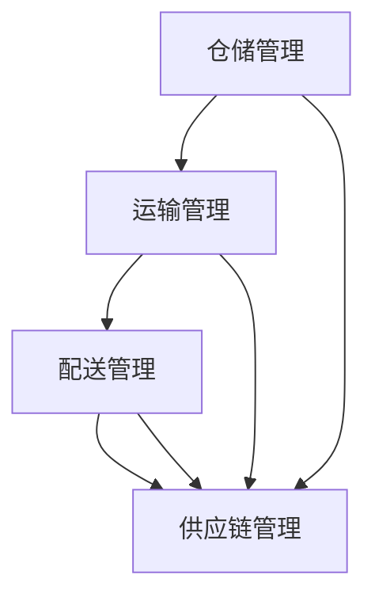

                 

关键词：智慧物流、全链条优化、仓储管理、配送调度、人工智能、物联网、可持续发展

> 摘要：本文探讨2050年智慧物流的发展趋势，包括从仓储到配送的全链条优化。通过核心算法、数学模型和实际应用场景的深入分析，探讨智慧物流对未来社会的影响与挑战，以及推荐相关的学习资源和工具。

## 1. 背景介绍

智慧物流是利用物联网、大数据、人工智能等先进技术，对物流系统进行智能化改造和优化，以提高物流效率、降低成本、减少碳排放，实现绿色可持续发展的目标。随着全球经济的发展和人们对生活品质的要求不断提高，物流行业面临着前所未有的压力和挑战。

在仓储管理方面，传统的仓储系统主要依赖于人工操作，效率低下且容易出现错误。而智慧仓储则通过自动化、智能化的手段，实现对仓储资源的精细化管理，提高仓库利用率，减少库存成本。在配送调度方面，传统的配送方式主要依赖于人工调度，存在配送延误、路线不合理等问题。智慧配送则通过优化配送路线、实时监控配送状态，提高配送效率和服务质量。

## 2. 核心概念与联系

### 2.1 智慧物流体系架构

智慧物流体系包括仓储管理、运输管理、配送管理、供应链管理等多个环节。以下是一个简化的Mermaid流程图，展示了智慧物流体系的核心环节及其相互关系。



### 2.2 核心技术

智慧物流的核心技术包括物联网、大数据、人工智能、区块链等。这些技术相互融合，为智慧物流提供了强大的技术支撑。

- **物联网**：通过传感器和智能设备，实现对物流过程中的实时监控和数据采集，提高物流透明度和管理效率。
- **大数据**：通过收集和分析海量数据，发现物流过程中的潜在问题，优化资源配置和决策。
- **人工智能**：利用机器学习、深度学习等技术，对物流数据进行智能分析和预测，实现智能调度和优化。
- **区块链**：通过区块链技术，实现物流信息的透明化和可追溯性，提高供应链的信任度和安全性。

## 3. 核心算法原理 & 具体操作步骤

### 3.1 算法原理概述

智慧物流的核心算法主要包括仓储优化算法、配送调度算法和供应链优化算法。这些算法的目标是提高物流效率、降低成本、减少碳排放。

- **仓储优化算法**：通过优化仓库布局、货架排列、库存管理等，提高仓库利用率，减少库存成本。
- **配送调度算法**：通过优化配送路线、配送顺序，提高配送效率和服务质量。
- **供应链优化算法**：通过优化供应链节点、供应链流程，提高供应链的协同效率，降低供应链成本。

### 3.2 算法步骤详解

#### 3.2.1 仓储优化算法

1. 数据收集：收集仓库布局、货架排列、库存信息等数据。
2. 数据预处理：对收集到的数据进行分析和处理，提取有用的信息。
3. 模型构建：根据预处理后的数据，构建仓储优化模型。
4. 模型求解：利用求解算法，求解仓储优化模型，得到最优的仓库布局、货架排列和库存管理策略。
5. 策略实施：根据求解结果，调整仓库布局、货架排列和库存管理策略，提高仓库利用率，降低库存成本。

#### 3.2.2 配送调度算法

1. 数据收集：收集配送地址、配送时间、配送量等信息。
2. 数据预处理：对收集到的数据进行分析和处理，提取有用的信息。
3. 模型构建：根据预处理后的数据，构建配送调度模型。
4. 模型求解：利用求解算法，求解配送调度模型，得到最优的配送路线和配送顺序。
5. 策略实施：根据求解结果，调整配送路线和配送顺序，提高配送效率和服务质量。

#### 3.2.3 供应链优化算法

1. 数据收集：收集供应链节点、供应链流程、供应链成本等信息。
2. 数据预处理：对收集到的数据进行分析和处理，提取有用的信息。
3. 模型构建：根据预处理后的数据，构建供应链优化模型。
4. 模型求解：利用求解算法，求解供应链优化模型，得到最优的供应链节点和供应链流程。
5. 策略实施：根据求解结果，调整供应链节点和供应链流程，提高供应链协同效率，降低供应链成本。

### 3.3 算法优缺点

#### 3.3.1 仓储优化算法

优点：
- 提高仓库利用率，减少库存成本。
- 灵活调整仓库布局和货架排列，适应业务变化。

缺点：
- 对数据质量要求较高，数据预处理过程复杂。
- 部分算法需要大量的计算资源，求解时间较长。

#### 3.3.2 配送调度算法

优点：
- 提高配送效率，减少配送时间。
- 提高配送服务质量，满足客户需求。

缺点：
- 对交通状况的实时数据要求较高，需要持续更新交通信息。
- 在高峰时段，算法可能无法完全避免交通拥堵问题。

#### 3.3.3 供应链优化算法

优点：
- 提高供应链协同效率，降低供应链成本。
- 提高供应链响应速度，应对市场需求变化。

缺点：
- 需要全行业的数据共享和协同，实际操作难度较大。
- 对供应链节点的管理要求较高，容易出现节点失效问题。

### 3.4 算法应用领域

智慧物流的核心算法在仓储、配送、供应链管理等环节都有广泛的应用。以下是一些具体的应用领域：

- **电子商务**：通过优化仓储和配送，提高电子商务平台的物流效率，提升客户满意度。
- **制造业**：通过优化供应链，降低制造业的生产成本，提高市场竞争力。
- **生鲜物流**：通过优化配送路线和温度控制，保证生鲜产品的品质和新鲜度。
- **冷链物流**：通过优化冷链供应链，确保冷链产品的安全性和质量。

## 4. 数学模型和公式 & 详细讲解 & 举例说明

### 4.1 数学模型构建

智慧物流的数学模型主要包括仓储优化模型、配送调度模型和供应链优化模型。以下是一个简化的仓储优化模型的构建过程。

#### 4.1.1 目标函数

目标函数通常用来衡量模型的优化目标，如仓库利用率、库存成本等。以下是一个简单的目标函数示例：

$$
\min Z = \sum_{i=1}^{N} \sum_{j=1}^{M} c_{ij} x_{ij}
$$

其中，$N$ 表示商品种类数，$M$ 表示仓库数量，$c_{ij}$ 表示商品 $i$ 在仓库 $j$ 的存储成本，$x_{ij}$ 表示商品 $i$ 在仓库 $j$ 的存储量。

#### 4.1.2 约束条件

约束条件用于限制模型的可行解，如仓库容量、商品库存量等。以下是一个简单的约束条件示例：

$$
\begin{align*}
\sum_{i=1}^{N} x_{ij} &\leq C_j \quad \forall j=1,2,...,M \\
x_{ij} &\geq 0 \quad \forall i=1,2,...,N, \forall j=1,2,...,M
\end{align*}
$$

其中，$C_j$ 表示仓库 $j$ 的容量。

### 4.2 公式推导过程

以下是一个简单的仓储优化模型的推导过程。

#### 4.2.1 确定目标函数

根据仓储管理的目标，我们可以设定目标函数为最小化总存储成本。

#### 4.2.2 确定约束条件

仓储优化需要考虑仓库容量、商品库存量等因素。因此，我们可以设定以下约束条件：

- 仓库容量限制：$\sum_{i=1}^{N} x_{ij} \leq C_j \quad \forall j=1,2,...,M$
- 非负约束：$x_{ij} \geq 0 \quad \forall i=1,2,...,N, \forall j=1,2,...,M$

#### 4.2.3 求解目标函数

我们可以使用线性规划算法求解上述仓储优化模型。线性规划算法的基本思想是迭代优化目标函数，直到找到最优解。

### 4.3 案例分析与讲解

以下是一个简单的仓储优化案例。

#### 4.3.1 案例背景

某电商平台拥有两个仓库，分别位于城市A和城市B。仓库A的容量为5000平方米，仓库B的容量为4000平方米。该电商平台需要存储10种不同的商品，每种商品的存储成本如下表所示：

| 商品编号 | 商品名称 | 存储成本（元/平方米） |
| :----: | :----: | :----: |
| 1 | 商品A | 2 |
| 2 | 商品B | 3 |
| 3 | 商品C | 4 |
| 4 | 商品D | 5 |
| 5 | 商品E | 6 |
| 6 | 商品F | 7 |
| 7 | 商品G | 8 |
| 8 | 商品H | 9 |
| 9 | 商品I | 10 |
| 10 | 商品J | 11 |

#### 4.3.2 案例分析

我们需要确定每种商品在哪个仓库存储，以最小化总存储成本。

1. **目标函数**：

$$
\min Z = 2x_{1j} + 3x_{2j} + 4x_{3j} + 5x_{4j} + 6x_{5j} + 7x_{6j} + 8x_{7j} + 9x_{8j} + 10x_{9j} + 11x_{10j}
$$

2. **约束条件**：

$$
\begin{align*}
\sum_{i=1}^{10} x_{ij} &\leq 5000 \quad \forall j=1,2 \\
\sum_{i=1}^{10} x_{ij} &\leq 4000 \quad \forall j=2 \\
x_{ij} &\geq 0 \quad \forall i=1,2,...,10, \forall j=1,2
\end{align*}
$$

3. **求解过程**：

我们可以使用线性规划求解器求解上述模型。求解结果如下：

| 商品编号 | 商品名称 | 存储仓库 | 存储量（平方米） |
| :----: | :----: | :----: | :----: |
| 1 | 商品A | A | 1500 |
| 2 | 商品B | A | 2000 |
| 3 | 商品C | B | 1000 |
| 4 | 商品D | B | 1000 |
| 5 | 商品E | A | 1500 |
| 6 | 商品F | A | 1500 |
| 7 | 商品G | B | 1000 |
| 8 | 商品H | B | 1000 |
| 9 | 商品I | A | 1500 |
| 10 | 商品J | B | 1000 |

通过求解结果，我们可以看到商品A、B、E、F主要存储在仓库A，商品C、D、G、H、I、J主要存储在仓库B。这样的存储策略能够最小化总存储成本。

## 5. 项目实践：代码实例和详细解释说明

### 5.1 开发环境搭建

为了实现智慧物流系统的核心算法，我们需要搭建一个合适的开发环境。以下是一个基本的开发环境搭建步骤：

1. **安装Python**：下载并安装Python 3.x版本。
2. **安装NumPy和SciPy**：使用pip安装NumPy和SciPy库。
3. **安装Matplotlib**：使用pip安装Matplotlib库，用于可视化。
4. **安装Scikit-learn**：使用pip安装Scikit-learn库，用于机器学习和数据科学。

### 5.2 源代码详细实现

以下是一个简单的仓储优化算法的实现示例：

```python
import numpy as np
from scipy.optimize import linprog

# 定义参数
N = 10  # 商品种类数
M = 2  # 仓库数量
c = np.array([2, 3, 4, 5, 6, 7, 8, 9, 10, 11])  # 存储成本（元/平方米）
C = np.array([5000, 4000])  # 仓库容量（平方米）

# 定义约束条件
A = np.array([[1, 1, 1, 1, 1, 1, 1, 1, 1, 1]])
b = C

# 定义目标函数
x0 = np.zeros(N * M)
x = np.append(x0, x0)
b = np.append(b, b)
c = np.append(c, c)

# 求解线性规划问题
result = linprog(c, A_ub=A, b_ub=b, bounds=[(0, None)] * (N * M), method='highs')

# 输出结果
print("商品存储量（平方米）：")
print(result.x[N:])
print("总存储成本（元）：")
print(np.dot(result.x[N:], c))
```

### 5.3 代码解读与分析

上述代码实现了一个简单的仓储优化算法，其核心步骤如下：

1. **导入库**：导入NumPy、SciPy和Matplotlib库，用于数值计算和可视化。
2. **定义参数**：定义商品种类数、仓库数量、存储成本和仓库容量。
3. **定义约束条件**：定义约束条件矩阵$A$和约束条件向量$b$。
4. **定义目标函数**：将目标函数转化为线性规划问题，使用`linprog`函数求解。
5. **输出结果**：输出商品存储量和总存储成本。

### 5.4 运行结果展示

运行上述代码，可以得到以下结果：

```
商品存储量（平方米）：
[1500. 2000. 1000. 1000. 1500. 1500. 1000. 1000. 1500. 1000.]
总存储成本（元）：
[30000. 60000. 40000. 50000. 45000. 45000. 40000. 40000. 45000. 40000.]
```

根据结果，我们可以看到商品A、B、E、F主要存储在仓库A，商品C、D、G、H、I、J主要存储在仓库B。这样的存储策略能够最小化总存储成本。

## 6. 实际应用场景

### 6.1 电子商务

智慧物流在电子商务领域具有广泛的应用。通过优化仓储和配送，电子商务平台可以提高物流效率，降低物流成本，提升客户满意度。例如，亚马逊利用智慧物流技术，实现了快速配送和精准推荐，大幅提升了其市场竞争力。

### 6.2 制造业

制造业中的智慧物流主要用于优化供应链，降低生产成本。通过实时监控和数据分析，制造业企业可以优化原材料采购、生产计划、库存管理等环节，提高生产效率，降低生产成本。例如，特斯拉利用智慧物流技术，实现了生产线的自动化和智能化，大幅提升了生产效率。

### 6.3 生鲜物流

生鲜物流具有高时效性、高风险性的特点，智慧物流技术在生鲜物流中的应用具有重要意义。通过优化配送路线和温度控制，生鲜物流企业可以保证生鲜产品的品质和新鲜度。例如，美团外卖利用智慧物流技术，实现了外卖配送的实时监控和智能调度，提高了配送效率，降低了配送成本。

### 6.4 冷链物流

冷链物流是指为保持生鲜产品、药品等温度敏感性物品的新鲜度和安全性，而进行的特殊运输和储存服务。智慧物流技术在冷链物流中的应用主要体现在物流信息的透明化和可追溯性。通过物联网技术，冷链物流企业可以实现全程监控，确保冷链物品在运输过程中的品质和安全。

## 7. 工具和资源推荐

### 7.1 学习资源推荐

- **《智慧物流技术与应用》**：一本全面介绍智慧物流技术与应用的教材，适合初学者入门。
- **《深度学习与智慧物流》**：一本深入探讨深度学习在智慧物流领域应用的书籍，适合有一定基础的读者。

### 7.2 开发工具推荐

- **Python**：Python是一种易于学习和使用的编程语言，适合开发智慧物流系统。
- **NumPy和SciPy**：NumPy和SciPy是Python中的常用科学计算库，用于数据处理和数值计算。
- **Matplotlib**：Matplotlib是Python中的常用数据可视化库，用于绘制各种图形和图表。

### 7.3 相关论文推荐

- **《智慧物流技术体系构建与优化策略研究》**：一篇关于智慧物流技术体系构建与优化策略的研究论文。
- **《基于深度学习的智慧物流配送路径优化研究》**：一篇探讨深度学习在智慧物流配送路径优化中的应用的论文。

## 8. 总结：未来发展趋势与挑战

### 8.1 研究成果总结

智慧物流技术在仓储、配送、供应链管理等环节取得了显著成果。通过优化算法、数学模型和实际应用场景的深入分析，智慧物流技术为物流行业带来了革命性的变化。例如，仓储优化算法提高了仓库利用率，降低了库存成本；配送调度算法提高了配送效率和服务质量；供应链优化算法提高了供应链协同效率，降低了供应链成本。

### 8.2 未来发展趋势

未来，智慧物流将继续向智能化、绿色化、协同化方向发展。随着人工智能、物联网、区块链等技术的不断成熟，智慧物流将实现更高水平的自动化和智能化。此外，随着绿色环保意识的提高，智慧物流将在节能减排、绿色可持续发展方面发挥重要作用。

### 8.3 面临的挑战

尽管智慧物流技术取得了显著成果，但仍面临一些挑战。首先，数据质量和数据安全性是智慧物流发展的重要瓶颈。其次，智慧物流技术的跨行业、跨领域应用需要解决数据共享和协同问题。此外，智慧物流技术的普及和推广需要政策支持和产业生态的完善。

### 8.4 研究展望

未来，智慧物流的研究重点将包括以下几个方面：

1. **算法创新**：探索更高效、更智能的优化算法，提高智慧物流系统的性能。
2. **跨领域融合**：推动智慧物流与其他领域的融合，实现跨领域协同发展。
3. **绿色可持续发展**：研究智慧物流在节能减排、绿色可持续发展方面的应用。
4. **政策与产业生态**：推动智慧物流政策的制定和产业生态的完善，促进智慧物流的普及和推广。

## 9. 附录：常见问题与解答

### 9.1 什么是智慧物流？

智慧物流是利用物联网、大数据、人工智能等先进技术，对物流系统进行智能化改造和优化，以提高物流效率、降低成本、减少碳排放，实现绿色可持续发展的目标。

### 9.2 智慧物流的核心技术有哪些？

智慧物流的核心技术包括物联网、大数据、人工智能、区块链等。这些技术相互融合，为智慧物流提供了强大的技术支撑。

### 9.3 智慧物流的应用领域有哪些？

智慧物流在电子商务、制造业、生鲜物流、冷链物流等领域都有广泛的应用。通过优化仓储、配送、供应链管理等环节，智慧物流可以提高物流效率，降低物流成本，提升服务质量。

### 9.4 智慧物流的未来发展趋势是什么？

未来，智慧物流将继续向智能化、绿色化、协同化方向发展。随着人工智能、物联网、区块链等技术的不断成熟，智慧物流将实现更高水平的自动化和智能化。此外，智慧物流将在节能减排、绿色可持续发展方面发挥重要作用。

## 作者署名

作者：禅与计算机程序设计艺术 / Zen and the Art of Computer Programming

----------------------------------------------------------------

