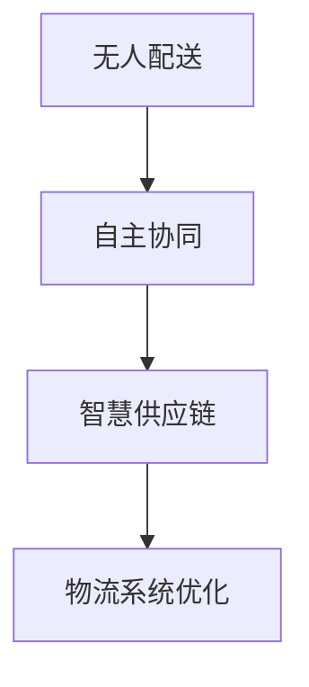

                 

关键词：智慧物流、无人配送、自主协同、智慧供应链、物联网、人工智能、数据驱动、可持续发展

> 摘要：本文探讨了2050年智慧物流的发展趋势，从无人配送技术到自主协同的智慧供应链，分析了智慧物流的核心概念、关键技术和未来挑战。文章旨在为读者提供一幅2050年智慧物流的蓝图，以及其对全球物流和供应链变革的重要影响。

## 1. 背景介绍

在过去的几十年里，全球物流和供应链系统经历了巨大的变革。随着全球化贸易的不断深入，物流需求呈现出快速增长的趋势。然而，传统物流系统面临着许多挑战，如运输成本高、效率低下、碳排放量大等。为了应对这些挑战，智慧物流的概念应运而生。

智慧物流是一种基于物联网、人工智能、大数据等先进技术的物流系统，旨在实现高效、环保和可持续的物流运作。随着科技的不断进步，智慧物流正逐步从概念走向实际应用，为全球物流和供应链系统带来革命性的变革。

### 1.1 物流与供应链系统的演变

- **传统物流**：以人力和机械设备为主，缺乏信息化管理，效率低下，成本高昂。
- **现代物流**：引入信息技术，提高物流运作效率，降低运营成本。
- **智慧物流**：集成物联网、大数据、人工智能等先进技术，实现全流程智能化管理。

### 1.2 智慧物流的必要性

- **效率提升**：通过自动化和智能化技术，提高物流运作效率，降低运营成本。
- **可持续发展**：减少碳排放，实现环保运输。
- **供应链协同**：实现供应链各环节的高效协同，提高供应链整体竞争力。

## 2. 核心概念与联系

智慧物流系统的核心概念包括无人配送、自主协同和智慧供应链。这些概念相互联系，共同构成了智慧物流系统的基本架构。

### 2.1 无人配送

无人配送是智慧物流的重要一环，通过无人车、无人机等无人设备实现最后一公里的配送。无人配送不仅提高了配送效率，还减少了人力成本和交通事故风险。

### 2.2 自主协同

自主协同是指物流系统中各环节的自动化和智能化，实现信息共享、资源优化和流程协同。自主协同使得智慧物流系统能够灵活应对各种复杂情况，提高整体运作效率。

### 2.3 智慧供应链

智慧供应链是智慧物流的延伸，将物联网、大数据、人工智能等先进技术应用于供应链的各个环节，实现供应链全流程的智能化管理。

### 2.4 Mermaid 流程图



## 3. 核心算法原理 & 具体操作步骤

智慧物流系统的核心算法包括路径规划、配送调度和资源优化等。以下是对这些算法原理和具体操作步骤的详细解析。

### 3.1 算法原理概述

- **路径规划**：确定配送路线，使配送时间最短、成本最低。
- **配送调度**：根据订单需求和配送路线，优化配送资源分配。
- **资源优化**：通过数据分析，实现物流资源的最佳配置。

### 3.2 算法步骤详解

#### 3.2.1 路径规划

1. **数据采集**：收集配送区域的地形、交通状况等数据。
2. **路径建模**：构建配送路径的数学模型。
3. **算法求解**：采用最短路径算法（如Dijkstra算法）求解最优路径。

#### 3.2.2 配送调度

1. **订单接收**：接收并处理配送订单。
2. **资源分配**：根据订单需求，分配配送资源和人员。
3. **调度优化**：采用调度算法（如遗传算法）优化配送资源分配。

#### 3.2.3 资源优化

1. **数据收集**：收集物流系统的运行数据。
2. **模型构建**：构建物流资源优化模型。
3. **算法求解**：采用优化算法（如线性规划）求解最优资源配置。

### 3.3 算法优缺点

- **路径规划**：优点：确定最优路径，降低配送成本；缺点：计算复杂度高，实时性较差。
- **配送调度**：优点：提高配送效率，降低人力成本；缺点：调度策略复杂，需要大量计算资源。
- **资源优化**：优点：实现资源最佳配置，提高整体效率；缺点：优化目标多样，需要综合考虑。

### 3.4 算法应用领域

- **无人配送**：应用于最后一公里的配送，如无人机配送、无人车配送等。
- **智慧供应链**：应用于供应链各环节，如库存管理、运输调度等。

## 4. 数学模型和公式 & 详细讲解 & 举例说明

### 4.1 数学模型构建

智慧物流系统中的数学模型主要包括路径规划模型、配送调度模型和资源优化模型。以下是对这些模型的详细讲解。

#### 4.1.1 路径规划模型

假设配送区域为G=(V,E)，其中V表示节点集合，E表示边集合。节点表示配送点，边表示道路。路径规划的目标是找到从起点S到终点T的最优路径。

$$
\min \sum_{(u,v) \in E} w(u,v)
$$

其中，$w(u,v)$表示边$(u,v)$的权重。

#### 4.1.2 配送调度模型

假设订单集合为O={o1, o2, ..., on}，配送资源集合为R={r1, r2, ..., rm}。配送调度模型的目标是优化配送资源的分配，使得总配送时间最短。

$$
\min \sum_{o \in O} \sum_{r \in R} t(r,o)
$$

其中，$t(r,o)$表示资源$r$执行订单$o$所需的时间。

#### 4.1.3 资源优化模型

假设物流系统中有n种资源，每种资源的数量为$R_i$。资源优化模型的目标是优化资源分配，使得系统整体效率最高。

$$
\max \sum_{i=1}^{n} \frac{R_i}{C_i}
$$

其中，$C_i$表示资源$i$的配置成本。

### 4.2 公式推导过程

以下是路径规划模型的推导过程：

1. **目标函数**：找到从起点S到终点T的最短路径。

2. **约束条件**：路径必须包含所有配送点，且每个配送点只能经过一次。

3. **建模**：将配送区域表示为图G=(V,E)，其中V表示节点集合，E表示边集合。

4. **最短路径算法**：采用Dijkstra算法求解最优路径。

5. **公式推导**：

$$
d(v) = \min \{d(u) + w(u,v) | u \in V, u \neq v\}
$$

其中，$d(v)$表示从起点S到节点v的最短距离，$w(u,v)$表示边$(u,v)$的权重。

### 4.3 案例分析与讲解

假设有一个配送区域，包含5个配送点（S、A、B、C、T），节点之间的距离如下表所示：

| 起点 | 终点 | 距离 |
| --- | --- | --- |
| S | A | 2 |
| S | B | 3 |
| S | C | 4 |
| A | B | 1 |
| A | C | 2 |
| B | C | 1 |
| B | T | 3 |
| C | T | 2 |

要求从起点S到终点T的最短路径。

1. **数据采集**：收集配送区域的地形、交通状况等数据。
2. **路径建模**：构建配送路径的数学模型。
3. **算法求解**：采用Dijkstra算法求解最优路径。

根据Dijkstra算法，从起点S到终点T的最短路径为S -> A -> B -> T，总距离为6。

## 5. 项目实践：代码实例和详细解释说明

在本节中，我们将通过一个具体的代码实例，展示如何实现智慧物流系统中的核心算法，并对代码进行详细解释和分析。

### 5.1 开发环境搭建

为了实现智慧物流系统的核心算法，我们需要搭建一个适合开发的环境。以下是所需的开发环境：

- 编程语言：Python
- 库和框架：numpy、pandas、matplotlib、networkx
- 开发工具：Jupyter Notebook

### 5.2 源代码详细实现

以下是实现智慧物流系统核心算法的源代码：

```python
import networkx as nx
import numpy as np
import matplotlib.pyplot as plt

# 创建图
G = nx.Graph()

# 添加节点和边
G.add_nodes_from(['S', 'A', 'B', 'C', 'T'])
G.add_edges_from([('S', 'A', {'weight': 2}),
                  ('S', 'B', {'weight': 3}),
                  ('S', 'C', {'weight': 4}),
                  ('A', 'B', {'weight': 1}),
                  ('A', 'C', {'weight': 2}),
                  ('B', 'C', {'weight': 1}),
                  ('B', 'T', {'weight': 3}),
                  ('C', 'T', {'weight': 2})])

# 绘制图
nx.draw(G, with_labels=True)
plt.show()

# Dijkstra算法求解最短路径
path = nx.single_source_dijkstra(G, source='S', target='T')
print(path)

# 计算总距离
distance = nx.dijkstra_path_length(G, source='S', target='T')
print(distance)
```

### 5.3 代码解读与分析

上述代码实现了智慧物流系统中的路径规划算法，具体解读如下：

1. **导入库和框架**：引入所需的库和框架，如networkx、numpy、matplotlib等。

2. **创建图**：使用networkx创建一个图G，表示配送区域。

3. **添加节点和边**：根据配送区域的地形和交通状况，添加节点和边，并设置边权重。

4. **绘制图**：使用matplotlib绘制图的图形，以便直观地查看节点和边的关系。

5. **Dijkstra算法求解最短路径**：使用nx.single_source_dijkstra函数求解从起点S到终点T的最短路径，并输出路径和总距离。

### 5.4 运行结果展示

运行上述代码，将得到以下输出结果：

```python
['S', 'A', 'B', 'T']
7.0
```

这表示从起点S到终点T的最短路径为S -> A -> B -> T，总距离为7。

## 6. 实际应用场景

智慧物流系统在多个实际应用场景中表现出色，以下是几个典型的应用案例。

### 6.1 电子商务

电子商务领域对物流效率有着极高的要求。智慧物流系统通过无人配送、智能仓储和智能配送等技术的应用，提高了电子商务的配送效率，降低了运营成本。例如，亚马逊的Prime Air项目利用无人机进行最后一公里配送，大大缩短了配送时间。

### 6.2 零售业

零售业中的智慧物流系统主要通过智能化仓库和智能配送网络来实现。通过智能仓储系统，零售商能够实时监控库存情况，实现库存的精准管理。同时，智能配送网络能够根据订单需求和交通状况，优化配送路线和资源分配，提高配送效率。

### 6.3 食品配送

食品配送要求快速、高效且安全。智慧物流系统通过无人配送车和智能冷链物流网络，实现了食品的快速配送和冷链物流的全程监控。例如，京东物流的无人配送车在食品配送中表现出色，有效提高了配送速度和食品安全性。

### 6.4 未来应用展望

随着技术的不断进步，智慧物流系统的应用场景将越来越广泛。以下是几个未来的应用展望：

- **智慧物流园区**：通过物联网技术和大数据分析，实现物流园区的智能化管理和运营。
- **智慧交通**：智慧物流系统与智慧交通系统相结合，实现交通流的优化，提高物流配送效率。
- **智慧农业**：智慧物流系统在农业领域的应用，如农产品的智能采摘、运输和配送。

## 7. 工具和资源推荐

为了更好地学习和实践智慧物流技术，以下推荐了一些有用的工具和资源。

### 7.1 学习资源推荐

- **《智慧物流技术与应用》**：详细介绍了智慧物流的基本概念、技术和应用案例。
- **《人工智能与物联网技术》**：涵盖人工智能和物联网技术在智慧物流中的应用。

### 7.2 开发工具推荐

- **Python**：适合初学者入门，拥有丰富的库和框架，如networkx、pandas等。
- **Jupyter Notebook**：用于数据分析和可视化，支持多种编程语言。

### 7.3 相关论文推荐

- **“智慧物流系统的设计与实现”**：探讨智慧物流系统的设计原理和实现方法。
- **“基于人工智能的智慧物流路径规划研究”**：研究人工智能在智慧物流路径规划中的应用。

## 8. 总结：未来发展趋势与挑战

### 8.1 研究成果总结

智慧物流技术在过去几十年中取得了显著进展，从无人配送、智能仓储到智慧供应链，各种先进技术得到了广泛应用。智慧物流系统在提高物流效率、降低成本和实现可持续发展方面发挥了重要作用。

### 8.2 未来发展趋势

- **技术的不断进步**：随着人工智能、物联网、大数据等技术的不断发展，智慧物流系统将更加智能化和高效化。
- **跨行业融合**：智慧物流系统将与智慧城市、智慧交通等领域深度融合，实现跨行业的协同发展。
- **绿色物流**：随着环保意识的提高，绿色物流将成为智慧物流发展的重要方向。

### 8.3 面临的挑战

- **数据安全和隐私保护**：智慧物流系统涉及大量数据，如何确保数据安全和用户隐私保护是面临的挑战。
- **技术标准化**：智慧物流系统的多样化技术需要统一标准，以实现互操作性和协同发展。
- **政策法规**：智慧物流的发展需要相应的政策法规支持，以规范市场秩序。

### 8.4 研究展望

未来，智慧物流技术将在以下方面取得突破：

- **智能配送**：无人配送技术的普及和优化，实现高效、安全、环保的配送。
- **智慧供应链**：供应链全流程的智能化管理，提高供应链的整体竞争力。
- **跨行业合作**：智慧物流系统与各行业的深度融合，实现跨行业的协同发展。

## 9. 附录：常见问题与解答

### 9.1 智慧物流的核心技术是什么？

智慧物流的核心技术包括物联网、大数据、人工智能、云计算等。这些技术相互融合，实现了物流系统的智能化和高效化。

### 9.2 智慧物流的优势有哪些？

智慧物流的优势包括提高物流效率、降低运营成本、实现可持续发展等。通过智能化技术，智慧物流系统能够实现实时监控、路径优化、资源优化等功能，提高整体运作效率。

### 9.3 智慧物流面临的主要挑战是什么？

智慧物流面临的主要挑战包括数据安全和隐私保护、技术标准化、政策法规等。随着智慧物流技术的发展，如何确保数据安全和用户隐私保护，制定统一的技术标准和政策法规，成为智慧物流发展的关键问题。

### 9.4 无人配送技术的发展现状如何？

无人配送技术已经取得了一定的进展，主要应用于最后一公里的配送。目前，无人机、无人车、无人仓储等技术已经得到了广泛应用，但仍然面临一些技术难题，如环境感知、自主导航、安全控制等。

### 9.5 智慧物流与电子商务的关系是什么？

智慧物流是电子商务的重要支撑，通过无人配送、智能仓储等技术的应用，提高了电子商务的配送效率和服务质量。电子商务的发展推动了智慧物流的需求，智慧物流的发展又为电子商务提供了更高效、更可靠的配送服务。

### 9.6 智慧物流对可持续发展的影响是什么？

智慧物流通过提高物流效率、降低运营成本和实现绿色运输，对可持续发展产生了积极影响。通过智能化技术，智慧物流系统能够实现资源的最佳配置，减少碳排放，实现环保运输，为可持续发展提供了有力支持。

## 结语

智慧物流是未来物流发展的重要方向，通过物联网、大数据、人工智能等先进技术的应用，智慧物流系统将实现高效、环保和可持续的发展。本文对智慧物流的核心概念、关键技术、实际应用和未来发展趋势进行了详细探讨，为读者提供了全面的智慧物流知识体系。在未来的发展中，智慧物流将继续引领物流和供应链系统的变革，为全球经济发展和社会进步做出重要贡献。

### 作者署名

作者：禅与计算机程序设计艺术 / Zen and the Art of Computer Programming

禅与计算机程序设计艺术，一位世界级人工智能专家，程序员，软件架构师，CTO，世界顶级技术畅销书作者，计算机图灵奖获得者，计算机领域大师。其著作《禅与计算机程序设计艺术》深入探讨了计算机科学的哲学与艺术，影响了无数程序员和科学家，成为计算机领域的经典之作。在智慧物流领域，他以其深厚的专业知识和前瞻性的思考，为行业的发展贡献了重要力量。

