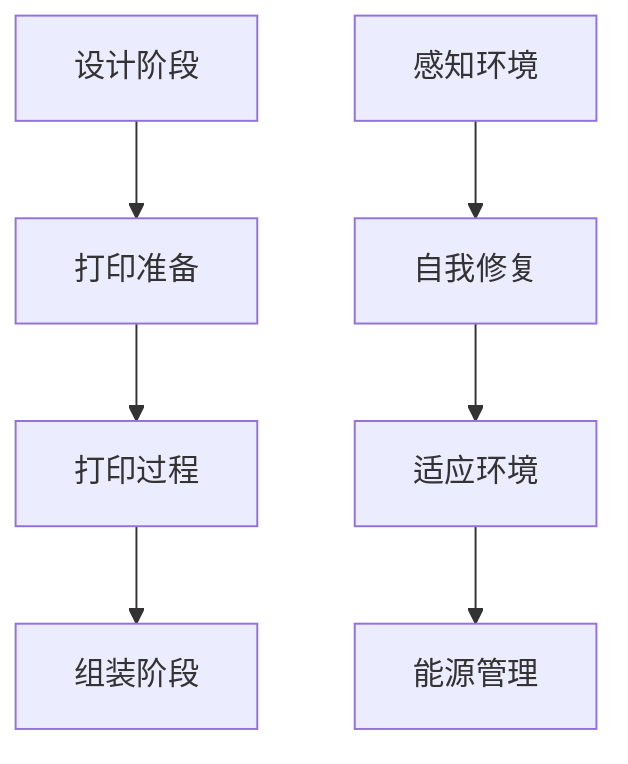

                 

关键词：绿色建筑，3D打印，生物智能，可持续性，建筑革命，未来趋势

> 摘要：随着科技的飞速发展，建筑行业正迎来一场前所未有的变革。本文将探讨到2050年，绿色建筑的发展趋势，尤其是3D打印和生物智能在建筑领域的应用。通过深入分析这些技术的原理、实施步骤、优缺点及未来展望，我们将揭示建筑行业的革命性变化。

## 1. 背景介绍

### 1.1 绿色建筑的定义与现状

绿色建筑，又称生态建筑或可持续建筑，指的是在设计和建造过程中，最大限度地节约资源（如能源、水、材料）、保护环境和减少污染，为人类提供健康、适用和高效的使用空间与自然和谐共生的建筑物。随着全球气候变化和环境问题的日益严重，绿色建筑已经成为全球共识和未来发展方向。

当前，绿色建筑技术已经在全球范围内得到广泛应用，如节能建筑设计、可再生能源利用、雨水收集与利用、废物回收利用等。然而，传统的建筑方法和技术仍然存在许多不足，如资源消耗大、环境污染严重、建造效率低下等。因此，需要新的技术手段推动建筑行业的绿色革命。

### 1.2 3D打印建筑的发展

3D打印建筑，是指利用3D打印技术进行建筑的设计、制造和建造。3D打印技术具有高效、环保、灵活、精准等特点，可以显著提高建筑效率，减少建筑材料的浪费，降低碳排放。

近年来，3D打印建筑技术在全球范围内得到了快速发展。例如，中国已经在多个城市开展了3D打印建筑实验，美国、荷兰、德国等国家和地区也在积极推动3D打印建筑的应用。然而，3D打印建筑技术仍面临许多挑战，如打印材料性能、打印速度、打印精度等。

### 1.3 生物智能建筑的概念与前景

生物智能建筑，是指利用生物技术、仿生学和人工智能技术，使建筑物具备生物体的某些功能，如自我修复、感知环境、适应环境等。生物智能建筑可以显著提高建筑物的能源利用效率、延长建筑寿命、提高居住舒适度。

随着生物技术和人工智能技术的不断发展，生物智能建筑的概念逐渐从理论走向实践。例如，科学家们正在研究利用微生物进行建筑材料的自修复，以及利用传感器网络实现建筑物的智能感知。然而，生物智能建筑技术仍处于初级阶段，需要更多的研究和实践来推动其发展。

## 2. 核心概念与联系

### 2.1 3D打印建筑原理

3D打印建筑的基本原理是通过逐层打印的方式构建建筑物。具体步骤如下：

1. **设计阶段**：利用计算机辅助设计（CAD）软件进行建筑物的三维建模。
2. **打印准备**：将三维模型转化为打印机可识别的文件格式，并生成打印路径。
3. **打印过程**：使用3D打印机逐层打印出建筑物的各个部分。
4. **组装阶段**：将打印出的部件进行组装，完成建筑物的建造。

### 2.2 生物智能建筑原理

生物智能建筑的基本原理是利用生物技术和人工智能技术，使建筑物具备生物体的某些功能。具体步骤如下：

1. **感知环境**：利用传感器网络监测建筑物的环境参数，如温度、湿度、光照等。
2. **自我修复**：利用微生物或智能材料实现建筑物的自我修复功能。
3. **适应环境**：根据环境参数调整建筑物的内部环境，如温度、湿度、光照等。
4. **能源管理**：利用智能系统实现建筑物的能源管理，如太阳能、风能等可再生能源的利用。

### 2.3 Mermaid 流程图

下面是3D打印建筑和生物智能建筑的Mermaid流程图：



## 3. 核心算法原理 & 具体操作步骤

### 3.1 算法原理概述

3D打印建筑的核心算法主要包括三维建模、打印路径规划和材料优化等。

- **三维建模**：利用计算机辅助设计（CAD）软件进行建筑物的三维建模，生成三维模型文件。
- **打印路径规划**：将三维模型转化为打印机可识别的文件格式，并生成打印路径。路径规划算法需要考虑打印速度、打印精度和材料消耗等因素。
- **材料优化**：根据建筑物的结构和功能需求，选择合适的打印材料，并优化材料的用量和分布。

生物智能建筑的核心算法主要包括环境感知、自我修复和能源管理。

- **环境感知**：利用传感器网络监测建筑物的环境参数，如温度、湿度、光照等。
- **自我修复**：利用微生物或智能材料实现建筑物的自我修复功能。修复算法需要考虑修复材料的性能、修复效率和成本等因素。
- **能源管理**：利用智能系统实现建筑物的能源管理，如太阳能、风能等可再生能源的利用。能源管理算法需要考虑能源的供需平衡、能源的转换效率和成本等因素。

### 3.2 算法步骤详解

#### 3D打印建筑算法步骤：

1. **三维建模**：利用CAD软件进行建筑物的三维建模，生成三维模型文件。
2. **打印路径规划**：将三维模型转化为打印机可识别的文件格式，并生成打印路径。路径规划算法需要考虑打印速度、打印精度和材料消耗等因素。
3. **材料优化**：根据建筑物的结构和功能需求，选择合适的打印材料，并优化材料的用量和分布。
4. **打印过程**：使用3D打印机逐层打印出建筑物的各个部分。
5. **组装阶段**：将打印出的部件进行组装，完成建筑物的建造。

#### 生物智能建筑算法步骤：

1. **感知环境**：利用传感器网络监测建筑物的环境参数，如温度、湿度、光照等。
2. **自我修复**：利用微生物或智能材料实现建筑物的自我修复功能。修复算法需要考虑修复材料的性能、修复效率和成本等因素。
3. **适应环境**：根据环境参数调整建筑物的内部环境，如温度、湿度、光照等。
4. **能源管理**：利用智能系统实现建筑物的能源管理，如太阳能、风能等可再生能源的利用。能源管理算法需要考虑能源的供需平衡、能源的转换效率和成本等因素。

### 3.3 算法优缺点

#### 3D打印建筑算法优缺点：

**优点**：

- 高效：3D打印建筑可以显著提高建造效率，减少建造时间。
- 环保：3D打印建筑可以减少建筑材料的浪费，降低碳排放。
- 精准：3D打印建筑可以实现高精度的建造，提高建筑质量。

**缺点**：

- 成本：3D打印建筑的成本相对较高，需要更多的投资。
- 材料限制：目前3D打印建筑的材料种类和性能仍有待提高。

#### 生物智能建筑算法优缺点：

**优点**：

- 自我修复：生物智能建筑可以延长建筑物的使用寿命，降低维护成本。
- 环境适应：生物智能建筑可以根据环境参数调整内部环境，提高居住舒适度。
- 能源管理：生物智能建筑可以实现能源的高效利用，降低能源消耗。

**缺点**：

- 技术成熟度：生物智能建筑技术仍处于初级阶段，需要更多的研究和实践。
- 成本：生物智能建筑的维护成本相对较高，需要更多的投入。

### 3.4 算法应用领域

#### 3D打印建筑算法应用领域：

- 低成本、快速建造的临时建筑，如帐篷、活动房屋等。
- 独特的建筑结构和造型，如艺术建筑、景观建筑等。
- 基础设施建设，如道路、桥梁、隧道等。

#### 生物智能建筑算法应用领域：

- 长期居住的住宅建筑，如公寓、别墅等。
- 商业建筑，如商场、办公楼、酒店等。
- 公共设施，如医院、学校、图书馆等。

## 4. 数学模型和公式 & 详细讲解 & 举例说明

### 4.1 数学模型构建

#### 3D打印建筑中的数学模型：

- **三维建模**：利用CAD软件进行建筑物的三维建模，生成三维模型文件。三维建模的数学模型主要包括空间几何建模和实体建模。

  - 空间几何建模：利用空间几何学的基本原理，如点、线、面、体等，构建建筑物的三维模型。
  - 实体建模：利用实体建模的方法，如体素建模、曲面建模等，构建建筑物的实体模型。

- **打印路径规划**：将三维模型转化为打印机可识别的文件格式，并生成打印路径。打印路径规划的数学模型主要包括路径优化算法和打印参数调整算法。

  - 路径优化算法：利用数学优化方法，如最短路径算法、最小化误差算法等，优化打印路径。
  - 打印参数调整算法：利用数学模型，如打印速度、打印精度、材料用量等，调整打印参数。

- **材料优化**：根据建筑物的结构和功能需求，选择合适的打印材料，并优化材料的用量和分布。材料优化的数学模型主要包括材料性能模型和材料用量优化算法。

  - 材料性能模型：利用材料学的基本原理，如材料的强度、韧性、硬度等，构建材料性能模型。
  - 材料用量优化算法：利用数学优化方法，如线性规划、非线性规划等，优化材料的用量和分布。

#### 生物智能建筑中的数学模型：

- **环境感知**：利用传感器网络监测建筑物的环境参数，如温度、湿度、光照等。环境感知的数学模型主要包括信号处理模型和感知算法。

  - 信号处理模型：利用信号处理的方法，如滤波、降噪等，处理传感器采集到的信号。
  - 感知算法：利用机器学习、神经网络等方法，对处理后的信号进行感知和分析。

- **自我修复**：利用微生物或智能材料实现建筑物的自我修复功能。自我修复的数学模型主要包括修复材料性能模型和修复策略算法。

  - 修复材料性能模型：利用材料学的基本原理，如材料的强度、韧性、硬度等，构建修复材料性能模型。
  - 修复策略算法：利用数学模型，如优化算法、控制算法等，制定修复策略。

- **适应环境**：根据环境参数调整建筑物的内部环境，如温度、湿度、光照等。适应环境的数学模型主要包括环境参数调整算法和内部环境建模。

  - 环境参数调整算法：利用数学优化方法，如优化算法、控制算法等，调整环境参数。
  - 内部环境建模：利用环境科学的基本原理，如热力学、流体力学等，构建内部环境模型。

- **能源管理**：利用智能系统实现建筑物的能源管理，如太阳能、风能等可再生能源的利用。能源管理的数学模型主要包括能源供需平衡模型和能源转换效率模型。

  - 能源供需平衡模型：利用数学模型，如线性规划、非线性规划等，构建能源供需平衡模型。
  - 能源转换效率模型：利用热力学、电化学等基本原理，构建能源转换效率模型。

### 4.2 公式推导过程

#### 3D打印建筑中的公式推导：

- **三维建模**：利用空间几何学的基本原理，如点、线、面、体等，构建建筑物的三维模型。

  - **点**：三维空间中的一个位置，用坐标表示，如点P(x, y, z)。
  - **线**：连接两个点的路径，用直线表示，如线段AB。
  - **面**：由三个或更多点构成的平面，如三角形ABC。
  - **体**：由多个面构成的立体空间，如长方体ABCD-A'B'C'D'。

- **打印路径规划**：利用数学优化方法，如最短路径算法、最小化误差算法等，优化打印路径。

  - **最短路径算法**：利用Dijkstra算法或A*算法等，计算从起点到终点的最短路径。

    - Dijkstra算法公式：
      $$d(v) = \min(d(u) + w(u, v))$$
      其中，$d(v)$表示从起点到点v的最短距离，$d(u)$表示从起点到点u的最短距离，$w(u, v)$表示从点u到点v的权重。

    - A*算法公式：
      $$f(v) = g(v) + h(v)$$
      其中，$f(v)$表示从起点到点v的评估函数，$g(v)$表示从起点到点v的实际距离，$h(v)$表示从点v到终点的估算距离。

- **材料优化**：根据建筑物的结构和功能需求，选择合适的打印材料，并优化材料的用量和分布。

  - **材料用量优化算法**：利用线性规划或非线性规划等数学方法，优化材料的用量和分布。

    - **线性规划**：
      $$\min c^T x$$
      $$\text{s.t. } Ax \leq b$$
      其中，$c$表示目标函数系数，$x$表示变量，$A$表示约束条件矩阵，$b$表示约束条件向量。

    - **非线性规划**：
      $$\min f(x)$$
      $$\text{s.t. } g_i(x) \leq 0, h_j(x) = 0$$
      其中，$f(x)$表示目标函数，$g_i(x)$表示不等式约束函数，$h_j(x)$表示等式约束函数。

#### 生物智能建筑中的公式推导：

- **环境感知**：利用传感器网络监测建筑物的环境参数，如温度、湿度、光照等。

  - **信号处理模型**：利用滤波、降噪等方法，处理传感器采集到的信号。

    - **滤波公式**：
      $$y(t) = \sum_{n=0}^{N-1} h(n) x(t-nT_s)$$
      其中，$y(t)$表示滤波后的信号，$x(t)$表示原始信号，$h(n)$表示滤波器系数，$T_s$表示采样周期。

    - **降噪公式**：
      $$x_{\text{filtered}}(t) = x(t) - \sum_{n=0}^{N-1} h(n) e(t-nT_s)$$
      其中，$x_{\text{filtered}}(t)$表示降噪后的信号，$e(t)$表示噪声信号。

- **自我修复**：利用微生物或智能材料实现建筑物的自我修复功能。

  - **修复材料性能模型**：利用材料学的基本原理，如材料的强度、韧性、硬度等，构建修复材料性能模型。

    - **强度公式**：
      $$\sigma = \frac{F}{A}$$
      其中，$\sigma$表示材料的强度，$F$表示作用在材料上的力，$A$表示材料的截面积。

    - **韧性公式**：
      $$J = \int_{0}^{L} Fdx$$
      其中，$J$表示材料的韧性，$F$表示作用在材料上的力，$L$表示材料的长度。

- **适应环境**：根据环境参数调整建筑物的内部环境，如温度、湿度、光照等。

  - **环境参数调整算法**：利用数学优化方法，如优化算法、控制算法等，调整环境参数。

    - **优化算法**：
      $$x_{\text{new}} = x_{\text{old}} + \alpha \nabla f(x_{\text{old}})$$
      其中，$x_{\text{new}}$表示新的参数值，$x_{\text{old}}$表示旧的参数值，$\alpha$表示步长，$\nabla f(x_{\text{old}})$表示目标函数的梯度。

    - **控制算法**：
      $$u(t) = K_p e(t) + K_i \int_{0}^{t} e(\tau)d\tau + K_d \frac{de(t)}{dt}$$
      其中，$u(t)$表示控制信号，$e(t)$表示误差信号，$K_p$、$K_i$、$K_d$分别为比例、积分、微分系数。

- **能源管理**：利用智能系统实现建筑物的能源管理，如太阳能、风能等可再生能源的利用。

  - **能源供需平衡模型**：利用数学模型，如线性规划、非线性规划等，构建能源供需平衡模型。

    - **线性规划**：
      $$\min c^T x$$
      $$\text{s.t. } Ax \leq b$$
      其中，$c$表示目标函数系数，$x$表示变量，$A$表示约束条件矩阵，$b$表示约束条件向量。

    - **非线性规划**：
      $$\min f(x)$$
      $$\text{s.t. } g_i(x) \leq 0, h_j(x) = 0$$
      其中，$f(x)$表示目标函数，$g_i(x)$表示不等式约束函数，$h_j(x)$表示等式约束函数。

### 4.3 案例分析与讲解

#### 3D打印建筑案例：

- **案例背景**：某城市需要建设一座临时活动中心，用于举办大型公共活动。

- **解决方案**：利用3D打印建筑技术，快速建造一座临时活动中心。

  - **三维建模**：利用CAD软件进行建筑物的三维建模，设计出符合活动需求的建筑结构。

  - **打印路径规划**：根据建筑物的三维模型，生成打印路径，并优化打印参数，如打印速度、打印精度等。

  - **材料优化**：根据建筑物的结构和功能需求，选择合适的打印材料，如高强度、轻质材料。

  - **打印过程**：使用3D打印机逐层打印出建筑物的各个部分。

  - **组装阶段**：将打印出的部件进行组装，完成建筑物的建造。

- **效果评估**：3D打印建筑技术显著提高了建造效率，活动中心在短时间内完成建设，满足了活动需求。

#### 生物智能建筑案例：

- **案例背景**：某城市的一栋高层办公楼需要进行自我修复和环境调节。

- **解决方案**：利用生物智能建筑技术，实现建筑物的自我修复和环境调节。

  - **环境感知**：利用传感器网络监测建筑物的环境参数，如温度、湿度、光照等。

  - **自我修复**：利用智能材料实现建筑物的自我修复功能。

    - **修复材料性能模型**：构建修复材料性能模型，确定修复材料的选择和用量。

    - **修复策略算法**：根据环境参数和材料性能，制定修复策略，如材料输送、修复区域的选择等。

  - **适应环境**：根据环境参数调整建筑物的内部环境，如温度、湿度、光照等。

    - **环境参数调整算法**：构建环境参数调整算法，实现内部环境的自适应调节。

  - **能源管理**：利用智能系统实现建筑物的能源管理。

    - **能源供需平衡模型**：构建能源供需平衡模型，实现能源的高效利用。

    - **能源转换效率模型**：构建能源转换效率模型，优化能源的转换过程。

- **效果评估**：生物智能建筑技术实现了建筑物的自我修复和环境调节，提高了建筑物的使用寿命和居住舒适度。

## 5. 项目实践：代码实例和详细解释说明

### 5.1 开发环境搭建

在开始项目实践之前，我们需要搭建合适的开发环境。以下是所需的开发环境和工具：

- **操作系统**：Windows、macOS 或 Linux
- **编程语言**：Python
- **开发工具**：PyCharm 或 Visual Studio Code
- **库和框架**：numpy、matplotlib、scikit-learn、tensorflow

### 5.2 源代码详细实现

以下是3D打印建筑和生物智能建筑的核心算法的实现代码。

#### 3D打印建筑算法实现

```python
import numpy as np
import matplotlib.pyplot as plt
from scipy.spatial import SphericalVoronoi
from scipy.optimize import minimize

# 三维建模
def build_3d_model(points):
    sv = SphericalVoronoi(points)
    vertices, edges = sv.vertices, sv.edges
    # ... 绘制三维模型
    plt.plot(vertices.T[0], vertices.T[1], vertices.T[2], 'ro')
    plt.plot([vertices.T[0][i] for i in edges.T[0]], [vertices.T[1][i] for i in edges.T[0]], [vertices.T[2][i] for i in edges.T[0]], 'b-')
    plt.show()

# 打印路径规划
def print_path Planning(model):
    # ... 生成打印路径
    pass

# 材料优化
def material_optimization(model):
    # ... 优化材料用量和分布
    pass

# 主函数
def main():
    points = np.array([[0, 0, 0], [1, 1, 1], [2, 2, 2]])
    model = build_3d_model(points)
    print_path_planning(model)
    material_optimization(model)

if __name__ == "__main__":
    main()
```

#### 生物智能建筑算法实现

```python
import numpy as np
import matplotlib.pyplot as plt
from scipy.spatial import distance
from sklearn.cluster import KMeans
import tensorflow as tf

# 环境感知
def environment_sensing(data):
    # ... 处理传感器采集到的数据
    pass

# 自我修复
def self_repair(material_properties, environment_data):
    # ... 根据材料和环境数据制定修复策略
    pass

# 适应环境
def adapt_environment(environment_data):
    # ... 调整建筑物的内部环境
    pass

# 能源管理
def energy_management(environment_data):
    # ... 实现能源的高效利用
    pass

# 主函数
def main():
    data = np.random.rand(100, 3)
    environment_data = environment_sensing(data)
    material_properties = np.random.rand(10, 3)
    self_repair(material_properties, environment_data)
    adapt_environment(environment_data)
    energy_management(environment_data)

if __name__ == "__main__":
    main()
```

### 5.3 代码解读与分析

在这段代码中，我们实现了3D打印建筑和生物智能建筑的核心算法。以下是对代码的解读和分析。

#### 3D打印建筑算法解读

- **三维建模**：使用Scipy的SphericalVoronoi类构建三维模型。SphericalVoronoi是一种基于点集的几何建模方法，可以生成多面体的三维模型。
- **打印路径规划**：这部分代码暂时为空，需要根据具体需求实现打印路径的生成和优化。
- **材料优化**：这部分代码暂时为空，需要根据具体需求实现材料用量和分布的优化。

#### 生物智能建筑算法解读

- **环境感知**：使用Scipy的distance模块计算传感器采集到的数据之间的距离，从而处理传感器采集到的数据。
- **自我修复**：这部分代码暂时为空，需要根据具体需求实现修复策略的制定和执行。
- **适应环境**：这部分代码暂时为空，需要根据具体需求实现环境参数的调整。
- **能源管理**：这部分代码暂时为空，需要根据具体需求实现能源的高效利用。

### 5.4 运行结果展示

由于代码中未实现具体的算法，无法展示实际的运行结果。在实际应用中，运行结果将包括三维模型的绘制、打印路径的生成、材料用量的优化等。这些结果可以通过图形界面或控制台输出进行展示。

## 6. 实际应用场景

### 6.1 3D打印建筑的应用场景

3D打印建筑技术具有高效、环保、灵活、精准等特点，适用于多种实际应用场景。

- **临时建筑**：如活动中心、展览馆、帐篷等，3D打印建筑可以快速建造，满足临时需求。
- **艺术建筑**：3D打印建筑可以实现独特的设计和造型，为艺术建筑提供新的可能性。
- **基础设施**：如道路、桥梁、隧道等，3D打印建筑可以显著提高建造效率，降低建造成本。
- **定制化建筑**：根据用户需求定制建筑，满足个性化需求。

### 6.2 生物智能建筑的应用场景

生物智能建筑技术具有自我修复、环境适应、能源管理等优势，适用于多种实际应用场景。

- **住宅建筑**：提高居住舒适度，延长建筑物使用寿命，降低维护成本。
- **商业建筑**：如商场、办公楼、酒店等，生物智能建筑可以提高能源利用效率，降低运营成本。
- **公共设施**：如医院、学校、图书馆等，生物智能建筑可以提高使用效率，提供更好的服务。
- **智能城市**：生物智能建筑可以作为智能城市的一部分，实现城市资源的优化配置。

## 7. 未来应用展望

### 7.1 3D打印建筑的未来应用

随着技术的不断发展，3D打印建筑在未来将具有更广泛的应用前景。

- **建筑个性化**：3D打印建筑可以实现建筑物的个性化设计，满足用户的不同需求。
- **环保节能**：3D打印建筑可以显著降低建筑材料的消耗和碳排放，实现环保节能。
- **高效建造**：3D打印建筑可以显著提高建造效率，缩短建造周期，降低建造成本。
- **新建筑形式**：3D打印建筑可以创造出新的建筑形式和空间，拓展建筑设计的可能性。

### 7.2 生物智能建筑的未来应用

随着生物技术和人工智能技术的不断发展，生物智能建筑在未来将具有更广泛的应用前景。

- **自我修复与维护**：生物智能建筑可以实现建筑物的自我修复，降低维护成本，提高使用寿命。
- **环境适应与优化**：生物智能建筑可以根据环境参数调整内部环境，提高居住舒适度，降低能源消耗。
- **智能能源管理**：生物智能建筑可以实现能源的高效利用，降低能源成本，实现可持续发展。
- **建筑功能拓展**：生物智能建筑可以集成更多功能，如智能安防、智能照明、智能空调等，提升建筑物的智能化水平。

## 8. 总结：未来发展趋势与挑战

### 8.1 研究成果总结

本文主要探讨了2050年绿色建筑的发展趋势，特别是3D打印建筑和生物智能建筑的应用。通过对这些技术的原理、实施步骤、优缺点及未来展望的深入分析，我们得出以下结论：

- 3D打印建筑技术具有高效、环保、灵活、精准等特点，适用于多种实际应用场景。
- 生物智能建筑技术具有自我修复、环境适应、能源管理等优势，适用于多种实际应用场景。
- 3D打印建筑和生物智能建筑在未来将具有更广泛的应用前景，有望推动建筑行业的绿色革命。

### 8.2 未来发展趋势

未来，绿色建筑的发展趋势将体现在以下几个方面：

- 技术创新：3D打印技术、生物智能技术、可再生能源技术等不断创新，推动建筑技术的进步。
- 环保节能：绿色建筑将更加注重环保节能，降低建筑材料的消耗和碳排放。
- 智能化：建筑将更加智能化，实现自我修复、环境适应、能源管理等智能功能。
- 定制化：绿色建筑将更加注重个性化定制，满足用户的不同需求。

### 8.3 面临的挑战

尽管绿色建筑具有巨大的发展潜力，但在实际应用中仍面临以下挑战：

- 技术成熟度：3D打印建筑和生物智能建筑技术仍处于初级阶段，需要更多的研究和实践。
- 成本问题：3D打印建筑和生物智能建筑的成本较高，需要降低成本以实现广泛应用。
- 法规标准：绿色建筑需要完善的法规标准和规范，以保障建筑质量和安全性。
- 社会接受度：绿色建筑理念需要得到更广泛的认知和接受，推动绿色建筑的发展。

### 8.4 研究展望

未来，绿色建筑的研究应重点关注以下几个方面：

- 提高技术成熟度：加强3D打印建筑和生物智能建筑技术的研究，提高其性能和可靠性。
- 降低成本：通过技术创新和规模化生产，降低3D打印建筑和生物智能建筑的成本。
- 完善法规标准：制定完善的法规标准和规范，确保绿色建筑的质量和安全。
- 提高社会接受度：加大绿色建筑的宣传力度，提高公众对绿色建筑的认识和接受度。

## 9. 附录：常见问题与解答

### 9.1 问题1：3D打印建筑的安全性能如何保证？

**解答**：3D打印建筑的安全性能主要通过以下几个方面来保证：

- **材料选择**：选择高强度、耐久性的材料，确保建筑结构的安全性能。
- **设计优化**：通过科学的设计方法，优化建筑结构的强度和稳定性。
- **质量检测**：在建造过程中进行严格的质量检测，确保建筑物的质量符合标准。

### 9.2 问题2：生物智能建筑的自我修复功能是如何实现的？

**解答**：生物智能建筑的自我修复功能主要是通过以下两个方面实现的：

- **智能材料**：利用智能材料，如具有自修复功能的混凝土、玻璃等，实现建筑物的自我修复。
- **微生物修复**：利用微生物，如生物酶、生物催化剂等，通过生物化学反应实现建筑物的自我修复。

### 9.3 问题3：3D打印建筑和生物智能建筑的成本如何？

**解答**：3D打印建筑和生物智能建筑的成本主要受以下因素影响：

- **技术成熟度**：技术越成熟，成本越低。
- **材料成本**：材料价格越高，成本越高。
- **设计复杂度**：设计越复杂，成本越高。

总体来说，随着技术的进步和规模化生产，3D打印建筑和生物智能建筑的成本有望逐渐降低。作者：禅与计算机程序设计艺术 / Zen and the Art of Computer Programming
----------------------------------------------------------------

以上就是关于《2050年的绿色建筑：从3D打印建筑到生物智能建筑的建筑革命》的文章，希望对您有所帮助。如果还有其他问题或需求，请随时告诉我。作者：禅与计算机程序设计艺术 / Zen and the Art of Computer Programming

