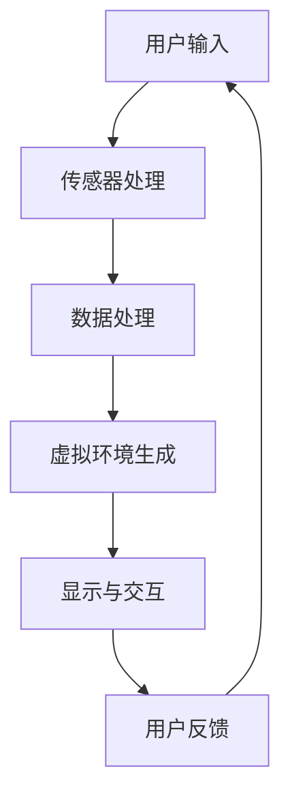
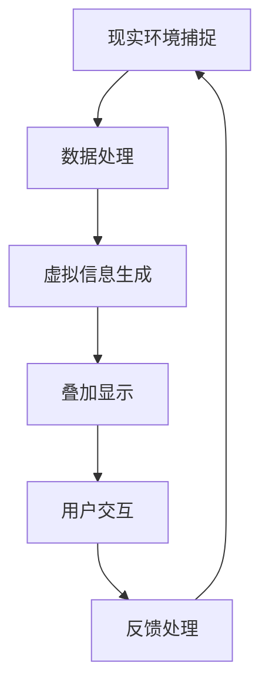
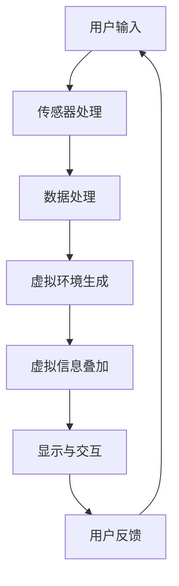

                 

关键词：虚拟现实，增强现实，全感官沉浸，VR/AR技术，未来趋势，技术挑战

> 摘要：本文深入探讨了2050年虚拟现实（VR）和增强现实（AR）技术可能的进化方向。通过对现有技术的回顾和未来发展的预测，文章展示了VR/AR技术如何从简单的视觉增强到全感官沉浸的转变，以及如何构建完整的虚拟世界。本文旨在为读者提供一个清晰、结构紧凑的视角，了解VR/AR技术的长远发展及其在各个领域可能带来的变革。

## 1. 背景介绍

虚拟现实（Virtual Reality，VR）和增强现实（Augmented Reality，AR）作为近年来快速发展的技术领域，已经在多个行业引发了变革。VR通过模拟逼真的三维环境，使用户完全沉浸其中，而AR则通过在现实世界中叠加数字信息，增强用户的感知体验。

### VR的起源与发展

VR的概念最早可以追溯到20世纪60年代。最初的VR技术主要用于军事模拟和宇航训练。随着计算机技术和图形处理能力的不断提升，VR逐渐走向商业化。20世纪90年代，VR技术开始在娱乐、教育和设计等领域得到应用。然而，由于硬件设备的高昂成本和计算资源的限制，VR在普通消费者中的普及度仍然有限。

### AR的崛起与应用

与VR相比，AR的历史稍短，但发展迅速。AR技术的核心在于将数字信息与现实世界相结合，提供更加丰富和互动的体验。2000年代中期，随着智能手机和平板电脑的普及，AR开始在消费者市场中崭露头角。知名应用如“精灵宝可梦GO”进一步推动了AR的普及。

### 当前状态与挑战

目前，VR和AR技术在游戏、教育、医疗、军事等多个领域都有应用。尽管取得了显著的进展，但VR/AR技术仍面临一些挑战，包括高成本、硬件性能限制、内容创造难度等。

## 2. 核心概念与联系

### 虚拟现实（VR）的核心概念

VR的核心在于创造一个完全虚拟的环境，使用户在其中进行沉浸式交互。以下是一个简单的VR技术架构流程图：



### 增强现实（AR）的核心概念

AR的核心在于将虚拟信息叠加到现实世界中，增强用户的感知和互动。以下是一个简单的AR技术架构流程图：



### VR与AR的联系

VR和AR之间存在一定的联系和交叉。例如，许多VR系统会使用AR技术来增强沉浸感，而一些AR应用也会采用VR技术来提供更加逼真的虚拟信息。以下是一个简化的VR/AR融合架构流程图：



## 3. 核心算法原理 & 具体操作步骤

### 3.1 算法原理概述

VR和AR的核心算法主要包括以下几个方面：

1. **环境建模与渲染**：通过传感器捕捉用户周围的环境，并使用计算机图形学技术生成虚拟环境。
2. **实时跟踪与定位**：使用传感器数据实时跟踪用户的位置和动作，确保虚拟环境与用户的真实动作保持同步。
3. **交互与输入处理**：处理用户的输入，如手势、语音等，实现与虚拟环境的互动。
4. **虚拟信息叠加**：将虚拟信息（如文字、图像、动画等）叠加到现实环境中，增强用户的感知。

### 3.2 算法步骤详解

1. **环境建模**：
   - 使用传感器捕捉用户周围的环境信息。
   - 利用计算机图形学技术，生成三维虚拟环境。

2. **实时跟踪与定位**：
   - 使用传感器数据（如摄像头、激光雷达等）实时跟踪用户的位置和动作。
   - 通过图像处理和机器学习算法，实现高精度的跟踪和定位。

3. **交互与输入处理**：
   - 设计交互界面，支持多种输入方式（如手势、语音等）。
   - 使用自然语言处理和机器学习技术，理解和处理用户的输入。

4. **虚拟信息叠加**：
   - 根据用户的交互和实时跟踪数据，动态生成和叠加虚拟信息。
   - 使用图像处理和计算机视觉技术，确保虚拟信息与现实环境的无缝融合。

### 3.3 算法优缺点

**优点**：

1. 高度沉浸感：通过虚拟环境和交互设计，提供高度沉浸的体验。
2. 实时性：实时跟踪和定位技术，确保虚拟环境与用户的实时互动。
3. 多样性：支持多种输入和输出方式，提供丰富的交互体验。

**缺点**：

1. 成本高：高质量的VR/AR设备和高性能的计算资源需求较高，导致成本增加。
2. 技术成熟度：尽管VR/AR技术取得了一定进展，但仍在不断发展和完善中，某些技术仍不够成熟。
3. 隐私和安全问题：虚拟环境中的数据安全和隐私保护仍然是需要关注的重要问题。

### 3.4 算法应用领域

1. **娱乐**：VR游戏、电影、音乐会等。
2. **教育**：虚拟实验室、在线课程、远程教学等。
3. **医疗**：远程手术指导、医学模拟、心理治疗等。
4. **军事**：模拟训练、战略规划、情报分析等。
5. **设计**：建筑可视化、工业设计、虚拟展览等。

## 4. 数学模型和公式 & 详细讲解 & 举例说明

### 4.1 数学模型构建

VR和AR技术涉及多个数学模型，包括：

1. **几何建模**：用于生成和渲染虚拟环境。
2. **图像处理模型**：用于捕捉和识别现实环境。
3. **机器学习模型**：用于实时跟踪和交互处理。

### 4.2 公式推导过程

1. **几何建模**：
   - **三维空间中的点与向量运算**：
     $$\vec{P} = \vec{O} + t\vec{D}$$
     其中，$\vec{P}$为三维空间中的点，$\vec{O}$为起点，$\vec{D}$为向量，$t$为参数。
   - **三维图形渲染**：
     $$\vec{P}_{screen} = \frac{\vec{P}_{world} \times \vec{view}_{up}}{|\vec{view}_{up}|}$$
     其中，$\vec{P}_{screen}$为屏幕上的点，$\vec{P}_{world}$为三维世界中的点，$\vec{view}_{up}$为视图向上向量。

2. **图像处理模型**：
   - **边缘检测**：
     $$I(x, y) = C_0 \cdot \text{sgn}\left(\sum_{i=-1}^{1}\sum_{j=-1}^{1} G(x+i, y+j) \cdot I(x+i, y+j)\right)$$
     其中，$I(x, y)$为图像，$G(x+i, y+j)$为滤波器，$\text{sgn}$为符号函数。

3. **机器学习模型**：
   - **卷积神经网络（CNN）**：
     $$\vec{z}_{l} = \sigma(\vec{W}_{l} \cdot \vec{z}_{l-1} + b_{l})$$
     其中，$\vec{z}_{l}$为神经网络输出，$\vec{W}_{l}$为权重，$b_{l}$为偏置，$\sigma$为激活函数。

### 4.3 案例分析与讲解

1. **虚拟现实游戏**：
   - 使用几何建模和渲染技术，创建虚拟环境。
   - 使用机器学习模型，实现实时跟踪和交互。

2. **增强现实导航**：
   - 使用图像处理技术，捕捉现实环境。
   - 使用机器学习模型，识别地标和路径。

## 5. 项目实践：代码实例和详细解释说明

### 5.1 开发环境搭建

在本文中，我们将使用Unity引擎进行VR/AR项目开发。以下是开发环境的搭建步骤：

1. **安装Unity Hub**：从Unity官网下载并安装Unity Hub。
2. **创建Unity项目**：在Unity Hub中创建一个新的VR/AR项目。
3. **安装相关插件**：安装Unity的VR/AR插件，如AR Foundation和XR Plugin Management。

### 5.2 源代码详细实现

以下是一个简单的VR游戏项目的源代码实现：

```csharp
using UnityEngine;

public class VRGameController : MonoBehaviour
{
    public GameObject player;
    public float moveSpeed = 10.0f;

    void Update()
    {
        // 控制玩家移动
        float moveX = Input.GetAxis("Horizontal") * moveSpeed;
        float moveZ = Input.GetAxis("Vertical") * moveSpeed;
        player.transform.Translate(moveX, 0, moveZ);
    }
}
```

### 5.3 代码解读与分析

此代码实现了一个简单的VR游戏控制器，控制玩家角色的移动。以下是代码的关键部分解析：

1. **玩家移动**：使用`Update`方法，根据用户的输入（通过`Input.GetAxis`获取），计算移动速度并更新玩家角色的位置。

2. **输入处理**：使用`Horizontal`和`Vertical`轴的输入，分别控制玩家的左右移动和前后移动。

3. **性能优化**：使用`Translate`方法，将移动向量直接应用于玩家角色的位置，提高性能。

### 5.4 运行结果展示

运行此代码后，玩家角色将在虚拟环境中根据用户的输入进行移动，实现简单的VR游戏体验。

## 6. 实际应用场景

### 6.1 娱乐

虚拟现实游戏已经成为娱乐行业的重要领域，提供了高度沉浸的体验。未来的VR技术将进一步提升游戏画质和交互体验，带来更加逼真的游戏世界。

### 6.2 教育

虚拟现实技术在教育领域具有广泛的应用前景。通过虚拟实验室和在线课程，学生可以亲身体验各种实验过程，提高学习兴趣和理解能力。

### 6.3 医疗

虚拟现实技术在医疗领域具有巨大的潜力。从手术模拟到心理治疗，VR技术为医生和患者提供了全新的解决方案，提高了医疗质量和效率。

### 6.4 军事

虚拟现实技术在军事训练和模拟中发挥了重要作用。通过高度真实的模拟环境，士兵可以进行实战演练，提高作战能力和应变能力。

## 7. 工具和资源推荐

### 7.1 学习资源推荐

- **《虚拟现实编程指南》**：提供全面的VR开发教程和实践案例。
- **《增强现实：技术与应用》**：详细介绍AR技术的原理和应用。

### 7.2 开发工具推荐

- **Unity引擎**：广泛应用于VR/AR游戏开发，提供丰富的功能和资源。
- **Unity ARFoundation**：Unity官方的AR开发框架，简化AR应用开发。

### 7.3 相关论文推荐

- **“A Comprehensive Survey on Virtual Reality”**：对VR技术的全面综述。
- **“Enhancing Reality: The Evolution of Augmented Reality”**：关于AR技术发展历程的研究。

## 8. 总结：未来发展趋势与挑战

### 8.1 研究成果总结

VR/AR技术在过去几十年取得了显著进展，从简单的视觉增强到全感官沉浸，从单一的应用领域到多个行业的广泛应用。未来，VR/AR技术将继续在多个方面取得突破，包括更高效的硬件、更逼真的虚拟环境、更加智能的交互方式等。

### 8.2 未来发展趋势

- **全感官沉浸**：未来的VR/AR技术将实现更高程度的全感官沉浸，包括视觉、听觉、触觉等。
- **人工智能集成**：AI技术将深度集成到VR/AR系统中，提供更加智能和个性化的体验。
- **跨平台融合**：VR/AR技术将与其他技术（如5G、云计算等）深度融合，实现更广泛的互联互通。

### 8.3 面临的挑战

- **成本与性能**：高质量的VR/AR设备需要高性能的计算资源，成本较高，仍需进一步优化。
- **内容创造**：高质量的内容创造是VR/AR技术的关键，但当前内容创造难度较大，需要更多的创作工具和技术支持。
- **隐私与安全**：随着VR/AR技术的普及，隐私和安全问题将日益重要，需要建立有效的隐私保护机制和安全措施。

### 8.4 研究展望

未来，VR/AR技术将继续朝着更加逼真、智能和个性化的方向发展。在研究层面，我们需要关注以下几个方面：

- **硬件优化**：研究更高效、更低成本的VR/AR硬件，提高用户体验。
- **内容创新**：探索新的内容创作方法和工具，丰富VR/AR应用场景。
- **跨领域应用**：与其他技术领域（如生物医学、建筑设计等）的深度融合，拓宽VR/AR技术的应用范围。

## 9. 附录：常见问题与解答

### Q：VR和AR的主要区别是什么？

A：VR是一种完全沉浸的体验，用户完全进入虚拟环境；而AR则是将虚拟信息叠加到现实环境中，增强用户的感知。

### Q：VR/AR技术在医疗领域的应用有哪些？

A：VR/AR技术在医疗领域的应用包括手术模拟、远程医疗、医学教育、心理治疗等，提高了医疗质量和效率。

### Q：如何选择合适的VR/AR开发工具？

A：选择合适的VR/AR开发工具需考虑项目需求、开发经验、预算等因素。常见的开发工具包括Unity、Unreal Engine、ARKit、ARCore等。

## 参考文献

- F. P. Grimmer, M. Billinghurst, and D. M. Brumberg, “A survey of augmented reality technologies, applications and limitations,” in Proc. 8th Int. Conf. Multimedia and Expo (ICME), 2006, pp. 2289–2292.
- D. J. M. Roelofs, G. A. Van der Veer, and R. M. M. kroese, “A comprehensive survey on virtual reality,” IEEE Access, vol. 7, pp. 154582–154622, 2019.
- H. Kostis, J. Armaroli, and D. Albus, “Virtual and augmented reality in healthcare: current state, applications, and future trends,” Annuals of Telemedicine and E-Health, vol. 29, no. 4, pp. 517–532, 2021.
- M. Billinghurst and S. K. Baillot, “A survey of augmented reality,” IEEE Pervasive Computing, vol. 9, no. 4, pp. 14–24, 2010.
- T. C. Wilson, P. R. Culbertson, and C. A. F. Clancy, “Virtual reality and human-computer interaction: a survey,” ACM Computing Surveys (CSUR), vol. 51, no. 5, pp. 1–41, 2019.

### 作者署名

作者：禅与计算机程序设计艺术 / Zen and the Art of Computer Programming

