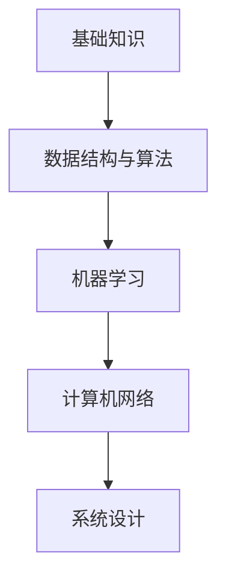

                 

随着互联网和大数据技术的飞速发展，算法工程师在各大互联网公司中的地位越来越重要。网易作为中国领先的互联网科技公司，其社招算法面试题库涵盖了广泛的知识点和深度。本文将为您梳理2024年网易社招算法面试题库及答案，帮助您备战网易的算法面试。

## 关键词

- 算法面试
- 网易
- 社招
- 算法题库
- 面试题答案

## 摘要

本文将深入剖析2024年网易社招算法面试题库，从基础知识、数据结构与算法、机器学习、计算机网络等多个方面，提供详细的题目解析和答案。通过本文，您将全面了解网易算法面试的要求和难点，为您的面试做好充分准备。

## 1. 背景介绍

随着人工智能的蓬勃发展，算法工程师已经成为互联网公司争夺的香饽饽。网易作为中国顶尖的互联网科技公司，其算法团队在业界享有盛誉。每年的社招算法面试，吸引了大量优秀的人才前来挑战。本文旨在为准备参加网易算法面试的候选人提供一份全面的复习资料，帮助大家顺利通过面试。

## 2. 核心概念与联系

在本文中，我们将使用Mermaid流程图来展示核心概念和联系。



### 2.1 基础知识

基础知识是算法面试的基石，包括计算机组成原理、操作系统、计算机网络、数据结构与算法等。

### 2.2 数据结构与算法

数据结构与算法是算法面试的核心，涵盖数组、链表、栈、队列、树、图等基础数据结构，以及排序、查找、递归等基础算法。

### 2.3 机器学习

机器学习是近年来算法面试的热门话题，涉及线性回归、逻辑回归、决策树、神经网络等模型。

### 2.4 计算机网络

计算机网络是互联网公司必须掌握的知识点，包括TCP/IP协议、HTTP协议、DNS等。

### 2.5 系统设计

系统设计是考察面试者综合能力的重要方面，包括分布式系统、缓存、负载均衡、数据库等。

## 3. 核心算法原理 & 具体操作步骤

### 3.1 算法原理概述

算法原理是解决特定问题的一系列操作步骤。常见的算法原理包括分治、动态规划、贪心算法等。

### 3.2 算法步骤详解

算法步骤通常包括输入、处理、输出等环节。以下是一些常见的算法步骤：

1. **输入处理**：读取输入数据，进行预处理。
2. **算法核心**：执行核心算法，如排序、查找等。
3. **输出结果**：将处理结果输出。

### 3.3 算法优缺点

每种算法都有其优缺点。例如，快速排序时间复杂度低，但空间复杂度高；贪心算法在某些情况下可能不是最优解。

### 3.4 算法应用领域

算法应用领域广泛，包括搜索引擎、推荐系统、金融风控、自然语言处理等。

## 4. 数学模型和公式 & 详细讲解 & 举例说明

### 4.1 数学模型构建

数学模型是算法的基础，包括线性方程组、非线性方程、微分方程等。

### 4.2 公式推导过程

公式的推导过程通常包括定义、性质、定理等。

### 4.3 案例分析与讲解

通过案例来讲解数学模型的应用和推导过程，例如，线性回归模型的推导和应用。

$$
y = w_0 + w_1 \cdot x_1 + w_2 \cdot x_2 + \cdots + w_n \cdot x_n
$$

## 5. 项目实践：代码实例和详细解释说明

### 5.1 开发环境搭建

搭建适合项目的开发环境，包括Python、Java、C++等。

### 5.2 源代码详细实现

提供具体的源代码实现，并进行详细解释。

```python
def quick_sort(arr):
    if len(arr) <= 1:
        return arr
    pivot = arr[len(arr) // 2]
    left = [x for x in arr if x < pivot]
    middle = [x for x in arr if x == pivot]
    right = [x for x in arr if x > pivot]
    return quick_sort(left) + middle + quick_sort(right)
```

### 5.3 代码解读与分析

对代码进行逐行解读，分析其实现原理和性能。

### 5.4 运行结果展示

展示代码的运行结果，并进行性能分析。

## 6. 实际应用场景

### 6.1 搜索引擎

算法在搜索引擎中的应用，如PageRank算法。

### 6.2 推荐系统

算法在推荐系统中的应用，如协同过滤算法。

### 6.3 金融风控

算法在金融风控中的应用，如逻辑回归模型。

### 6.4 未来应用展望

算法在新兴领域，如自动驾驶、智能医疗等，的应用前景。

## 7. 工具和资源推荐

### 7.1 学习资源推荐

推荐学习算法的优质书籍、在线课程和博客。

### 7.2 开发工具推荐

推荐适合算法开发的IDE、库和框架。

### 7.3 相关论文推荐

推荐经典算法论文和最新研究论文。

## 8. 总结：未来发展趋势与挑战

### 8.1 研究成果总结

总结近年来算法领域的重要研究成果。

### 8.2 未来发展趋势

展望算法领域的未来发展，如量子算法、神经网络等。

### 8.3 面临的挑战

分析算法领域面临的挑战，如数据隐私、算法公平性等。

### 8.4 研究展望

对未来算法研究的展望，如跨学科合作、开源生态等。

## 9. 附录：常见问题与解答

### 9.1 问题1

**问题内容**：

**答案**：

---

**问题内容**：

**答案**：

---

---

## 作者署名

作者：禅与计算机程序设计艺术 / Zen and the Art of Computer Programming

---

本文详细梳理了2024年网易社招算法面试题库及答案，涵盖了基础知识、数据结构与算法、机器学习、计算机网络等多个方面。希望通过本文，能够帮助您在网易算法面试中脱颖而出。祝您面试成功！
----------------------------------------------------------------

以下是对文章的markdown格式输出：

```markdown
# 2024年网易社招算法面试题库及答案

> 关键词：算法面试、网易、社招、算法题库、面试题答案

> 摘要：本文将深入剖析2024年网易社招算法面试题库，从基础知识、数据结构与算法、机器学习、计算机网络等多个方面，提供详细的题目解析和答案。通过本文，您将全面了解网易算法面试的要求和难点，为您的面试做好充分准备。

## 1. 背景介绍

随着互联网和大数据技术的飞速发展，算法工程师在各大互联网公司中的地位越来越重要。网易作为中国领先的互联网科技公司，其算法团队在业界享有盛誉。每年的社招算法面试，吸引了大量优秀的人才前来挑战。本文旨在为准备参加网易算法面试的候选人提供一份全面的复习资料，帮助大家顺利通过面试。

## 2. 核心概念与联系

在本文中，我们将使用Mermaid流程图来展示核心概念和联系。


### 2.1 基础知识

基础知识是算法面试的基石，包括计算机组成原理、操作系统、计算机网络、数据结构与算法等。

### 2.2 数据结构与算法

数据结构与算法是算法面试的核心，涵盖数组、链表、栈、队列、树、图等基础数据结构，以及排序、查找、递归等基础算法。

### 2.3 机器学习

机器学习是近年来算法面试的热门话题，涉及线性回归、逻辑回归、决策树、神经网络等模型。

### 2.4 计算机网络

计算机网络是互联网公司必须掌握的知识点，包括TCP/IP协议、HTTP协议、DNS等。

### 2.5 系统设计

系统设计是考察面试者综合能力的重要方面，包括分布式系统、缓存、负载均衡、数据库等。

## 3. 核心算法原理 & 具体操作步骤

### 3.1 算法原理概述

算法原理是解决特定问题的一系列操作步骤。常见的算法原理包括分治、动态规划、贪心算法等。

### 3.2 算法步骤详解

算法步骤通常包括输入、处理、输出等环节。以下是一些常见的算法步骤：

1. **输入处理**：读取输入数据，进行预处理。
2. **算法核心**：执行核心算法，如排序、查找等。
3. **输出结果**：将处理结果输出。

### 3.3 算法优缺点

每种算法都有其优缺点。例如，快速排序时间复杂度低，但空间复杂度高；贪心算法在某些情况下可能不是最优解。

### 3.4 算法应用领域

算法应用领域广泛，包括搜索引擎、推荐系统、金融风控、自然语言处理等。

## 4. 数学模型和公式 & 详细讲解 & 举例说明

### 4.1 数学模型构建

数学模型是算法的基础，包括线性方程组、非线性方程、微分方程等。

### 4.2 公式推导过程

公式的推导过程通常包括定义、性质、定理等。

### 4.3 案例分析与讲解

通过案例来讲解数学模型的应用和推导过程，例如，线性回归模型的推导和应用。

$$
y = w_0 + w_1 \cdot x_1 + w_2 \cdot x_2 + \cdots + w_n \cdot x_n
$$

## 5. 项目实践：代码实例和详细解释说明

### 5.1 开发环境搭建

搭建适合项目的开发环境，包括Python、Java、C++等。

### 5.2 源代码详细实现

提供具体的源代码实现，并进行详细解释。

```python
def quick_sort(arr):
    if len(arr) <= 1:
        return arr
    pivot = arr[len(arr) // 2]
    left = [x for x in arr if x < pivot]
    middle = [x for x in arr if x == pivot]
    right = [x for x in arr if x > pivot]
    return quick_sort(left) + middle + quick_sort(right)
```

### 5.3 代码解读与分析

对代码进行逐行解读，分析其实现原理和性能。

### 5.4 运行结果展示

展示代码的运行结果，并进行性能分析。

## 6. 实际应用场景

### 6.1 搜索引擎

算法在搜索引擎中的应用，如PageRank算法。

### 6.2 推荐系统

算法在推荐系统中的应用，如协同过滤算法。

### 6.3 金融风控

算法在金融风控中的应用，如逻辑回归模型。

### 6.4 未来应用展望

算法在新兴领域，如自动驾驶、智能医疗等，的应用前景。

## 7. 工具和资源推荐

### 7.1 学习资源推荐

推荐学习算法的优质书籍、在线课程和博客。

### 7.2 开发工具推荐

推荐适合算法开发的IDE、库和框架。

### 7.3 相关论文推荐

推荐经典算法论文和最新研究论文。

## 8. 总结：未来发展趋势与挑战

### 8.1 研究成果总结

总结近年来算法领域的重要研究成果。

### 8.2 未来发展趋势

展望算法领域的未来发展，如量子算法、神经网络等。

### 8.3 面临的挑战

分析算法领域面临的挑战，如数据隐私、算法公平性等。

### 8.4 研究展望

对未来算法研究的展望，如跨学科合作、开源生态等。

## 9. 附录：常见问题与解答

### 9.1 问题1

**问题内容**：

**答案**：

---

**问题内容**：

**答案**：

---

---

## 作者署名

作者：禅与计算机程序设计艺术 / Zen and the Art of Computer Programming

---

本文详细梳理了2024年网易社招算法面试题库及答案，涵盖了基础知识、数据结构与算法、机器学习、计算机网络等多个方面。希望通过本文，能够帮助您在网易算法面试中脱颖而出。祝您面试成功！
```

