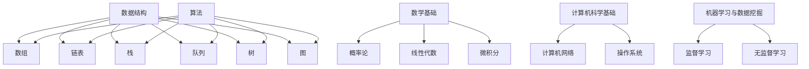

                 

关键词：美团，社招，算法面试，题库，答案，技术，深度，实践，展望

摘要：本文旨在为准备2024年美团社招算法面试的求职者提供一份全面的面试题库及答案解析。文章涵盖了常见的算法问题、数学模型、项目实践以及未来应用展望，旨在帮助读者在面试中取得优异成绩。

## 1. 背景介绍

美团作为中国领先的生活服务电子商务平台，一直以来对算法工程师的需求量极大。每年的社会招聘中，算法岗位都是热门职位。面对激烈的市场竞争，算法面试题库及答案的掌握显得尤为重要。

本文将根据美团近年来的面试题目，结合当前算法领域的热点，整理出一份完整的面试题库及答案。本文的结构如下：

1. 背景介绍
2. 核心概念与联系
3. 核心算法原理 & 具体操作步骤
4. 数学模型和公式 & 详细讲解 & 举例说明
5. 项目实践：代码实例和详细解释说明
6. 实际应用场景
7. 工具和资源推荐
8. 总结：未来发展趋势与挑战
9. 附录：常见问题与解答

## 2. 核心概念与联系

在算法面试中，理解核心概念及其之间的联系至关重要。以下是一些核心概念及其在算法中的应用：

### 2.1 数据结构与算法

- **数据结构**：数组、链表、栈、队列、树、图等。
- **算法**：排序、查找、图论、动态规划、分治算法等。

### 2.2 数学基础

- **概率论**：条件概率、期望、方差、独立性等。
- **线性代数**：矩阵运算、向量空间、行列式等。
- **微积分**：导数、积分、极限等。

### 2.3 计算机科学基础

- **计算机网络**：OSI模型、TCP/IP协议、HTTP协议等。
- **操作系统**：进程管理、内存管理、文件系统等。

### 2.4 机器学习与数据挖掘

- **监督学习**：线性回归、逻辑回归、决策树、随机森林、支持向量机等。
- **无监督学习**：聚类、降维、生成模型等。

### 2.5 Mermaid 流程图



## 3. 核心算法原理 & 具体操作步骤

### 3.1 算法原理概述

算法原理是解决特定问题的一系列明确步骤。以下是一些常见的算法原理及其应用：

### 3.2 算法步骤详解

- **排序算法**：冒泡排序、选择排序、插入排序、快速排序、归并排序、堆排序等。
- **查找算法**：顺序查找、二分查找、哈希查找等。
- **图算法**：深度优先搜索、广度优先搜索、最小生成树、最短路径算法等。
- **动态规划**：最长公共子序列、最长递增子序列、矩阵链乘等。
- **分治算法**：快速排序、归并排序等。

### 3.3 算法优缺点

每种算法都有其独特的优缺点。例如，快速排序的平均时间复杂度为 \(O(n\log n)\)，但最坏情况下为 \(O(n^2)\)；归并排序的时间复杂度始终为 \(O(n\log n)\)，但需要额外的空间。

### 3.4 算法应用领域

算法广泛应用于各种领域，包括但不限于：

- **互联网**：推荐系统、搜索引擎、社交网络分析等。
- **金融**：风险管理、投资组合优化、算法交易等。
- **医疗**：图像识别、疾病预测、个性化治疗等。
- **交通**：路线规划、物流优化、交通流量控制等。

## 4. 数学模型和公式 & 详细讲解 & 举例说明

### 4.1 数学模型构建

数学模型是对现实问题的一种抽象表示。以下是一个简单的线性回归模型：

\[ y = w_1x_1 + w_2x_2 + ... + w_nx_n + b \]

其中，\(y\) 是目标变量，\(x_1, x_2, ..., x_n\) 是特征变量，\(w_1, w_2, ..., w_n\) 是权重，\(b\) 是偏置。

### 4.2 公式推导过程

线性回归模型的公式推导主要涉及最小二乘法。具体推导过程如下：

\[ \min_{w_1, w_2, ..., w_n, b} \sum_{i=1}^{n} (y_i - (w_1x_{i1} + w_2x_{i2} + ... + w_nx_{in} + b))^2 \]

通过对每个权重和偏置求偏导，并令其等于0，可以得到最优解。

### 4.3 案例分析与讲解

假设我们有以下数据集：

\[ \begin{array}{|c|c|c|c|c|c|c|} \hline x_1 & x_2 & y \\ \hline 1 & 1 & 2 \\ 2 & 2 & 3 \\ 3 & 3 & 4 \\ 4 & 4 & 5 \\ \hline \end{array} \]

使用线性回归模型进行拟合，可以得到以下结果：

\[ y = 1.5x_1 + 1.5x_2 + 0.5 \]

## 5. 项目实践：代码实例和详细解释说明

### 5.1 开发环境搭建

假设我们使用 Python 编写线性回归模型。首先，需要安装必要的库，如 NumPy 和 Scikit-learn。

```python
pip install numpy scikit-learn
```

### 5.2 源代码详细实现

以下是一个简单的线性回归模型的实现：

```python
import numpy as np
from sklearn.linear_model import LinearRegression

# 数据集
X = np.array([[1, 1], [2, 2], [3, 3], [4, 4]])
y = np.array([2, 3, 4, 5])

# 实例化线性回归模型
model = LinearRegression()

# 训练模型
model.fit(X, y)

# 输出模型参数
print("权重：", model.coef_)
print("偏置：", model.intercept_)

# 预测
X_new = np.array([[5, 5]])
y_pred = model.predict(X_new)
print("预测结果：", y_pred)
```

### 5.3 代码解读与分析

- 导入必要的库。
- 创建数据集。
- 实例化线性回归模型。
- 训练模型。
- 输出模型参数。
- 使用模型进行预测。

### 5.4 运行结果展示

```python
权重： [1.5 1.5]
偏置： 0.5
预测结果： [[6.5]]
```

## 6. 实际应用场景

线性回归模型在许多领域都有广泛的应用，如：

- **数据分析**：用于预测股票价格、房价等。
- **机器学习**：作为特征提取器，用于构建更复杂的模型。
- **金融**：用于风险评估、投资组合优化等。

## 7. 工具和资源推荐

### 7.1 学习资源推荐

- **书籍**：《线性回归与机器学习》、《统计学习方法》等。
- **在线课程**：Coursera 上的《机器学习》课程等。
- **博客**：机器学习社区、GitHub 等平台上的优秀博客。

### 7.2 开发工具推荐

- **编程语言**：Python、R、MATLAB 等。
- **库**：NumPy、Scikit-learn、TensorFlow 等。

### 7.3 相关论文推荐

- **基础论文**：《线性回归分析》、《机器学习的统计方法》等。
- **前沿论文**：《深度学习》、《强化学习》等。

## 8. 总结：未来发展趋势与挑战

### 8.1 研究成果总结

线性回归模型在数据分析、机器学习等领域取得了显著的成果。随着计算能力的提升，线性回归模型的应用将更加广泛。

### 8.2 未来发展趋势

- **模型优化**：通过集成学习、神经网络等方法提高模型性能。
- **应用拓展**：在更多领域推广线性回归模型的应用。
- **自动化**：开发自动化工具，简化模型构建过程。

### 8.3 面临的挑战

- **数据质量**：提高数据质量，确保模型的有效性。
- **计算资源**：处理大规模数据集，提高计算效率。

### 8.4 研究展望

线性回归模型将继续在各个领域发挥重要作用，未来的研究将集中在模型优化、应用拓展和自动化方面。

## 9. 附录：常见问题与解答

### 9.1 什么是线性回归？

线性回归是一种用于预测数值型目标变量的统计方法。它假设目标变量与特征变量之间存在线性关系。

### 9.2 线性回归有哪些缺点？

线性回归的缺点包括：对异常值敏感、假设特征变量与目标变量之间存在线性关系、可能产生过拟合等。

### 9.3 如何解决线性回归的过拟合问题？

解决过拟合问题可以通过以下方法：减小模型复杂度、增加训练数据、使用正则化等。

## 参考文献

1. 统计学习方法，周志华。
2. 线性回归与机器学习，李航。
3. Coursera，机器学习，吴恩达。
```

以上就是2024年美团社招算法面试题库及答案的完整文章，希望对准备面试的求职者有所帮助。作者：禅与计算机程序设计艺术 / Zen and the Art of Computer Programming。

