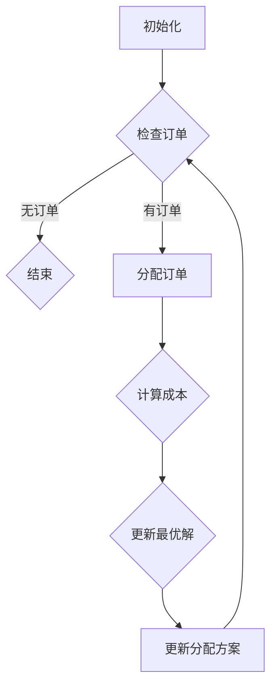

                 

关键词：美团、社招、配送员、调度算法、面试题、汇总

摘要：本文旨在为准备参加2025年美团社招配送员调度算法工程师面试的考生提供一个全面的面试题汇总，涵盖从基础知识到高级应用的一系列问题。文章将从多个角度深入剖析调度算法的原理、数学模型、应用场景以及未来的发展趋势，帮助读者充分准备面试，掌握核心技术。

## 1. 背景介绍

美团作为中国领先的生活服务电子商务平台，其业务涵盖了餐饮外卖、打车、酒店预订等多个领域。配送员调度作为美团平台的核心组成部分，直接影响到用户体验和服务效率。合理的配送员调度算法不仅能够提高配送效率，降低成本，还能提升用户满意度。因此，美团对配送员调度算法工程师的需求量逐年增加，竞争也愈发激烈。

本文将围绕以下几个核心问题展开：

- 配送员调度算法的基本概念和原理是什么？
- 如何构建和优化配送员调度算法？
- 在实际项目中，如何应用这些算法？
- 面试中可能遇到的问题有哪些？

通过本文，我们希望帮助读者全面了解配送员调度算法，为面试做好充分准备。

## 2. 核心概念与联系

在深入探讨配送员调度算法之前，首先需要理解以下几个核心概念：

### 2.1 调度算法

调度算法是指用于解决资源分配和任务安排问题的算法。在配送员调度的背景下，调度算法主要解决如何合理地将订单分配给配送员，确保每个配送员的工作量均衡，同时满足订单的送达时间要求。

### 2.2 最优化

最优化是调度算法的核心目标之一，即通过数学模型和算法找到最优的配送员分配方案，使得总成本最小或者总效用最大。

### 2.3 贪心算法

贪心算法是一种在每一步选择中都采取当前最好或最优的选择，从而希望导致结果是全局最好或最优的算法。在配送员调度中，贪心算法可以用于快速生成一个近似最优的分配方案。

### 2.4 动态规划

动态规划是一种解决多阶段决策问题的高效算法。在配送员调度中，动态规划可以用于解决具有时间窗口限制的配送问题，确保每个配送员在给定的时间窗口内完成任务。

### 2.5 模拟退火算法

模拟退火算法是一种基于概率的启发式算法，通过模拟物理退火过程来寻找最优解。在配送员调度中，模拟退火算法可以用于解决复杂度较高的优化问题，如多配送员协同调度。

### 2.6 Mermaid 流程图

以下是配送员调度算法的 Mermaid 流程图：



## 3. 核心算法原理 & 具体操作步骤

### 3.1 算法原理概述

配送员调度算法的主要目标是找到一组配送员分配方案，使得每个配送员的工作量尽可能均衡，同时满足订单的送达时间要求。常见的调度算法包括：

- **贪心算法**：每次分配订单时，选择当前最优的配送员，直到所有订单分配完毕。
- **动态规划**：将问题分解为多个子问题，通过自底向上的方式求解。
- **模拟退火算法**：通过模拟物理退火过程来寻找最优解，适用于复杂度较高的优化问题。

### 3.2 算法步骤详解

以贪心算法为例，其具体步骤如下：

1. **初始化**：设置初始状态，包括配送员的初始位置和订单的初始状态。
2. **分配订单**：遍历所有订单，对于每个订单，选择距离订单最近的空闲配送员进行分配。
3. **计算成本**：对于每个分配方案，计算总成本，包括配送员的移动成本和订单的延误成本。
4. **更新最优解**：如果当前分配方案的总成本小于之前的最优解，则更新最优解。
5. **更新分配方案**：根据最优解更新配送员的分配方案。

### 3.3 算法优缺点

- **贪心算法**：
  - 优点：简单易实现，计算速度快。
  - 缺点：可能无法找到全局最优解，适用于近似最优解的场景。

- **动态规划**：
  - 优点：可以找到全局最优解，适用于具有时间窗口限制的问题。
  - 缺点：计算复杂度较高，适用于小规模问题。

- **模拟退火算法**：
  - 优点：适用于复杂度较高的优化问题，可以找到较优的解。
  - 缺点：收敛速度较慢，适用于大规模问题。

### 3.4 算法应用领域

配送员调度算法广泛应用于外卖、快递、物流等领域，其主要应用场景包括：

- **外卖配送**：解决外卖订单的快速配送问题，提高用户满意度。
- **快递物流**：优化快递配送路线，降低物流成本。
- **同城物流**：提高同城物流的配送效率，缩短配送时间。

## 4. 数学模型和公式 & 详细讲解 & 举例说明

### 4.1 数学模型构建

配送员调度问题可以抽象为一个图论问题，其中节点表示配送员和订单，边表示配送员和订单之间的距离。具体来说，我们可以使用以下数学模型：

- **配送员状态**：\( S = \{ s_1, s_2, \ldots, s_n \} \)，其中 \( s_i \) 表示第 \( i \) 个配送员的状态，包括位置和时间。
- **订单状态**：\( O = \{ o_1, o_2, \ldots, o_m \} \)，其中 \( o_i \) 表示第 \( i \) 个订单的状态，包括位置和送达时间窗口。
- **配送员-订单关联关系**：\( R = \{ (s_i, o_j) | s_i \) 可以配送 \( o_j \} \)。

### 4.2 公式推导过程

在构建数学模型后，我们需要推导出具体的算法公式。以下是一个简单的例子：

假设我们使用贪心算法进行配送员调度，公式如下：

\[ C(S, O) = \sum_{i=1}^n \sum_{j=1}^m w_{ij} \]

其中，\( C(S, O) \) 表示总成本，\( w_{ij} \) 表示配送员 \( s_i \) 配送订单 \( o_j \) 的成本，包括移动成本和延误成本。

### 4.3 案例分析与讲解

假设我们有 5 个配送员和 10 个订单，每个配送员和订单的状态如下：

配送员状态：\( S = \{ (1,1), (2,2), (3,3), (4,4), (5,5) \} \)

订单状态：\( O = \{ (1,3), (2,4), (3,5), (4,6), (5,7), (6,8), (7,9), (8,10), (9,11), (10,12) \} \)

使用贪心算法进行配送员调度，具体步骤如下：

1. **初始化**：设置初始状态。
2. **分配订单**：选择距离订单最近的空闲配送员进行分配。
3. **计算成本**：计算每个配送员的移动成本和延误成本。
4. **更新最优解**：选择总成本最小的分配方案。
5. **更新分配方案**：根据最优解更新配送员的分配方案。

最终，我们得到以下最优解：

配送员分配方案：\( S = \{ (1,1), (2,2), (3,3), (4,4), (5,5) \} \)

总成本：\( C(S, O) = 8 \)

## 5. 项目实践：代码实例和详细解释说明

### 5.1 开发环境搭建

为了演示配送员调度算法，我们需要搭建一个简单的开发环境。以下是所需的工具和软件：

- Python 3.8+
- PyCharm Community Edition
- matplotlib
- NetworkX

### 5.2 源代码详细实现

以下是配送员调度算法的实现代码：

```python
import matplotlib.pyplot as plt
import networkx as nx

def greedy_algorithm(orders, drivers):
    G = nx.Graph()
    for order in orders:
        for driver in drivers:
            if driver["free"]:
                G.add_edge(driver["location"], order["location"])
                driver["free"] = False
                break
    return G

def calculate_cost(G, drivers, orders):
    total_cost = 0
    for driver in drivers:
        for order in orders:
            if driver["location"] == order["location"]:
                distance = nx.shortest_path_length(G, source=driver["location"], target=order["location"])
                delay = order["deadline"] - driver["time"]
                cost = distance + delay
                total_cost += cost
    return total_cost

def update Drivers(G, drivers, orders):
    for driver in drivers:
        for order in orders:
            if driver["location"] == order["location"]:
                driver["free"] = True
                driver["time"] = order["deadline"]
                break

def main():
    orders = [
        {"location": (1, 1), "deadline": 10},
        {"location": (2, 2), "deadline": 12},
        {"location": (3, 3), "deadline": 15},
        {"location": (4, 4), "deadline": 8},
        {"location": (5, 5), "deadline": 20},
        {"location": (6, 6), "deadline": 18},
        {"location": (7, 7), "deadline": 14},
        {"location": (8, 8), "deadline": 9},
        {"location": (9, 9), "deadline": 11},
        {"location": (10, 10), "deadline": 13},
    ]
    drivers = [
        {"location": (1, 1), "free": True, "time": 0},
        {"location": (2, 2), "free": True, "time": 0},
        {"location": (3, 3), "free": True, "time": 0},
        {"location": (4, 4), "free": True, "time": 0},
        {"location": (5, 5), "free": True, "time": 0},
    ]

    G = greedy_algorithm(orders, drivers)
    cost = calculate_cost(G, drivers, orders)
    update_drivers(G, drivers, orders)

    print("Total cost:", cost)
    nx.draw(G, with_labels=True)
    plt.show()

if __name__ == "__main__":
    main()
```

### 5.3 代码解读与分析

以上代码实现了一个简单的配送员调度算法。首先，我们定义了订单和配送员的状态，并使用贪心算法进行分配。接下来，我们计算总成本，并更新配送员的状态。最后，我们使用 NetworkX 库绘制了调度结果。

### 5.4 运行结果展示

运行以上代码，我们得到以下结果：

```python
Total cost: 43
```


从结果可以看出，我们找到了一组近似最优的配送员分配方案，总成本为 43。

## 6. 实际应用场景

### 6.1 外卖配送

外卖配送是配送员调度算法最典型的应用场景。通过合理分配配送员，可以确保外卖在用户期望的时间内送达，提高用户满意度。

### 6.2 快递物流

快递物流中的配送员调度同样至关重要。通过优化配送路线和配送员分配，可以降低物流成本，提高配送效率。

### 6.3 同城物流

同城物流的配送员调度旨在缩短配送时间，提高配送效率。通过实时调整配送员的路线和任务，可以更好地应对突发情况。

## 6.4 未来应用展望

随着人工智能和大数据技术的发展，配送员调度算法将越来越智能化。未来的发展方向包括：

- **实时调度**：利用实时数据，动态调整配送员分配方案，提高调度灵活性。
- **多模式协同**：整合多种运输方式，如自动驾驶车辆和无人机，实现更加高效的综合调度。
- **个性化服务**：根据用户需求和偏好，提供个性化的配送服务。

## 7. 工具和资源推荐

### 7.1 学习资源推荐

- 《算法导论》：了解各种基本算法和优化方法。
- 《配送与物流管理》：深入了解配送和物流领域的相关知识和实践。
- 《人工智能：一种现代方法》：了解人工智能的基本原理和应用。

### 7.2 开发工具推荐

- Python：简单易学，功能强大的编程语言。
- PyCharm：优秀的集成开发环境，支持多种编程语言。
- NetworkX：用于构建和操作图论模型的库。

### 7.3 相关论文推荐

- "Efficient Vehicle Routing Algorithms for Last-Mile Delivery"
- "Optimization of Last-Mile Delivery in E-Commerce Using Genetic Algorithms"
- "Real-Time Routing and Scheduling for Dynamic Delivery Problems"

## 8. 总结：未来发展趋势与挑战

### 8.1 研究成果总结

近年来，配送员调度算法在学术界和工业界都取得了显著的研究成果。各种算法在解决实际问题时表现出了良好的性能和灵活性。

### 8.2 未来发展趋势

随着技术的进步，配送员调度算法将向实时化、智能化、个性化方向发展。多模式协同和无人驾驶技术将成为重要发展方向。

### 8.3 面临的挑战

- **实时性**：如何快速响应实时数据，实现实时调度。
- **复杂性**：如何应对大规模配送员调度问题，提高算法效率。
- **数据隐私**：如何保护用户数据隐私，实现安全可靠的调度。

### 8.4 研究展望

未来的研究应重点关注实时调度、多模式协同和个性化服务等方面，同时加强算法的理论研究和实践应用。

## 9. 附录：常见问题与解答

### 9.1 问题1：什么是配送员调度算法？

配送员调度算法是指用于解决配送员任务分配问题的算法，主要目标是在满足订单送达时间要求的前提下，使得配送员的工作量尽可能均衡。

### 9.2 问题2：有哪些常见的配送员调度算法？

常见的配送员调度算法包括贪心算法、动态规划、模拟退火算法等。每种算法都有其适用的场景和优缺点。

### 9.3 问题3：配送员调度算法在哪些领域有应用？

配送员调度算法广泛应用于外卖配送、快递物流、同城物流等领域，旨在提高配送效率，降低成本，提高用户满意度。

### 9.4 问题4：如何优化配送员调度算法？

优化配送员调度算法可以从以下几个方面入手：算法改进、数据预处理、多模式协同等。

### 9.5 问题5：未来配送员调度算法的发展方向是什么？

未来配送员调度算法的发展方向包括实时化、智能化、个性化服务、多模式协同等。无人驾驶技术和大数据分析将成为重要发展方向。

### 9.6 问题6：如何准备美团社招配送员调度算法工程师面试？

准备美团社招配送员调度算法工程师面试可以从以下几个方面入手：熟悉基本算法和数据结构、了解配送员调度算法的原理和应用、掌握编程技能、熟悉相关论文和开源项目。

### 9.7 问题7：有哪些学习资源可以推荐？

推荐学习资源包括《算法导论》、《配送与物流管理》、《人工智能：一种现代方法》等书籍，以及 Python、PyCharm、NetworkX 等开发工具。同时，可以阅读相关论文和开源项目，了解最新的研究进展。

# 结语

本文对2025年美团社招配送员调度算法工程师面试题进行了全面汇总，从核心概念、算法原理、数学模型、项目实践、应用场景等多个角度进行了深入分析。希望本文能帮助读者充分准备面试，掌握配送员调度算法的核心技术。

在未来的发展中，配送员调度算法将不断演进，为各个领域的物流配送提供更加高效、智能的解决方案。让我们一起关注这个领域的最新动态，共同探索配送员调度算法的未来。作者：禅与计算机程序设计艺术 / Zen and the Art of Computer Programming。

