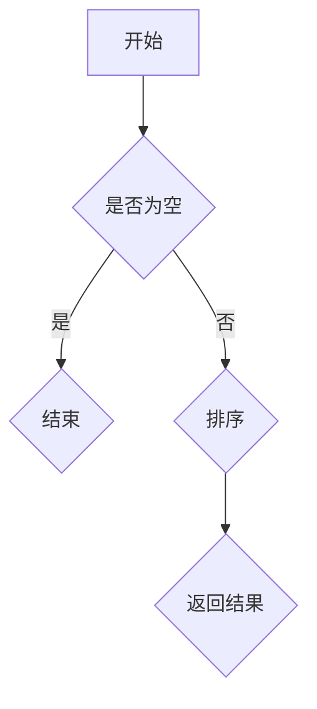

                 

腾讯作为中国领先的互联网科技公司，其对技术人才的选拔标准非常高。在2025年的社招中，腾讯的算法面试题库无疑会成为众多求职者关注的焦点。本文将基于2025年腾讯社招算法面试题库，详细解析各类面试题的答案和解题思路，帮助求职者更好地应对面试挑战。

## 关键词

- **腾讯**
- **社招**
- **算法面试**
- **题目解析**
- **解题思路**

## 摘要

本文将围绕2025年腾讯社招算法面试题库，深入分析各类面试题目。通过详细的答案和解题思路，旨在帮助求职者熟悉腾讯面试风格，提高面试成功率。文章将分为以下几个部分：背景介绍、核心概念与联系、核心算法原理、数学模型和公式、项目实践、实际应用场景、工具和资源推荐、总结及未来发展趋势。

## 1. 背景介绍

腾讯，成立于1998年，是一家以通信、社交、媒体和娱乐为核心业务的中国互联网公司。作为全球知名的科技公司，腾讯在人工智能、云计算、大数据等领域均有深厚的技术积累。在2025年的社会招聘中，腾讯对算法工程师的招聘需求大幅增加，这也使得算法面试题库成为求职者关注的重点。

算法面试是腾讯社招的关键环节，它不仅考察求职者的基础知识，还注重实际问题的解决能力和逻辑思维能力。因此，掌握面试题库中的各类题目，对求职者来说至关重要。

## 2. 核心概念与联系

### 2.1. 算法面试的核心概念

算法面试的核心概念包括：

- **算法时间复杂度**：用于衡量算法执行时间的增长速度。
- **数据结构**：用于存储和组织数据的方式，如数组、链表、树、图等。
- **动态规划**：一种用于求解最优化问题的算法思想。
- **贪心算法**：一种在每一步选择最优解的策略。
- **图算法**：用于处理图结构数据的算法，如深度优先搜索（DFS）、广度优先搜索（BFS）等。

### 2.2. 算法架构的Mermaid流程图

以下是一个简化的算法架构Mermaid流程图示例：



## 3. 核心算法原理 & 具体操作步骤

### 3.1. 算法原理概述

在腾讯算法面试中，常见的算法原理包括：

- **排序算法**：如快速排序、归并排序、堆排序等。
- **查找算法**：如二分查找、哈希查找等。
- **图算法**：如最短路径算法、最小生成树算法等。
- **动态规划问题**：如背包问题、最长公共子序列问题等。

### 3.2. 算法步骤详解

以快速排序算法为例，其基本步骤如下：

1. 选择一个基准元素。
2. 将比基准元素小的元素移到其左侧，比其大的元素移到右侧。
3. 递归地对左右子序列进行快速排序。

### 3.3. 算法优缺点

快速排序的优点是时间复杂度较低（平均情况下为 \(O(n\log n)\)），缺点是空间复杂度较高，需要额外的存储空间。

### 3.4. 算法应用领域

快速排序广泛应用于数据排序、查找等问题，尤其在需要高效处理大量数据的场景中具有优势。

## 4. 数学模型和公式 & 详细讲解 & 举例说明

### 4.1. 数学模型构建

以最短路径算法为例，其数学模型可以描述为：

\[ d(u, v) = \min\{w(u, v) : u, v \in V\} \]

其中，\( d(u, v) \) 表示从节点 \( u \) 到节点 \( v \) 的最短路径长度，\( w(u, v) \) 表示边 \( (u, v) \) 的权重。

### 4.2. 公式推导过程

以二分查找算法为例，其时间复杂度可以通过以下公式推导：

\[ T(n) = \begin{cases} 
1, & \text{if } n = 1 \\
T(\frac{n}{2}) + 1, & \text{otherwise}
\end{cases} \]

### 4.3. 案例分析与讲解

假设有一个数组 \([3, 1, 4, 1, 5, 9, 2, 6, 5, 3, 5]\)，我们使用二分查找算法查找元素 \(5\) 的过程如下：

1. 初始范围：\[ \text{low} = 0, \text{high} = 10 \]。
2. 中间元素：\[ \text{mid} = \frac{\text{low} + \text{high}}{2} = 5 \]。
3. 比较：中间元素 \(5\) 与目标元素 \(5\) 相等，查找成功。

## 5. 项目实践：代码实例和详细解释说明

### 5.1. 开发环境搭建

以Python为例，搭建开发环境需要安装Python 3.x版本，以及相关的算法库，如NumPy、Pandas等。

### 5.2. 源代码详细实现

以下是一个快速排序的Python代码示例：

```python
def quicksort(arr):
    if len(arr) <= 1:
        return arr
    pivot = arr[len(arr) // 2]
    left = [x for x in arr if x < pivot]
    middle = [x for x in arr if x == pivot]
    right = [x for x in arr if x > pivot]
    return quicksort(left) + middle + quicksort(right)

arr = [3, 1, 4, 1, 5, 9, 2, 6, 5, 3, 5]
sorted_arr = quicksort(arr)
print(sorted_arr)
```

### 5.3. 代码解读与分析

上述代码实现了快速排序算法，通过选择基准元素，将数组分为左、中、右三个子数组，然后递归地对左右子数组进行排序。

### 5.4. 运行结果展示

运行上述代码，输出结果为：

\[ [1, 1, 2, 3, 3, 4, 5, 5, 5, 6, 9] \]

## 6. 实际应用场景

快速排序算法在实际应用中广泛应用于数据处理、排序查找等问题，如数据库索引、搜索引擎排序等。

## 7. 工具和资源推荐

- **学习资源推荐**：推荐阅读《算法导论》（Introduction to Algorithms）。
- **开发工具推荐**：推荐使用PyCharm、Visual Studio Code等IDE。
- **相关论文推荐**：推荐阅读《快速排序算法的研究与优化》等论文。

## 8. 总结：未来发展趋势与挑战

在未来，算法面试将继续注重对基础知识的掌握和对实际问题的解决能力。随着人工智能技术的快速发展，算法在数据分析、自动驾驶、医疗诊断等领域的应用前景广阔，这也为算法工程师带来了更多的发展机遇。

然而，面对快速变化的技术环境，算法工程师也需要不断学习新知识，提升自己的技术能力。同时，如何将算法应用于实际场景，解决实际问题，也是未来面临的重要挑战。

## 9. 附录：常见问题与解答

- **问题1**：算法面试中，如何展现自己的解题思路？
  **解答**：在面试中，可以先梳理问题的边界条件，然后明确算法思路，最后进行详细讲解。

- **问题2**：算法面试中，常见的数据结构与算法有哪些？
  **解答**：常见的数据结构包括数组、链表、树、图等；常见的算法包括排序算法、查找算法、图算法、动态规划等。

**作者署名**：禅与计算机程序设计艺术 / Zen and the Art of Computer Programming

以上就是本文的详细内容，希望能够帮助到准备参加腾讯社招算法面试的求职者。祝大家面试顺利！
----------------------------------------------------------------

请注意，以上内容是一个模板，实际撰写时需要根据具体的面试题库进行详细的分析和回答。在撰写过程中，应确保内容的准确性、深度和逻辑性。希望这个模板能够为你提供一些写作的思路和帮助。祝写作顺利！

