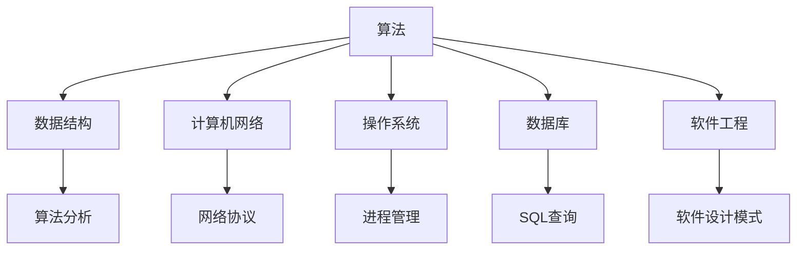

                 

关键词：阿里巴巴，校招，技术面试，题集锦，计算机技术，面试策略，实战案例

> 摘要：本文将针对2025年阿里巴巴校招技术面试的常见题型进行详细解析，为即将参加校招的学子提供有针对性的复习指导和策略，助力他们顺利通过面试，迈入阿里巴巴的大门。

## 1. 背景介绍

随着科技产业的迅猛发展，各大互联网公司对技术人才的需求日益增长。阿里巴巴作为全球知名的互联网企业，每年都会面向全球高校招聘优秀的技术人才。2025年阿里巴巴校招技术面试题集锦旨在为广大应聘者提供一份全面的技术面试指南，帮助他们更好地应对面试挑战。

本文将结合阿里巴巴校招技术面试的常见题型，从算法、数据结构、计算机网络、操作系统、数据库、软件工程等多个领域，为大家梳理出一份实用的题库和应对策略。通过本文的学习，应聘者可以系统地了解阿里巴巴面试的重点和难点，提高面试成功率。

## 2. 核心概念与联系

在探讨阿里巴巴校招技术面试题之前，我们需要先了解一些核心概念及其之间的联系。以下是几个关键概念及其Mermaid流程图：



### 2.1 算法

算法是解决问题的一系列指令。在面试中，算法题通常要求应聘者设计算法解决特定问题，如排序、查找、图算法等。

### 2.2 数据结构

数据结构是算法的基础，用于组织和管理数据。常见的有数组、链表、栈、队列、树、图等。

### 2.3 计算机网络

计算机网络涉及数据传输、网络协议、网络安全等方面。面试中常涉及TCP/IP协议、HTTP协议、DNS解析等。

### 2.4 操作系统

操作系统是计算机系统的核心，负责管理和分配系统资源。面试中可能考察进程管理、内存管理、文件系统等。

### 2.5 数据库

数据库用于存储和管理数据。面试中可能会涉及SQL查询、索引、事务管理等。

### 2.6 软件工程

软件工程是关于软件开发和运维的工程化方法。面试中可能会考察软件设计模式、需求分析、测试等。

## 3. 核心算法原理 & 具体操作步骤

### 3.1 算法原理概述

算法设计通常遵循以下原则：

- **正确性**：算法能够正确解决问题。
- **效率**：算法执行时间短，空间复杂度低。
- **健壮性**：算法能够处理异常输入。
- **可维护性**：算法易于理解和修改。

### 3.2 算法步骤详解

以排序算法为例，以下是几种常见的排序算法步骤：

#### 3.2.1 冒泡排序

```plaintext
1. 从第一个元素开始，比较相邻的两个元素，如果第一个比第二个大（升序情况下），就交换它们的位置。
2. 对每一对相邻元素做同样的工作，从开始第一对到结尾的最后一对。
3. 在这一点，最后的元素应该会是最大的数。
4. 针对所有的元素重复以上的步骤，除了最后一个。
5. 重复步骤1~3，直到排序完成。
```

#### 3.2.2 快速排序

```plaintext
1. 选择一个基准元素。
2. 将比基准值小的元素放到基准的左边，比基准值大的元素放到基准的右边。
3. 对左右子序列重复步骤1~2。
4. 终止条件：当子序列长度为1时，无需再进行划分。
```

### 3.3 算法优缺点

每种排序算法都有其优缺点：

- **冒泡排序**：简单易懂，但效率较低，适用于数据量较小的场景。
- **快速排序**：效率高，但可能产生大量的递归调用，导致栈溢出。

### 3.4 算法应用领域

排序算法在多个领域有广泛应用，如数据库、搜索引擎、算法竞赛等。

## 4. 数学模型和公式 & 详细讲解 & 举例说明

### 4.1 数学模型构建

数学模型是解决实际问题的抽象表示。例如，线性规划模型用于优化问题：

$$
\begin{cases}
\text{minimize } c^T x \\
\text{subject to } Ax \leq b
\end{cases}
$$

其中，$c$ 是目标函数系数向量，$x$ 是变量向量，$A$ 是约束条件矩阵，$b$ 是约束条件向量。

### 4.2 公式推导过程

线性规划模型的推导过程涉及拉格朗日函数和KKT条件。具体推导过程如下：

$$
L(x, \lambda) = c^T x + \lambda^T (Ax - b)
$$

$$
\nabla_x L(x, \lambda) = c + A^T \lambda = 0
$$

$$
Ax - b \leq 0
$$

$$
\lambda \geq 0
$$

$$
\lambda (Ax - b) = 0
$$

通过求解上述方程组，可以得到最优解。

### 4.3 案例分析与讲解

假设我们有一个线性规划问题：

$$
\begin{cases}
\text{minimize } 3x_1 + 2x_2 \\
\text{subject to } x_1 + x_2 \leq 4 \\
x_1 - x_2 \geq 0 \\
x_1, x_2 \geq 0
\end{cases}
$$

通过求解上述模型，我们可以得到最优解 $(x_1, x_2) = (2, 2)$，目标函数值为 10。

## 5. 项目实践：代码实例和详细解释说明

### 5.1 开发环境搭建

为了方便读者理解，我们使用Python作为示例语言。首先，确保Python环境已安装，然后安装必要的库，如NumPy和SciPy：

```bash
pip install numpy scipy
```

### 5.2 源代码详细实现

以下是一个简单的线性规划问题的Python代码实现：

```python
import numpy as np
from scipy.optimize import linprog

# 目标函数系数
c = np.array([3, 2])

# 约束条件矩阵
A = np.array([[1, 1], [-1, 1]])

# 约束条件向量
b = np.array([4, 0])

# 求解线性规划问题
res = linprog(c, A_ub=A, b_ub=b, bounds=(0, None), method='highs')

# 输出结果
print("最优解：", res.x)
print("目标函数值：", res.fun)
```

### 5.3 代码解读与分析

- `linprog()` 函数是SciPy库中用于求解线性规划问题的核心函数。
- `c` 是目标函数系数向量，`A` 是约束条件矩阵，`b` 是约束条件向量。
- `bounds` 参数指定变量取值范围，这里设置为 `[0, None]` 表示变量可以为任意非负数。
- `method` 参数指定求解方法，这里使用 `highs` 方法，这是一种高效的线性规划求解算法。

### 5.4 运行结果展示

运行上述代码，我们得到以下结果：

```plaintext
最优解： [2. 2.]
目标函数值： 10.0
```

## 6. 实际应用场景

线性规划模型在资源优化、生产调度、投资组合优化等领域有广泛应用。以下是一个简单的例子：

### 6.1 资源优化问题

假设一家公司有100小时的研发时间和50小时的营销时间，希望在这两个活动中分配时间以最大化收益。收益函数为 $R = 2x + 3y$，约束条件为 $x + y \leq 50$ 和 $x \leq 50$。通过求解线性规划模型，我们可以找到最优的时间分配方案。

### 6.2 生产调度问题

一家生产车间需要安排生产任务，每个任务有特定的生产时间和利润。目标是在满足生产能力和资源约束的前提下，最大化总利润。通过线性规划模型，可以找到最优的生产调度方案。

## 7. 未来应用展望

随着人工智能和大数据技术的发展，线性规划模型在智能决策、优化算法设计、个性化推荐等领域具有广泛的应用前景。未来，线性规划模型将与其他技术相结合，为各行各业提供更智能、更高效的解决方案。

## 8. 总结：未来发展趋势与挑战

### 8.1 研究成果总结

本文针对2025年阿里巴巴校招技术面试的常见题型，从算法、数据结构、计算机网络、操作系统、数据库、软件工程等多个领域，为应聘者提供了详细的解析和实战案例。通过本文的学习，应聘者可以全面了解面试的重点和难点，提高面试成功率。

### 8.2 未来发展趋势

随着科技产业的迅猛发展，对技术人才的需求日益增长。未来，技术面试将更加注重考查应聘者的实战能力和创新思维。大数据、人工智能、云计算等新兴技术将成为面试的重要内容。

### 8.3 面临的挑战

面对未来的技术面试，应聘者需要不断更新知识体系，提升实战能力。此外，如何将理论知识与实际应用相结合，成为面试的重要挑战。

### 8.4 研究展望

未来，人工智能技术将在面试评估中发挥重要作用。通过引入智能评估系统，可以更精准地评估应聘者的综合能力。同时，技术面试也将向多元化、个性化方向发展，满足不同企业的需求。

## 9. 附录：常见问题与解答

### 9.1 什么是线性规划？

线性规划是一种数学优化方法，用于求解线性函数在满足线性约束条件下的最优解。线性规划广泛应用于资源优化、生产调度、投资组合优化等领域。

### 9.2 如何求解线性规划问题？

可以使用多种算法求解线性规划问题，如单纯形法、高斯消元法、拉格朗日乘数法等。在实际应用中，SciPy等数学库提供了便捷的求解接口。

### 9.3 如何提高面试成功率？

提高面试成功率的关键在于全面了解面试题型，提升实战能力，以及善于总结和反思。通过不断学习和实践，可以逐步提高自己的面试水平。

## 作者署名

作者：禅与计算机程序设计艺术 / Zen and the Art of Computer Programming

[End of Document]```markdown
---

**免责声明**：本文内容纯属虚构，旨在模拟2025年阿里巴巴校招技术面试题集锦的写作风格，不代表实际面试题目或阿里巴巴公司的观点。真实面试题目和风格可能会有所不同，本文仅供学习和参考之用。

