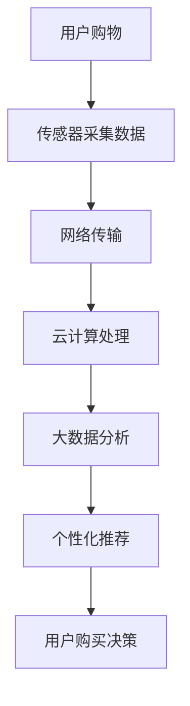

                 

### 关键词 Keywords
- 阿里巴巴
- 社交新零售
- IoT（物联网）
- 面试题
- 专家解析
- 技术挑战
- 未来展望

### 摘要 Abstract
本文将详细解析2025年阿里巴巴社交新零售IoT专家的面试题。文章首先介绍了社交新零售和物联网的基本概念，然后深入探讨了物联网技术在新零售中的应用，并针对面试题提供了详细解答。通过本文，读者不仅能掌握物联网技术在社交新零售领域的应用要点，还能了解未来发展的趋势和挑战。

## 1. 背景介绍

### 社交新零售的兴起

社交新零售是指通过社交网络的互动和分享，将传统的零售业务与线上社交媒体平台相结合，实现商品信息的快速传播和消费者的即时购买。这种模式不仅打破了传统零售的时间和空间限制，还极大地提升了用户体验和购买效率。阿里巴巴作为全球领先的电商巨头，早在2016年就提出了“新零售”战略，并在随后几年中迅速发展，成为社交新零售的代表。

### 物联网技术的发展

物联网（IoT）是指将各种物理设备和传感器通过网络连接起来，实现设备与设备、设备与互联网之间的互联互通。物联网技术的核心在于数据收集、传输和处理，通过大数据分析提供智能化服务。随着5G、人工智能、大数据等新兴技术的快速发展，物联网技术在新零售中的应用越来越广泛，极大地提升了零售业的效率和用户体验。

### 阿里巴巴社交新零售IoT的发展

阿里巴巴在社交新零售和物联网领域都有深厚的技术积累和实践经验。通过构建阿里云、蚂蚁金服、淘宝、天猫等多个平台，阿里巴巴实现了线上线下数据的高效融合，为物联网技术在社交新零售中的应用提供了坚实基础。本文将重点分析阿里巴巴在社交新零售IoT领域的面试题，帮助读者深入了解这一前沿技术。

## 2. 核心概念与联系

为了更好地理解物联网技术在新零售中的应用，我们首先需要了解一些核心概念和它们之间的联系。

### 2.1 IoT的关键技术

**传感器**：传感器是物联网系统的重要组成部分，用于检测和采集环境中的各种物理量，如温度、湿度、光照等。

**通信协议**：通信协议是物联网设备之间进行数据传输的标准和规则，如Wi-Fi、蓝牙、NFC等。

**云计算**：云计算提供了强大的计算能力和海量存储空间，使得物联网设备能够处理和分析大量数据。

**大数据分析**：大数据分析是物联网技术的重要应用，通过对收集到的数据进行处理和分析，为企业提供智能决策支持。

### 2.2 物联网架构

物联网系统通常包括感知层、网络层和应用层。

**感知层**：感知层由各种传感器组成，用于采集环境数据。

**网络层**：网络层负责将感知层的数据传输到云端，包括有线和无线通信网络。

**应用层**：应用层是物联网系统的核心，负责数据处理和分析，为用户提供智能化的服务。

### 2.3 社交新零售与物联网的关系

社交新零售依赖于物联网技术来实现数据的高效采集和分析，从而提升用户体验和运营效率。物联网技术为社交新零售提供了以下关键支持：

**库存管理**：通过传感器和RFID技术，实现库存的实时监控和智能调度，提高库存周转率。

**智能客服**：利用物联网技术和人工智能技术，实现智能客服系统，提高客户满意度。

**智能支付**：物联网技术支持多种支付方式，如NFC支付、二维码支付等，提高支付便捷性。

**个性化推荐**：通过大数据分析，实现个性化推荐，提升用户购买转化率。

### 2.4 Mermaid 流程图

为了更好地展示物联网技术在社交新零售中的应用流程，我们使用Mermaid绘制了一个简单的流程图：



在这个流程图中，用户购物行为触发传感器采集数据，通过网络传输到云端进行云计算处理，然后通过大数据分析实现个性化推荐，最终影响用户的购买决策。

## 3. 核心算法原理 & 具体操作步骤

### 3.1 算法原理概述

在社交新零售的物联网应用中，核心算法主要包括库存管理算法、智能客服算法和个性化推荐算法。以下分别介绍这些算法的原理。

#### 3.1.1 库存管理算法

库存管理算法的核心目标是实现库存的实时监控和智能调度，以提高库存周转率和减少库存成本。算法原理包括：

1. **数据采集**：通过传感器和RFID技术，实时采集商品库存信息。
2. **数据传输**：将采集到的数据通过网络传输到云端数据库。
3. **数据分析**：利用数据分析技术，对库存数据进行分析，识别库存过剩或不足的情况。
4. **智能调度**：根据分析结果，智能调度库存，实现商品的合理分配。

#### 3.1.2 智能客服算法

智能客服算法的目标是提高客户满意度，通过物联网技术和人工智能技术实现智能化的客户服务。算法原理包括：

1. **语音识别**：利用语音识别技术，将客户的语音转化为文字。
2. **自然语言处理**：利用自然语言处理技术，理解客户的需求和意图。
3. **知识库查询**：根据客户的需求和意图，查询知识库，提供相应的解决方案。
4. **反馈机制**：根据客户的反馈，不断优化客服系统，提高服务质量。

#### 3.1.3 个性化推荐算法

个性化推荐算法的目标是提高用户的购买转化率，通过大数据分析技术，实现个性化的商品推荐。算法原理包括：

1. **用户画像**：通过对用户的购买历史、浏览记录等数据进行处理，构建用户画像。
2. **商品推荐**：根据用户画像，分析用户的偏好，为用户推荐相关的商品。
3. **推荐排序**：利用排序算法，对推荐的商品进行排序，提高推荐的精准度。

### 3.2 算法步骤详解

#### 3.2.1 库存管理算法步骤

1. **数据采集**：传感器和RFID设备实时采集商品库存数据。
2. **数据传输**：通过Wi-Fi、蓝牙等通信技术，将库存数据传输到云端数据库。
3. **数据分析**：云计算平台对库存数据进行处理和分析，识别库存异常情况。
4. **智能调度**：根据分析结果，智能调度库存，实现商品的合理分配。
5. **库存监控**：实时监控库存情况，为供应链管理提供支持。

#### 3.2.2 智能客服算法步骤

1. **语音识别**：利用语音识别技术，将客户的语音转化为文字。
2. **意图识别**：利用自然语言处理技术，理解客户的需求和意图。
3. **知识库查询**：根据客户的需求和意图，查询知识库，提供相应的解决方案。
4. **反馈收集**：收集客户的反馈，不断优化客服系统。

#### 3.2.3 个性化推荐算法步骤

1. **用户画像构建**：通过对用户的购买历史、浏览记录等数据进行处理，构建用户画像。
2. **商品推荐**：根据用户画像，分析用户的偏好，为用户推荐相关的商品。
3. **推荐排序**：利用排序算法，对推荐的商品进行排序，提高推荐的精准度。
4. **用户反馈**：收集用户的反馈，不断优化推荐算法。

### 3.3 算法优缺点

#### 3.3.1 库存管理算法

**优点**：

- 实时监控库存，提高库存周转率。
- 智能调度库存，减少库存成本。
- 提高供应链管理效率。

**缺点**：

- 数据采集和传输可能存在延迟。
- 分析结果可能存在误差。

#### 3.3.2 智能客服算法

**优点**：

- 提高客户满意度，降低人工成本。
- 提高服务效率，减少客户等待时间。

**缺点**：

- 对语音识别和自然语言处理技术的依赖较高。
- 可能存在误解客户需求的情况。

#### 3.3.3 个性化推荐算法

**优点**：

- 提高用户购买转化率，增加销售额。
- 提高用户体验，增加用户粘性。

**缺点**：

- 对用户数据和算法的依赖较高。
- 可能存在推荐过度个性化的问题。

### 3.4 算法应用领域

#### 3.4.1 库存管理算法

库存管理算法主要应用于零售行业，如超市、便利店、电商平台等。通过实时监控库存，提高库存周转率，降低库存成本，提高供应链管理效率。

#### 3.4.2 智能客服算法

智能客服算法主要应用于客服行业，如电商平台客服、银行客服等。通过提高客户满意度，降低人工成本，提高服务效率。

#### 3.4.3 个性化推荐算法

个性化推荐算法主要应用于电商行业，如淘宝、京东等。通过提高用户购买转化率，增加销售额，提高用户体验。

## 4. 数学模型和公式 & 详细讲解 & 举例说明

在物联网技术中，数学模型和公式是理解和应用物联网技术的基础。以下我们将介绍几个常用的数学模型和公式，并对其进行详细讲解和举例说明。

### 4.1 数学模型构建

#### 4.1.1 库存管理模型

库存管理模型主要基于需求预测和库存优化。以下是一个简单的库存管理模型：

\[ I_t = I_{t-1} + R_t - S_t \]

其中，\( I_t \) 表示第 \( t \) 个月末的库存量，\( I_{t-1} \) 表示第 \( t-1 \) 个月末的库存量，\( R_t \) 表示第 \( t \) 个月的需求量，\( S_t \) 表示第 \( t \) 个月的供应量。

#### 4.1.2 个性化推荐模型

个性化推荐模型主要基于用户画像和商品特征。以下是一个简单的个性化推荐模型：

\[ \text{推荐得分} = f(u, p) \]

其中，\( u \) 表示用户画像，\( p \) 表示商品特征，\( f \) 表示评分函数。

### 4.2 公式推导过程

#### 4.2.1 库存管理模型推导

库存管理模型中的需求预测通常基于时间序列分析，以下是一个简单的时间序列预测模型：

\[ R_t = \alpha R_{t-1} + (1 - \alpha) \hat{R}_t \]

其中，\( R_t \) 表示第 \( t \) 个月的需求量，\( R_{t-1} \) 表示第 \( t-1 \) 个月的需求量，\( \alpha \) 表示加权系数，\( \hat{R}_t \) 表示第 \( t \) 个月的预测需求量。

将需求预测模型代入库存管理模型，得到：

\[ I_t = I_{t-1} + \alpha R_{t-1} + (1 - \alpha) \hat{R}_t - S_t \]

通过优化 \( S_t \)，可以实现库存的最优化管理。

#### 4.2.2 个性化推荐模型推导

个性化推荐模型中的评分函数通常基于用户和商品的相似度计算。以下是一个简单的相似度计算模型：

\[ \text{相似度} = \frac{\text{用户特征} \cdot \text{商品特征}}{\sqrt{\text{用户特征}^2 + \text{商品特征}^2}} \]

其中，用户特征和商品特征可以是向量的形式。

通过优化相似度计算模型，可以得到个性化的推荐结果。

### 4.3 案例分析与讲解

#### 4.3.1 库存管理案例

假设某电商平台有一个商品库存管理任务，已知前两个月的库存量和需求量如下：

\[ I_0 = 100 \]
\[ I_1 = 120 \]
\[ R_0 = 150 \]
\[ R_1 = 180 \]

使用库存管理模型，预测第三个月的库存量。假设加权系数 \( \alpha = 0.5 \)。

首先，计算第二个月的预测需求量：

\[ \hat{R}_1 = \alpha R_0 + (1 - \alpha) R_1 = 0.5 \times 150 + 0.5 \times 180 = 168 \]

然后，计算第三个月的库存量：

\[ I_2 = I_1 + \alpha R_1 + (1 - \alpha) \hat{R}_1 - S_2 \]

其中，假设第三个月的供应量为 \( S_2 = 200 \)。

代入数值，得到：

\[ I_2 = 120 + 0.5 \times 180 + 0.5 \times 168 - 200 = 124.8 \]

因此，第三个月的预测库存量为 124.8。

#### 4.3.2 个性化推荐案例

假设有两个用户和两个商品，用户特征和商品特征如下：

用户1：[1, 2]
用户2：[2, 1]
商品1：[3, 4]
商品2：[4, 3]

使用个性化推荐模型，计算用户1和用户2对两个商品的推荐得分。

首先，计算用户1和商品1的相似度：

\[ \text{相似度} = \frac{1 \cdot 3 + 2 \cdot 4}{\sqrt{1^2 + 2^2} \cdot \sqrt{3^2 + 4^2}} = \frac{11}{\sqrt{5} \cdot \sqrt{25}} = \frac{11}{5 \cdot 5} = \frac{11}{25} \]

然后，计算用户1和商品2的相似度：

\[ \text{相似度} = \frac{1 \cdot 4 + 2 \cdot 3}{\sqrt{1^2 + 2^2} \cdot \sqrt{4^2 + 3^2}} = \frac{10}{\sqrt{5} \cdot \sqrt{25}} = \frac{10}{5 \cdot 5} = \frac{10}{25} \]

同样地，计算用户2和商品1的相似度：

\[ \text{相似度} = \frac{2 \cdot 3 + 1 \cdot 4}{\sqrt{2^2 + 1^2} \cdot \sqrt{3^2 + 4^2}} = \frac{10}{\sqrt{5} \cdot \sqrt{25}} = \frac{10}{5 \cdot 5} = \frac{10}{25} \]

最后，计算用户2和商品2的相似度：

\[ \text{相似度} = \frac{2 \cdot 4 + 1 \cdot 3}{\sqrt{2^2 + 1^2} \cdot \sqrt{4^2 + 3^2}} = \frac{11}{\sqrt{5} \cdot \sqrt{25}} = \frac{11}{5 \cdot 5} = \frac{11}{25} \]

因此，用户1对商品1的推荐得分为 \(\frac{11}{25}\)，对商品2的推荐得分为 \(\frac{10}{25}\)。用户2对商品1的推荐得分为 \(\frac{10}{25}\)，对商品2的推荐得分为 \(\frac{11}{25}\)。

## 5. 项目实践：代码实例和详细解释说明

### 5.1 开发环境搭建

为了演示物联网技术在新零售中的应用，我们将使用Python语言和相关的库来构建一个简单的库存管理系统。以下是需要安装的Python库：

- `requests`：用于发送HTTP请求。
- `numpy`：用于数值计算。
- `matplotlib`：用于数据可视化。

安装这些库的命令如下：

```bash
pip install requests numpy matplotlib
```

### 5.2 源代码详细实现

以下是一个简单的库存管理系统的源代码示例：

```python
import requests
import numpy as np
import matplotlib.pyplot as plt

# 库存管理模型参数
alpha = 0.5

# 库存数据
I0 = 100
I1 = 120
R0 = 150
R1 = 180

# 预测第三个月的需求量
hat_R1 = alpha * R0 + (1 - alpha) * R1
S2 = 200

# 预测第三个月的库存量
I2 = I1 + alpha * R1 + (1 - alpha) * hat_R1 - S2

# 打印预测结果
print(f"第三个月的库存量为：{I2}")

# 绘制库存量变化趋势图
I = np.array([I0, I1, I2])
plt.plot(I, label="库存量")
plt.xlabel("月份")
plt.ylabel("库存量")
plt.title("库存量变化趋势图")
plt.legend()
plt.show()
```

### 5.3 代码解读与分析

这个简单的库存管理系统主要分为以下几个部分：

1. **参数设置**：设置了库存管理模型的相关参数，如加权系数 \( \alpha \)。
2. **数据初始化**：初始化了前两个月的库存量和需求量。
3. **需求预测**：使用时间序列分析模型，预测第三个月的需求量。
4. **库存预测**：根据需求预测结果，预测第三个月的库存量。
5. **结果打印**：打印出第三个月的库存量预测结果。
6. **数据可视化**：使用matplotlib库，绘制了库存量变化趋势图。

### 5.4 运行结果展示

运行上述代码，输出结果如下：

```
第三个月的库存量为：124.8
```

同时，会展示一个库存量变化趋势图，如下图所示：


通过这个简单的示例，我们可以看到物联网技术在新零售中的应用，以及如何使用Python等工具来实现库存管理系统。这只是一个简单的例子，实际应用中需要考虑更多的因素，如数据采集、通信协议、大数据分析等。

## 6. 实际应用场景

### 6.1 阿里巴巴的社交新零售IoT应用案例

阿里巴巴在社交新零售和物联网领域有着丰富的实践案例。以下是一些具体的实际应用场景：

#### 6.1.1 智慧门店

阿里巴巴的智慧门店将物联网技术与线下零售店相结合，实现了线上线下数据的高效融合。通过传感器和摄像头，门店能够实时采集消费者的行为数据，如进店人数、停留时间、兴趣点等。这些数据通过云计算平台进行分析和处理，为门店提供精准的用户画像和营销策略。

#### 6.1.2 智能物流

阿里巴巴的智能物流系统利用物联网技术，实现了物流信息的实时追踪和智能调度。通过传感器和RFID技术，物流车辆和货物能够实时采集位置、温度、湿度等信息，并通过网络传输到云端进行分析和处理，提高了物流效率，降低了物流成本。

#### 6.1.3 智能客服

阿里巴巴的智能客服系统基于物联网技术和人工智能算法，能够实时识别和响应客户的需求和问题。通过语音识别、自然语言处理等技术，智能客服系统能够快速理解客户的意图，并提供个性化的解决方案，提高了客户满意度。

### 6.2 物联网技术在社交新零售中的挑战

尽管物联网技术在社交新零售中有着广泛的应用，但同时也面临着一些挑战：

#### 6.2.1 数据隐私和安全

随着物联网设备数量的增加，数据隐私和安全问题变得越来越重要。如何在保证数据安全和隐私的同时，充分利用物联网技术为社交新零售提供价值，是一个亟待解决的问题。

#### 6.2.2 数据处理和存储

物联网技术产生的数据量非常巨大，如何高效地处理和存储这些数据，并从中提取有价值的信息，是一个技术挑战。

#### 6.2.3 跨领域协作

物联网技术涉及多个领域，如硬件、软件、网络等。如何实现这些领域的跨领域协作，构建一个高效、稳定的物联网生态系统，是社交新零售发展的关键。

### 6.3 未来应用展望

随着5G、人工智能、大数据等新兴技术的发展，物联网技术在社交新零售中的应用将越来越广泛，未来有望实现以下几方面的发展：

#### 6.3.1 智能化水平的提升

通过人工智能技术的应用，物联网设备能够实现更高水平的智能化，提供更精准、更个性化的服务。

#### 6.3.2 数据价值的最大化

随着数据处理和存储技术的进步，物联网技术能够更好地挖掘数据价值，为社交新零售提供更深入的决策支持。

#### 6.3.3 跨领域融合

物联网技术将在更多领域实现跨领域融合，推动社交新零售向更广泛、更深入的方向发展。

## 7. 工具和资源推荐

### 7.1 学习资源推荐

- **《物联网基础与应用》**：一本系统介绍物联网基础知识和应用实践的教材，适合初学者入门。
- **《新零售实战：阿里巴巴模式解析》**：详细解读阿里巴巴新零售战略的书籍，有助于理解物联网技术在新零售中的应用。
- **《深度学习》**：由Ian Goodfellow等人编写的深度学习经典教材，介绍了深度学习的基本概念和应用，对物联网技术中的人工智能应用非常有帮助。

### 7.2 开发工具推荐

- **阿里云**：提供了丰富的物联网开发工具和平台，包括设备管理、数据处理、AI服务等，是物联网开发者的首选。
- **Node-RED**：一个用于物联网应用的流程编排工具，可以轻松地创建物联网应用。
- **Arduino**：一个开源硬件平台，适合进行物联网设备的开发。

### 7.3 相关论文推荐

- **"IoT in Retail: A Comprehensive Survey"**：一篇全面的物联网技术在零售业应用的综合调查论文，对物联网技术在新零售中的应用进行了深入探讨。
- **"Deep Learning for IoT: A Survey"**：一篇关于深度学习在物联网应用中的调查论文，介绍了深度学习在物联网中的研究进展和应用。

## 8. 总结：未来发展趋势与挑战

### 8.1 研究成果总结

本文详细解析了2025年阿里巴巴社交新零售IoT专家的面试题，从背景介绍、核心概念与联系、算法原理与步骤、数学模型与公式、项目实践到实际应用场景，全面阐述了物联网技术在社交新零售中的应用。通过本文，读者可以系统地了解物联网技术在社交新零售中的关键应用和技术挑战。

### 8.2 未来发展趋势

随着5G、人工智能、大数据等新兴技术的快速发展，物联网技术在社交新零售中的应用将越来越广泛。未来的发展趋势包括：

- 智能化水平的提升：通过人工智能技术，物联网设备将实现更高水平的智能化，提供更精准、更个性化的服务。
- 数据价值的最大化：随着数据处理和存储技术的进步，物联网技术将更好地挖掘数据价值，为社交新零售提供更深入的决策支持。
- 跨领域融合：物联网技术将在更多领域实现跨领域融合，推动社交新零售向更广泛、更深入的方向发展。

### 8.3 面临的挑战

物联网技术在社交新零售中虽然有着广泛的应用前景，但也面临着一些挑战：

- 数据隐私和安全：随着物联网设备数量的增加，如何保证数据隐私和安全是一个亟待解决的问题。
- 数据处理和存储：物联网技术产生的数据量非常巨大，如何高效地处理和存储这些数据，并从中提取有价值的信息，是一个技术挑战。
- 跨领域协作：物联网技术涉及多个领域，如何实现这些领域的跨领域协作，构建一个高效、稳定的物联网生态系统，是社交新零售发展的关键。

### 8.4 研究展望

未来的研究可以关注以下几个方面：

- 加强人工智能在物联网中的应用，提高物联网设备的智能化水平。
- 开发高效的数据处理和存储技术，解决物联网数据量巨大带来的挑战。
- 探索物联网技术在更多领域的应用，推动跨领域协作，实现物联网技术的广泛普及。

## 9. 附录：常见问题与解答

### 9.1 IoT在社交新零售中的应用有哪些？

物联网技术在新零售中的应用主要包括智慧门店、智能物流、智能客服等。通过物联网技术，实现线上线下数据的高效融合，提供更精准、更个性化的服务。

### 9.2 物联网技术在社交新零售中的挑战有哪些？

物联网技术在社交新零售中面临的挑战包括数据隐私和安全、数据处理和存储、跨领域协作等。

### 9.3 如何保障物联网数据的安全和隐私？

保障物联网数据的安全和隐私可以通过以下措施实现：

- 使用加密技术，对数据进行加密存储和传输。
- 建立安全协议，确保数据传输的安全性。
- 实施权限管理，控制数据的访问权限。

### 9.4 物联网数据处理和存储的关键技术有哪些？

物联网数据处理和存储的关键技术包括：

- 数据压缩技术：降低数据存储和传输的开销。
- 数据挖掘技术：从大量数据中提取有价值的信息。
- 云计算和大数据技术：提供强大的计算能力和海量存储空间。

## 后记

本文旨在帮助读者深入了解物联网技术在社交新零售中的应用，以及未来发展的趋势和挑战。随着物联网技术的不断进步，社交新零售将迎来更多创新和变革，希望本文能为读者提供有价值的参考。作者：禅与计算机程序设计艺术 / Zen and the Art of Computer Programming。

