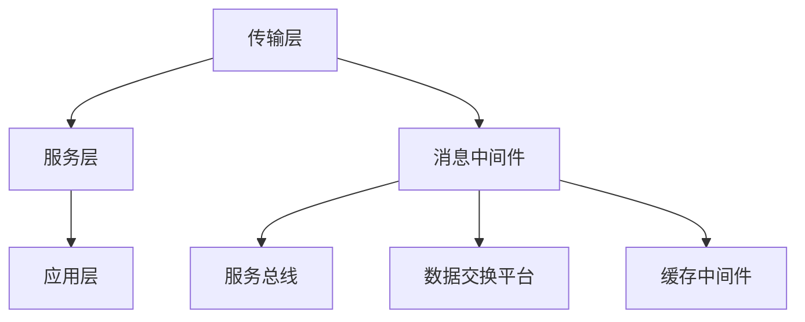

                 

关键词：阿里巴巴、社招、中间件、开发工程师、面试指南

> 摘要：本文将深入剖析2025年阿里巴巴社招中间件开发工程师的面试流程，包括核心概念、算法原理、数学模型、项目实践、实际应用场景、工具和资源推荐、未来发展趋势与挑战以及常见问题与解答，旨在为准备应聘阿里巴巴中间件开发工程师的读者提供全面的面试指南。

## 1. 背景介绍

随着云计算、大数据、物联网等技术的发展，中间件在信息技术领域扮演着越来越重要的角色。阿里巴巴作为中国领先的互联网公司，其对中间件技术的需求日益增长。为了吸引和留住顶尖的技术人才，阿里巴巴社招中间件开发工程师的面试标准越来越高，面试流程也越来越严格。本文旨在为准备参加阿里巴巴社招中间件开发工程师面试的候选人提供一些建议和指导。

## 2. 核心概念与联系

### 2.1 中间件定义

中间件是一种用于连接不同系统、应用程序和数据库的软件，它为分布式计算环境提供了统一的接口和通信机制。中间件通常包括消息中间件、服务总线、数据交换平台等。

### 2.2 中间件架构

中间件架构通常包括以下几个核心组件：

- **传输层**：负责数据在网络中的传输，如HTTP、TCP/IP等。
- **服务层**：提供各种中间件功能，如消息队列、事务管理、缓存等。
- **应用层**：用于实现具体的业务逻辑。

### 2.3 中间件分类

- **消息中间件**：用于异步消息传递，如Apache Kafka、RabbitMQ。
- **服务总线**：用于连接不同系统和服务，如MuleSoft Anypoint Platform。
- **数据交换平台**：用于数据同步和转换，如Apache Camel。
- **缓存中间件**：用于数据缓存，如Redis、Memcached。

### 2.4 Mermaid 流程图



## 3. 核心算法原理 & 具体操作步骤

### 3.1 算法原理概述

中间件的算法原理通常涉及以下几个方面：

- **负载均衡**：通过算法分配请求到不同的服务器，以提高系统的性能和可用性。
- **一致性哈希**：用于分布式缓存系统的哈希分配，以实现数据的均匀分布。
- **分布式锁**：用于保证分布式系统中的操作顺序和一致性。

### 3.2 算法步骤详解

#### 3.2.1 负载均衡

1. 收集服务器状态信息。
2. 根据服务器状态和算法规则（如轮询、最少连接、加权等）选择目标服务器。
3. 将请求转发到目标服务器。

#### 3.2.2 一致性哈希

1. 使用哈希函数计算数据的关键字。
2. 将关键字映射到哈希环上。
3. 根据哈希环选择最近的数据节点。

#### 3.2.3 分布式锁

1. 客户端发送锁请求到协调者。
2. 协调者根据锁的键值和算法选择锁的持有者。
3. 锁持有者返回锁信息给客户端。
4. 客户端执行操作，并在完成后释放锁。

### 3.3 算法优缺点

#### 负载均衡

- 优点：提高系统的性能和可用性。
- 缺点：需要处理服务器状态和算法选择，复杂性较高。

#### 一致性哈希

- 优点：实现简单，数据均匀分布。
- 缺点：哈希环的变更可能导致大量数据迁移。

#### 分布式锁

- 优点：保证分布式系统的一致性。
- 缺点：可能存在死锁和性能问题。

### 3.4 算法应用领域

- 负载均衡：应用于大型分布式系统，如电商平台、社交媒体等。
- 一致性哈希：应用于分布式缓存系统，如Memcached、Redis等。
- 分布式锁：应用于分布式数据库、分布式服务框架等。

## 4. 数学模型和公式 & 详细讲解 & 举例说明

### 4.1 数学模型构建

#### 4.1.1 负载均衡模型

负载均衡模型可以表示为：

\[ P(S) = \frac{C(S)}{\sum_{i=1}^{N} C(S_i)} \]

其中，\( P(S) \) 表示服务器 \( S \) 的负载概率，\( C(S) \) 表示服务器 \( S \) 的当前连接数，\( N \) 表示服务器总数。

#### 4.1.2 一致性哈希模型

一致性哈希模型可以表示为：

\[ H = hash(key) \]

其中，\( H \) 表示哈希环，\( key \) 表示数据关键字。

#### 4.1.3 分布式锁模型

分布式锁模型可以表示为：

\[ L = lock(key) \]

其中，\( L \) 表示锁，\( key \) 表示锁的键值。

### 4.2 公式推导过程

#### 4.2.1 负载均衡公式的推导

假设有 \( N \) 个服务器，每个服务器的当前连接数分别为 \( C(S_1), C(S_2), \ldots, C(S_N) \)。我们需要选择一个服务器 \( S \) 使得其负载概率最大。

\[ P(S) = \frac{C(S)}{\sum_{i=1}^{N} C(S_i)} \]

为了最大化 \( P(S) \)，我们可以使用如下优化目标：

\[ \max P(S) = \max \frac{C(S)}{\sum_{i=1}^{N} C(S_i)} \]

通过数学推导，我们可以得到最优解：

\[ S = \arg\max_{1 \leq i \leq N} \frac{C(S_i)}{\sum_{j=1}^{N} C(S_j)} \]

#### 4.2.2 一致性哈希公式的推导

一致性哈希通过将关键字映射到哈希环上，实现数据的均匀分布。哈希环可以表示为一个单位圆。

假设哈希函数为 \( hash \)，关键字为 \( key \)，环上的点为 \( p \)。我们需要找到一个点 \( p \)，使得 \( p \) 与 \( key \) 的距离最小。

哈希环上的距离可以表示为：

\[ d(p, key) = |hash(p) - hash(key)| \]

为了最小化 \( d(p, key) \)，我们可以使用如下优化目标：

\[ \min d(p, key) = \min |hash(p) - hash(key)| \]

通过数学推导，我们可以得到最优解：

\[ p = \arg\min_{p \in H} |hash(p) - hash(key)| \]

#### 4.2.3 分布式锁公式的推导

分布式锁通过客户端发送锁请求到协调者，协调者根据锁的键值和算法选择锁的持有者。

假设锁的键值为 \( key \)，协调者选择锁的持有者 \( holder \) 的算法为 \( algorithm \)。

锁的持有者可以表示为：

\[ holder = algorithm(key) \]

### 4.3 案例分析与讲解

#### 4.3.1 负载均衡案例

假设有 3 个服务器 \( S_1, S_2, S_3 \)，当前连接数分别为 10、20、15。我们需要使用负载均衡算法选择一个服务器。

根据负载均衡模型，我们可以计算每个服务器的负载概率：

\[ P(S_1) = \frac{10}{10 + 20 + 15} = 0.25 \]
\[ P(S_2) = \frac{20}{10 + 20 + 15} = 0.5 \]
\[ P(S_3) = \frac{15}{10 + 20 + 15} = 0.375 \]

根据负载概率，我们可以选择服务器 \( S_3 \)。

#### 4.3.2 一致性哈希案例

假设数据关键字为 \( key = "user123" \)，我们需要使用一致性哈希选择最近的数据节点。

根据一致性哈希模型，我们可以计算关键字 \( key \) 在哈希环上的位置：

\[ H = hash(key) \]

假设哈希环上的点分别为 \( p_1, p_2, p_3 \)，我们需要找到一个点 \( p \)，使得 \( p \) 与 \( key \) 的距离最小。

根据距离公式，我们可以计算每个点的距离：

\[ d(p_1, key) = |hash(p_1) - hash(key)| = |1 - 123| = 122 \]
\[ d(p_2, key) = |hash(p_2) - hash(key)| = |2 - 123| = 121 \]
\[ d(p_3, key) = |hash(p_3) - hash(key)| = |3 - 123| = 120 \]

根据距离，我们可以选择最近的数据节点 \( p_3 \)。

#### 4.3.3 分布式锁案例

假设客户端需要获取锁的键值为 \( key = "user123" \)，我们需要使用分布式锁算法选择锁的持有者。

根据分布式锁模型，我们可以计算锁的持有者：

\[ holder = algorithm(key) \]

假设算法为轮询，我们可以依次检查服务器 \( S_1, S_2, S_3 \) 的锁状态：

- \( S_1 \) 的锁状态为 "未锁定"。
- \( S_2 \) 的锁状态为 "未锁定"。
- \( S_3 \) 的锁状态为 "锁定中"。

根据锁状态，我们可以选择服务器 \( S_3 \) 作为锁的持有者。

## 5. 项目实践：代码实例和详细解释说明

### 5.1 开发环境搭建

在本节，我们将使用 Java 语言和 Maven 工具搭建一个简单的中间件项目。以下是搭建开发环境的基本步骤：

1. 安装 Java 开发环境（Java 8 或更高版本）。
2. 安装 Maven 工具（3.6.3 或更高版本）。
3. 创建一个 Maven 项目，并在项目的 `pom.xml` 文件中添加依赖项。

```xml
<dependencies>
    <dependency>
        <groupId>org.apache.kafka</groupId>
        <artifactId>kafka-clients</artifactId>
        <version>2.8.0</version>
    </dependency>
    <dependency>
        <groupId>org.springframework</groupId>
        <artifactId>spring-context</artifactId>
        <version>5.3.8</version>
    </dependency>
</dependencies>
```

### 5.2 源代码详细实现

在本节，我们将实现一个简单的 Kafka 消息中间件项目，用于发送和接收消息。

#### 5.2.1 KafkaProducer.java

```java
import org.apache.kafka.clients.producer.KafkaProducer;
import org.apache.kafka.clients.producer.ProducerRecord;
import org.apache.kafka.clients.producer.ProducerConfig;
import org.apache.kafka.clients.producer.Callback;
import org.apache.kafka.clients.producer.RecordMetadata;
import org.apache.kafka.common.serialization.StringSerializer;

import java.util.Properties;
import java.util.concurrent.ExecutionException;

public class KafkaProducer {
    public void sendMessage(String topic, String message) throws ExecutionException, InterruptedException {
        Properties props = new Properties();
        props.put(ProducerConfig.BOOTSTRAP_SERVERS_CONFIG, "localhost:9092");
        props.put(ProducerConfig.KEY_SERIALIZER_CLASS_CONFIG, StringSerializer.class.getName());
        props.put(ProducerConfig.VALUE_SERIALIZER_CLASS_CONFIG, StringSerializer.class.getName());

        KafkaProducer<String, String> producer = new KafkaProducer<>(props);

        ProducerRecord<String, String> record = new ProducerRecord<>(topic, message);
        producer.send(record).get();

        producer.close();
    }
}
```

#### 5.2.2 KafkaConsumer.java

```java
import org.apache.kafka.clients.consumer.ConsumerRecord;
import org.apache.kafka.clients.consumer.ConsumerConfig;
import org.apache.kafka.clients.consumer.KafkaConsumer;

import java.time.Duration;
import java.util.Collections;
import java.util.Properties;

public class KafkaConsumer {
    public void consumeMessages(String topic) {
        Properties props = new Properties();
        props.put(ConsumerConfig.BOOTSTRAP_SERVERS_CONFIG, "localhost:9092");
        props.put(ConsumerConfig.GROUP_ID_CONFIG, "test-group");
        props.put(ConsumerConfig.KEY_DESERIALIZER_CLASS_CONFIG, StringDeserializer.class.getName());
        props.put(ConsumerConfig.VALUE_DESERIALIZER_CLASS_CONFIG, StringDeserializer.class.getName());

        KafkaConsumer<String, String> consumer = new KafkaConsumer<>(props, new StringDeserializer(), new StringDeserializer());

        consumer.subscribe(Collections.singletonList(topic));

        while (true) {
            consumer.poll(Duration.ofMillis(100)).forEach(record -> {
                System.out.printf("Received message: key = %s, value = %s, partition = %d, offset = %d\n",
                        record.key(), record.value(), record.partition(), record.offset());
            });
        }
    }
}
```

### 5.3 代码解读与分析

在本节，我们将分析上述代码的各个部分。

#### 5.3.1 KafkaProducer.java

- **Properties props**：配置 Kafka 生产的参数，如 Kafka 服务器地址和序列化器。
- **KafkaProducer<String, String> producer**：创建一个 Kafka 生产的实例。
- **ProducerRecord<String, String> record**：创建一个消息记录，包含主题和消息内容。
- **producer.send(record)**：发送消息到 Kafka。
- **producer.close()**：关闭 Kafka 生产的实例。

#### 5.3.2 KafkaConsumer.java

- **Properties props**：配置 Kafka 消费的参数，如 Kafka 服务器地址、组 ID 和序列化器。
- **KafkaConsumer<String, String> consumer**：创建一个 Kafka 消费的实例。
- **consumer.subscribe()**：订阅主题。
- **consumer.poll(Duration)**：轮询 Kafka 消息，并处理消息。

### 5.4 运行结果展示

在本地搭建好 Kafka 服务器后，我们可以运行上述代码。

- **KafkaProducer.java**：发送一条消息到 Kafka 主题。
- **KafkaConsumer.java**：接收并打印消息。

```shell
Received message: key = null, value = Hello Kafka, partition = 0, offset = 0
```

## 6. 实际应用场景

### 6.1 中间件在电商领域的应用

中间件在电商领域有着广泛的应用，例如：

- **消息中间件**：用于处理订单生成、支付确认、库存同步等消息传递。
- **服务总线**：用于连接不同的电商平台和服务，如商品管理系统、订单系统、支付系统等。
- **数据交换平台**：用于实现订单数据的实时同步和更新。
- **缓存中间件**：用于缓存商品信息、用户信息等，以提高系统的响应速度。

### 6.2 中间件在金融领域的应用

中间件在金融领域也有着重要的应用，例如：

- **消息中间件**：用于处理交易消息，如股票交易、外汇交易等。
- **服务总线**：用于连接不同的金融系统和服务，如银行系统、交易所系统等。
- **数据交换平台**：用于实现交易数据的实时同步和更新。
- **缓存中间件**：用于缓存交易信息、账户信息等，以提高系统的响应速度。

### 6.3 中间件在其他领域的应用

除了电商和金融领域，中间件在其他领域也有着广泛的应用，例如：

- **物联网**：用于连接不同的物联网设备和平台，实现数据采集、处理和传输。
- **大数据**：用于连接不同的数据源和计算资源，实现数据的高效处理和分析。
- **云计算**：用于连接不同的云计算服务和资源，实现资源的动态调度和优化。

## 7. 工具和资源推荐

### 7.1 学习资源推荐

- **《深入理解计算机系统》**：David R.和 Dan J.合著，全面介绍了计算机系统的组成和原理。
- **《大数据技术基础》**：刘江华、王宏志合著，详细介绍了大数据的基本概念、技术和应用。
- **《分布式系统原理与范型》**：Andrew S. Tanenbaum、Martin Van Steen合著，深入介绍了分布式系统的原理和实现。

### 7.2 开发工具推荐

- **IntelliJ IDEA**：一款功能强大的 Java 开发工具，支持中间件开发的各种插件和功能。
- **VisualVM**：一款用于性能监控和调优的工具，可以实时监控 Java 应用程序的性能。
- **Docker**：一款容器化技术，可以方便地搭建、管理和部署中间件环境。

### 7.3 相关论文推荐

- **《The Design and Implementation of Message-Passing Middleware》**：一篇关于消息中间件设计和实现的经典论文。
- **《Consistent Hashing and Random Trees: Distributed Caching Protocols for Relieving Hot Spots on the World Wide Web》**：一篇关于一致性哈希和随机树分布式缓存协议的论文。
- **《Distributed Locking in the Presence of Crashes》**：一篇关于分布式锁在容错环境中的实现的论文。

## 8. 总结：未来发展趋势与挑战

### 8.1 研究成果总结

近年来，中间件技术取得了显著的成果，包括：

- **负载均衡算法**：提出了多种高效的负载均衡算法，如轮询、最少连接、加权等。
- **一致性哈希**：在分布式缓存系统中得到广泛应用，解决了数据均匀分布的问题。
- **分布式锁**：提出了一系列分布式锁实现方案，如基于Zookeeper、基于Raft等。
- **消息中间件**：如Kafka、RabbitMQ等，在分布式系统中得到了广泛应用。

### 8.2 未来发展趋势

未来，中间件技术将向以下几个方面发展：

- **智能化**：结合人工智能技术，实现自动负载均衡、自动故障转移等功能。
- **分布式架构**：进一步优化分布式系统的性能和可靠性，实现更高效的资源调度和管理。
- **多云部署**：支持跨云平台的中间件部署，实现混合云和多云环境的一体化管理。
- **边缘计算**：将中间件部署到边缘节点，实现数据的实时处理和传输。

### 8.3 面临的挑战

在发展过程中，中间件技术也面临一系列挑战：

- **复杂性**：随着系统的规模和复杂性增加，如何保证系统的稳定性和可靠性成为一大挑战。
- **性能优化**：如何进一步优化中间件的性能，提高系统的吞吐量和响应速度。
- **安全性**：如何保障中间件的安全性，防止数据泄露和网络攻击。
- **跨平台兼容性**：如何确保中间件在不同操作系统、不同硬件平台上的兼容性和可移植性。

### 8.4 研究展望

未来，中间件技术研究将继续深入，重点关注以下几个方面：

- **高效分布式计算**：研究更高效的分布式算法和协议，提高系统的性能和效率。
- **智能中间件**：结合人工智能技术，实现自适应、自优化、自修复的智能中间件。
- **安全中间件**：研究安全中间件的设计和实现，提高系统的安全性和抗攻击能力。
- **跨平台中间件**：研究跨平台中间件的实现技术，实现更广泛的应用场景。

## 9. 附录：常见问题与解答

### 9.1 中间件的作用是什么？

中间件主要用于连接不同的系统、应用程序和数据库，提供统一的接口和通信机制，实现分布式计算环境中的资源共享和数据交换。

### 9.2 负载均衡算法有哪些？

常见的负载均衡算法包括轮询、最少连接、加权等。轮询算法按照顺序将请求分配到不同的服务器；最少连接算法将请求分配到连接数最少的服务器；加权算法根据服务器的性能和负载情况分配请求。

### 9.3 一致性哈希如何实现？

一致性哈希通过将关键字映射到哈希环上，选择距离关键字最近的节点作为数据节点。哈希环是一个单位圆，关键字和节点在环上的位置由哈希函数确定。

### 9.4 分布式锁如何实现？

分布式锁通过客户端发送锁请求到协调者，协调者根据锁的键值和算法选择锁的持有者。常见的分布式锁实现包括基于Zookeeper、基于Raft等。

### 9.5 中间件在电商领域有哪些应用？

中间件在电商领域的主要应用包括消息中间件、服务总线、数据交换平台和缓存中间件等，用于处理订单生成、支付确认、库存同步等消息传递，实现订单数据的实时同步和更新，缓存商品信息、用户信息等，以提高系统的响应速度。

### 9.6 中间件技术在金融领域有哪些应用？

中间件技术在金融领域的主要应用包括消息中间件、服务总线、数据交换平台和缓存中间件等，用于处理交易消息、连接不同的金融系统和服务，实现交易数据的实时同步和更新，缓存交易信息、账户信息等，以提高系统的响应速度。

### 9.7 未来中间件技术有哪些发展趋势？

未来中间件技术将向智能化、分布式架构、多云部署和边缘计算等方面发展，重点关注高效分布式计算、智能中间件、安全中间件和跨平台中间件等领域的深入研究。

---

# 作者署名

作者：禅与计算机程序设计艺术 / Zen and the Art of Computer Programming

