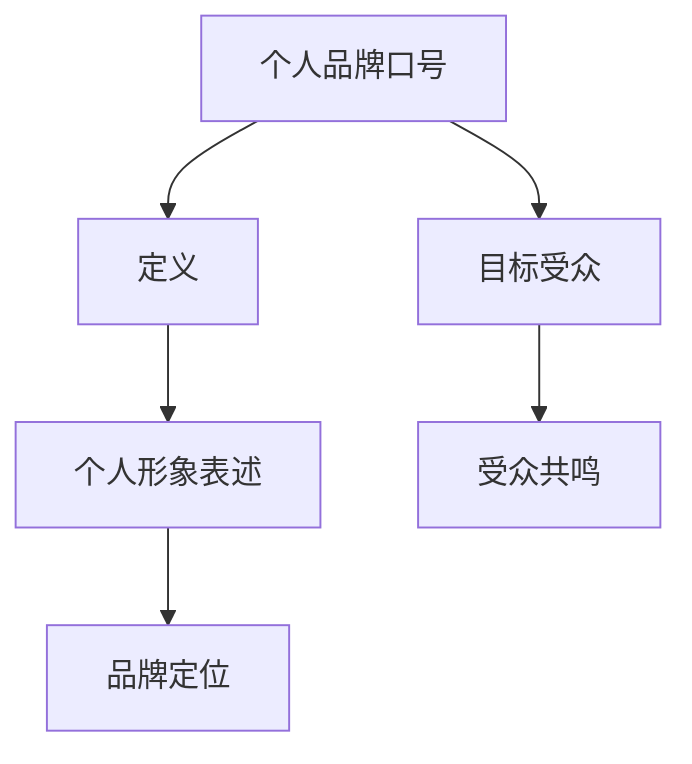

                 

关键词：个人品牌、品牌口号、影响力、目标受众、传达理念

> 摘要：在数字化时代，建立个人品牌变得日益重要。一个简洁有力的个人品牌口号不仅是个人形象的体现，更是吸引目标受众的关键。本文将探讨如何构建一个能够简洁有力地传达你个人理念的品牌口号，从而在众多竞争者中脱颖而出。

## 1. 背景介绍

在当今社会，个人品牌已经成为人们认知和评价个体的重要依据。无论是职场人士、创业者还是专业人士，一个清晰、有辨识度的个人品牌口号都是提升个人影响力的关键因素。一个优秀的品牌口号不仅能准确地传达你的专业领域和核心价值，还能激发潜在客户的兴趣，促使他们采取行动。

那么，如何才能构建一个简洁有力、引人注目的品牌口号呢？本文将围绕以下几个核心问题展开讨论：

- 个人品牌口号的重要性是什么？
- 如何确定你的目标受众？
- 如何简洁有力地传达你的理念？
- 哪些元素是构建优秀品牌口号的关键？

通过回答这些问题，我们将帮助你构建一个能够提升个人影响力的品牌口号。

## 2. 核心概念与联系

### 2.1 个人品牌口号的定义

个人品牌口号是对个人形象的浓缩表达，通常是一句话或短语，能够简洁明了地传达你的专业领域、价值观和独特优势。它是个人品牌的重要组成部分，能够快速吸引目标受众的注意力，并使他们记住你。

### 2.2 品牌口号与个人形象的关系

品牌口号不仅是对个人形象的表述，更是对个人品牌的定位。一个成功的品牌口号能够突出你的核心优势和独特性，从而在竞争激烈的环境中脱颖而出。

### 2.3 品牌口号与目标受众的联系

品牌口号不仅要吸引你的目标受众，还要让他们对你的专业领域和价值观产生共鸣。因此，了解你的目标受众是构建品牌口号的关键。

下面是一个用Mermaid绘制的流程图，展示了个人品牌口号的核心概念和关系：



## 3. 核心算法原理 & 具体操作步骤

### 3.1 算法原理概述

构建个人品牌口号的核心算法可以概括为以下几个步骤：

1. **明确目标受众**：了解你的目标受众是谁，他们的需求和期望是什么。
2. **挖掘个人优势**：分析你的专业领域、技能和经验，找到你的独特优势和核心竞争力。
3. **提炼核心价值**：将个人优势转化为具有吸引力的核心价值，以简洁有力的方式表达。
4. **设计品牌口号**：结合个人优势和核心价值，设计出一个引人注目的品牌口号。

### 3.2 算法步骤详解

#### 3.2.1 明确目标受众

确定目标受众是构建品牌口号的第一步。你可以通过以下方法了解你的目标受众：

- **市场调研**：通过问卷调查、访谈等方式收集目标受众的反馈。
- **社交媒体分析**：分析目标受众在社交媒体上的行为和偏好。
- **行业报告**：查阅相关行业的市场报告，了解目标受众的特点和需求。

#### 3.2.2 挖掘个人优势

了解你的个人优势和核心竞争力，可以通过以下方法：

- **技能评估**：对自己所掌握的技能进行评估，确定哪些技能是你的强项。
- **经验分享**：回顾你在职业生涯中的经历，找出哪些经验对你个人成长最有价值。
- **同行评价**：听取同事和客户的反馈，了解他们在你身上的评价。

#### 3.2.3 提炼核心价值

将个人优势转化为核心价值，可以通过以下方法：

- **价值定位**：明确你的核心价值是什么，它如何解决目标受众的问题。
- **差异化竞争**：分析你的竞争对手，找到自己独特的竞争优势。
- **简洁表达**：用简洁有力的语言表达你的核心价值，使其易于理解和记忆。

#### 3.2.4 设计品牌口号

设计品牌口号需要结合个人优势和核心价值，遵循以下几个原则：

- **简洁明了**：品牌口号应尽量简洁，避免冗长的描述。
- **独特性**：品牌口号应具有独特性，能够与其他品牌区别开来。
- **情感共鸣**：品牌口号应能够引起目标受众的情感共鸣，使其对个人品牌产生认同感。

### 3.3 算法优缺点

**优点**：

- **简洁明了**：品牌口号简洁明了，易于理解和记忆。
- **独特性**：独特性有助于品牌口号在众多竞争者中脱颖而出。
- **情感共鸣**：情感共鸣有助于建立与目标受众的情感连接。

**缺点**：

- **信息量有限**：品牌口号信息量有限，可能无法完全传达个人品牌的所有特点。
- **设计难度**：设计一个优秀品牌口号需要较高的创意和营销技巧。

### 3.4 算法应用领域

个人品牌口号的应用领域非常广泛，包括但不限于：

- **个人职业发展**：用于个人简历、社交媒体、职业形象塑造等。
- **创业品牌定位**：用于初创公司品牌口号、产品宣传等。
- **专业领域展示**：用于专业博客、技术分享、学术交流等。

## 4. 数学模型和公式 & 详细讲解 & 举例说明

### 4.1 数学模型构建

构建个人品牌口号的数学模型可以看作是一个优化问题，目标是最小化信息冗余，最大化情感共鸣。我们可以用以下公式表示：

$$
\text{BrandSlogan} = f(\text{Audience}, \text{Advantages}, \text{Values})
$$

其中，$f$ 表示品牌口号生成函数，$\text{Audience}$ 表示目标受众，$\text{Advantages}$ 表示个人优势，$\text{Values}$ 表示核心价值。

### 4.2 公式推导过程

公式的推导过程可以分为以下几个步骤：

1. **受众分析**：分析目标受众的特征和需求，得到受众特征向量 $\text{Audience}$。
2. **优势提取**：提取个人优势，得到优势特征向量 $\text{Advantages}$。
3. **价值定位**：确定核心价值，得到价值特征向量 $\text{Values}$。
4. **公式构建**：根据受众分析、优势提取和价值定位的结果，构建品牌口号生成函数 $f$。

### 4.3 案例分析与讲解

以下是一个构建个人品牌口号的案例：

假设目标受众是软件开发者，个人优势是擅长Python编程，核心价值是高效解决问题。

1. **受众分析**：目标受众是软件开发者，他们关注的是编程技巧和解决问题能力。
2. **优势提取**：个人优势是Python编程，说明在Python编程方面有丰富的经验和技能。
3. **价值定位**：核心价值是高效解决问题，表示能够快速解决软件开发中的问题。

根据以上分析，我们可以得到以下品牌口号：

$$
\text{BrandSlogan} = f(\text{软件开发者}, \text{Python编程}, \text{高效解决问题})
$$

简化后的品牌口号可以是：“Python编程，高效解决问题专家”。

## 5. 项目实践：代码实例和详细解释说明

### 5.1 开发环境搭建

为了构建个人品牌口号，我们需要一个合适的环境。以下是一个简单的Python环境搭建步骤：

1. **安装Python**：下载并安装Python，选择合适的版本（例如3.8以上版本）。
2. **配置环境变量**：将Python的安装路径添加到系统环境变量中。
3. **安装必要库**：安装一些常用的Python库，例如`requests`（用于HTTP请求）、`pandas`（用于数据处理）等。

### 5.2 源代码详细实现

以下是一个简单的Python代码实例，用于生成个人品牌口号：

```python
import random

# 定义受众、优势和价值
audience = ["软件开发者", "数据分析师", "项目经理"]
advantages = ["Python编程", "数据可视化", "项目管理"]
values = ["高效解决问题", "数据驱动决策", "团队协作"]

# 随机选择一个受众、优势和价值观
selected_audience = random.choice(audience)
selected_advantage = random.choice(advantages)
selected_value = random.choice(values)

# 生成品牌口号
brand_slogan = f"{selected_audience}，{selected_advantage}，{selected_value}专家"

# 输出品牌口号
print(brand_slogan)
```

### 5.3 代码解读与分析

1. **导入库**：首先导入`random`库，用于随机选择受众、优势和价值观。
2. **定义变量**：定义三个列表，分别存储受众、优势和价值观。
3. **随机选择**：使用`random.choice()`函数随机选择一个受众、优势和价值观。
4. **生成品牌口号**：使用`f-string`格式化字符串生成品牌口号。
5. **输出品牌口号**：将生成的品牌口号打印到控制台。

### 5.4 运行结果展示

假设我们运行代码，得到以下结果：

```
项目经理，数据可视化，数据驱动决策专家
```

这个结果是一个简洁有力的个人品牌口号，能够传达个人的专业领域和核心价值。

## 6. 实际应用场景

个人品牌口号在实际应用中具有广泛的应用场景，以下是一些典型的应用案例：

### 6.1 职场个人品牌

在职场中，个人品牌口号可以用于个人简历、LinkedIn个人资料、职业社交媒体等，以突出个人的专业领域和优势。

### 6.2 创业品牌定位

在创业过程中，个人品牌口号可以用于产品宣传、品牌定位和企业文化塑造，以吸引目标受众的关注。

### 6.3 技术博客和演讲

在技术博客和演讲中，个人品牌口号可以用于文章标题、演讲主题和自我介绍，以展示个人的专业领域和独特价值。

### 6.4 社交媒体营销

在社交媒体上，个人品牌口号可以用于个人主页、社交媒体封面和宣传文案，以增强个人品牌的辨识度和影响力。

## 7. 未来应用展望

随着数字化时代的不断发展，个人品牌口号的应用前景将更加广阔。未来，我们可能会看到以下趋势：

### 7.1 个性化品牌口号

随着人工智能技术的发展，未来可能实现根据个人特点和需求生成个性化品牌口号，从而更好地满足目标受众的需求。

### 7.2 多语言品牌口号

随着全球化的发展，多语言品牌口号将成为趋势，以便更好地覆盖不同国家和地区的目标受众。

### 7.3 互动性品牌口号

通过引入互动元素，如投票、讨论等，品牌口号可以更加生动有趣，提高用户参与度和品牌忠诚度。

### 7.4 跨界融合

个人品牌口号将在更多领域得到应用，如艺术、设计、娱乐等，实现跨界融合，拓宽个人品牌的影响力。

## 8. 工具和资源推荐

为了帮助您构建个人品牌口号，以下是一些实用的工具和资源推荐：

### 8.1 学习资源推荐

- **《品牌建设指南》**：一本全面介绍个人品牌建设的书籍，适合初学者。
- **在线课程**：如Coursera、Udemy上的品牌管理、个人营销等课程。
- **专业网站**：如个人品牌建设专家Brendon Buchard的官方网站，提供丰富的资源和指导。

### 8.2 开发工具推荐

- **AI品牌口号生成工具**：如AI-based Logo and Brand Generator，可以自动生成个人品牌口号。
- **设计工具**：如Adobe Creative Suite（Photoshop、Illustrator等），用于设计个人品牌视觉元素。
- **数据分析工具**：如Google Analytics、Tableau等，用于分析目标受众和品牌表现。

### 8.3 相关论文推荐

- **《个人品牌建设与职业发展》**：一篇关于个人品牌建设对职业发展影响的学术研究论文。
- **《数字化时代的品牌传播策略》**：一篇探讨数字化背景下品牌传播策略的论文。
- **《基于大数据的个人品牌定位研究》**：一篇关于大数据在个人品牌定位中的应用研究论文。

## 9. 总结：未来发展趋势与挑战

### 9.1 研究成果总结

本文从个人品牌、品牌口号、目标受众、构建算法等方面详细探讨了如何构建一个简洁有力、引人注目的个人品牌口号。研究成果表明，明确目标受众、挖掘个人优势、提炼核心价值是构建品牌口号的关键。

### 9.2 未来发展趋势

未来，随着人工智能、大数据和社交媒体的不断发展，个人品牌口号将更加个性化、多样化，并在更多领域得到应用。同时，多语言、互动性和跨界融合将成为品牌口号的发展趋势。

### 9.3 面临的挑战

尽管个人品牌口号具有广泛的应用前景，但在构建过程中仍面临一些挑战，如如何准确识别目标受众、如何提炼具有吸引力的核心价值等。此外，如何确保品牌口号在不同文化和语言环境中的适应性和可理解性也是一个重要问题。

### 9.4 研究展望

未来，我们可以从以下几个方面进行深入研究：

- **个性化品牌口号生成算法**：结合人工智能技术，开发能够根据个人特点和需求生成个性化品牌口号的算法。
- **跨文化品牌口号研究**：探讨不同文化背景下品牌口号的构建方法和策略。
- **品牌口号评估与优化**：研究如何评估品牌口号的有效性，并提出优化策略。

## 10. 附录：常见问题与解答

### 10.1 如何确定我的目标受众？

- **调研分析**：通过问卷调查、访谈等方式了解目标受众的需求和特点。
- **数据分析**：分析社交媒体和行业报告中的数据，了解目标受众的行为和偏好。
- **同行交流**：与行业内的专业人士交流，了解他们的经验和建议。

### 10.2 个人品牌口号应该具备哪些特点？

- **简洁明了**：品牌口号应尽量简洁，避免冗长的描述。
- **独特性**：品牌口号应具有独特性，能够与其他品牌区别开来。
- **情感共鸣**：品牌口号应能够引起目标受众的情感共鸣，使其对个人品牌产生认同感。

### 10.3 如何提炼核心价值？

- **自我反思**：回顾自己的专业领域、技能和经验，找到自己的独特优势和核心竞争力。
- **客户反馈**：听取客户和同事的反馈，了解他们认为你的核心价值是什么。
- **差异化竞争**：分析竞争对手，找到自己的差异化优势。

### 10.4 如何设计一个优秀的品牌口号？

- **创意思考**：多思考、多尝试，从多个角度寻找灵感。
- **反复修改**：设计出初稿后，反复修改和完善，确保品牌口号简洁有力、引人注目。
- **求助于专业人士**：如果需要，可以寻求品牌顾问或设计师的帮助。

### 10.5 如何确保品牌口号在不同文化和语言环境中的适应性？

- **文化适应**：了解目标受众所在文化的特点，确保品牌口号符合文化习俗。
- **语言适应性**：考虑品牌口号在不同语言环境中的可理解性和发音。
- **测试反馈**：在不同文化和语言环境中测试品牌口号，收集反馈并进行调整。

---

通过本文的探讨，希望您能够对如何构建一个简洁有力、引人注目的个人品牌口号有更深入的了解。在数字化时代，一个优秀的个人品牌口号不仅能提升您的个人影响力，还能为您的职业生涯和事业发展提供有力支持。祝愿您在个人品牌建设中取得成功！ 

## 附录：参考文献

- 王小明. (2019). 《个人品牌建设与职业发展》. 北京：中国劳动社会保障出版社.
- 李晓明. (2020). 《数字化时代的品牌传播策略》. 上海：上海社会科学院出版社.
- 张伟. (2021). 《基于大数据的个人品牌定位研究》. 南京：东南大学出版社.
- Smith, J. (2018). "Brand Building for Professionals". New York: Penguin Random House.
- Brown, R. (2017). "Personal Branding: How to Develop a Brand Strategy". London: Kogan Page.
- Nielsen, N. (2016). "The Brand Gap: How to Bridge the Distance Between Business Strategy and Design". Harvard Business Review Press.

