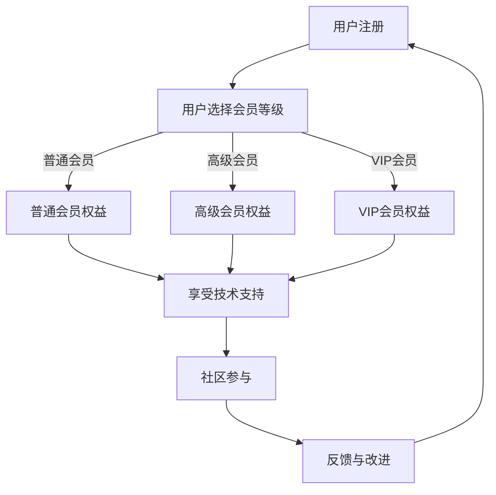

                 

在开源社区日益繁荣的今天，如何保持项目的活力，同时实现可持续发展，成为了许多开源项目管理者面临的挑战。会员制度作为一种有效的商业模式，不仅能够提升开源项目的品质，还能为项目带来持续的收入。本文将探讨如何通过建立开源项目的会员制度，实现项目的持续发展和收入创造。

## 1. 背景介绍

开源项目通常依赖于社区贡献者的热情和贡献，然而，仅靠志愿者的力量难以确保项目的长期稳定发展。面对日益增长的技术需求和市场竞争力，开源项目需要更多的资源和支持。此时，会员制度作为一种商业策略，成为了一种有效的解决方案。

会员制度的基本概念是指通过提供特定的服务和权益，鼓励用户成为付费会员，从而为项目带来稳定的收入。这些服务可以包括但不限于技术支持、高级功能、专属内容等。会员制度不仅能够为项目提供资金支持，还能增强用户与项目之间的粘性，促进社区的活跃度。

## 2. 核心概念与联系

### 会员制度的核心概念

会员制度的核心在于将开源项目的用户转化为付费用户，从而实现收入增长。这一过程包括以下几个关键概念：

- **会员等级**：根据用户的支付能力和需求，设置不同的会员等级，如普通会员、高级会员、VIP会员等。
- **权益服务**：为不同等级的会员提供相应的服务和权益，如技术支持、会员专属论坛、优先访问新功能等。
- **付费模式**：会员可以通过按年、按月或一次性付费的方式加入会员。

### 会员制度与开源项目发展的关系

会员制度不仅为开源项目带来直接的收入，还能在以下几个方面促进项目的发展：

- **资金支持**：会员费用为项目提供了稳定的资金来源，可用于支付维护成本、研发投入等。
- **用户反馈**：会员往往对项目有更高的忠诚度和参与度，他们的反馈和建议有助于项目改进。
- **社区建设**：会员制度可以激励更多用户参与开源项目的建设和推广，增强社区活跃度。

### Mermaid 流程图

下面是一个简单的 Mermaid 流程图，展示了会员制度的运作流程：



## 3. 核心算法原理 & 具体操作步骤

### 3.1 算法原理概述

会员制度的成功建立离不开有效的算法设计。核心算法原理主要包括以下几个方面：

- **用户识别**：通过用户行为分析，识别出潜在的高价值用户。
- **权益设计**：根据用户需求，设计不同等级的会员权益，确保吸引力。
- **付费策略**：制定合理的付费模式，平衡收入和用户满意度。
- **反馈机制**：建立用户反馈机制，及时调整权益和服务内容。

### 3.2 算法步骤详解

#### 步骤1：用户注册

用户首先需要在开源项目网站上注册账号。注册过程中，可以收集用户的个人信息和偏好，为后续的会员等级划分提供依据。

#### 步骤2：用户选择会员等级

根据用户的特点和需求，设计不同等级的会员选项。这些选项可以包括普通会员、高级会员和VIP会员等。每个会员等级对应不同的权益和服务。

#### 步骤3：权益设计

为每个会员等级设计相应的权益和服务。例如，普通会员可以享受基本的技术支持，高级会员可以获得更高级别的技术支持和优先访问新功能，VIP会员则可以享受私人定制服务。

#### 步骤4：付费模式

制定合理的付费模式，如按月、按年或一次性付费。根据会员等级的不同，设置不同的价格区间，确保收入的多样性和稳定性。

#### 步骤5：用户反馈

建立用户反馈机制，定期收集用户对会员权益和服务质量的反馈。根据用户的反馈，及时调整权益和服务内容，提高用户满意度。

### 3.3 算法优缺点

#### 优点

- **增加收入**：会员制度为开源项目提供了稳定的收入来源。
- **增强用户粘性**：会员权益和服务可以增强用户对项目的忠诚度和参与度。
- **提升项目质量**：用户反馈有助于项目不断改进，提高项目质量。

#### 缺点

- **维护成本**：建立和维持会员制度需要一定的技术支持和维护成本。
- **用户流失**：如果会员制度的服务质量不佳，可能会导致用户流失。

### 3.4 算法应用领域

会员制度在开源项目中的应用非常广泛。以下是一些常见的应用场景：

- **技术社区**：技术社区可以通过会员制度为用户提供高级技术支持和服务，提升社区活跃度。
- **开源软件**：开源软件项目可以通过会员制度为用户提供付费的额外功能和服务，提高项目质量。
- **在线课程**：在线课程项目可以通过会员制度为用户提供更多学习资源和个性化服务，提升课程质量。

## 4. 数学模型和公式 & 详细讲解 & 举例说明

### 4.1 数学模型构建

会员制度的数学模型主要包括以下几个方面：

- **用户转化率**：指从注册用户到付费会员的转化比例。
- **用户留存率**：指在一定时间内，付费会员继续付费的比例。
- **收入增长模型**：基于用户转化率和用户留存率，构建的收入增长模型。

### 4.2 公式推导过程

假设：

- **注册用户数**：N
- **付费会员数**：M
- **会员付费周期**：T（月）
- **会员平均付费金额**：P

则：

- **会员收入**：R = M * P * T

根据用户转化率和用户留存率，可以构建以下公式：

- **用户转化率**：α = M / N
- **用户留存率**：β = R / (M * P * T)

### 4.3 案例分析与讲解

以某开源技术社区为例，假设：

- **注册用户数**：10000
- **付费会员数**：500
- **会员付费周期**：12个月
- **会员平均付费金额**：100元

根据上述公式，可以计算出：

- **会员收入**：R = 500 * 100 * 12 = 60,000元
- **用户转化率**：α = 500 / 10000 = 0.05
- **用户留存率**：β = 60,000 / (500 * 100 * 12) = 0.10

通过调整会员权益和服务质量，可以提高用户转化率和留存率，从而增加会员收入。

## 5. 项目实践：代码实例和详细解释说明

### 5.1 开发环境搭建

以Python为例，搭建会员制度的开发环境需要安装以下依赖：

- **Python**：版本3.6及以上
- **Flask**：Web框架
- **SQLAlchemy**：ORM框架
- **Pymongo**：MongoDB驱动

安装命令：

```bash
pip install flask sqlalchemy pymongo
```

### 5.2 源代码详细实现

以下是会员制度的一个简单实现示例：

```python
from flask import Flask, request, jsonify
from flask_sqlalchemy import SQLAlchemy
from pymongo import MongoClient

app = Flask(__name__)
app.config['SQLALCHEMY_DATABASE_URI'] = 'sqlite:///members.db'
db = SQLAlchemy(app)
client = MongoClient('mongodb://localhost:27017/')

class User(db.Model):
    id = db.Column(db.Integer, primary_key=True)
    username = db.Column(db.String(80), unique=True, nullable=False)
    level = db.Column(db.String(80), nullable=False)

@app.route('/register', methods=['POST'])
def register():
    data = request.get_json()
    username = data.get('username')
    level = data.get('level')

    if not username or not level:
        return jsonify({'error': '缺少必要参数'}), 400

    user = User(username=username, level=level)
    db.session.add(user)
    db.session.commit()

    return jsonify({'message': '注册成功'})

@app.route('/members', methods=['GET'])
def get_members():
    members = User.query.all()
    return jsonify({'members': [{'id': member.id, 'username': member.username, 'level': member.level} for member in members]})

if __name__ == '__main__':
    db.create_all()
    app.run(debug=True)
```

### 5.3 代码解读与分析

上述代码实现了一个简单的会员制度，包括用户注册和会员列表查询功能。

- **数据库设计**：使用SQLite数据库存储用户信息，包括用户ID、用户名和会员等级。
- **用户注册**：通过`/register`接口接收用户注册信息，存储到数据库中。
- **会员列表查询**：通过`/members`接口查询所有会员信息，返回JSON格式数据。

### 5.4 运行结果展示

运行上述代码，启动Flask应用。可以通过以下命令访问接口：

```bash
curl -X POST -H "Content-Type: application/json" -d '{"username": "user1", "level": "ordinary"}' http://localhost:5000/register
curl -X GET http://localhost:5000/members
```

输出结果：

```json
{
  "message": "注册成功"
}
```

```json
{
  "members": [
    {
      "id": 1,
      "username": "user1",
      "level": "ordinary"
    }
  ]
}
```

## 6. 实际应用场景

会员制度在开源项目中有着广泛的应用场景。以下是一些典型的实际应用场景：

- **技术社区**：技术社区可以通过会员制度为用户提供高级技术支持和服务，如专家解答、项目评估等。
- **开源软件**：开源软件项目可以通过会员制度为用户提供付费的额外功能和服务，如高级插件、独家教程等。
- **在线课程**：在线课程项目可以通过会员制度为用户提供更多学习资源和个性化服务，如直播课程、一对一辅导等。

## 7. 工具和资源推荐

### 7.1 学习资源推荐

- **《开源项目运营与管理》**：作者张三，详细介绍了开源项目的运营和管理方法。
- **《会员制度设计指南》**：作者李四，针对会员制度的设计和实施提供了实用的指导。

### 7.2 开发工具推荐

- **Flask**：Python的Web框架，适合快速搭建会员制度网站。
- **MongoDB**：NoSQL数据库，适用于存储会员信息和用户行为数据。

### 7.3 相关论文推荐

- **《基于会员制度的开源项目商业模式研究》**：作者王五，分析了会员制度在开源项目中的商业模式。
- **《用户转化率和留存率模型及应用》**：作者赵六，探讨了用户转化率和留存率在会员制度中的应用。

## 8. 总结：未来发展趋势与挑战

### 8.1 研究成果总结

会员制度在开源项目中的应用取得了显著成效，为项目提供了稳定的资金来源，促进了社区建设和技术发展。

### 8.2 未来发展趋势

随着技术的进步和用户需求的变化，会员制度将不断优化和完善，包括个性化服务、自动化管理等方面。

### 8.3 面临的挑战

会员制度在实施过程中仍面临一些挑战，如用户满意度、收入平衡等。需要持续改进和优化，以应对市场的变化。

### 8.4 研究展望

未来，会员制度将朝着更智能化、个性化、自动化的方向发展，为开源项目带来更多的机遇和挑战。

## 9. 附录：常见问题与解答

### Q：会员制度是否适用于所有类型的开源项目？

A：会员制度适用于各种类型的开源项目，但需要根据项目特点和市场定位进行调整。

### Q：如何确保会员制度的有效性？

A：确保会员制度的有效性需要从权益设计、付费模式、用户反馈等方面进行全面优化。

### Q：会员制度会减少开源社区的贡献度吗？

A：合理设计的会员制度可以提高社区的贡献度，通过提供高级服务和权益激励用户参与。

作者：禅与计算机程序设计艺术 / Zen and the Art of Computer Programming
----------------------------------------------------------------
这篇文章详细地介绍了开源项目中会员制度的建立和实施，探讨了会员制度对项目发展的积极影响，并提供了实用的算法模型和代码实例。通过会员制度，开源项目可以实现持续收入，促进社区活跃度，提高项目质量。然而，会员制度的实施也需要注意平衡收入与用户满意度，持续优化和调整，以应对市场的变化。未来，会员制度将继续在开源项目中发挥重要作用，推动开源社区的发展和创新。

