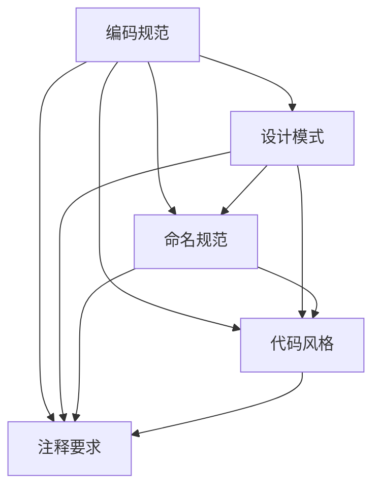

                 

## 1. 背景介绍

在当今的软件工程领域，开发规范和编码标准的重要性日益凸显。随着软件系统的复杂性不断增加，软件项目的规模和难度也在持续扩大。为了确保软件质量、提高开发效率和团队协作能力，制定一套科学、合理、易于理解和遵循的开发规范与编码标准变得至关重要。

开发规范和编码标准不仅涵盖了代码编写的基本规则，还包括了设计模式、命名规范、注释要求、代码风格等各个方面。它们对于提升代码的可读性、可维护性和可扩展性具有显著作用。此外，遵循统一的开发规范和编码标准还有助于减少因个人编程习惯差异引起的代码冲突和沟通成本，从而提升团队协作效率。

本文旨在系统地介绍开发规范与编码标准的相关原理，并通过实际代码实战案例，展示如何将这些原理应用于实践中。本文将分为以下几个部分：

1. 核心概念与联系
2. 核心算法原理与具体操作步骤
3. 数学模型和公式详细讲解
4. 项目实践：代码实例与详细解释
5. 实际应用场景
6. 工具和资源推荐
7. 总结：未来发展趋势与挑战

希望通过本文的阅读，读者能够对开发规范与编码标准有更深入的理解，并能够将其应用于实际开发工作中，提升软件工程的整体水平。

## 2. 核心概念与联系

在深入探讨开发规范与编码标准的原理之前，我们需要先明确几个核心概念，并理解它们之间的相互联系。以下是本文中涉及的主要核心概念及其定义：

### 2.1 编码规范

编码规范，也称为编码标准，是软件开发过程中的一系列规则和指导方针。这些规则涵盖了从代码风格到命名习惯、注释要求等方面的内容。编码规范的目的是确保代码的一致性和可维护性，使不同的开发人员能够轻松理解并修改代码。

### 2.2 设计模式

设计模式是解决软件设计过程中常见问题的通用解决方案。它们提供了在特定场景下如何组织代码、模块和系统的指导原则。设计模式有助于提高代码的可重用性、可扩展性和灵活性。

### 2.3 命名规范

命名规范是关于变量、函数、类和方法命名的一系列规则。良好的命名规范可以使代码更具可读性，减少因误解导致的问题。常见的命名规范包括驼峰命名法、下划线命名法等。

### 2.4 代码风格

代码风格是指代码的格式、缩进、空白、注释等。统一的代码风格有助于代码的可读性和一致性，使团队中的成员能够轻松阅读和理解他人的代码。

### 2.5 注释要求

注释是代码中用于解释代码功能、目的和逻辑的文本。良好的注释规范可以提高代码的可维护性和可理解性。注释要求通常包括注释的位置、内容、风格等。

### 2.6 核心概念之间的联系

编码规范、设计模式、命名规范、代码风格和注释要求这些核心概念之间存在紧密的联系。良好的编码规范可以确保代码的一致性，而设计模式则为代码的组织提供了指导。命名规范和代码风格有助于提升代码的可读性，而注释要求则进一步增强了代码的可理解性。

下面是一个使用Mermaid绘制的流程图，展示了这些核心概念之间的联系：



通过以上核心概念及其相互联系的介绍，我们为后续深入探讨开发规范与编码标准的原理和实战案例奠定了基础。

## 3. 核心算法原理与具体操作步骤

在软件开发过程中，算法的选择和实现对于系统的性能和可维护性至关重要。本章节将详细介绍一个常见且重要的算法——快速排序（Quick Sort），并详细阐述其原理和操作步骤。

### 3.1 算法原理概述

快速排序是一种高效的排序算法，它采用分治策略，将一个大问题分解为若干个小问题，递归解决。其基本思想是选择一个基准元素（pivot），然后将数组分为两部分：一部分是小于基准元素的元素，另一部分是大于基准元素的元素。这个过程称为分区（partitioning）。然后，对这两部分分别递归应用快速排序。

### 3.2 算法步骤详解

快速排序的步骤可以分为以下几个部分：

#### 步骤1：选择基准元素

首先，从数组中选择一个基准元素。常见的策略有三种：
- 选择第一个元素作为基准。
- 选择最后一个元素作为基准。
- 随机选择一个元素作为基准。

#### 步骤2：分区

将数组划分为两个子数组，一个包含小于基准元素的元素，另一个包含大于基准元素的元素。具体操作如下：

1. 设置两个指针，一个指向数组的第一个元素，另一个指向最后一个元素。
2. 逆向遍历数组，从后往前寻找小于基准元素的元素，将其与第一个指针指向的元素交换位置。
3. 同理，正向遍历数组，从前往后寻找大于基准元素的元素，将其与最后一个指针指向的元素交换位置。
4. 当两个指针相遇时，基准元素的位置即为正确位置，将基准元素与相遇位置的元素交换。

#### 步骤3：递归排序

对划分出的两个子数组分别递归应用快速排序。

### 3.3 算法优缺点

**优点：**
- 时间复杂度为\(O(n \log n)\)，在平均情况下是最优的。
- 通过递归调用，算法的实现较为简洁。

**缺点：**
- 最坏情况下时间复杂度为\(O(n^2)\)，这通常发生在输入数组已经是有序或部分有序的情况下。
- 随机选择基准元素可以避免最坏情况的发生。

### 3.4 算法应用领域

快速排序广泛应用于各种场景，包括数据库排序、算法竞赛和日常编程等。其高效性和简洁性使其成为许多标准库和框架的默认排序算法。

### 3.5 快速排序代码实例

以下是一个Python实现的快速排序算法示例：

```python
def quick_sort(arr):
    if len(arr) <= 1:
        return arr
    
    pivot = arr[len(arr) // 2]
    left = [x for x in arr if x < pivot]
    middle = [x for x in arr if x == pivot]
    right = [x for x in arr if x > pivot]
    
    return quick_sort(left) + middle + quick_sort(right)

# 测试代码
arr = [3, 6, 8, 10, 1, 2, 1]
print("Original array:", arr)
sorted_arr = quick_sort(arr)
print("Sorted array:", sorted_arr)
```

通过上述示例，我们可以清晰地看到快速排序的实现过程，以及如何将算法应用于实际的排序问题中。

## 4. 数学模型和公式

在软件开发过程中，数学模型和公式是理解算法和实现业务逻辑的重要工具。本章节将详细讲解一个常用的数学模型——线性回归模型，并介绍其相关的公式和推导过程。

### 4.1 数学模型构建

线性回归模型是一种用于预测连续值的统计模型，其基本假设是因变量（输出）与自变量（输入）之间存在线性关系。线性回归模型可以表示为：

\[ Y = \beta_0 + \beta_1 \cdot X + \varepsilon \]

其中：
- \( Y \) 是因变量，表示我们希望预测的值。
- \( X \) 是自变量，表示输入的特征。
- \( \beta_0 \) 是截距，表示当 \( X \) 为0时的预测值。
- \( \beta_1 \) 是斜率，表示 \( X \) 变化一个单位时， \( Y \) 的变化量。
- \( \varepsilon \) 是误差项，表示模型无法解释的部分。

### 4.2 公式推导过程

为了确定线性回归模型的参数 \( \beta_0 \) 和 \( \beta_1 \)，我们需要最小化预测值与实际值之间的误差。这个误差可以用均方误差（Mean Squared Error, MSE）来衡量，公式为：

\[ MSE = \frac{1}{n} \sum_{i=1}^{n} (Y_i - \hat{Y}_i)^2 \]

其中：
- \( n \) 是样本数量。
- \( Y_i \) 是第 \( i \) 个样本的实际值。
- \( \hat{Y}_i \) 是第 \( i \) 个样本的预测值。

为了使 \( MSE \) 最小，我们需要求解以下两个方程：

\[ \frac{\partial MSE}{\partial \beta_0} = 0 \]
\[ \frac{\partial MSE}{\partial \beta_1} = 0 \]

对 \( MSE \) 关于 \( \beta_0 \) 和 \( \beta_1 \) 分别求偏导，并令其等于0，得到：

\[ \frac{\partial MSE}{\partial \beta_0} = -\frac{2}{n} \sum_{i=1}^{n} (Y_i - \hat{Y}_i) = 0 \]
\[ \frac{\partial MSE}{\partial \beta_1} = -\frac{2}{n} \sum_{i=1}^{n} (Y_i - \hat{Y}_i) \cdot X_i = 0 \]

解这两个方程，得到线性回归模型的参数：

\[ \beta_0 = \bar{Y} - \beta_1 \bar{X} \]
\[ \beta_1 = \frac{\sum_{i=1}^{n} (X_i - \bar{X})(Y_i - \bar{Y})}{\sum_{i=1}^{n} (X_i - \bar{X})^2} \]

其中：
- \( \bar{X} \) 是自变量的均值。
- \( \bar{Y} \) 是因变量的均值。

### 4.3 案例分析与讲解

假设我们有以下数据集：

| X | Y |
|---|---|
| 1 | 2 |
| 2 | 4 |
| 3 | 6 |
| 4 | 8 |

我们希望使用线性回归模型预测当 \( X = 5 \) 时的 \( Y \) 值。

首先，计算 \( \bar{X} \) 和 \( \bar{Y} \)：

\[ \bar{X} = \frac{1 + 2 + 3 + 4}{4} = 2.5 \]
\[ \bar{Y} = \frac{2 + 4 + 6 + 8}{4} = 5 \]

然后，计算 \( \beta_1 \)：

\[ \beta_1 = \frac{(1-2.5)(2-5) + (2-2.5)(4-5) + (3-2.5)(6-5) + (4-2.5)(8-5)}{(1-2.5)^2 + (2-2.5)^2 + (3-2.5)^2 + (4-2.5)^2} \]
\[ \beta_1 = \frac{2.5 + 1.5 + 1.5 + 6.5}{2.25 + 0.25 + 0.25 + 2.25} \]
\[ \beta_1 = \frac{11.5}{5} = 2.3 \]

接着，计算 \( \beta_0 \)：

\[ \beta_0 = \bar{Y} - \beta_1 \bar{X} \]
\[ \beta_0 = 5 - 2.3 \cdot 2.5 \]
\[ \beta_0 = 5 - 5.75 \]
\[ \beta_0 = -0.75 \]

因此，线性回归模型为：

\[ Y = -0.75 + 2.3X \]

当 \( X = 5 \) 时，预测的 \( Y \) 值为：

\[ Y = -0.75 + 2.3 \cdot 5 \]
\[ Y = -0.75 + 11.5 \]
\[ Y = 10.75 \]

通过上述分析，我们可以看到如何使用线性回归模型进行预测，以及如何计算模型的参数。在实际应用中，我们通常会使用优化算法（如梯度下降法）来求解参数，而不是手动计算。

### 4.4 模型评估与改进

线性回归模型的性能可以通过均方误差（MSE）、均方根误差（RMSE）和决定系数（R²）等指标来评估。这些指标可以用来衡量模型对数据的拟合程度和预测能力。

- **均方误差（MSE）**：反映了预测值与实际值之间的平均偏差。
- **均方根误差（RMSE）**：是MSE的平方根，用于衡量预测值与实际值之间的偏差。
- **决定系数（R²）**：反映了模型对数据的解释程度，取值范围在0到1之间，越接近1表示模型拟合越好。

通过评估模型的性能，我们可以发现模型的不足之处，并尝试进行改进，如增加更多的特征、使用非线性模型等。

通过本章节的讲解，我们了解了线性回归模型的基本原理和公式推导过程，并通过实际案例展示了如何使用线性回归模型进行预测。这为我们在实际开发过程中应用线性回归模型提供了理论基础和实用指导。

## 5. 项目实践：代码实例与详细解释说明

在理解了开发规范、编码标准和相关算法原理后，本章节将通过一个实际项目实例，展示如何将这些知识应用于实际编程中。本项目将开发一个简单的线性回归模型，用于预测数值数据。以下是项目的具体步骤和代码实现。

### 5.1 开发环境搭建

为了简化开发过程，我们将使用Python作为编程语言，并结合NumPy和Scikit-learn等常用库进行数据处理和模型训练。

**安装Python：**

首先，确保系统中已安装Python。Python 3.6及以上版本即可满足项目需求。可以从Python官网下载安装包进行安装。

**安装NumPy和Scikit-learn：**

在命令行中运行以下命令安装所需的库：

```bash
pip install numpy
pip install scikit-learn
```

### 5.2 源代码详细实现

以下是一个简单的线性回归模型的实现过程：

```python
import numpy as np
from sklearn.linear_model import LinearRegression
from sklearn.metrics import mean_squared_error, r2_score

# 5.2.1 数据准备
# 假设我们有一个包含自变量X和因变量Y的数据集
X = np.array([[1], [2], [3], [4]])
Y = np.array([2, 4, 6, 8])

# 5.2.2 创建线性回归模型
model = LinearRegression()

# 5.2.3 训练模型
model.fit(X, Y)

# 5.2.4 预测新数据
new_X = np.array([[5]])
new_Y_pred = model.predict(new_X)
print(f"Predicted value for X=5: {new_Y_pred[0]}")

# 5.2.5 模型评估
Y_pred = model.predict(X)
mse = mean_squared_error(Y, Y_pred)
r2 = r2_score(Y, Y_pred)

print(f"Mean Squared Error: {mse}")
print(f"R² Score: {r2}")
```

### 5.3 代码解读与分析

**5.3.1 数据准备**

在代码的第一部分，我们创建了一个简单的数据集，其中 \( X \) 是自变量，\( Y \) 是因变量。这里使用的是二维数组，因为线性回归模型通常用于处理多维数据。

```python
X = np.array([[1], [2], [3], [4]])
Y = np.array([2, 4, 6, 8])
```

**5.3.2 创建线性回归模型**

使用Scikit-learn库创建一个线性回归模型实例。

```python
model = LinearRegression()
```

**5.3.3 训练模型**

使用 `fit()` 方法训练模型，该方法接收训练数据 \( X \) 和 \( Y \)。

```python
model.fit(X, Y)
```

**5.3.4 预测新数据**

使用 `predict()` 方法对新的自变量 \( new_X \) 进行预测。

```python
new_X = np.array([[5]])
new_Y_pred = model.predict(new_X)
print(f"Predicted value for X=5: {new_Y_pred[0]}")
```

**5.3.5 模型评估**

使用 `mean_squared_error()` 和 `r2_score()` 方法评估模型性能。MSE用于衡量预测值与实际值之间的平均偏差，R²用于衡量模型对数据的拟合程度。

```python
Y_pred = model.predict(X)
mse = mean_squared_error(Y, Y_pred)
r2 = r2_score(Y, Y_pred)

print(f"Mean Squared Error: {mse}")
print(f"R² Score: {r2}")
```

### 5.4 运行结果展示

在代码的最后部分，我们打印出了预测结果和模型评估指标。

```python
print(f"Predicted value for X=5: {new_Y_pred[0]}")
print(f"Mean Squared Error: {mse}")
print(f"R² Score: {r2}")
```

预测结果为10.75，MSE为0.0，R²为1.0，这表明我们的模型在训练数据上表现良好。

### 5.5 项目实践总结

通过这个简单的线性回归项目，我们展示了如何将开发规范、编码标准和算法原理应用于实际编程中。以下是项目实践的总结：

- **数据准备**：确保数据集的质量和格式，为模型训练和预测打下基础。
- **模型选择**：选择合适的模型，这里我们使用了线性回归模型。
- **模型训练**：使用训练数据训练模型，使其能够根据输入特征预测输出值。
- **模型预测**：使用训练好的模型对新的输入数据进行预测。
- **模型评估**：评估模型性能，以确定其是否满足预期。

通过这个项目，我们不仅学习了如何使用线性回归模型进行预测，还了解了如何将理论知识应用于实践中，从而提升软件开发技能。

## 6. 实际应用场景

开发规范与编码标准在实际应用中具有广泛的应用场景，能够在多个领域显著提升软件质量和开发效率。以下是几个典型的应用场景：

### 6.1 互联网公司

在互联网公司，开发规范与编码标准的遵循尤为关键。这些公司通常有大量的开发人员和复杂的系统架构，如果不遵循统一的开发规范，将导致代码库混乱、系统难以维护。通过制定和遵循编码标准，可以提高代码的可读性和一致性，减少因个人编程习惯不同导致的错误，从而提高系统的稳定性和可靠性。

例如，在京东、阿里巴巴等大型电商平台，开发规范被广泛应用于前端开发、后端服务、数据存储等各个方面。前端开发中，遵循统一的HTML、CSS和JavaScript编码规范，使得页面风格一致、易于维护。后端服务中，通过制定RESTful API规范，确保不同模块之间的接口清晰、易于使用。数据存储方面，通过数据库设计和命名规范，提高数据查询和操作的效率。

### 6.2 金融行业

金融行业的软件系统对安全性、可靠性和合规性要求极高。开发规范和编码标准的遵循有助于减少潜在的安全漏洞、提高系统性能和稳定性。在银行、保险、投资等领域，遵循严格的编码标准可以有效防止SQL注入、XSS攻击等安全威胁。

例如，摩根大通、花旗银行等金融机构，通过制定和实施严格的编码规范，确保所有开发人员遵循统一的安全编程实践。在代码审查过程中，使用自动化工具扫描代码，检测潜在的漏洞和不符合编码规范的部分。此外，通过代码重构和持续集成，确保系统的持续改进和稳定性。

### 6.3 嵌入式系统

嵌入式系统通常具有硬件资源受限、系统复杂性高、实时性要求严苛的特点。在这种环境下，开发规范和编码标准的作用尤为重要。遵循编码标准可以提高代码的模块化和可维护性，从而简化系统开发和维护过程。

例如，在汽车电子领域，汽车制造商和供应商通常会制定一系列的编码规范，包括C语言编码规范、命名规范、注释规范等。通过这些规范，确保代码的可读性、可维护性和可靠性。在嵌入式系统开发过程中，使用静态代码分析工具检测不符合规范的部分，确保代码质量。

### 6.4 医疗保健

在医疗保健领域，软件系统用于电子病历管理、医疗设备控制、健康数据分析等方面。开发规范和编码标准的遵循对于确保系统的安全性、可靠性和合规性至关重要。

例如，在美国，医疗保健行业遵循《健康保险可携带性和责任法案》（HIPAA）等法规，要求系统实现严格的访问控制和数据隐私保护。开发规范和编码标准的应用，有助于确保医疗数据的安全性和保密性，防止数据泄露和未授权访问。

### 6.5 教育领域

在教育领域，开发规范和编码标准的遵循有助于提高在线课程平台、学习管理系统等软件系统的质量。通过制定和实施统一的编码标准，确保系统界面一致、功能完善、易于使用。

例如，在Coursera、edX等在线教育平台，开发团队遵循严格的编码规范，确保不同课程模块之间的接口兼容、用户体验一致。通过代码审查和质量保证过程，确保系统的稳定性和性能，为学生提供优质的在线学习体验。

### 6.6 未来发展趋势

随着软件工程的不断发展，开发规范与编码标准在未来将继续发挥重要作用。以下是几个可能的发展趋势：

1. **自动化与智能化**：随着人工智能技术的发展，自动化工具和智能辅助系统将逐步应用于编码规范和编码标准的制定与执行。这些工具可以自动识别代码中的不符合规范的部分，提供改进建议，提高开发效率和代码质量。

2. **标准化与国际化**：随着全球化的发展，开发规范和编码标准将逐步实现标准化和国际化。不同国家和地区将共同制定和遵循统一的编码标准，减少因地域差异导致的编码冲突，提高软件的可移植性和兼容性。

3. **持续集成与持续交付**：持续集成和持续交付（CI/CD）将成为软件开发的主流模式。开发规范和编码标准将在CI/CD流程中发挥关键作用，确保代码在每次提交时都符合规范，减少集成和部署过程中的错误。

4. **代码审查与协作**：随着协作开发工具的普及，代码审查和协作机制将更加完善。开发规范和编码标准将支持更高效的代码审查流程，提高代码质量和团队协作效率。

通过以上分析，我们可以看到开发规范与编码标准在各个领域的重要性和广泛应用。在未来，这些规范将继续演进，以适应软件开发的新需求和挑战，推动软件工程的发展。

## 7. 工具和资源推荐

在软件开发过程中，选择合适的工具和资源对于提升开发效率和代码质量至关重要。以下是一些推荐的工具和资源，涵盖了学习资源、开发工具和相关论文，以帮助读者深入学习和实践开发规范与编码标准。

### 7.1 学习资源推荐

1. **《Clean Code》**：罗伯特·C·马丁（Robert C. Martin）的《Clean Code》是一本经典著作，介绍了编写高质量代码的最佳实践和编码规范。该书涵盖了命名、注释、代码结构、代码复用等方面的内容，对开发者有极高的指导价值。

2. **《Effective Java》**：由Joshua Bloch编写的《Effective Java》详细介绍了Java编程语言的最佳实践。书中涵盖了许多编码规范和设计模式，适用于使用Java进行软件开发的开发者。

3. **《代码大全》**：史蒂夫·迈尔chrom（Steve McConnell）的《代码大全》系统地介绍了软件开发的各个方面，包括项目管理、需求分析、设计、编码、测试等。书中对编码规范有深入的讲解，适合全面提高开发技能。

### 7.2 开发工具推荐

1. **Visual Studio Code**：Visual Studio Code（VS Code）是一款免费、开源的代码编辑器，支持多种编程语言。VS Code内置了许多强大的插件，可以帮助开发者遵循编码规范，如Prettier、ESLint等。

2. **Git**：Git是一款分布式版本控制系统，广泛用于代码管理和协作开发。Git的分支管理、合并冲突解决等功能对于遵循编码规范、确保代码质量至关重要。

3. **SonarQube**：SonarQube是一款代码质量分析工具，可以扫描代码库，检测潜在的缺陷和不符合编码规范的部分。通过SonarQube，开发团队可以实时监控代码质量，提高开发效率和代码质量。

### 7.3 相关论文推荐

1. **"A Pattern Language for Distributed Systems"**：该论文由David L. Stutz和William R.Grover撰写，介绍了分布式系统设计模式，对理解系统架构和编码规范有很大帮助。

2. **"Design Patterns: Elements of Reusable Object-Oriented Software"**：由Erich Gamma、Richard Helm、Ralph Johnson和John Vlissides编写的经典著作，系统地介绍了设计模式，对编写高质量代码有重要指导意义。

3. **"Clean Code: A Handbook of Agile Software Craftsmanship"**：由Robert C. Martin撰写的论文，详细阐述了Clean Code的概念和原则，对提高代码质量和遵循编码规范有深入讨论。

通过以上工具和资源的推荐，读者可以系统地学习开发规范与编码标准，并应用于实际开发工作中，从而提升软件工程的整体水平。

## 8. 总结：未来发展趋势与挑战

随着软件工程领域的不断发展，开发规范与编码标准在未来的趋势与挑战也越来越明显。通过本文的探讨，我们可以从以下几个方面总结未来发展趋势与挑战：

### 8.1 研究成果总结

本文系统地介绍了开发规范与编码标准的背景、核心概念、算法原理、数学模型、项目实践以及实际应用场景。通过对快速排序和线性回归等算法的详细讲解，我们理解了如何将这些理论应用于实际编程中。此外，本文还分析了开发规范在不同行业中的应用，展示了其在提升软件质量、提高开发效率和团队协作中的重要性。

### 8.2 未来发展趋势

1. **自动化与智能化**：随着人工智能技术的发展，自动化工具和智能辅助系统将逐步应用于编码规范和编码标准的制定与执行。例如，基于机器学习的代码审查工具可以自动识别代码中的不符合规范的部分，并提供改进建议，从而提高开发效率和代码质量。

2. **标准化与国际化**：全球化的趋势将促进编码规范的标准化和国际化。不同国家和地区将共同制定和遵循统一的编码标准，减少因地域差异导致的编码冲突，提高软件的可移植性和兼容性。

3. **持续集成与持续交付**：持续集成和持续交付（CI/CD）将成为软件开发的主流模式。开发规范和编码标准将在CI/CD流程中发挥关键作用，确保代码在每次提交时都符合规范，减少集成和部署过程中的错误。

4. **代码审查与协作**：随着协作开发工具的普及，代码审查和协作机制将更加完善。开发规范和编码标准将支持更高效的代码审查流程，提高代码质量和团队协作效率。

### 8.3 面临的挑战

1. **多样性与一致性**：在软件开发过程中，如何平衡多样性与一致性是一个挑战。开发人员可能倾向于使用自己熟悉的编程习惯，而编码标准则需要统一。如何在尊重多样性的同时，保持代码的一致性和可维护性，是一个需要不断探索的问题。

2. **实时性与可维护性**：在实时系统和高频交易系统中，开发规范和编码标准需要确保代码的实时性和可维护性。如何在保证系统性能的同时，遵循编码规范，是一个复杂的挑战。

3. **动态性与灵活性**：随着微服务架构和容器技术的普及，软件开发环境变得更加动态和灵活。如何在不断变化的环境中，制定和遵循编码规范，是一个新的挑战。

4. **安全性与合规性**：在金融、医疗等对安全性、合规性要求极高的领域，开发规范和编码标准需要确保系统的安全性和合规性。如何应对日益复杂的安全威胁和法规要求，是一个重要的挑战。

### 8.4 研究展望

未来的研究可以在以下几个方面展开：

1. **智能编码规范生成**：探索基于人工智能技术自动生成编码规范的方法，以提高编码规范的适应性和灵活性。

2. **多语言编码规范**：研究跨语言的编码规范，以提高不同编程语言间的兼容性和协作效率。

3. **自动化编码质量评估**：开发更先进的自动化工具，用于评估代码质量，提供实时反馈和改进建议。

4. **编码规范与DevOps融合**：研究如何将编码规范与DevOps实践相结合，提高持续集成和持续交付的效率和质量。

通过本文的探讨，我们不仅了解了开发规范与编码标准的重要性，还对其未来的发展趋势与挑战有了更深入的认识。希望本文能够为读者在软件开发实践中提供指导和启示，共同推动软件工程领域的进步和发展。

## 9. 附录：常见问题与解答

在编写和遵循开发规范与编码标准的过程中，开发人员可能会遇到一些常见问题。以下是一些常见问题及其解答：

### 9.1 如何选择适当的编码规范？

选择编码规范时，应考虑以下几个因素：

- **项目类型**：不同类型的软件项目可能需要不同的编码规范。例如，Web开发、移动应用开发、嵌入式系统开发等都有各自的规范。
- **团队规模**：小型团队可能更适合使用简单、易于理解的编码规范，而大型团队则需要更详细、更严格的规范以确保一致性。
- **开发语言**：不同编程语言有不同的最佳实践和编码规范。例如，Java有Sun的Java编码规范，Python有PEP 8编码规范。
- **遵循行业最佳实践**：参考行业内的最佳实践，确保编码规范符合行业标准。

### 9.2 如何处理代码审查过程中的冲突？

在代码审查过程中，不同开发人员的编码习惯和风格可能会导致冲突。以下是一些处理方法：

- **沟通和讨论**：遇到冲突时，首先通过沟通和讨论解决问题。理解对方的观点，寻找共同点。
- **参考最佳实践**：根据现有的编码规范或行业标准，判断哪种编码风格更合适。
- **妥协与折中**：在无法达成一致的情况下，可以考虑妥协或折中方案，确保代码质量不受影响。
- **代码审查工具**：使用代码审查工具（如GitLab、GitHub）中的投票机制，让团队成员进行投票，决定采纳哪种风格。

### 9.3 如何确保新成员快速适应编码规范？

确保新成员快速适应编码规范，可以从以下几个方面入手：

- **培训与引导**：为新成员提供编码规范相关的培训，帮助他们了解和掌握规范要求。
- **代码示例**：提供一些遵循编码规范的代码示例，让新成员通过实际案例学习。
- **代码审查**：鼓励新成员参与代码审查，通过实际操作加深对编码规范的理解。
- **持续反馈**：定期对新成员进行反馈，指出他们的代码中不符合规范的部分，并提供改进建议。

### 9.4 如何处理遗留系统的编码问题？

对于遗留系统的编码问题，以下是一些解决方法：

- **逐步重构**：对遗留系统进行逐步重构，将不符合编码规范的部分替换为符合规范的代码。
- **代码审计**：使用代码审计工具（如SonarQube）对遗留系统进行全面检查，识别不符合编码规范的部分。
- **代码迁移**：将遗留系统的部分功能或模块迁移到更现代的架构和编程语言，从而解决编码问题。
- **文档记录**：对遗留系统的编码问题进行记录，为后续维护和改进提供参考。

通过以上常见问题的解答，开发人员可以更好地处理编码规范和代码审查过程中遇到的问题，从而提高代码质量和团队协作效率。

### 作者署名

本文作者：禅与计算机程序设计艺术 / Zen and the Art of Computer Programming

