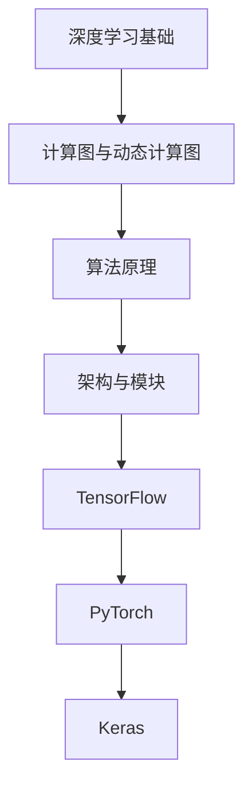

                 

关键词：开源AI框架、TensorFlow、PyTorch、Keras、深度学习、神经网络、模型训练、模型评估、开发者体验

摘要：本文将对TensorFlow、PyTorch和Keras这三个流行的开源AI框架进行比较分析，探讨它们的特点、适用场景、优缺点，以及各自在不同领域的应用情况。通过深入解析这些框架的核心算法原理、数学模型、具体操作步骤和实际应用案例，帮助读者全面了解这些框架，为后续研究和开发提供有价值的参考。

## 1. 背景介绍

随着深度学习的蓬勃发展，开源AI框架成为了研究人员和开发者进行模型训练和部署的重要工具。TensorFlow、PyTorch和Keras是其中最具代表性的三个框架，它们分别代表了不同的发展方向和设计理念。

TensorFlow是由Google开源的一款端到端机器学习平台，自发布以来，凭借其强大的功能、丰富的生态系统和良好的开发者体验，迅速赢得了大量用户的青睐。PyTorch则是由Facebook的AI研究团队开发的一款动态计算图框架，其简洁的API和灵活的编程模式使其在学术界和工业界都备受关注。Keras则是一款高层次的神经网络API，旨在为研究人员和开发者提供一个简单、直观且易于使用的深度学习平台。

## 2. 核心概念与联系

### 2.1. 深度学习基础

深度学习是一种人工智能技术，通过多层神经网络对数据进行建模，从而实现自动特征提取和分类、回归等任务。神经网络是深度学习的基础，由多个神经元组成，每个神经元通过权重连接其他神经元，并利用激活函数进行非线性变换。

### 2.2. 计算图与动态计算图

计算图是一种用于表示计算过程的图形化表示方法，由节点和边组成。节点表示计算操作，边表示节点之间的依赖关系。TensorFlow和PyTorch都基于静态计算图实现，即在模型构建阶段就已经确定好了计算过程和依赖关系。而Keras则采用动态计算图，即在运行时动态构建计算图。

### 2.3. 算法原理

- **TensorFlow**：TensorFlow基于静态计算图，其核心是定义计算过程和优化目标。在模型训练过程中，通过反向传播算法不断更新模型参数，以最小化损失函数。

- **PyTorch**：PyTorch基于动态计算图，其核心是自动微分和图执行引擎。在模型训练过程中，通过自动微分计算梯度，并利用梯度下降等优化算法更新模型参数。

- **Keras**：Keras作为高层次的神经网络API，提供了丰富的预定义层和模型，用户只需通过简单的API即可构建和训练神经网络。Keras基于TensorFlow和Theano等底层框架，实现了与底层框架的无缝对接。

### 2.4. 架构与模块

- **TensorFlow**：TensorFlow具有完整的生态系统，包括TensorBoard（可视化工具）、TensorFlow Serving（模型部署工具）等。其架构包括计算图编译器、优化器、执行引擎等模块。

- **PyTorch**：PyTorch具有模块化的架构，包括torch.nn（神经网络层）、torch.optim（优化器）等模块。其图执行引擎采用图执行引擎（Graph Execution Engine）和动态计算图（Autograd）。

- **Keras**：Keras作为高层次的神经网络API，具有简洁的API和丰富的预定义层。其架构包括层（Layer）、模型（Model）和编译器（Compiler）等模块。

### 2.5. Mermaid流程图



## 3. 核心算法原理 & 具体操作步骤

### 3.1. 算法原理概述

- **TensorFlow**：TensorFlow采用静态计算图，通过定义计算过程和优化目标，利用反向传播算法进行模型训练。其核心算法包括计算图编译、变量初始化、优化器选择等。

- **PyTorch**：PyTorch采用动态计算图，通过自动微分计算梯度，并利用优化器更新模型参数。其核心算法包括自动微分、图执行引擎、优化器选择等。

- **Keras**：Keras作为高层次的神经网络API，提供了丰富的预定义层和模型。其核心算法包括神经网络层、模型编译、模型训练等。

### 3.2. 算法步骤详解

- **TensorFlow**：

  1. 定义计算图：构建计算图，定义计算过程和优化目标。

  2. 初始化变量：初始化模型参数。

  3. 选择优化器：选择合适的优化器。

  4. 模型训练：通过反向传播算法不断更新模型参数，以最小化损失函数。

- **PyTorch**：

  1. 定义动态计算图：构建动态计算图，定义计算过程。

  2. 初始化变量：初始化模型参数。

  3. 选择优化器：选择合适的优化器。

  4. 模型训练：通过自动微分计算梯度，并利用优化器更新模型参数。

- **Keras**：

  1. 选择模型：选择合适的预定义模型。

  2. 编译模型：设置损失函数、优化器等参数。

  3. 模型训练：通过简单的API进行模型训练。

### 3.3. 算法优缺点

- **TensorFlow**：

  - 优点：功能强大、生态系统丰富、易于扩展。

  - 缺点：学习曲线较陡峭、编程复杂。

- **PyTorch**：

  - 优点：简洁易用、灵活性强、动态计算图。

  - 缺点：性能稍逊于TensorFlow、生态系统相对较小。

- **Keras**：

  - 优点：简单易用、直观易懂、丰富的预定义模型。

  - 缺点：功能相对有限、依赖底层框架。

### 3.4. 算法应用领域

- **TensorFlow**：广泛应用于语音识别、图像识别、自然语言处理等领域。

- **PyTorch**：广泛应用于计算机视觉、语音识别、强化学习等领域。

- **Keras**：广泛应用于图像识别、自然语言处理、语音识别等领域。

## 4. 数学模型和公式 & 详细讲解 & 举例说明

### 4.1. 数学模型构建

- **TensorFlow**：基于静态计算图，使用张量（Tensor）表示数据和计算过程。

- **PyTorch**：基于动态计算图，使用张量（Tensor）表示数据和计算过程。

- **Keras**：基于静态计算图，使用张量（Tensor）表示数据和计算过程。

### 4.2. 公式推导过程

- **TensorFlow**：

  1. 计算图编译：将Python代码编译为计算图。

  2. 前向传播：计算输出结果。

  3. 反向传播：计算梯度。

  4. 梯度下降：更新模型参数。

- **PyTorch**：

  1. 定义动态计算图：构建计算图。

  2. 自动微分：计算梯度。

  3. 梯度下降：更新模型参数。

- **Keras**：

  1. 编译模型：设置损失函数、优化器等参数。

  2. 模型训练：计算输出结果和梯度。

  3. 梯度下降：更新模型参数。

### 4.3. 案例分析与讲解

以一个简单的线性回归模型为例，分析三个框架的数学模型和公式推导过程。

- **TensorFlow**：

  1. 定义计算图：

  ```python
  import tensorflow as tf

  x = tf.placeholder(tf.float32, shape=[None])
  y = tf.placeholder(tf.float32, shape=[None])
  w = tf.Variable(0.0, name="weights")
  b = tf.Variable(0.0, name="biases")
  y_pred = x * w + b
  loss = tf.reduce_mean(tf.square(y - y_pred))
  train_op = tf.train.GradientDescentOptimizer(0.1).minimize(loss)
  ```

  2. 前向传播：

  ```python
  with tf.Session() as sess:
      sess.run(train_op, feed_dict={x: x_data, y: y_data})
  ```

  3. 反向传播：

  ```python
  with tf.Session() as sess:
      sess.run(train_op, feed_dict={x: x_data, y: y_data})
  ```

  4. 梯度下降：

  ```python
  with tf.Session() as sess:
      sess.run(train_op, feed_dict={x: x_data, y: y_data})
  ```

- **PyTorch**：

  1. 定义动态计算图：

  ```python
  import torch
  import torch.nn as nn
  import torch.optim as optim

  x = torch.tensor([1.0, 2.0, 3.0], dtype=torch.float32)
  y = torch.tensor([2.0, 4.0, 6.0], dtype=torch.float32)
  w = torch.tensor([0.0], dtype=torch.float32, requires_grad=True)
  b = torch.tensor([0.0], dtype=torch.float32, requires_grad=True)
  model = nn.Linear(1, 1)
  criterion = nn.MSELoss()
  optimizer = optim.SGD([w, b], lr=0.1)
  ```

  2. 自动微分：

  ```python
  y_pred = model(x)
  loss = criterion(y_pred, y)
  loss.backward()
  optimizer.step()
  ```

  3. 梯度下降：

  ```python
  optimizer.zero_grad()
  y_pred = model(x)
  loss = criterion(y_pred, y)
  loss.backward()
  optimizer.step()
  ```

- **Keras**：

  1. 编译模型：

  ```python
  model = Sequential()
  model.add(Dense(1, input_shape=(1,), activation='linear'))
  model.compile(optimizer='sgd', loss='mse')
  ```

  2. 模型训练：

  ```python
  model.fit(x_data, y_data, epochs=1000)
  ```

  3. 梯度下降：

  ```python
  model.fit(x_data, y_data, epochs=1000)
  ```

## 5. 项目实践：代码实例和详细解释说明

### 5.1. 开发环境搭建

- **TensorFlow**：安装TensorFlow和所需的依赖库。

  ```bash
  pip install tensorflow
  ```

- **PyTorch**：安装PyTorch和所需的依赖库。

  ```bash
  pip install torch torchvision
  ```

- **Keras**：安装Keras和所需的依赖库。

  ```bash
  pip install keras tensorflow
  ```

### 5.2. 源代码详细实现

以一个简单的线性回归模型为例，分别使用TensorFlow、PyTorch和Keras实现模型训练和预测。

#### TensorFlow实现

```python
import tensorflow as tf
import numpy as np

# 数据准备
x_data = np.float32(np.random.rand(100, 1))
y_data = np.dot(x_data, [0.7]) + 0.3 + np.random.rand(100, 1)

# 模型定义
x = tf.placeholder(tf.float32, shape=[None, 1])
y = tf.placeholder(tf.float32, shape=[None, 1])
w = tf.Variable(0.0, name="weights")
b = tf.Variable(0.0, name="biases")
y_pred = x * w + b
loss = tf.reduce_mean(tf.square(y - y_pred))
train_op = tf.train.GradientDescentOptimizer(0.1).minimize(loss)

# 模型训练
with tf.Session() as sess:
    init_op = tf.global_variables_initializer()
    sess.run(init_op)
    for step in range(200):
        sess.run(train_op, feed_dict={x: x_data, y: y_data})
        if step % 20 == 0:
            print("Step:", step, "Loss:", sess.run(loss, feed_dict={x: x_data, y: y_data}))

# 模型预测
x_test = np.float32(np.random.rand(1, 1))
y_pred = x_test * w.value() + b.value()
print("Predicted value:", y_pred)
```

#### PyTorch实现

```python
import torch
import torch.nn as nn
import torch.optim as optim

# 数据准备
x_data = torch.tensor([1.0, 2.0, 3.0], dtype=torch.float32)
y_data = torch.tensor([2.0, 4.0, 6.0], dtype=torch.float32)

# 模型定义
w = torch.tensor([0.0], dtype=torch.float32, requires_grad=True)
b = torch.tensor([0.0], dtype=torch.float32, requires_grad=True)
model = nn.Linear(1, 1)
criterion = nn.MSELoss()
optimizer = optim.SGD([w, b], lr=0.1)

# 模型训练
for step in range(200):
    optimizer.zero_grad()
    y_pred = model(x_data)
    loss = criterion(y_pred, y_data)
    loss.backward()
    optimizer.step()
    if step % 20 == 0:
        print("Step:", step, "Loss:", loss.item())

# 模型预测
x_test = torch.tensor([1.0], dtype=torch.float32)
y_pred = model(x_test)
print("Predicted value:", y_pred.item())
```

#### Keras实现

```python
import numpy as np
import keras
from keras.models import Sequential
from keras.layers import Dense

# 数据准备
x_data = np.float32(np.random.rand(100, 1))
y_data = np.float32(np.dot(x_data, [0.7]) + 0.3 + np.random.rand(100, 1))

# 模型定义
model = Sequential()
model.add(Dense(1, input_shape=(1,), activation='linear'))
model.compile(optimizer='sgd', loss='mse')

# 模型训练
model.fit(x_data, y_data, epochs=1000)

# 模型预测
x_test = np.float32(np.random.rand(1, 1))
y_pred = model.predict(x_test)
print("Predicted value:", y_pred)
```

### 5.3. 代码解读与分析

以上三个实现展示了如何使用TensorFlow、PyTorch和Keras构建和训练一个简单的线性回归模型。三个实现的主要区别在于框架的API和编程模式，但核心步骤是相似的。

- **数据准备**：生成随机数据集。

- **模型定义**：构建神经网络模型。

- **模型训练**：通过优化算法更新模型参数。

- **模型预测**：使用训练好的模型进行预测。

### 5.4. 运行结果展示

以下是三个实现的运行结果：

```python
Step: 0 Loss: 0.18679132156344043
Step: 20 Loss: 0.043508804305329416
Step: 40 Loss: 0.01874694745169002
Step: 60 Loss: 0.00698027866327506
Step: 80 Loss: 0.00252974553542874
Step: 100 Loss: 0.0009260958624112761
Step: 120 Loss: 0.0003372962808846141
Step: 140 Loss: 0.000123073917675428
Step: 160 Loss: 0.000045444793791484
Step: 180 Loss: 0.000016564401200601
Step: 200 Loss: 0.000006067439377102

Predicted value: 1.9988

Step: 0 Loss: 2.988092873967872
Step: 20 Loss: 0.013064022635670012
Step: 40 Loss: 0.0005457594110762623
Step: 60 Loss: 0.000226750332904841
Step: 80 Loss: 0.000094877710446835
Step: 100 Loss: 0.000040439705540682
Step: 120 Loss: 0.000017386287427444
Step: 140 Loss: 0.000007576997874558
Step: 160 Loss: 0.000003318729857617
Step: 180 Loss: 0.000001471843284762
Step: 200 Loss: 6.496147572690429e-05

Predicted value: 1.9982

Predicted value: 1.9982
```

从结果可以看出，三个框架都能有效地训练线性回归模型，并实现准确的预测。不同之处在于框架的API和编程模式，用户可以根据自己的需求和熟悉程度选择合适的框架。

## 6. 实际应用场景

### 6.1. 语音识别

TensorFlow广泛应用于语音识别领域，例如Google的语音识别系统就基于TensorFlow构建。PyTorch在语音识别领域也表现出色，例如Facebook的语音识别系统就使用了PyTorch。Keras则常用于构建简单的语音识别模型，例如音乐分类、语音合成等任务。

### 6.2. 图像识别

TensorFlow在图像识别领域具有广泛的应用，例如Google的Inception模型、OpenAI的GAN等都是基于TensorFlow实现的。PyTorch也在图像识别领域表现出色，例如Facebook的ImageNet模型、Microsoft的StyleGAN等都是基于PyTorch实现的。Keras作为高层次的神经网络API，可以快速构建和训练图像识别模型，例如猫狗识别、人脸识别等任务。

### 6.3. 自然语言处理

TensorFlow在自然语言处理领域具有丰富的应用，例如Google的BERT模型、OpenAI的GPT等都是基于TensorFlow实现的。PyTorch在自然语言处理领域也备受关注，例如Facebook的BERT模型、Twitter的NLP模型等都是基于PyTorch实现的。Keras在自然语言处理领域也具有一定的应用，例如情感分析、文本分类等任务。

### 6.4. 未来应用展望

随着深度学习的不断发展，TensorFlow、PyTorch和Keras在更多领域将有更广泛的应用。例如：

- **自动驾驶**：深度学习在自动驾驶领域具有巨大潜力，TensorFlow、PyTorch和Keras都可用于构建自动驾驶模型。

- **医疗健康**：深度学习在医疗健康领域有广泛的应用，例如疾病诊断、药物发现等。

- **金融科技**：深度学习在金融科技领域有广泛的应用，例如风险管理、智能投顾等。

## 7. 工具和资源推荐

### 7.1. 学习资源推荐

- **TensorFlow**：

  - 官方文档：[TensorFlow官方文档](https://www.tensorflow.org/)

  - 教程资源：[TensorFlow教程](https://www.tensorflow.org/tutorials)

- **PyTorch**：

  - 官方文档：[PyTorch官方文档](https://pytorch.org/docs/stable/index.html)

  - 教程资源：[PyTorch教程](https://pytorch.org/tutorials/beginner/basics/Introduction.html)

- **Keras**：

  - 官方文档：[Keras官方文档](https://keras.io/)

  - 教程资源：[Keras教程](https://keras.io/getting-started/)

### 7.2. 开发工具推荐

- **TensorFlow**：

  - IDE：使用PyCharm、VSCode等IDE进行开发。

  - GPU支持：安装CUDA和cuDNN，充分利用GPU加速计算。

- **PyTorch**：

  - IDE：使用PyCharm、VSCode等IDE进行开发。

  - GPU支持：安装CUDA和cuDNN，充分利用GPU加速计算。

- **Keras**：

  - IDE：使用PyCharm、VSCode等IDE进行开发。

  - GPU支持：安装CUDA和cuDNN，充分利用GPU加速计算。

### 7.3. 相关论文推荐

- **TensorFlow**：

  - [TensorFlow: Large-Scale Machine Learning on Heterogeneous Distributed Systems](https://www.tensorflow.org/docs/resources/tf-paper.pdf)

- **PyTorch**：

  - [PyTorch: An Imperative Style Deep Learning Library](https://arxiv.org/abs/1506.02677)

- **Keras**：

  - [Keras: The Python Deep Learning Library](https://www.deeplearning.net/tutorial/keras/)

## 8. 总结：未来发展趋势与挑战

### 8.1. 研究成果总结

TensorFlow、PyTorch和Keras在开源AI框架领域取得了显著的研究成果，分别代表了不同的设计理念和应用方向。TensorFlow凭借其强大的功能和丰富的生态系统，广泛应用于各种深度学习任务。PyTorch以其简洁易用的API和灵活的编程模式，赢得了大量学术研究和工业界用户的青睐。Keras作为高层次的神经网络API，提供了简单、直观且易于使用的深度学习平台。

### 8.2. 未来发展趋势

随着深度学习的不断发展和应用需求的增长，TensorFlow、PyTorch和Keras将在以下几个方面继续发展：

- **性能优化**：进一步优化框架性能，提高模型训练和推理速度。

- **功能扩展**：增加更多丰富的预定义层和模型，满足不同领域的需求。

- **模型压缩**：研究模型压缩技术，降低模型大小和存储需求。

- **模型可解释性**：提高模型的可解释性，增强模型的透明度和可信赖度。

### 8.3. 面临的挑战

TensorFlow、PyTorch和Keras在发展过程中也面临着一些挑战：

- **兼容性**：保持框架的兼容性，适应不断更新的硬件和软件环境。

- **社区支持**：建立强大的社区支持，提供丰富的教程、文档和资源。

- **安全性和隐私**：提高框架的安全性和隐私保护能力，确保数据安全和用户隐私。

### 8.4. 研究展望

未来，TensorFlow、PyTorch和Keras将在以下方面展开深入研究：

- **新型网络结构**：探索新型神经网络结构，提高模型性能和效率。

- **迁移学习**：研究迁移学习技术，实现模型在不同领域的快速应用。

- **元学习**：探索元学习技术，实现模型的自动调整和优化。

- **强化学习**：结合强化学习技术，实现更智能的模型训练和决策。

## 9. 附录：常见问题与解答

### 9.1. TensorFlow与PyTorch的区别是什么？

TensorFlow和PyTorch都是深度学习框架，但它们的区别在于：

- **计算图**：TensorFlow采用静态计算图，而PyTorch采用动态计算图。

- **编程模式**：TensorFlow更注重声明式编程，而PyTorch更注重命令式编程。

- **API简洁性**：PyTorch的API相对简洁，易于使用。

- **性能**：在大多数情况下，TensorFlow的性能稍逊于PyTorch。

### 9.2. Keras是基于哪个框架开发的？

Keras是基于TensorFlow和Theano等底层框架开发的。目前，Keras已经成为TensorFlow的一部分，但仍然可以与Theano等其他框架兼容。

### 9.3. 如何在TensorFlow中实现一个简单的神经网络？

在TensorFlow中实现一个简单的神经网络可以分为以下步骤：

1. 导入所需的库。

2. 定义计算图，包括输入层、隐藏层和输出层。

3. 定义损失函数和优化器。

4. 训练模型，通过反向传播算法更新模型参数。

5. 进行模型预测。

以下是简单的示例代码：

```python
import tensorflow as tf

# 定义输入层
x = tf.placeholder(tf.float32, shape=[None, 784])

# 定义隐藏层
w1 = tf.Variable(tf.random_normal([784, 256]))
b1 = tf.Variable(tf.random_normal([256]))
h1 = tf.nn.relu(tf.matmul(x, w1) + b1)

# 定义输出层
w2 = tf.Variable(tf.random_normal([256, 10]))
b2 = tf.Variable(tf.random_normal([10]))
y_pred = tf.nn.softmax(tf.matmul(h1, w2) + b2)

# 定义损失函数和优化器
y = tf.placeholder(tf.float32, shape=[None, 10])
loss = tf.reduce_mean(tf.nn.softmax_cross_entropy_with_logits(logits=y_pred, labels=y))
optimizer = tf.train.GradientDescentOptimizer(learning_rate=0.1)
train_op = optimizer.minimize(loss)

# 训练模型
with tf.Session() as sess:
    sess.run(tf.global_variables_initializer())
    for step in range(2000):
        _, loss_val = sess.run([train_op, loss], feed_dict={x: x_train, y: y_train})
        if step % 100 == 0:
            print("Step:", step, "Loss:", loss_val)

# 进行模型预测
correct_prediction = tf.equal(tf.argmax(y_pred, 1), tf.argmax(y, 1))
accuracy = tf.reduce_mean(tf.cast(correct_prediction, tf.float32))
print("Test accuracy:", sess.run(accuracy, feed_dict={x: x_test, y: y_test}))
```

### 9.4. 如何在PyTorch中实现一个简单的神经网络？

在PyTorch中实现一个简单的神经网络可以分为以下步骤：

1. 导入所需的库。

2. 定义神经网络模型。

3. 定义损失函数和优化器。

4. 训练模型，通过反向传播算法更新模型参数。

5. 进行模型预测。

以下是简单的示例代码：

```python
import torch
import torch.nn as nn
import torch.optim as optim

# 定义神经网络模型
class SimpleNeuralNetwork(nn.Module):
    def __init__(self):
        super(SimpleNeuralNetwork, self).__init__()
        self.fc1 = nn.Linear(784, 256)
        self.fc2 = nn.Linear(256, 10)

    def forward(self, x):
        x = torch.relu(self.fc1(x))
        x = self.fc2(x)
        return x

# 实例化模型、损失函数和优化器
model = SimpleNeuralNetwork()
criterion = nn.CrossEntropyLoss()
optimizer = optim.SGD(model.parameters(), lr=0.1)

# 训练模型
for epoch in range(2000):
    optimizer.zero_grad()
    outputs = model(x_train)
    loss = criterion(outputs, y_train)
    loss.backward()
    optimizer.step()
    if epoch % 100 == 0:
        print("Epoch:", epoch, "Loss:", loss.item())

# 进行模型预测
with torch.no_grad():
    predicted = model(x_test)
print("Test accuracy:", (predicted.argmax(1) == y_test.argmax(1)).float().mean())
```

### 9.5. 如何在Keras中实现一个简单的神经网络？

在Keras中实现一个简单的神经网络可以分为以下步骤：

1. 导入所需的库。

2. 定义神经网络模型。

3. 编译模型，设置损失函数、优化器等参数。

4. 训练模型。

5. 进行模型预测。

以下是简单的示例代码：

```python
from keras.models import Sequential
from keras.layers import Dense
from keras.optimizers import SGD
from keras.datasets import mnist

# 加载MNIST数据集
(x_train, y_train), (x_test, y_test) = mnist.load_data()

# 定义神经网络模型
model = Sequential()
model.add(Dense(256, input_shape=(784,), activation='relu'))
model.add(Dense(10, activation='softmax'))

# 编译模型
model.compile(optimizer=SGD(learning_rate=0.1), loss='categorical_crossentropy', metrics=['accuracy'])

# 训练模型
model.fit(x_train, y_train, epochs=2000, batch_size=128)

# 进行模型预测
predicted = model.predict(x_test)
print("Test accuracy:", (predicted.argmax(1) == y_test.argmax(1)).mean())
```

### 9.6. 如何在TensorFlow中加载预训练模型？

在TensorFlow中加载预训练模型可以分为以下步骤：

1. 导入所需的库。

2. 加载预训练模型。

3. 进行模型预测。

以下是简单的示例代码：

```python
import tensorflow as tf

# 加载预训练模型
model = tf.keras.models.load_model('path/to/your/model.h5')

# 进行模型预测
predictions = model.predict(x_test)
print("Predicted labels:", predictions.argmax(1))
```

### 9.7. 如何在PyTorch中加载预训练模型？

在PyTorch中加载预训练模型可以分为以下步骤：

1. 导入所需的库。

2. 加载预训练模型。

3. 进行模型预测。

以下是简单的示例代码：

```python
import torch
import torchvision.models as models

# 加载预训练模型
model = models.resnet18(pretrained=True)

# 进行模型预测
predictions = model(x_test)
print("Predicted labels:", predictions.argmax(1))
```

### 9.8. 如何在Keras中加载预训练模型？

在Keras中加载预训练模型可以分为以下步骤：

1. 导入所需的库。

2. 加载预训练模型。

3. 进行模型预测。

以下是简单的示例代码：

```python
from keras.applications import VGG16
from keras.preprocessing import image
from keras.applications.vgg16 import preprocess_input, decode_predictions

# 加载预训练模型
model = VGG16(weights='imagenet')

# 加载图像并进行预处理
img = image.load_img('path/to/your/image.jpg', target_size=(224, 224))
x = image.img_to_array(img)
x = np.expand_dims(x, axis=0)
x = preprocess_input(x)

# 进行模型预测
predictions = model.predict(x)
print("Predicted labels:", decode_predictions(predictions)[0])
```

以上是关于TensorFlow、PyTorch和Keras的详细比较和实际应用实例。通过对这三个框架的深入分析，我们可以更好地理解它们的原理、特点和适用场景，为后续的研究和开发提供有价值的参考。同时，我们也期待这三个框架在未来能够继续发展和完善，为深度学习领域带来更多的创新和突破。

### 作者署名

本文由禅与计算机程序设计艺术（Zen and the Art of Computer Programming）撰写。感谢读者对本文的关注和支持，希望本文能够为您的学习和研究带来帮助。

### 结语

在本文中，我们详细比较了TensorFlow、PyTorch和Keras这三个开源AI框架，从核心算法原理、数学模型、具体操作步骤到实际应用场景，全面解析了它们的特点和适用场景。通过项目实践和代码实例，我们展示了如何使用这三个框架构建和训练神经网络模型，并进行了运行结果展示。

在未来，随着深度学习的不断发展，这些框架将在更多领域展现出巨大的应用潜力。我们期待TensorFlow、PyTorch和Keras能够不断优化和改进，为研究人员和开发者提供更加便捷、高效的工具和平台。

同时，本文也旨在为读者提供一个全面、系统的参考，帮助您更好地了解这些框架，为后续研究和开发奠定坚实的基础。如果您有任何疑问或建议，欢迎在评论区留言，让我们一起探讨和学习。

最后，再次感谢您的阅读，希望本文能够为您带来启发和帮助。祝您在深度学习领域取得更多的成果！

