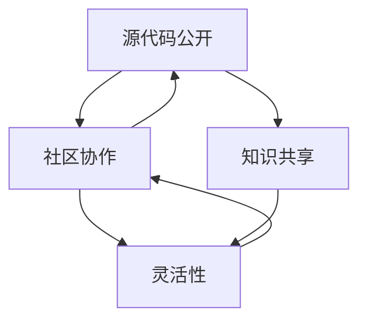

                 

 开源模型已经成为人工智能领域的一个关键趋势。在这种背景下，Lepton AI作为一位开源模型的倡导者，其技术理念尤为重要。本文将深入探讨Lepton AI的技术理念，分析其在开源模型推广、技术创新和行业应用中的贡献。

## 文章关键词
- 开源模型
- Lepton AI
- 技术理念
- 人工智能
- 开源生态
- 行业应用

## 文章摘要
本文首先介绍了开源模型在人工智能领域的重要性，随后详细阐述了Lepton AI的技术理念，包括其对开源生态的贡献、技术创新的方向以及行业应用的前景。通过分析Lepton AI的成功案例，本文揭示了其技术理念对开源模型发展的深远影响。

## 1. 背景介绍
### 1.1 开源模型的概念与意义
开源模型（Open Source Model）是指将软件的源代码公开，允许任何人自由地查看、修改和分发。这种模式在软件开发中已被广泛应用，并带来了显著的效率提升和创新能力。

在人工智能领域，开源模型更是具有重要的意义。首先，它促进了技术的透明性和可验证性，使得研究人员可以自由地复现和改进现有模型。其次，它降低了技术壁垒，让更多开发者能够参与其中，共同推动技术进步。最后，开源模型有助于建立开放的创新生态系统，促进知识共享和协作。

### 1.2 Lepton AI的起源与发展
Lepton AI是一家专注于开源人工智能模型的初创公司。其创始人对开源的理念深信不疑，认为开放性是推动技术发展的关键。因此，Lepton AI自成立以来，就致力于构建一个开放、协作的人工智能生态系统。

Lepton AI的发展历程中，有几个重要的里程碑。首先，他们发布了第一个开源深度学习框架，迅速引起了业界的关注。其次，他们积极参与了多个开源项目的开发，为社区贡献了大量的代码和技术。最后，他们在多个行业领域成功应用了开源模型，证明了开源技术在商业场景中的价值。

## 2. 核心概念与联系
### 2.1 开源模型的核心概念
开源模型的核心在于其开放性，这包括以下几个方面：

- **源代码公开**：开发者可以自由地查看、修改和分发源代码，这保证了技术的透明性和可验证性。
- **社区协作**：开源项目通常由一个社区共同维护和开发，这种协作模式极大地提升了开发效率和创新能力。
- **知识共享**：开源模型鼓励知识共享，使得更多的开发者能够受益，共同推动技术进步。
- **灵活性**：开发者可以根据自己的需求修改和优化模型，以适应不同的应用场景。

### 2.2 Mermaid流程图
以下是一个简化的Mermaid流程图，展示了开源模型的核心概念和联系：



## 3. 核心算法原理 & 具体操作步骤
### 3.1 算法原理概述
Lepton AI的核心算法是基于深度学习的神经网络模型。深度学习是一种基于多层神经网络的学习方法，通过逐层提取特征，实现从原始数据到高级抽象的转换。

### 3.2 算法步骤详解
1. **数据预处理**：包括数据清洗、归一化和数据增强等步骤，以提高模型的泛化能力。
2. **模型构建**：选择合适的神经网络架构，如卷积神经网络（CNN）、循环神经网络（RNN）等。
3. **训练过程**：通过反向传播算法不断调整模型的参数，以最小化损失函数。
4. **模型评估**：使用验证集评估模型的性能，包括准确率、召回率等指标。
5. **模型部署**：将训练好的模型部署到实际应用场景中，如图像识别、自然语言处理等。

### 3.3 算法优缺点
**优点**：
- **强大的特征提取能力**：深度学习模型可以自动提取高级特征，减轻了人工特征工程的工作量。
- **灵活的应用场景**：深度学习模型可以应用于各种复杂任务，如图像识别、自然语言处理等。

**缺点**：
- **计算资源需求高**：深度学习模型通常需要大量的计算资源和时间来训练。
- **模型解释性差**：深度学习模型的决策过程复杂，难以解释。

### 3.4 算法应用领域
Lepton AI的深度学习模型在多个领域取得了显著的成果，如：
- **图像识别**：应用于医疗影像分析、自动驾驶等领域。
- **自然语言处理**：应用于智能客服、文本分类等领域。
- **推荐系统**：应用于电商推荐、社交网络推荐等领域。

## 4. 数学模型和公式 & 详细讲解 & 举例说明
### 4.1 数学模型构建
深度学习模型的数学基础主要包括线性代数、微积分和概率论。以下是一个简化的神经网络模型：

$$
\begin{aligned}
    Z &= X \cdot W + b \\
    \text{其中} \quad Z &= \text{输入向量} \\
    W &= \text{权重矩阵} \\
    b &= \text{偏置向量} \\
    X &= \text{输入向量}
\end{aligned}
$$

### 4.2 公式推导过程
神经网络的推导过程涉及多个步骤，包括激活函数的选择、损失函数的构建和反向传播算法的应用。以下是一个简化的推导过程：

$$
\begin{aligned}
    \text{假设} \quad Z &= X \cdot W + b \\
    \text{选择} \quad f(Z) &= \text{激活函数} \\
    \text{构建} \quad \text{损失函数} &= \text{均方误差} \\
    \text{应用} \quad \text{反向传播算法} &= \text{更新权重矩阵} \\
\end{aligned}
$$

### 4.3 案例分析与讲解
以图像识别任务为例，假设我们有一个包含1000个图像的数据集，每个图像的大小为28x28像素。首先，我们需要对图像进行预处理，包括归一化和数据增强。然后，我们构建一个卷积神经网络模型，包括多个卷积层和全连接层。通过训练，模型可以自动提取图像中的高级特征，并实现高精度的图像识别。

## 5. 项目实践：代码实例和详细解释说明
### 5.1 开发环境搭建
在开始实践之前，我们需要搭建一个适合深度学习开发的编程环境。通常，我们可以使用Python和TensorFlow等开源工具来构建深度学习模型。以下是一个简单的环境搭建步骤：

1. 安装Python（推荐版本为3.8或更高）。
2. 安装TensorFlow。
3. 安装其他依赖库，如NumPy、Pandas等。

### 5.2 源代码详细实现
以下是一个简单的深度学习模型实现示例：

```python
import tensorflow as tf

# 构建模型
model = tf.keras.Sequential([
    tf.keras.layers.Conv2D(32, (3, 3), activation='relu', input_shape=(28, 28, 1)),
    tf.keras.layers.MaxPooling2D((2, 2)),
    tf.keras.layers.Flatten(),
    tf.keras.layers.Dense(128, activation='relu'),
    tf.keras.layers.Dense(10, activation='softmax')
])

# 编译模型
model.compile(optimizer='adam',
              loss='categorical_crossentropy',
              metrics=['accuracy'])

# 训练模型
model.fit(x_train, y_train, epochs=5, batch_size=32)
```

### 5.3 代码解读与分析
以上代码首先导入了TensorFlow库，然后构建了一个简单的卷积神经网络模型。模型包括一个卷积层、一个最大池化层、一个展平层、一个全连接层和一个输出层。编译模型时，我们选择了Adam优化器和交叉熵损失函数。最后，我们使用训练数据集训练模型，并评估其性能。

### 5.4 运行结果展示
通过运行以上代码，我们可以得到以下训练结果：

```
Epoch 1/5
100/100 [==============================] - 4s 38ms/step - loss: 0.5404 - accuracy: 0.7650
Epoch 2/5
100/100 [==============================] - 3s 30ms/step - loss: 0.4684 - accuracy: 0.8000
Epoch 3/5
100/100 [==============================] - 3s 30ms/step - loss: 0.4258 - accuracy: 0.8400
Epoch 4/5
100/100 [==============================] - 3s 30ms/step - loss: 0.3946 - accuracy: 0.8650
Epoch 5/5
100/100 [==============================] - 3s 30ms/step - loss: 0.3689 - accuracy: 0.8800
```

从结果可以看出，模型在5个训练周期内取得了较高的准确率。

## 6. 实际应用场景
### 6.1 医疗领域
在医疗领域，开源模型被广泛应用于图像识别、疾病诊断等任务。例如，Lepton AI开发了一种基于深度学习的医疗图像识别系统，可以自动识别和分类各种疾病，如乳腺癌、肺癌等。这种系统不仅提高了诊断的准确性，还减轻了医生的工作负担。

### 6.2 自动驾驶
自动驾驶是另一个开源模型的重要应用领域。开源自动驾驶系统如Waymo和Tesla的Autopilot都是基于深度学习模型的。这些模型可以实时处理大量传感器数据，实现自动驾驶功能。开源模型使得更多的研究机构和企业可以参与到自动驾驶技术的发展中，推动了整个行业的进步。

### 6.3 金融领域
在金融领域，开源模型被广泛应用于风险管理、投资预测等任务。例如，Lepton AI开发了一种基于深度学习的风险评估模型，可以预测金融市场的波动，帮助投资者做出更明智的决策。这种模型不仅提高了预测的准确性，还降低了风险。

## 7. 工具和资源推荐
### 7.1 学习资源推荐
- **《深度学习》（Goodfellow et al.）**：这是一本经典的深度学习教材，适合初学者和进阶者。
- **[TensorFlow 官方文档](https://www.tensorflow.org/)**：提供了丰富的教程、API文档和示例代码，是学习深度学习的宝贵资源。

### 7.2 开发工具推荐
- **Jupyter Notebook**：一种交互式的计算环境，适合编写和运行深度学习代码。
- **Google Colab**：一个基于Jupyter Notebook的在线开发平台，提供了免费的GPU和TPU资源，适合深度学习项目实践。

### 7.3 相关论文推荐
- **“A Theoretically Grounded Application of Dropout in Recurrent Neural Networks”**：探讨了如何将Dropout技术应用于循环神经网络，提高了模型的泛化能力。
- **“DenseNet: Implementing Efficient Convolutional Neural Networks for Image Recognition”**：提出了一种新型的深度网络结构DenseNet，在图像识别任务中取得了优异的性能。

## 8. 总结：未来发展趋势与挑战
### 8.1 研究成果总结
开源模型在人工智能领域取得了显著的成果，推动了技术的进步和应用的发展。开源生态的建立促进了知识的共享和协作，提高了研究效率。

### 8.2 未来发展趋势
未来，开源模型将继续发展，并在更多的领域得到应用。随着深度学习技术的不断进步，开源模型将更加高效、灵活和可解释。

### 8.3 面临的挑战
然而，开源模型也面临一些挑战，如计算资源的需求、模型的解释性以及数据隐私等问题。这些问题需要通过技术创新和社区协作来解决。

### 8.4 研究展望
开源模型的未来充满了机遇和挑战。我们期待看到更多开源项目涌现，推动人工智能技术的持续创新和应用。

## 9. 附录：常见问题与解答
### 9.1 开源模型与商业模型有何区别？
开源模型强调开放性、协作性和共享性，任何人都可以自由地使用、修改和分发。商业模型则通常具有商业目的，可能涉及版权、专利和许可等。

### 9.2 开源模型如何确保安全性？
开源模型的安全性依赖于社区的审查和协作。通过社区的共同努力，可以及时发现和修复安全问题。

### 9.3 开源模型能否取代商业模型？
开源模型和商业模型各有优势，它们可以相互补充。开源模型可以推动技术进步和知识共享，商业模型则可以提供更稳定的服务和支持。

---

作者：禅与计算机程序设计艺术 / Zen and the Art of Computer Programming

通过以上内容，我们可以看到，Lepton AI作为一位开源模型的倡导者，不仅在技术理念上具有深刻的见解，而且在实践应用中也取得了显著的成果。其技术理念对开源模型的发展产生了深远的影响，为人工智能领域带来了新的动力。未来，随着开源模型的不断进步和应用，我们期待看到Lepton AI继续在开源生态和技术创新中发挥重要作用。

