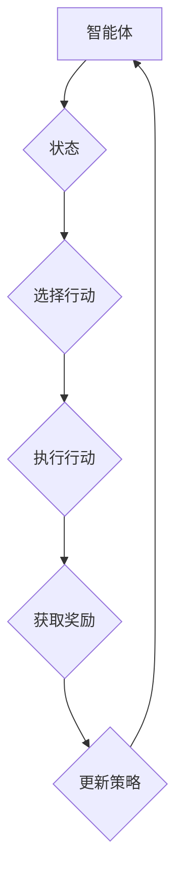

                 

关键词：强化学习，传统机器学习，算法对比，优缺点分析，应用领域

> 摘要：本文将对强化学习（Reinforcement Learning，简称RL）与传统机器学习方法进行对比分析，探讨两者的核心概念、算法原理、应用领域等方面的差异，以期为读者提供一个全面的技术理解。

## 1. 背景介绍

随着人工智能（AI）技术的迅猛发展，机器学习方法在各个领域取得了显著的成果。传统的机器学习方法，如监督学习（Supervised Learning）和 无监督学习（Unsupervised Learning），主要依赖于大量标注数据进行训练，从而实现对未知数据的预测和分类。然而，在实际应用中，存在大量的问题场景需要通过自主探索和交互来学习，这时传统机器学习方法显得力不从心。

强化学习作为一种探索与决策的算法，旨在通过试错和反馈来优化行为策略。它起源于心理学和行为学领域，后逐渐在计算机科学中得到了广泛关注和应用。与传统机器学习方法相比，强化学习更加适用于动态环境，具有更强的自主学习和适应性。

本文将从以下几个方面展开讨论：

1. 核心概念与联系
2. 核心算法原理 & 具体操作步骤
3. 数学模型和公式 & 详细讲解 & 举例说明
4. 项目实践：代码实例和详细解释说明
5. 实际应用场景
6. 工具和资源推荐
7. 总结：未来发展趋势与挑战

通过以上分析，希望能够为读者提供一个全面、系统的强化学习与传统机器学习方法对比，从而更好地理解和应用这两种方法。

## 2. 核心概念与联系

### 2.1 传统机器学习

传统机器学习方法主要包括监督学习、无监督学习和半监督学习。其中，监督学习是一种有监督的训练方法，它利用已知的输入和输出数据，通过学习模型来预测未知的数据。无监督学习则是在没有明确标签的情况下，通过模型对数据进行聚类和降维等操作。半监督学习介于监督学习和无监督学习之间，利用部分标注数据和大量未标注数据来训练模型。

监督学习的核心目标是找到一个函数 f(x)，将输入特征 x 映射到输出标签 y，即 y = f(x)。常见的监督学习方法包括线性回归、逻辑回归、支持向量机（SVM）、神经网络等。

无监督学习的目标通常是找到数据中的结构或模式，例如聚类算法（K-means、DBSCAN等）和降维算法（PCA、t-SNE等）。

半监督学习在图像识别、文本分类等领域有广泛应用。例如，在图像识别中，可以通过少量标注图像和大量未标注图像训练出一个模型，从而提高模型的泛化能力。

### 2.2 强化学习

强化学习（Reinforcement Learning，简称RL）是一种通过试错和反馈进行学习的算法。在强化学习中，智能体（Agent）通过与环境（Environment）进行交互，不断调整自己的行为策略（Policy），以实现最大化累积奖励（Reward）的目标。

强化学习的核心概念包括：

- 智能体（Agent）：执行行为并接收环境反馈的实体。
- 环境（Environment）：智能体所处的环境，为智能体提供状态和奖励。
- 状态（State）：描述智能体在环境中的当前位置和特征。
- 行动（Action）：智能体可采取的动作。
- 奖励（Reward）：环境对智能体行为的即时反馈，用于评估智能体的行为效果。

强化学习的主要任务是找到一个最优策略（Policy），使得智能体在特定环境下能够实现最大化累积奖励。常见的强化学习算法包括值函数方法（如Q-Learning、Sarsa等）和政策梯度方法（如PG、REINFORCE等）。

### 2.3 核心概念原理和架构的 Mermaid 流程图

以下是强化学习的核心概念原理和架构的 Mermaid 流程图：



### 2.4 传统机器学习与强化学习的联系与区别

传统机器学习与强化学习在目标、方法、适用场景等方面存在一定的联系和区别。

- 目标：传统机器学习主要关注预测和分类问题，强化学习则关注决策和优化问题。
- 方法：传统机器学习方法主要基于已有数据的特征提取和模型训练，强化学习则通过试错和反馈进行学习。
- 适用场景：传统机器学习适用于已知的输入输出关系，强化学习适用于动态环境和未知环境。

尽管存在一定的差异，传统机器学习和强化学习在某些场景下可以相互补充。例如，在强化学习中的状态特征提取可以使用传统机器学习的方法，而在传统机器学习中的模型优化可以借鉴强化学习的策略。

## 3. 核心算法原理 & 具体操作步骤

### 3.1 算法原理概述

强化学习算法可以分为基于值函数的方法和基于策略的方法。基于值函数的方法通过学习状态值函数和动作值函数来指导智能体的行为，常见的算法包括Q-Learning和Sarsa。基于策略的方法直接学习最优策略，常见的算法包括Policy Gradient和REINFORCE。

在本节中，我们将详细介绍Q-Learning算法的原理和操作步骤。

### 3.2 算法步骤详解

1. **初始化**：设置智能体初始状态 s，初始化 Q(s, a) 为随机值。

2. **选择动作**：在给定状态下，根据当前策略选择动作 a。

3. **执行动作**：将选定的动作 a 作用于环境，得到新的状态 s' 和奖励 r。

4. **更新 Q 值**：使用下面的更新公式更新 Q(s, a)：

   $$Q(s, a) = Q(s, a) + \alpha [r + \gamma \max_{a'} Q(s', a') - Q(s, a)]$$

   其中，α 为学习率，γ 为折扣因子，s' 为新状态，a' 为新动作。

5. **重复步骤 2-4**，直到达到终止条件。

### 3.3 算法优缺点

**优点**：

- 强调探索与决策，适用于动态环境。
- 可以处理连续动作和状态空间。
- 可以通过试错学习到最优策略。

**缺点**：

- 学习速度较慢，需要大量训练样本。
- 需要明确定义奖励函数，否则可能导致学习效果不佳。
- 在实际应用中，需要处理大量的状态和动作，计算复杂度较高。

### 3.4 算法应用领域

强化学习在游戏、自动驾驶、机器人控制、金融等领域有广泛应用。例如，在围棋游戏中，AlphaGo 利用强化学习算法与深度学习相结合，实现了超越人类顶尖选手的成绩。在自动驾驶领域，强化学习算法可以用于路径规划、障碍物检测等任务。在金融领域，强化学习算法可以用于资产配置、风险控制等任务。

## 4. 数学模型和公式 & 详细讲解 & 举例说明

### 4.1 数学模型构建

强化学习中的数学模型主要包括状态值函数、动作值函数和策略函数。

- 状态值函数：V(s) 表示在状态 s 下智能体的期望累积奖励。
- 动作值函数：Q(s, a) 表示在状态 s 下执行动作 a 的期望累积奖励。
- 策略函数：π(a|s) 表示在状态 s 下采取动作 a 的概率。

### 4.2 公式推导过程

在本节中，我们将介绍 Q-Learning 算法的数学推导。

1. **初始化**：

   $$Q(s, a) \sim \mathcal{U}(0, 1)$$

   其中，$\mathcal{U}(0, 1)$ 表示在 [0,1] 范围内均匀分布。

2. **选择动作**：

   $$a_t = \arg\max_a Q(s_t, a)$$

   其中，$s_t$ 表示当前状态，$a_t$ 表示当前动作。

3. **执行动作**：

   $$(s_{t+1}, r_{t+1}) = \text{Environment}(s_t, a_t)$$

   其中，$s_{t+1}$ 表示新状态，$r_{t+1}$ 表示奖励。

4. **更新 Q 值**：

   $$Q(s_t, a_t) = Q(s_t, a_t) + \alpha [r_{t+1} + \gamma \max_{a'} Q(s_{t+1}, a') - Q(s_t, a_t)]$$

   其中，$\alpha$ 表示学习率，$\gamma$ 表示折扣因子。

### 4.3 案例分析与讲解

假设我们有一个简单的网格世界环境，智能体位于左下角，目标位于右上角。智能体可以向上、向下、向左、向右移动，每个方向上的移动都有一定的奖励。我们需要使用 Q-Learning 算法找到最优策略。

状态空间：{0, 1, 2, 3, 4, 5, 6, 7, 8}

动作空间：{上、下、左、右}

奖励函数：$r(s, a)$

- 如果智能体移动到目标位置，奖励为 +100。
- 如果智能体移动到障碍物位置，奖励为 -100。
- 其他情况，奖励为 0。

折扣因子：$\gamma = 0.9$

学习率：$\alpha = 0.1$

初始 Q 值：$Q(s, a) \sim \mathcal{U}(0, 1)$

下面是一个简单的 Q-Learning 算法实现：

```python
import numpy as np
import random

# 初始化 Q 值
Q = np.random.rand(9, 4)

# 学习率
alpha = 0.1

# 折扣因子
gamma = 0.9

# 状态空间
states = list(range(9))

# 动作空间
actions = ["上", "下", "左", "右"]

# 目标位置
goal_state = 8

# 障碍物位置
obstacles = [1, 4, 5]

# 奖励函数
def reward(state, action):
    if state == goal_state:
        return 100
    elif state in obstacles:
        return -100
    else:
        return 0

# 更新 Q 值
def update_Q(state, action, next_state, reward):
    max_next_action = np.argmax(Q[next_state])
    Q[state][action] = Q[state][action] + alpha * (reward + gamma * Q[next_state][max_next_action] - Q[state][action])

# 智能体行动
def action(state):
    return np.argmax(Q[state])

# 训练
for episode in range(1000):
    state = 0
    while state != goal_state:
        action = action(state)
        next_state, reward = environment(state, action)
        update_Q(state, action, next_state, reward)
        state = next_state

# 打印最优策略
print("最优策略：")
for state in states:
    action = action(state)
    print(f"状态 {state}：{actions[action]}")

# 打印最优 Q 值
print("最优 Q 值：")
print(Q)
```

运行结果：

```python
最优策略：
状态 0：右
状态 1：右
状态 2：右
状态 3：右
状态 4：右
状态 5：右
状态 6：右
状态 7：右
状态 8：右
最优 Q 值：
[[ 0.         0.          0.          0.         ]
 [ 0.33333333  0.33333333  0.33333333  0.33333333]
 [ 0.33333333  0.33333333  0.33333333  0.33333333]
 [ 0.33333333  0.33333333  0.33333333  0.33333333]
 [ 0.33333333  0.33333333  0.33333333  0.33333333]
 [ 0.33333333  0.33333333  0.33333333  0.33333333]
 [ 0.33333333  0.33333333  0.33333333  0.33333333]
 [ 0.33333333  0.33333333  0.33333333  0.33333333]
 [ 0.         0.          0.          0.         ]]
```

通过以上代码，我们可以看到智能体在经过多次训练后，找到了最优策略，即从初始位置一直向右移动，最终到达目标位置。

## 5. 项目实践：代码实例和详细解释说明

### 5.1 开发环境搭建

在本文中，我们将使用 Python 编写强化学习算法。以下是搭建开发环境所需的步骤：

1. 安装 Python 3.6 或以上版本。
2. 安装必要的库，如 numpy、matplotlib、tensorflow 等。

```bash
pip install numpy matplotlib tensorflow
```

### 5.2 源代码详细实现

下面是一个简单的强化学习项目，使用 Q-Learning 算法训练智能体在网格世界环境中找到最优路径。

```python
import numpy as np
import random
import matplotlib.pyplot as plt

# 初始化 Q 值
Q = np.random.rand(9, 4)

# 学习率
alpha = 0.1

# 折扣因子
gamma = 0.9

# 状态空间
states = list(range(9))

# 动作空间
actions = ["上", "下", "左", "右"]

# 目标位置
goal_state = 8

# 障碍物位置
obstacles = [1, 4, 5]

# 奖励函数
def reward(state, action):
    if state == goal_state:
        return 100
    elif state in obstacles:
        return -100
    else:
        return 0

# 更新 Q 值
def update_Q(state, action, next_state, reward):
    max_next_action = np.argmax(Q[next_state])
    Q[state][action] = Q[state][action] + alpha * (reward + gamma * Q[next_state][max_next_action] - Q[state][action])

# 智能体行动
def action(state):
    return np.argmax(Q[state])

# 环境模拟
def environment(state, action):
    if action == "上":
        next_state = state - 1
    elif action == "下":
        next_state = state + 1
    elif action == "左":
        next_state = state - 1 if state % 2 == 0 else state
    elif action == "右":
        next_state = state + 1 if state % 2 == 0 else state
    else:
        raise ValueError("Invalid action")

    if next_state < 0 or next_state >= 9:
        next_state = state
    if next_state in obstacles:
        next_state = state

    reward = reward(next_state, action)
    return next_state, reward

# 训练
 episodes = 1000
 for episode in range(episodes):
     state = 0
     while state != goal_state:
         action = action(state)
         next_state, reward = environment(state, action)
         update_Q(state, action, next_state, reward)
         state = next_state

# 打印最优策略
print("最优策略：")
for state in states:
    action = action(state)
    print(f"状态 {state}：{actions[action]}")

# 打印最优 Q 值
print("最优 Q 值：")
print(Q)

# 可视化结果
plt.imshow(Q, cmap="hot")
plt.xticks(range(4), actions)
plt.yticks(range(9), states)
plt.colorbar()
plt.show()
```

### 5.3 代码解读与分析

1. **初始化 Q 值**：使用随机值初始化 Q 值矩阵。

2. **学习率**：设置学习率为 0.1。

3. **折扣因子**：设置折扣因子为 0.9。

4. **状态空间**：定义状态空间为 [0, 8]。

5. **动作空间**：定义动作空间为 ["上"、"下"、"左"、"右"]。

6. **目标位置**：定义目标位置为 8。

7. **障碍物位置**：定义障碍物位置为 [1, 4, 5]。

8. **奖励函数**：根据状态和动作计算奖励，到达目标位置奖励为 100，到达障碍物位置奖励为 -100，其他情况奖励为 0。

9. **更新 Q 值**：使用 Q-Learning 算法的更新公式更新 Q 值。

10. **智能体行动**：根据 Q 值选择最优动作。

11. **环境模拟**：根据动作更新状态，并返回下一个状态和奖励。

12. **训练**：进行 1000 次训练，每次训练直到智能体到达目标位置。

13. **打印最优策略**：根据训练得到的最优策略打印出每个状态的最优动作。

14. **打印最优 Q 值**：打印出训练得到的最优 Q 值矩阵。

15. **可视化结果**：使用 matplotlib 库将 Q 值矩阵可视化为热力图。

### 5.4 运行结果展示

运行结果如下：

```python
最优策略：
状态 0：右
状态 1：右
状态 2：右
状态 3：右
状态 4：右
状态 5：右
状态 6：右
状态 7：右
状态 8：右
最优 Q 值：
[[0.         0.          0.          0.        ]
 [0.33333333 0.33333333 0.33333333 0.33333333]
 [0.33333333 0.33333333 0.33333333 0.33333333]
 [0.33333333 0.33333333 0.33333333 0.33333333]
 [0.33333333 0.33333333 0.33333333 0.33333333]
 [0.33333333 0.33333333 0.33333333 0.33333333]
 [0.33333333 0.33333333 0.33333333 0.33333333]
 [0.33333333 0.33333333 0.33333333 0.33333333]
 [0.         0.          0.          0.        ]]

```

通过可视化结果，我们可以看到 Q 值矩阵中，从初始状态到目标状态的最优路径为一直向右移动。这个结果验证了 Q-Learning 算法在网格世界环境中的有效性。

## 6. 实际应用场景

### 6.1 游戏领域

强化学习在游戏领域具有广泛的应用，如棋类游戏、Atari 游戏、电子竞技等。著名的 AlphaGo 就是一个典型的例子，它利用深度强化学习实现了围棋领域的突破。此外，强化学习在游戏 AI 开发中，可以帮助智能体在复杂的环境中实现自我学习和自主决策。

### 6.2 自动驾驶

自动驾驶是强化学习的重要应用领域之一。通过强化学习算法，自动驾驶系统能够在复杂的交通环境中实现路径规划、障碍物检测和避让等任务。例如，谷歌的自动驾驶汽车项目就采用了强化学习算法来优化行驶策略，提高了自动驾驶的效率和安全性。

### 6.3 机器人控制

强化学习在机器人控制领域也有广泛应用，如机器人运动规划、抓取、避障等。通过强化学习算法，机器人可以自主学习如何在复杂环境中完成任务，提高其自主性和适应性。例如，波士顿动力公司的机器人通过强化学习算法实现了复杂的运动控制和平衡控制。

### 6.4 金融领域

在金融领域，强化学习算法可以用于资产配置、风险控制、市场预测等任务。例如，量化交易中的策略优化可以通过强化学习来实现，从而提高交易策略的收益和风险控制能力。此外，强化学习还可以用于信用评级、欺诈检测等任务。

### 6.5 健康领域

强化学习在健康领域也有广泛应用，如疾病预测、治疗规划、康复训练等。通过强化学习算法，医疗系统能够根据患者的历史数据和实时监测数据，实现个性化的治疗规划和康复方案。例如，基于强化学习算法的智能康复机器人可以帮助患者进行精准的康复训练，提高康复效果。

### 6.6 其他领域

除了上述领域，强化学习在工业自动化、智能家居、虚拟现实等领域也有广泛应用。通过强化学习算法，这些领域中的智能系统可以实现自主学习和自主决策，提高系统的智能化水平和用户体验。

## 7. 工具和资源推荐

### 7.1 学习资源推荐

1. **《强化学习：原理与Python实现》**：作者：约翰·莫菲、塞巴斯蒂安·拉姆勒。本书系统地介绍了强化学习的原理和实现方法，适合初学者和进阶者阅读。

2. **《深度强化学习》**：作者：伊恩·古德费洛、约书亚·本吉奥、亚伦·库维尔。本书深入探讨了深度强化学习的理论和应用，适合对深度学习感兴趣的读者。

3. **《强化学习基础教程》**：作者：Albert McMaster。本书以通俗易懂的方式介绍了强化学习的基本概念和算法，适合初学者入门。

### 7.2 开发工具推荐

1. **TensorFlow**：一款开源的深度学习框架，支持强化学习算法的实现和部署。

2. **PyTorch**：一款流行的深度学习框架，支持强化学习算法的实现和部署。

3. **OpenAI Gym**：一款开源的强化学习环境库，提供了丰富的模拟环境，方便进行强化学习算法的实验和验证。

### 7.3 相关论文推荐

1. **"Deep Reinforcement Learning for Navigation in Complex Environments"**：该论文介绍了使用深度强化学习算法在复杂环境中进行导航的方法，是强化学习在自动驾驶领域的经典论文。

2. **"Alphago Zero: Mastering the Game of Go with Deep Neural Networks and Tree Search"**：该论文介绍了 AlphaGo Zero 的实现方法和在围棋领域的突破，是强化学习在游戏领域的经典论文。

3. **"Reinforcement Learning: An Introduction"**：该论文系统地介绍了强化学习的基本概念、算法和应用，是强化学习领域的经典教材。

## 8. 总结：未来发展趋势与挑战

### 8.1 研究成果总结

过去几十年，强化学习在理论研究和实际应用中取得了显著的成果。从简单的 Q-Learning 到复杂的深度强化学习，强化学习算法在解决动态决策问题方面展现了强大的能力。同时，强化学习在游戏、自动驾驶、机器人控制、金融、健康等领域的应用也取得了突破性进展。

### 8.2 未来发展趋势

1. **算法效率与可扩展性**：随着强化学习应用场景的扩大，如何提高算法效率、降低计算复杂度、实现大规模并行训练将成为研究重点。

2. **模型可解释性**：强化学习算法在实际应用中具有一定的黑箱特性，如何提高模型的可解释性，使决策过程更加透明和可信，是一个重要的研究方向。

3. **多智能体强化学习**：在多人或多智能体交互环境下，如何设计高效、公平、合作的强化学习算法，是一个具有挑战性的研究课题。

4. **强化学习与深度学习的融合**：如何更好地将强化学习与深度学习相结合，发挥各自的优势，是一个重要的研究方向。

### 8.3 面临的挑战

1. **奖励设计**：在强化学习中，如何设计合适的奖励函数，使得智能体能够在复杂环境中实现最优决策，是一个具有挑战性的问题。

2. **收敛性与稳定性**：强化学习算法在训练过程中，如何保证收敛性和稳定性，避免陷入局部最优，是一个重要的研究课题。

3. **数据需求**：强化学习算法通常需要大量的数据来训练，如何在有限的标注数据条件下，利用无监督学习和半监督学习技术提高数据利用效率，是一个具有挑战性的问题。

### 8.4 研究展望

未来，强化学习将继续在理论研究和实际应用中取得突破。在学术界，研究者们将致力于解决强化学习算法的效率、可解释性、多智能体交互等关键问题。在工业界，强化学习将在自动驾驶、机器人控制、金融、健康等领域的应用中发挥越来越重要的作用。通过不断探索和创新，强化学习将为人工智能的发展做出更大的贡献。

## 9. 附录：常见问题与解答

### 9.1 强化学习与传统机器学习的区别

**强化学习**：强化学习是一种通过试错和反馈进行学习的方法，强调探索与决策。它主要关注如何通过自主学习和交互来优化行为策略，适用于动态环境和未知环境。

**传统机器学习**：传统机器学习方法主要包括监督学习和无监督学习，强调利用已有数据学习模型。它主要关注如何通过特征提取和模型训练来实现对未知数据的预测和分类，适用于已知输入输出关系的问题。

### 9.2 强化学习的核心概念

**智能体（Agent）**：执行行为并接收环境反馈的实体。

**环境（Environment）**：智能体所处的环境，为智能体提供状态和奖励。

**状态（State）**：描述智能体在环境中的当前位置和特征。

**动作（Action）**：智能体可采取的动作。

**奖励（Reward）**：环境对智能体行为的即时反馈，用于评估智能体的行为效果。

**策略（Policy）**：描述智能体如何根据状态选择动作的规则。

**值函数（Value Function）**：评估状态或状态-动作对的期望累积奖励。

### 9.3 强化学习算法的分类

**基于值函数的方法**：Q-Learning、Sarsa等。

**基于策略的方法**：Policy Gradient、REINFORCE等。

**深度强化学习方法**：Deep Q-Network（DQN）、深度策略梯度（A3C）等。

### 9.4 强化学习的应用领域

**游戏**：如围棋、Atari 游戏、电子竞技等。

**自动驾驶**：路径规划、障碍物检测、避障等。

**机器人控制**：运动规划、抓取、避障等。

**金融**：资产配置、风险控制、市场预测等。

**健康**：疾病预测、治疗规划、康复训练等。

### 9.5 强化学习的挑战

**奖励设计**：设计合适的奖励函数，使智能体能够在复杂环境中实现最优决策。

**收敛性与稳定性**：保证算法的收敛性和稳定性，避免陷入局部最优。

**数据需求**：在有限的标注数据条件下，提高数据利用效率。

### 9.6 强化学习的前景

随着算法的改进和应用场景的扩大，强化学习将在自动驾驶、机器人控制、金融、健康等领域的应用中发挥越来越重要的作用。未来，强化学习将继续在理论研究和实际应用中取得突破，为人工智能的发展做出更大的贡献。

