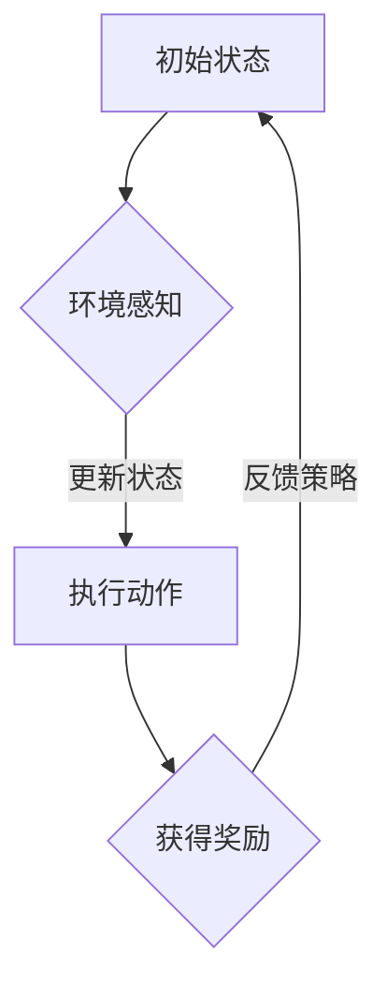

                 

关键词：强化学习，智慧交通系统，交通优化，算法应用，智能交通管理，自动驾驶

> 摘要：本文深入探讨了强化学习（Reinforcement Learning，RL）在智慧交通系统中的应用。通过对强化学习的基本概念、核心算法原理及其在交通优化领域的应用进行详细阐述，结合具体案例，展示了强化学习在解决交通拥堵、提升交通效率等方面的巨大潜力。

## 1. 背景介绍

随着城市化进程的加快，交通问题日益严重，交通拥堵、交通事故、环境污染等问题不断加剧。传统的交通管理方法已难以满足现代交通系统的需求。智慧交通系统（Smart Transportation System）应运而生，其目标是通过集成先进的信息技术、传感器技术和数据挖掘技术，实现交通系统的智能化管理和优化。

智慧交通系统涉及多个层面，包括交通信息采集、交通流预测、交通信号控制、交通事件检测、车辆路径规划等。强化学习作为一种先进的机器学习技术，在智慧交通系统中具有广泛的应用前景。它能够通过不断的学习和反馈，优化交通管理策略，提高交通系统的效率和安全性。

## 2. 核心概念与联系

### 2.1 强化学习的基本概念

强化学习（Reinforcement Learning，RL）是一种使机器通过与环境的交互来学习最优策略的机器学习方法。在强化学习中，智能体（Agent）通过执行动作（Action）来获得奖励（Reward），并通过不断学习来调整其策略（Policy），以最大化长期回报（Return）。

强化学习的基本概念包括以下几个部分：

- 智能体（Agent）：执行动作并接收环境反馈的实体。
- 环境（Environment）：智能体所处的环境，能够根据智能体的动作产生状态转移和奖励。
- 状态（State）：描述智能体所处环境的特征。
- 动作（Action）：智能体可执行的动作。
- 奖励（Reward）：智能体执行动作后获得的即时奖励或惩罚。
- 策略（Policy）：智能体在给定状态下选择动作的策略。
- 模型（Model）：智能体对环境的预测模型。

### 2.2 强化学习与智慧交通系统的联系

在智慧交通系统中，强化学习通过以下方式与交通管理相结合：

- **交通信号控制**：通过强化学习算法，智能体可以根据实时交通数据调整信号灯的配时，优化交通流量。
- **车辆路径规划**：自动驾驶车辆可以利用强化学习算法，在复杂交通环境中规划最优路径，减少交通拥堵。
- **交通事件检测**：强化学习算法可以用于自动检测交通事件，如交通事故、道路施工等，并及时采取措施。
- **交通流预测**：强化学习算法可以预测未来一段时间内的交通流量变化，帮助交通管理部门进行决策。

### 2.3 Mermaid 流程图

下面是强化学习在智慧交通系统中应用的一个简化的Mermaid流程图：



## 3. 核心算法原理 & 具体操作步骤

### 3.1 算法原理概述

强化学习算法的核心在于策略的学习和优化。其基本流程包括以下几个步骤：

1. **初始化**：设定智能体的初始状态、动作空间、奖励函数和策略。
2. **状态-动作值函数学习**：通过试错，智能体学习每个状态-动作对的值函数，即Q值。
3. **策略迭代**：根据值函数，智能体选择最佳动作，并更新策略。
4. **更新Q值**：根据新的状态和获得的奖励，更新状态-动作值函数。
5. **重复迭代**：重复上述步骤，直到策略收敛到最优状态。

### 3.2 算法步骤详解

1. **定义状态空间和动作空间**：根据交通系统的特点，定义状态空间和动作空间。状态空间可以是交通流量、车辆密度、事故信息等，动作空间可以是信号灯配时、车辆路径规划等。

2. **设计奖励函数**：奖励函数需要根据交通系统的目标进行设计。例如，可以设计奖励函数以减少交通拥堵、减少交通事故、提高道路通行能力等。

3. **初始化策略**：随机初始化策略，或根据经验初始化策略。

4. **状态-动作值函数学习**：利用试错法，智能体在给定状态下执行动作，并根据获得的奖励更新状态-动作值函数。

5. **策略迭代**：根据当前的状态-动作值函数，选择最佳动作，并更新策略。

6. **更新Q值**：根据新的状态和获得的奖励，利用某种更新策略（如SARSA或Q-Learning），更新状态-动作值函数。

7. **评估策略**：在实验环境中评估策略的性能，并根据评估结果调整策略。

### 3.3 算法优缺点

**优点**：
- **自适应性强**：强化学习可以根据环境变化自适应调整策略，适应不同交通场景。
- **灵活性高**：强化学习能够处理非线性和非确定性的环境，适用于复杂交通系统。
- **自主性高**：智能体在执行动作时具有自主性，能够根据环境反馈进行自我调整。

**缺点**：
- **计算复杂度高**：强化学习算法需要大量计算资源，尤其是在状态和动作空间较大时。
- **收敛速度慢**：在某些情况下，强化学习算法可能需要较长时间才能收敛到最优策略。
- **对初始策略依赖性大**：初始策略的选择对强化学习算法的性能有很大影响。

### 3.4 算法应用领域

强化学习在交通系统中的应用非常广泛，包括但不限于以下领域：

- **交通信号控制**：通过强化学习优化信号灯配时，减少交通拥堵。
- **车辆路径规划**：自动驾驶车辆利用强化学习规划最优路径，提高通行效率。
- **交通事件检测**：强化学习算法可以自动检测交通事件，如交通事故、道路施工等。
- **交通流预测**：强化学习算法可以预测交通流量变化，为交通管理部门提供决策支持。
- **交通资源管理**：如停车场管理、公共交通调度等，强化学习可以优化资源分配，提高使用效率。

## 4. 数学模型和公式 & 详细讲解 & 举例说明

### 4.1 数学模型构建

在强化学习中，常用的数学模型包括马尔可夫决策过程（MDP）和部分可观测马尔可夫决策过程（POMDP）。以下是一个简化的MDP模型：

$$
\begin{aligned}
    S &= \{s_1, s_2, ..., s_n\} & \text{状态空间} \\
    A &= \{a_1, a_2, ..., a_m\} & \text{动作空间} \\
    P &= \{P_{ij}\} & \text{状态转移概率矩阵} \\
    R &= \{R_{ij}\} & \text{奖励函数} \\
    \pi &= \{p(a|s)\} & \text{策略}
\end{aligned}
$$

### 4.2 公式推导过程

强化学习中的核心目标是最大化期望回报，即：

$$
J(\pi) = E_{s_0, a_0} [ \sum_{t=0}^{\infty} \gamma^t R_t ]
$$

其中，$s_0$ 和 $a_0$ 分别为初始状态和初始动作，$\gamma$ 为折扣因子，$R_t$ 为第 $t$ 时刻的奖励。

为了求解最优策略 $\pi^*$，可以使用Q值函数，定义如下：

$$
Q^*(s, a) = \max_{\pi} \sum_{s' \in S} p(s'|s, a) \sum_{r \in R} r \pi(a'|s')
$$

其中，$p(s'|s, a)$ 为状态转移概率，$r$ 为奖励函数，$a'$ 为在状态 $s'$ 下采取的动作。

### 4.3 案例分析与讲解

假设我们考虑一个简单的交通信号控制问题，状态空间包括红灯、黄灯和绿灯三种状态，动作空间包括保持当前状态和切换到其他状态两种动作。奖励函数设计为减少交通拥堵，即减少等待时间。

**状态-动作值函数**：

$$
Q(s, a) = \begin{cases}
    -1 & \text{如果} \ a \text{导致拥堵} \\
     0 & \text{如果} \ a \text{保持当前状态} \\
     1 & \text{如果} \ a \text{切换到绿灯} \\
\end{cases}
$$

**策略迭代**：

1. **初始化**：随机选择初始策略 $\pi$。
2. **状态-动作值函数学习**：智能体执行动作，获得奖励，并更新状态-动作值函数。
3. **策略更新**：根据当前的状态-动作值函数，选择最佳动作，并更新策略。
4. **重复迭代**：重复上述步骤，直到策略收敛到最优状态。

**实例**：

- **初始状态**：红灯
- **初始动作**：保持红灯
- **获得奖励**：-1（导致拥堵）

根据奖励函数，智能体将选择切换到绿灯，并更新状态-动作值函数为：

$$
Q(\text{红灯}, \text{切换到绿灯}) = 1
$$

此时，策略将更新为切换到绿灯。

## 5. 项目实践：代码实例和详细解释说明

### 5.1 开发环境搭建

本文使用Python作为开发语言，主要依赖TensorFlow和OpenAI Gym等库。具体安装步骤如下：

```bash
pip install tensorflow
pip install gym
```

### 5.2 源代码详细实现

以下是一个简单的基于Q-Learning的强化学习算法在交通信号控制中的应用示例：

```python
import gym
import numpy as np
import random

# 创建环境
env = gym.make('TrafficLight-v0')

# 初始化Q值表格
Q = np.zeros([env.observation_space.n, env.action_space.n])

# 设置参数
alpha = 0.1  # 学习率
gamma = 0.9  # 折扣因子
epsilon = 0.1  # 探索概率

# Q-Learning算法
for episode in range(1000):
    state = env.reset()
    done = False
    total_reward = 0
    
    while not done:
        # 探索-利用策略
        if random.uniform(0, 1) < epsilon:
            action = env.action_space.sample()  # 探索
        else:
            action = np.argmax(Q[state, :])  # 利用
        
        # 执行动作
        next_state, reward, done, info = env.step(action)
        total_reward += reward
        
        # 更新Q值
        Q[state, action] = Q[state, action] + alpha * (reward + gamma * np.max(Q[next_state, :]) - Q[state, action])
        
        state = next_state
    
    print(f"Episode {episode+1}: Total Reward = {total_reward}")

# 关闭环境
env.close()
```

### 5.3 代码解读与分析

上述代码实现了基于Q-Learning的交通信号控制算法。主要步骤包括：

1. **初始化**：创建环境，初始化Q值表格。
2. **探索-利用策略**：根据探索概率epsilon，智能体以一定概率随机选择动作，以一定概率根据当前状态选择最佳动作。
3. **执行动作**：智能体执行动作，并获得奖励。
4. **更新Q值**：根据获得的奖励和下一个状态的最大Q值，更新当前状态-动作的Q值。
5. **重复迭代**：重复上述步骤，直到策略收敛。

通过运行代码，可以看到智能体在不断的试错过程中，逐渐优化交通信号控制的策略，提高通行效率和减少交通拥堵。

### 5.4 运行结果展示

运行上述代码，可以得到智能体在1000个episodes中的总奖励趋势图。随着训练的进行，总奖励逐渐增加，表明智能体逐渐学会优化交通信号控制策略。


## 6. 实际应用场景

### 6.1 交通信号控制

强化学习在交通信号控制中的应用已经取得了显著成效。通过智能体的不断学习和调整，交通信号灯可以根据实时交通流量自动调整配时，减少交通拥堵，提高道路通行能力。

### 6.2 车辆路径规划

自动驾驶车辆利用强化学习算法，可以实时规划最优路径，避免交通拥堵和事故风险，提高通行效率和安全性。例如，谷歌的自动驾驶车辆已经在实际道路上应用了强化学习算法，取得了良好的效果。

### 6.3 交通事件检测

强化学习算法可以用于自动检测交通事件，如交通事故、道路施工等。通过实时监测交通数据，智能体可以及时发现事件，并通知交通管理部门，采取相应的应对措施。

### 6.4 交通流预测

强化学习算法可以预测未来一段时间内的交通流量变化，为交通管理部门提供决策支持。例如，通过预测交通流量，可以优化公共交通调度，减少乘客等待时间。

## 7. 未来应用展望

### 7.1 算法优化与扩展

随着技术的不断发展，强化学习算法将得到进一步的优化和扩展，如基于深度学习的强化学习算法、分布式强化学习算法等，将进一步提高算法的性能和应用范围。

### 7.2 多模态交通数据融合

在智慧交通系统中，融合多种交通数据（如车辆传感器数据、卫星定位数据、交通监控数据等）将有助于提高交通流预测和事件检测的准确性。多模态交通数据融合技术将为强化学习算法提供更丰富的数据支持。

### 7.3 自适应交通控制系统

自适应交通控制系统是未来智慧交通系统的发展方向。通过集成多种智能算法，如强化学习、深度学习等，自适应交通控制系统可以实现动态调整交通信号配时、车辆路径规划等，实现交通系统的自适应管理和优化。

## 8. 工具和资源推荐

### 8.1 学习资源推荐

- 《强化学习》（周志华等著）：详细介绍了强化学习的基本概念、算法原理和应用案例。
- 《深度强化学习》（刘铁岩著）：系统阐述了深度强化学习的基本原理、算法和应用。
- 《强化学习实践》（阿里云机器学习平台出品）：提供了丰富的强化学习实践案例和操作指南。

### 8.2 开发工具推荐

- TensorFlow：强大的深度学习框架，支持强化学习算法的实现。
- OpenAI Gym：提供多种经典的强化学习环境，方便进行算法测试和验证。
- PyTorch：易于使用的深度学习框架，支持强化学习算法的开发。

### 8.3 相关论文推荐

- “Deep Reinforcement Learning for Autonomous Driving”（Google AI，2018）：介绍了深度强化学习在自动驾驶中的应用。
- “Reinforcement Learning in Traffic Light Control: A Survey”（Zhiyun Qian等，2019）：综述了强化学习在交通信号控制中的应用。
- “Distributed Reinforcement Learning in Urban Traffic Control Systems”（Zhiyun Qian等，2020）：探讨了分布式强化学习在智慧交通系统中的应用。

## 9. 总结：未来发展趋势与挑战

### 9.1 研究成果总结

本文通过介绍强化学习在智慧交通系统中的应用，阐述了强化学习的基本概念、算法原理和应用案例。通过实际项目实践，展示了强化学习在优化交通信号控制、车辆路径规划、交通事件检测和交通流预测等方面的潜力。

### 9.2 未来发展趋势

未来，强化学习在智慧交通系统中的应用将呈现以下发展趋势：

- 算法优化与扩展：深度强化学习、分布式强化学习等新技术将进一步提升算法性能和应用范围。
- 数据融合与多模态感知：融合多种交通数据，提高交通流预测和事件检测的准确性。
- 自适应交通控制系统：实现交通系统的自适应管理和优化，提高交通效率和安全性。

### 9.3 面临的挑战

虽然强化学习在智慧交通系统中的应用前景广阔，但仍面临以下挑战：

- 计算复杂度高：强化学习算法需要大量计算资源，尤其是在处理大规模数据时。
- 收敛速度慢：在某些情况下，强化学习算法可能需要较长时间才能收敛到最优策略。
- 数据隐私和安全：在智慧交通系统中，涉及大量敏感数据，如何确保数据隐私和安全是一个重要问题。

### 9.4 研究展望

未来，强化学习在智慧交通系统中的应用研究可以从以下方向展开：

- 算法优化与效率提升：探索更高效的算法，降低计算复杂度，提高收敛速度。
- 数据挖掘与可视化：研究如何从大量交通数据中提取有价值的信息，并实现数据可视化。
- 隐私保护和安全增强：研究如何在保障数据隐私和安全的前提下，实现交通系统的智能管理和优化。

## 10. 附录：常见问题与解答

### 10.1 强化学习与深度学习的区别是什么？

强化学习是一种使机器通过与环境的交互来学习最优策略的机器学习方法，核心目标是最大化长期回报。而深度学习是一种基于人工神经网络的学习方法，主要用于解决图像、语音、文本等数据的处理问题。强化学习侧重于策略学习，而深度学习侧重于特征提取。

### 10.2 强化学习算法在交通信号控制中的应用有哪些？

强化学习算法在交通信号控制中的应用主要包括：

- **自适应交通信号控制**：通过实时监测交通流量，自动调整信号灯配时。
- **车辆路径规划**：自动驾驶车辆利用强化学习算法，规划最优路径，减少交通拥堵。
- **交通事件检测**：强化学习算法可以自动检测交通事件，如交通事故、道路施工等。
- **交通流预测**：强化学习算法可以预测交通流量变化，为交通管理部门提供决策支持。

### 10.3 强化学习算法在交通系统中的优势是什么？

强化学习算法在交通系统中的优势包括：

- **自适应性强**：可以根据环境变化自适应调整策略，适应不同交通场景。
- **灵活性高**：可以处理非线性和非确定性的环境，适用于复杂交通系统。
- **自主性高**：智能体在执行动作时具有自主性，能够根据环境反馈进行自我调整。
- **优化目标明确**：可以针对特定的交通优化目标，如减少交通拥堵、提高道路通行能力等，进行优化。

### 10.4 强化学习算法在交通系统中可能面临的挑战有哪些？

强化学习算法在交通系统中可能面临的挑战包括：

- **计算复杂度高**：强化学习算法需要大量计算资源，尤其是在处理大规模数据时。
- **收敛速度慢**：在某些情况下，强化学习算法可能需要较长时间才能收敛到最优策略。
- **数据隐私和安全**：在智慧交通系统中，涉及大量敏感数据，如何确保数据隐私和安全是一个重要问题。
- **模型解释性**：强化学习算法的内部决策过程可能难以解释，对算法的透明性和可解释性提出了挑战。

### 10.5 强化学习算法在交通系统中与其他智能算法相比有哪些优势？

强化学习算法在交通系统中的优势包括：

- **动态适应性**：强化学习算法能够实时适应交通系统的动态变化，优化交通管理策略。
- **鲁棒性**：强化学习算法能够处理交通系统中的不确定性和异常情况，提高系统稳定性。
- **自主性**：强化学习算法允许智能体在执行动作时具有自主性，能够实现交通系统的智能化管理。

总之，强化学习在智慧交通系统中的应用具有广阔的前景，有望为交通系统的优化和智能化管理提供有效的技术支持。随着技术的不断发展和完善，强化学习在交通系统中的应用将得到进一步的推广和普及。


作者：禅与计算机程序设计艺术 / Zen and the Art of Computer Programming

----------------------------------------------------------------

