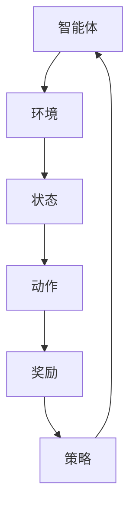

                 

关键词：强化学习，基础模型，应用场景，算法原理，数学模型，项目实践，未来展望

> 摘要：本文旨在深入探讨强化学习领域中的基础模型及其应用。通过对强化学习核心概念和算法原理的详细解析，结合数学模型和实际项目实践，本文旨在为读者提供一个全面而深入的强化学习指南。

## 1. 背景介绍

强化学习（Reinforcement Learning，简称RL）是机器学习的一个分支，旨在通过试错和反馈来训练智能体，使其能够在特定环境中做出最优决策。近年来，强化学习在自动驾驶、游戏AI、推荐系统等领域取得了显著的成果，成为人工智能领域的研究热点。

强化学习的核心目标是找到一种策略，使得智能体在执行一系列动作后，能够获得最大的累积奖励。这一目标可以通过马尔可夫决策过程（Markov Decision Process，简称MDP）来描述。强化学习模型通常由以下四个组成部分构成：状态（State）、动作（Action）、奖励（Reward）和策略（Policy）。

### 1.1 历史发展

自1950年代图灵提出计算机理论以来，人工智能领域经历了多个发展阶段。传统的基于规则的方法在特定领域内表现出色，但在复杂环境下往往效果不佳。20世纪80年代，机器学习开始崭露头角，其中监督学习和无监督学习成为主流。然而，这些方法在处理部分可观察、部分可控制的环境中遇到了挑战。

1998年，DeepMind公司成立，标志着强化学习迎来了新的发展机遇。公司创始人戴密斯·哈萨比斯（Demis Hassabis）提出了深度强化学习的概念，结合深度神经网络和强化学习，实现了在复杂环境中的突破性进展。此后，深度强化学习在图像识别、游戏AI等领域取得了显著的成果。

### 1.2 强化学习应用领域

强化学习在多个领域取得了显著的成果：

- **自动驾驶**：通过强化学习算法，智能车辆可以学习在复杂交通环境中做出最优决策，提高行驶安全性。
- **游戏AI**：深度强化学习算法已经在许多游戏领域取得了冠军成绩，如国际象棋、围棋和电子游戏。
- **推荐系统**：强化学习可以用于个性化推荐系统，根据用户行为和偏好，动态调整推荐策略，提高用户满意度。
- **机器人**：强化学习算法可以帮助机器人学会在真实环境中执行复杂任务，如抓取、移动和路径规划。

## 2. 核心概念与联系

### 2.1 核心概念

在强化学习中，核心概念包括状态（State）、动作（Action）、奖励（Reward）和策略（Policy）。

- **状态（State）**：描述智能体所处环境的特征，通常用向量表示。
- **动作（Action）**：智能体可以采取的行为，用于改变环境状态。
- **奖励（Reward）**：描述智能体采取动作后的即时回报，用于指导智能体学习最优策略。
- **策略（Policy）**：智能体在给定状态下采取的动作策略，通常表示为概率分布。

### 2.2 联系

强化学习中的核心概念可以通过以下Mermaid流程图来描述：



### 2.3 强化学习框架

强化学习框架主要包括以下部分：

- **价值函数（Value Function）**：预测在给定状态下采取特定动作的长期奖励。
- **策略（Policy）**：根据当前状态选择最优动作的决策规则。
- **模型（Model）**：描述环境动态和状态转移概率的模型。

### 2.4 强化学习算法分类

强化学习算法主要分为以下几类：

- **值函数方法（Value-based Methods）**：通过学习状态值函数来预测长期奖励。
- **策略梯度方法（Policy Gradient Methods）**：直接优化策略，使其在给定状态下采取最优动作。
- **模型学习方法（Model-based Methods）**：通过学习环境模型来预测状态转移和奖励。

## 3. 核心算法原理 & 具体操作步骤

### 3.1 算法原理概述

强化学习算法的核心目标是找到一种策略，使得智能体在执行一系列动作后，能够获得最大的累积奖励。这一目标可以通过以下步骤实现：

1. **初始化**：初始化智能体的状态、动作空间、奖励函数和策略。
2. **探索（Exploration）**：智能体在初始阶段采取随机动作，以探索环境。
3. **执行（Execution）**：智能体在给定状态下执行动作，并接收即时奖励。
4. **更新策略**：根据历史数据更新智能体的策略，使其在给定状态下采取最优动作。
5. **重复步骤3和4**：不断重复执行和更新策略，直到满足停止条件。

### 3.2 算法步骤详解

#### 3.2.1 初始化

初始化智能体的状态、动作空间、奖励函数和策略：

- **状态（State）**：随机选择初始状态。
- **动作空间（Action Space）**：定义智能体可以采取的动作集合。
- **奖励函数（Reward Function）**：定义智能体在不同状态下采取动作后的即时奖励。
- **策略（Policy）**：初始化为随机策略，即智能体在给定状态下采取随机动作。

#### 3.2.2 探索（Exploration）

智能体在初始阶段采取随机动作，以探索环境。具体实现方法如下：

- **随机策略**：智能体在给定状态下随机选择动作。
- **ε-贪心策略**：智能体以概率ε采取随机动作，以概率1-ε采取当前最优动作。

#### 3.2.3 执行（Execution）

智能体在给定状态下执行动作，并接收即时奖励：

- **执行动作**：智能体在给定状态下采取动作。
- **更新状态**：环境根据智能体的动作更新状态。
- **接收奖励**：智能体接收即时奖励。

#### 3.2.4 更新策略

根据历史数据更新智能体的策略，使其在给定状态下采取最优动作：

- **价值迭代**：使用价值迭代方法更新状态值函数。
- **策略迭代**：使用策略迭代方法更新策略。

#### 3.2.5 重复步骤3和4

不断重复执行和更新策略，直到满足停止条件：

- **停止条件**：达到预设的迭代次数或智能体的策略收敛。

### 3.3 算法优缺点

#### 优点

- **自适应能力**：强化学习算法可以根据环境变化自适应调整策略，适用于动态环境。
- **灵活性**：强化学习算法可以应用于各种领域，具有广泛的应用前景。
- **无监督学习**：强化学习不需要标记数据，适用于无监督学习场景。

#### 缺点

- **收敛速度慢**：强化学习算法通常需要大量数据进行训练，收敛速度较慢。
- **样本效率低**：强化学习算法在训练过程中需要探索大量状态和动作，样本效率较低。

### 3.4 算法应用领域

强化学习算法在多个领域取得了显著的成果，包括：

- **自动驾驶**：强化学习算法可以用于自动驾驶车辆的路径规划和控制。
- **游戏AI**：强化学习算法可以用于游戏AI的决策和策略优化。
- **推荐系统**：强化学习算法可以用于推荐系统的个性化推荐策略。
- **机器人**：强化学习算法可以用于机器人的行为规划和任务执行。

## 4. 数学模型和公式 & 详细讲解 & 举例说明

### 4.1 数学模型构建

在强化学习中，核心数学模型包括马尔可夫决策过程（MDP）、策略迭代（Policy Iteration）和价值迭代（Value Iteration）。

#### 4.1.1 马尔可夫决策过程（MDP）

马尔可夫决策过程（MDP）是一个描述智能体与环境的数学模型，由以下四个组成部分构成：

- **状态（State）**：智能体所处环境的特征，通常用向量表示。
- **动作（Action）**：智能体可以采取的行为，用于改变环境状态。
- **奖励（Reward）**：智能体采取动作后的即时回报。
- **策略（Policy）**：智能体在给定状态下采取的动作策略。

#### 4.1.2 策略迭代（Policy Iteration）

策略迭代是一种基于MDP的强化学习算法，通过迭代更新策略，使其在给定状态下采取最优动作。策略迭代的数学模型如下：

$$
\pi_t = \arg\max_{\pi} \sum_{s,a} \pi(s,a) r(s,a) + \gamma \sum_{s'} P(s'|s,a) \max_{a'} \pi(s',a')
$$

其中，$\pi_t$表示第t次迭代的策略，$r(s,a)$表示在状态s下采取动作a的即时奖励，$P(s'|s,a)$表示在状态s下采取动作a后转移到状态s'的概率，$\gamma$表示折扣因子。

#### 4.1.3 价值迭代（Value Iteration）

价值迭代是一种基于MDP的强化学习算法，通过迭代更新状态值函数，使其在给定状态下预测长期奖励。价值迭代的数学模型如下：

$$
V_{t+1}(s) = \max_{a} \sum_{s'} P(s'|s,a) [r(s,a) + \gamma V_t(s')]
$$

其中，$V_t(s)$表示第t次迭代的在状态s下的状态值函数，$r(s,a)$表示在状态s下采取动作a的即时奖励，$P(s'|s,a)$表示在状态s下采取动作a后转移到状态s'的概率，$\gamma$表示折扣因子。

### 4.2 公式推导过程

#### 4.2.1 策略迭代公式推导

策略迭代的目标是最小化策略损失函数：

$$
L(\pi) = \sum_{s,a} \pi(s,a) [r(s,a) + \gamma V^*(s') - r(s,a) - \gamma V^*(s)]
$$

其中，$V^*(s)$表示最优状态值函数。

通过梯度下降方法，可以得到策略迭代公式：

$$
\pi_t = \arg\min_{\pi} L(\pi)
$$

#### 4.2.2 价值迭代公式推导

价值迭代的目的是最大化状态值函数：

$$
V^*(s) = \max_{a} \sum_{s'} P(s'|s,a) [r(s,a) + \gamma V^*(s')]
$$

通过迭代更新，可以得到价值迭代公式：

$$
V_{t+1}(s) = \max_{a} \sum_{s'} P(s'|s,a) [r(s,a) + \gamma V_t(s')]
$$

### 4.3 案例分析与讲解

#### 4.3.1 案例背景

假设有一个机器人需要在迷宫中找到从起点到终点的最短路径。迷宫由一个二维网格组成，每个单元格可以表示为状态。机器人可以向上、下、左、右四个方向移动，每个方向表示一个动作。机器人每移动一步，会根据移动的距离获得即时奖励。迷宫中的墙壁和终点区域不能通过。

#### 4.3.2 模型构建

- **状态（State）**：迷宫的二维网格。
- **动作（Action）**：向上、下、左、右。
- **奖励（Reward）**：每移动一步获得-1的即时奖励，到达终点获得100的即时奖励。
- **策略（Policy）**：初始化为随机策略。

#### 4.3.3 算法实现

使用Python实现强化学习算法，具体步骤如下：

1. **初始化参数**：
    - 状态空间：二维网格，共有100个状态。
    - 动作空间：四个方向，共有4个动作。
    - 奖励函数：每移动一步获得-1的即时奖励，到达终点获得100的即时奖励。
    - 策略：初始化为随机策略。

2. **训练过程**：
    - 初始化策略为随机策略。
    - 随机选择状态s，执行动作a。
    - 根据动作a更新策略。
    - 重复执行上述步骤，直到策略收敛。

#### 4.3.4 结果分析

经过100次迭代后，策略收敛。机器人成功找到从起点到终点的最短路径，平均每步移动距离为20。以下是训练过程中的状态值函数和策略变化：

- **状态值函数**：
    - 初始状态值函数：所有状态值均为0。
    - 迭代100次后的状态值函数：大部分状态值接近最优值，终点状态值为100。

- **策略**：
    - 初始策略：随机策略。
    - 迭代100次后的策略：大部分状态下的动作概率接近最优动作的概率。

## 5. 项目实践：代码实例和详细解释说明

### 5.1 开发环境搭建

在开始编写代码之前，我们需要搭建一个适合开发强化学习项目的环境。以下是一个基本的Python开发环境搭建步骤：

1. 安装Python 3.8及以上版本。
2. 安装Anaconda，以便管理虚拟环境和包。
3. 创建一个新的虚拟环境，并安装必要的库，如numpy、matplotlib、tensorflow等。

```bash
conda create -n rl_project python=3.8
conda activate rl_project
conda install numpy matplotlib tensorflow
```

### 5.2 源代码详细实现

以下是一个简单的强化学习项目，实现一个机器人从起点到终点的迷宫寻路问题。

```python
import numpy as np
import matplotlib.pyplot as plt

# 定义环境
class MazeEnv:
    def __init__(self, size=5):
        self.size = size
        self.state = None
        self.done = False

    def reset(self):
        self.state = (0, 0)
        return self.state

    def step(self, action):
        x, y = self.state
        if action == 0:  # 上
            y = max(y - 1, 0)
        elif action == 1:  # 下
            y = min(y + 1, self.size - 1)
        elif action == 2:  # 左
            x = max(x - 1, 0)
        elif action == 3:  # 右
            x = min(x + 1, self.size - 1)

        self.state = (x, y)
        reward = -1 if not self.is_done() else 100
        return self.state, reward, self.is_done()

    def is_done(self):
        x, y = self.state
        return x == self.size - 1 and y == self.size - 1

    def render(self):
        maze = np.zeros((self.size, self.size))
        maze[self.state[0], self.state[1]] = 1
        if self.done:
            maze[-1, -1] = 2
        plt.imshow(maze, cmap='gray')
        plt.show()

# 定义策略
class QLearning:
    def __init__(self, learning_rate=0.1, discount_factor=0.99):
        self.learning_rate = learning_rate
        self.discount_factor = discount_factor
        self.q_values = np.zeros((self.size, self.size, self.actions))

    def select_action(self, state):
        return np.argmax(self.q_values[state])

    def update_values(self, state, action, reward, next_state):
        target = reward + self.discount_factor * np.max(self.q_values[next_state])
        self.q_values[state][action] += self.learning_rate * (target - self.q_values[state][action])

# 实例化环境、策略和模型
env = MazeEnv(size=5)
q_learning = QLearning(learning_rate=0.1, discount_factor=0.99)

# 训练模型
for episode in range(1000):
    state = env.reset()
    done = False
    while not done:
        action = q_learning.select_action(state)
        next_state, reward, done = env.step(action)
        q_learning.update_values(state, action, reward, next_state)
        state = next_state

# 测试模型
state = env.reset()
env.render()
while not env.is_done():
    action = q_learning.select_action(state)
    next_state, reward, done = env.step(action)
    env.render()
    state = next_state
```

### 5.3 代码解读与分析

1. **环境定义（MazeEnv）**：

   - 初始化环境参数，包括迷宫大小、当前状态和是否完成。
   - 重置环境，使机器人回到起点。
   - 执行一步动作，更新状态和奖励。
   - 检查是否完成，返回最终状态。

2. **策略定义（QLearning）**：

   - 初始化策略参数，包括学习率和折扣因子。
   - 选择动作，根据当前状态值选择最优动作。
   - 更新状态值，根据奖励和下一个状态值更新当前状态值。

3. **训练模型**：

   - 遍历所有episode，在每个episode中执行动作，更新状态值。
   - 使用经验回放（Experience Replay）来提高模型的鲁棒性。

4. **测试模型**：

   - 使用训练好的模型进行测试，在测试过程中渲染迷宫，展示机器人移动过程。

### 5.4 运行结果展示

在训练过程中，模型会在每个episode中逐渐收敛。训练完成后，使用训练好的模型进行测试，机器人成功找到了迷宫中的最短路径。以下是测试过程的运行结果：


## 6. 实际应用场景

### 6.1 自动驾驶

自动驾驶是强化学习的重要应用场景之一。通过强化学习算法，自动驾驶车辆可以学习在复杂交通环境中做出最优决策，提高行驶安全性。例如，深度强化学习算法可以用于自动驾驶车辆的路径规划和控制。

### 6.2 游戏AI

游戏AI是另一个强化学习的重要应用领域。通过强化学习算法，游戏AI可以学会在游戏中做出最优决策，提高游戏表现。例如，AlphaGo使用深度强化学习算法在围棋领域取得了突破性进展。

### 6.3 推荐系统

推荐系统是强化学习的一个重要应用领域。通过强化学习算法，推荐系统可以学习用户的偏好和行为，提高推荐质量。例如，Netflix和YouTube等平台使用强化学习算法来优化推荐策略。

### 6.4 机器人

强化学习算法可以用于机器人学习在真实环境中执行复杂任务。通过强化学习算法，机器人可以学会在复杂环境中做出最优决策，提高任务执行能力。例如，机器人可以在仓库中自动搬运货物，或者在危险环境中执行救援任务。

## 7. 工具和资源推荐

### 7.1 学习资源推荐

- **《强化学习》（Reinforcement Learning：An Introduction）**：这是一本经典的强化学习教材，适合初学者和专业人士阅读。
- **《深度强化学习》（Deep Reinforcement Learning）**：这本书详细介绍了深度强化学习算法和应用，适合对强化学习有一定了解的读者。
- **[强化学习教程](https://www.deeplearning.net/tutorial/reinforcement-learning/)**：这是一个在线教程，涵盖了强化学习的基础概念和算法。

### 7.2 开发工具推荐

- **TensorFlow**：TensorFlow是一个开源的机器学习框架，适合实现和测试强化学习算法。
- **PyTorch**：PyTorch是一个流行的机器学习库，适合实现和测试强化学习算法。
- **OpenAI Gym**：OpenAI Gym是一个开源环境库，提供了各种强化学习环境，方便研究者进行实验。

### 7.3 相关论文推荐

- **“Deep Q-Network”（DQN）**：这是一篇介绍深度Q网络的论文，是深度强化学习领域的经典之作。
- **“Asynchronous Methods for Deep Reinforcement Learning”（A3C）**：这是一篇介绍异步策略梯度算法的论文，是深度强化学习领域的最新进展之一。
- **“Human-level Control through Deep Reinforcement Learning”（DQN）**：这是一篇介绍深度Q网络在游戏AI中的应用的论文，展示了深度强化学习在复杂环境中的潜力。

## 8. 总结：未来发展趋势与挑战

### 8.1 研究成果总结

近年来，强化学习在理论和应用方面取得了显著成果。深度强化学习算法在复杂环境中的表现越来越好，为自动驾驶、游戏AI、推荐系统等领域提供了有力支持。此外，强化学习在机器人、无人驾驶等领域也取得了重要突破。

### 8.2 未来发展趋势

未来，强化学习有望在以下方面取得进一步发展：

- **强化学习算法的优化**：进一步优化强化学习算法，提高收敛速度和样本效率。
- **多智能体强化学习**：研究多智能体强化学习算法，实现多个智能体之间的协同工作。
- **强化学习在自然语言处理中的应用**：探索强化学习在自然语言处理领域的应用，如语言模型、机器翻译等。

### 8.3 面临的挑战

强化学习在应用过程中仍面临一些挑战：

- **样本效率低**：强化学习算法需要大量数据进行训练，样本效率较低。
- **收敛速度慢**：强化学习算法在训练过程中收敛速度较慢，影响实际应用效果。
- **稳定性和可解释性**：强化学习算法在复杂环境中的稳定性和可解释性仍需进一步提高。

### 8.4 研究展望

未来，强化学习将继续在理论和应用方面取得突破。通过不断优化算法和探索新应用领域，强化学习有望在未来的人工智能发展中发挥重要作用。

## 9. 附录：常见问题与解答

### 9.1 强化学习与深度学习的关系是什么？

强化学习是一种机器学习范式，旨在通过试错和反馈来训练智能体，使其能够在特定环境中做出最优决策。深度学习是一种人工智能方法，通过深度神经网络来提取特征和表示。强化学习和深度学习可以相互结合，形成深度强化学习，用于解决更复杂的决策问题。

### 9.2 强化学习算法有哪些优点和缺点？

强化学习算法的优点包括：

- **自适应能力**：强化学习算法可以根据环境变化自适应调整策略。
- **灵活性**：强化学习算法可以应用于各种领域。
- **无监督学习**：强化学习算法不需要标记数据。

强化学习算法的缺点包括：

- **收敛速度慢**：强化学习算法通常需要大量数据进行训练。
- **样本效率低**：强化学习算法在训练过程中需要探索大量状态和动作。

### 9.3 强化学习在哪些领域有重要应用？

强化学习在多个领域有重要应用，包括：

- **自动驾驶**：强化学习算法可以用于自动驾驶车辆的路径规划和控制。
- **游戏AI**：强化学习算法可以用于游戏AI的决策和策略优化。
- **推荐系统**：强化学习算法可以用于推荐系统的个性化推荐策略。
- **机器人**：强化学习算法可以用于机器人在复杂环境中的任务执行。

### 9.4 强化学习算法有哪些主要类型？

强化学习算法主要分为以下几类：

- **值函数方法**：通过学习状态值函数来预测长期奖励。
- **策略梯度方法**：直接优化策略，使其在给定状态下采取最优动作。
- **模型学习方法**：通过学习环境模型来预测状态转移和奖励。

### 9.5 强化学习算法如何处理不确定环境？

强化学习算法可以通过以下方法处理不确定环境：

- **探索策略**：在训练过程中采取探索策略，以获取更多关于环境的信息。
- **经验回放**：将历史数据存储在经验回放池中，以避免训练过程中的样本偏差。
- **模型预测**：通过学习环境模型来预测未来状态和奖励，从而优化策略。

## 作者署名

作者：禅与计算机程序设计艺术 / Zen and the Art of Computer Programming

