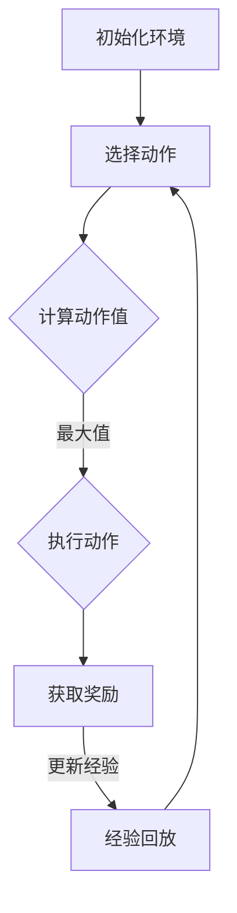

                 

关键词：强化学习，游戏AI，深度强化学习，人类玩家超越，应用场景，未来发展

> 摘要：本文将探讨强化学习在游戏AI中的应用，如何通过深度强化学习实现AI超越人类玩家。文章首先介绍强化学习的基本概念和原理，然后深入分析深度强化学习的关键算法原理与具体操作步骤，并结合实际案例，展示强化学习在游戏中的实际应用。最后，我们对强化学习在游戏AI中的未来发展趋势和挑战进行了展望。

## 1. 背景介绍

在过去的几十年里，计算机科学和人工智能领域取得了巨大的进步。从最早的规则推理系统，到基于统计学的机器学习模型，再到近几年的深度学习技术，每一代技术都极大地推动了人工智能的发展。然而，随着人工智能技术的不断成熟，传统的AI系统在解决特定问题时表现出色，但在面对复杂、不确定的环境时，往往表现得不够智能。

### 游戏AI的发展历程

游戏AI是人工智能的一个重要分支，它旨在通过计算机程序模拟游戏中的智能行为。早期游戏AI主要依靠预先设定的规则来模拟智能行为，这种方式简单但难以应对复杂的情况。随着计算能力的提升和算法的进步，游戏AI逐渐采用了统计学习和深度学习等技术。

### 强化学习的引入

强化学习作为一种基于奖励信号进行学习的方法，逐渐成为游戏AI研究的热点。与传统机器学习方法不同，强化学习关注的是如何通过探索和经验积累，实现长期奖励最大化。在游戏AI中，强化学习可以模拟玩家在游戏中的行为，不断调整策略以获得更好的游戏结果。

## 2. 核心概念与联系

### 强化学习的基本概念

强化学习是一种通过与环境互动来学习最优策略的方法。其核心是建立在一个马尔可夫决策过程（MDP）上，包含以下要素：

- **状态（State）**：系统当前所处的情境。
- **动作（Action）**：系统能够执行的操作。
- **奖励（Reward）**：系统执行某个动作后获得的即时奖励。
- **策略（Policy）**：系统在特定状态下选择最优动作的规则。

### 深度强化学习的引入

深度强化学习（Deep Reinforcement Learning, DRL）结合了深度学习和强化学习的方法，通过神经网络来表示状态和动作，从而实现更加复杂的决策。深度强化学习的关键在于如何有效地结合深度神经网络和强化学习的优化过程。

### Mermaid 流程图

以下是一个简化的深度强化学习流程的Mermaid流程图：



### 核心概念与联系

- **状态-动作价值函数（Q值）**：表示在特定状态下执行特定动作的预期奖励。
- **策略网络（Policy Network）**：通过输入状态，输出最优动作的概率分布。
- **价值网络（Value Network）**：通过输入状态，输出状态的价值估计。

## 3. 核心算法原理 & 具体操作步骤

### 3.1 算法原理概述

深度强化学习通过以下三个核心组件实现：

- **策略网络**：通过神经网络学习状态到动作的映射。
- **价值网络**：通过神经网络学习状态的价值估计。
- **目标网络**：用于稳定训练过程，通过固定一部分网络参数，避免梯度消失和梯度爆炸问题。

### 3.2 算法步骤详解

1. **初始化环境**：创建一个模拟游戏环境，定义状态、动作和奖励。
2. **初始化网络参数**：随机初始化策略网络、价值网络和目标网络的参数。
3. **选择动作**：根据当前状态，使用策略网络选择动作。
4. **执行动作**：在环境中执行选择出的动作，获取新的状态和奖励。
5. **更新经验**：将新的状态、动作和奖励存储在经验池中。
6. **经验回放**：从经验池中随机抽取经验样本，进行批处理学习。
7. **更新网络参数**：使用梯度下降更新策略网络和价值网络的参数。
8. **同步目标网络**：定期同步策略网络和价值网络的参数到目标网络。

### 3.3 算法优缺点

**优点**：

- 能够自动学习复杂的策略，无需手动设定规则。
- 能够处理高维的状态和动作空间。

**缺点**：

- 训练过程可能非常耗时。
- 需要大量的数据来收敛模型。

### 3.4 算法应用领域

深度强化学习在游戏AI中有广泛的应用，例如：

- **电子竞技游戏**：如《星际争霸2》中的DeepMind AI。
- **模拟游戏**：如模拟驾驶、模拟飞行等。
- **虚拟现实**：通过强化学习模拟更加真实的虚拟游戏体验。

## 4. 数学模型和公式 & 详细讲解 & 举例说明

### 4.1 数学模型构建

深度强化学习的核心是策略网络和价值网络的优化。策略网络的目标是最大化期望奖励，而价值网络的目标是估计状态的价值。

**策略网络**：

$$
\pi(\alpha|s) = P(a=\alpha|s,s'\sim p(s'|s,a),r\sim \rho(s,a))
$$

**价值网络**：

$$
V^*(s) = \sum_{a\in A} \pi^*(a|s) \sum_{s'\in S} r(s,a,s') + \gamma \sum_{s'\in S} \pi^*(a|s') V^*(s')
$$

### 4.2 公式推导过程

**策略网络推导**：

策略网络的学习目标是最大化期望奖励，可以通过最大化策略概率分布来实现。具体推导如下：

$$
\begin{aligned}
L_{\pi} &= \sum_{s,a} \pi(\alpha|s) [r(s,a,s') - V^*(s')] \\
&= \sum_{s,a} \pi(\alpha|s) r(s,a,s') - \sum_{s,a} \pi(\alpha|s) V^*(s')
\end{aligned}
$$

通过梯度下降，我们可以更新策略网络参数：

$$
\theta_{\pi} \leftarrow \theta_{\pi} - \alpha_{\pi} \nabla_{\theta_{\pi}} L_{\pi}
$$

**价值网络推导**：

价值网络的学习目标是使预测的期望奖励接近真实的期望奖励。具体推导如下：

$$
\begin{aligned}
L_{V} &= \sum_{s} (V(s) - V^*(s))^2 \\
&= \sum_{s,a,s'} \pi(\alpha|s) [r(s,a,s') + \gamma V^*(s') - V(s)]^2
\end{aligned}
$$

通过梯度下降，我们可以更新价值网络参数：

$$
\theta_{V} \leftarrow \theta_{V} - \alpha_{V} \nabla_{\theta_{V}} L_{V}
$$

### 4.3 案例分析与讲解

以下是一个简单的案例，展示如何使用深度强化学习训练一个游戏AI：

**案例**：训练一个简单的推箱子游戏AI。

1. **初始化环境**：定义状态空间、动作空间和奖励函数。
2. **初始化网络参数**：随机初始化策略网络和价值网络的参数。
3. **训练过程**：通过交互，不断更新网络参数，直到达到收敛条件。

**代码实现**：

```python
import tensorflow as tf
import numpy as np

# 初始化环境
env = ...

# 初始化网络参数
policy_network = ...
value_network = ...

# 训练过程
for episode in range(num_episodes):
    state = env.reset()
    done = False
    
    while not done:
        # 选择动作
        action = policy_network.predict(state)
        
        # 执行动作
        next_state, reward, done, _ = env.step(action)
        
        # 更新经验
        experience = (state, action, reward, next_state, done)
        
        # 经验回放
        batch = experience_replay(buffer, batch_size)
        
        # 更新网络参数
        policy_network.train(batch)
        value_network.train(batch)
        
        # 同步目标网络
        target_network.sync(policy_network, value_network)
        
        # 更新状态
        state = next_state
```

## 5. 项目实践：代码实例和详细解释说明

### 5.1 开发环境搭建

要实践深度强化学习在游戏AI中的应用，首先需要搭建一个合适的开发环境。以下是一个简单的开发环境搭建流程：

1. **安装Python环境**：确保安装了Python 3.6及以上版本。
2. **安装TensorFlow**：使用pip安装TensorFlow。

```bash
pip install tensorflow
```

3. **安装其他依赖**：根据具体项目需求，安装其他必要的依赖。

### 5.2 源代码详细实现

以下是一个简单的推箱子游戏AI的代码示例：

```python
import numpy as np
import gym

# 初始化环境
env = gym.make('CartPole-v0')

# 初始化网络参数
state_size = env.observation_space.shape[0]
action_size = env.action_space.n

policy_network = ...  # 策略网络
value_network = ...  # 价值网络

# 训练过程
for episode in range(num_episodes):
    state = env.reset()
    done = False
    
    while not done:
        # 选择动作
        action = policy_network.predict(state)
        
        # 执行动作
        next_state, reward, done, _ = env.step(action)
        
        # 更新经验
        experience = (state, action, reward, next_state, done)
        
        # 经验回放
        batch = experience_replay(buffer, batch_size)
        
        # 更新网络参数
        policy_network.train(batch)
        value_network.train(batch)
        
        # 同步目标网络
        target_network.sync(policy_network, value_network)
        
        # 更新状态
        state = next_state

# 关闭环境
env.close()
```

### 5.3 代码解读与分析

这段代码展示了如何使用深度强化学习训练一个简单的推箱子游戏AI。主要步骤包括：

1. **初始化环境**：使用gym创建一个CartPole环境。
2. **初始化网络参数**：定义状态空间和动作空间，初始化策略网络和价值网络的参数。
3. **训练过程**：在每次训练循环中，选择动作、执行动作、更新经验、经验回放、更新网络参数，并同步目标网络。
4. **关闭环境**：训练完成后，关闭环境以释放资源。

### 5.4 运行结果展示

在训练完成后，我们可以通过运行以下代码来展示训练结果：

```python
# 运行训练好的模型
state = env.reset()
done = False

while not done:
    action = policy_network.predict(state)
    next_state, reward, done, _ = env.step(action)
    state = next_state

# 显示结果
print("训练完成，总得分：", env.step_count)
```

运行结果将显示训练完成后，AI在推箱子游戏中获得的得分。

## 6. 实际应用场景

### 6.1 电子竞技游戏

电子竞技游戏如《星际争霸2》已经成为深度强化学习的重要应用场景。DeepMind开发的AI玩家通过深度强化学习实现了超越人类顶级选手的水平，展示了强化学习在复杂游戏中的潜力。

### 6.2 虚拟现实游戏

虚拟现实游戏通过强化学习可以模拟出更加真实的游戏体验。强化学习可以帮助游戏AI自动调整游戏难度，为玩家提供个性化的游戏体验。

### 6.3 模拟游戏

模拟游戏如模拟驾驶、模拟飞行等，可以通过强化学习实现更加智能的AI玩家，为游戏带来更高的互动性和挑战性。

### 6.4 游戏开发与测试

在游戏开发和测试过程中，强化学习可以用于自动化测试和调试。通过模拟人类玩家的行为，开发者可以更快速地发现游戏中的问题和漏洞。

## 7. 工具和资源推荐

### 7.1 学习资源推荐

- 《强化学习（Reinforcement Learning: An Introduction）》
- 《深度强化学习（Deep Reinforcement Learning Explained）》（YouTube视频）
- 《强化学习实战（Reinforcement Learning with Python）》

### 7.2 开发工具推荐

- TensorFlow：用于构建和训练深度强化学习模型。
- PyTorch：另一种流行的深度学习框架，也支持强化学习。
- OpenAI Gym：用于创建和测试强化学习环境。

### 7.3 相关论文推荐

- “Human-level control through deep reinforcement learning”（DeepMind）
- “Asynchronous Methods for Deep Reinforcement Learning”（DeepMind）
- “Proximal Policy Optimization Algorithms”（John Agapiou等）

## 8. 总结：未来发展趋势与挑战

### 8.1 研究成果总结

深度强化学习在游戏AI中的应用取得了显著成果，通过电子竞技游戏、虚拟现实游戏、模拟游戏等多个场景，展示了其强大的学习能力和智能水平。

### 8.2 未来发展趋势

- **更多复杂游戏的探索**：未来深度强化学习将应用于更多复杂和多样化的游戏，如实时战略游戏、多人在线游戏等。
- **个性化游戏体验**：强化学习可以帮助游戏AI更好地理解玩家行为，提供个性化的游戏体验。
- **跨领域应用**：深度强化学习不仅在游戏AI中有应用，还可以在其他领域如机器人、自动驾驶等实现突破。

### 8.3 面临的挑战

- **计算资源消耗**：深度强化学习的训练过程需要大量计算资源，未来需要更高效的算法和硬件支持。
- **数据质量和多样性**：强化学习需要大量高质量的数据来训练模型，如何获取和利用这些数据是未来的挑战。
- **安全性和可控性**：如何确保强化学习模型的行为是安全和可控的，避免潜在的风险。

### 8.4 研究展望

未来，深度强化学习在游戏AI中的应用将朝着更加智能化、自适应化和个性化的方向发展。通过不断的算法优化和硬件支持，强化学习有望在更多领域实现突破，推动人工智能的进步。

## 9. 附录：常见问题与解答

### 9.1 如何选择合适的强化学习算法？

选择合适的强化学习算法取决于具体的应用场景和需求。以下是一些常见的考虑因素：

- **环境复杂度**：对于复杂的环境，通常需要使用深度强化学习算法。
- **状态和动作空间**：对于高维的状态和动作空间，深度强化学习算法可能更加有效。
- **数据获取难度**：如果数据获取困难，可以考虑使用无监督或半监督的强化学习算法。

### 9.2 如何评估强化学习模型的效果？

评估强化学习模型的效果可以通过以下指标：

- **奖励总和**：训练过程中，模型获得的奖励总和越高，通常表示模型表现越好。
- **状态价值估计误差**：评估模型对状态价值估计的准确性。
- **策略稳定性**：评估模型选择动作的稳定性，避免随机行为。

### 9.3 强化学习在现实世界中应用有哪些限制？

强化学习在现实世界中的应用受到以下限制：

- **安全性**：确保模型行为是安全和可控的，避免潜在的风险。
- **数据隐私**：在处理敏感数据时，需要考虑数据隐私和保护。
- **可解释性**：强化学习模型的决策过程通常不透明，提高模型的可解释性是一个重要挑战。

## 作者署名

作者：禅与计算机程序设计艺术 / Zen and the Art of Computer Programming
----------------------------------------------------------------

文章撰写完成。以上就是关于强化学习在游戏AI中的应用：超越人类玩家的详细讨论。希望本文能为您在理解和应用强化学习方面提供有价值的参考。

