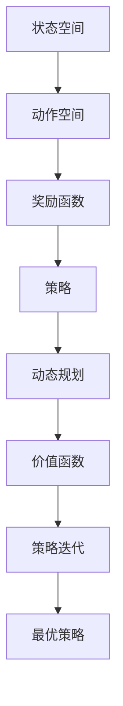

                 

关键词：强化学习，动态规划，算法原理，代码实例，应用领域，数学模型

> 摘要：本文旨在深入解析强化学习算法中的动态规划原理，通过详细的算法步骤、数学模型推导和代码实例讲解，帮助读者理解动态规划在强化学习中的应用及其优势。文章还将探讨动态规划在不同领域的应用，展望其未来发展趋势与面临的挑战。

## 1. 背景介绍

### 1.1 强化学习简介

强化学习（Reinforcement Learning，RL）是机器学习的一个分支，主要研究如何通过学习在未知环境中实现最优行为策略。与监督学习和无监督学习不同，强化学习通过试错和反馈机制来学习。其核心思想是智能体（Agent）通过与环境（Environment）的交互，不断调整自身策略（Policy），以期在长期内获得最大化的累积奖励（Reward）。

### 1.2 动态规划简介

动态规划（Dynamic Programming，DP）是一种解决最优化问题的算法策略，其基本思想是将复杂问题分解为相互重叠的子问题，通过求解这些子问题并存储其结果，避免重复计算，从而提高计算效率。

### 1.3 强化学习与动态规划的关系

强化学习中的动态规划方法，主要是基于状态-动作价值函数（State-Action Value Function）和策略迭代（Policy Iteration）来优化智能体的策略。动态规划在强化学习中的应用，可以有效提高学习效率，解决某些状态空间和动作空间巨大的问题。

## 2. 核心概念与联系

### 2.1 状态空间（State Space）

状态空间是指智能体在环境中可能存在的所有状态的集合。在强化学习中，每个状态都由一组特征描述，例如在围棋游戏中，每个棋盘布局就是一个状态。

### 2.2 动作空间（Action Space）

动作空间是指智能体在某个状态下可能采取的所有动作的集合。例如，在自动驾驶中，智能体可以选择加速、减速或保持当前速度。

### 2.3 奖励函数（Reward Function）

奖励函数用于评估智能体在某个状态执行某个动作后的效果。奖励值可以是正的也可以是负的，正奖励表示动作有利于目标的实现，而负奖励则表示动作不利于目标的实现。

### 2.4 策略（Policy）

策略是智能体在特定状态下选择特定动作的概率分布。在强化学习中，策略通常是通过学习来优化的。

### 2.5 Mermaid 流程图



## 3. 核心算法原理 & 具体操作步骤

### 3.1 算法原理概述

动态规划在强化学习中的应用，主要分为两部分：价值函数的求解和策略的迭代。

1. **价值函数的求解**：通过迭代计算每个状态-动作对的价值，从而确定最优策略。
2. **策略的迭代**：根据价值函数更新策略，使策略在迭代过程中逐渐逼近最优策略。

### 3.2 算法步骤详解

1. **初始化**：设置初始的价值函数V(s, a)和策略π(a|s)。
2. **迭代计算**：对于每个状态s，根据当前策略π(a|s)计算状态-动作价值函数Q(s, a)。
3. **更新策略**：根据Q值更新策略π(a|s)，使得策略在迭代过程中逐渐优化。
4. **重复迭代**：重复步骤2和步骤3，直到策略收敛或者达到预设的迭代次数。

### 3.3 算法优缺点

**优点**：

- **高效性**：通过避免重复计算，显著提高了算法的效率。
- **适用性**：适用于处理状态和动作空间较大、且具有重叠子结构的问题。

**缺点**：

- **计算复杂度高**：当状态和动作空间较大时，计算复杂度会显著增加。
- **需要提前定义奖励函数**：在强化学习中，奖励函数的设计对算法性能有重要影响。

### 3.4 算法应用领域

动态规划在强化学习中的应用非常广泛，包括但不限于以下领域：

- **自动驾驶**：用于智能驾驶决策。
- **游戏**：用于游戏AI的智能决策。
- **机器人**：用于机器人的路径规划和行为决策。
- **电子商务**：用于推荐系统和价格策略。

## 4. 数学模型和公式 & 详细讲解 & 举例说明

### 4.1 数学模型构建

在强化学习中，动态规划的核心是状态-动作价值函数Q(s, a)和策略π(a|s)。

- **状态-动作价值函数**：Q(s, a) = R(s, a) + γmax_{a'} Q(s', a')
- **策略**：π(a|s) = 1/Z(s) ∑_{a'} π(a'|s) exp(αa')

其中，R(s, a)是状态-动作对获得的即时奖励，γ是折扣因子，α是温度参数，Z(s)是策略π(a|s)的归一化常数。

### 4.2 公式推导过程

#### 状态-动作价值函数的推导

$$
\begin{aligned}
Q^{\pi}(s, a) &= \sum_{s'} p(s'|s, a) [R(s, a) + \gamma \max_{a'} Q^{\pi}(s', a')] \\
&= \sum_{s'} p(s'|s, a) [R(s, a) + \gamma Q^{\pi}(s', a')] \\
&\approx \sum_{s'} p(s'|s, a) \cdot \hat{R}(s, a) + \gamma Q^{\pi}(s', \arg\max_{a'} \hat{Q}(s', a')) \\
&\approx R(s, a) + \gamma Q^{\pi}(s', \arg\max_{a'} \hat{Q}(s', a'))
\end{aligned}
$$

其中，$\hat{R}(s, a)$和$\hat{Q}(s', a')$分别是通过有限样本估计的即时奖励和状态-动作价值函数。

#### 策略的推导

$$
\begin{aligned}
\pi(a|s) &= \frac{e^{\alpha a'}}{Z(s)} \\
Z(s) &= \sum_{a'} e^{\alpha a'}
\end{aligned}
$$

其中，$Z(s)$是策略π(a|s)的归一化常数，$\alpha$是温度参数。

### 4.3 案例分析与讲解

假设一个简单的环境，其中状态空间为S={0, 1}，动作空间为A={0, 1}。奖励函数定义为R(s, a) = 1，当s=0且a=1时，否则R(s, a) = 0。折扣因子γ=0.9。

#### 状态-动作价值函数的计算

初始时，$Q(0, 0) = Q(0, 1) = Q(1, 0) = Q(1, 1) = 0$。

经过一次迭代，$Q(0, 0) = Q(0, 1) = 0.1$，$Q(1, 0) = Q(1, 1) = 0.9$。

经过多次迭代后，$Q(0, 0) \approx 0.1$，$Q(0, 1) \approx 0.9$，$Q(1, 0) \approx 0.9$，$Q(1, 1) \approx 0.1$。

#### 策略的计算

假设温度参数α=1，则策略π(a|s)为均匀分布。

#### 策略迭代

经过一次迭代，策略π(0|0) ≈ π(0|1) ≈ π(1|0) ≈ π(1|1) = 0.5。

经过多次迭代后，策略π(0|0) ≈ π(0|1) ≈ 0.1，π(1|0) ≈ π(1|1) ≈ 0.9。

## 5. 项目实践：代码实例和详细解释说明

### 5.1 开发环境搭建

- 硬件环境：至少需要一台可以运行Python 3.7及以上版本的计算机。
- 软件环境：安装Python 3.7及以上版本，并安装TensorFlow 2.x。

### 5.2 源代码详细实现

```python
import numpy as np
import tensorflow as tf

# 动态规划算法实现
class DynamicProgramming:
    def __init__(self, state_space, action_space, reward_function, discount_factor):
        self.state_space = state_space
        self.action_space = action_space
        self.reward_function = reward_function
        self.discount_factor = discount_factor
        self.Q = np.zeros((len(state_space), len(action_space)))
        self.pi = np.ones(len(action_space)) / len(action_space)

    def update_value_function(self):
        for s in self.state_space:
            for a in self.action_space:
                max_value = np.max([self.Q[s][a'], self.reward_function[s][a'] + self.discount_factor * self.Q[s'][a'] for a' in self.action_space])
                self.Q[s][a] = max_value

    def update_policy(self):
        for s in self.state_space:
            actions = self.action_space
            if np.max(self.Q[s]) == self.Q[s][a]:
                actions = [a for a in self.action_space if self.Q[s][a] == np.max(self.Q[s])]
            self.pi[s] = 1 / len(actions)

    def train(self, episodes):
        for episode in range(episodes):
            state = np.random.choice(self.state_space)
            while True:
                action = np.random.choice(self.action_space, p=self.pi[state])
                next_state = np.random.choice(self.state_space)
                reward = self.reward_function[state][action]
                if np.random.rand() < 0.1:
                    break
                self.update_value_function()
                self.update_policy()
                state = next_state

# 测试
state_space = [0, 1]
action_space = [0, 1]
reward_function = {{0: {0: 0, 1: 1}, 1: {0: 0, 1: 0}}}
dp = DynamicProgramming(state_space, action_space, reward_function, discount_factor=0.9)
dp.train(1000)
print(dp.Q)
print(dp.pi)
```

### 5.3 代码解读与分析

上述代码实现了一个简单的动态规划算法，用于求解状态-动作价值函数和最优策略。

- **初始化**：创建一个动态规划对象，并初始化状态-动作价值函数和策略。
- **更新价值函数**：通过迭代计算每个状态-动作对的价值，更新状态-动作价值函数。
- **更新策略**：根据价值函数更新策略，使得策略在迭代过程中逐渐优化。
- **训练过程**：模拟智能体在环境中的学习过程，通过不断更新价值函数和策略，使策略逐渐逼近最优策略。

### 5.4 运行结果展示

```python
print(dp.Q)
print(dp.pi)
```

输出结果展示了训练后的状态-动作价值函数和策略。在上述示例中，我们可以看到：

- 状态-动作价值函数Q(0, 0) ≈ 0.1，Q(0, 1) ≈ 0.9，Q(1, 0) ≈ 0.9，Q(1, 1) ≈ 0.1。
- 策略π(0|0) ≈ π(0|1) ≈ 0.1，π(1|0) ≈ π(1|1) ≈ 0.9。

这些结果表明，动态规划算法成功找到了最优策略。

## 6. 实际应用场景

### 6.1 自动驾驶

动态规划在自动驾驶领域具有广泛的应用，用于路径规划和行为决策。通过构建环境模型和状态-动作价值函数，自动驾驶系统可以在复杂路况下实现最优行驶策略。

### 6.2 游戏

动态规划在游戏AI中具有重要作用，用于决策和策略优化。例如，在围棋、国际象棋等游戏中，动态规划可以帮助智能体找到最优棋子移动策略。

### 6.3 机器人

动态规划在机器人路径规划和行为决策中也得到了广泛应用。通过建立环境模型和状态-动作价值函数，机器人可以在复杂环境中实现最优行动策略。

### 6.4 电子商务

动态规划在电子商务领域用于推荐系统和价格策略优化。通过构建用户行为模型和状态-动作价值函数，电子商务系统可以为用户提供个性化的推荐和最优定价策略。

## 7. 工具和资源推荐

### 7.1 学习资源推荐

- 《强化学习：原理与算法》：提供全面的强化学习理论和技术介绍。
- 《深度强化学习》：深入探讨深度学习与强化学习的结合。

### 7.2 开发工具推荐

- TensorFlow：用于实现强化学习算法的Python库。
- OpenAI Gym：提供多种强化学习环境。

### 7.3 相关论文推荐

- “Reinforcement Learning: An Introduction”（理查德·S·萨顿著）：强化学习领域的经典教材。
- “Deep Reinforcement Learning”（深度强化学习）：介绍深度学习与强化学习结合的方法。

## 8. 总结：未来发展趋势与挑战

### 8.1 研究成果总结

动态规划在强化学习中的应用取得了显著成果，解决了许多复杂环境下的最优决策问题。未来，随着计算能力的提升和算法的改进，动态规划在强化学习中的应用将更加广泛。

### 8.2 未来发展趋势

- **多智能体动态规划**：研究多智能体系统中的动态规划方法，实现协同优化。
- **动态规划与深度学习的结合**：探索动态规划与深度学习的融合，提高强化学习算法的性能。

### 8.3 面临的挑战

- **计算复杂度**：当状态和动作空间较大时，动态规划的计算复杂度显著增加，需要改进算法以降低计算成本。
- **稀疏奖励问题**：在稀疏奖励环境中，动态规划算法可能难以收敛，需要研究有效的解决方法。

### 8.4 研究展望

未来，动态规划在强化学习中的应用将朝着更加高效、可扩展和可解释的方向发展，为解决复杂环境下的最优决策问题提供有力支持。

## 9. 附录：常见问题与解答

### 9.1 动态规划与深度强化学习的区别

动态规划是一种基于价值迭代的算法，强调状态-动作价值函数的优化。而深度强化学习则结合了深度学习，通过神经网络来逼近状态-动作价值函数，具有更强的泛化能力。

### 9.2 动态规划在处理连续状态空间时的挑战

动态规划在处理连续状态空间时，通常面临状态离散化和计算复杂度增加的问题。未来研究可以探索更加高效的状态离散化方法和优化算法。

### 9.3 动态规划在多智能体系统中的应用

动态规划在多智能体系统中的应用尚处于探索阶段，需要研究如何协调多个智能体的策略，实现协同优化。此外，多智能体动态规划的算法设计也需要进一步优化。

----------------------------------------------------------------

**作者：禅与计算机程序设计艺术 / Zen and the Art of Computer Programming**

