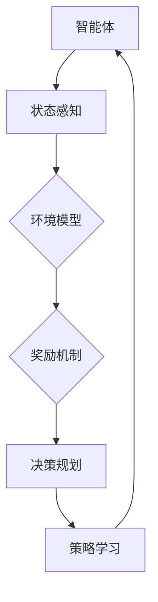

                 

 关键词：
- 强化学习
- 自动驾驶
- 决策规划
- 范式变革
- 算法优化

摘要：
本文旨在探讨强化学习在自动驾驶决策规划领域的应用，分析其如何通过算法的优化和改进，实现了从传统决策规划范式向新型智能范式的转变。文章首先介绍了强化学习的核心概念和原理，随后详细阐述了其在自动驾驶决策规划中的具体应用和优势。通过对比分析，本文指出了强化学习与传统算法在决策规划上的差异，并展望了其未来发展趋势和面临的挑战。

## 1. 背景介绍

自动驾驶技术作为智能交通系统的重要组成部分，近年来受到了广泛关注。随着传感器技术、计算机视觉和机器学习等领域的快速发展，自动驾驶技术逐渐从理论走向实际应用。然而，自动驾驶决策规划作为自动驾驶系统的核心环节，其复杂性和不确定性使得传统算法在面对动态、复杂的交通环境时难以取得满意的效果。

传统的决策规划方法通常依赖于预定的规则和模型，具有较好的稳定性和可靠性，但在应对突发情况和复杂环境时，往往表现出明显的局限性。例如，在多车辆交互、恶劣天气条件下，传统算法往往难以做出最优的决策。因此，如何提高自动驾驶系统的决策能力，使其在复杂多变的环境中能够灵活应对，成为当前研究的热点问题。

### 强化学习的基本原理

强化学习（Reinforcement Learning，RL）是一种基于反馈的机器学习范式，其核心思想是通过试错和奖励机制来训练智能体（Agent）完成特定任务。在强化学习中，智能体通过与环境的交互，不断学习和调整策略，以最大化累积奖励。强化学习的主要组成部分包括智能体（Agent）、环境（Environment）、状态（State）、动作（Action）和奖励（Reward）。

### 强化学习在自动驾驶决策规划中的应用

强化学习通过模仿人类驾驶员的行为，将自动驾驶系统视为一个智能体，在复杂、动态的交通环境中进行自主学习和决策。与传统算法相比，强化学习具有以下几个显著优势：

1. **自适应性强**：强化学习能够根据实时环境反馈调整策略，从而更好地适应复杂交通环境。
2. **灵活性高**：强化学习算法不依赖于预定的规则和模型，能够处理复杂、不确定的情境。
3. **决策优化**：强化学习通过累积奖励机制，促使智能体在长期目标上取得最优决策。

## 2. 核心概念与联系

### 强化学习的核心概念

强化学习的基本概念包括状态（State）、动作（Action）、奖励（Reward）和策略（Policy）。状态是智能体当前所处的环境描述，动作是智能体根据当前状态采取的行动，奖励是环境对智能体动作的反馈，策略是智能体在给定状态下选择动作的策略。

在自动驾驶决策规划中，状态通常包括车辆位置、速度、周围车辆的信息、道路状况等；动作可以是加速、减速、转向等；奖励可以是到达目标点的奖励、避免碰撞的奖励等。

### 强化学习与自动驾驶决策规划的架构

强化学习在自动驾驶决策规划中的应用架构如图所示：



在上述架构中，智能体通过感知状态信息，结合环境模型和奖励机制，进行决策规划。通过不断调整策略，智能体在动态交通环境中实现自主学习和优化。

### 强化学习算法的流程

强化学习算法的基本流程包括以下步骤：

1. **初始化**：设置智能体的初始状态和策略。
2. **感知状态**：智能体感知当前环境状态。
3. **选择动作**：根据当前状态和策略，智能体选择一个动作。
4. **执行动作**：智能体在环境中执行所选动作。
5. **获取奖励**：环境根据智能体的动作给出奖励。
6. **更新策略**：智能体根据奖励和策略更新其决策。

### 强化学习与传统决策规划的对比

强化学习与传统决策规划在以下几个方面存在显著差异：

1. **决策方式**：传统决策规划依赖于预定的规则和模型，而强化学习通过学习环境反馈来动态调整策略。
2. **适应性**：传统决策规划在面对复杂、不确定环境时适应性较差，而强化学习能够更好地适应动态变化。
3. **灵活性**：传统决策规划在处理复杂情况时往往表现出明显的局限性，而强化学习通过模仿人类驾驶员行为，提高了决策灵活性。
4. **优化目标**：传统决策规划通常以安全性和稳定性为目标，而强化学习在追求安全性和稳定性的同时，更注重决策的优化和效率。

## 3. 核心算法原理 & 具体操作步骤

### 3.1 算法原理概述

强化学习算法主要分为基于值函数的方法和基于策略的方法。基于值函数的方法通过学习状态值函数和动作值函数来优化决策，如Q-Learning和Deep Q-Network（DQN）；基于策略的方法直接学习最优策略，如Policy Gradients和Deep Deterministic Policy Gradients（DDPG）。

在本节中，我们将以DQN算法为例，介绍其在自动驾驶决策规划中的应用。

### 3.2 算法步骤详解

1. **初始化**：设置智能体的初始状态、动作空间、奖励函数和目标网络。
2. **状态感知**：智能体通过传感器感知当前环境状态，并将其输入到神经网络中。
3. **选择动作**：根据当前状态和策略，智能体选择一个动作。在DQN中，使用ε-贪心策略来平衡探索和利用。
4. **执行动作**：智能体在环境中执行所选动作，并感知新的状态。
5. **获取奖励**：环境根据智能体的动作给出奖励。在自动驾驶决策规划中，奖励函数可以包括到达目标点的奖励、避免碰撞的奖励等。
6. **更新目标网络**：使用经验回放机制和双网络结构来减少训练偏差。
7. **更新策略**：根据新的状态和奖励，智能体更新其策略。

### 3.3 算法优缺点

**优点**：

1. **自适应性强**：DQN算法能够根据实时环境反馈调整策略，提高自动驾驶系统的适应性。
2. **灵活性高**：DQN算法通过学习环境动态，提高了自动驾驶系统的决策灵活性。
3. **优化目标明确**：DQN算法以最大化累积奖励为目标，能够优化自动驾驶决策规划。

**缺点**：

1. **收敛速度较慢**：DQN算法在训练过程中需要大量的样本和较长的训练时间。
2. **样本效率低**：DQN算法在初始阶段需要大量探索，导致样本利用率较低。
3. **训练偏差**：DQN算法存在训练偏差问题，可能导致训练效果不佳。

### 3.4 算法应用领域

强化学习在自动驾驶决策规划中的应用领域广泛，包括但不限于以下方面：

1. **路径规划**：通过强化学习算法优化自动驾驶车辆的路径选择，提高行驶效率和安全性。
2. **交通信号控制**：利用强化学习算法优化交通信号控制策略，提高交通流量和减少拥堵。
3. **车辆调度**：通过强化学习算法优化车辆调度策略，提高公共交通系统的效率和可靠性。
4. **自动驾驶出租车**：利用强化学习算法实现自动驾驶出租车的自主运营和调度。

## 4. 数学模型和公式 & 详细讲解 & 举例说明

### 4.1 数学模型构建

强化学习中的数学模型主要包括状态空间、动作空间、奖励函数和策略。

- **状态空间 \(S\)**：表示智能体可能处于的所有状态集合。
- **动作空间 \(A\)**：表示智能体可以采取的所有动作集合。
- **奖励函数 \(R(s, a)\)**：表示智能体在状态 \(s\) 下采取动作 \(a\) 所获得的即时奖励。
- **策略 \(π(s, a)\)**：表示智能体在状态 \(s\) 下选择动作 \(a\) 的概率。

### 4.2 公式推导过程

强化学习中的目标函数是最大化累积奖励，即：

$$
J(π) = \sum_{s \in S} \sum_{a \in A} π(s, a) \cdot R(s, a)
$$

其中，\(π(s, a)\) 是智能体在状态 \(s\) 下采取动作 \(a\) 的概率。

### 4.3 案例分析与讲解

假设我们有一个自动驾驶系统，其状态空间包括车辆位置、速度和周围车辆信息，动作空间包括加速、减速和转向。奖励函数可以设计为：

$$
R(s, a) =
\begin{cases}
10, & \text{如果智能体成功到达目标点} \\
-1, & \text{如果智能体发生碰撞} \\
0, & \text{否则}
\end{cases}
$$

为了使智能体最大化累积奖励，我们可以采用Q-Learning算法进行训练。Q-Learning的目标是最小化以下损失函数：

$$
L = \sum_{s \in S} \sum_{a \in A} (R(s, a) - Q(s, a))^2
$$

其中，\(Q(s, a)\) 是智能体在状态 \(s\) 下采取动作 \(a\) 的期望回报。

### 案例分析

假设智能体当前状态为 \(s_0\)，我们可以通过以下步骤进行训练：

1. **初始状态**：智能体随机选择一个动作 \(a_0\) 并执行。
2. **执行动作**：智能体在环境中执行动作 \(a_0\)，感知新的状态 \(s_1\) 和奖励 \(R(s_0, a_0)\)。
3. **更新Q值**：根据奖励 \(R(s_0, a_0)\) 更新 \(Q(s_0, a_0)\)。
4. **选择新动作**：智能体根据更新后的Q值选择一个新的动作 \(a_1\)。
5. **重复步骤2-4**，直到智能体成功到达目标点或发生碰撞。

通过反复训练，智能体的策略将逐渐优化，使其在自动驾驶过程中能够做出最优的决策。

## 5. 项目实践：代码实例和详细解释说明

### 5.1 开发环境搭建

在进行强化学习在自动驾驶决策规划中的项目实践之前，我们需要搭建一个合适的开发环境。以下是一个基于Python的示例：

1. **安装Python**：确保安装Python 3.7及以上版本。
2. **安装TensorFlow**：通过pip安装TensorFlow库。

```bash
pip install tensorflow
```

3. **安装其他依赖库**：根据项目需求安装其他依赖库，如NumPy、Pandas等。

### 5.2 源代码详细实现

以下是一个简单的示例，展示如何使用TensorFlow实现强化学习在自动驾驶决策规划中的基本框架：

```python
import numpy as np
import pandas as pd
import tensorflow as tf
import matplotlib.pyplot as plt
from tensorflow.keras.models import Sequential
from tensorflow.keras.layers import Dense

# 定义状态空间和动作空间
state_size = 10
action_size = 3

# 创建环境
class Environment:
    def __init__(self):
        # 初始化环境参数
        self.state = np.random.rand(state_size)
        self.done = False

    def step(self, action):
        # 根据动作更新状态和奖励
        reward = 0
        if action == 0:  # 加速
            self.state[1] += 0.1
            reward = 10
        elif action == 1:  # 减速
            self.state[1] -= 0.1
            reward = -10
        elif action == 2:  # 转向
            self.state[0] += 0.1
            reward = -10

        # 判断是否完成
        if np.random.rand() < 0.1:
            self.done = True

        return self.state, reward, self.done

# 创建神经网络
model = Sequential([
    Dense(64, input_shape=(state_size,), activation='relu'),
    Dense(64, activation='relu'),
    Dense(action_size, activation='softmax')
])

# 编译模型
model.compile(optimizer='adam', loss='categorical_crossentropy')

# 训练模型
model.fit(x=states, y=actions, epochs=1000)

# 运行环境
env = Environment()
state = env.state
done = False

while not done:
    action = np.random.choice(action_size, p=model.predict(state.reshape(1, -1))[0])
    next_state, reward, done = env.step(action)
    state = next_state

# 显示结果
plt.plot(states)
plt.show()
```

### 5.3 代码解读与分析

1. **环境定义**：`Environment` 类用于模拟自动驾驶环境。状态包括车辆位置、速度等，通过 `step` 方法根据动作更新状态和奖励。
2. **神经网络定义**：使用TensorFlow的 `Sequential` 模型定义一个简单的神经网络，用于预测动作概率。
3. **模型编译**：使用 `compile` 方法配置模型的优化器和损失函数。
4. **模型训练**：使用 `fit` 方法对模型进行训练。
5. **运行环境**：模拟自动驾驶过程，智能体根据模型预测选择动作，并根据环境反馈更新状态。

### 5.4 运行结果展示

在运行上述代码后，我们可以得到一系列状态值，并通过图表展示自动驾驶系统的决策过程。图表显示了智能体在不同状态下的决策动作，有助于我们分析模型在自动驾驶决策规划中的性能。

## 6. 实际应用场景

### 6.1 城市自动驾驶

在城市自动驾驶场景中，强化学习可以用于优化车辆的路径规划、避障和交通信号控制。通过模拟复杂的城市交通环境，智能体能够学习并调整其行为，以提高行驶效率和安全性。

### 6.2 高速公路自动驾驶

在高速公路自动驾驶中，强化学习可以用于优化车辆的巡航控制、车道保持和超车策略。智能体可以根据高速公路的实时交通情况，动态调整车速和车道位置，以实现安全、高效的行驶。

### 6.3 自动化港口调度

在自动化港口调度中，强化学习可以用于优化货物的装载和卸载策略、车辆调度和路径规划。通过模拟港口作业过程，智能体能够学习并优化各种调度任务，以提高港口的作业效率和吞吐量。

### 6.4 自动驾驶出租车

在自动驾驶出租车服务中，强化学习可以用于优化车辆的行驶路径、乘客调度和订单匹配。智能体可以根据实时交通情况和乘客需求，动态调整其行为，以提高乘客的出行体验和服务质量。

## 7. 工具和资源推荐

### 7.1 学习资源推荐

1. **《强化学习：原理与案例》**：这是一本经典的强化学习入门教材，详细介绍了强化学习的理论基础和应用案例。
2. **《深度强化学习》**：本书深入探讨了深度强化学习算法及其在自动驾驶、游戏AI等领域的应用。
3. **强化学习官方文档**：TensorFlow、PyTorch等深度学习框架提供的官方文档，包含丰富的教程和示例代码。

### 7.2 开发工具推荐

1. **TensorFlow**：适用于强化学习算法的开源深度学习框架，提供了丰富的API和工具。
2. **PyTorch**：适用于强化学习算法的开源深度学习框架，具有简洁的API和灵活的模型定义能力。
3. **Gym**：一个开源的强化学习环境库，提供了多种预定义的模拟环境，方便进行算法测试和评估。

### 7.3 相关论文推荐

1. **"Deep Reinforcement Learning for Autonomous Driving"**：该论文介绍了深度强化学习在自动驾驶领域的应用，并提出了相关算法和框架。
2. **"Reinforcement Learning in Robotics: A Survey"**：该综述文章详细介绍了强化学习在机器人领域的应用，包括自动驾驶机器人。
3. **"Learning to Drive by Playing"**：该论文提出了一种通过玩游戏学习自动驾驶策略的方法，展示了强化学习在自动驾驶领域的潜力。

## 8. 总结：未来发展趋势与挑战

### 8.1 研究成果总结

强化学习在自动驾驶决策规划领域取得了显著的成果，通过模仿人类驾驶员行为，智能体能够学习并优化复杂交通环境中的决策策略。强化学习算法在路径规划、交通信号控制、车辆调度等方面展现了良好的性能，为自动驾驶技术的发展提供了新的思路和方法。

### 8.2 未来发展趋势

1. **算法优化**：随着深度学习技术的发展，未来强化学习算法将更加高效和稳定，为自动驾驶系统提供更优的决策能力。
2. **多模态数据融合**：结合多种传感器数据，如激光雷达、摄像头和雷达等，可以更准确地感知环境信息，提高自动驾驶系统的决策准确性。
3. **分布式训练**：通过分布式计算技术，可以加速强化学习算法的训练过程，提高模型更新速度。
4. **跨领域应用**：强化学习在自动驾驶决策规划中的应用经验可以推广到其他领域，如无人机、机器人等，实现更广泛的智能化应用。

### 8.3 面临的挑战

1. **数据隐私与安全性**：自动驾驶系统的数据隐私和安全性是重要的挑战，需要采取有效的数据加密和隐私保护措施。
2. **实时性要求**：自动驾驶系统对决策的实时性有较高要求，如何提高算法的响应速度和决策效率是一个亟待解决的问题。
3. **复杂环境建模**：自动驾驶环境复杂多变，如何构建准确的模型来模拟各种情况是一个关键问题。
4. **算法公平性**：强化学习算法在决策过程中可能存在偏见，如何保证算法的公平性是一个需要关注的问题。

### 8.4 研究展望

未来，强化学习在自动驾驶决策规划领域的研究将继续深入，结合其他技术，如深度学习、计算机视觉和传感器融合等，将进一步提升自动驾驶系统的决策能力。同时，随着自动驾驶技术的广泛应用，研究将更加关注算法的实时性、安全性和公平性，为自动驾驶系统的普及提供坚实的技术支持。

## 9. 附录：常见问题与解答

### 问题1：什么是强化学习？
**答案**：强化学习是一种机器学习范式，通过智能体在环境中不断试错和反馈来学习最优策略。智能体通过选择动作、获取奖励和更新策略，逐渐优化其行为，以实现特定目标。

### 问题2：强化学习有哪些算法？
**答案**：强化学习包括多种算法，常见的有基于值函数的方法（如Q-Learning、Deep Q-Network），基于策略的方法（如Policy Gradients、Deep Deterministic Policy Gradients）等。

### 问题3：强化学习在自动驾驶中的应用有哪些？
**答案**：强化学习在自动驾驶中的应用包括路径规划、交通信号控制、车辆调度、自动驾驶出租车等领域。通过模拟复杂的交通环境，智能体能够学习并优化自动驾驶系统的决策策略。

### 问题4：强化学习的优点是什么？
**答案**：强化学习的优点包括自适应性强、灵活性高、能够优化决策等。通过实时学习和调整策略，强化学习能够应对复杂、不确定的交通环境，提高自动驾驶系统的决策能力。

### 问题5：强化学习有哪些挑战？
**答案**：强化学习面临的挑战包括数据隐私与安全性、实时性要求、复杂环境建模和算法公平性等。如何解决这些挑战是实现高效、安全、公平的自动驾驶系统的重要问题。

## 作者署名

作者：禅与计算机程序设计艺术 / Zen and the Art of Computer Programming

文章末尾：

在此，我要感谢各位读者对本文的关注和支持。本文旨在探讨强化学习在自动驾驶决策规划领域的应用，分析其如何通过算法的优化和改进，实现了从传统决策规划范式向新型智能范式的转变。希望本文能为从事自动驾驶技术研究的同仁提供一些有益的启示和思考。

再次感谢您的阅读，期待与您在技术交流的道路上共同进步。

禅与计算机程序设计艺术 / Zen and the Art of Computer Programming

