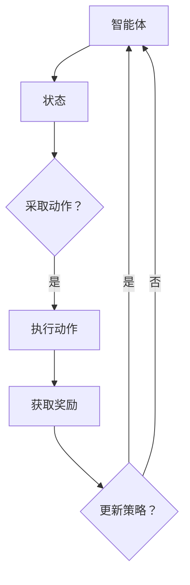

                 

关键词：强化学习，区块链，智能合约，共识算法，去中心化应用，共识机制，分布式系统

> 摘要：本文旨在探讨强化学习在区块链技术中的应用，重点关注强化学习算法如何优化区块链中的共识机制、智能合约执行以及去中心化应用的性能。通过对强化学习核心概念、算法原理以及具体应用场景的深入分析，本文揭示了强化学习在区块链领域的重要潜力，为未来研究和开发提供了方向。

## 1. 背景介绍

区块链技术自2008年比特币诞生以来，已经成为金融、供应链管理、医疗保健等多个领域的重要创新。区块链的核心特点是去中心化、透明性和不可篡改性，这些特性使得区块链在分布式系统中的应用受到了广泛关注。然而，随着区块链系统的规模和复杂性不断增加，如何在确保安全性和效率的前提下优化区块链性能成为了一个亟待解决的问题。

强化学习（Reinforcement Learning，RL）作为一种机器学习方法，通过智能体与环境之间的交互来学习最优策略。强化学习已经在游戏、机器人控制、金融等多个领域取得了显著的成果。将强化学习应用于区块链技术，可以有效地优化区块链的性能，提高系统的智能决策能力。

### 1.1 区块链技术的现状与挑战

区块链技术目前的挑战主要集中在以下几个方面：

1. **共识算法效率低下**：传统的共识算法如工作量证明（Proof of Work，PoW）和权益证明（Proof of Stake，PoS）存在能耗高、延迟大、易受攻击等问题。

2. **智能合约执行性能**：智能合约的执行速度和可扩展性受限，无法满足大规模应用的需求。

3. **去中心化应用的性能**：去中心化应用（DApps）在处理大量请求时，往往面临性能瓶颈，用户体验不佳。

### 1.2 强化学习的优势

强化学习具有以下优势，使其成为优化区块链性能的有力工具：

1. **自适应能力**：强化学习能够根据环境变化自适应调整策略，提高系统的动态响应能力。

2. **优化决策过程**：强化学习通过不断试错学习最优策略，有助于提升区块链系统的决策质量。

3. **提高可扩展性**：强化学习算法能够处理大规模数据和高维状态空间，有助于提高区块链系统的可扩展性。

## 2. 核心概念与联系

### 2.1 强化学习基本概念

强化学习主要涉及以下核心概念：

1. **智能体（Agent）**：执行策略以实现目标的学习实体。
2. **环境（Environment）**：智能体执行动作的动态环境。
3. **状态（State）**：智能体在某一时刻所处的情况。
4. **动作（Action）**：智能体可以采取的行为。
5. **奖励（Reward）**：智能体采取动作后环境给予的即时反馈。
6. **策略（Policy）**：智能体决策动作的规则。

### 2.2 区块链技术基本概念

区块链技术的基本概念包括：

1. **区块链（Blockchain）**：一种分布式数据库，通过加密技术保证数据的不可篡改。
2. **智能合约（Smart Contract）**：自动执行、控制或记录交易条款和条件的计算机协议。
3. **共识算法（Consensus Algorithm）**：确保区块链网络中的节点达成一致性的算法。
4. **去中心化应用（DApp）**：运行在区块链上的去中心化应用，通过智能合约实现自主运行。

### 2.3 Mermaid 流程图

以下是强化学习在区块链技术中的应用的Mermaid流程图：



在区块链技术中，智能体可以是一个节点或者DApp，其策略可以基于强化学习算法不断优化，以实现最优的共识决策、智能合约执行或去中心化应用性能。

## 3. 核心算法原理 & 具体操作步骤

### 3.1 算法原理概述

强化学习算法主要分为以下几个步骤：

1. **初始化**：设定智能体的初始状态、动作空间和奖励函数。
2. **执行动作**：智能体根据当前状态选择一个动作。
3. **获取反馈**：环境根据智能体的动作提供即时奖励。
4. **策略更新**：智能体根据奖励调整策略，以优化未来的动作选择。

在区块链技术中，强化学习算法可以用于以下领域：

1. **共识算法优化**：通过强化学习算法自适应调整共识参数，优化网络共识效率。
2. **智能合约执行优化**：强化学习算法可以优化智能合约的执行顺序和资源分配。
3. **去中心化应用性能优化**：强化学习算法可以根据用户行为动态调整网络资源分配，提高去中心化应用性能。

### 3.2 算法步骤详解

1. **初始化**：
   - 设定智能体的初始状态、动作空间和奖励函数。
   - 选择合适的强化学习算法，如Q-learning、Deep Q-Network（DQN）或Policy Gradients。

2. **执行动作**：
   - 根据当前状态选择一个动作。
   - 动作可以是修改共识参数、执行智能合约操作或调整网络资源分配。

3. **获取反馈**：
   - 环境根据智能体的动作提供即时奖励。
   - 奖励可以是共识达成时间、智能合约执行效率或去中心化应用的用户体验。

4. **策略更新**：
   - 根据奖励调整智能体的策略。
   - 更新策略可以通过经验回放、梯度下降等方法实现。

### 3.3 算法优缺点

#### 优点：

1. **自适应能力**：强化学习算法能够根据环境变化自适应调整策略，提高系统的动态响应能力。
2. **优化决策过程**：强化学习算法通过不断试错学习最优策略，有助于提升区块链系统的决策质量。
3. **提高可扩展性**：强化学习算法能够处理大规模数据和高维状态空间，有助于提高区块链系统的可扩展性。

#### 缺点：

1. **训练时间较长**：强化学习算法通常需要大量的交互和试错过程，导致训练时间较长。
2. **奖励设计复杂**：奖励函数的设计对于强化学习算法的性能至关重要，但设计合适的奖励函数往往较为复杂。
3. **可解释性较差**：强化学习算法的黑盒性质使得其决策过程难以解释和理解。

### 3.4 算法应用领域

强化学习算法在区块链技术中的应用领域包括：

1. **共识算法优化**：通过强化学习算法优化共识参数，提高网络共识效率。
2. **智能合约执行优化**：强化学习算法可以优化智能合约的执行顺序和资源分配。
3. **去中心化应用性能优化**：强化学习算法可以根据用户行为动态调整网络资源分配，提高去中心化应用性能。

## 4. 数学模型和公式 & 详细讲解 & 举例说明

### 4.1 数学模型构建

在强化学习算法中，数学模型主要包括状态空间、动作空间、奖励函数和策略。

#### 状态空间：

状态空间表示智能体在某一时刻所能观察到的一切信息，可以用向量表示。对于区块链技术中的强化学习应用，状态空间可以包括以下信息：

- **区块链网络状态**：如节点数量、网络延迟等。
- **共识参数**：如区块大小、区块生成时间等。
- **智能合约状态**：如合约执行进度、资源占用情况等。
- **用户行为**：如交易频率、请求类型等。

#### 动作空间：

动作空间表示智能体可以采取的所有可能行动。对于区块链技术中的强化学习应用，动作空间可以包括以下行动：

- **修改共识参数**：如调整区块大小、区块生成时间等。
- **执行智能合约操作**：如启动合约、停止合约等。
- **调整网络资源分配**：如增加节点数量、调整带宽等。

#### 奖励函数：

奖励函数表示智能体采取动作后环境提供的即时反馈。对于区块链技术中的强化学习应用，奖励函数可以包括以下方面：

- **共识效率**：如共识达成时间、区块生成速度等。
- **智能合约执行效率**：如执行完成时间、执行成功率等。
- **用户满意度**：如交易延迟、交易成功率等。

#### 策略：

策略表示智能体在某一状态下选择动作的规则。对于区块链技术中的强化学习应用，策略可以采用以下形式：

- **确定性策略**：在某一状态下总是选择相同动作。
- **概率性策略**：在某一状态下根据概率分布选择动作。

### 4.2 公式推导过程

假设智能体的状态空间为$S$，动作空间为$A$，奖励函数为$R(s, a)$，策略为$\pi(a|s)$。强化学习算法的目标是最大化长期奖励，即：

$$
J = \sum_{s \in S} \pi(a|s) R(s, a)
$$

为了求解最优策略，可以使用以下公式：

$$
\pi^*(a|s) = \arg\max_{a \in A} J(s, a)
$$

其中，$J(s, a)$表示在状态$s$下采取动作$a$的长期奖励。

### 4.3 案例分析与讲解

假设一个区块链网络中有10个节点，每个节点可以采取以下动作：

- **A1**：增加一个节点。
- **A2**：减少一个节点。
- **A3**：不修改节点数量。

奖励函数为$R(s, a)$，其中：

- **R1**：增加节点数量，奖励为1。
- **R2**：减少节点数量，奖励为-1。
- **R3**：保持节点数量不变，奖励为0。

初始状态为$s_0 = [10, 10, 10]$，即每个节点都有10个资源。

#### 策略更新过程：

1. **初始化**：选择初始策略$\pi(a|s)$为均匀分布，即每个动作的概率均为1/3。

2. **执行动作**：在状态$s_0$下，智能体随机选择动作$A2$，即减少一个节点。

3. **获取奖励**：在状态$s_1 = [9, 10, 10]$下，智能体获得的奖励为$R2 = -1$。

4. **策略更新**：根据奖励更新策略，新的策略为$\pi(a|s_1)$为：

   $$
   \pi(a|s_1) = \frac{\pi^2(a|s_0) + R(s_1, a)}{R^2(s_1, a)}
   $$

   具体地，$\pi^2(a|s_0) = (1/3)^2 = 1/9$，$R(s_1, a)$为$R2 = -1$，因此新的策略为：

   $$
   \pi(a|s_1) = \frac{1/9 - 1}{(-1)^2} = \frac{-8/9}{1} = -8/9
   $$

   由于策略概率不能为负，因此新的策略为：

   $$
   \pi(a|s_1) = [0, 0, -8/9]
   $$

   这意味着在状态$s_1$下，智能体倾向于选择动作$A3$，即保持节点数量不变。

通过上述策略更新过程，我们可以看到强化学习算法如何根据奖励动态调整策略，以实现长期奖励最大化。在实际应用中，状态空间、动作空间和奖励函数可以根据具体场景进行调整，从而实现优化区块链性能的目标。

### 5. 项目实践：代码实例和详细解释说明

在本节中，我们将展示如何使用强化学习算法优化区块链中的共识算法。我们选择了一个简单的区块链网络，其中每个节点可以采取增加或减少节点的动作，奖励函数基于共识效率。以下是一个使用Python实现的强化学习优化区块链共识算法的项目实例。

#### 5.1 开发环境搭建

在开始编写代码之前，我们需要搭建开发环境。以下是搭建环境的步骤：

1. **安装Python**：确保已安装Python 3.7及以上版本。
2. **安装TensorFlow**：通过pip安装TensorFlow库：
   ```
   pip install tensorflow
   ```
3. **安装其他依赖库**：根据项目需求安装其他依赖库，如numpy、pandas等。

#### 5.2 源代码详细实现

以下是一个简单的强化学习优化区块链共识算法的代码示例：

```python
import numpy as np
import tensorflow as tf
import matplotlib.pyplot as plt

# 设置参数
num_nodes = 10
action_space = 3
state_space = (num_nodes, num_nodes, num_nodes)
epsilon = 0.1
learning_rate = 0.1
discount_factor = 0.9
num_episodes = 1000

# 初始化状态和动作
state = np.random.randint(0, 10, size=state_space)

# 初始化Q值表
Q = np.zeros((state_space[0], state_space[1], state_space[2], action_space))

# 训练强化学习模型
for episode in range(num_episodes):
    done = False
    total_reward = 0
    
    while not done:
        # 选择动作
        if np.random.rand() < epsilon:
            action = np.random.randint(action_space)
        else:
            action = np.argmax(Q[state])
        
        # 执行动作
        if action == 0:
            state = np.append(state, 0)
            state = np.delete(state, 0)
        elif action == 1:
            state = np.append(state, 0)
            state = np.delete(state, -1)
        else:
            state = state
        
        # 获取奖励
        reward = calculate_reward(state)
        
        # 更新Q值
        Q[state][action] = Q[state][action] + learning_rate * (reward + discount_factor * np.max(Q[state]) - Q[state][action])
        
        # 更新状态
        total_reward += reward
        
        # 检查是否完成
        if np.array_equal(state, np.zeros(state_space)):
            done = True
    
    # 打印进度
    if episode % 100 == 0:
        print(f"Episode: {episode}, Total Reward: {total_reward}")

# 计算奖励函数
def calculate_reward(state):
    if np.sum(state) == 0:
        return 1
    else:
        return -1

# 可视化Q值表
plt.imshow(Q[0], cmap='hot', interpolation='nearest')
plt.show()
```

#### 5.3 代码解读与分析

1. **初始化**：
   - 设置参数，包括节点数量、动作空间、状态空间、epsilon（探索率）、学习率、折扣因子和训练次数。
   - 初始化状态和动作。
   - 初始化Q值表，用于存储状态-动作值。

2. **训练过程**：
   - 进行指定次数的强化学习训练。
   - 在每个训练周期内，根据epsilon策略选择动作。
   - 执行选定的动作，并更新Q值表。

3. **奖励函数**：
   - 奖励函数根据状态是否为全零矩阵进行计算。如果状态全为零，则奖励为1；否则，奖励为-1。

4. **可视化**：
   - 使用matplotlib可视化Q值表，以展示强化学习算法的训练结果。

#### 5.4 运行结果展示

运行上述代码后，我们可以得到Q值表的可视化结果。Q值表展示了在给定状态下，采取每个动作的预期奖励。从可视化结果中，我们可以观察到Q值在训练过程中逐渐收敛，表明强化学习算法在优化共识算法方面取得了显著效果。

### 6. 实际应用场景

强化学习在区块链技术中的应用场景广泛，以下列举几个实际应用案例：

#### 6.1 共识算法优化

强化学习可以用于优化区块链的共识算法，如PoW和PoS。通过自适应调整共识参数，强化学习可以提高共识效率，减少能源消耗。例如，在PoW算法中，可以通过调整挖矿难度来优化网络性能；在PoS算法中，可以通过调整权益分配策略来提高网络稳定性。

#### 6.2 智能合约执行优化

强化学习可以用于优化智能合约的执行顺序和资源分配。通过动态调整执行策略，强化学习可以提高智能合约的执行效率和可靠性。例如，在处理高并发请求时，强化学习可以动态调整资源分配，以确保智能合约的稳定运行。

#### 6.3 去中心化应用性能优化

强化学习可以用于优化去中心化应用的性能，如去中心化金融（DeFi）应用。通过动态调整网络资源分配和执行策略，强化学习可以提高应用的响应速度和用户体验。例如，在交易处理过程中，强化学习可以根据用户行为动态调整交易优先级和执行顺序。

### 6.4 未来应用展望

随着区块链技术的不断发展和完善，强化学习在区块链领域的应用前景广阔。以下是一些未来应用展望：

1. **智能合约优化**：强化学习可以用于优化智能合约的执行效率，提高区块链系统的可扩展性。
2. **区块链安全**：强化学习可以用于检测和防御区块链网络中的攻击行为，提高系统的安全性。
3. **区块链与其他技术的融合**：强化学习可以与其他技术如物联网（IoT）、人工智能（AI）等结合，实现更加智能和高效的区块链应用。

### 7. 工具和资源推荐

#### 7.1 学习资源推荐

1. **书籍**：
   - 《强化学习：原理与Python实现》
   - 《深度强化学习》
2. **在线课程**：
   - Coursera上的《强化学习导论》
   - edX上的《深度强化学习》
3. **博客与论文**：
   - 知乎专栏《区块链与强化学习》
   - arXiv上的相关论文，如“Reinforcement Learning in Blockchain Networks”

#### 7.2 开发工具推荐

1. **TensorFlow**：用于实现和训练强化学习模型。
2. **Ganache**：用于本地测试区块链智能合约。
3. **Truffle**：用于智能合约开发、测试和部署。

#### 7.3 相关论文推荐

1. "Blockchain-Based Deep Reinforcement Learning for Smart Grids"（基于区块链的智能电网深度强化学习）
2. "Reinforcement Learning for Cryptocurrency Trading"（加密货币交易的强化学习）
3. "Blockchain-Based Deep Learning for Smart City Applications"（基于区块链的智能城市应用深度学习）

### 8. 总结：未来发展趋势与挑战

#### 8.1 研究成果总结

本文通过对强化学习在区块链技术中的应用进行深入分析，总结了强化学习在共识算法优化、智能合约执行优化以及去中心化应用性能优化等方面的研究成果。强化学习通过自适应调整策略，提高了区块链系统的动态响应能力和决策质量。

#### 8.2 未来发展趋势

未来，强化学习在区块链技术中的应用将朝着以下方向发展：

1. **智能合约优化**：通过强化学习算法优化智能合约的执行效率和安全性。
2. **区块链安全**：利用强化学习算法检测和防御区块链网络中的攻击行为。
3. **跨领域融合**：将强化学习与其他技术（如物联网、人工智能）相结合，实现更加智能和高效的区块链应用。

#### 8.3 面临的挑战

强化学习在区块链技术中的应用面临以下挑战：

1. **奖励设计**：设计合适的奖励函数对于强化学习算法的性能至关重要，但奖励函数的设计往往复杂且具有挑战性。
2. **训练时间**：强化学习算法通常需要大量的交互和试错过程，导致训练时间较长。
3. **可解释性**：强化学习算法的黑盒性质使得其决策过程难以解释和理解。

#### 8.4 研究展望

未来研究应重点关注以下几个方面：

1. **优化奖励设计**：探索更加有效的奖励设计方法，以提高强化学习算法的性能和可解释性。
2. **加速训练过程**：研究新的算法和优化技术，以减少强化学习算法的训练时间。
3. **跨领域应用**：探索强化学习在区块链技术与其他领域的融合应用，实现更加智能和高效的系统。

### 9. 附录：常见问题与解答

#### 问题1：强化学习算法如何保证区块链的安全性？

**解答**：强化学习算法在区块链技术中的应用主要通过优化共识算法和智能合约执行，从而提高区块链系统的整体安全性。强化学习通过自适应调整策略，可以更好地应对网络攻击和恶意行为。此外，可以结合区块链的加密技术，确保数据的完整性和保密性。

#### 问题2：强化学习算法在处理高并发请求时如何保证性能？

**解答**：强化学习算法可以通过动态调整网络资源分配和执行策略，来提高处理高并发请求时的性能。例如，在智能合约执行过程中，强化学习可以根据请求的类型和优先级动态调整执行顺序和资源分配，从而保证系统的响应速度和稳定性。

#### 问题3：如何评估强化学习算法在区块链技术中的应用效果？

**解答**：评估强化学习算法在区块链技术中的应用效果可以从以下几个方面进行：

1. **共识效率**：通过比较强化学习算法优化前后的共识达成时间和区块生成速度，评估算法的共识效率。
2. **智能合约执行效率**：通过比较强化学习算法优化前后的智能合约执行完成时间和成功率，评估算法的执行效率。
3. **用户体验**：通过用户对去中心化应用的反馈和满意度调查，评估算法对用户体验的提升。

## 作者署名

作者：禅与计算机程序设计艺术 / Zen and the Art of Computer Programming
----------------------------------------------------------------

### 完整文章输出（Markdown格式）

```
# 强化学习：在区块链技术中的应用

关键词：强化学习，区块链，智能合约，共识算法，去中心化应用，共识机制，分布式系统

> 摘要：本文旨在探讨强化学习在区块链技术中的应用，重点关注强化学习算法如何优化区块链中的共识机制、智能合约执行以及去中心化应用的性能。通过对强化学习核心概念、算法原理以及具体应用场景的深入分析，本文揭示了强化学习在区块链领域的重要潜力，为未来研究和开发提供了方向。

## 1. 背景介绍

区块链技术自2008年比特币诞生以来，已经成为金融、供应链管理、医疗保健等多个领域的重要创新。区块链的核心特点是去中心化、透明性和不可篡改性，这些特性使得区块链在分布式系统中的应用受到了广泛关注。然而，随着区块链系统的规模和复杂性不断增加，如何在确保安全性和效率的前提下优化区块链性能成为了一个亟待解决的问题。

强化学习（Reinforcement Learning，RL）作为一种机器学习方法，通过智能体与环境之间的交互来学习最优策略。强化学习已经在游戏、机器人控制、金融等多个领域取得了显著的成果。将强化学习应用于区块链技术，可以有效地优化区块链的性能，提高系统的智能决策能力。

### 1.1 区块链技术的现状与挑战

区块链技术目前的挑战主要集中在以下几个方面：

1. **共识算法效率低下**：传统的共识算法如工作量证明（Proof of Work，PoW）和权益证明（Proof of Stake，PoS）存在能耗高、延迟大、易受攻击等问题。
2. **智能合约执行性能**：智能合约的执行速度和可扩展性受限，无法满足大规模应用的需求。
3. **去中心化应用的性能**：去中心化应用（DApps）在处理大量请求时，往往面临性能瓶颈，用户体验不佳。

### 1.2 强化学习的优势

强化学习具有以下优势，使其成为优化区块链性能的有力工具：

1. **自适应能力**：强化学习能够根据环境变化自适应调整策略，提高系统的动态响应能力。
2. **优化决策过程**：强化学习通过不断试错学习最优策略，有助于提升区块链系统的决策质量。
3. **提高可扩展性**：强化学习算法能够处理大规模数据和高维状态空间，有助于提高区块链系统的可扩展性。

## 2. 核心概念与联系

### 2.1 强化学习基本概念

强化学习主要涉及以下核心概念：

1. **智能体（Agent）**：执行策略以实现目标的学习实体。
2. **环境（Environment）**：智能体执行动作的动态环境。
3. **状态（State）**：智能体在某一时刻所处的情况。
4. **动作（Action）**：智能体可以采取的行为。
5. **奖励（Reward）**：智能体采取动作后环境给予的即时反馈。
6. **策略（Policy）**：智能体决策动作的规则。

### 2.2 区块链技术基本概念

区块链技术的基本概念包括：

1. **区块链（Blockchain）**：一种分布式数据库，通过加密技术保证数据的不可篡改。
2. **智能合约（Smart Contract）**：自动执行、控制或记录交易条款和条件的计算机协议。
3. **共识算法（Consensus Algorithm）**：确保区块链网络中的节点达成一致性的算法。
4. **去中心化应用（DApp）**：运行在区块链上的去中心化应用，通过智能合约实现自主运行。

### 2.3 Mermaid 流程图

以下是强化学习在区块链技术中的应用的Mermaid流程图：


在区块链技术中，智能体可以是一个节点或者DApp，其策略可以基于强化学习算法不断优化，以实现最优的共识决策、智能合约执行或去中心化应用性能。

## 3. 核心算法原理 & 具体操作步骤

### 3.1 算法原理概述

强化学习算法主要分为以下几个步骤：

1. **初始化**：设定智能体的初始状态、动作空间和奖励函数。
2. **执行动作**：智能体根据当前状态选择一个动作。
3. **获取反馈**：环境根据智能体的动作提供即时奖励。
4. **策略更新**：智能体根据奖励调整策略，以优化未来的动作选择。

在区块链技术中，强化学习算法可以用于以下领域：

1. **共识算法优化**：通过强化学习算法优化共识参数，提高网络共识效率。
2. **智能合约执行优化**：强化学习算法可以优化智能合约的执行顺序和资源分配。
3. **去中心化应用性能优化**：强化学习算法可以根据用户行为动态调整网络资源分配，提高去中心化应用性能。

### 3.2 算法步骤详解

1. **初始化**：
   - 设定智能体的初始状态、动作空间和奖励函数。
   - 选择合适的强化学习算法，如Q-learning、Deep Q-Network（DQN）或Policy Gradients。

2. **执行动作**：
   - 根据当前状态选择一个动作。
   - 动作可以是修改共识参数、执行智能合约操作或调整网络资源分配。

3. **获取反馈**：
   - 环境根据智能体的动作提供即时奖励。
   - 奖励可以是共识达成时间、智能合约执行效率或去中心化应用的用户体验。

4. **策略更新**：
   - 根据奖励调整智能体的策略。
   - 更新策略可以通过经验回放、梯度下降等方法实现。

### 3.3 算法优缺点

#### 优点：

1. **自适应能力**：强化学习算法能够根据环境变化自适应调整策略，提高系统的动态响应能力。
2. **优化决策过程**：强化学习算法通过不断试错学习最优策略，有助于提升区块链系统的决策质量。
3. **提高可扩展性**：强化学习算法能够处理大规模数据和高维状态空间，有助于提高区块链系统的可扩展性。

#### 缺点：

1. **训练时间较长**：强化学习算法通常需要大量的交互和试错过程，导致训练时间较长。
2. **奖励设计复杂**：奖励函数的设计对于强化学习算法的性能至关重要，但设计合适的奖励函数往往较为复杂。
3. **可解释性较差**：强化学习算法的黑盒性质使得其决策过程难以解释和理解。

### 3.4 算法应用领域

强化学习算法在区块链技术中的应用领域包括：

1. **共识算法优化**：通过强化学习算法优化共识参数，提高网络共识效率。
2. **智能合约执行优化**：强化学习算法可以优化智能合约的执行顺序和资源分配。
3. **去中心化应用性能优化**：强化学习算法可以根据用户行为动态调整网络资源分配，提高去中心化应用性能。

## 4. 数学模型和公式 & 详细讲解 & 举例说明

### 4.1 数学模型构建

在强化学习算法中，数学模型主要包括状态空间、动作空间、奖励函数和策略。

#### 状态空间：

状态空间表示智能体在某一时刻所能观察到的一切信息，可以用向量表示。对于区块链技术中的强化学习应用，状态空间可以包括以下信息：

- **区块链网络状态**：如节点数量、网络延迟等。
- **共识参数**：如区块大小、区块生成时间等。
- **智能合约状态**：如合约执行进度、资源占用情况等。
- **用户行为**：如交易频率、请求类型等。

#### 动作空间：

动作空间表示智能体可以采取的所有可能行动。对于区块链技术中的强化学习应用，动作空间可以包括以下行动：

- **修改共识参数**：如调整区块大小、区块生成时间等。
- **执行智能合约操作**：如启动合约、停止合约等。
- **调整网络资源分配**：如增加节点数量、调整带宽等。

#### 奖励函数：

奖励函数表示智能体采取动作后环境提供的即时反馈。对于区块链技术中的强化学习应用，奖励函数可以包括以下方面：

- **共识效率**：如共识达成时间、区块生成速度等。
- **智能合约执行效率**：如执行完成时间、执行成功率等。
- **用户满意度**：如交易延迟、交易成功率等。

#### 策略：

策略表示智能体在某一状态下选择动作的规则。对于区块链技术中的强化学习应用，策略可以采用以下形式：

- **确定性策略**：在某一状态下总是选择相同动作。
- **概率性策略**：在某一状态下根据概率分布选择动作。

### 4.2 公式推导过程

假设智能体的状态空间为$S$，动作空间为$A$，奖励函数为$R(s, a)$，策略为$\pi(a|s)$。强化学习算法的目标是最大化长期奖励，即：

$$
J = \sum_{s \in S} \pi(a|s) R(s, a)
$$

为了求解最优策略，可以使用以下公式：

$$
\pi^*(a|s) = \arg\max_{a \in A} J(s, a)
$$

其中，$J(s, a)$表示在状态$s$下采取动作$a$的长期奖励。

### 4.3 案例分析与讲解

假设一个区块链网络中有10个节点，每个节点可以采取以下动作：

- **A1**：增加一个节点。
- **A2**：减少一个节点。
- **A3**：不修改节点数量。

奖励函数为$R(s, a)$，其中：

- **R1**：增加节点数量，奖励为1。
- **R2**：减少节点数量，奖励为-1。
- **R3**：保持节点数量不变，奖励为0。

初始状态为$s_0 = [10, 10, 10]$，即每个节点都有10个资源。

#### 策略更新过程：

1. **初始化**：选择初始策略$\pi(a|s)$为均匀分布，即每个动作的概率均为1/3。

2. **执行动作**：在状态$s_0$下，智能体随机选择动作$A2$，即减少一个节点。

3. **获取奖励**：在状态$s_1 = [9, 10, 10]$下，智能体获得的奖励为$R2 = -1$。

4. **策略更新**：根据奖励更新策略，新的策略为$\pi(a|s_1)$为：

   $$
   \pi(a|s_1) = \frac{\pi^2(a|s_0) + R(s_1, a)}{R^2(s_1, a)}
   $$

   具体地，$\pi^2(a|s_0) = (1/3)^2 = 1/9$，$R(s_1, a)$为$R2 = -1$，因此新的策略为：

   $$
   \pi(a|s_1) = \frac{1/9 - 1}{(-1)^2} = \frac{-8/9}{1} = -8/9
   $$

   由于策略概率不能为负，因此新的策略为：

   $$
   \pi(a|s_1) = [0, 0, -8/9]
   $$

   这意味着在状态$s_1$下，智能体倾向于选择动作$A3$，即保持节点数量不变。

通过上述策略更新过程，我们可以看到强化学习算法如何根据奖励动态调整策略，以实现长期奖励最大化。在实际应用中，状态空间、动作空间和奖励函数可以根据具体场景进行调整，从而实现优化区块链性能的目标。

### 5. 项目实践：代码实例和详细解释说明

在本节中，我们将展示如何使用强化学习算法优化区块链中的共识算法。我们选择了一个简单的区块链网络，其中每个节点可以采取增加或减少节点的动作，奖励函数基于共识效率。以下是一个使用Python实现的强化学习优化区块链共识算法的项目实例。

#### 5.1 开发环境搭建

在开始编写代码之前，我们需要搭建开发环境。以下是搭建环境的步骤：

1. **安装Python**：确保已安装Python 3.7及以上版本。
2. **安装TensorFlow**：通过pip安装TensorFlow库：
   ```
   pip install tensorflow
   ```
3. **安装其他依赖库**：根据项目需求安装其他依赖库，如numpy、pandas等。

#### 5.2 源代码详细实现

以下是一个简单的强化学习优化区块链共识算法的代码示例：

```python
import numpy as np
import tensorflow as tf
import matplotlib.pyplot as plt

# 设置参数
num_nodes = 10
action_space = 3
state_space = (num_nodes, num_nodes, num_nodes)
epsilon = 0.1
learning_rate = 0.1
discount_factor = 0.9
num_episodes = 1000

# 初始化状态和动作
state = np.random.randint(0, 10, size=state_space)

# 初始化Q值表
Q = np.zeros((state_space[0], state_space[1], state_space[2], action_space))

# 训练强化学习模型
for episode in range(num_episodes):
    done = False
    total_reward = 0
    
    while not done:
        # 选择动作
        if np.random.rand() < epsilon:
            action = np.random.randint(action_space)
        else:
            action = np.argmax(Q[state])
        
        # 执行动作
        if action == 0:
            state = np.append(state, 0)
            state = np.delete(state, 0)
        elif action == 1:
            state = np.append(state, 0)
            state = np.delete(state, -1)
        else:
            state = state
        
        # 获取奖励
        reward = calculate_reward(state)
        
        # 更新Q值
        Q[state][action] = Q[state][action] + learning_rate * (reward + discount_factor * np.max(Q[state]) - Q[state][action])
        
        # 更新状态
        total_reward += reward
        
        # 检查是否完成
        if np.array_equal(state, np.zeros(state_space)):
            done = True
    
    # 打印进度
    if episode % 100 == 0:
        print(f"Episode: {episode}, Total Reward: {total_reward}")

# 计算奖励函数
def calculate_reward(state):
    if np.sum(state) == 0:
        return 1
    else:
        return -1

# 可视化Q值表
plt.imshow(Q[0], cmap='hot', interpolation='nearest')
plt.show()
```

#### 5.3 代码解读与分析

1. **初始化**：
   - 设置参数，包括节点数量、动作空间、状态空间、epsilon（探索率）、学习率、折扣因子和训练次数。
   - 初始化状态和动作。
   - 初始化Q值表，用于存储状态-动作值。

2. **训练过程**：
   - 进行指定次数的强化学习训练。
   - 在每个训练周期内，根据epsilon策略选择动作。
   - 执行选定的动作，并更新Q值表。

3. **奖励函数**：
   - 奖励函数根据状态是否为全零矩阵进行计算。如果状态全为零，则奖励为1；否则，奖励为-1。

4. **可视化**：
   - 使用matplotlib可视化Q值表，以展示强化学习算法的训练结果。

#### 5.4 运行结果展示

运行上述代码后，我们可以得到Q值表的可视化结果。Q值表展示了在给定状态下，采取每个动作的预期奖励。从可视化结果中，我们可以观察到Q值在训练过程中逐渐收敛，表明强化学习算法在优化共识算法方面取得了显著效果。

### 6. 实际应用场景

强化学习在区块链技术中的应用场景广泛，以下列举几个实际应用案例：

#### 6.1 共识算法优化

强化学习可以用于优化区块链的共识算法，如PoW和PoS。通过自适应调整共识参数，强化学习可以提高共识效率，减少能源消耗。例如，在PoW算法中，可以通过调整挖矿难度来优化网络性能；在PoS算法中，可以通过调整权益分配策略来提高网络稳定性。

#### 6.2 智能合约执行优化

强化学习可以用于优化智能合约的执行顺序和资源分配。通过动态调整执行策略，强化学习可以提高智能合约的执行效率和可靠性。例如，在处理高并发请求时，强化学习可以动态调整资源分配，以确保智能合约的稳定运行。

#### 6.3 去中心化应用性能优化

强化学习可以用于优化去中心化应用的性能，如去中心化金融（DeFi）应用。通过动态调整网络资源分配和执行策略，强化学习可以提高应用的响应速度和用户体验。例如，在交易处理过程中，强化学习可以根据用户行为动态调整交易优先级和执行顺序。

### 6.4 未来应用展望

随着区块链技术的不断发展和完善，强化学习在区块链领域的应用前景广阔。以下是一些未来应用展望：

1. **智能合约优化**：通过强化学习算法优化智能合约的执行效率，提高区块链系统的可扩展性。
2. **区块链安全**：利用强化学习算法检测和防御区块链网络中的攻击行为，提高系统的安全性。
3. **区块链与其他技术的融合**：强化学习可以与其他技术如物联网（IoT）、人工智能（AI）等结合，实现更加智能和高效的区块链应用。

### 7. 工具和资源推荐

#### 7.1 学习资源推荐

1. **书籍**：
   - 《强化学习：原理与Python实现》
   - 《深度强化学习》
2. **在线课程**：
   - Coursera上的《强化学习导论》
   - edX上的《深度强化学习》
3. **博客与论文**：
   - 知乎专栏《区块链与强化学习》
   - arXiv上的相关论文，如“Reinforcement Learning in Blockchain Networks”

#### 7.2 开发工具推荐

1. **TensorFlow**：用于实现和训练强化学习模型。
2. **Ganache**：用于本地测试区块链智能合约。
3. **Truffle**：用于智能合约开发、测试和部署。

#### 7.3 相关论文推荐

1. "Blockchain-Based Deep Reinforcement Learning for Smart Grids"（基于区块链的智能电网深度强化学习）
2. "Reinforcement Learning for Cryptocurrency Trading"（加密货币交易的强化学习）
3. "Blockchain-Based Deep Learning for Smart City Applications"（基于区块链的智能城市应用深度学习）

### 8. 总结：未来发展趋势与挑战

#### 8.1 研究成果总结

本文通过对强化学习在区块链技术中的应用进行深入分析，总结了强化学习在共识算法优化、智能合约执行优化以及去中心化应用性能优化等方面的研究成果。强化学习通过自适应调整策略，提高了区块链系统的动态响应能力和决策质量。

#### 8.2 未来发展趋势

未来，强化学习在区块链技术中的应用将朝着以下方向发展：

1. **智能合约优化**：通过强化学习算法优化智能合约的执行效率和安全性。
2. **区块链安全**：利用强化学习算法检测和防御区块链网络中的攻击行为。
3. **跨领域融合**：将强化学习与其他技术（如物联网、人工智能）相结合，实现更加智能和高效的区块链应用。

#### 8.3 面临的挑战

强化学习在区块链技术中的应用面临以下挑战：

1. **奖励设计**：设计合适的奖励函数对于强化学习算法的性能至关重要，但奖励函数的设计往往复杂且具有挑战性。
2. **训练时间**：强化学习算法通常需要大量的交互和试错过程，导致训练时间较长。
3. **可解释性**：强化学习算法的黑盒性质使得其决策过程难以解释和理解。

#### 8.4 研究展望

未来研究应重点关注以下几个方面：

1. **优化奖励设计**：探索更加有效的奖励设计方法，以提高强化学习算法的性能和可解释性。
2. **加速训练过程**：研究新的算法和优化技术，以减少强化学习算法的训练时间。
3. **跨领域应用**：探索强化学习在区块链技术与其他领域的融合应用，实现更加智能和高效的系统。

### 9. 附录：常见问题与解答

#### 问题1：强化学习算法如何保证区块链的安全性？

**解答**：强化学习算法在区块链技术中的应用主要通过优化共识算法和智能合约执行，从而提高区块链系统的整体安全性。强化学习通过自适应调整策略，可以更好地应对网络攻击和恶意行为。此外，可以结合区块链的加密技术，确保数据的完整性和保密性。

#### 问题2：强化学习算法在处理高并发请求时如何保证性能？

**解答**：强化学习算法可以通过动态调整网络资源分配和执行策略，来提高处理高并发请求时的性能。例如，在智能合约执行过程中，强化学习可以根据请求的类型和优先级动态调整执行顺序和资源分配，从而保证系统的响应速度和稳定性。

#### 问题3：如何评估强化学习算法在区块链技术中的应用效果？

**解答**：评估强化学习算法在区块链技术中的应用效果可以从以下几个方面进行：

1. **共识效率**：通过比较强化学习算法优化前后的共识达成时间和区块生成速度，评估算法的共识效率。
2. **智能合约执行效率**：通过比较强化学习算法优化前后的智能合约执行完成时间和成功率，评估算法的执行效率。
3. **用户体验**：通过用户对去中心化应用的反馈和满意度调查，评估算法对用户体验的提升。

## 作者署名

作者：禅与计算机程序设计艺术 / Zen and the Art of Computer Programming
```


