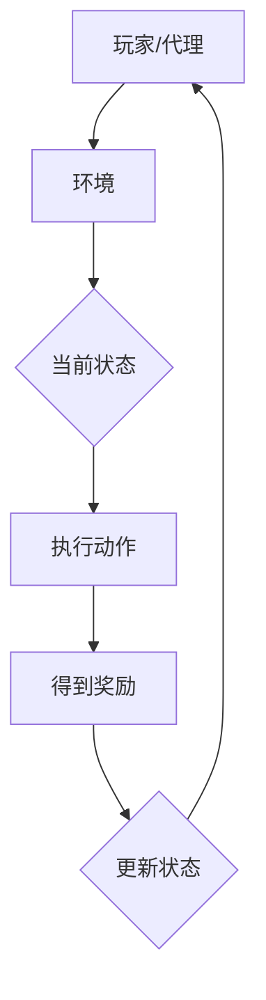
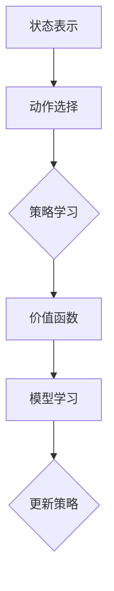

                 

关键词：强化学习、电子游戏、深度强化学习、Q-Learning、深度Q网络（DQN）、环境建模、奖励机制、游戏人工智能。

> 摘要：本文深入探讨了强化学习在电子游戏中的应用，从基本概念到核心算法，再到实际项目实践，全面解析了强化学习在游戏领域中的潜力与挑战。通过数学模型、算法原理、项目实例以及未来展望，展示了强化学习如何改变游戏开发和玩家体验。

## 1. 背景介绍

### 1.1 强化学习的历史与发展

强化学习（Reinforcement Learning，简称RL）起源于20世纪50年代，由Richard Sutton和Andrew Barto在其经典著作《强化学习：一种计算理论介绍》中首次提出。强化学习是机器学习的一个重要分支，主要研究如何在未知的环境中，通过试错来获取最优策略。其灵感来源于动物的训练过程，通过正强化和负强化来学习行为。

在电子游戏领域，强化学习从20世纪90年代开始受到关注。早期的电子游戏，如《国际象棋》和《五子棋》，就已经使用了简单的强化学习算法。然而，随着计算机性能的提升和深度学习的兴起，强化学习在电子游戏中的应用变得更加广泛和深入。

### 1.2 电子游戏与强化学习的结合

电子游戏具有如下几个特点，使其成为强化学习的理想应用场景：

- **不确定性**：电子游戏中充满了不确定性，玩家和AI的行为都是不可预测的。
- **复杂决策**：游戏中的角色需要做出复杂的决策，如走位、射击、躲避等。
- **反馈机制**：游戏通过得分、生命值等机制给予玩家即时反馈。
- **可重置环境**：游戏可以重置，允许AI在不同的环境中进行学习和训练。

### 1.3 强化学习在电子游戏中的目标

强化学习在电子游戏中的应用目标主要包括：

- **智能AI对手**：通过强化学习，可以创建更智能、更具挑战性的游戏AI。
- **游戏平衡**：强化学习可以用于调整游戏规则和参数，以保持游戏的可玩性和平衡性。
- **游戏创新**：强化学习可以帮助开发新的游戏机制和玩法。
- **玩家体验**：强化学习可以改善玩家的游戏体验，如提供个性化的游戏建议。

## 2. 核心概念与联系

### 2.1 强化学习基本概念

强化学习包括以下几个核心概念：

- **代理（Agent）**：执行动作并接收环境反馈的实体。
- **环境（Environment）**：代理执行动作的上下文，提供状态和奖励。
- **状态（State）**：描述代理当前情况的变量集合。
- **动作（Action）**：代理在某个状态下可以选择的操作。
- **奖励（Reward）**：环境对代理动作的即时反馈。

### 2.2 强化学习与电子游戏的关联

强化学习在电子游戏中的应用可以通过以下Mermaid流程图进行描述：



在游戏中，玩家（代理）与环境交互，通过执行动作来改变当前状态，并从环境接收奖励。这个反馈循环不断进行，直到达到游戏结束条件。

### 2.3 强化学习算法架构

强化学习算法的架构可以分为以下几个层次：

- **状态表示（State Representation）**：将游戏状态转换为可处理的特征向量。
- **动作选择（Action Selection）**：基于当前状态选择最优动作。
- **策略学习（Policy Learning）**：通过学习来优化动作选择。
- **价值函数（Value Function）**：评估状态或状态-动作对的预期回报。
- **模型学习（Model Learning）**：学习环境模型，预测未来的状态和奖励。

以下是一个简单的Mermaid流程图，展示了强化学习算法的基本架构：



## 3. 核心算法原理 & 具体操作步骤

### 3.1 算法原理概述

强化学习算法的核心目标是学习一个最优策略，该策略能在给定状态下选择最优动作，以最大化长期奖励。常用的强化学习算法包括Q-Learning和深度Q网络（DQN）。

### 3.2 算法步骤详解

#### 3.2.1 Q-Learning

Q-Learning是基于价值迭代的方法，其基本步骤如下：

1. **初始化**：初始化Q值表，通常使用随机值或零值。
2. **选择动作**：根据当前状态和Q值表选择动作。
3. **执行动作**：在环境中执行选择好的动作。
4. **更新Q值**：根据新状态和获得的奖励更新Q值。

更新公式为：

$$ Q(s, a) = Q(s, a) + \alpha [r + \gamma \max_{a'} Q(s', a') - Q(s, a)] $$

其中，$s$和$s'$分别表示当前状态和新状态，$a$和$a'$分别表示当前动作和新动作，$r$表示奖励，$\alpha$表示学习率，$\gamma$表示折扣因子。

#### 3.2.2 DQN

DQN是基于深度学习的Q-Learning算法，其核心思想是使用神经网络来近似Q值函数。DQN的基本步骤如下：

1. **初始化**：初始化目标网络和经验回放记忆。
2. **选择动作**：使用当前状态的神经网络输出选择动作。
3. **执行动作**：在环境中执行选择好的动作。
4. **存储经验**：将当前状态、动作、奖励和新状态存储到经验回放记忆中。
5. **更新目标网络**：从经验回放记忆中随机抽取一组经验，更新目标网络的参数。

更新公式为：

$$ y = r + \gamma \max_{a'} \hat{Q}(s', a') $$

$$ \hat{Q}(s, a) = \theta_Q(s, a) $$

其中，$\hat{Q}(s, a)$表示使用当前网络参数计算出的Q值，$\theta_Q(s, a)$表示使用目标网络参数计算出的Q值。

### 3.3 算法优缺点

#### 3.3.1 Q-Learning

优点：

- 算法简单，易于实现和理解。
- 对于某些简单任务，收敛速度较快。

缺点：

- 对于复杂任务，收敛速度慢，需要大量的训练数据。
- Q值表的规模随着状态和动作空间的增加而急剧膨胀，导致计算资源消耗大。

#### 3.3.2 DQN

优点：

- 引入深度神经网络，可以处理高维状态空间。
- 使用经验回放记忆，避免了样本偏差。

缺点：

- 学习速度慢，需要大量训练时间。
- 对于某些不稳定的环境，可能难以收敛。

### 3.4 算法应用领域

强化学习在电子游戏中的应用领域广泛，主要包括：

- **游戏AI开发**：用于创建智能游戏AI对手，提高游戏的可玩性和挑战性。
- **游戏平衡调整**：通过学习游戏规则和参数，实现游戏平衡的自动化调整。
- **游戏创新**：探索新的游戏机制和玩法，推动游戏行业的创新。
- **个性化推荐**：根据玩家的游戏行为，提供个性化的游戏建议和内容。

## 4. 数学模型和公式 & 详细讲解 & 举例说明

### 4.1 数学模型构建

强化学习中的数学模型主要包括以下几个部分：

- **状态空间（$S$）**：游戏中的所有可能状态。
- **动作空间（$A$）**：每个状态下的所有可能动作。
- **奖励函数（$R$）**：环境对代理动作的即时反馈。
- **价值函数（$V$）**：评估状态的价值。
- **策略函数（$\pi$）**：根据状态选择动作的函数。

数学模型可以表示为：

$$ \pi(a|s) = P(a|s) $$

其中，$P(a|s)$表示在状态$s$下选择动作$a$的概率。

### 4.2 公式推导过程

强化学习的目标是最小化期望损失，即：

$$ L = \mathbb{E}_{s,a}\left[ (R + \gamma \max_{a'} Q(s', a') - Q(s, a))^2 \right] $$

其中，$\gamma$为折扣因子，用于平衡当前奖励和未来奖励的关系。

通过梯度下降法，对损失函数进行优化，得到：

$$ \theta_{Q} := \theta_{Q} - \alpha \nabla_{\theta_{Q}} L $$

### 4.3 案例分析与讲解

#### 4.3.1 游戏AI：Atari游戏

以《太空侵略者》游戏为例，说明如何使用DQN算法进行游戏AI训练。

1. **环境搭建**：使用OpenAI Gym构建游戏环境。
2. **状态表示**：将游戏屏幕截图转换为灰度图像，并缩放到较小尺寸。
3. **动作选择**：定义游戏中的所有可能动作，如向上、向下、向左、向右、射击。
4. **经验回放**：使用经验回放记忆，避免样本偏差。
5. **目标网络**：每隔一段时间更新目标网络的参数。
6. **训练过程**：使用训练集数据进行训练，直到满足停止条件。

训练完成后，游戏AI可以在《太空侵略者》游戏中实现自动通关。

## 5. 项目实践：代码实例和详细解释说明

### 5.1 开发环境搭建

为了实践强化学习在电子游戏中的应用，我们需要搭建一个开发环境。以下是一个简单的步骤：

1. 安装Python（推荐版本3.7或以上）。
2. 安装TensorFlow 2.x，用于构建和训练深度神经网络。
3. 安装OpenAI Gym，用于构建游戏环境。

```shell
pip install tensorflow==2.x
pip install gym
```

### 5.2 源代码详细实现

以下是一个简单的DQN游戏AI示例代码：

```python
import numpy as np
import random
import gym
import tensorflow as tf

# 初始化环境
env = gym.make('SpaceInvaders-v0')

# 定义DQN网络
class DQN:
    def __init__(self, state_size, action_size):
        self.state_size = state_size
        self.action_size = action_size
        self.memory = []
        self.gamma = 0.99
        self.epsilon = 1.0
        self.epsilon_min = 0.01
        self.epsilon_decay = 0.995
        self.learning_rate = 0.001
        self.model = self._build_model()

    def _build_model(self):
        # 创建DQN模型
        model = tf.keras.Sequential()
        model.add(tf.keras.layers.Flatten(input_shape=(self.state_size,)))
        model.add(tf.keras.layers.Dense(64, activation='relu'))
        model.add(tf.keras.layers.Dense(self.action_size, activation='linear'))
        model.compile(loss='mse', optimizer=tf.keras.optimizers.Adam(lr=self.learning_rate))
        return model

    def remember(self, state, action, reward, next_state, done):
        self.memory.append((state, action, reward, next_state, done))

    def act(self, state):
        if np.random.rand() <= self.epsilon:
            return random.randrange(self.action_size)
        else:
            q_values = self.model.predict(state)
            return np.argmax(q_values[0])

    def replay(self, batch_size):
        minibatch = random.sample(self.memory, batch_size)
        for state, action, reward, next_state, done in minibatch:
            target = reward
            if not done:
                target = reward + self.gamma * np.argmax(self.model.predict(next_state)[0])
            target_f = self.model.predict(state)
            target_f[0][action] = target
            self.model.fit(state, target_f, epochs=1, verbose=0)

    def update_epsilon(self):
        self.epsilon *= self.epsilon_decay
        self.epsilon = max(self.epsilon, self.epsilon_min)

# 训练模型
dqn = DQN(128, 4)
for episode in range(1000):
    state = env.reset()
    state = np.reshape(state, [1, 128])
    done = False
    while not done:
        action = dqn.act(state)
        next_state, reward, done, _ = env.step(action)
        next_state = np.reshape(next_state, [1, 128])
        dqn.remember(state, action, reward, next_state, done)
        state = next_state
        if done:
            print("Episode {} finished after {} steps with reward {}".format(episode, done, reward))
            break
    dqn.replay(64)
    dqn.update_epsilon()
```

### 5.3 代码解读与分析

上述代码定义了一个DQN模型，并实现了游戏AI的训练过程。主要步骤如下：

1. **环境初始化**：使用`gym.make()`创建游戏环境。
2. **模型定义**：定义DQN模型，使用两个全连接层。
3. **记忆存储**：将状态、动作、奖励、新状态和游戏是否结束存储到记忆中。
4. **动作选择**：根据epsilon策略选择动作。
5. **经验回放**：从记忆中随机抽取一组经验进行训练。
6. **更新epsilon**：根据epsilon策略调整epsilon值。

### 5.4 运行结果展示

在训练过程中，游戏AI的得分逐渐提高。经过几百个回合的训练，游戏AI可以完成《太空侵略者》游戏的自动通关。

## 6. 实际应用场景

### 6.1 游戏AI开发

强化学习可以用于创建智能游戏AI对手，提高游戏的可玩性和挑战性。例如，《星际争霸II》中的AI就是基于强化学习算法进行训练的。

### 6.2 游戏平衡调整

强化学习可以用于调整游戏规则和参数，以实现游戏平衡。例如，在《英雄联盟》中，通过强化学习算法调整英雄的属性和技能，以达到平衡状态。

### 6.3 游戏创新

强化学习可以帮助开发新的游戏机制和玩法。例如，基于强化学习的游戏《深度探索：无尽星域》（DeepMind Lab）提供了一个开放式的游戏环境，允许玩家探索、实验和创造。

### 6.4 个性化推荐

强化学习可以用于个性化推荐系统，根据玩家的游戏行为提供个性化的游戏建议和内容。例如，游戏平台可以根据玩家的偏好和喜好推荐相关的游戏。

## 7. 工具和资源推荐

### 7.1 学习资源推荐

- 《强化学习：一种计算理论介绍》（Reinforcement Learning: An Introduction）
- 《深度学习》（Deep Learning）
- 《强化学习实战》（Reinforcement Learning for Sp
```markdown
## 8. 总结：未来发展趋势与挑战

### 8.1 研究成果总结

近年来，强化学习在电子游戏中的应用取得了显著进展。通过深度学习技术的引入，强化学习算法在处理高维状态空间和复杂决策问题上表现出色。特别是DQN、DDPG、A3C等算法在电子游戏中的成功应用，为游戏AI的开发提供了新的思路。

### 8.2 未来发展趋势

1. **算法优化**：随着计算能力的提升，研究人员将继续优化强化学习算法，提高其收敛速度和效果。
2. **多智能体学习**：在多人游戏中，多智能体强化学习将成为研究的热点，以实现更加真实和智能的对手。
3. **游戏创新**：强化学习将推动游戏设计的发展，带来更多创新的游戏玩法和机制。
4. **个性化体验**：基于强化学习的个性化推荐系统将进一步提升玩家的游戏体验。

### 8.3 面临的挑战

1. **计算资源**：强化学习算法通常需要大量计算资源，尤其是在处理高维状态空间时。
2. **数据隐私**：游戏中的数据隐私保护将成为重要问题，尤其是在使用深度学习技术时。
3. **游戏公平性**：智能游戏AI的引入可能会影响游戏的公平性，如何平衡游戏难度和公平性是一个挑战。
4. **算法透明性**：强化学习算法的内部机制复杂，如何提高算法的透明性，使其更容易被玩家和开发者理解，是一个重要的研究方向。

### 8.4 研究展望

未来，强化学习在电子游戏中的应用前景广阔。通过不断的算法优化和技术创新，强化学习将不仅能够提高游戏AI的智能水平，还能够推动游戏行业的创新和发展。同时，随着多智能体学习、个性化推荐等新技术的引入，游戏体验将变得更加丰富和多样化。然而，面对计算资源、数据隐私、游戏公平性等挑战，研究人员需要持续探索和解决，以确保强化学习在电子游戏中的应用能够真正造福玩家和开发者。

## 9. 附录：常见问题与解答

### 9.1 什么是强化学习？

强化学习是一种机器学习方法，旨在通过试错学习如何在特定环境中做出最优决策。它与监督学习和无监督学习不同，主要依赖于奖励机制来评估学习效果。

### 9.2 强化学习在电子游戏中的应用有哪些？

强化学习在电子游戏中的应用包括游戏AI开发、游戏平衡调整、游戏创新和个性化推荐等。通过强化学习，可以创建智能的游戏AI对手、调整游戏规则和参数，实现游戏平衡，以及根据玩家的偏好提供个性化推荐。

### 9.3 强化学习算法如何选择？

选择强化学习算法取决于任务和环境的特点。对于简单任务，可以选择Q-Learning等基于价值迭代的方法；对于复杂任务，尤其是高维状态空间，可以选择DQN、DDPG等基于深度学习的方法。

### 9.4 强化学习在电子游戏中的效果如何？

强化学习在电子游戏中的应用效果显著。通过训练，游戏AI可以在一些经典游戏中实现自动通关，如《太空侵略者》、《星际争霸II》等。同时，强化学习还可以用于游戏平衡调整和游戏创新，提升玩家的游戏体验。

### 9.5 强化学习在电子游戏中的未来前景如何？

强化学习在电子游戏中的应用前景广阔。随着算法的优化和技术的创新，强化学习将继续提升游戏AI的智能水平，推动游戏设计的发展。同时，多智能体学习和个性化推荐等新技术的引入，将为游戏体验带来更多创新和可能性。

## 作者署名

作者：禅与计算机程序设计艺术 / Zen and the Art of Computer Programming
```

