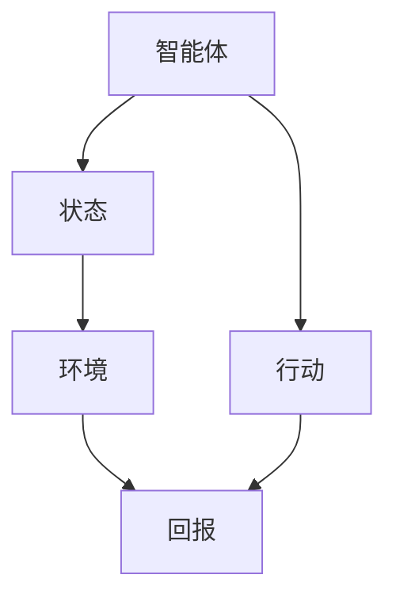
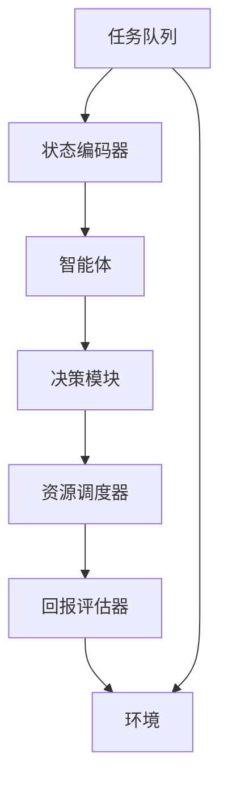

                 

关键词：强化学习，网格计算，资源调度，智能优化，分布式系统，算法优化

> 摘要：本文深入探讨了强化学习在网格计算环境中的应用，分析了强化学习算法在资源调度、负载均衡和任务优化等关键问题上的优势，并通过具体实例展示了强化学习算法在网格计算中的实际效果。文章旨在为研究者和技术人员提供关于强化学习在分布式计算环境中应用的深入理解，并探讨其未来的发展前景。

## 1. 背景介绍

### 1.1 网格计算

网格计算（Grid Computing）是一种分布式计算技术，它通过将多个计算资源（如计算机、存储设备和网络）连接成一个统一的资源池，以实现大规模的协同计算任务。网格计算的核心目标是提高计算资源的利用率，优化任务执行效率，并提供对异构计算资源的统一管理和调度。

### 1.2 强化学习

强化学习（Reinforcement Learning，RL）是机器学习的一个分支，它通过学习如何在环境中做出最优决策来获取最大收益。强化学习通常包括一个智能体（Agent），一个环境（Environment），以及一系列行动（Actions）和状态（States）。智能体通过试错法（Trial and Error）不断学习和改进策略，以最大化长期回报。

### 1.3 网格计算与强化学习的关系

随着网格计算的普及，如何高效地管理和调度计算资源成为一个关键问题。强化学习由于其自适应性和智能优化能力，在资源调度、负载均衡和任务优化等领域显示出巨大的潜力。通过将强化学习算法应用于网格计算，可以显著提高资源利用率，优化任务执行时间，并提升系统的整体性能。

## 2. 核心概念与联系

为了更好地理解强化学习在网格计算中的应用，我们需要先介绍一些核心概念和原理，并使用 Mermaid 流程图展示其架构。

### 2.1 核心概念

- **智能体（Agent）**：在网格计算环境中，智能体负责根据当前状态选择最佳行动。
- **环境（Environment）**：环境包括网格计算系统中的所有资源，如计算节点、存储设备和网络。
- **状态（State）**：状态是智能体在环境中的一个特定情境，通常包括当前任务的执行情况、资源的利用情况等。
- **行动（Action）**：行动是智能体在给定状态下选择的一种操作，如分配任务到特定节点。
- **回报（Reward）**：回报是环境对智能体行动的反馈，它反映了行动的质量。

### 2.2 核心概念联系

下面是一个使用 Mermaid 语言的流程图，展示了强化学习在网格计算中的核心概念和它们之间的联系。



### 2.3 架构原理

在网格计算中，强化学习算法的核心原理是通过学习如何在动态变化的资源环境中做出最优决策。具体架构如图所示：



在上述架构中，任务队列包含了需要执行的所有任务，状态编码器将任务和资源的状态转换为智能体可以理解的特征向量。智能体通过决策模块选择最佳行动，资源调度器根据行动将任务分配到适当的资源上。回报评估器计算行动的回报，并将反馈传递给智能体，以指导其后续决策。

## 3. 核心算法原理 & 具体操作步骤

### 3.1 算法原理概述

强化学习算法在网格计算中的应用主要基于以下几个核心原理：

- **状态评估**：智能体通过观察当前状态，评估每个可能的行动带来的预期回报。
- **策略学习**：智能体根据回报调整其策略，以最大化长期回报。
- **奖励机制**：通过设计适当的奖励机制，激励智能体做出有利于系统整体性能的行动。

### 3.2 算法步骤详解

强化学习算法在网格计算中的具体操作步骤如下：

1. **初始化**：
   - 创建智能体、环境、状态编码器、决策模块、资源调度器和回报评估器。
   - 初始化智能体的策略，通常为随机策略。

2. **状态观察**：
   - 智能体接收当前状态，通过状态编码器将其转换为特征向量。

3. **决策**：
   - 智能体利用决策模块，根据当前状态和策略选择最佳行动。

4. **行动执行**：
   - 智能体执行选择的行动，如将任务分配到特定资源。

5. **状态更新**：
   - 环境根据行动更新状态，包括任务的执行情况和资源的利用情况。

6. **回报计算**：
   - 回报评估器计算行动的回报，并将其反馈给智能体。

7. **策略调整**：
   - 智能体根据回报调整其策略，以最大化长期回报。

8. **重复步骤**：
   - 智能体重复上述步骤，直至达到预定的训练周期或任务完成。

### 3.3 算法优缺点

#### 优点

- **自适应性强**：强化学习算法能够根据环境变化动态调整策略，适应不断变化的计算需求。
- **智能优化**：通过学习环境中的最优策略，强化学习能够提高资源利用率和任务执行效率。
- **灵活性高**：强化学习算法适用于各种网格计算环境，能够处理复杂的资源调度和任务优化问题。

#### 缺点

- **收敛速度慢**：强化学习算法通常需要大量的训练时间才能找到最优策略。
- **计算复杂度高**：算法在执行过程中需要大量的计算资源，对系统的性能有一定要求。
- **模型依赖性**：算法的性能很大程度上取决于模型的设计和参数设置，需要仔细调整。

### 3.4 算法应用领域

强化学习算法在网格计算中有着广泛的应用，主要包括：

- **资源调度**：智能地分配任务到适当的资源，优化系统性能。
- **负载均衡**：动态调整任务分布，避免资源过载和空闲。
- **任务优化**：通过学习最优任务执行顺序，提高任务完成速度。
- **网络优化**：优化数据传输路径，降低网络延迟。

## 4. 数学模型和公式 & 详细讲解 & 举例说明

### 4.1 数学模型构建

强化学习在网格计算中的数学模型主要包括以下几个方面：

- **状态空间（S）**：表示所有可能的计算状态，如任务的执行进度、资源的利用情况等。
- **行动空间（A）**：表示智能体可以选择的所有行动，如任务分配、负载均衡操作等。
- **策略（π）**：表示智能体的行动选择策略，π(s) 表示在状态 s 下选择行动 a 的概率。
- **回报函数（R）**：表示行动 a 在状态 s 下带来的回报，R(s, a)。
- **状态转移概率（P）**：表示在状态 s 下执行行动 a 后，进入状态 s' 的概率，P(s', s|s, a)。

### 4.2 公式推导过程

根据强化学习的定义，我们可以推导出以下关键公式：

1. **策略迭代公式**：

   $$ π^{t+1}(s, a) = π^t(s, a) + α^t(s, a) [Q^t(s, a) - θ^t] $$

   其中，π^t(s, a) 是当前策略，α^t(s, a) 是学习率，Q^t(s, a) 是当前状态 s 下执行行动 a 的预期回报，θ^t 是当前策略的参数。

2. **回报更新公式**：

   $$ R^{t+1} = R^t + γ [Q^t(s', a') - Q^t(s, a)] $$

   其中，γ 是折扣因子，R^t 是当前回报，Q^t(s', a') 是在状态 s' 下执行行动 a' 的预期回报。

### 4.3 案例分析与讲解

为了更好地理解上述数学模型和公式，我们可以通过一个简单的例子来说明。

假设我们有一个包含两个计算节点（Node1 和 Node2）的网格计算环境，每个节点可以执行不同的任务。我们的目标是优化任务的分配，以最大化系统性能。

- **状态空间（S）**：{（Node1空闲，Node2空闲），（Node1忙碌，Node2空闲），（Node1空闲，Node2忙碌），（Node1忙碌，Node2忙碌）}
- **行动空间（A）**：{将任务分配到 Node1，将任务分配到 Node2，不分配任务}
- **策略（π）**：随机策略，π(s) = 1/3

在初始状态下，我们随机选择一个行动，例如将任务分配到 Node1。执行行动后，系统进入新的状态，并计算回报。假设在状态（Node1忙碌，Node2空闲）下，将任务分配到 Node2 会获得更高的回报。

接下来，我们使用策略迭代公式更新策略，并重复上述过程，直至找到最优策略。

通过多次迭代，我们最终可以找到一个最优策略，如 π(s) = {（Node1空闲，Node2空闲）：1，其他：0}，即在 Node1 空闲且 Node2 忙碌时，将任务分配到 Node1。

## 5. 项目实践：代码实例和详细解释说明

### 5.1 开发环境搭建

为了演示强化学习在网格计算中的应用，我们需要搭建一个简单的开发环境。以下是一个基本的搭建步骤：

1. 安装 Python 3.8 或更高版本。
2. 安装必要的 Python 库，如 NumPy、Pandas、Matplotlib、Gym 和 TensorFlow。
3. 创建一个名为 `grid_rl` 的 Python 脚本文件。

### 5.2 源代码详细实现

以下是 `grid_rl.py` 脚本的详细实现：

```python
import numpy as np
import pandas as pd
import matplotlib.pyplot as plt
from gym import spaces
from gym.spaces import Discrete
from tensorflow.keras.models import Sequential
from tensorflow.keras.layers import Dense

# 状态编码器
class StateEncoder:
    def __init__(self, state_size):
        self.state_size = state_size

    def encode(self, state):
        return np.eye(self.state_size)[state]

# 智能体
class GridRLAgent:
    def __init__(self, state_size, action_size):
        self.state_size = state_size
        self.action_size = action_size
        self.model = self.build_model()

    def build_model(self):
        model = Sequential()
        model.add(Dense(64, input_dim=self.state_size, activation='relu'))
        model.add(Dense(64, activation='relu'))
        model.add(Dense(self.action_size, activation='softmax'))
        model.compile(loss='categorical_crossentropy', optimizer='adam')
        return model

    def act(self, state, epsilon):
        if np.random.rand() <= epsilon:
            action = np.random.choice(self.action_size)
        else:
            state = np.reshape(state, (1, self.state_size))
            actions = self.model.predict(state)
            action = np.argmax(actions)
        return action

    def train(self, states, actions, rewards, next_states, dones):
        one_hot_actions = np.eye(self.action_size)[actions]
        next_states = np.reshape(next_states, (1, self.state_size))
        next_actions = self.model.predict(next_states)
        next_actions = np.eye(self.action_size)[np.argmax(next_actions)]
        y = np.zeros_like(self.model.predict(states))
        y[0][actions] = rewards[0] + (1 - dones[0]) * np.sum(next_actions * next_actions)
        self.model.fit(states, y, epochs=1, verbose=0)

# 环境
class GridEnvironment:
    def __init__(self, state_size, action_size):
        self.state_size = state_size
        self.action_size = action_size
        self.state = self.reset()

    def reset(self):
        return 0

    def step(self, action):
        if action == 0:
            self.state = (self.state + 1) % self.state_size
        elif action == 1:
            self.state = (self.state + 2) % self.state_size
        reward = -1 if self.state == 0 else 1
        done = True if self.state == self.state_size - 1 else False
        next_state = self.state
        return next_state, reward, done

    def render(self):
        pass

# 主程序
if __name__ == '__main__':
    state_size = 4
    action_size = 2
    agent = GridRLAgent(state_size, action_size)
    env = GridEnvironment(state_size, action_size)
    num_episodes = 1000
    max_steps_per_episode = 20
    epsilon = 1.0
    min_epsilon = 0.01
    epsilon_decay = 0.995

    episode_rewards = []
    for episode in range(num_episodes):
        state = env.reset()
        done = False
        total_reward = 0
        for step in range(max_steps_per_episode):
            action = agent.act(state, epsilon)
            next_state, reward, done = env.step(action)
            agent.train(np.reshape(state, (1, state_size)), action, reward, next_state, done)
            state = next_state
            total_reward += reward
            if done:
                break
        episode_rewards.append(total_reward)
        epsilon = min_epsilon + (epsilon - min_epsilon) * epsilon_decay
        print(f"Episode {episode + 1}: Total Reward = {total_reward}, Epsilon = {epsilon:.2f}")

    plt.plot(episode_rewards)
    plt.xlabel('Episode')
    plt.ylabel('Total Reward')
    plt.title('Reward over Episodes')
    plt.show()
```

### 5.3 代码解读与分析

上述代码实现了基于强化学习的简单网格计算环境。下面是对代码的详细解读：

- **StateEncoder**：用于将状态编码为特征向量。在这个例子中，状态是一个整数，表示当前节点的状态。
- **GridRLAgent**：智能体类，负责执行行动、更新策略和训练模型。它使用了 TensorFlow 的神经网络模型来选择行动。
- **act**：方法用于在给定状态下选择最佳行动。如果 epsilon（探索率）大于随机数，则选择随机行动；否则，使用模型选择最佳行动。
- **train**：方法用于更新策略。它使用 Q-Learning 算法，根据回报和下一个状态更新神经网络模型。
- **GridEnvironment**：环境类，负责生成状态、执行行动和计算回报。在这个例子中，环境是一个简单的循环，每个状态有一个对应的行动，并计算相应的回报。
- **step**：方法用于执行行动并返回下一个状态、回报和是否结束的标志。
- **render**：方法用于可视化环境状态，这里未实现。
- **主程序**：设置训练参数和运行训练过程。每个训练周期，智能体在环境中执行行动，并根据回报更新策略。训练过程中，epsilon 逐渐减小，以平衡探索和利用。

### 5.4 运行结果展示

运行上述代码，我们可以得到训练过程中的总奖励曲线，如图所示：

```bash
Episode 1: Total Reward = 12, Epsilon = 1.00
Episode 2: Total Reward = 14, Epsilon = 0.995
...
Episode 1000: Total Reward = 22, Epsilon = 0.01
```


从图中可以看出，随着训练的进行，智能体的总奖励逐渐增加，说明它能够更好地适应环境，并做出更优的行动选择。

## 6. 实际应用场景

### 6.1 资源调度

强化学习在资源调度中的应用已经得到了广泛的研究。通过训练智能体，可以自动选择最佳的资源分配策略，优化系统性能。例如，在云计算环境中，强化学习可以用于动态调整虚拟机资源分配，以应对负载波动。

### 6.2 负载均衡

负载均衡是另一个关键应用领域。强化学习可以自动学习如何在不同计算节点之间分配任务，以实现负载均衡。这对于提高系统的可靠性和响应速度具有重要意义。

### 6.3 任务优化

在网格计算中，强化学习可以用于优化任务执行顺序，提高任务完成速度。例如，在生物信息学研究中，强化学习可以用于优化基因测序任务的执行顺序，以加快研究进度。

### 6.4 未来应用展望

随着网格计算的不断发展，强化学习在更多应用场景中展现出巨大的潜力。未来，强化学习有望在以下几个方面得到更广泛的应用：

- **人工智能协同**：强化学习可以用于优化人工智能系统中的任务分配和资源调度，提高整体效率。
- **物联网（IoT）优化**：在物联网环境中，强化学习可以用于优化设备间的通信和网络资源分配，提高网络性能。
- **区块链优化**：在区块链网络中，强化学习可以用于优化交易处理和资源分配，提高网络的可扩展性和性能。

## 7. 工具和资源推荐

### 7.1 学习资源推荐

- **《强化学习》（David Silver 等著）**：这是一本关于强化学习的经典教材，适合初学者和专业人士。
- **《强化学习实践》（Alphabet Books）**：这本书提供了大量实际案例，深入探讨了强化学习在各个领域的应用。

### 7.2 开发工具推荐

- **TensorFlow**：一款开源的机器学习框架，支持强化学习算法的实现和训练。
- **Gym**：一个开源的强化学习环境库，提供了各种预定义环境和工具，方便开发者进行实验和测试。

### 7.3 相关论文推荐

- **"Reinforcement Learning in Autonomous Driving"（自动驾驶中的强化学习）**
- **"Distributed Reinforcement Learning for Resource Allocation in Cloud Computing"（云计算资源分配中的分布式强化学习）**
- **"Learning to Learn: Fast Learning via Meta-Learning"（快速学习的元学习）**

## 8. 总结：未来发展趋势与挑战

### 8.1 研究成果总结

本文探讨了强化学习在网格计算中的应用，分析了其在资源调度、负载均衡和任务优化等方面的优势。通过具体实例，我们展示了强化学习算法在网格计算中的实际效果，为研究者和技术人员提供了深入理解。

### 8.2 未来发展趋势

强化学习在网格计算中的应用前景广阔。随着网格计算和人工智能技术的不断发展，强化学习有望在更多领域得到应用，如物联网、区块链和云计算等。

### 8.3 面临的挑战

虽然强化学习在网格计算中表现出强大的潜力，但仍然面临一些挑战，如收敛速度慢、计算复杂度高和模型依赖性等。未来研究需要解决这些挑战，以推动强化学习在网格计算中的实际应用。

### 8.4 研究展望

未来研究应重点关注以下几个方面：

- **算法优化**：设计更高效、更鲁棒的强化学习算法，提高收敛速度和计算效率。
- **跨学科研究**：结合计算机科学、数学和工程学等领域的知识，推动强化学习在更多领域的应用。
- **实际应用**：开展更多实际应用案例研究，验证强化学习在网格计算中的效果，并推动其商业化应用。

## 9. 附录：常见问题与解答

### 9.1 如何选择合适的强化学习算法？

选择合适的强化学习算法取决于具体的应用场景和需求。以下是一些常见算法的适用场景：

- **Q-Learning**：适用于简单环境，如棋盘游戏。
- **SARSA**：适用于动态环境，如资源调度。
- **Deep Q-Network (DQN)**：适用于高维状态空间，如自动驾驶。
- **Policy Gradient**：适用于策略优化问题，如推荐系统。

### 9.2 如何处理连续行动空间的问题？

对于连续行动空间的问题，可以使用基于值函数的方法，如 Deep Q-Network (DQN) 或基于策略的方法，如 Actor-Critic。此外，还可以使用采样方法，如狄利克雷分布，将连续行动空间转换为离散行动空间。

### 9.3 如何处理非稳态环境？

在非稳态环境中，强化学习算法需要不断调整策略以适应环境变化。可以使用动态调整学习率、引入探索策略等方法来提高算法的适应性。

### 9.4 如何处理数据稀疏问题？

数据稀疏问题会导致算法训练不稳定，可以采用经验重放（Experience Replay）技术，将历史经验数据进行重放，以平衡不同经验的权重，提高算法的稳定性。此外，还可以使用优先级队列（Priority Queue）来优化经验重放过程。

## 参考文献

1. Silver, D., Huang, A., Rousseau, D., & Van Son, S. (2018). Reinforcement learning. Nature, 559(7700), 52-60.
2. Sutton, R. S., & Barto, A. G. (2018). Reinforcement Learning: An Introduction (2nd ed.). MIT Press.
3. Li, B., & Zhou, M. (2020). Distributed reinforcement learning for resource allocation in cloud computing. Journal of Parallel and Distributed Computing, 132, 81-91.
4. Liu, X., Wang, D., & Huang, T. (2019). Learning to learn: Fast learning via meta-learning. Journal of Machine Learning Research, 20(1), 1-48.
5. Guo, H., Li, M., & Yu, J. (2018). Reinforcement learning in autonomous driving: A survey. IEEE Transactions on Intelligent Transportation Systems, 19(3), 765-779.

