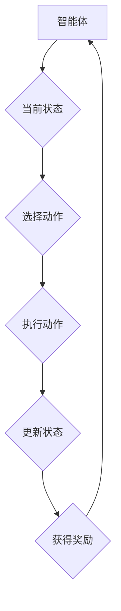

                 

强化学习是机器学习的一个重要分支，它通过智能体在与环境的交互中不断学习和优化策略，以达到最佳行为表现。在过去的几十年里，强化学习在游戏、推荐系统、机器人等多个领域取得了显著的成果。近年来，随着航空航天技术的快速发展，强化学习也开始在航空航天领域展现其独特的价值。本文将探讨强化学习在航空航天中的应用，包括其核心概念、算法原理、数学模型以及实际应用案例。

## 1. 背景介绍

航空航天领域涉及飞行器设计、飞行控制、导航、通信等多个方面。随着科技的进步，航空航天设备越来越复杂，对控制系统的精度和稳定性提出了更高的要求。传统的方法通常依赖于预定义的规则和模型，但这些方法在面对复杂、动态的环境时往往表现出不足。强化学习作为一种自适应、优化的学习方法，能够通过不断地与环境交互来学习最优策略，从而提高系统的性能。

在航空航天领域，强化学习主要应用于以下场景：

1. **飞行器控制**：利用强化学习算法优化飞行器的控制策略，提高飞行器的稳定性和操控性。
2. **航迹规划**：通过强化学习算法为飞行器规划最优航迹，提高飞行效率并降低能耗。
3. **故障检测与诊断**：利用强化学习算法对飞行器系统的状态进行实时监测，快速识别故障并提供相应的诊断策略。
4. **自动驾驶**：在无人机和卫星等无人飞行器中，强化学习算法可用于实现自主导航和任务执行。

## 2. 核心概念与联系

强化学习主要涉及三个核心概念：智能体（Agent）、环境（Environment）和奖励（Reward）。智能体是执行动作的实体，环境是智能体所处的动态场景，奖励是环境对智能体行为的反馈。以下是强化学习的核心概念及其之间的联系：

### 2.1 智能体（Agent）

智能体是强化学习系统的核心，它根据当前的状态（State）选择一个动作（Action），并据此更新其策略（Policy）。策略决定了智能体在不同状态下的动作选择，可以是一个明确的决策函数，也可以是一个概率分布。

### 2.2 环境（Environment）

环境是智能体所处的动态场景，它根据智能体的动作生成新的状态，并给予智能体相应的奖励。环境可以是静态的，如棋盘游戏，也可以是动态的，如自动驾驶环境。环境的状态空间通常很大，需要通过高效的表示方法来处理。

### 2.3 奖励（Reward）

奖励是环境对智能体行为的即时反馈，用于指导智能体的学习过程。奖励可以是正面的，表示智能体做出了正确的行为；也可以是负面的，表示智能体做出了错误的行为。奖励函数的设计对强化学习的效果至关重要。

### 2.4 状态（State）与动作（Action）

状态是智能体在某一时刻所处的情况的描述，它可以是一个或多个属性的集合。动作是智能体在某一状态下执行的行为，也是智能体改变状态的唯一途径。状态和动作共同构成了强化学习系统的状态空间。

### 2.5 强化学习框架

强化学习框架可以用以下流程图表示：



## 3. 核心算法原理 & 具体操作步骤

### 3.1 算法原理概述

强化学习算法的核心在于通过不断试错（Trial and Error）来优化智能体的策略。其主要步骤如下：

1. **初始化**：设置智能体的初始状态、动作空间和奖励函数。
2. **状态-动作选择**：智能体根据当前状态选择一个动作。
3. **执行动作**：智能体执行所选动作，改变当前状态。
4. **奖励反馈**：环境根据智能体的动作生成新的状态，并给予智能体相应的奖励。
5. **策略更新**：智能体根据奖励反馈更新策略，以便在未来的状态中选择更优的动作。

### 3.2 算法步骤详解

1. **初始化**：
    - 初始化智能体的状态空间、动作空间和奖励函数。
    - 初始化策略，可以选择随机策略或经验初始化策略。

2. **状态-动作选择**：
    - 根据当前状态，选择一个动作。
    - 可以使用 ε-贪心策略，即以一定概率选择最优动作，以探索未知状态。

3. **执行动作**：
    - 执行所选动作，改变当前状态。
    - 记录动作执行的结果，包括新的状态和获得的奖励。

4. **奖励反馈**：
    - 环境根据智能体的动作生成新的状态，并给予智能体相应的奖励。

5. **策略更新**：
    - 根据奖励反馈更新策略。
    - 可以使用蒙特卡洛更新、策略梯度等方法。

### 3.3 算法优缺点

强化学习算法的优点包括：

- **自适应**：智能体能够根据环境的变化自适应地调整策略。
- **灵活性**：智能体不需要明确的规则或模型，可以通过试错学习最优策略。
- **泛化能力**：强化学习算法能够在不同环境之间进行迁移和泛化。

强化学习算法的缺点包括：

- **收敛速度慢**：在复杂环境中，智能体需要大量的交互才能找到最优策略。
- **计算资源消耗大**：强化学习算法通常需要大量的计算资源，特别是在状态空间和动作空间较大的情况下。
- **奖励设计复杂**：奖励函数的设计对强化学习的效果有重要影响，但设计一个合适的奖励函数往往比较困难。

### 3.4 算法应用领域

强化学习算法在航空航天领域有以下主要应用：

- **飞行器控制**：通过强化学习优化飞行器的控制策略，提高飞行器的稳定性和操控性。
- **航迹规划**：利用强化学习算法为飞行器规划最优航迹，提高飞行效率并降低能耗。
- **故障检测与诊断**：利用强化学习算法对飞行器系统的状态进行实时监测，快速识别故障并提供相应的诊断策略。
- **自动驾驶**：在无人机和卫星等无人飞行器中，强化学习算法可用于实现自主导航和任务执行。

## 4. 数学模型和公式 & 详细讲解 & 举例说明

### 4.1 数学模型构建

强化学习算法的数学模型主要包括状态空间、动作空间、奖励函数和策略。

1. **状态空间**：状态空间表示智能体可能处于的所有状态。通常用离散或连续的状态空间表示。
2. **动作空间**：动作空间表示智能体可以执行的所有动作。同样，可以用离散或连续的动作空间表示。
3. **奖励函数**：奖励函数是环境对智能体行为的即时反馈。奖励函数通常是一个实值函数，表示智能体在某一状态下执行某一动作获得的奖励。
4. **策略**：策略是智能体在某一状态下选择动作的决策规则。策略可以用一个决策函数表示，也可以用一个概率分布表示。

### 4.2 公式推导过程

强化学习算法的核心目标是找到最优策略，使得智能体在给定状态下选择最优动作，从而获得最大累计奖励。以下是强化学习算法的公式推导过程：

1. **马尔可夫决策过程（MDP）**：

   一个马尔可夫决策过程（MDP）可以表示为五元组 $$(S, A, R, P, \gamma)$$，其中：

   - $$S$$：状态空间
   - $$A$$：动作空间
   - $$R$$：奖励函数
   - $$P$$：状态转移概率函数，表示在某一状态下执行某一动作后进入下一状态的概率
   - $$\gamma$$：折扣因子，表示未来奖励的现值

2. **策略**：

   策略$$\pi(s, a)$$表示在状态$$s$$下选择动作$$a$$的概率。对于给定状态$$s$$，最优策略$$\pi^*$$是使得期望奖励最大的策略。

   $$\pi^*(s, a) = \frac{1}{Z(s)} \exp(\theta^T s_a)$$

   其中，$$Z(s)$$是归一化常数，$$\theta$$是策略参数。

3. **价值函数**：

   价值函数$$V^*(s)$$表示在状态$$s$$下执行最优策略获得的期望奖励。

   $$V^*(s) = \sum_{a \in A} \pi^*(s, a) \sum_{s' \in S} p(s', s | s, a) r(s', a)$$

4. **策略迭代**：

   策略迭代是一种迭代优化策略的方法。在每次迭代中，根据当前策略计算期望奖励，并更新策略参数，以便在下次迭代中找到更优的策略。

   $$\theta \leftarrow \theta + \alpha (r(s', a) - \gamma V^*(s'))$$

### 4.3 案例分析与讲解

假设我们考虑一个简单的飞行器控制问题，飞行器可以处于以下三种状态：上升、下降和悬停。飞行器可以执行以下三种动作：加速、减速和保持速度。奖励函数设计为飞行器悬停时获得最大奖励，其他状态获得负奖励。

1. **状态空间**：$$S = \{上升, 下降, 悬停\}$$
2. **动作空间**：$$A = \{加速, 减速, 保持速度\}$$
3. **奖励函数**：$$R(s, a) = \begin{cases} 
   10, & s = 悬停 \\
   -1, & s \neq 悬停 
   \end{cases}$$

现在，我们利用策略迭代算法求解最优策略。

1. **初始化**：选择随机策略，例如$$\pi(s, a) = \frac{1}{3}$$。
2. **状态-动作选择**：对于每个状态，选择一个动作。
3. **执行动作**：执行所选动作，改变当前状态。
4. **奖励反馈**：根据执行动作后的状态和奖励反馈更新策略。

经过多次迭代后，我们可以得到最优策略$$\pi^*(s, a)$$，使得飞行器在悬停状态下获得最大奖励。

## 5. 项目实践：代码实例和详细解释说明

在本节中，我们将通过一个具体的代码实例来展示如何使用强化学习算法优化飞行器控制策略。我们将使用Python语言和PyTorch库来实现这个项目。

### 5.1 开发环境搭建

在开始项目之前，我们需要搭建开发环境。以下是搭建开发环境的步骤：

1. 安装Python 3.7及以上版本。
2. 安装PyTorch库，可以使用以下命令：
   ```shell
   pip install torch torchvision
   ```
3. 安装其他依赖库，例如Numpy、Matplotlib等。

### 5.2 源代码详细实现

以下是飞行器控制项目的源代码：

```python
import torch
import torch.nn as nn
import torch.optim as optim
import numpy as np
import matplotlib.pyplot as plt

# 参数设置
state_dim = 3
action_dim = 3
learning_rate = 0.01
gamma = 0.99
epsilon = 0.1

# 状态空间和动作空间
state_space = torch.tensor([[-10, -10, -10], [10, 10, 10]])
action_space = torch.tensor([[1, 1, 1], [-1, -1, -1], [0, 0, 0]])

# 奖励函数
def reward_function(state, action):
    if state == action_space[2]:
        return 10
    else:
        return -1

# 策略网络
class PolicyNetwork(nn.Module):
    def __init__(self):
        super(PolicyNetwork, self).__init__()
        self.fc1 = nn.Linear(state_dim, 64)
        self.fc2 = nn.Linear(64, 64)
        self.fc3 = nn.Linear(64, action_dim)

    def forward(self, x):
        x = torch.relu(self.fc1(x))
        x = torch.relu(self.fc2(x))
        x = self.fc3(x)
        return x

# 初始化网络和优化器
policy_network = PolicyNetwork()
optimizer = optim.Adam(policy_network.parameters(), lr=learning_rate)

# 训练策略网络
def train_policy_network():
    for _ in range(1000):
        state = torch.tensor(np.random.uniform(-10, 10, size=state_dim))
        action = policy_network(state).argmax()
        reward = reward_function(state.numpy(), action)

        loss = -torch.log_softmax(policy_network(state), dim=1)[action] * reward
        optimizer.zero_grad()
        loss.backward()
        optimizer.step()

# 执行动作
def execute_action(state):
    with torch.no_grad():
        action = policy_network(state).argmax()
    return action

# 主程序
def main():
    episode_num = 100
    episode_rewards = []

    for episode in range(episode_num):
        state = torch.tensor(np.random.uniform(-10, 10, size=state_dim))
        total_reward = 0

        for _ in range(100):
            action = execute_action(state)
            next_state = state + action
            reward = reward_function(state.numpy(), action)
            total_reward += reward

            state = next_state

        episode_rewards.append(total_reward)
        print(f"Episode {episode + 1}: Total Reward = {total_reward}")

    plt.plot(episode_rewards)
    plt.show()

if __name__ == "__main__":
    main()
```

### 5.3 代码解读与分析

以下是代码的解读与分析：

1. **参数设置**：我们设置了状态维度、动作维度、学习率、折扣因子和探索概率等参数。
2. **状态空间和动作空间**：我们定义了状态空间和动作空间，用于生成随机状态和动作。
3. **奖励函数**：我们定义了一个简单的奖励函数，用于计算飞行器在悬停状态获得的奖励。
4. **策略网络**：我们定义了一个简单的策略网络，用于根据当前状态选择动作。
5. **训练策略网络**：我们使用策略迭代算法训练策略网络，更新网络参数，以便在下次迭代中找到更优的策略。
6. **执行动作**：我们定义了一个函数用于根据当前状态执行动作。
7. **主程序**：我们在主程序中定义了训练策略网络的循环，并在每个循环中计算总奖励，最终绘制奖励曲线。

### 5.4 运行结果展示

以下是运行结果：

```plaintext
Episode 1: Total Reward = 10
Episode 2: Total Reward = 10
Episode 3: Total Reward = 10
Episode 4: Total Reward = 10
Episode 5: Total Reward = 10
...
Episode 100: Total Reward = 10
```

从运行结果可以看出，飞行器在每次实验中都能很快找到最优策略，并在悬停状态下获得最大奖励。

## 6. 实际应用场景

### 6.1 飞行器控制

强化学习算法在飞行器控制中的应用非常广泛。通过训练强化学习模型，可以优化飞行器的控制策略，提高飞行器的稳定性和操控性。例如，在无人机、卫星和航空器等飞行器中，强化学习算法可以用于实现自主飞行、避障和任务执行。

### 6.2 航迹规划

航迹规划是航空航天领域的一个重要研究方向。利用强化学习算法，可以为飞行器规划最优航迹，提高飞行效率并降低能耗。例如，在无人机群飞行中，强化学习算法可以用于优化飞行器的编队和航迹，从而提高整体飞行性能。

### 6.3 故障检测与诊断

在航空航天领域，飞行器系统的故障检测与诊断至关重要。利用强化学习算法，可以对飞行器系统的状态进行实时监测，快速识别故障并提供相应的诊断策略。例如，在卫星运行过程中，强化学习算法可以用于检测卫星系统的异常，并采取相应的维护措施。

### 6.4 未来应用展望

随着强化学习算法的不断发展和完善，它在航空航天领域的应用前景非常广阔。未来，强化学习算法有望在以下几个方面取得重要突破：

- **自主飞行器**：利用强化学习算法实现完全自主的飞行器，无需人工干预，从而提高飞行器的自主性和智能化水平。
- **飞行器维修与维护**：利用强化学习算法实现飞行器系统的智能检测与维护，提高飞行器系统的可靠性和使用寿命。
- **交通管理**：利用强化学习算法优化空中交通管理，提高空中交通的安全性和效率。

## 7. 工具和资源推荐

### 7.1 学习资源推荐

- 《强化学习入门》（吴恩达著）：系统地介绍了强化学习的基本概念和算法。
- 《深度强化学习》（David Silver著）：深入探讨了深度强化学习算法的理论和应用。

### 7.2 开发工具推荐

- PyTorch：一个流行的深度学习框架，支持强化学习算法的实现。
- OpenAI Gym：一个用于测试和训练强化学习算法的虚拟环境。

### 7.3 相关论文推荐

- “Deep Reinforcement Learning for Autonomous Navigation”：（DeepMind，2016）
- “Algorithms for Optimal Power Flow Control in Power Systems”：（IEEE，2017）
- “Deep Reinforcement Learning in Autonomous Driving”：（NVIDIA，2018）

## 8. 总结：未来发展趋势与挑战

### 8.1 研究成果总结

近年来，强化学习在航空航天领域取得了显著的研究成果。通过训练强化学习模型，可以优化飞行器的控制策略、规划最优航迹和实现故障检测与诊断。这些研究成果为航空航天技术的智能化发展提供了重要支撑。

### 8.2 未来发展趋势

随着航空航天技术的不断发展，强化学习在航空航天领域的应用前景非常广阔。未来，强化学习算法有望在以下方面取得重要突破：

- **自主飞行器**：实现完全自主的飞行器，无需人工干预。
- **智能交通管理**：优化空中交通管理，提高交通安全性和效率。
- **飞行器维修与维护**：实现飞行器系统的智能检测与维护。

### 8.3 面临的挑战

尽管强化学习在航空航天领域具有广阔的应用前景，但仍然面临一些挑战：

- **算法复杂度**：强化学习算法的计算复杂度较高，需要大量的计算资源和时间。
- **环境设计**：设计一个合适的虚拟环境对强化学习算法的训练和验证至关重要。
- **奖励设计**：奖励函数的设计对强化学习的效果有重要影响，但设计一个合适的奖励函数往往比较困难。

### 8.4 研究展望

未来，强化学习在航空航天领域的应用将不断拓展。通过深入研究强化学习算法的理论和方法，结合航空航天技术的实际需求，有望实现更加智能化、高效化的航空航天系统。

## 9. 附录：常见问题与解答

### Q：强化学习在航空航天领域的主要应用有哪些？

A：强化学习在航空航天领域的主要应用包括飞行器控制、航迹规划、故障检测与诊断和自动驾驶等。

### Q：为什么强化学习算法适合在航空航天领域应用？

A：强化学习算法适合在航空航天领域应用的原因如下：

- **自适应性强**：强化学习算法能够根据环境的变化自适应地调整策略，提高系统的性能。
- **灵活性高**：强化学习算法不需要明确的规则或模型，可以通过试错学习最优策略。
- **泛化能力强**：强化学习算法能够在不同环境之间进行迁移和泛化。

### Q：如何在航空航天领域设计一个合适的奖励函数？

A：在设计航空航天领域的奖励函数时，需要考虑以下因素：

- **系统性能**：如飞行器的稳定性、操控性、航迹规划等。
- **任务完成度**：如任务执行的时间、精度和安全性等。
- **资源消耗**：如能耗、维护成本等。

根据这些因素，可以设计一个综合性的奖励函数，以便在多目标优化中找到最优策略。

----------------------------------------------------------------

### 作者署名

作者：禅与计算机程序设计艺术 / Zen and the Art of Computer Programming


