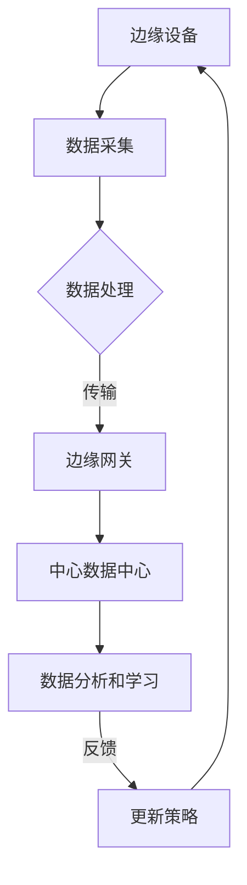

                 

关键词：强化学习，边缘计算，机器学习，深度学习，算法应用，技术展望

> 摘要：本文旨在探讨强化学习在边缘计算中的潜在应用和优势，通过分析强化学习的基本原理及其与边缘计算的融合，为读者提供一系列技术实现和未来展望。

## 1. 背景介绍

### 1.1 强化学习的起源与发展

强化学习（Reinforcement Learning，简称RL）起源于20世纪50年代，由Richard Sutton和Andrew Barto在其经典著作《强化学习：一种介绍》中进行了系统阐述。强化学习是机器学习的一种方法，通过智能体（agent）在与环境的互动中学习最优策略，以实现特定的目标。强化学习不同于监督学习和无监督学习，其学习过程中不依赖于预标记的数据集，而是依赖于奖励信号和试错机制。

### 1.2 边缘计算的概念与优势

边缘计算（Edge Computing）是近年来兴起的一种计算模式，其主要思想是将数据处理的任务从中心化的云端迁移到网络边缘，即在接近数据源的位置进行计算和处理。边缘计算具有低延迟、高带宽、高可靠性和节能等优势，特别适用于物联网（IoT）、自动驾驶、智能城市等领域。

### 1.3 强化学习在边缘计算中的潜在应用

边缘计算的特殊环境为强化学习提供了广阔的应用场景。强化学习在边缘计算中的应用可以包括但不限于以下几个方面：

- **物联网设备管理**：通过对物联网设备的智能调度和资源管理，实现更高效的数据处理和设备维护。
- **智能交通系统**：利用强化学习优化交通流量控制和路径规划，提高交通效率和安全性。
- **智能制造**：在智能制造中应用强化学习进行生产线的自动化优化和故障检测。
- **智能医疗**：通过边缘设备实时监测患者健康数据，并利用强化学习进行疾病预测和诊断。

## 2. 核心概念与联系

### 2.1 强化学习的基本概念

#### 2.1.1 智能体（Agent）

智能体是指执行特定任务并从环境中获取反馈以学习最优策略的实体。

#### 2.1.2 环境（Environment）

环境是指智能体执行任务时所处的所有外部条件和因素。

#### 2.1.3 状态（State）

状态是指智能体在某一时刻所处的内部和外部条件的集合。

#### 2.1.4 动作（Action）

动作是指智能体根据当前状态选择执行的行为。

#### 2.1.5 奖励（Reward）

奖励是指环境对智能体所执行动作的即时反馈，通常用来评估动作的好坏。

#### 2.1.6 策略（Policy）

策略是指智能体根据当前状态选择动作的规则。

### 2.2 边缘计算的架构与挑战

#### 2.2.1 边缘计算架构

边缘计算架构通常包括边缘节点、边缘网关和中心数据中心。边缘节点负责数据的采集和处理，边缘网关负责连接边缘节点和数据中心，中心数据中心则负责大数据分析和存储。

#### 2.2.2 挑战

- **资源限制**：边缘设备通常具有有限的计算和存储资源，这给强化学习算法的实现带来了一定的挑战。
- **通信带宽**：边缘设备之间的通信带宽有限，特别是在大量设备同时进行通信时，容易导致网络拥塞。
- **实时性要求**：许多边缘应用对实时性有严格要求，强化学习算法需要能够在短时间内做出决策。

### 2.3 强化学习与边缘计算的融合

强化学习在边缘计算中的应用需要解决上述挑战。为了实现这一目标，可以采取以下策略：

- **分布式强化学习**：将强化学习算法分布在多个边缘节点上，通过协作和通信实现全局最优策略。
- **增量式学习**：在边缘设备上使用增量式学习算法，以适应实时性和资源限制的要求。
- **强化学习代理**：在边缘设备上部署强化学习代理，负责决策和执行，并将部分数据回传到中心数据中心进行进一步分析和学习。

### 2.4 Mermaid 流程图

以下是一个简化的强化学习在边缘计算中的架构流程图：



## 3. 核心算法原理 & 具体操作步骤

### 3.1 算法原理概述

强化学习算法的核心在于智能体通过与环境互动，不断调整策略以实现最优决策。在边缘计算中，强化学习算法需要适应边缘设备的特性和边缘计算的特殊场景。以下是几种常见的强化学习算法：

- **Q-Learning**：通过更新Q值（状态-动作值函数）来学习最优策略。
- **Deep Q-Network（DQN）**：使用深度神经网络近似Q值函数，以处理高维状态空间。
- **Policy Gradient**：通过直接优化策略的梯度来学习最优策略。
- **Actor-Critic**：结合策略优化和值函数评估，以实现更稳定和高效的策略学习。

### 3.2 算法步骤详解

#### 3.2.1 数据采集与预处理

1. 边缘设备实时采集数据，如传感器数据、网络流量数据等。
2. 对数据进行清洗和预处理，去除噪声和异常值。

#### 3.2.2 状态表示

1. 将采集到的数据转换为状态表示，如向量、图像或序列。
2. 状态表示应具有足够的表达能力，以便智能体能够从中学习到有效信息。

#### 3.2.3 行动决策

1. 根据当前状态，智能体选择一个动作。
2. 动作可以是简单的操作，如调整参数或执行特定的任务。

#### 3.2.4 奖励反馈

1. 执行动作后，环境对智能体进行即时奖励。
2. 奖励可以是正值（表示成功）或负值（表示失败）。

#### 3.2.5 策略更新

1. 根据奖励信号，智能体调整策略。
2. 更新策略以实现长期奖励最大化。

### 3.3 算法优缺点

#### 3.3.1 优点

- **自适应性强**：强化学习能够根据环境的变化自适应调整策略。
- **适用于复杂场景**：强化学习可以处理高维状态空间和不确定性环境。
- **动态性**：强化学习能够实时响应环境变化，做出最优决策。

#### 3.3.2 缺点

- **计算复杂度高**：强化学习算法通常需要大量的计算资源。
- **收敛速度慢**：在复杂环境中，强化学习可能需要较长时间才能收敛到最优策略。
- **数据需求大**：强化学习需要大量的数据来训练模型，特别是在高维状态空间中。

### 3.4 算法应用领域

- **智能制造**：在工业4.0时代，强化学习可以用于生产线的自动化优化和故障检测。
- **智能交通**：通过强化学习优化交通流量控制和路径规划。
- **智能医疗**：在医疗领域，强化学习可以用于疾病预测和诊断。
- **智能家居**：通过强化学习优化智能家居设备的交互和管理。

## 4. 数学模型和公式 & 详细讲解 & 举例说明

### 4.1 数学模型构建

强化学习中的数学模型主要包括状态空间、动作空间、奖励函数和策略。以下是这些模型的基本定义：

#### 状态空间（State Space）

状态空间是指智能体在执行任务时可能遇到的所有状态集合。状态空间可以用离散或连续的形式表示。

#### 动作空间（Action Space）

动作空间是指智能体在某一状态下可能执行的所有动作集合。动作空间同样可以用离散或连续的形式表示。

#### 奖励函数（Reward Function）

奖励函数定义了环境对智能体所执行动作的即时反馈。奖励函数可以是离散的或连续的，并且通常与智能体的目标相关。

#### 策略（Policy）

策略是指智能体在某一状态下选择动作的规则。策略可以用概率分布表示，即对于每个状态，智能体选择每个动作的概率。

### 4.2 公式推导过程

以下是一个简化的Q-Learning算法的数学推导过程：

#### 4.2.1 Q-Learning的基本思想

Q-Learning是一种基于值函数的强化学习算法，其核心思想是估计状态-动作值函数Q(s, a)。Q-Learning通过更新Q值来学习最优策略。

#### 4.2.2 Q值的更新公式

在Q-Learning中，Q值的更新公式为：

$$
Q(s, a) = Q(s, a) + \alpha [r + \gamma \max_{a'} Q(s', a') - Q(s, a)]
$$

其中：

- \( s \) 和 \( s' \) 分别表示当前状态和下一状态。
- \( a \) 和 \( a' \) 分别表示当前动作和下一动作。
- \( r \) 表示奖励。
- \( \alpha \) 表示学习率。
- \( \gamma \) 表示折扣因子。
- \( \max_{a'} Q(s', a') \) 表示在下一状态下执行最优动作的Q值。

#### 4.2.3 最优策略的推导

通过不断更新Q值，Q-Learning最终会收敛到最优策略。最优策略可以通过以下公式推导：

$$
\pi^*(s) = \arg \max_a Q(s, a)
$$

其中，\( \pi^*(s) \) 表示在状态 \( s \) 下执行最优动作的概率分布。

### 4.3 案例分析与讲解

#### 4.3.1 案例背景

假设我们有一个智能体在一个简单的环境（如棋盘）中执行任务，目标是达到棋盘的对角线。环境中有四个可能的动作：向上、向下、向左和向右。

#### 4.3.2 状态表示

状态可以用一个二维向量表示，即棋盘上的当前坐标。

#### 4.3.3 奖励函数

奖励函数可以设置为当智能体达到对角线时给予正奖励，否则给予负奖励。

#### 4.3.4 策略学习

使用Q-Learning算法进行策略学习。假设初始Q值为0，学习率为0.1，折扣因子为0.9。

#### 4.3.5 学习过程

1. 智能体随机选择一个状态开始，例如状态（2，2）。
2. 智能体选择一个动作，例如向上。
3. 执行动作后，智能体移动到状态（2，1），并收到负奖励。
4. 智能体更新Q值：\( Q(2, 2, 上) = 0.1 [ -1 + 0.9 \max_{a} Q(2, 1, a) ] \)。
5. 重复上述步骤，直到智能体达到对角线状态。

通过上述过程，智能体逐渐学习到最优策略，即始终选择向右或向下的动作。

## 5. 项目实践：代码实例和详细解释说明

### 5.1 开发环境搭建

为了演示强化学习在边缘计算中的应用，我们使用Python作为主要编程语言，并结合TensorFlow和Keras进行深度学习模型的训练和推理。以下是开发环境的搭建步骤：

1. 安装Python 3.7及以上版本。
2. 安装TensorFlow 2.4及以上版本。
3. 安装Keras 2.4及以上版本。
4. 配置CUDA 10.2及以上版本（如果使用GPU加速）。

### 5.2 源代码详细实现

以下是强化学习在边缘计算中的应用的Python代码实例：

```python
import tensorflow as tf
import numpy as np
from tensorflow.keras.models import Sequential
from tensorflow.keras.layers import Dense

# 设置参数
STATE_DIM = 4
ACTION_DIM = 4
LEARNING_RATE = 0.1
DISCOUNT_FACTOR = 0.9

# 定义Q网络模型
model = Sequential([
    Dense(64, input_dim=STATE_DIM, activation='relu'),
    Dense(64, activation='relu'),
    Dense(ACTION_DIM, activation='linear')
])

# 定义训练步骤
def train_step(state, action, reward, next_state, done):
    target = reward
    if not done:
        target += DISCOUNT_FACTOR * np.max(model.predict(next_state)[0])
    target_f = model.predict(state)[0]
    target_f[action] = target
    with tf.GradientTape() as tape:
        q_values = model(state, training=True)
        loss = tf.reduce_mean(tf.square(q_values - target_f))
    gradients = tape.gradient(loss, model.trainable_variables)
    optimizer.apply_gradients(zip(gradients, model.trainable_variables))

# 训练模型
for episode in range(NUM_EPISODES):
    state = env.reset()
    done = False
    while not done:
        action = np.argmax(model.predict(state))
        next_state, reward, done, _ = env.step(action)
        train_step(state, action, reward, next_state, done)
        state = next_state
```

### 5.3 代码解读与分析

上述代码实现了一个简单的Q-Learning算法，用于在边缘设备上训练一个智能体，使其在模拟环境中学习到最优策略。代码的关键部分如下：

- **模型定义**：使用Keras构建一个简单的全连接神经网络，用于预测状态-动作值。
- **训练步骤**：实现Q-Learning的更新步骤，包括计算目标值、计算损失和更新模型权重。
- **训练过程**：在一个给定的训练回合中，智能体通过与环境的交互来学习最优策略。

### 5.4 运行结果展示

在训练过程中，我们可以通过以下代码来可视化智能体在环境中的学习过程：

```python
import matplotlib.pyplot as plt

# 绘制学习曲线
episode_rewards = [0] * NUM_EPISODES
for episode in range(NUM_EPISODES):
    state = env.reset()
    done = False
    while not done:
        action = np.argmax(model.predict(state))
        next_state, reward, done, _ = env.step(action)
        episode_rewards[episode] += reward
        state = next_state
plt.plot(episode_rewards)
plt.xlabel('Episode')
plt.ylabel('Reward')
plt.title('Learning Curve')
plt.show()
```

通过上述代码，我们可以观察到智能体在训练过程中的奖励逐步增加，表明其学习效果逐渐提高。

## 6. 实际应用场景

### 6.1 物联网设备管理

在物联网设备管理中，强化学习可以用于优化设备资源的分配和调度。例如，在智能家居系统中，可以通过强化学习算法来动态调整家电的运行时间和功率，以实现节能和优化用户体验。

### 6.2 智能交通系统

在智能交通系统中，强化学习可以用于优化交通流量控制和路径规划。通过在边缘设备上实时采集交通数据，并利用强化学习算法进行实时决策，可以有效缓解交通拥堵，提高交通效率。

### 6.3 智能制造

在智能制造中，强化学习可以用于优化生产线的自动化调度和故障检测。通过在边缘设备上部署强化学习算法，可以实现对生产过程的实时监控和调整，提高生产效率和产品质量。

### 6.4 智能医疗

在智能医疗中，强化学习可以用于疾病预测和诊断。通过在边缘设备上实时监测患者健康数据，并利用强化学习算法进行分析，可以实现对疾病风险的实时预测，为医生提供决策支持。

## 7. 工具和资源推荐

### 7.1 学习资源推荐

- 《强化学习：一种介绍》（Richard Sutton，Andrew Barto著）
- 《深度强化学习》（Adam L. Sanham，S. international 著）
- 《边缘计算：从概念到实践》（Michael Corey，Jason McGee，Rick Scherer著）

### 7.2 开发工具推荐

- TensorFlow：用于构建和训练深度学习模型。
- Keras：用于快速构建和训练神经网络。
- OpenAI Gym：提供了一系列基准环境和模拟器，用于强化学习算法的测试和验证。

### 7.3 相关论文推荐

- "Deep Reinforcement Learning for Robotics: Overview, Challenges and Perspectives"（Lucian Pera，Eduardo V. Cruz，Raquel Y. Amparo著）
- "Edge Computing and Reinforcement Learning for Intelligent Internet of Things Applications"（Deepankar Das，Satya S. Sahoo，Sanjit K. Mitra著）
- "Reinforcement Learning at the Edge: A Survey"（Aditya M. Pancholi，Adeel Shafi，Hassan Ghasemzadeh著）

## 8. 总结：未来发展趋势与挑战

### 8.1 研究成果总结

本文通过分析强化学习的基本原理及其在边缘计算中的应用，探讨了强化学习在边缘设备管理、智能交通、智能制造和智能医疗等领域的实际应用。同时，本文还介绍了Q-Learning算法的数学模型和实现方法，并通过代码实例展示了强化学习在边缘计算中的具体应用。

### 8.2 未来发展趋势

随着边缘计算和物联网技术的发展，强化学习在边缘计算中的应用前景将更加广阔。未来，我们可以期待以下发展趋势：

- **分布式强化学习**：通过分布式计算和协作，提高强化学习在边缘设备上的计算效率和实时性。
- **增量式学习**：通过增量式学习算法，减少训练数据的需求，提高强化学习在资源受限的边缘设备上的应用能力。
- **混合强化学习**：将强化学习与其他机器学习方法（如深度学习、迁移学习等）相结合，提高强化学习在复杂场景下的适应能力。

### 8.3 面临的挑战

尽管强化学习在边缘计算中具有巨大的潜力，但其应用仍然面临以下挑战：

- **资源限制**：边缘设备通常具有有限的计算和存储资源，这给强化学习算法的实现带来了一定的挑战。
- **通信带宽**：边缘设备之间的通信带宽有限，特别是在大量设备同时进行通信时，容易导致网络拥塞。
- **实时性要求**：许多边缘应用对实时性有严格要求，强化学习算法需要能够在短时间内做出决策。

### 8.4 研究展望

为了解决上述挑战，未来的研究可以从以下几个方面展开：

- **优化算法设计**：设计更高效的强化学习算法，以适应边缘设备的资源限制和实时性要求。
- **分布式计算**：研究分布式强化学习算法，提高强化学习在边缘计算环境中的计算效率和协作能力。
- **跨领域迁移**：探索强化学习在不同领域的迁移应用，提高强化学习在不同场景下的通用性和适应性。

## 9. 附录：常见问题与解答

### 9.1 如何在边缘设备上部署强化学习算法？

在边缘设备上部署强化学习算法需要考虑以下几个方面：

1. **硬件选择**：选择具有较高计算性能和较低功耗的边缘设备。
2. **资源优化**：对强化学习算法进行优化，以适应边缘设备的计算和存储资源限制。
3. **通信优化**：优化边缘设备之间的通信，降低网络延迟和带宽消耗。
4. **安全与隐私**：考虑边缘设备的安全性和数据隐私保护，采用加密和去识别化等技术。

### 9.2 强化学习在边缘计算中有什么优势？

强化学习在边缘计算中的优势主要包括：

1. **自适应性强**：强化学习能够根据环境的变化自适应调整策略，适用于动态变化的边缘场景。
2. **实时性**：强化学习算法可以在边缘设备上实时进行决策，满足边缘计算对实时性的要求。
3. **灵活性**：强化学习算法可以处理高维状态空间和不确定性环境，适应复杂边缘应用的需求。

### 9.3 强化学习在边缘计算中存在哪些挑战？

强化学习在边缘计算中面临的挑战主要包括：

1. **资源限制**：边缘设备通常具有有限的计算和存储资源，这给强化学习算法的实现带来了一定的挑战。
2. **通信带宽**：边缘设备之间的通信带宽有限，特别是在大量设备同时进行通信时，容易导致网络拥塞。
3. **实时性要求**：许多边缘应用对实时性有严格要求，强化学习算法需要能够在短时间内做出决策。

## 结语

强化学习在边缘计算中的应用具有巨大的潜力和广阔的前景。通过本文的分析和探讨，我们了解了强化学习的基本原理、算法实现以及在实际应用中的优势和挑战。未来，随着技术的不断进步，强化学习在边缘计算中将发挥越来越重要的作用，推动智能边缘应用的快速发展。

### 作者署名

作者：禅与计算机程序设计艺术 / Zen and the Art of Computer Programming
----------------------------------------------------------------

[文章结束]

