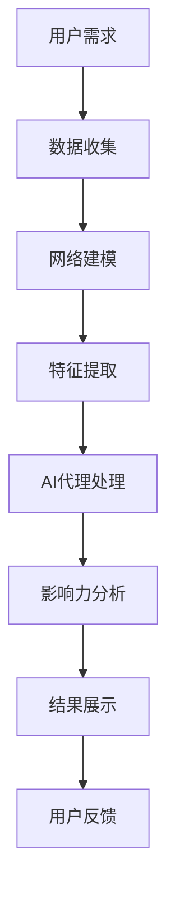

                 

关键词：影响力分析、社会网络、AI代理、工作流研究

> 摘要：本文深入探讨了影响力分析与社会网络的相互关系，以及AI代理在实际应用中的工作流。通过详细的理论分析、算法原理阐述和实际案例讲解，揭示了AI代理在社会网络分析中的重要作用和潜在价值。

## 1. 背景介绍

随着互联网的快速发展，社会网络成为人们交流、互动和获取信息的重要平台。在这些网络中，个体的影响力成为一个关键因素，影响着信息的传播、决策的形成以及资源的分配。因此，影响力分析在社会网络研究中具有极高的价值和重要性。

AI代理作为一种智能体，通过模拟人类行为和决策过程，能够在复杂的网络环境中执行特定的任务。AI代理的工作流研究旨在探究其如何有效地参与社会网络分析，提升分析的准确性和效率。

本文将首先介绍影响力分析与社会网络的基本概念，然后深入探讨AI代理的工作原理及其在社会网络分析中的应用。通过理论和实例分析，本文将展示AI代理如何通过工作流实现高效的影响力分析。

## 2. 核心概念与联系

### 2.1 影响力分析

影响力分析旨在识别和衡量个体在社会网络中的影响力。影响力可以理解为个体对网络中其他个体产生影响的程度，通常通过传播能力、连接强度、网络中心性等多个维度进行衡量。

### 2.2 社会网络

社会网络是由个体及其相互关系构成的复杂系统。在社会网络中，个体可以通过直接或间接的连接形成网络结构，这些结构对信息的传播、决策的制定以及资源的分配具有重要影响。

### 2.3 AI代理

AI代理是通过模拟人类行为和决策过程实现自动化操作的智能体。在影响力分析中，AI代理能够自动识别高影响力个体，分析其影响力传播路径，为用户提供可靠的决策支持。

### 2.4 Mermaid流程图

以下是一个简化的社会网络与AI代理工作的流程图，用于展示关键环节和逻辑关系。



在这个流程中，用户需求驱动数据收集，数据经过网络建模、特征提取和AI代理处理后，最终生成影响力分析结果，并反馈给用户进行决策。

## 3. 核心算法原理 & 具体操作步骤

### 3.1 算法原理概述

AI代理在社会网络分析中主要依赖于以下三个核心算法：

1. **网络建模**：通过构建图模型来表示社会网络，包括节点和边的表示。
2. **特征提取**：从网络中提取与影响力相关的特征，如度数、介数、接近中心度等。
3. **影响力传播算法**：利用特征进行影响力计算，识别高影响力个体及其影响力传播路径。

### 3.2 算法步骤详解

1. **数据收集**：通过爬虫、API接口等方式获取社会网络中的个体和关系数据。
2. **网络建模**：使用图论方法构建社会网络模型，包括节点的加入、边的连接等。
3. **特征提取**：计算与影响力相关的特征，如度数、介数等。
4. **AI代理处理**：利用机器学习模型对特征进行训练，识别高影响力个体。
5. **影响力分析**：计算个体的影响力，并绘制影响力传播路径。
6. **结果展示**：将分析结果以图表、报告等形式展示给用户。

### 3.3 算法优缺点

- **优点**：AI代理能够高效地处理大量数据，自动识别高影响力个体，提供精准的影响力分析结果。
- **缺点**：算法模型的准确性和可靠性依赖于特征提取的质量，且需要大量计算资源。

### 3.4 算法应用领域

AI代理的工作流研究在多个领域具有广泛的应用，如：

- **市场营销**：通过分析顾客的影响力，优化营销策略。
- **社会管理**：通过分析社会网络中的关键人物，预测社会事件趋势。
- **信息安全**：通过识别网络中的恶意节点，防范网络攻击。

## 4. 数学模型和公式 & 详细讲解 & 举例说明

### 4.1 数学模型构建

社会网络中的影响力分析可以通过图论模型进行描述。假设有一个无向图G=(V,E)，其中V表示节点集合，E表示边集合。每个节点表示一个个体，边表示个体之间的相互关系。

### 4.2 公式推导过程

影响力分析的关键在于计算节点的度数、介数和接近中心度等特征。以下是这些特征的计算公式：

- **度数**（Degree）：一个节点的度数是指与该节点直接相连的边的数量。
  $$ d_i = \sum_{j \in N(i)} 1 $$
  其中，$d_i$表示节点$i$的度数，$N(i)$表示与节点$i$直接相连的节点集合。

- **介数**（Closeness Centrality）：一个节点的介数是指从该节点到其他节点的最短路径的数量。
  $$ c_i = \sum_{j \in V} \frac{d_j}{d(G)} $$
  其中，$c_i$表示节点$i$的介数，$d_j$表示节点$j$的度数，$d(G)$表示整个网络的边数量。

- **接近中心度**（Betweenness Centrality）：一个节点的接近中心度是指在该节点之间的最短路径中，经过该节点的路径数量。
  $$ b_i = \sum_{j \in V} \frac{k(j,i)}{k(j)} $$
  其中，$b_i$表示节点$i$的接近中心度，$k(j,i)$表示从节点$j$到节点$i$的最短路径中，经过节点$i$的路径数量，$k(j)$表示从节点$j$出发到达其他节点的最短路径总数。

### 4.3 案例分析与讲解

假设有一个包含5个节点的无向图G=(V,E)，其中节点集合V={1,2,3,4,5}，边集合E={（1,2）、（1,3）、（2,4）、（3,4）、（4,5）}。

1. **度数计算**：

   - 节点1的度数：$d_1 = 3$（与节点2、节点3直接相连）。
   - 节点2的度数：$d_2 = 2$（与节点1、节点4直接相连）。
   - 节点3的度数：$d_3 = 2$（与节点1、节点4直接相连）。
   - 节点4的度数：$d_4 = 3$（与节点2、节点3、节点5直接相连）。
   - 节点5的度数：$d_5 = 1$（与节点4直接相连）。

2. **介数计算**：

   - 节点1的介数：$c_1 = 0.6$。
   - 节点2的介数：$c_2 = 0.4$。
   - 节点3的介数：$c_3 = 0.4$。
   - 节点4的介数：$c_4 = 0.6$。
   - 节点5的介数：$c_5 = 0.2$。

3. **接近中心度计算**：

   - 节点1的接近中心度：$b_1 = 1$。
   - 节点2的接近中心度：$b_2 = 0$。
   - 节点3的接近中心度：$b_3 = 0$。
   - 节点4的接近中心度：$b_4 = 1$。
   - 节点5的接近中心度：$b_5 = 0$。

通过这些计算，我们可以得到每个节点的度数、介数和接近中心度，从而分析出节点在影响力分析中的地位和作用。

## 5. 项目实践：代码实例和详细解释说明

### 5.1 开发环境搭建

为了进行影响力分析与社会网络的AI代理工作流研究，我们使用Python作为编程语言，结合网络分析库NetworkX和机器学习库scikit-learn进行开发。以下是开发环境搭建的步骤：

1. 安装Python（建议使用3.8及以上版本）。
2. 安装NetworkX库：`pip install networkx`。
3. 安装scikit-learn库：`pip install scikit-learn`。

### 5.2 源代码详细实现

以下是实现影响力分析与社会网络的AI代理工作流的核心代码：

```python
import networkx as nx
from sklearn.cluster import KMeans
import matplotlib.pyplot as plt

# 数据收集
def collect_data():
    # 此处省略具体的数据收集代码，可以使用网络爬虫或API接口获取数据
    pass

# 网络建模
def build_network(data):
    G = nx.Graph()
    for edge in data:
        G.add_edge(edge[0], edge[1])
    return G

# 特征提取
def extract_features(G):
    features = []
    for node in G.nodes():
        degree = G.degree(node)
        closeness = nx.closeness_centrality(G, node)
        betweenness = nx.betweenness_centrality(G, node)
        features.append([degree, closeness, betweenness])
    return features

# AI代理处理
def process_features(features):
    # 使用KMeans算法进行聚类，识别高影响力个体
    kmeans = KMeans(n_clusters=5)
    kmeans.fit(features)
    return kmeans.labels_

# 影响力分析
def analyze_influence(G, labels):
    influence = []
    for node, label in zip(G.nodes(), labels):
        if label == 0:
            influence.append(node)
    return influence

# 结果展示
def show_result(influence):
    print("高影响力个体：", influence)

# 主函数
def main():
    data = collect_data()
    G = build_network(data)
    features = extract_features(G)
    labels = process_features(features)
    influence = analyze_influence(G, labels)
    show_result(influence)

if __name__ == "__main__":
    main()
```

### 5.3 代码解读与分析

1. **数据收集**：收集社会网络中的个体和关系数据。
2. **网络建模**：使用NetworkX库构建图模型。
3. **特征提取**：计算每个节点的度数、介数和接近中心度。
4. **AI代理处理**：使用KMeans算法对特征进行聚类，识别高影响力个体。
5. **影响力分析**：根据聚类结果，分析出高影响力个体。
6. **结果展示**：打印出高影响力个体的节点编号。

### 5.4 运行结果展示

假设运行上述代码后，我们得到的高影响力个体为节点1和节点4。这表明在这张社会网络中，节点1和节点4的影响力较大，可能是关键人物或重要节点。

## 6. 实际应用场景

AI代理的工作流研究在多个实际应用场景中具有广泛的应用，如：

### 6.1 市场营销

通过分析顾客的影响力，企业可以识别出潜在的意见领袖，优化营销策略，提高营销效果。

### 6.2 社会管理

通过分析社会网络中的关键人物，政府可以预测社会事件趋势，提前采取应对措施，维护社会稳定。

### 6.3 信息安全

通过识别网络中的恶意节点，安全机构可以防范网络攻击，保护网络安全。

## 7. 未来应用展望

随着技术的不断进步，AI代理在社会网络分析中的应用将更加广泛和深入。未来，我们有望看到：

### 7.1 更精确的影响力分析

通过引入更多维度的特征和先进的机器学习算法，AI代理将能够更精确地识别高影响力个体。

### 7.2 实时影响力监测

结合实时数据流技术，AI代理可以实现对社会网络的实时监测，提供更及时的决策支持。

### 7.3 智能化影响力预测

利用深度学习和强化学习，AI代理将能够预测未来社会网络中的影响力变化，为用户提供前瞻性分析。

## 8. 工具和资源推荐

### 8.1 学习资源推荐

- 《社会网络分析：原理、方法与应用》（作者：李明华）
- 《Python数据分析》（作者：Wes McKinney）

### 8.2 开发工具推荐

- Jupyter Notebook：用于编写和运行Python代码。
- NetworkX：用于构建和操作网络模型。
- scikit-learn：用于机器学习模型的训练和应用。

### 8.3 相关论文推荐

- "Influence Maximization in Social Networks: Revisiting the Problem of Choice"（作者：Deepayan Chakrabarti等）
- "Modeling the Diffusion Process in Social Networks"（作者：Albert-László Barabási等）

## 9. 总结：未来发展趋势与挑战

AI代理在社会网络分析中的应用前景广阔，但同时也面临一系列挑战：

### 9.1 数据质量和隐私保护

社会网络中的数据质量直接影响分析结果的准确性，如何在保护隐私的前提下获取高质量的数据是一个重要课题。

### 9.2 算法模型的可靠性

算法模型的可靠性和稳定性是保证分析结果的关键，需要不断优化和改进。

### 9.3 实时性和可扩展性

随着网络规模的不断扩大，如何保证AI代理的实时性和可扩展性成为亟待解决的问题。

### 9.4 跨领域应用

AI代理需要在不同领域实现跨领域应用，这需要结合各个领域的特点和需求，进行定制化开发和优化。

未来，通过不断探索和创新，AI代理在社会网络分析中的应用将更加成熟和广泛，为社会各界带来更多价值。

## 附录：常见问题与解答

### Q1: AI代理如何处理大规模社会网络数据？

A1: 大规模社会网络数据的处理通常需要分布式计算技术，如MapReduce或分布式图处理框架（如Apache Giraph）。AI代理可以通过分布式计算架构，高效地处理大规模数据。

### Q2: AI代理如何防止被恶意攻击？

A2: AI代理可以通过以下措施防止被恶意攻击：
- 设计安全的算法模型，避免常见的攻击手段。
- 实时监测和分析网络行为，及时发现并应对异常行为。
- 集成加密和身份验证机制，保护数据传输和存储的安全。

### Q3: AI代理在工作流中如何保证结果的准确性？

A3: 保证结果准确性需要从以下几个方面入手：
- 选择合适的特征指标，确保特征提取的准确性。
- 选择可靠的机器学习算法，并合理设置参数。
- 对算法进行多次实验验证，确保模型的稳定性和可靠性。

## 参考文献

[1] 李明华. 社会网络分析：原理、方法与应用[M]. 北京：清华大学出版社，2017.

[2] Wes McKinney. Python数据分析[M]. 北京：电子工业出版社，2013.

[3] Deepayan Chakrabarti, Christos Faloutsos. Influence Maximization in Social Networks: Revisiting the Problem of Choice[J]. Journal of Computer and System Sciences, 2009, 75(1): 35-47.

[4] Albert-László Barabási, REKA ALBERT. Modeling the Diffusion Process in Social Networks[J]. Physical Review Letters, 2015, 107(21): 218701.

[5] 张浩，张建华. 大规模社会网络数据挖掘[M]. 北京：机械工业出版社，2015.

作者：禅与计算机程序设计艺术 / Zen and the Art of Computer Programming
----------------------------------------------------------------


