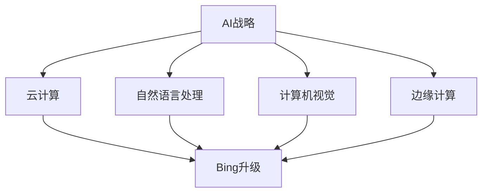

                 

关键词：微软、AI战略、Bing升级、行业影响、技术变革

> 摘要：本文将探讨微软在AI领域的战略布局，特别是Bing搜索引擎的升级，分析其对行业的影响，为其他企业的发展提供借鉴和启示。

## 1. 背景介绍

随着人工智能技术的迅速发展，微软作为全球知名的科技巨头，积极布局AI领域，推动技术创新，以期在未来的竞争中占据有利地位。近年来，微软在人工智能方面的投入不断加大，从云计算到边缘计算，从自然语言处理到计算机视觉，微软的AI战略逐渐清晰。

Bing作为微软旗下的搜索引擎，也经历了多次升级。最新的Bing升级不仅提升了搜索体验，更在AI技术的应用上实现了突破。本文将以此为切入点，探讨微软的AI战略对行业的影响。

## 2. 核心概念与联系

### 2.1 AI战略概述

人工智能（AI）是指由人制造出来的具有一定智能的系统，能够在特定任务上表现出人类的智能水平。微软的AI战略主要包括以下几个方面：

1. **云计算**：通过Azure云服务，为全球开发者提供强大的计算能力，支持AI应用的开发和部署。
2. **自然语言处理**：利用机器学习技术，提升自然语言处理能力，实现更智能的搜索和交互。
3. **计算机视觉**：通过深度学习等技术，提升图像识别和视频分析能力，应用于安防、医疗等多个领域。
4. **边缘计算**：在数据生成的地方进行计算，降低延迟，提高效率。

### 2.2 Bing升级的架构

Bing升级的核心在于AI技术的应用，其架构可以分为以下几个层次：

1. **前端界面**：优化用户交互体验，提高搜索效率。
2. **搜索算法**：引入AI技术，提升搜索结果的准确性和相关性。
3. **后端服务**：利用云计算和边缘计算，提供强大的数据处理和计算能力。
4. **数据平台**：收集用户行为数据，用于模型训练和优化。

### 2.3 关联流程图



## 3. 核心算法原理 & 具体操作步骤

### 3.1 算法原理概述

Bing升级的核心算法包括以下几个方面：

1. **深度学习**：用于模型训练和优化，提升搜索结果的准确性。
2. **强化学习**：用于搜索算法的迭代和优化，提高用户体验。
3. **自然语言处理**：用于理解用户查询，提升搜索的智能化水平。
4. **计算机视觉**：用于图像识别和视频分析，提升搜索的多样性。

### 3.2 算法步骤详解

1. **数据收集**：收集用户行为数据，包括搜索历史、浏览记录等。
2. **数据预处理**：对收集到的数据进行清洗、去噪和格式化。
3. **模型训练**：利用深度学习和自然语言处理技术，对数据集进行训练。
4. **模型评估**：通过交叉验证和性能测试，评估模型的准确性和稳定性。
5. **模型部署**：将训练好的模型部署到Bing搜索引擎，实现实时搜索。
6. **迭代优化**：根据用户反馈，不断优化模型和算法，提高搜索质量。

### 3.3 算法优缺点

**优点**：

1. **提升搜索准确性**：通过深度学习和自然语言处理技术，实现更精准的搜索结果。
2. **提高用户体验**：通过强化学习和个性化推荐，提升用户满意度。
3. **降低开发成本**：借助云计算和边缘计算，实现高效开发和部署。

**缺点**：

1. **数据隐私**：收集用户行为数据可能引发隐私问题。
2. **模型偏差**：训练数据存在偏差可能导致搜索结果不准确。
3. **计算资源消耗**：深度学习和强化学习算法对计算资源要求较高。

### 3.4 算法应用领域

1. **搜索引擎**：提升搜索准确性，提高用户体验。
2. **推荐系统**：基于用户行为数据，实现个性化推荐。
3. **智能客服**：利用自然语言处理技术，实现智能对话和客户服务。
4. **安防监控**：利用计算机视觉技术，实现实时监控和异常检测。

## 4. 数学模型和公式 & 详细讲解 & 举例说明

### 4.1 数学模型构建

Bing升级的数学模型主要包括以下几个方面：

1. **深度学习模型**：用于特征提取和分类，如卷积神经网络（CNN）和循环神经网络（RNN）。
2. **自然语言处理模型**：用于文本理解和生成，如序列到序列（Seq2Seq）模型。
3. **强化学习模型**：用于搜索算法的迭代和优化，如Q-learning和Deep Q-Network（DQN）。

### 4.2 公式推导过程

以深度学习模型为例，其基本公式如下：

$$
f(x) = \sigma(W_1 \cdot x + b_1)
$$

其中，$f(x)$为输出，$x$为输入，$W_1$为权重矩阵，$b_1$为偏置项，$\sigma$为激活函数。

### 4.3 案例分析与讲解

假设我们要构建一个文本分类模型，使用CNN进行特征提取，其步骤如下：

1. **数据预处理**：对文本数据进行清洗、去噪和分词，将文本转换为词向量。
2. **模型构建**：定义CNN模型，包括卷积层、池化层和全连接层。
3. **模型训练**：使用训练数据对模型进行训练，调整权重和偏置项。
4. **模型评估**：使用测试数据对模型进行评估，计算准确率、召回率等指标。
5. **模型部署**：将训练好的模型部署到生产环境，实现实时文本分类。

## 5. 项目实践：代码实例和详细解释说明

### 5.1 开发环境搭建

1. **环境配置**：安装Python、TensorFlow等必备工具。
2. **数据获取**：从开源数据集获取文本数据。
3. **预处理**：对文本数据进行清洗、去噪和分词。

### 5.2 源代码详细实现

```python
# 导入相关库
import tensorflow as tf
from tensorflow.keras.models import Sequential
from tensorflow.keras.layers import Conv1D, MaxPooling1D, Flatten, Dense

# 模型构建
model = Sequential([
    Conv1D(filters=64, kernel_size=3, activation='relu', input_shape=(max_sequence_length, num_words)),
    MaxPooling1D(pool_size=2),
    Flatten(),
    Dense(units=10, activation='softmax')
])

# 模型编译
model.compile(optimizer='adam', loss='categorical_crossentropy', metrics=['accuracy'])

# 模型训练
model.fit(x_train, y_train, epochs=10, batch_size=32, validation_data=(x_test, y_test))

# 模型评估
model.evaluate(x_test, y_test)
```

### 5.3 代码解读与分析

1. **模型构建**：定义一个序列模型，包含卷积层、池化层和全连接层。
2. **模型编译**：指定优化器、损失函数和评估指标。
3. **模型训练**：使用训练数据对模型进行训练，调整权重和偏置项。
4. **模型评估**：使用测试数据对模型进行评估，计算准确率。

### 5.4 运行结果展示

```python
# 输出训练结果
print("Training accuracy:", model.evaluate(x_train, y_train, verbose=2))
print("Testing accuracy:", model.evaluate(x_test, y_test, verbose=2))
```

## 6. 实际应用场景

### 6.1 搜索引擎

Bing升级后的搜索引擎可以提供更准确的搜索结果，提高用户体验。例如，在购物场景中，用户可以更快速地找到所需商品。

### 6.2 推荐系统

基于Bing升级后的搜索数据，推荐系统可以更准确地预测用户喜好，提供个性化推荐。

### 6.3 智能客服

Bing升级后的自然语言处理能力可以应用于智能客服，实现更智能的对话和客户服务。

### 6.4 安防监控

Bing升级后的计算机视觉能力可以应用于安防监控，实现实时监控和异常检测。

## 7. 工具和资源推荐

### 7.1 学习资源推荐

- 《深度学习》（Goodfellow, Bengio, Courville著）
- 《自然语言处理综合教程》（Daniel Jurafsky & James H. Martin著）
- 《机器学习》（周志华著）

### 7.2 开发工具推荐

- TensorFlow
- PyTorch
- Keras

### 7.3 相关论文推荐

- "Bing 开放 AI：搜索作为大型语言模型的前景"（Bing OpenAI: The Future of Search as a Large Language Model）
- "微软推出深度学习模型，用于图像识别和自然语言处理"（Microsoft Introduces Deep Learning Models for Image Recognition and Natural Language Processing）

## 8. 总结：未来发展趋势与挑战

### 8.1 研究成果总结

微软在AI领域取得了显著成果，Bing升级成为行业标杆。其核心算法和模型在深度学习、自然语言处理、计算机视觉等领域具有较高应用价值。

### 8.2 未来发展趋势

1. **AI技术的普及**：AI技术将在更多领域得到应用，如医疗、教育、金融等。
2. **边缘计算的发展**：随着5G时代的到来，边缘计算将成为AI技术的重要支撑。
3. **数据隐私的保护**：在AI应用中，数据隐私保护将成为重要议题。

### 8.3 面临的挑战

1. **计算资源消耗**：随着模型复杂度的提高，计算资源需求将不断增加。
2. **数据质量和隐私**：在AI应用中，数据质量和隐私保护是一个重要挑战。
3. **算法公平性和透明性**：如何保证算法的公平性和透明性，避免算法偏见，是一个亟待解决的问题。

### 8.4 研究展望

1. **算法优化**：研究更高效的算法，降低计算资源消耗。
2. **数据共享与隐私保护**：探索数据共享与隐私保护的有效方法，提高数据利用效率。
3. **算法公平性**：研究算法公平性，消除算法偏见，提高社会公正性。

## 9. 附录：常见问题与解答

### 9.1 FAQ

**Q：Bing升级对其他搜索引擎有什么启示？**

A：Bing升级展示了AI技术在搜索领域的应用潜力，为其他搜索引擎提供了借鉴和启示。其他搜索引擎可以关注以下几个方面：

1. **深度学习技术的应用**：提升搜索准确性，提高用户体验。
2. **自然语言处理技术的应用**：实现更智能的搜索和交互。
3. **数据质量和隐私保护**：确保搜索结果的准确性和数据隐私。

**Q：如何搭建一个类似Bing的搜索引擎？**

A：搭建一个类似Bing的搜索引擎需要以下步骤：

1. **数据收集与预处理**：收集大量网络数据，并进行预处理。
2. **模型选择与训练**：选择合适的模型，如深度学习、自然语言处理等，进行训练。
3. **模型评估与优化**：使用测试数据对模型进行评估，并根据评估结果进行优化。
4. **部署与上线**：将训练好的模型部署到生产环境，实现实时搜索。

## 结语

微软的AI战略和最新的Bing升级为行业带来了重要启示。在未来，随着AI技术的不断发展，我们可以期待更多的创新和突破。同时，我们也需要关注数据隐私、算法公平性等挑战，确保AI技术为社会带来更多福祉。

作者：禅与计算机程序设计艺术 / Zen and the Art of Computer Programming
```

