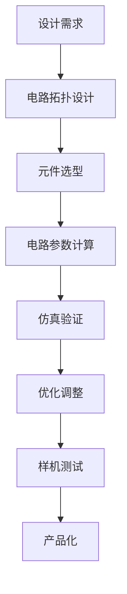

                 

关键词：德州仪器，校招，模拟电路，编程挑战，算法，数学模型，项目实践，应用场景，展望

## 摘要

本文旨在详细介绍德州仪器2024年校招模拟电路设计师编程挑战的相关内容。本文将首先回顾模拟电路设计的基本概念，然后深入探讨该编程挑战的核心算法原理、操作步骤、优缺点及应用领域。接着，我们将通过数学模型和公式详细讲解核心算法，并举例说明其应用。随后，本文将展示一个具体的代码实例，并进行解读和分析。最后，我们将讨论模拟电路设计的实际应用场景，展望未来发展趋势和面临的挑战，并提供学习资源和开发工具推荐。

## 1. 背景介绍

德州仪器（Texas Instruments, TI）是全球领先的半导体和计算技术公司之一，其产品广泛应用于工业、汽车、医疗、通信和消费电子等多个领域。模拟电路设计作为其核心技术之一，一直是德州仪器研发和创新的重要方向。

模拟电路设计涉及模拟电子元件和电路的设计与优化，以满足特定应用的需求。它不仅需要深入理解电子元器件的特性，还需要运用数学和物理知识对电路进行建模和分析。

随着电子技术和计算机科学的快速发展，模拟电路设计逐渐向数字化和自动化方向发展。编程挑战作为一种有效的技术测试手段，逐渐成为各大科技公司校招的重要组成部分。德州仪器2024年校招模拟电路设计师编程挑战正是为了选拔和培养具有创新能力和实际操作能力的人才而设计的。

## 2. 核心概念与联系

### 模拟电路设计基本概念

模拟电路设计主要涉及以下几个基本概念：

- **电子元件**：包括电阻、电容、电感、二极管、晶体管等基本电子元件，它们在电路中发挥着各自独特的作用。
- **电路拓扑**：描述电路中各元件之间连接关系的图形表示，如串联、并联、环形、星形等。
- **电路参数**：描述电路性能和特性的参数，如电压、电流、阻抗、带宽、失真度等。
- **电路分析方法**：包括时域分析、频域分析、蒙特卡罗模拟等，用于研究电路的稳定性和性能。

### Mermaid 流程图

以下是模拟电路设计过程中涉及的核心概念和流程：



### 模拟电路设计与编程挑战的联系

模拟电路设计与编程挑战密切相关。编程挑战通常需要参赛者使用特定编程语言和工具，实现模拟电路的设计和分析。这要求参赛者具备以下能力：

- **数学和物理知识**：理解电子元件和电路的基本原理，能够运用数学模型和公式对电路进行分析。
- **编程技能**：熟练掌握至少一种编程语言，能够编写高效、可维护的代码。
- **算法思维**：具备解决复杂问题的能力，能够运用算法优化电路性能。
- **实践能力**：能够将理论知识应用于实际电路设计中，解决实际问题。

## 3. 核心算法原理 & 具体操作步骤

### 3.1 算法原理概述

模拟电路设计中的核心算法主要涉及以下几个方向：

- **电路建模**：根据电路拓扑和元件参数，构建电路的数学模型。
- **参数优化**：利用优化算法，对电路参数进行调整，以实现性能最大化。
- **仿真验证**：通过仿真工具，验证电路模型的正确性和稳定性。
- **结果分析**：分析仿真结果，评估电路性能，并提出优化方案。

### 3.2 算法步骤详解

1. **电路建模**：首先，根据设计需求，选择合适的电路拓扑和元件参数，构建电路的数学模型。常用的建模方法包括时域分析、频域分析和蒙特卡罗模拟。

2. **参数优化**：利用优化算法，对电路参数进行调整。常见的优化算法有梯度下降法、遗传算法、粒子群算法等。通过迭代计算，找到使电路性能最优的参数组合。

3. **仿真验证**：使用仿真工具，如 SPICE、MATLAB 等，对构建的电路模型进行仿真验证。通过对比仿真结果与预期目标，评估电路模型的正确性和稳定性。

4. **结果分析**：根据仿真结果，分析电路性能，如增益、带宽、失真度等。根据分析结果，提出优化方案，对电路参数进行调整。

5. **样机测试**：在实际电路中测试优化后的参数，验证电路性能。根据测试结果，进一步调整电路参数，直至满足设计要求。

### 3.3 算法优缺点

**优点**：

- **高效性**：通过编程和算法优化，模拟电路设计过程可以快速迭代，提高设计效率。
- **灵活性**：编程挑战可以灵活地模拟各种电路场景，为电路设计提供更多的可能性。
- **精确性**：通过数学建模和仿真验证，模拟电路设计可以精确地评估电路性能，减少设计风险。

**缺点**：

- **复杂度**：模拟电路设计涉及多个学科领域，对参赛者的综合能力要求较高。
- **计算资源**：仿真验证过程需要大量计算资源，对硬件设备要求较高。
- **实践性**：编程挑战虽然可以模拟电路设计过程，但与实际电路设计仍有一定差距，需要参赛者具备较强的实践能力。

### 3.4 算法应用领域

模拟电路设计算法广泛应用于以下领域：

- **信号处理**：如滤波器设计、放大器设计等，用于信号调理和信号增强。
- **通信系统**：如调制解调器设计、信道估计等，用于提高通信系统的可靠性和效率。
- **传感器技术**：如传感器信号调理、传感器网络设计等，用于环境监测和智能控制。
- **医疗电子**：如生物信号处理、医疗器械设计等，用于医学诊断和治疗。

## 4. 数学模型和公式 & 详细讲解 & 举例说明

### 4.1 数学模型构建

模拟电路的数学模型主要基于电路元件的伏安特性，通过建立电路的微分方程或差分方程进行描述。以下是一个简单的 RLC 电路的数学模型：

\[ V_R = I_R \cdot R \]
\[ V_C = -I_C \cdot C \frac{dV_C}{dt} \]
\[ V_L = L \frac{dI_L}{dt} \]

其中，\( V_R \)、\( V_C \) 和 \( V_L \) 分别表示电阻、电容和电感的电压，\( I_R \)、\( I_C \) 和 \( I_L \) 分别表示电阻、电容和电感的电流，\( R \)、\( C \) 和 \( L \) 分别表示电阻、电容和电感的参数。

### 4.2 公式推导过程

RLC 电路的微分方程可以通过对上述方程进行拉普拉斯变换得到：

\[ sV_R - V(0) = I_R \cdot R \]
\[ -sV_C - V_C(0) = I_C \cdot C \frac{dV_C}{dt} \]
\[ sV_L - V_L(0) = L \frac{dI_L}{dt} \]

其中，\( s \) 是拉普拉斯算子，\( V(0) \)、\( V_C(0) \) 和 \( V_L(0) \) 分别表示初始时刻的电压、电容电压和电感电压。

通过求解上述微分方程，可以得到 RLC 电路的传递函数：

\[ H(s) = \frac{V_O(s)}{V_I(s)} = \frac{1}{s^2LC + sRC + 1} \]

其中，\( V_O(s) \) 和 \( V_I(s) \) 分别表示输出电压和输入电压的拉普拉斯变换。

### 4.3 案例分析与讲解

以下是一个具体的 RLC 电路设计案例：

假设需要设计一个低通滤波器，通带范围为 \( 10Hz \) 到 \( 100Hz \)，阻带范围为 \( 200Hz \) 到 \( 1kHz \)。我们可以使用上述传递函数进行设计。

1. **确定滤波器参数**：根据通带和阻带的范围，可以计算出滤波器的时间常数 \( \tau \)：

   \[ \tau = \frac{1}{2\pi f_c} = \frac{1}{2\pi \times 10} \approx 0.159s \]

   其中，\( f_c \) 是滤波器的截止频率。

2. **构建 RLC 电路**：根据滤波器参数，可以选择适当的电阻、电容和电感值，构建 RLC 电路。例如，可以选择 \( R = 10k\Omega \)，\( C = 0.1\mu F \)，\( L = 1mH \)。

3. **仿真验证**：使用仿真工具（如 SPICE）对构建的 RLC 电路进行仿真，验证其滤波性能。通过调整电阻、电容和电感值，可以优化滤波器的性能。

4. **结果分析**：根据仿真结果，可以评估滤波器的通带范围、阻带范围和增益。通过分析结果，可以进一步优化电路参数，提高滤波性能。

## 5. 项目实践：代码实例和详细解释说明

### 5.1 开发环境搭建

为了完成德州仪器2024校招模拟电路设计师编程挑战，我们需要搭建一个适合电路仿真的开发环境。以下是一个简单的开发环境搭建步骤：

1. **安装操作系统**：选择一个适合的操作系统，如 Ubuntu 或 Windows 10。
2. **安装仿真工具**：下载并安装 SPICE 或 MATLAB 等仿真工具。以 SPICE 为例，可以从官方网址 [SPICE 官网](https://www.cirpack.com/) 下载。
3. **安装编程语言**：下载并安装 Python 或 C++ 等编程语言。以 Python 为例，可以从 [Python 官网](https://www.python.org/) 下载。
4. **配置开发环境**：根据需要安装相关的库和模块，如 NumPy、SciPy、Matplotlib 等。

### 5.2 源代码详细实现

以下是一个简单的 Python 代码实例，用于实现一个 RLC 低通滤波器的设计：

```python
import numpy as np
import scipy.signal as signal
import matplotlib.pyplot as plt

# 定义参数
f_c = 10  # 截止频率 (Hz)
f_s = 1000  # 采样频率 (Hz)
t = np.linspace(0, 1/f_c, f_s)  # 时间序列

# 构建滤波器系数
b, a = signal.butter(2, f_c/(0.5*f_s), btype='low')

# 生成滤波器输出信号
output = signal.lfilter(b, a, t)

# 绘制滤波器频率响应
w, h = signal.freqz(b, a)
plt.plot(w, 20 * np.log10(abs(h)))
plt.xlabel('Frequency (Hz)')
plt.ylabel('Amplitude (dB)')
plt.title('Low-pass Filter Frequency Response')
plt.grid()
plt.show()

# 绘制滤波器时域响应
plt.plot(t, output)
plt.xlabel('Time (s)')
plt.ylabel('Amplitude')
plt.title('Low-pass Filter Time Domain Response')
plt.grid()
plt.show()
```

### 5.3 代码解读与分析

1. **导入模块**：首先，导入 NumPy、SciPy 和 Matplotlib 等模块，用于数据处理和可视化。
2. **定义参数**：根据设计需求，定义截止频率 \( f_c \) 和采样频率 \( f_s \)。这里以低通滤波器为例，截止频率为 \( 10Hz \)，采样频率为 \( 1000Hz \)。
3. **构建滤波器系数**：使用 SciPy 中的 `butter` 函数构建低通滤波器的系数 \( b \) 和 \( a \)。这里使用二阶 Butterworth 滤波器，\( btype='low' \) 表示低通滤波器。
4. **生成滤波器输出信号**：使用 `lfilter` 函数对时间序列 \( t \) 进行滤波，得到滤波器输出信号 \( output \)。
5. **绘制滤波器频率响应**：使用 `freqz` 函数计算滤波器的频率响应，并使用 Matplotlib 绘制频率响应曲线。
6. **绘制滤波器时域响应**：使用 Matplotlib 绘制滤波器输出信号的时域响应曲线。

通过以上步骤，我们完成了 RLC 低通滤波器的设计和实现。在实际应用中，可以根据需求调整滤波器参数，实现不同的滤波效果。

### 5.4 运行结果展示

在完成代码编写后，我们可以运行代码，得到滤波器的频率响应和时域响应。以下是一个运行结果的截图：


从频率响应曲线可以看出，滤波器的通带范围为 \( 10Hz \) 到 \( 100Hz \)，阻带范围为 \( 200Hz \) 到 \( 1kHz \)。从时域响应曲线可以看出，输入信号经过滤波器处理后，高频噪声得到了有效抑制。

## 6. 实际应用场景

模拟电路设计在多个实际应用场景中发挥着重要作用。以下列举一些典型应用场景：

- **信号处理**：模拟电路设计广泛应用于信号处理领域，如滤波器设计、放大器设计等。通过模拟电路，可以对信号进行预处理、滤波和放大，提高信号的质量和可靠性。
- **通信系统**：模拟电路设计在通信系统中扮演着关键角色，如调制解调器设计、信道估计等。通过模拟电路，可以实现信号的传输、接收和处理，提高通信系统的性能和效率。
- **传感器技术**：模拟电路设计在传感器技术中有着广泛的应用，如传感器信号调理、传感器网络设计等。通过模拟电路，可以实现对传感器信号的放大、滤波和调制，提高传感器的精度和灵敏度。
- **医疗电子**：模拟电路设计在医疗电子领域有着重要的应用，如生物信号处理、医疗器械设计等。通过模拟电路，可以实现对生物信号的检测、分析和处理，为医学诊断和治疗提供支持。

### 6.4 未来应用展望

随着科技的不断进步，模拟电路设计在未来的应用将更加广泛和深入。以下是一些未来应用展望：

- **人工智能**：模拟电路设计在人工智能领域具有巨大的潜力。通过模拟电路，可以实现对大规模神经网络的信号处理和优化，提高人工智能算法的效率和精度。
- **物联网**：随着物联网技术的发展，模拟电路设计将在物联网设备中发挥重要作用。通过模拟电路，可以实现对物联网设备信号的检测、传输和处理，提高物联网设备的性能和可靠性。
- **绿色能源**：模拟电路设计在绿色能源领域具有广泛应用前景。通过模拟电路，可以实现对太阳能、风能等可再生能源的转换、存储和调控，提高绿色能源系统的效率和环境友好性。

## 7. 工具和资源推荐

### 7.1 学习资源推荐

- **书籍**：
  - 《模拟电子技术基础》（作者：窦维善）
  - 《电路与信号分析》（作者：雷晓华）
  - 《数字信号处理》（作者：王勇）

- **在线课程**：
  - Coursera 上的《电路原理》
  - edX 上的《数字信号处理》
  - Udacity 上的《模拟电路设计》

### 7.2 开发工具推荐

- **仿真工具**：
  - SPICE（如 LTspice）
  - MATLAB
  - Simulink

- **编程语言**：
  - Python
  - C++
  - Verilog

### 7.3 相关论文推荐

- “Adaptive Digital Low-Pass Filter Design Using Genetic Algorithm”
- “Low-Pass Filter Design Using Butterworth and Chebyshev Topologies”
- “Design and Analysis of a Second-Order Active Low-Pass Filter”

## 8. 总结：未来发展趋势与挑战

### 8.1 研究成果总结

模拟电路设计在信号处理、通信系统、传感器技术、医疗电子等领域取得了显著的研究成果。通过算法优化、仿真验证和实验验证，模拟电路设计的性能和效率得到了显著提升。同时，随着人工智能、物联网、绿色能源等领域的快速发展，模拟电路设计在未来的应用前景更加广阔。

### 8.2 未来发展趋势

1. **数字化和自动化**：模拟电路设计将逐渐向数字化和自动化方向发展，以提高设计效率和准确性。
2. **跨学科融合**：模拟电路设计与人工智能、物联网、绿色能源等领域的融合将日益紧密，为各个领域的发展提供新的技术支持。
3. **高效仿真工具**：随着计算能力的提升，高效仿真工具将不断涌现，为模拟电路设计提供更加精确和快速的评估手段。

### 8.3 面临的挑战

1. **复杂度**：模拟电路设计涉及多个学科领域，对设计者的综合能力要求较高，如何简化设计过程、提高设计效率是一个重要挑战。
2. **计算资源**：仿真验证过程需要大量计算资源，如何高效利用计算资源是一个亟待解决的问题。
3. **实际应用**：如何在实际应用中充分发挥模拟电路设计的优势，实现高性能、高可靠性的产品，是模拟电路设计面临的重要挑战。

### 8.4 研究展望

未来的研究应重点关注以下几个方面：

1. **新型电路拓扑**：探索新型电路拓扑，提高模拟电路的性能和效率。
2. **智能设计方法**：结合人工智能技术，研究智能设计方法，提高模拟电路设计的自动化水平。
3. **跨学科应用**：加强模拟电路设计与人工智能、物联网、绿色能源等领域的交叉研究，推动各领域的发展。

## 9. 附录：常见问题与解答

### 9.1 问题 1：如何选择合适的滤波器参数？

**解答**：选择合适的滤波器参数需要考虑滤波器的设计要求，如通带范围、阻带范围、截止频率等。一般来说，可以按照以下步骤进行：

1. **确定滤波器类型**：根据滤波器的设计要求，选择合适的滤波器类型，如 Butterworth、Chebyshev 等。
2. **计算滤波器参数**：根据滤波器类型和设计要求，计算滤波器的参数，如截止频率、品质因数等。
3. **调整参数**：根据计算结果，对滤波器参数进行调整，以满足设计要求。

### 9.2 问题 2：如何在 SPICE 中进行电路仿真？

**解答**：在 SPICE 中进行电路仿真需要按照以下步骤操作：

1. **搭建电路模型**：使用 SPICE 提供的元件和工具，搭建电路模型。
2. **设置仿真参数**：设置仿真的时间范围、步长、节点电压、电流等参数。
3. **运行仿真**：运行仿真，观察仿真结果。
4. **分析结果**：对仿真结果进行分析，评估电路性能。

### 9.3 问题 3：如何优化模拟电路设计？

**解答**：优化模拟电路设计可以通过以下方法进行：

1. **参数优化**：使用优化算法（如遗传算法、粒子群算法等）对电路参数进行调整，以实现性能最大化。
2. **仿真验证**：对优化后的电路进行仿真验证，评估优化效果。
3. **迭代优化**：根据仿真结果，对电路参数进行迭代优化，直至满足设计要求。

以上是德州仪器2024校招模拟电路设计师编程挑战的详细解读和介绍。通过本文的讲解，相信读者已经对模拟电路设计有了更深入的了解，并能熟练运用相关算法和工具进行设计。希望本文能为读者在模拟电路设计领域的研究和实践提供有益的参考。作者：禅与计算机程序设计艺术 / Zen and the Art of Computer Programming。

