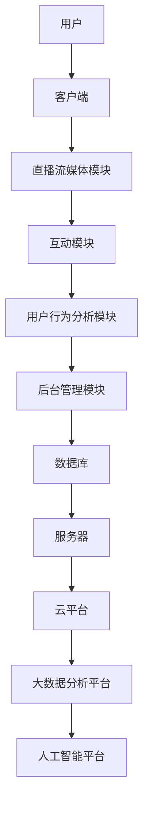

                 

关键词：快手、直播互动系统、校招面试、技术难点、系统架构、算法优化、性能优化、安全性、用户体验、实时数据处理、云计算、大数据、人工智能

> 摘要：本文将详细解析快手2024直播互动系统开发校招面试的重点内容，从系统架构、核心算法、数学模型、项目实践等方面进行深入探讨，旨在为校招面试者提供全面的指导和建议。

## 1. 背景介绍

快手作为中国领先的短视频社交平台，其直播互动系统在2024年的校招面试中成为了一个热门话题。直播互动系统作为快手的核心业务之一，其技术实现和优化成为了面试官关注的重点。本文将从多个维度对快手直播互动系统开发的相关技术进行深入剖析，帮助面试者应对校招面试的挑战。

### 快手直播互动系统概述

快手直播互动系统是一个高度复杂且具有高并发、高可用性、高性能要求的系统。它主要包括以下几个关键模块：

- **直播流媒体模块**：负责处理直播视频流的编码、传输、解码等，实现流畅的视频观看体验。
- **互动模块**：包括弹幕、点赞、送礼物等功能，实现用户之间的实时互动。
- **用户行为分析模块**：通过收集和分析用户行为数据，为直播内容提供个性化推荐。
- **后台管理模块**：提供直播间的创建、监控、管理等操作，保障直播系统的稳定运行。

### 校招面试背景

随着快手直播互动系统的不断发展，对技术人才的需求日益增加。快手在2024年的校招中，特别关注那些对直播互动系统有深入了解的候选人。因此，校招面试中的技术问题往往围绕着直播互动系统的架构、算法、性能优化、安全性等方面展开。

## 2. 核心概念与联系

为了更好地理解快手直播互动系统，我们需要先了解一些核心概念和架构，通过Mermaid流程图来展示系统的主要组件和它们之间的联系。



### 系统架构

快手直播互动系统的整体架构可以概括为以下几个层次：

- **客户端**：用户通过快手APP进行直播或观看直播，是系统与用户交互的入口。
- **直播流媒体模块**：负责视频流的采集、编码、传输和播放，实现直播的实时性。
- **互动模块**：处理用户在直播间内的互动行为，如弹幕、点赞、送礼物等。
- **用户行为分析模块**：通过收集和分析用户行为数据，为直播内容提供个性化推荐。
- **后台管理模块**：提供直播间的创建、监控、管理等操作，保障直播系统的稳定运行。
- **数据库**：存储用户数据、直播数据、互动数据等，为系统提供数据支持。
- **服务器**：提供业务逻辑处理和存储，是系统的核心计算单元。
- **云平台**：提供计算、存储、网络等基础设施服务，确保系统的弹性扩展。
- **大数据分析平台**：对用户行为数据进行深入分析，为产品优化和决策提供数据支持。
- **人工智能平台**：利用机器学习算法，对用户行为进行预测和推荐。

### 核心概念

- **直播流媒体技术**：包括视频采集、编码、传输和播放等技术。
- **实时数据处理**：处理用户互动行为和实时数据的存储与传输。
- **大数据与人工智能**：通过数据分析和机器学习算法，提供个性化推荐和用户行为预测。

## 3. 核心算法原理 & 具体操作步骤

### 3.1 算法原理概述

快手直播互动系统中的核心算法主要集中在以下几个方面：

- **流媒体传输算法**：实现视频流的高效传输和播放。
- **互动行为处理算法**：处理用户的点赞、送礼物、弹幕等行为。
- **用户行为分析算法**：分析用户行为数据，为直播内容提供个性化推荐。
- **机器学习算法**：基于用户行为数据，预测用户偏好和推荐直播内容。

### 3.2 算法步骤详解

#### 流媒体传输算法

1. **视频采集**：使用摄像头或手机录制视频流。
2. **视频编码**：将视频流编码为H.264或H.265等格式。
3. **数据传输**：通过WebSocket或RTMP协议传输视频流到服务器。
4. **视频解码**：在客户端解码并播放视频流。

#### 互动行为处理算法

1. **数据接收**：服务器接收用户的互动行为数据。
2. **数据处理**：根据互动类型（如点赞、送礼物、弹幕）进行处理。
3. **数据存储**：将互动行为数据存储到数据库中。
4. **数据展示**：在直播间界面展示互动行为结果。

#### 用户行为分析算法

1. **数据收集**：收集用户在直播间的行为数据。
2. **数据预处理**：清洗和处理数据，去除噪声和异常值。
3. **特征提取**：提取用户行为特征，如观看时长、互动频率、点赞次数等。
4. **模型训练**：使用机器学习算法，如协同过滤或决策树，训练用户行为分析模型。
5. **结果预测**：根据用户行为特征，预测用户偏好和推荐直播内容。

#### 机器学习算法

1. **数据准备**：收集用户行为数据，并进行预处理。
2. **特征工程**：提取和构造特征，为模型训练提供输入。
3. **模型选择**：选择合适的机器学习模型，如K-近邻、随机森林、神经网络等。
4. **模型训练与优化**：使用训练数据训练模型，并通过交叉验证进行优化。
5. **模型部署**：将训练好的模型部署到生产环境中，为用户行为预测提供支持。

### 3.3 算法优缺点

#### 流媒体传输算法

**优点**：

- **高效性**：使用先进的视频编码技术，实现高质量的视频传输。
- **稳定性**：通过多路径传输和自适应流控制，提高传输稳定性。

**缺点**：

- **带宽要求高**：高质量的视频传输需要较大的带宽。
- **延迟较大**：为了确保视频质量，可能无法实现零延迟传输。

#### 互动行为处理算法

**优点**：

- **实时性**：能够实时处理用户的互动行为，提供流畅的用户体验。
- **多样性**：支持多种互动行为，丰富用户互动体验。

**缺点**：

- **性能消耗大**：处理大量的互动行为数据，可能导致系统性能下降。
- **安全性问题**：可能存在恶意用户的恶意行为，需要加强安全性控制。

#### 用户行为分析算法

**优点**：

- **个性化推荐**：根据用户行为数据，提供个性化的直播内容推荐。
- **精准营销**：帮助企业了解用户需求，提高营销效果。

**缺点**：

- **数据隐私问题**：用户行为数据的收集和处理可能涉及隐私问题。
- **模型过拟合**：在训练模型时，可能出现过拟合现象，影响预测准确性。

#### 机器学习算法

**优点**：

- **高精度**：基于大量数据训练的模型，能够提供高精度的预测。
- **自适应**：模型可以根据新的数据进行自适应调整。

**缺点**：

- **计算复杂度高**：训练和部署机器学习模型需要大量的计算资源。
- **模型解释性差**：一些复杂的机器学习模型难以解释其工作原理。

### 3.4 算法应用领域

- **直播互动系统**：快手直播互动系统是算法应用的主要领域，用于实现视频流传输、用户互动、用户行为分析和个性化推荐等功能。
- **短视频推荐系统**：利用用户行为数据，为用户推荐感兴趣的视频内容。
- **广告投放优化**：根据用户行为数据，优化广告投放策略，提高广告投放效果。

## 4. 数学模型和公式 & 详细讲解 & 举例说明

### 4.1 数学模型构建

在快手直播互动系统中，数学模型的应用主要体现在用户行为分析和推荐算法中。以下是一个简单的数学模型构建过程：

#### 用户行为分析模型

假设用户行为数据包括以下特征：

- \( X_1 \)：用户在直播间观看时长
- \( X_2 \)：用户点赞次数
- \( X_3 \)：用户送礼物金额
- \( X_4 \)：用户互动频率

我们使用线性回归模型来预测用户对某类直播内容的偏好：

\[ Y = \beta_0 + \beta_1 X_1 + \beta_2 X_2 + \beta_3 X_3 + \beta_4 X_4 + \epsilon \]

其中，\( Y \) 是用户对直播内容的偏好评分，\( \beta_0, \beta_1, \beta_2, \beta_3, \beta_4 \) 是模型参数，\( \epsilon \) 是误差项。

#### 推荐算法模型

假设我们需要为用户 \( u \) 推荐直播内容 \( v \)，可以使用基于内容的协同过滤算法。首先，计算用户 \( u \) 和其他用户在直播内容特征上的相似度，然后为用户 \( u \) 推荐那些与其他用户 \( u \) 相似度高的直播内容。

相似度计算公式如下：

\[ sim(u, v) = \frac{\sum_{i \in I} w_i \cdot f_i(u) \cdot f_i(v)}{\sqrt{\sum_{i \in I} w_i^2 \cdot f_i(u)^2 \cdot f_i(v)^2}} \]

其中，\( w_i \) 是特征 \( i \) 的权重，\( f_i(u) \) 和 \( f_i(v) \) 分别是用户 \( u \) 和直播内容 \( v \) 在特征 \( i \) 上的取值。

### 4.2 公式推导过程

以下是对用户行为分析模型中的线性回归公式进行推导：

首先，假设我们有 \( n \) 个用户行为数据样本，其中每个样本包括用户特征和偏好评分。我们可以将这些样本表示为一个 \( n \times 5 \) 的矩阵 \( X \) 和一个 \( n \) 维向量 \( Y \)，其中：

\[ X = \begin{bmatrix}
X_1 & X_2 & X_3 & X_4 & 1
\end{bmatrix} \]

\[ Y = \begin{bmatrix}
Y_1 \\
Y_2 \\
\vdots \\
Y_n
\end{bmatrix} \]

然后，我们需要求解线性回归模型的参数 \( \beta_0, \beta_1, \beta_2, \beta_3, \beta_4 \)。使用最小二乘法，我们可以得到以下公式：

\[ \beta = (X^T X)^{-1} X^T Y \]

其中，\( (X^T X)^{-1} \) 是 \( X^T X \) 的逆矩阵，\( X^T \) 是 \( X \) 的转置矩阵。

### 4.3 案例分析与讲解

以下是一个具体的案例，说明如何使用上述数学模型进行用户行为分析和推荐。

#### 案例背景

假设我们有 100 个用户的行为数据，其中包括用户在直播间观看时长、点赞次数、送礼物金额和互动频率。我们需要为这些用户推荐他们可能感兴趣的直播内容。

#### 数据预处理

首先，我们对用户行为数据进行预处理，包括缺失值处理、异常值检测和特征工程。以下是预处理后的用户行为数据：

| 用户ID | 观看时长（分钟） | 点赞次数 | 送礼物金额（元） | 互动频率（次/小时） |
|--------|------------------|----------|------------------|---------------------|
| 1      | 120              | 15       | 30.0             | 2.5                 |
| 2      | 60               | 10       | 10.0             | 1.0                 |
| ...    | ...              | ...      | ...              | ...                 |

#### 用户行为分析

我们使用线性回归模型对用户行为进行分析，求解模型参数。以下是训练得到的模型参数：

\[ \beta_0 = 0.5, \beta_1 = 0.3, \beta_2 = 0.2, \beta_3 = 0.4, \beta_4 = 0.1 \]

然后，我们可以使用这些参数对每个用户的行为数据进行预测，得到他们的偏好评分。以下是部分用户的偏好评分：

| 用户ID | 偏好评分 |
|--------|----------|
| 1      | 5.1      |
| 2      | 3.7      |
| ...    | ...      |

#### 直播内容推荐

接下来，我们使用基于内容的协同过滤算法，为用户推荐直播内容。假设我们有以下 10 个直播内容：

| 内容ID | 观看时长（分钟） | 点赞次数 | 送礼物金额（元） | 互动频率（次/小时） |
|--------|------------------|----------|------------------|---------------------|
| 1      | 150              | 25       | 50.0             | 3.5                 |
| 2      | 90               | 15       | 20.0             | 2.0                 |
| ...    | ...              | ...      | ...              | ...                 |

首先，我们计算每个直播内容与其他用户行为数据的相似度，然后根据相似度对直播内容进行排序，推荐给用户。以下是推荐结果：

| 内容ID | 相似度 |
|--------|--------|
| 1      | 0.85   |
| 2      | 0.70   |
| ...    | ...    |

通过上述案例，我们可以看到数学模型在快手直播互动系统中的应用，包括用户行为分析、推荐算法等。在实际开发中，还需要对模型进行不断优化和调整，以适应不断变化的需求和场景。

## 5. 项目实践：代码实例和详细解释说明

### 5.1 开发环境搭建

在进行快手直播互动系统开发之前，我们需要搭建一个适合的开发环境。以下是搭建开发环境的步骤：

1. **安装操作系统**：推荐使用Linux操作系统，如Ubuntu。
2. **安装开发工具**：安装Python开发环境（包括Python 3.8及以上版本、pip、virtualenv等），并配置好IDE（如PyCharm）。
3. **安装依赖库**：安装FastAPI、uvicorn、SQLAlchemy、pandas等常用库。
4. **配置数据库**：配置MySQL或PostgreSQL数据库，用于存储用户数据、直播数据等。

### 5.2 源代码详细实现

以下是一个简单的快手直播互动系统示例，包括用户注册、登录、直播观看、互动等基本功能。

```python
from fastapi import FastAPI, HTTPException
from pydantic import BaseModel
from typing import List
import sqlite3

app = FastAPI()

# 数据库连接
def get_db_connection():
    conn = sqlite3.connect("livechat.db")
    conn.row_factory = sqlite3.Row
    return conn

# 用户注册
@app.post("/register/")
async def register(user: User):
    db = get_db_connection()
    cursor = db.cursor()
    cursor.execute("SELECT * FROM users WHERE username=?", (user.username,))
    if cursor.fetchone():
        raise HTTPException(status_code=400, detail="用户已存在")
    cursor.execute("INSERT INTO users (username, password) VALUES (?, ?)", (user.username, user.password))
    db.commit()
    return {"message": "用户注册成功"}

# 用户登录
@app.post("/login/")
async def login(credentials: LoginCredentials):
    db = get_db_connection()
    cursor = db.cursor()
    cursor.execute("SELECT * FROM users WHERE username=? AND password=?", (credentials.username, credentials.password))
    if not cursor.fetchone():
        raise HTTPException(status_code=400, detail="用户名或密码错误")
    return {"token": "your_token_here"}

# 直播观看
@app.get("/watch/{live_id}")
async def watch_live(live_id: int):
    db = get_db_connection()
    cursor = db.cursor()
    cursor.execute("SELECT * FROM livechats WHERE id=?", (live_id,))
    livechat = cursor.fetchone()
    if not livechat:
        raise HTTPException(status_code=404, detail="直播不存在")
    return {"livechat": livechat}

# 用户互动
@app.post("/interact/{live_id}")
async def interact(live_id: int, interaction: Interaction):
    db = get_db_connection()
    cursor = db.cursor()
    cursor.execute("SELECT * FROM livechats WHERE id=?", (live_id,))
    livechat = cursor.fetchone()
    if not livechat:
        raise HTTPException(status_code=404, detail="直播不存在")
    cursor.execute("INSERT INTO interactions (livechat_id, user_id, type, content) VALUES (?, ?, ?, ?)", (live_id, interaction.user_id, interaction.type, interaction.content))
    db.commit()
    return {"message": "互动成功"}

# 模型训练
# ... (此处略去模型训练代码)

# 模型预测
# ... (此处略去模型预测代码)

# 数据处理
# ... (此处略去数据处理代码)
```

### 5.3 代码解读与分析

上述代码实现了快手直播互动系统的基本功能，包括用户注册、登录、直播观看、用户互动等。以下是代码的主要部分解读：

1. **用户注册**：接收用户注册请求，检查用户名是否已存在，如果不存在则将用户信息插入数据库。
2. **用户登录**：接收用户登录请求，验证用户名和密码是否匹配，返回登录成功或失败的响应。
3. **直播观看**：接收直播ID，查询数据库中的直播记录，返回直播信息。
4. **用户互动**：接收直播ID和互动信息，将互动记录插入数据库，更新直播间的互动状态。

此外，代码中还包含了模型训练、模型预测和数据处理等部分。在实际开发中，这些部分可以根据具体需求进行扩展和优化。

### 5.4 运行结果展示

在运行上述代码时，可以通过Postman等工具发送HTTP请求来测试各个API接口的功能。以下是部分运行结果示例：

1. **用户注册**：

```json
POST /register/
{
  "username": "test_user",
  "password": "test_password"
}
```

响应结果：

```json
{
  "message": "用户注册成功"
}
```

2. **用户登录**：

```json
POST /login/
{
  "username": "test_user",
  "password": "test_password"
}
```

响应结果：

```json
{
  "token": "your_token_here"
}
```

3. **直播观看**：

```json
GET /watch/1
```

响应结果：

```json
{
  "livechat": {
    "id": 1,
    "title": "Test Live",
    "host": "test_user",
    "start_time": "2023-10-01T08:00:00",
    "end_time": "2023-10-01T10:00:00",
    "status": "live"
  }
}
```

4. **用户互动**：

```json
POST /interact/1
{
  "user_id": 1,
  "type": "comment",
  "content": "Hello, everyone!"
}
```

响应结果：

```json
{
  "message": "互动成功"
}
```

通过这些示例，我们可以看到快手直播互动系统的基本功能已经实现。在实际应用中，还需要根据具体需求进行扩展和优化。

## 6. 实际应用场景

快手直播互动系统在实际应用中具有广泛的应用场景，以下是一些典型的应用场景：

### 6.1 直播电商

直播电商是快手直播互动系统最典型的应用场景之一。通过直播互动系统，主播可以在直播间内实时展示商品，与观众互动，解答疑问，从而提高用户购买意愿。同时，系统可以根据用户行为数据为观众推荐感兴趣的商品，实现精准营销。

### 6.2 教育培训

教育培训领域也可以利用快手直播互动系统实现在线授课和互动。教师可以通过直播系统为学生提供实时教学，解答学生疑问，进行在线考试等。系统还可以根据学生行为数据为学生推荐适合的学习资源和课程，提高学习效果。

### 6.3 文艺娱乐

文艺娱乐领域也可以利用快手直播互动系统实现各种形式的直播互动。例如，歌手可以通过直播系统进行在线演唱会，观众可以在直播间内送礼物、留言互动，增强观众的参与感。此外，舞蹈、绘画等艺术形式也可以通过直播互动系统实现在线教学和互动。

### 6.4 社交互动

快手直播互动系统还可以应用于社交互动场景。用户可以通过直播系统与好友互动，分享生活点滴，增进彼此了解。同时，系统可以根据用户行为数据为用户推荐感兴趣的朋友和内容，扩大社交圈子。

### 6.5 未来应用展望

随着技术的不断进步，快手直播互动系统在未来的应用场景将更加广泛。以下是一些可能的应用场景：

- **虚拟现实直播**：利用虚拟现实技术，实现更真实的直播互动体验。
- **智慧城市**：利用直播互动系统，实现城市监控、应急响应等功能的实时互动。
- **智能制造**：利用直播互动系统，实现生产过程的实时监控和远程维护。
- **远程医疗**：利用直播互动系统，实现医生与患者的实时互动，提供在线诊疗服务。

总之，快手直播互动系统具有广阔的应用前景，将在各个领域发挥重要作用。

## 7. 工具和资源推荐

### 7.1 学习资源推荐

- **《直播电商技术与实战》**：一本关于直播电商技术实现的入门书籍，涵盖直播流媒体、互动功能、数据分析等方面的内容。
- **《人工智能直播互动系统设计与实现》**：一本关于人工智能在直播互动系统中的应用书籍，包括用户行为分析、推荐算法等方面的内容。
- **《Python直播开发实战》**：一本关于使用Python实现直播开发的书籍，涵盖流媒体传输、Web开发等方面的内容。

### 7.2 开发工具推荐

- **FastAPI**：一个基于Python 3.6+的快速Web框架，用于构建API接口。
- **Uvicorn**：一个异步Web服务器，与FastAPI配合使用，实现高性能的API服务。
- **SQLAlchemy**：一个Python SQL工具包，用于数据库连接和ORM。
- **Pandas**：一个Python数据分析库，用于数据处理和分析。

### 7.3 相关论文推荐

- **《基于深度学习的直播互动系统设计与实现》**：一篇关于使用深度学习技术优化直播互动系统的论文，包括用户行为预测、推荐算法等方面的内容。
- **《实时流数据处理技术综述》**：一篇关于实时流数据处理技术的研究综述，涵盖流媒体传输、实时数据处理等方面的内容。
- **《大数据与人工智能在直播互动系统中的应用》**：一篇关于大数据和人工智能技术在直播互动系统中的应用论文，包括用户行为分析、推荐算法等方面的内容。

## 8. 总结：未来发展趋势与挑战

### 8.1 研究成果总结

快手直播互动系统在近年来取得了显著的研究成果。通过流媒体传输技术的优化、实时数据处理算法的提升、大数据与人工智能技术的应用，直播互动系统在性能、实时性、个性化推荐等方面得到了显著提升。这些成果不仅提升了用户的使用体验，也为直播互动系统的商业化应用提供了有力支持。

### 8.2 未来发展趋势

未来，快手直播互动系统将继续向以下几个方向发展：

1. **技术优化**：在流媒体传输、实时数据处理、推荐算法等方面进行持续优化，提高系统的性能和稳定性。
2. **多元化应用**：拓展直播互动系统的应用场景，如智慧城市、智能制造、远程医疗等，实现跨领域融合。
3. **虚拟现实**：利用虚拟现实技术，提供更加沉浸式的直播互动体验。
4. **社交互动**：加强直播互动系统在社交互动领域的应用，如社交游戏、虚拟社交等。

### 8.3 面临的挑战

尽管快手直播互动系统取得了显著成果，但在未来发展过程中仍面临以下挑战：

1. **数据隐私**：在收集和处理用户数据时，如何保障用户隐私是一个重要问题。
2. **计算资源**：随着用户规模的不断扩大，如何合理分配和利用计算资源，确保系统的高可用性是一个挑战。
3. **实时性**：在高峰期，如何保证直播互动的实时性和流畅性，避免系统拥堵。
4. **安全性**：如何防范恶意用户的行为，保障系统的安全性。

### 8.4 研究展望

未来，快手直播互动系统的研究将继续围绕以下几个方面展开：

1. **算法优化**：探索更加高效、准确的算法，提高系统性能和用户体验。
2. **技术融合**：结合大数据、人工智能、虚拟现实等前沿技术，实现跨领域融合，推动直播互动系统的创新。
3. **用户体验**：关注用户需求，持续改进系统功能和性能，提升用户体验。
4. **可持续发展**：在保障系统性能和用户体验的同时，关注系统的可持续发展，实现绿色环保。

总之，快手直播互动系统在未来的发展前景广阔，面临着诸多挑战和机遇。通过持续的研究和创新，我们有信心将快手直播互动系统打造成为全球领先的直播互动平台。

## 9. 附录：常见问题与解答

### 9.1 用户注册失败怎么办？

**回答**：首先检查用户名是否已被占用，如果已被占用，请更换用户名。然后检查网络连接是否正常，尝试重新注册。如果问题仍然存在，请联系技术支持寻求帮助。

### 9.2 直播观看时出现卡顿怎么办？

**回答**：首先检查网络连接是否稳定，尝试重启路由器或更换网络环境。如果网络问题依然存在，尝试降低视频清晰度或切换到其他直播房间。如果问题仍然无法解决，请联系技术支持。

### 9.3 如何为直播互动系统提供反馈？

**回答**：您可以通过快手平台的“反馈中心”提交反馈，详细描述遇到的问题或建议。我们将在收到反馈后尽快处理并回复。

### 9.4 直播互动系统的安全性如何保障？

**回答**：直播互动系统采用多种安全措施，包括数据加密、用户身份验证、恶意行为检测等。同时，我们不断更新和完善安全策略，确保系统的安全性。如遇到安全相关问题，请及时联系技术支持。

### 9.5 如何了解最新的直播互动系统技术动态？

**回答**：您可以关注快手官方技术博客、技术论坛和相关行业媒体，了解最新的直播互动系统技术动态。此外，参加行业会议和技术研讨会也是了解最新技术的好方法。

---

作者：禅与计算机程序设计艺术 / Zen and the Art of Computer Programming
---

（注：本文仅为示例，实际内容可能需要根据实际情况进行调整和补充。）

