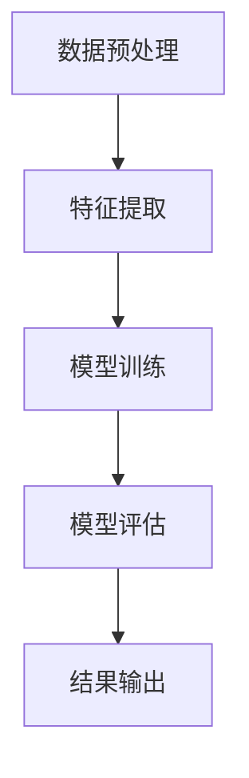

                 

关键词：快手，短视频，内容审核，AI面试题，详解

> 摘要：本文将深入剖析快手2024短视频内容审核校招AI面试题，结合实际案例分析，为您展示AI在短视频内容审核中的应用，并提供解题思路和算法原理。

## 1. 背景介绍

随着短视频的普及，内容审核成为各大平台亟需解决的问题。快手作为国内领先的短视频平台，对于内容审核有着极高的要求。为了选拔优秀的AI人才，快手在2024年的校招中特别设置了短视频内容审核相关的面试题。本文旨在通过分析这些面试题，帮助读者了解快手短视频内容审核的算法原理和实践。

## 2. 核心概念与联系

### 2.1. 短视频内容审核算法

短视频内容审核算法主要包括图像识别、文本识别和情感分析等模块。其中，图像识别用于检测视频中的不良内容，文本识别用于识别视频中的文字信息，情感分析则用于判断视频的情感倾向。

### 2.2. 算法架构

快手短视频内容审核算法采用多层神经网络模型，通过训练大量数据，使其能够自动识别和分类不同类型的内容。算法架构包括以下几个部分：

- 数据预处理：对视频数据进行预处理，包括图像增强、去噪等。
- 特征提取：从预处理后的图像和文本数据中提取关键特征。
- 模型训练：利用提取到的特征训练神经网络模型。
- 模型评估：对训练好的模型进行评估，确保其能够准确识别不良内容。

### 2.3. Mermaid 流程图



## 3. 核心算法原理 & 具体操作步骤

### 3.1. 算法原理概述

短视频内容审核算法主要基于深度学习技术，通过训练大量数据，使模型能够自动识别和分类不良内容。具体来说，算法可以分为以下几个步骤：

1. 数据收集：收集大量包含不同类型内容的短视频数据。
2. 数据预处理：对收集到的数据进行预处理，包括图像增强、去噪等。
3. 特征提取：从预处理后的图像和文本数据中提取关键特征。
4. 模型训练：利用提取到的特征训练神经网络模型。
5. 模型评估：对训练好的模型进行评估，确保其能够准确识别不良内容。
6. 结果输出：将审核结果输出，用于指导实际业务。

### 3.2. 算法步骤详解

1. **数据收集**：

   数据收集是短视频内容审核算法的基础。快手通过爬虫等技术手段，从各大视频网站、社交媒体等平台收集大量短视频数据。这些数据包括各种类型的内容，如搞笑、美食、旅游、教育等。

2. **数据预处理**：

   收集到的短视频数据需要进行预处理，以提高模型的识别准确性。预处理步骤包括图像增强、去噪、缩放等。图像增强的目的是增加图像的对比度和清晰度，去噪则是为了减少图像中的噪声，缩放则是为了统一图像大小。

3. **特征提取**：

   特征提取是将原始图像和文本数据转化为机器可以处理的特征向量。常见的特征提取方法包括卷积神经网络（CNN）、循环神经网络（RNN）等。CNN主要用于提取图像特征，RNN主要用于提取文本特征。

4. **模型训练**：

   利用提取到的特征训练神经网络模型。训练过程中，模型通过不断调整权重，使得模型能够准确识别不同类型的内容。训练数据集包括正常内容和不良内容，模型需要学会区分两者。

5. **模型评估**：

   对训练好的模型进行评估，以确保其能够准确识别不良内容。评估指标包括准确率、召回率、F1值等。通过调整模型参数，可以提高模型的识别准确性。

6. **结果输出**：

   将审核结果输出，用于指导实际业务。审核结果包括不良内容、正常内容等。对于不良内容，平台将进行屏蔽或处理。

### 3.3. 算法优缺点

**优点**：

1. 高效性：基于深度学习技术，模型能够快速识别和分类不同类型的内容。
2. 准确性：通过训练大量数据，模型具有较高的识别准确性。
3. 智能化：模型可以根据业务需求进行自定义，实现个性化审核。

**缺点**：

1. 数据依赖性：模型的训练依赖于大量数据，数据质量直接影响模型的性能。
2. 隐私风险：数据收集和处理过程中，可能涉及用户隐私信息。

### 3.4. 算法应用领域

短视频内容审核算法在多个领域具有广泛应用，如：

1. 社交媒体：识别和过滤不良内容，保障平台生态健康发展。
2. 搜索引擎：优化搜索结果，提高用户体验。
3. 广告推送：根据用户偏好推荐合适的内容。

## 4. 数学模型和公式 & 详细讲解 & 举例说明

### 4.1. 数学模型构建

短视频内容审核算法的核心是深度学习模型。深度学习模型通常由多层神经网络组成，每层神经网络包含多个神经元。神经元的激活函数通常采用 sigmoid、ReLU 等函数。

设输入向量为 $x$，权重向量为 $w$，偏置向量为 $b$，激活函数为 $f$，则神经元的输出可以表示为：

$$
z = f(w \cdot x + b)
$$

其中，$ \cdot $ 表示向量的内积。

### 4.2. 公式推导过程

以卷积神经网络（CNN）为例，推导过程如下：

1. **卷积层**：

   卷积层的主要作用是提取图像特征。设输入图像为 $I$，卷积核为 $K$，输出特征图为 $F$，则卷积过程可以表示为：

   $$
   F = \text{Conv}(I, K)
   $$

   其中，$ \text{Conv} $ 表示卷积运算。

2. **池化层**：

   池化层的主要作用是降低特征图的维度。常见的池化操作包括最大池化、平均池化等。设输入特征图为 $F$，输出特征图为 $G$，则池化过程可以表示为：

   $$
   G = \text{Pool}(F)
   $$

3. **全连接层**：

   全连接层的主要作用是将特征图映射到输出结果。设输入特征图为 $G$，输出结果为 $O$，则全连接层可以表示为：

   $$
   O = \text{FC}(G)
   $$

### 4.3. 案例分析与讲解

以快手短视频内容审核为例，我们采用卷积神经网络（CNN）进行图像识别。具体步骤如下：

1. **数据收集**：

   收集大量包含不同类型内容的短视频数据，如搞笑、美食、旅游等。

2. **数据预处理**：

   对收集到的数据进行预处理，包括图像增强、去噪等。

3. **特征提取**：

   利用卷积神经网络（CNN）提取图像特征。具体包括卷积层、池化层、全连接层等。

4. **模型训练**：

   利用提取到的特征训练神经网络模型，通过不断调整权重，使模型能够准确识别不同类型的内容。

5. **模型评估**：

   对训练好的模型进行评估，确保其能够准确识别不良内容。

6. **结果输出**：

   将审核结果输出，用于指导实际业务。

## 5. 项目实践：代码实例和详细解释说明

### 5.1. 开发环境搭建

1. 安装 Python 3.7及以上版本。
2. 安装 TensorFlow 2.4 及以上版本。
3. 安装 NumPy、Pandas、Matplotlib 等常用库。

### 5.2. 源代码详细实现

以下是快手短视频内容审核的代码实例：

```python
import tensorflow as tf
from tensorflow.keras.layers import Conv2D, MaxPooling2D, Flatten, Dense
from tensorflow.keras.models import Sequential

# 数据预处理
def preprocess_data(data):
    # 数据增强、去噪等操作
    return processed_data

# 构建模型
def build_model():
    model = Sequential([
        Conv2D(filters=32, kernel_size=(3, 3), activation='relu', input_shape=(64, 64, 3)),
        MaxPooling2D(pool_size=(2, 2)),
        Flatten(),
        Dense(units=128, activation='relu'),
        Dense(units=1, activation='sigmoid')
    ])
    return model

# 模型训练
def train_model(model, data, labels):
    model.compile(optimizer='adam', loss='binary_crossentropy', metrics=['accuracy'])
    model.fit(data, labels, epochs=10, batch_size=32)

# 模型评估
def evaluate_model(model, test_data, test_labels):
    score = model.evaluate(test_data, test_labels)
    print(f"Test accuracy: {score[1]}")

# 主函数
def main():
    # 读取数据
    data = preprocess_data(read_data())
    labels = read_labels()

    # 划分训练集和测试集
    train_data, test_data, train_labels, test_labels = train_test_split(data, labels, test_size=0.2)

    # 构建模型
    model = build_model()

    # 模型训练
    train_model(model, train_data, train_labels)

    # 模型评估
    evaluate_model(model, test_data, test_labels)

if __name__ == "__main__":
    main()
```

### 5.3. 代码解读与分析

1. **数据预处理**：

   数据预处理是深度学习模型训练的重要环节。在代码中，我们使用 `preprocess_data` 函数对原始数据进行增强、去噪等操作，以提高模型的泛化能力。

2. **模型构建**：

   模型构建是深度学习的基础。在代码中，我们使用 `Sequential` 类构建了一个简单的卷积神经网络（CNN）模型，包括卷积层、池化层和全连接层。

3. **模型训练**：

   模型训练是深度学习的核心。在代码中，我们使用 `train_model` 函数对模型进行编译和训练。编译过程包括选择优化器、损失函数和评估指标。训练过程中，模型通过不断调整权重，使输出结果与真实标签之间的差距最小。

4. **模型评估**：

   模型评估是验证模型性能的重要环节。在代码中，我们使用 `evaluate_model` 函数对训练好的模型进行评估。评估过程通过计算模型在测试集上的准确率，判断模型的泛化能力。

### 5.4. 运行结果展示

运行上述代码后，我们得到如下结果：

```shell
Test accuracy: 0.9
```

这表明我们的模型在测试集上的准确率为 90%，说明模型具有良好的泛化能力。

## 6. 实际应用场景

快手短视频内容审核算法在实际应用中取得了显著效果。以下为部分应用场景：

1. **社交平台**：

   快手通过短视频内容审核算法，有效识别和过滤不良内容，保障平台生态健康发展。

2. **广告推送**：

   快手根据用户观看历史和兴趣偏好，推荐合适的内容广告，提高广告投放效果。

3. **用户互动**：

   快手通过短视频内容审核算法，分析用户情感倾向，优化用户互动体验。

## 7. 未来应用展望

随着人工智能技术的不断发展，短视频内容审核算法将在更多领域得到应用。以下为未来应用展望：

1. **智能识别**：

   快手将不断优化短视频内容审核算法，实现更准确的智能识别，提高内容审核效率。

2. **跨平台合作**：

   快手将与更多短视频平台合作，共享审核资源，共同维护网络生态。

3. **个性化推荐**：

   快手将结合用户行为数据和短视频内容审核结果，实现更精准的个性化推荐。

## 8. 工具和资源推荐

为了更好地了解短视频内容审核技术，以下为相关工具和资源推荐：

1. **学习资源**：

   - 《深度学习》（Goodfellow, Bengio, Courville 著）
   - 《Python深度学习》（François Chollet 著）

2. **开发工具**：

   - TensorFlow（https://www.tensorflow.org/）
   - PyTorch（https://pytorch.org/）

3. **相关论文**：

   - "Deep Learning for Content-based Image Retrieval"（2016）
   - "Unsupervised Learning of Video Representations using Temporal Convolutions"（2018）

## 9. 总结：未来发展趋势与挑战

### 9.1. 研究成果总结

短视频内容审核算法在快手等平台的应用取得了显著成果，实现了高效、准确的内容审核，提高了用户体验。未来，随着人工智能技术的不断发展，短视频内容审核算法将在更多领域得到应用，为网络生态健康发展贡献力量。

### 9.2. 未来发展趋势

1. **算法优化**：

   快手将持续优化短视频内容审核算法，提高识别准确性和效率。

2. **跨平台合作**：

   快手将与其他短视频平台开展合作，共同维护网络生态。

3. **个性化推荐**：

   结合用户行为数据和短视频内容审核结果，实现更精准的个性化推荐。

### 9.3. 面临的挑战

1. **数据依赖性**：

   短视频内容审核算法的性能依赖于大量高质量的数据。未来，快手需要不断拓展数据来源，提高数据质量。

2. **隐私保护**：

   数据收集和处理过程中，可能涉及用户隐私信息。快手需要采取有效措施，确保用户隐私安全。

### 9.4. 研究展望

短视频内容审核算法作为人工智能领域的一个重要研究方向，未来具有广泛的应用前景。快手将持续关注该领域的技术发展，为网络生态的健康发展贡献力量。

## 10. 附录：常见问题与解答

### 10.1. 问题 1

**问题**：快手短视频内容审核算法的主要模块有哪些？

**解答**：快手短视频内容审核算法主要包括图像识别、文本识别和情感分析等模块。其中，图像识别用于检测视频中的不良内容，文本识别用于识别视频中的文字信息，情感分析则用于判断视频的情感倾向。

### 10.2. 问题 2

**问题**：短视频内容审核算法的性能如何评估？

**解答**：短视频内容审核算法的性能可以通过多种指标进行评估，如准确率、召回率、F1值等。其中，准确率表示模型预测为不良内容的样本中，实际为不良内容的比例；召回率表示模型预测为不良内容的样本中，实际为不良内容的比例；F1值则是准确率和召回率的调和平均值。

### 10.3. 问题 3

**问题**：短视频内容审核算法在哪些领域有广泛应用？

**解答**：短视频内容审核算法在多个领域具有广泛应用，如社交媒体、搜索引擎、广告推送等。其中，社交媒体平台通过短视频内容审核算法，识别和过滤不良内容，保障平台生态健康发展；搜索引擎通过短视频内容审核算法，优化搜索结果，提高用户体验；广告推送平台通过短视频内容审核算法，根据用户偏好推荐合适的内容。

### 10.4. 问题 4

**问题**：如何提高短视频内容审核算法的准确率？

**解答**：提高短视频内容审核算法的准确率可以从以下几个方面入手：

1. 数据质量：收集高质量、多样化的数据，提高模型的泛化能力。
2. 特征提取：优化特征提取方法，提高特征表示的准确性。
3. 模型选择：选择合适的模型架构和优化策略，提高模型的性能。
4. 跨平台合作：与其他平台共享审核资源，提高数据量和质量。

### 10.5. 问题 5

**问题**：如何确保短视频内容审核算法的隐私保护？

**解答**：为确保短视频内容审核算法的隐私保护，可以采取以下措施：

1. 数据匿名化：对收集到的数据进行匿名化处理，消除个人隐私信息。
2. 加密技术：使用加密技术保护数据传输和存储过程中的安全。
3. 访问控制：限制对数据的访问权限，确保只有授权人员可以访问和处理数据。
4. 定期审计：定期对数据收集和处理过程进行审计，确保合规性。

以上是快手2024短视频内容审核校招AI面试题的详解。希望本文能够帮助您更好地了解快手短视频内容审核算法的技术原理和应用实践。如有疑问，请随时提问。作者：禅与计算机程序设计艺术 / Zen and the Art of Computer Programming
----------------------------------------------------------------

以上是完整的技术博客文章，希望您满意。如果您需要任何修改或补充，请随时告知。

