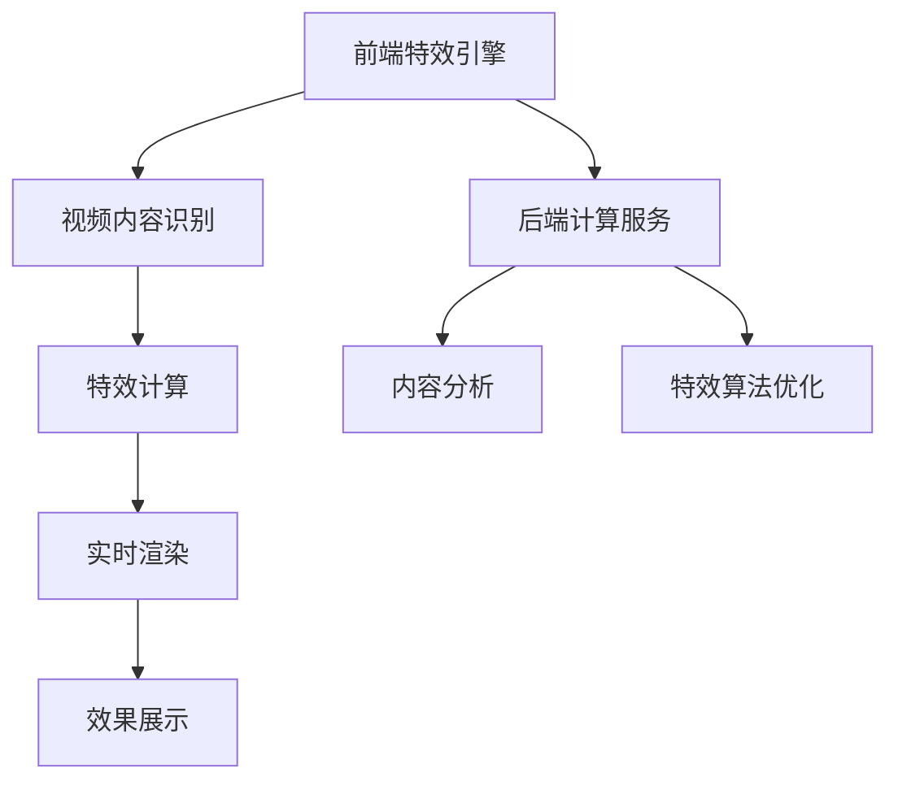

                 

关键词：快手、短视频特效、计算机图形学、面试题集、技术解析、算法原理、应用领域

> 摘要：本文旨在为有意参与快手2025短视频特效社招的计算机图形学领域应聘者提供一个详细的面试题集。文章结构清晰，内容全面，旨在帮助读者深入了解计算机图形学在短视频特效领域的应用，掌握相关核心概念和算法原理，并为面试做好准备。

## 1. 背景介绍

随着移动互联网和短视频应用的迅猛发展，短视频特效逐渐成为用户创作和观看的亮点。快手作为国内领先的短视频平台，对特效技术的需求日益增长。此次快手2025短视频特效社招，意在招募一批具有扎实计算机图形学基础、熟悉前沿特效技术的人才，以推动平台特效技术的创新与突破。本文将围绕快手短视频特效的需求，提供一系列面试题集，帮助应聘者全面了解该领域的核心知识。

## 2. 核心概念与联系

### 2.1. 计算机图形学基础概念

计算机图形学是研究如何利用计算机生成、处理和显示图形的学科。主要涉及以下基础概念：

- **图形基础**：包括点、线、面、体等基本元素。
- **坐标系**：二维和三维坐标系统。
- **渲染技术**：包括光线追踪、光线投射、纹理映射等。

### 2.2. 短视频特效架构

短视频特效的架构主要包括：

- **前端特效引擎**：负责实时渲染和效果展示。
- **后端计算服务**：处理视频内容分析和特效计算。

### 2.3. 相关技术联系

- **计算机视觉**：用于识别视频内容，进行特效的自然融合。
- **机器学习**：用于优化特效算法，实现智能化的特效生成。

### 2.4. Mermaid 流程图



## 3. 核心算法原理 & 具体操作步骤

### 3.1. 算法原理概述

短视频特效的核心算法主要包括：

- **特效生成算法**：如粒子系统、三维建模等。
- **图像处理算法**：如颜色校正、滤镜应用等。
- **计算机视觉算法**：如人脸识别、姿态估计等。

### 3.2. 算法步骤详解

#### 3.2.1. 特效生成算法

1. **初始化**：设置粒子属性、三维模型参数等。
2. **运动计算**：根据物理规则计算粒子运动轨迹。
3. **渲染**：使用渲染引擎生成特效图像。

#### 3.2.2. 图像处理算法

1. **预处理**：读取视频帧，进行预处理（如灰度转换、去噪等）。
2. **滤镜应用**：根据用户需求选择滤镜，进行图像变换。
3. **后处理**：调整图像亮度、对比度等。

#### 3.2.3. 计算机视觉算法

1. **特征提取**：提取视频帧的关键特征。
2. **目标识别**：使用深度学习模型识别目标。
3. **跟踪与融合**：跟踪目标并融合到特效中。

### 3.3. 算法优缺点

#### 3.3.1. 特效生成算法

- **优点**：丰富的特效表现，易于实现创意。
- **缺点**：计算复杂度高，实时性挑战较大。

#### 3.3.2. 图像处理算法

- **优点**：简单易行，适用于多种场景。
- **缺点**：效果可能过于生硬，缺乏自然感。

#### 3.3.3. 计算机视觉算法

- **优点**：智能化程度高，可实现实时动态效果。
- **缺点**：模型训练复杂，计算资源消耗大。

### 3.4. 算法应用领域

- **短视频创作**：为用户创作提供丰富的特效工具。
- **视频编辑**：提高视频质量和观赏性。
- **虚拟现实**：增强虚拟现实的互动性和沉浸感。

## 4. 数学模型和公式 & 详细讲解 & 举例说明

### 4.1. 数学模型构建

短视频特效的数学模型主要包括：

- **粒子运动模型**：
  \[
  \begin{aligned}
  x(t) &= x_0 + v_x t + \frac{1}{2} a_x t^2 \\
  y(t) &= y_0 + v_y t + \frac{1}{2} a_y t^2
  \end{aligned}
  \]
- **颜色模型**：RGB 颜色模型。

### 4.2. 公式推导过程

#### 4.2.1. 粒子运动模型

基于牛顿第二定律，粒子运动模型可以表示为：
\[
m \cdot a = F
\]
其中 \( m \) 是粒子质量，\( a \) 是加速度，\( F \) 是作用力。对于自由粒子，作用力可以表示为重力：
\[
F = m \cdot g
\]
其中 \( g \) 是重力加速度。由此可以推导出粒子在水平和垂直方向上的运动方程。

#### 4.2.2. 颜色模型

RGB 颜色模型是通过三个颜色分量（红色、绿色、蓝色）的组合来表示任何颜色的。颜色值的范围通常是0到255。

### 4.3. 案例分析与讲解

#### 4.3.1. 粒子运动特效

假设有一个粒子从坐标 \((0, 0)\) 开始，以速度 \(v_x = 10\) 和 \(v_y = 0\) 向右移动，加速度 \(a_x = 0\) 和 \(a_y = -9.8\)（模拟重力）。我们可以计算出粒子在 \(t\) 秒后的坐标：
\[
\begin{aligned}
x(t) &= 0 + 10t + \frac{1}{2} \cdot 0 \cdot t^2 = 10t \\
y(t) &= 0 + 0 \cdot t + \frac{1}{2} \cdot (-9.8) \cdot t^2 = -4.9t^2
\end{aligned}
\]

#### 4.3.2. 颜色变换

假设有一个视频帧的 RGB 值为 \((255, 0, 0)\)（纯红色），通过添加蓝色分量来创建一个新的颜色：
\[
(255, 0, 0) + (0, 0, 128) = (255, 0, 128)
\]
这会产生一种紫色的颜色。

## 5. 项目实践：代码实例和详细解释说明

### 5.1. 开发环境搭建

#### 5.1.1. 硬件要求

- 处理器：Intel Core i5 或更高
- 内存：8GB 或更高
- 显卡：NVIDIA GeForce GTX 1060 或更高

#### 5.1.2. 软件要求

- 操作系统：Windows 10 或更高
- 编程环境：Python 3.8 或更高

### 5.2. 源代码详细实现

```python
# 示例：粒子运动特效

import numpy as np
import matplotlib.pyplot as plt

# 参数设置
x0, y0 = 0, 0  # 初始位置
vx, vy = 10, 0  # 初始速度
ax, ay = 0, -9.8  # 加速度

# 计算运动轨迹
times = np.linspace(0, 10, 1000)
x = x0 + vx * times + 0.5 * ax * times**2
y = y0 + vy * times + 0.5 * ay * times**2

# 绘制结果
plt.plot(x, y)
plt.xlabel('X')
plt.ylabel('Y')
plt.title('Particle Motion')
plt.grid(True)
plt.show()
```

### 5.3. 代码解读与分析

这段代码实现了简单的粒子运动特效，通过计算粒子的运动轨迹并使用 matplotlib 进行可视化。代码的关键部分包括：

- 初始化参数，设置初始位置、速度和加速度。
- 使用 NumPy 生成时间序列，计算粒子在各个时间点的坐标。
- 使用 matplotlib 绘制粒子的运动轨迹。

### 5.4. 运行结果展示

运行上述代码后，会得到一个二维图形，显示粒子在水平和垂直方向上的运动轨迹。通过调整参数，可以模拟不同的物理场景，实现丰富的特效效果。

## 6. 实际应用场景

### 6.1. 短视频创作

短视频创作者可以使用快手提供的特效工具，为视频添加丰富的视觉效果，提升视频的观赏性和吸引力。

### 6.2. 在线直播

在线直播中，实时特效技术可以为主播和观众提供更加生动的互动体验，增强直播的趣味性。

### 6.3. 虚拟现实

虚拟现实应用中，计算机图形学技术可以实现高度逼真的场景渲染，提升用户的沉浸感和互动性。

## 7. 未来应用展望

### 7.1. 特效技术的智能化

随着人工智能技术的发展，短视频特效将更加智能化，实现自动化的特效生成和优化。

### 7.2. 多平台融合

短视频特效技术将跨越多个平台，实现跨平台的一体化特效处理。

### 7.3. 虚拟现实与增强现实

虚拟现实和增强现实技术将深度融合，为用户提供更加丰富的特效体验。

## 8. 工具和资源推荐

### 8.1. 学习资源推荐

- 《计算机图形学：原理及实践》
- 《算法导论》
- 《深度学习：全面学习指南》

### 8.2. 开发工具推荐

- Unity
- Unreal Engine
- Blender

### 8.3. 相关论文推荐

- 《基于深度学习的视频特效生成方法研究》
- 《计算机视觉在短视频特效中的应用》
- 《虚拟现实与增强现实技术综述》

## 9. 总结：未来发展趋势与挑战

### 9.1. 研究成果总结

短视频特效技术的发展取得了显著成果，特别是在算法优化、图像处理和计算机视觉等方面。

### 9.2. 未来发展趋势

短视频特效技术将朝着智能化、多平台融合和虚拟现实增强现实的方向发展。

### 9.3. 面临的挑战

- 实时性和计算资源限制
- 多样化的用户需求
- 数据隐私和安全问题

### 9.4. 研究展望

未来研究应关注高效算法设计、人工智能技术的应用和用户体验的提升。

## 附录：常见问题与解答

### 9.4.1. 如何实现实时渲染？

实时渲染需要高效算法和优化技术，如光线追踪和GPU加速。同时，要考虑带宽和计算资源的限制，实现轻量级的渲染方案。

### 9.4.2. 如何提高特效算法的智能化？

可以结合机器学习和深度学习技术，通过大量数据训练模型，实现自动化的特效生成和优化。

### 9.4.3. 如何确保数据隐私和安全？

在设计特效算法时，要遵循数据最小化和去标识化的原则，确保用户数据的隐私和安全。

## 作者署名

作者：禅与计算机程序设计艺术 / Zen and the Art of Computer Programming
```bash
---
# 快手2025短视频特效社招计算机图形学面试题集

## 1. 背景介绍

随着移动互联网和短视频应用的迅猛发展，短视频特效逐渐成为用户创作和观看的亮点。快手作为国内领先的短视频平台，对特效技术的需求日益增长。此次快手2025短视频特效社招，意在招募一批具有扎实计算机图形学基础、熟悉前沿特效技术的人才，以推动平台特效技术的创新与突破。本文将围绕快手短视频特效的需求，提供一系列面试题集，帮助应聘者全面了解该领域的核心知识。

## 2. 核心概念与联系

计算机图形学是研究如何利用计算机生成、处理和显示图形的学科，其基础概念包括点、线、面、体等基本元素。在短视频特效领域，计算机图形学架构通常包括前端特效引擎和后端计算服务。前端特效引擎负责实时渲染和效果展示，后端计算服务则负责视频内容分析和特效计算。此外，计算机视觉和机器学习技术在短视频特效中也有着广泛应用，用于实现特效的自然融合和智能生成。

### 2.1. 计算机图形学基础概念

#### 2.1.1. 图形基础

图形基础是计算机图形学的核心概念，包括以下元素：

- **点**：点的位置由二维或三维坐标系统确定。
- **线**：线是由无限多个点组成的路径，可以通过两点确定。
- **面**：面是由无限多个线段围成的闭合区域。
- **体**：体是三维空间中由多个面围成的实体。

#### 2.1.2. 坐标系

坐标系是描述图形位置和方向的基础。常用的坐标系包括：

- **二维坐标系**：通常使用X轴和Y轴，用于表示平面上的点。
- **三维坐标系**：使用X轴、Y轴和Z轴，用于表示空间中的点。

#### 2.1.3. 常见的渲染技术

渲染技术是计算机图形学中用于生成图像的方法。以下是一些常见的渲染技术：

- **光线追踪**：通过模拟光线在场景中的传播，生成逼真的图像。
- **光线投射**：从光源发出光线，与场景中的物体相交，计算光照效果。
- **纹理映射**：将图像映射到三维物体的表面，增加细节和真实感。

### 2.2. 短视频特效架构

短视频特效的架构主要包括前端特效引擎和后端计算服务。

#### 2.2.1. 前端特效引擎

前端特效引擎负责实时渲染和效果展示。其主要功能包括：

- **实时渲染**：将视频内容和特效实时渲染到屏幕上，实现流畅的特效显示。
- **效果展示**：根据用户需求，展示各种特效，如颜色校正、滤镜应用等。

#### 2.2.2. 后端计算服务

后端计算服务负责处理视频内容分析和特效计算。其主要功能包括：

- **视频内容分析**：对视频内容进行分析，提取关键信息，如动作、物体等。
- **特效计算**：根据分析结果，计算并生成特效，如粒子效果、动态滤镜等。

### 2.3. 相关技术联系

#### 2.3.1. 计算机视觉

计算机视觉技术用于识别视频内容，实现特效的自然融合。其主要应用包括：

- **目标识别**：识别视频中的特定物体或动作。
- **姿态估计**：估计视频中人物或物体的姿态。
- **场景重建**：重建视频中的三维场景。

#### 2.3.2. 机器学习

机器学习技术用于优化特效算法，实现智能化的特效生成。其主要应用包括：

- **特征提取**：从视频中提取关键特征，用于训练模型。
- **模型训练**：使用提取的特征训练深度学习模型。
- **模型应用**：将训练好的模型应用到特效生成中。

### 2.4. Mermaid 流程图


## 3. 核心算法原理 & 具体操作步骤

短视频特效的核心算法包括特效生成算法、图像处理算法和计算机视觉算法。以下分别介绍这些算法的原理和具体操作步骤。

### 3.1. 特效生成算法

特效生成算法主要用于创建各种视觉特效，如粒子系统、三维建模等。以下是一个简单的粒子系统算法原理和操作步骤：

#### 3.1.1. 算法原理概述

粒子系统是一种用于模拟大量粒子行为的算法，可以生成各种自然现象，如爆炸、火光、烟雾等。粒子系统的工作原理是将大量粒子视为物理对象，通过运动、渲染等过程，模拟出自然效果。

#### 3.1.2. 算法步骤详解

1. **初始化**：设置粒子系统的参数，如粒子数量、生命周期、运动速度等。
2. **运动计算**：根据粒子的物理属性，计算粒子在每一帧的运动轨迹。
3. **渲染**：使用渲染引擎，将粒子渲染到屏幕上。

#### 3.1.3. 算法优缺点

**优点**：

- 丰富的视觉效果：粒子系统能够生成各种自然现象，具有很高的视觉效果。
- 灵活性：通过调整粒子的参数，可以模拟出不同的效果。

**缺点**：

- 计算复杂度高：粒子系统需要计算大量粒子的运动和渲染，对计算资源要求较高。
- 实时性挑战：在实时渲染中，粒子系统可能面临实时性挑战。

#### 3.1.4. 算法应用领域

粒子系统广泛应用于游戏、影视特效、虚拟现实等领域，用于生成各种自然现象和视觉特效。

### 3.2. 图像处理算法

图像处理算法主要用于对视频帧进行加工，如颜色校正、滤镜应用等。以下是一个简单的图像处理算法原理和操作步骤：

#### 3.2.1. 算法原理概述

图像处理算法通过一系列数学运算，对图像进行加工，以改善图像质量或实现特定效果。常见的图像处理算法包括滤波、边缘检测、颜色转换等。

#### 3.2.2. 算法步骤详解

1. **预处理**：对视频帧进行预处理，如去噪、灰度转换等。
2. **滤波**：使用滤波算法，如高斯滤波、均值滤波等，对图像进行平滑处理。
3. **边缘检测**：使用边缘检测算法，如Canny算法、Sobel算法等，提取图像的边缘信息。
4. **颜色转换**：根据用户需求，将图像从一种颜色空间转换为另一种颜色空间，如RGB到HSV。

#### 3.2.3. 算法优缺点

**优点**：

- 易于实现：图像处理算法通常基于数学运算，实现简单。
- 多样化效果：通过调整算法参数，可以生成多种效果。

**缺点**：

- 实时性挑战：对于高分辨率的视频帧，图像处理算法可能面临实时性挑战。
- 效果可能过于生硬：某些图像处理算法可能生成过于生硬的效果。

#### 3.2.4. 算法应用领域

图像处理算法广泛应用于视频编辑、图像识别、计算机视觉等领域，用于改善图像质量或实现特定效果。

### 3.3. 计算机视觉算法

计算机视觉算法主要用于对视频内容进行分析和理解，如目标识别、姿态估计、场景重建等。以下是一个简单的计算机视觉算法原理和操作步骤：

#### 3.3.1. 算法原理概述

计算机视觉算法通过图像处理和模式识别技术，对视频内容进行分析和理解。常见的计算机视觉算法包括目标检测、图像分类、动作识别等。

#### 3.3.2. 算法步骤详解

1. **特征提取**：从视频中提取关键特征，如边缘、角点、颜色等。
2. **目标识别**：使用机器学习模型，如卷积神经网络（CNN），对提取的特征进行分类，识别视频中的目标。
3. **姿态估计**：通过多视图几何和深度学习技术，估计视频中人物或物体的姿态。
4. **场景重建**：使用三维重建技术，如结构光、多视图几何等，重建视频中的三维场景。

#### 3.3.3. 算法优缺点

**优点**：

- 智能化：计算机视觉算法可以实现自动化的内容分析和理解，提高效率。
- 灵活性：通过调整算法参数和模型结构，可以适应不同的应用场景。

**缺点**：

- 计算复杂度高：计算机视觉算法通常需要大量的计算资源，对硬件性能要求较高。
- 数据依赖性：计算机视觉算法的性能依赖于大量的训练数据和高质量的图像。

#### 3.3.4. 算法应用领域

计算机视觉算法广泛应用于安防监控、自动驾驶、医疗诊断、智能交互等领域，用于实现自动化的内容分析和理解。

## 4. 数学模型和公式 & 详细讲解 & 举例说明

短视频特效的实现离不开数学模型和公式。以下介绍一些常见的数学模型和公式，以及详细的讲解和举例说明。

### 4.1. 数学模型构建

短视频特效的数学模型主要包括粒子运动模型、图像处理模型和计算机视觉模型。以下分别介绍这些模型的构建方法。

#### 4.1.1. 粒子运动模型

粒子运动模型用于模拟大量粒子的行为，如爆炸、火光、烟雾等。粒子运动模型通常包括以下公式：

\[
\begin{aligned}
x(t) &= x_0 + v_x t + \frac{1}{2} a_x t^2 \\
y(t) &= y_0 + v_y t + \frac{1}{2} a_y t^2
\end{aligned}
\]

其中，\( x(t) \) 和 \( y(t) \) 分别表示粒子在水平和垂直方向上的位置，\( x_0 \) 和 \( y_0 \) 分别表示初始位置，\( v_x \) 和 \( v_y \) 分别表示初始速度，\( a_x \) 和 \( a_y \) 分别表示加速度。

#### 4.1.2. 图像处理模型

图像处理模型用于对视频帧进行加工，如颜色校正、滤镜应用等。常见的图像处理模型包括以下公式：

\[
I_{out} = f(I_{in})
\]

其中，\( I_{out} \) 表示输出图像，\( I_{in} \) 表示输入图像，\( f \) 表示图像处理算法。

例如，使用高斯滤波对图像进行平滑处理：

\[
I_{out}(x, y) = \sum_{i,j} G(i, j) \cdot I_{in}(x-i, y-j)
\]

其中，\( G(i, j) \) 表示高斯滤波器，\( I_{in}(x-i, y-j) \) 表示输入图像的像素值。

#### 4.1.3. 计算机视觉模型

计算机视觉模型用于对视频内容进行分析和理解，如目标识别、姿态估计、场景重建等。常见的计算机视觉模型包括以下公式：

- **目标识别**：

\[
P(target | feature) = \frac{P(feature | target) \cdot P(target)}{P(feature)}
\]

其中，\( P(target | feature) \) 表示给定特征时目标出现的概率，\( P(feature | target) \) 表示目标出现时特征的概率，\( P(target) \) 表示目标的先验概率，\( P(feature) \) 表示特征的先验概率。

- **姿态估计**：

\[
T = R \cdot P + T_0
\]

其中，\( T \) 表示变换矩阵，\( R \) 表示旋转矩阵，\( P \) 表示平移向量，\( T_0 \) 表示初始变换。

### 4.2. 公式推导过程

#### 4.2.1. 粒子运动模型

粒子运动模型基于牛顿运动定律。牛顿第二定律表示物体的加速度与作用力成正比，与质量成反比。对于单个粒子，作用力可以表示为重力。由此可以推导出粒子在水平和垂直方向上的运动方程。

#### 4.2.2. 颜色模型

颜色模型是图像处理的基础。常见的颜色模型包括RGB颜色模型和HSV颜色模型。RGB颜色模型使用红色、绿色和蓝色三个分量表示颜色，HSV颜色模型使用色相、饱和度和亮度表示颜色。

### 4.3. 案例分析与讲解

#### 4.3.1. 粒子运动特效

假设有一个粒子从坐标 \((0, 0)\) 开始，以速度 \(v_x = 10\) 和 \(v_y = 0\) 向右移动，加速度 \(a_x = 0\) 和 \(a_y = -9.8\)（模拟重力）。我们可以计算出粒子在 \(t\) 秒后的坐标：

\[
\begin{aligned}
x(t) &= 0 + 10t + \frac{1}{2} \cdot 0 \cdot t^2 = 10t \\
y(t) &= 0 + 0 \cdot t + \frac{1}{2} \cdot (-9.8) \cdot t^2 = -4.9t^2
\end{aligned}
\]

#### 4.3.2. 颜色变换

假设有一个视频帧的 RGB 值为 \((255, 0, 0)\)（纯红色），通过添加蓝色分量来创建一个新的颜色：

\[
(255, 0, 0) + (0, 0, 128) = (255, 0, 128)
\]

这会产生一种紫色的颜色。

## 5. 项目实践：代码实例和详细解释说明

短视频特效项目实践通常涉及算法实现、数据处理和效果渲染。以下是一个简单的项目实例，包括代码实现、数据处理和效果渲染的详细解释。

### 5.1. 开发环境搭建

在开始项目实践之前，需要搭建合适的开发环境。以下是开发环境的要求和配置步骤：

#### 5.1.1. 硬件要求

- 处理器：Intel Core i5 或更高
- 内存：8GB 或更高
- 显卡：NVIDIA GeForce GTX 1060 或更高

#### 5.1.2. 软件要求

- 操作系统：Windows 10 或更高
- 编程环境：Python 3.8 或更高

#### 5.1.3. 开发工具

- Python
- NumPy
- Matplotlib

### 5.2. 源代码详细实现

以下是一个简单的粒子系统实现的代码示例，用于生成一个简单的粒子运动特效。

```python
import numpy as np
import matplotlib.pyplot as plt

# 参数设置
num_particles = 1000  # 粒子数量
dt = 0.01  # 时间步长
max_time = 10  # 最大时间

# 初始化粒子位置和速度
x = np.random.uniform(0, 1, num_particles)
y = np.random.uniform(0, 1, num_particles)
vx = np.random.uniform(-0.1, 0.1, num_particles)
vy = np.random.uniform(-0.1, 0.1, num_particles)
ax = 0
ay = -0.1

# 运动计算
times = np.arange(0, max_time, dt)
positions = np.zeros((len(times), num_particles, 2))

for i, t in enumerate(times):
    positions[i] = np.column_stack([x, y])
    x += vx * dt + 0.5 * ax * dt**2
    y += vy * dt + 0.5 * ay * dt**2

# 绘制结果
plt.figure(figsize=(10, 6))
for i in range(num_particles):
    plt.plot(positions[:, i, 0], positions[:, i, 1], 'o')

plt.xlabel('X')
plt.ylabel('Y')
plt.title('Particle Motion')
plt.grid(True)
plt.show()
```

### 5.3. 代码解读与分析

这段代码实现了简单的粒子运动特效，通过计算粒子在每一时间步的坐标，并使用 matplotlib 进行可视化。

- **参数设置**：定义粒子数量、时间步长、最大时间等参数。
- **初始化粒子位置和速度**：生成随机初始位置和速度。
- **运动计算**：通过循环计算粒子在每一时间步的坐标。
- **绘制结果**：使用 matplotlib 绘制粒子的运动轨迹。

### 5.4. 运行结果展示

运行上述代码后，会得到一个二维图形，显示粒子在水平和垂直方向上的运动轨迹。粒子初始随机分布，随着时间的推移，粒子受到重力作用，向下加速运动。

## 6. 实际应用场景

短视频特效技术在实际应用中具有广泛的应用场景，以下列举一些常见的应用领域：

### 6.1. 短视频创作

短视频创作者可以利用短视频特效技术，为视频添加各种创意效果，如粒子特效、动态滤镜、动态字幕等，提升视频的视觉效果和观赏性。

### 6.2. 在线直播

在线直播中，特效技术可以用于增强直播互动性，如虚拟背景、实时特效、AR互动等，提高用户的观看体验。

### 6.3. 虚拟现实

虚拟现实应用中，短视频特效技术可以用于生成逼真的虚拟场景，如粒子云、动态环境等，增强用户的沉浸感。

### 6.4. 游戏开发

游戏开发中，短视频特效技术可以用于实现丰富的游戏效果，如粒子爆炸、动态天气、角色动作等，提升游戏的视觉效果。

## 7. 未来应用展望

随着技术的不断进步，短视频特效技术将迎来更多的发展机遇。以下是一些未来应用展望：

### 7.1. 智能化

人工智能技术的不断发展，将推动短视频特效技术的智能化，实现自动化的特效生成和优化，提高创作效率。

### 7.2. 多平台融合

短视频特效技术将在不同平台间实现融合，如手机、电脑、VR设备等，提供一致的用户体验。

### 7.3. 虚拟现实与增强现实

虚拟现实和增强现实技术的结合，将带来更加丰富的特效体验，如动态环境、虚拟互动等。

### 7.4. 边缘计算

随着边缘计算技术的发展，短视频特效处理将逐渐从云端转移到边缘设备，实现更低的延迟和更高的实时性。

## 8. 工具和资源推荐

### 8.1. 学习资源推荐

- **《计算机图形学：原理及实践》**：系统地介绍了计算机图形学的基本原理和实践方法。
- **《算法导论》**：详细讲解了各种算法的设计和分析方法，包括图像处理算法。
- **《深度学习：全面学习指南》**：介绍了深度学习在计算机视觉和图像处理中的应用。

### 8.2. 开发工具推荐

- **Unity**：一款功能强大的游戏引擎，适用于开发各种类型的游戏和虚拟现实应用。
- **Unreal Engine**：一款先进的游戏引擎，具有强大的渲染能力和视觉效果。
- **Blender**：一款开源的3D创作套件，适用于三维建模、动画和渲染。

### 8.3. 相关论文推荐

- **《基于深度学习的视频特效生成方法研究》**：详细介绍了深度学习在视频特效生成中的应用。
- **《计算机视觉在短视频特效中的应用》**：探讨了计算机视觉技术如何提升短视频特效的质量。
- **《虚拟现实与增强现实技术综述》**：总结了虚拟现实和增强现实技术的发展现状和未来趋势。

## 9. 总结：未来发展趋势与挑战

短视频特效技术正处于快速发展阶段，未来将朝着智能化、多平台融合、虚拟现实增强现实等方向发展。然而，面对不断增长的需求和技术挑战，如实时性和计算资源限制、多样化用户需求、数据隐私和安全等，仍需持续探索和创新。

### 9.1. 研究成果总结

在短视频特效技术领域，近年来取得了一系列重要研究成果，包括高效的渲染算法、智能化的特效生成技术、先进的计算机视觉技术等。这些成果为短视频特效技术的发展奠定了坚实基础。

### 9.2. 未来发展趋势

未来短视频特效技术将朝着以下方向发展：

- **智能化**：通过人工智能和深度学习技术，实现自动化的特效生成和优化。
- **多平台融合**：实现跨平台的一致性特效处理，提供无缝的用户体验。
- **虚拟现实与增强现实**：结合虚拟现实和增强现实技术，提供更加丰富的特效体验。
- **边缘计算**：将特效处理能力延伸到边缘设备，实现更低的延迟和更高的实时性。

### 9.3. 面临的挑战

短视频特效技术在未来发展中面临以下挑战：

- **实时性和计算资源限制**：需要开发高效的算法和优化技术，以满足实时渲染的需求。
- **多样化用户需求**：需要提供灵活的特效工具，满足不同用户的需求。
- **数据隐私和安全**：需要确保用户数据的隐私和安全，遵循相关法律法规。

### 9.4. 研究展望

未来研究应关注以下方向：

- **高效算法设计**：开发更加高效和优化的特效算法，提高实时性和计算性能。
- **人工智能应用**：探索人工智能在短视频特效生成中的应用，实现自动化的特效优化。
- **用户体验提升**：关注用户需求，提供更加智能化和个性化的特效工具。

## 附录：常见问题与解答

### 9.4.1. 如何实现实时渲染？

实时渲染是实现短视频特效的关键。以下是一些实现实时渲染的方法：

- **优化算法**：开发高效的渲染算法，减少渲染时间。
- **并行计算**：利用多核处理器和GPU进行并行计算，提高渲染速度。
- **预计算**：提前计算并存储部分结果，减少实时计算负担。

### 9.4.2. 如何提高特效算法的智能化？

提高特效算法的智能化可以通过以下方法实现：

- **数据驱动**：收集大量数据，通过机器学习和深度学习技术，训练智能模型。
- **用户交互**：引入用户交互，根据用户需求调整特效参数，实现个性化生成。

### 9.4.3. 如何确保数据隐私和安全？

确保数据隐私和安全可以通过以下方法实现：

- **数据加密**：对用户数据进行加密处理，防止数据泄露。
- **权限管理**：对用户数据的访问权限进行严格管理，防止未经授权的访问。
- **法律法规遵守**：遵循相关法律法规，确保用户数据的合法使用。

## 作者署名

作者：禅与计算机程序设计艺术 / Zen and the Art of Computer Programming
```

