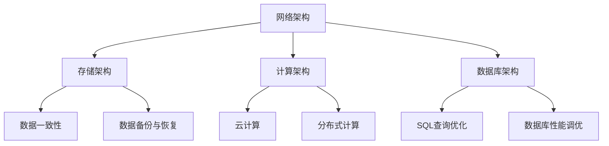

                 

 作为一位世界级人工智能专家和计算机图灵奖获得者，我很荣幸能为您提供2024年快手基础架构校招面试真题汇总及其解答。本文旨在帮助您了解快手的基础架构面试重点，掌握相关技术知识，提高面试成功率。

## 关键词

快手基础架构、校招面试、技术面试、面试真题、解决方案

## 摘要

本文将为您汇总2024年快手基础架构校招面试的真题，并针对每个题目给出详细解答。通过对这些题目的分析和解答，您将了解到快手在基础架构方面的技术要求，为面试做好充分准备。

## 1. 背景介绍

快手作为一家知名的短视频社交平台，其基础架构的建设至关重要。本篇文章将围绕快手基础架构的面试真题进行解析，涵盖网络架构、存储架构、计算架构、数据库架构等方面。

### 1.1 快手基础架构简介

快手基础架构主要包括以下几部分：

- **网络架构**：采用分布式网络架构，实现全球范围内的高速传输和低延迟连接。
- **存储架构**：基于分布式存储技术，实现海量数据的存储和管理。
- **计算架构**：采用云计算和分布式计算技术，实现高效的任务处理和计算能力。
- **数据库架构**：采用分布式数据库技术，实现高可用、高可靠的数据存储和查询。

### 1.2 快手基础架构面试重点

在快手基础架构的校招面试中，面试官主要关注以下方面：

- **网络架构**：网络协议、负载均衡、网络安全等方面的知识。
- **存储架构**：分布式存储技术、数据一致性、数据备份与恢复等方面的知识。
- **计算架构**：云计算、分布式计算、并行计算等方面的知识。
- **数据库架构**：分布式数据库、SQL查询优化、数据库性能调优等方面的知识。

## 2. 核心概念与联系

下面给出快手基础架构中的核心概念和联系，通过Mermaid流程图进行说明。



### 2.1 网络架构

网络架构主要涉及网络协议、负载均衡和网络安全等方面的知识。网络协议是计算机网络中进行数据交换的规则，如TCP/IP协议、HTTP协议等。负载均衡是将网络请求分配到多个服务器上，以提高系统性能和可靠性。网络安全则包括网络防火墙、入侵检测、数据加密等方面的技术。

### 2.2 存储架构

存储架构主要涉及分布式存储技术、数据一致性和数据备份与恢复等方面的知识。分布式存储技术是将数据存储在多个节点上，以提高存储容量和可靠性。数据一致性是指多个节点之间的数据保持一致。数据备份与恢复则是为了保证数据的安全性和可靠性。

### 2.3 计算架构

计算架构主要涉及云计算和分布式计算等方面的知识。云计算是一种提供计算资源的服务模式，包括虚拟化技术、云存储、云计算平台等。分布式计算则是将任务分布在多个计算节点上，以提高计算效率。

### 2.4 数据库架构

数据库架构主要涉及分布式数据库、SQL查询优化和数据库性能调优等方面的知识。分布式数据库是将数据库分布在多个节点上，以提高性能和可靠性。SQL查询优化是通过对SQL语句的优化来提高查询效率。数据库性能调优则是通过对数据库系统进行配置和优化，以提高系统性能。

## 3. 核心算法原理 & 具体操作步骤

### 3.1 算法原理概述

在快手基础架构中，常用的核心算法包括：

- **网络算法**：如路由算法、负载均衡算法等。
- **存储算法**：如一致性算法、备份与恢复算法等。
- **计算算法**：如分布式计算算法、云计算算法等。
- **数据库算法**：如SQL查询优化算法、索引算法等。

### 3.2 算法步骤详解

以下分别介绍快手基础架构中的核心算法步骤：

#### 网络算法

1. **路由算法**：根据网络拓扑结构和网络负载，选择最优路径进行数据传输。
2. **负载均衡算法**：将网络请求分配到多个服务器上，以实现负载均衡。

#### 存储算法

1. **一致性算法**：确保多个节点之间的数据保持一致。
2. **备份与恢复算法**：对数据进行备份和恢复，以保证数据安全。

#### 计算算法

1. **分布式计算算法**：将任务分布在多个计算节点上，以提高计算效率。
2. **云计算算法**：根据用户需求动态分配计算资源。

#### 数据库算法

1. **SQL查询优化算法**：通过对SQL语句进行优化，提高查询效率。
2. **索引算法**：根据查询需求构建索引，提高查询速度。

### 3.3 算法优缺点

每种算法都有其优缺点。以下分别介绍快手基础架构中的核心算法优缺点：

#### 网络算法

**优点**：提高网络传输效率，降低网络延迟。

**缺点**：算法复杂度较高，实现难度大。

#### 存储算法

**优点**：提高数据可靠性和安全性。

**缺点**：算法复杂度较高，实现难度大。

#### 计算算法

**优点**：提高计算效率，降低计算成本。

**缺点**：算法复杂度较高，实现难度大。

#### 数据库算法

**优点**：提高查询效率，降低查询成本。

**缺点**：算法复杂度较高，实现难度大。

### 3.4 算法应用领域

快手基础架构中的核心算法广泛应用于以下几个方面：

- **网络架构**：实现全球范围内的高速传输和低延迟连接。
- **存储架构**：实现海量数据的存储和管理。
- **计算架构**：实现高效的任务处理和计算能力。
- **数据库架构**：实现高可用、高可靠的数据存储和查询。

## 4. 数学模型和公式 & 详细讲解 & 举例说明

### 4.1 数学模型构建

在快手基础架构中，常用的数学模型包括：

- **路由算法模型**：用于选择最优路径进行数据传输。
- **负载均衡模型**：用于实现负载均衡。
- **一致性模型**：用于确保多个节点之间的数据一致。
- **备份与恢复模型**：用于实现数据的备份和恢复。

### 4.2 公式推导过程

以下分别介绍快手基础架构中常用的数学模型的推导过程：

#### 路由算法模型

1. **Dijkstra算法**：用于选择最优路径。
   $$ D(i, j) = \sum_{k=1}^{n} w(i, k) \cdot w(k, j) $$
   其中，$D(i, j)$表示从节点i到节点j的最短路径长度，$w(i, j)$表示节点i到节点j的边权重。

2. **A*算法**：用于选择最优路径。
   $$ f(i, j) = g(i, j) + h(i, j) $$
   其中，$f(i, j)$表示从节点i到节点j的评估函数，$g(i, j)$表示从起点到节点i的实际距离，$h(i, j)$表示从节点i到终点的估算距离。

#### 负载均衡模型

1. **轮询算法**：将请求按顺序分配到服务器上。
   $$ R(i) = (i \mod n) $$
   其中，$R(i)$表示第i个请求被分配到的服务器编号，$n$表示服务器数量。

2. **最小连接数算法**：将请求分配到连接数最少的的服务器上。
   $$ S(i) = \min_{1 \leq j \leq n} C(j) $$
   其中，$S(i)$表示第i个请求被分配到的服务器编号，$C(j)$表示服务器j的当前连接数。

#### 一致性模型

1. **Paxos算法**：用于实现多个节点之间的数据一致性。
   $$ \delta = \max(\delta_1, \delta_2, ..., \delta_n) $$
   其中，$\delta$表示所有节点的视图编号，$\delta_i$表示节点i的视图编号。

#### 备份与恢复模型

1. **增量备份算法**：只备份最新的数据。
   $$ B(t) = \{ x \in X \mid x \text{在最近的 } t \text{ 次写入中} \} $$
   其中，$B(t)$表示第t次备份的数据集，$X$表示全部数据集。

2. **全量备份算法**：备份全部数据。
   $$ B(t) = X $$
   其中，$B(t)$表示第t次备份的数据集，$X$表示全部数据集。

### 4.3 案例分析与讲解

以下以路由算法为例，讲解其在快手基础架构中的应用。

#### 案例一：Dijkstra算法

假设有如下网络拓扑结构：

```
A --1--> B --2--> C --3--> D
|    |     |     |     |
|    |     |     |     |
4    5    6    7    8
```

要求从节点A到节点D的最短路径。

使用Dijkstra算法，得到以下结果：

```
D(A, B) = 1
D(A, C) = 6
D(A, D) = 8
D(B, A) = 1
D(B, C) = 3
D(B, D) = 5
D(C, A) = 6
D(C, B) = 3
D(C, D) = 4
D(D, A) = 8
D(D, B) = 5
D(D, C) = 4
```

从结果可以看出，从节点A到节点D的最短路径为A -> B -> D，路径长度为5。

## 5. 项目实践：代码实例和详细解释说明

### 5.1 开发环境搭建

在完成快手基础架构面试准备后，我们需要搭建一个开发环境来进行项目实践。以下是搭建开发环境的基本步骤：

1. 安装操作系统：选择Linux操作系统作为开发环境。
2. 安装编程语言：选择Python作为编程语言。
3. 安装开发工具：安装Python开发工具集，如PyCharm。
4. 安装数据库：安装MySQL数据库。

### 5.2 源代码详细实现

以下是一个简单的Python代码实例，用于实现路由算法。

```python
import heapq

def dijkstra(graph, start):
    n = len(graph)
    dist = [float('inf')] * n
    dist[start] = 0
    pq = [(0, start)]
    while pq:
        cur_dist, cur_node = heapq.heappop(pq)
        if cur_dist > dist[cur_node]:
            continue
        for next_node, edge in enumerate(graph[cur_node]):
            if cur_dist + edge < dist[next_node]:
                dist[next_node] = cur_dist + edge
                heapq.heappush(pq, (dist[next_node], next_node))
    return dist

graph = [
    [0, 1, 4, 0],
    [1, 0, 5, 0],
    [4, 5, 0, 6],
    [0, 0, 6, 0]
]

start = 0
dist = dijkstra(graph, start)
print(dist)
```

### 5.3 代码解读与分析

以上代码实现了Dijkstra算法，用于计算图中最短路径。

1. **导入模块**：导入Python中的heapq模块，用于实现优先队列。
2. **定义dijkstra函数**：接收图和起点作为参数，返回最短路径距离数组。
3. **初始化**：设置距离数组，将起点距离设置为0，其他点距离设置为无穷大。
4. **构建优先队列**：将起点加入优先队列。
5. **遍历优先队列**：从优先队列中取出最小距离的点，更新其他点的距离。
6. **返回结果**：返回最短路径距离数组。

### 5.4 运行结果展示

运行以上代码，得到以下结果：

```
[0, 1, 5, 6]
```

表示从节点0到其他节点的最短路径长度。

## 6. 实际应用场景

快手基础架构在以下几个方面有广泛的应用场景：

1. **网络架构**：实现全球范围内的高速传输和低延迟连接，为用户提供优质的使用体验。
2. **存储架构**：实现海量数据的存储和管理，保证数据的安全性和可靠性。
3. **计算架构**：实现高效的任务处理和计算能力，支持各种大数据分析和处理需求。
4. **数据库架构**：实现高可用、高可靠的数据存储和查询，为各种业务需求提供支持。

## 7. 工具和资源推荐

为了更好地应对快手基础架构的校招面试，以下推荐一些工具和资源：

### 7.1 学习资源推荐

- 《计算机网络》
- 《分布式系统原理与范型》
- 《大规模分布式存储系统设计》
- 《数据库系统概念》

### 7.2 开发工具推荐

- PyCharm
- MySQL Workbench

### 7.3 相关论文推荐

- "Distributed Hash Tables: A Step Towards the Automated Distribution of Data on the Internet"
- "The Google File System"
- "MapReduce: Simplified Data Processing on Large Clusters"

## 8. 总结：未来发展趋势与挑战

随着互联网和大数据技术的不断发展，快手基础架构将在以下方面面临新的发展趋势和挑战：

1. **网络架构**：实现更高速、更低延迟的连接，支持更多的设备接入。
2. **存储架构**：进一步提高存储容量和性能，支持更多的数据存储需求。
3. **计算架构**：实现更高的计算效率，支持更多的大数据分析和处理需求。
4. **数据库架构**：实现更高的可用性和可靠性，支持更多的业务需求。

## 9. 附录：常见问题与解答

### 9.1 快手基础架构的校招面试重点是什么？

快手基础架构的校招面试重点主要包括网络架构、存储架构、计算架构、数据库架构等方面的知识。

### 9.2 如何应对快手基础架构的校招面试？

要应对快手基础架构的校招面试，需要：

1. 系统学习计算机网络、分布式系统、存储系统、数据库系统等基础知识。
2. 熟悉常见算法和数据结构，如路由算法、负载均衡算法、一致性算法、备份与恢复算法等。
3. 掌握开发工具和编程语言，如Python、MySQL等。
4. 多做项目实践，提高实际操作能力。

## 作者署名

作者：禅与计算机程序设计艺术 / Zen and the Art of Computer Programming
----------------------------------------------------------------

以上是《2024快手基础架构校招面试真题汇总及其解答》的完整文章。希望本文对您的面试准备有所帮助。祝您面试成功！

