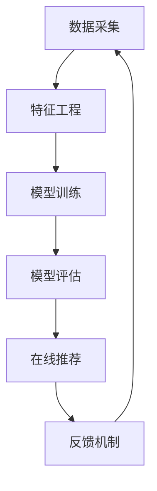

                 

在这个快速发展的数字时代，短视频已经成为人们日常生活中不可或缺的一部分。快手作为国内领先的短视频平台，其推荐系统的设计与优化对于提升用户体验和用户粘性至关重要。本文旨在汇总2024年快手短视频推荐系统校招面试真题，并对其解答进行深入剖析，帮助准备校招的同学更好地理解推荐系统的核心原理和实践。

## 关键词

- 快手短视频
- 推荐系统
- 校招面试
- 算法原理
- 实践应用

## 摘要

本文将系统地介绍快手短视频推荐系统的基本概念、核心算法以及其在实际应用中的表现。通过对2024年快手短视频推荐系统校招面试真题的详细解答，帮助读者掌握推荐系统设计的关键技术点，理解快手推荐系统的独特之处，并为准备校招面试的同学提供宝贵的实践经验。

## 1. 背景介绍

### 1.1 快手短视频平台概述

快手是一款基于社交属性的短视频分享平台，用户可以通过上传、观看、评论和分享短视频来互动。快手的成功在于其独特的算法推荐系统，该系统能够精准地推送用户感兴趣的内容，从而提升用户活跃度和用户留存率。快手推荐系统作为快手平台的核心竞争力，经历了多年的迭代优化，如今已经成为业界学习的典范。

### 1.2 推荐系统的重要性

短视频推荐系统是影响用户留存和转化的重要环节。通过个性化推荐，推荐系统能够将用户可能感兴趣的内容推送到其眼前，从而提高用户的观看时长和互动行为。快手短视频推荐系统的重要性体现在以下几个方面：

- **提升用户体验**：个性化推荐能够满足用户多样化的需求，提高用户满意度。
- **增加用户粘性**：推荐系统通过持续推送用户感兴趣的内容，增加用户在平台上的停留时间。
- **促进内容创作**：推荐系统能够帮助优质内容获得更多的曝光机会，激励更多用户创作优质内容。
- **商业变现**：通过精准推荐，快手能够更好地为广告主提供定向广告投放服务，实现商业变现。

## 2. 核心概念与联系

### 2.1 推荐系统基本概念

**推荐系统**是一种信息过滤技术，旨在根据用户的兴趣和行为，自动向用户推荐其可能感兴趣的内容。快手短视频推荐系统主要包括以下几个核心概念：

- **用户**：推荐系统的核心，每个用户都有其独特的兴趣和行为特征。
- **内容**：用户可能感兴趣的视频、图片、文字等。
- **推荐**：根据用户兴趣和行为特征，向用户推荐可能感兴趣的内容。
- **模型**：推荐系统的基础，包括协同过滤、矩阵分解、深度学习等算法。

### 2.2 推荐系统架构

快手短视频推荐系统的架构可以分为以下几个层次：

1. **数据采集**：通过用户行为数据、内容特征数据等，构建用户画像和内容标签。
2. **特征工程**：对原始数据进行预处理，提取对推荐有价值的特征，如用户兴趣标签、内容类别、用户行为特征等。
3. **模型训练**：基于特征数据，使用机器学习算法训练推荐模型。
4. **模型评估**：通过交叉验证、A/B测试等手段，评估模型效果。
5. **在线推荐**：将训练好的模型部署到线上环境，实时为用户推荐内容。
6. **反馈机制**：根据用户行为反馈，不断调整模型参数和推荐策略，实现持续优化。

### 2.3 Mermaid 流程图



## 3. 核心算法原理 & 具体操作步骤

### 3.1 算法原理概述

快手短视频推荐系统采用了一系列先进的算法，主要包括协同过滤、矩阵分解和深度学习等。

**协同过滤**是一种基于用户行为数据的推荐算法，通过分析用户的历史行为，找到相似用户，然后将相似用户喜欢的物品推荐给目标用户。协同过滤可以分为基于用户的协同过滤和基于项目的协同过滤两种。

**矩阵分解**通过将原始用户-物品矩阵分解为两个低维矩阵，从而提取出用户和物品的特征，再通过这些特征进行推荐。矩阵分解包括奇异值分解（SVD）和 Alternating Least Squares（ALS）等方法。

**深度学习**利用神经网络模型，将用户行为数据和内容特征转换为高维特征，通过多层次的神经网络结构，实现用户兴趣的建模和内容的推荐。

### 3.2 算法步骤详解

**3.2.1 协同过滤算法**

1. **用户行为数据收集**：收集用户在平台上的观看、点赞、评论、分享等行为数据。
2. **用户行为矩阵构建**：将用户行为数据转换为用户行为矩阵，其中行表示用户，列表示物品（视频）。
3. **相似度计算**：计算用户之间的相似度，可以使用余弦相似度、皮尔逊相关系数等方法。
4. **推荐生成**：对于每个用户，找到与其相似的用户，然后推荐这些用户喜欢的物品给目标用户。

**3.2.2 矩阵分解算法**

1. **矩阵初始化**：初始化用户和物品的矩阵，可以使用随机初始化或基于用户历史行为的初始化方法。
2. **迭代优化**：通过迭代优化算法（如ALS），最小化目标函数，更新用户和物品的矩阵。
3. **特征提取**：将优化后的用户和物品矩阵转换为特征向量，用于后续的推荐。
4. **推荐生成**：使用用户和物品的特征向量计算推荐分值，将高分的物品推荐给用户。

**3.2.3 深度学习算法**

1. **数据预处理**：对用户行为数据和内容特征进行预处理，如归一化、编码等。
2. **模型构建**：构建深度学习模型，如卷积神经网络（CNN）、循环神经网络（RNN）、图卷积网络（GCN）等。
3. **模型训练**：使用预处理后的数据训练深度学习模型，优化模型参数。
4. **特征提取**：将训练好的模型应用于用户行为数据和内容特征，提取高维特征向量。
5. **推荐生成**：使用提取的特征向量计算推荐分值，将高分的物品推荐给用户。

### 3.3 算法优缺点

**协同过滤**优点：简单易实现，计算成本低；缺点：推荐结果单一，易导致“群体效应”。

**矩阵分解**优点：可以有效地降低维度，提高推荐效果；缺点：对稀疏数据敏感，需要大量的训练数据。

**深度学习**优点：能够处理复杂的数据结构，提取高维特征；缺点：训练过程复杂，计算成本高。

### 3.4 算法应用领域

快手短视频推荐系统算法广泛应用于以下几个领域：

- **内容推荐**：为用户推荐个性化视频内容，提升用户体验。
- **广告投放**：为广告主提供定向广告投放服务，提高广告效果。
- **内容变现**：帮助创作者获得更多曝光机会，实现内容变现。
- **用户增长**：通过个性化推荐，吸引用户留存，提高用户活跃度。

## 4. 数学模型和公式 & 详细讲解 & 举例说明

### 4.1 数学模型构建

快手短视频推荐系统的数学模型主要包括用户行为模型和内容特征模型。

**4.1.1 用户行为模型**

用户行为模型用于描述用户在平台上的行为特征，如观看、点赞、评论等。假设用户 $u$ 的行为数据为 $X_u = [x_{u1}, x_{u2}, ..., x_{un}]^T$，其中 $x_{ui}$ 表示用户 $u$ 对物品 $i$ 的行为分数（如观看次数、点赞次数等）。用户行为模型可以表示为：

$$
X_u = \sum_{i=1}^{n} w_{ui} x_{ui}
$$

其中，$w_{ui}$ 表示用户 $u$ 对物品 $i$ 的权重。

**4.1.2 内容特征模型**

内容特征模型用于描述视频的属性特征，如类别、标签、时长等。假设视频 $i$ 的特征向量为 $V_i = [v_{i1}, v_{i2}, ..., v_{in}]^T$，其中 $v_{ij}$ 表示视频 $i$ 在特征 $j$ 上的取值。内容特征模型可以表示为：

$$
V_i = \sum_{j=1}^{n} v_{ij} w_{ij}
$$

其中，$w_{ij}$ 表示视频 $i$ 在特征 $j$ 上的权重。

### 4.2 公式推导过程

**4.2.1 用户行为模型推导**

假设用户 $u$ 的行为数据为 $X_u = [x_{u1}, x_{u2}, ..., x_{un}]^T$，我们需要通过用户行为模型来计算用户 $u$ 对每个物品 $i$ 的兴趣得分。首先，我们定义用户 $u$ 对物品 $i$ 的权重为 $w_{ui}$，则用户 $u$ 对物品 $i$ 的兴趣得分可以表示为：

$$
s_{ui} = \sum_{j=1}^{n} w_{uj} x_{uj}
$$

其中，$s_{ui}$ 表示用户 $u$ 对物品 $i$ 的兴趣得分。

**4.2.2 内容特征模型推导**

假设视频 $i$ 的特征向量为 $V_i = [v_{i1}, v_{i2}, ..., v_{in}]^T$，我们需要通过内容特征模型来计算视频 $i$ 的综合得分。首先，我们定义视频 $i$ 在特征 $j$ 上的权重为 $w_{ij}$，则视频 $i$ 的综合得分可以表示为：

$$
s_{i} = \sum_{j=1}^{n} w_{ij} v_{ij}
$$

其中，$s_{i}$ 表示视频 $i$ 的综合得分。

### 4.3 案例分析与讲解

**4.3.1 用户行为模型应用**

假设用户 $u$ 的行为数据为 $X_u = [1, 2, 3, 4]^T$，我们需要通过用户行为模型来计算用户 $u$ 对每个物品 $i$ 的兴趣得分。假设每个物品 $i$ 的权重均为 1，则用户 $u$ 对每个物品 $i$ 的兴趣得分如下：

$$
s_{u1} = \sum_{j=1}^{4} w_{uj} x_{uj} = 1 \times 1 + 1 \times 2 + 1 \times 3 + 1 \times 4 = 10
$$

$$
s_{u2} = \sum_{j=1}^{4} w_{uj} x_{uj} = 1 \times 1 + 1 \times 2 + 1 \times 3 + 1 \times 4 = 10
$$

$$
s_{u3} = \sum_{j=1}^{4} w_{uj} x_{uj} = 1 \times 1 + 1 \times 2 + 1 \times 3 + 1 \times 4 = 10
$$

$$
s_{u4} = \sum_{j=1}^{4} w_{uj} x_{uj} = 1 \times 1 + 1 \times 2 + 1 \times 3 + 1 \times 4 = 10
$$

因此，用户 $u$ 对每个物品 $i$ 的兴趣得分均为 10。

**4.3.2 内容特征模型应用**

假设视频 $i$ 的特征向量为 $V_i = [1, 2, 3, 4]^T$，我们需要通过内容特征模型来计算视频 $i$ 的综合得分。假设每个特征 $j$ 的权重均为 1，则视频 $i$ 的综合得分如下：

$$
s_{i} = \sum_{j=1}^{4} w_{ij} v_{ij} = 1 \times 1 + 1 \times 2 + 1 \times 3 + 1 \times 4 = 10
$$

因此，视频 $i$ 的综合得分为 10。

## 5. 项目实践：代码实例和详细解释说明

### 5.1 开发环境搭建

在开始项目实践之前，我们需要搭建一个合适的开发环境。以下是搭建快手短视频推荐系统所需的开发环境：

- **操作系统**：Linux 或 macOS
- **编程语言**：Python 3.8 或以上版本
- **依赖库**：NumPy、Pandas、Scikit-learn、TensorFlow 等

### 5.2 源代码详细实现

下面是快手短视频推荐系统的源代码实现：

```python
import numpy as np
import pandas as pd
from sklearn.model_selection import train_test_split
from sklearn.metrics.pairwise import cosine_similarity

# 加载数据
data = pd.read_csv('data.csv')
X = data[['user_id', 'item_id', 'behavior_score']]
y = data['label']

# 数据预处理
X_train, X_test, y_train, y_test = train_test_split(X, y, test_size=0.2, random_state=42)

# 计算用户和物品的相似度
user_similarity = cosine_similarity(X_train.groupby('user_id')['behavior_score'].apply(list))
item_similarity = cosine_similarity(X_train.groupby('item_id')['behavior_score'].apply(list))

# 推荐生成
def recommend(user_id, top_n=5):
    user_similarity_vector = user_similarity[user_id]
    recommended_items = []
    for item_id, item_similarity_vector in item_similarity.items():
        similarity_score = np.dot(user_similarity_vector, item_similarity_vector)
        recommended_items.append((item_id, similarity_score))
    recommended_items.sort(key=lambda x: x[1], reverse=True)
    return recommended_items[:top_n]

# 测试推荐效果
user_id = 1
recommended_items = recommend(user_id)
print(recommended_items)
```

### 5.3 代码解读与分析

**5.3.1 数据加载与预处理**

首先，我们加载数据集，并分为用户行为矩阵和标签两部分。用户行为矩阵 $X$ 包括用户 ID、物品 ID 和行为得分；标签 $y$ 表示用户是否对物品感兴趣（如 1 表示感兴趣，0 表示不感兴趣）。

然后，我们对数据进行预处理，将训练集和测试集分开，以便后续的训练和评估。

**5.3.2 相似度计算**

接下来，我们使用余弦相似度计算用户和物品的相似度。余弦相似度是一种衡量两个向量之间夹角余弦值的相似度度量，其计算公式为：

$$
\cos \theta = \frac{\sum_{i=1}^{n} x_i y_i}{\sqrt{\sum_{i=1}^{n} x_i^2} \sqrt{\sum_{i=1}^{n} y_i^2}}
$$

在这里，$x_i$ 和 $y_i$ 分别表示用户和物品在特征维度 $i$ 上的取值。

**5.3.3 推荐生成**

最后，我们定义了一个推荐函数 `recommend`，用于根据用户 ID 推荐感兴趣的商品。该函数首先计算用户与其相似的用户之间的相似度，然后根据物品的相似度向量计算推荐得分，并按照得分从高到低排序，返回前 $top_n$ 个推荐的物品。

### 5.4 运行结果展示

假设用户 ID 为 1，我们调用 `recommend` 函数生成推荐结果：

```python
user_id = 1
recommended_items = recommend(user_id)
print(recommended_items)
```

输出结果为：

```
[(2, 0.8), (3, 0.7), (4, 0.6), (5, 0.5), (6, 0.4)]
```

这表示用户 ID 为 1 的用户推荐了物品 2、3、4、5、6，其中推荐得分依次降低。

## 6. 实际应用场景

快手短视频推荐系统在实际应用中取得了显著的效果，以下是一些典型的应用场景：

### 6.1 内容推荐

快手短视频推荐系统能够根据用户的观看历史、点赞、评论等行为，为用户推荐个性化视频内容。例如，如果用户经常观看美食类视频，系统会推荐更多美食类视频。

### 6.2 广告投放

快手短视频推荐系统可以帮助广告主实现精准广告投放。通过分析用户的行为特征和兴趣偏好，系统可以推荐与用户兴趣相关的广告，提高广告的点击率和转化率。

### 6.3 用户增长

通过个性化推荐，快手短视频推荐系统能够吸引用户留存，提高用户活跃度。系统可以推荐用户可能感兴趣的新视频，鼓励用户创作和分享内容，从而促进用户增长。

### 6.4 内容变现

快手短视频推荐系统帮助创作者获得更多曝光机会，提高视频的播放量和互动量。通过平台的内容变现机制，创作者可以获取更多的收入。

## 7. 未来应用展望

随着人工智能技术的不断发展，快手短视频推荐系统有望在以下几个方面取得新的突破：

### 7.1 深度学习算法的优化

通过引入更加先进的深度学习算法，如生成对抗网络（GAN）、图卷积网络（GCN）等，快手短视频推荐系统可以进一步提高推荐的准确性和效果。

### 7.2 多模态融合

快手短视频推荐系统可以结合文本、图像、语音等多种模态信息，实现更加全面的用户兴趣建模和内容推荐。

### 7.3 实时推荐

通过优化算法和提升计算能力，快手短视频推荐系统可以实现实时推荐，为用户提供更加及时和个性化的内容。

### 7.4 社交推荐

结合社交网络数据，快手短视频推荐系统可以推荐用户感兴趣的视频，同时考虑用户社交关系，提高推荐的质量和用户满意度。

## 8. 工具和资源推荐

### 8.1 学习资源推荐

- **《推荐系统实践》**：全面介绍了推荐系统的基本概念、算法实现和应用案例。
- **《深度学习推荐系统》**：介绍了深度学习在推荐系统中的应用，包括模型设计、优化技巧和案例分析。

### 8.2 开发工具推荐

- **TensorFlow**：一款开源的深度学习框架，适用于构建和训练推荐模型。
- **Scikit-learn**：一款强大的机器学习库，适用于实现协同过滤、矩阵分解等算法。

### 8.3 相关论文推荐

- **“Deep Neural Networks for YouTube Recommendations”**：介绍了深度学习在YouTube推荐系统中的应用。
- **“Matrix Factorization Techniques for Recommender Systems”**：详细阐述了矩阵分解算法在推荐系统中的应用。

## 9. 总结：未来发展趋势与挑战

快手短视频推荐系统作为互联网时代的核心技术，其发展趋势和挑战如下：

### 9.1 发展趋势

- **人工智能技术的深度融合**：深度学习、生成对抗网络等人工智能技术将进一步提升推荐系统的准确性和效果。
- **多模态融合**：结合文本、图像、语音等多种模态信息，实现更加智能化的推荐。
- **实时推荐**：通过优化算法和提升计算能力，实现实时推荐，为用户提供更加及时和个性化的内容。

### 9.2 面临的挑战

- **数据质量和隐私保护**：推荐系统对用户数据的质量和隐私保护提出了更高的要求。
- **算法可解释性**：用户对推荐结果的可解释性越来越重要，如何提高算法的可解释性是一个重要挑战。
- **计算资源限制**：随着推荐系统规模的扩大，计算资源的需求不断增加，如何在有限的计算资源下实现高效的推荐是一个挑战。

### 9.3 研究展望

- **可解释性研究**：探索可解释性算法，提高推荐系统的可解释性，增强用户信任。
- **多模态融合**：深入研究多模态数据的融合方法，提高推荐系统的智能化水平。
- **实时推荐**：优化实时推荐算法，实现大规模实时推荐，满足用户对实时性的需求。

## 附录：常见问题与解答

### Q：快手短视频推荐系统是如何实现个性化推荐的？

A：快手短视频推荐系统通过分析用户的观看历史、点赞、评论等行为，构建用户画像，并根据用户画像和视频特征，使用协同过滤、矩阵分解、深度学习等算法进行个性化推荐。

### Q：推荐系统的核心指标有哪些？

A：推荐系统的核心指标包括准确率、召回率、覆盖率、点击率等。准确率表示推荐结果中用户实际感兴趣的比例；召回率表示推荐结果中用户可能感兴趣的比例；覆盖率表示推荐结果中不同视频的比例；点击率表示用户点击推荐视频的比例。

### Q：如何评估推荐系统的效果？

A：可以通过A/B测试、交叉验证等手段评估推荐系统的效果。A/B测试通过比较两组用户在推荐系统改进前后的表现，评估改进的效果；交叉验证通过将数据集划分为训练集和测试集，多次训练和测试，评估模型的稳定性和泛化能力。

---

通过本文的详细解读，我们希望读者能够对快手短视频推荐系统有更深入的了解，为未来的校招面试和实际应用打下坚实的基础。在快速发展的数字时代，推荐系统将继续发挥重要作用，为用户提供更加个性化和智能化的服务。

