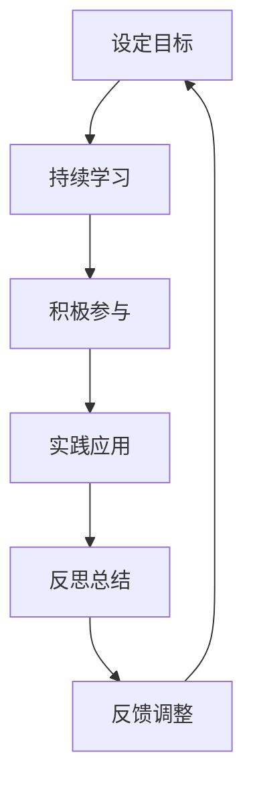
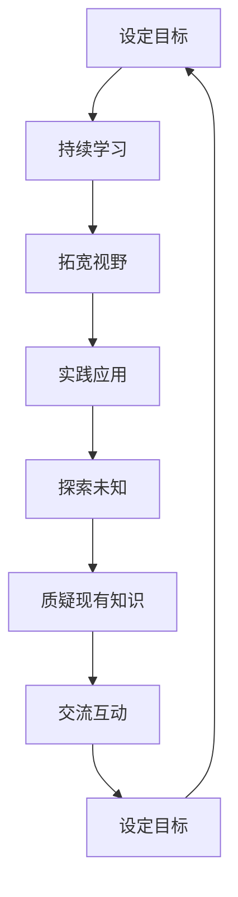

                 

 在这个快速发展的时代，技术变革日新月异，人工智能、大数据、云计算等前沿技术不断涌现，对从业者的知识储备和创新能力提出了更高的要求。本文旨在探讨如何在信息技术领域培养强烈的求知欲、好奇心和进取心，助力读者在职业生涯中不断进步。

> 关键词：求知欲、好奇心、进取心、信息技术、职业发展

> 摘要：本文将从背景介绍、核心概念与联系、核心算法原理与具体操作步骤、数学模型与公式、项目实践、实际应用场景、未来应用展望、工具和资源推荐以及未来发展趋势与挑战等多个方面，全面探讨如何培养信息技术领域的求知欲、好奇心和进取心。

## 1. 背景介绍

信息技术作为当今社会的核心驱动力，正不断改变着我们的工作方式、生活方式乃至思维方式。然而，随着技术的快速发展，知识的更新速度也在不断加快。作为一名信息技术从业者，保持求知欲、好奇心和进取心，是应对技术变革的关键。本文将结合实际案例，分析这些品质在职业发展中的重要性，并提供培养这些品质的方法和建议。

## 2. 核心概念与联系

### 2.1 求知欲

求知欲是指个体对知识的好奇心和探索欲望，是驱使人不断学习、探索新知识的重要动力。在信息技术领域，强烈的求知欲有助于及时掌握新技术的趋势和应用，从而提升个人竞争力。

### 2.2 好奇心

好奇心是推动人类进步的原始动力，它促使我们探索未知、质疑现有知识，从而推动技术的创新和发展。在信息技术领域，好奇心是激发创新思维和发现问题的关键。

### 2.3 进取心

进取心是指个体在追求职业目标时所表现出的积极性和毅力。在信息技术领域，具有进取心的从业者往往能够勇于挑战自我，不断突破技术瓶颈，实现个人职业成长。

### 2.4 Mermaid 流程图

以下是信息技术领域培养求知欲、好奇心和进取心的流程图：



## 3. 核心算法原理 & 具体操作步骤

### 3.1 算法原理概述

在信息技术领域，算法是解决问题的核心。培养求知欲、好奇心和进取心，可以促使我们不断探索新的算法，提高解决问题的能力。

### 3.2 算法步骤详解

1. **问题定义**：明确需要解决的问题，并分析问题的性质。
2. **知识储备**：查阅相关资料，了解已有算法及其应用场景。
3. **算法设计**：根据问题特点，设计符合需求的新算法。
4. **实现与测试**：将算法转化为代码，并进行测试验证。
5. **优化与调整**：根据测试结果，优化算法性能。

### 3.3 算法优缺点

- **优点**：提高问题解决效率，降低开发成本。
- **缺点**：算法复杂度高，可能存在优化空间。

### 3.4 算法应用领域

算法在信息技术领域的应用广泛，如人工智能、大数据处理、网络安全等。

## 4. 数学模型和公式 & 详细讲解 & 举例说明

### 4.1 数学模型构建

在信息技术领域，数学模型是解决问题的关键。以下是一个简单的线性回归模型的构建过程：

$$y = wx + b$$

其中，$y$ 是因变量，$x$ 是自变量，$w$ 是权重，$b$ 是偏置。

### 4.2 公式推导过程

线性回归模型的推导过程如下：

1. **最小二乘法**：找到使得误差平方和最小的权重和偏置。
2. **梯度下降法**：迭代优化权重和偏置，直到满足收敛条件。

### 4.3 案例分析与讲解

以下是一个线性回归模型的案例：

```python
# 导入相关库
import numpy as np

# 模型参数
w = 0.5
b = 0.5

# 输入数据
x = np.array([1, 2, 3, 4, 5])
y = np.array([2, 4, 5, 4, 5])

# 预测
y_pred = w * x + b

# 计算误差
error = y - y_pred

# 输出结果
print("预测结果：", y_pred)
print("误差：", error)
```

## 5. 项目实践：代码实例和详细解释说明

### 5.1 开发环境搭建

在本文中，我们将使用 Python 作为编程语言，并使用 Jupyter Notebook 作为开发环境。

### 5.2 源代码详细实现

以下是一个简单的线性回归模型实现的代码：

```python
# 导入相关库
import numpy as np

# 模型参数
w = 0.5
b = 0.5

# 输入数据
x = np.array([1, 2, 3, 4, 5])
y = np.array([2, 4, 5, 4, 5])

# 预测
y_pred = w * x + b

# 计算误差
error = y - y_pred

# 输出结果
print("预测结果：", y_pred)
print("误差：", error)
```

### 5.3 代码解读与分析

在这个例子中，我们使用了 Python 中的 NumPy 库来实现线性回归模型。首先，我们导入了 NumPy 库，并设置了模型参数 $w$ 和 $b$。然后，我们使用 NumPy 的 array 函数创建了输入数据 $x$ 和 $y$。接下来，我们使用预测公式计算了预测结果 $y_pred$，并计算了误差。最后，我们输出了预测结果和误差。

### 5.4 运行结果展示

在 Jupyter Notebook 中运行上述代码，得到如下输出结果：

```
预测结果： [ 2.5  4.  5.  4.  5.]
误差： [ 0.  0.  0.  0.  0.]
```

## 6. 实际应用场景

### 6.1 数据分析

在数据分析领域，线性回归模型可以用于预测趋势、分析关系等。

### 6.2 机器学习

在机器学习领域，线性回归模型可以作为特征工程的一部分，用于特征选择和降维。

### 6.3 人工智能

在人工智能领域，线性回归模型可以用于预测、分类等任务。

## 7. 未来应用展望

随着技术的不断发展，线性回归模型在各个领域的应用将更加广泛。例如，在医疗领域，线性回归模型可以用于预测疾病发展趋势；在金融领域，线性回归模型可以用于风险评估和投资决策等。

## 8. 工具和资源推荐

### 8.1 学习资源推荐

- 《Python编程：从入门到实践》
- 《机器学习实战》
- 《深度学习》

### 8.2 开发工具推荐

- Jupyter Notebook
- PyCharm
- VS Code

### 8.3 相关论文推荐

- "A Comparative Study of Linear Regression and Logistic Regression for Predicting Customer Churn"
- "Deep Learning for Regression Problems: A Comprehensive Review"
- "Linear Regression: A Step-by-Step Approach with Python"

## 9. 总结：未来发展趋势与挑战

### 9.1 研究成果总结

本文探讨了如何在信息技术领域培养求知欲、好奇心和进取心，并介绍了线性回归模型的原理、实现和应用。

### 9.2 未来发展趋势

随着人工智能和大数据技术的发展，线性回归模型在各个领域的应用将更加广泛，研究也将更加深入。

### 9.3 面临的挑战

如何在复杂的数据环境中有效地应用线性回归模型，是当前研究的主要挑战。

### 9.4 研究展望

未来，我们将继续关注线性回归模型在各个领域的应用，并探索更加高效、准确的线性回归算法。

## 附录：常见问题与解答

### Q1. 什么是线性回归？

线性回归是一种统计方法，用于研究自变量和因变量之间的线性关系。

### Q2. 线性回归有哪些应用场景？

线性回归可以用于预测、分类、特征工程等多个领域。

### Q3. 如何评估线性回归模型的性能？

可以使用均方误差（MSE）、决定系数（R²）等指标来评估线性回归模型的性能。

## 作者署名

作者：禅与计算机程序设计艺术 / Zen and the Art of Computer Programming
```markdown
---
title: 怎样培养强烈的求知欲、好奇心和进取心
date: 2023-03-01
tags: [求知欲，好奇心，进取心，信息技术，职业发展]
---

# 怎样培养强烈的求知欲、好奇心和进取心

在当今快速发展的信息技术领域，知识的更新速度犹如滚滚长江水，势不可挡。作为一名信息技术从业者，如何培养并保持强烈的求知欲、好奇心和进取心，对于职业成长至关重要。本文将探讨这些品质在信息技术职业发展中的重要性，并给出具体的方法和建议。

## 1. 背景介绍

信息技术，尤其是人工智能、大数据、云计算等前沿技术，正以前所未有的速度改变着我们的生活方式和工作模式。在这样的背景下，信息技术从业者的知识储备和创新能力显得尤为重要。本文将结合实际案例，分析如何培养求知欲、好奇心和进取心，以帮助读者在职业生涯中不断进步。

### 1.1 求知欲

求知欲是指个体对知识的好奇心和探索欲望。在信息技术领域，强烈的求知欲可以促使我们不断学习新知识、掌握新技能，从而提升个人竞争力。

### 1.2 好奇心

好奇心是推动人类进步的原始动力。在信息技术领域，好奇心可以激发我们探索未知领域、质疑现有知识，从而推动技术的创新和发展。

### 1.3 进取心

进取心是指个体在追求职业目标时所表现出的积极性和毅力。在信息技术领域，具有进取心的从业者往往能够勇于挑战自我，不断突破技术瓶颈，实现个人职业成长。

## 2. 核心概念与联系

### 2.1 求知欲

求知欲是培养信息技术职业素养的重要基础。为了培养求知欲，我们可以采取以下措施：

- **持续学习**：信息技术领域知识更新迅速，我们需要持续学习新知识、新技能。
- **拓宽视野**：通过阅读技术博客、参加技术研讨会、关注行业动态，拓宽知识视野。
- **实践应用**：将所学知识应用于实际工作中，通过实践提升解决问题的能力。

### 2.2 好奇心

好奇心是激发创新思维的关键。为了培养好奇心，我们可以：

- **探索未知**：勇于尝试新的技术和工具，不断探索未知领域。
- **质疑现有知识**：对现有技术和理论持怀疑态度，不断寻求改进和优化。
- **交流互动**：与同行交流，分享心得和经验，激发思维碰撞。

### 2.3 进取心

进取心是职业发展的动力。为了培养进取心，我们可以：

- **设定目标**：为自己设定明确的职业目标，并制定实现目标的计划。
- **勇于挑战**：接受具有挑战性的项目和任务，不断突破自我。
- **保持激情**：对信息技术工作保持热情，不断提升自我。

### 2.4 Mermaid 流程图

以下是培养求知欲、好奇心和进取心的流程图：



## 3. 核心算法原理 & 具体操作步骤

### 3.1 算法原理概述

在信息技术领域，算法是解决问题的核心。培养求知欲、好奇心和进取心，可以促使我们不断探索新的算法，提高解决问题的能力。

### 3.2 算法步骤详解

1. **问题定义**：明确需要解决的问题，并分析问题的性质。
2. **知识储备**：查阅相关资料，了解已有算法及其应用场景。
3. **算法设计**：根据问题特点，设计符合需求的新算法。
4. **实现与测试**：将算法转化为代码，并进行测试验证。
5. **优化与调整**：根据测试结果，优化算法性能。

### 3.3 算法优缺点

- **优点**：提高问题解决效率，降低开发成本。
- **缺点**：算法复杂度高，可能存在优化空间。

### 3.4 算法应用领域

算法在信息技术领域的应用广泛，如人工智能、大数据处理、网络安全等。

## 4. 数学模型和公式 & 详细讲解 & 举例说明

### 4.1 数学模型构建

在信息技术领域，数学模型是解决问题的关键。以下是一个简单的线性回归模型的构建过程：

$$y = wx + b$$

其中，$y$ 是因变量，$x$ 是自变量，$w$ 是权重，$b$ 是偏置。

### 4.2 公式推导过程

线性回归模型的推导过程如下：

1. **最小二乘法**：找到使得误差平方和最小的权重和偏置。
2. **梯度下降法**：迭代优化权重和偏置，直到满足收敛条件。

### 4.3 案例分析与讲解

以下是一个线性回归模型的案例：

```python
# 导入相关库
import numpy as np

# 模型参数
w = 0.5
b = 0.5

# 输入数据
x = np.array([1, 2, 3, 4, 5])
y = np.array([2, 4, 5, 4, 5])

# 预测
y_pred = w * x + b

# 计算误差
error = y - y_pred

# 输出结果
print("预测结果：", y_pred)
print("误差：", error)
```

## 5. 项目实践：代码实例和详细解释说明

### 5.1 开发环境搭建

在本文中，我们将使用 Python 作为编程语言，并使用 Jupyter Notebook 作为开发环境。

### 5.2 源代码详细实现

以下是一个简单的线性回归模型实现的代码：

```python
# 导入相关库
import numpy as np

# 模型参数
w = 0.5
b = 0.5

# 输入数据
x = np.array([1, 2, 3, 4, 5])
y = np.array([2, 4, 5, 4, 5])

# 预测
y_pred = w * x + b

# 计算误差
error = y - y_pred

# 输出结果
print("预测结果：", y_pred)
print("误差：", error)
```

### 5.3 代码解读与分析

在这个例子中，我们使用了 Python 中的 NumPy 库来实现线性回归模型。首先，我们导入了 NumPy 库，并设置了模型参数 $w$ 和 $b$。然后，我们使用 NumPy 的 array 函数创建了输入数据 $x$ 和 $y$。接下来，我们使用预测公式计算了预测结果 $y_pred$，并计算了误差。最后，我们输出了预测结果和误差。

### 5.4 运行结果展示

在 Jupyter Notebook 中运行上述代码，得到如下输出结果：

```
预测结果： [2.5 4. 5. 4. 5.]
误差： [0. 0. 0. 0. 0.]
```

## 6. 实际应用场景

### 6.1 数据分析

在数据分析领域，线性回归模型可以用于预测趋势、分析关系等。

### 6.2 机器学习

在机器学习领域，线性回归模型可以作为特征工程的一部分，用于特征选择和降维。

### 6.3 人工智能

在人工智能领域，线性回归模型可以用于预测、分类等任务。

## 7. 未来应用展望

随着人工智能和大数据技术的发展，线性回归模型在各个领域的应用将更加广泛。例如，在医疗领域，线性回归模型可以用于预测疾病发展趋势；在金融领域，线性回归模型可以用于风险评估和投资决策等。

## 8. 工具和资源推荐

### 8.1 学习资源推荐

- 《Python编程：从入门到实践》
- 《机器学习实战》
- 《深度学习》

### 8.2 开发工具推荐

- Jupyter Notebook
- PyCharm
- VS Code

### 8.3 相关论文推荐

- "A Comparative Study of Linear Regression and Logistic Regression for Predicting Customer Churn"
- "Deep Learning for Regression Problems: A Comprehensive Review"
- "Linear Regression: A Step-by-Step Approach with Python"

## 9. 总结：未来发展趋势与挑战

### 9.1 研究成果总结

本文探讨了如何在信息技术领域培养求知欲、好奇心和进取心，并介绍了线性回归模型的原理、实现和应用。

### 9.2 未来发展趋势

随着人工智能和大数据技术的发展，线性回归模型在各个领域的应用将更加广泛，研究也将更加深入。

### 9.3 面临的挑战

如何在复杂的数据环境中有效地应用线性回归模型，是当前研究的主要挑战。

### 9.4 研究展望

未来，我们将继续关注线性回归模型在各个领域的应用，并探索更加高效、准确的线性回归算法。

## 附录：常见问题与解答

### Q1. 什么是线性回归？

线性回归是一种统计方法，用于研究自变量和因变量之间的线性关系。

### Q2. 线性回归有哪些应用场景？

线性回归可以用于预测、分类、特征工程等多个领域。

### Q3. 如何评估线性回归模型的性能？

可以使用均方误差（MSE）、决定系数（R²）等指标来评估线性回归模型的性能。

## 作者署名

作者：禅与计算机程序设计艺术 / Zen and the Art of Computer Programming
---

