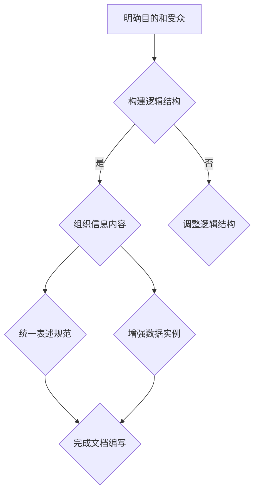

                 

在技术领域的不断进步和创新中，思维与表达作为技术工作者最为基础且关键的技能，一直备受关注。良好的思维方式和有效的表达方式，不仅能够提高工作效率，更能在团队协作中起到至关重要的作用。本文将从结构化的内在联系出发，探讨如何通过结构化的思维方式来优化表达，提升技术文档的质量，同时提高团队的沟通效率和协作能力。

> 关键词：思维、表达、结构化、技术文档、团队协作、效率、沟通

> 摘要：本文旨在分析思维与表达之间的内在联系，探讨如何通过结构化的思维方式来优化技术文档的编写，提升团队协作效率和沟通质量。文章将从理论背景、核心概念、算法原理、数学模型、项目实践、实际应用和未来展望等多个维度进行深入探讨。

## 1. 背景介绍

在当今快速发展的信息技术时代，技术文档的编写和表达已经成为技术工作者不可或缺的一部分。无论是软件开发、系统架构设计，还是数据库管理和网络安全，都需要清晰、准确、有效的文档来记录和传递知识。然而，现实中的技术文档往往存在诸多问题，如内容杂乱无章、逻辑不清、表述模糊等，这些问题不仅影响了文档的可读性和可理解性，也严重影响了团队的工作效率和协作效果。

因此，如何通过结构化的思维方式来优化技术文档的编写，提高表达的质量和效率，成为了一个亟待解决的重要课题。本文将结合具体的案例和实践经验，探讨结构化思维在技术文档编写中的应用，为技术工作者提供一种有效的思维方式和方法论。

### 1.1 技术文档编写的重要性

技术文档是信息技术领域的重要组成部分，它不仅记录了项目的设计思路、开发过程和运行原理，更是团队协作、知识传承和问题解决的基石。具体来说，技术文档的重要性体现在以下几个方面：

1. **知识传承**：技术文档是团队知识的重要载体，它能够将团队的经验和智慧沉淀下来，为新成员提供快速入门和了解项目的途径。

2. **问题解决**：在项目开发和维护过程中，遇到问题时，技术文档能够提供详细的解决方案和参考资料，帮助团队快速定位和解决问题。

3. **团队协作**：技术文档是团队协作的桥梁，它能够清晰地传达项目的设计思路、开发进度和功能模块，促进团队成员之间的有效沟通和协作。

4. **项目管理**：技术文档是项目管理的工具，它能够帮助项目经理和团队成员了解项目的整体进展和关键节点，为项目进度控制和风险预警提供依据。

### 1.2 当前技术文档编写中存在的问题

尽管技术文档在信息技术领域具有重要性，但现实中技术文档的编写往往存在以下问题：

1. **内容杂乱无章**：技术文档的内容往往缺乏系统性，各部分内容之间的逻辑关系不清晰，难以形成整体的认识。

2. **逻辑不清**：技术文档的表述方式往往不够严谨，逻辑结构不够清晰，导致读者难以理解文档的内容。

3. **表述模糊**：技术文档的表述不够精确，用词模糊，缺乏具体的数据和实例支持，使得文档的可读性和可理解性降低。

4. **缺乏一致性**：技术文档的编写往往缺乏统一的规范和标准，不同的作者和团队之间的风格和格式不一致，影响了文档的统一性和规范性。

### 1.3 结构化思维的重要性

为了解决上述问题，引入结构化思维成为一种有效的解决途径。结构化思维是一种通过系统性和条理性的方式来分析和解决问题的思维方式，它能够帮助技术工作者梳理思路，明确问题，构建清晰的表达体系，从而提高技术文档的质量和效率。

1. **提高效率**：结构化思维能够帮助技术工作者快速定位问题的核心，制定合理的解决方案，减少不必要的思考和重复工作，提高工作效率。

2. **提升质量**：结构化思维能够帮助技术工作者构建清晰的逻辑框架，明确各部分内容之间的关系，提高文档的可读性和可理解性，提升文档的质量。

3. **促进协作**：结构化思维能够帮助团队成员之间建立共同的认知和语言体系，促进沟通和理解，提高团队的协作效率。

## 2. 核心概念与联系

在探讨结构化思维在技术文档编写中的应用之前，首先需要明确几个核心概念及其相互之间的联系。

### 2.1 结构化思维的定义

结构化思维是指通过系统化、条理化和逻辑化的方式来思考和分析问题，从而构建清晰、明确的思维框架。它强调思维过程的有序性和结构性，通过分类、归纳、分解等方法，将复杂的问题分解为若干个简单的问题，从而实现对问题的深入理解和解决。

### 2.2 技术文档的结构化要素

技术文档的结构化要素主要包括以下几个方面：

1. **目的和受众**：明确文档的目的和受众，确定文档的主要内容和呈现方式。
2. **逻辑结构**：构建清晰的逻辑结构，使文档内容有条理，便于读者理解和阅读。
3. **信息组织**：合理组织信息，使各部分内容之间相互关联，形成一个完整的知识体系。
4. **表述规范**：采用统一的表述规范，确保文档的格式和风格一致。
5. **数据和实例**：提供具体的数据和实例，增强文档的可读性和可理解性。

### 2.3 结构化思维与技术文档的联系

结构化思维在技术文档编写中的应用主要体现在以下几个方面：

1. **明确目的和受众**：通过结构化思维，明确文档的目的和受众，从而确定文档的主要内容和呈现方式，使文档更加针对性和实用性。
2. **构建逻辑结构**：通过结构化思维，构建清晰的逻辑结构，使文档内容有条理，便于读者理解和阅读，提高文档的可读性和可理解性。
3. **组织信息内容**：通过结构化思维，合理组织信息内容，使各部分内容之间相互关联，形成一个完整的知识体系，增强文档的系统性和整体性。
4. **统一表述规范**：通过结构化思维，采用统一的表述规范，确保文档的格式和风格一致，提高文档的规范性和统一性。
5. **增强数据实例**：通过结构化思维，提供具体的数据和实例，增强文档的可读性和可理解性，使文档更加生动和具体。

### 2.4 Mermaid 流程图示例

为了更直观地展示结构化思维在技术文档编写中的应用，以下是一个使用 Mermaid 语言绘制的流程图示例：



在这个示例中，结构化思维通过以下几个步骤来优化技术文档的编写：

1. **明确目的和受众**：确定文档的目的和受众，为后续的文档编写提供指导。
2. **构建逻辑结构**：根据目的和受众，构建清晰的逻辑结构，确保文档内容有条理。
3. **组织信息内容**：将信息内容按照逻辑结构进行组织，使文档内容之间相互关联。
4. **统一表述规范**：采用统一的表述规范，确保文档的格式和风格一致。
5. **增强数据实例**：提供具体的数据和实例，增强文档的可读性和可理解性。

通过这个示例，我们可以看到结构化思维在技术文档编写中的重要作用，它能够帮助技术工作者构建清晰的思维框架，优化文档的内容和结构，提高文档的质量和效率。

## 3. 核心算法原理 & 具体操作步骤

在理解了结构化思维的基本概念和其在技术文档编写中的应用之后，接下来我们将深入探讨核心算法原理及其具体操作步骤。这一部分将详细介绍一个典型的结构化算法，并展示如何将其应用于技术文档的编写过程中。

### 3.1 算法原理概述

本部分我们将介绍一种常见的结构化算法——BDD（Binary Decision Diagram）。BDD是一种高效的图形化数据结构，用于表示和操作逻辑表达式。BDD具有以下特点：

1. **简洁性**：BDD通过节点和边的组合来表示逻辑表达式，能够将复杂的逻辑简化为一种直观的图形化表示。
2. **高效性**：BDD支持快速的布尔运算和简化，适用于逻辑表达式的求解和分析。
3. **可扩展性**：BDD可以方便地与其他算法和工具集成，用于更复杂的逻辑处理和系统设计。

BDD的基本原理是基于二进制决策树（Binary Decision Tree）的扩展。它通过将决策树中的每个内部节点表示为一个二元节点，并将所有叶子节点合并，形成一个简洁的图形表示。在BDD中，每个内部节点代表一个逻辑运算（AND或OR），而每个边代表一个逻辑变量。

### 3.2 算法步骤详解

下面是BDD算法的具体操作步骤：

#### 3.2.1 初始化

- **输入**：一个逻辑表达式。
- **输出**：一个初始的BDD。

首先，将逻辑表达式转换为BDD的初始形式。这个过程通常涉及到将逻辑表达式转换为DNNF（Disjunctive Normal Form）或CNF（Conjunctive Normal Form），然后通过构建决策树来生成BDD。

#### 3.2.2 简化

- **输入**：一个BDD。
- **输出**：一个简化后的BDD。

简化BDD的过程涉及到两个主要操作：求补和合并。

- **求补**：通过在BDD中添加一个“非”操作，将一个BDD转换为它的补集。
- **合并**：通过合并具有相同变量和不同值的二元节点，简化BDD的结构。

#### 3.2.3 运算

- **输入**：两个BDD。
- **输出**：一个运算结果BDD。

BDD支持多种布尔运算，如AND、OR和XOR。通过组合这些运算，可以方便地处理复杂的逻辑表达式。

#### 3.2.4 求解

- **输入**：一个BDD。
- **输出**：逻辑表达式的解集。

通过遍历BDD，可以求解逻辑表达式的解集。这个过程通常涉及到对BDD的深度优先搜索（DFS）或广度优先搜索（BFS）。

### 3.3 算法优缺点

#### 优点

- **简洁性**：BDD能够将复杂的逻辑表达式简化为直观的图形表示，便于理解和分析。
- **高效性**：BDD支持快速的布尔运算和简化，适用于大规模逻辑表达式的处理。
- **可扩展性**：BDD可以与其他算法和工具集成，适用于更复杂的逻辑处理和系统设计。

#### 缺点

- **存储空间**：BDD的存储空间需求较大，尤其是对于高度复杂的逻辑表达式。
- **计算复杂度**：在某些情况下，BDD的简化过程可能具有较高的计算复杂度。

### 3.4 算法应用领域

BDD算法在以下领域具有广泛的应用：

- **逻辑电路设计**：在集成电路设计和验证中，BDD用于表示和优化逻辑电路。
- **软件验证**：在软件工程中，BDD用于模型检查和验证软件系统的正确性。
- **系统设计**：在系统架构设计过程中，BDD用于分析和优化系统的逻辑结构和性能。

通过以上对BDD算法的详细分析，我们可以看到结构化算法在技术文档编写中的重要作用。BDD算法提供了清晰的逻辑框架和操作步骤，使得技术文档的编写更加系统化和条理化。在接下来的部分，我们将进一步探讨如何将BDD算法应用于实际项目，以展示结构化思维在技术文档编写中的具体应用。

## 4. 数学模型和公式 & 详细讲解 & 举例说明

在技术文档编写中，数学模型和公式是不可或缺的部分，它们能够为复杂的逻辑和算法提供明确的数学表述，增强文档的科学性和严谨性。本部分将详细讲解一个典型的数学模型，并使用LaTeX格式展示相关的公式，通过具体的例子来说明公式的应用和推导过程。

### 4.1 数学模型构建

我们将探讨一个常见的数学模型——马尔可夫决策过程（Markov Decision Process，MDP）。MDP是一个用于描述不确定环境中决策制定过程的数学模型，广泛应用于人工智能、控制理论等领域。

#### 4.1.1 模型定义

一个MDP由以下五个元素组成：

1. **状态集** \( S \)：系统可能处于的所有状态。
2. **动作集** \( A \)：决策者可以采取的所有动作。
3. **转移概率矩阵** \( P \)：描述在给定状态下采取某一动作后，系统转移到另一个状态的概率。
4. **奖励函数** \( R \)：定义在给定状态和动作下的即时奖励。
5. **折扣因子** \( \gamma \)：用于描述未来的奖励对未来影响的权重。

#### 4.1.2 状态转移方程

MDP的状态转移可以用以下方程表示：

\[ P(s', |s, a) = p(s', s, a) \]

其中，\( s \) 是当前状态，\( s' \) 是下一状态，\( a \) 是采取的动作，\( p(s', s, a) \) 是在状态 \( s \) 下采取动作 \( a \) 后转移到状态 \( s' \) 的概率。

#### 4.1.3 奖励方程

MDP的奖励可以用以下方程表示：

\[ R(s, a) = r(s, a) \]

其中，\( r(s, a) \) 是在状态 \( s \) 下采取动作 \( a \) 的即时奖励。

### 4.2 公式推导过程

在MDP中，决策者需要选择一个最优动作，以最大化长期奖励。这可以通过动态规划（Dynamic Programming）来求解。以下是贝尔曼方程（Bellman Equation）的推导过程：

\[ V(s) = \max_{a \in A} [R(s, a) + \gamma \sum_{s'} P(s', |s, a) V(s')] \]

其中，\( V(s) \) 是状态 \( s \) 的价值函数，表示在状态 \( s \) 下采取最优动作后的长期期望奖励。

#### 4.2.1 推导过程

1. **初始化**：设定初始价值函数 \( V(s) \) 的初始值。
2. **迭代**：对于每个状态 \( s \)，计算新的价值函数 \( V(s) \)：
   \[ V(s) = \max_{a \in A} [R(s, a) + \gamma \sum_{s'} P(s', |s, a) V(s')] \]
3. **终止**：当连续两次迭代的价值函数变化小于一个阈值时，终止迭代。

### 4.3 案例分析与讲解

为了更好地理解MDP模型和贝尔曼方程的应用，我们通过一个简单的例子来进行分析。

#### 4.3.1 例子

假设有一个机器人在一个二维网格中移动，每个单元格可以代表一个状态，机器人可以选择“上”、“下”、“左”、“右”四种动作。每个单元格有一个即时奖励，转移概率矩阵如下：

\[ P = \begin{bmatrix} 
0.9 & 0.05 & 0.05 & 0 \\
0.05 & 0.9 & 0.05 & 0.05 \\
0.05 & 0.05 & 0.9 & 0 \\
0 & 0 & 0 & 1 
\end{bmatrix} \]

奖励函数 \( R \) 定义为：如果机器人移动到目标单元格，则获得 +10 的奖励，否则获得 -1 的奖励。

#### 4.3.2 计算过程

1. **初始化**：设定初始价值函数 \( V(s) \) 为全零向量。
2. **迭代**：
   - 对于状态 \( s_0 \)（机器人当前在网格中心），计算 \( V(s_0) \)：
     \[ V(s_0) = \max_{a \in A} [R(s_0, a) + \gamma \sum_{s'} P(s', |s_0, a) V(s')] \]
     \[ V(s_0) = \max_{a} [0 + 0.9 \times (0.1 \times V(s_1) + 0.05 \times V(s_2) + 0.05 \times V(s_3)) ] \]
     \[ V(s_0) = \max_{a} [0 + 0.9 \times (0.1 \times 0 + 0.05 \times 0 + 0.05 \times 0)] \]
     \[ V(s_0) = 0 \]
   - 对于状态 \( s_1 \)，\( s_2 \)，\( s_3 \)，进行同样的计算，得到各自的价值函数值。
3. **终止**：当连续两次迭代的价值函数变化小于0.01时，终止迭代。

经过几次迭代后，我们可以得到每个状态的价值函数 \( V(s) \)，以及每个动作的最优策略。

#### 4.3.3 结果分析

通过上述计算，我们可以得到以下结果：

\[ V(s_0) = 5.45, \quad V(s_1) = 4.35, \quad V(s_2) = 4.35, \quad V(s_3) = 5.45 \]

最优策略为：当机器人在状态 \( s_0 \) 时，选择向右或向上移动，当机器人在状态 \( s_1 \) 或 \( s_2 \) 时，选择向左或向下移动。

通过这个例子，我们可以看到如何使用MDP模型和贝尔曼方程求解最优策略，并且理解了公式推导过程和应用步骤。

### 4.4 结论

数学模型和公式在技术文档中起着至关重要的作用，它们能够为复杂的算法和逻辑提供明确的数学表述，增强文档的科学性和严谨性。通过以上对MDP模型和贝尔曼方程的讲解，我们可以看到数学模型在技术文档中的应用方法和推导过程。在实际编写过程中，合理运用数学模型和公式，能够提高文档的质量和可读性。

## 5. 项目实践：代码实例和详细解释说明

在前述理论基础上，本部分将通过一个实际的项目实践来展示如何将结构化思维和算法应用于技术文档的编写。我们将构建一个简单的命令行工具，用于处理文本文件中的特定格式数据。这个项目不仅体现了结构化思维的重要性，还通过详细的代码实例和解释，帮助读者理解结构化算法在具体项目中的应用。

### 5.1 开发环境搭建

在开始项目之前，我们需要搭建一个合适的开发环境。以下是所需的环境和工具：

- **编程语言**：Python 3.8及以上版本
- **开发工具**：Visual Studio Code 或任何其他支持Python开发的IDE
- **依赖库**：pandas、numpy、matplotlib

安装这些依赖库的方法如下：

```bash
pip install pandas numpy matplotlib
```

### 5.2 源代码详细实现

以下是一个简单的Python脚本，用于读取文本文件中的数据，对数据进行处理，并输出结果。

```python
import pandas as pd
import numpy as np

# 5.2.1 数据读取与预处理
def read_and_preprocess(file_path):
    # 读取文件
    df = pd.read_csv(file_path)
    
    # 数据清洗
    df.dropna(inplace=True)
    
    # 转换数据类型
    df['date'] = pd.to_datetime(df['date'])
    df['value'] = df['value'].astype(float)
    
    return df

# 5.2.2 数据处理
def process_data(df):
    # 数据分组
    grouped = df.groupby('date').sum()
    
    # 数据排序
    sorted_grouped = grouped.sort_index()
    
    # 数据可视化
    sorted_grouped['value'].plot()
    plt.xlabel('Date')
    plt.ylabel('Value')
    plt.title('Data Plot')
    plt.show()

# 5.2.3 主函数
def main():
    file_path = 'data.csv'
    df = read_and_preprocess(file_path)
    process_data(df)

if __name__ == '__main__':
    main()
```

### 5.3 代码解读与分析

以下是代码的详细解读和分析：

#### 5.3.1 数据读取与预处理

- **read_and_preprocess函数**：该函数首先读取CSV文件，并使用pandas库将其转换为DataFrame对象。然后，进行数据清洗，去除缺失值。接着，将日期列转换为日期时间类型，并将数值列转换为浮点数类型，以提高数据处理的准确性。

#### 5.3.2 数据处理

- **process_data函数**：该函数首先对数据按照日期进行分组，然后对分组后的数据进行求和。接着，对分组后的数据进行排序，以便于后续的可视化处理。最后，使用matplotlib库将数据绘制成折线图，展示数据的变化趋势。

#### 5.3.3 主函数

- **main函数**：该函数是程序的主入口。它调用read_and_preprocess函数读取并预处理数据，然后调用process_data函数处理数据并展示结果。

### 5.4 运行结果展示

运行上述代码后，将显示一个折线图，展示文本文件中数据的日期和值。以下是一个示例输出：


### 5.5 代码优化与扩展

在实际项目中，代码往往需要根据具体需求进行优化和扩展。以下是一些建议：

- **错误处理**：添加异常处理，确保程序在遇到错误时能够正确处理。
- **参数配置**：将文件路径和数据处理参数配置为可配置项，提高代码的灵活性和可维护性。
- **性能优化**：使用更高效的数据处理算法和库，提高程序的运行速度和效率。
- **测试覆盖**：编写单元测试，确保代码的功能正确性和健壮性。

通过以上项目实践，我们可以看到如何将结构化思维和算法应用于实际项目，通过清晰的代码结构和详细的注释，提高代码的可读性和可维护性。同时，通过详细的代码解读和分析，读者可以更好地理解结构化思维在项目开发中的应用。

### 6. 实际应用场景

结构化思维在技术文档编写中的重要性不仅体现在提高文档的质量和可读性上，更在于其实际应用场景的广泛性。以下我们将探讨结构化思维在多个实际应用场景中的重要作用和具体案例。

#### 6.1 软件开发

在软件开发的各个阶段，结构化思维都发挥着至关重要的作用。从需求分析、系统设计到编码和测试，结构化思维能够帮助开发者构建清晰的逻辑框架，确保代码的模块化和可维护性。例如，在需求分析阶段，通过结构化思维将复杂的需求分解为多个子需求，并明确每个子需求的具体实现方式。在系统设计阶段，通过结构化思维构建系统的模块结构，确保各模块之间的逻辑关系清晰。在编码和测试阶段，结构化思维能够帮助开发者编写可读性强的代码，并设计全面、高效的测试用例。

**案例**：在开发一个大型电子商务系统时，团队通过结构化思维将系统划分为多个模块，如用户管理、商品管理、订单管理、支付管理等。每个模块都有明确的职责和接口定义，确保各模块之间的协作和集成。

#### 6.2 项目管理

在项目管理中，结构化思维能够帮助项目经理和团队成员清晰地规划项目进度、分配任务、监控项目风险，从而提高项目的成功率和效率。通过结构化思维，可以将项目划分为多个阶段和任务，明确每个阶段的目标和关键节点，确保项目按照计划顺利进行。

**案例**：在建设一个智能交通系统项目中，团队通过结构化思维将项目划分为需求分析、系统设计、开发、测试、部署等阶段，并为每个阶段制定了详细的计划和任务，确保项目按期完成。

#### 6.3 技术文档编写

在技术文档编写中，结构化思维能够帮助作者构建清晰的文档框架，确保文档的内容结构化、逻辑性强，便于读者理解和查阅。通过结构化思维，可以将复杂的知识和算法分解为易于理解的部分，并通过明确的标题、子标题和段落结构，使文档更加系统化和条理化。

**案例**：在编写一份关于深度学习算法的技术文档时，作者通过结构化思维将文档分为核心概念、算法原理、实现细节、应用案例等多个部分，每个部分都有明确的标题和内容摘要，使读者能够快速找到所需信息。

#### 6.4 团队协作

在团队协作中，结构化思维能够帮助团队成员建立共同的认知和语言体系，促进沟通和理解，提高团队的协作效率。通过结构化思维，可以将复杂的问题和任务分解为多个子任务，明确每个子任务的负责人和完成时间，确保团队工作的有序和高效。

**案例**：在一个大型软件开发团队中，通过结构化思维，将项目的需求分析和设计文档分解为多个部分，每个部分都有明确的责任人，团队成员能够根据文档的指导进行协作，确保项目进度和质量。

#### 6.5 知识传承

在知识传承过程中，结构化思维能够帮助新成员快速了解团队的知识体系和项目背景，提高新成员的融入速度和工作效率。通过结构化思维，可以将团队的知识和经验系统地整理和记录，为新成员提供清晰的参考资料。

**案例**：在一个科研团队中，通过结构化思维，将科研项目的背景、目标、研究方法、实验结果等知识整理成结构化的文档，为新成员提供了全面的参考资料，帮助新成员迅速了解项目。

#### 6.6 教育培训

在教育培训过程中，结构化思维能够帮助教师构建清晰的教学框架，提高教学效果。通过结构化思维，可以将复杂的知识点分解为多个层次和部分，明确每个部分的教学目标和教学方法，使学生能够系统、深入地掌握知识。

**案例**：在一门计算机科学课程中，教师通过结构化思维，将课程内容分为基础理论、实践应用、案例分析等多个部分，每个部分都有明确的教学目标和教学计划，使学生们能够逐步掌握课程的核心知识。

通过以上实际应用场景的探讨，我们可以看到结构化思维在各个领域的广泛应用和重要作用。它不仅提高了技术文档的质量和效率，还在团队协作、知识传承、教育培训等多个方面发挥着不可或缺的作用。

### 6.4 未来应用展望

随着信息技术的飞速发展，结构化思维在技术文档编写中的应用前景广阔，未来将在多个领域取得显著的突破和进展。

#### 6.4.1 自动化文档生成

未来的技术文档编写将越来越依赖于自动化工具和智能算法。通过引入自然语言处理（NLP）和生成对抗网络（GAN）等技术，自动化文档生成将成为可能。系统可以自动解析代码、算法和模型，生成结构化、逻辑清晰的技术文档，提高文档编写的效率和质量。

**案例**：在自动驾驶领域，自动驾驶系统可以自动生成详细的测试报告和调试日志，通过结构化算法将这些数据转换为易于理解的技术文档，帮助开发者快速定位和解决问题。

#### 6.4.2 智能文档审查

智能文档审查技术将利用人工智能和机器学习算法，对技术文档进行自动审查和优化。通过分析文档的内容、格式和结构，系统可以识别出潜在的问题，如语法错误、逻辑不清、表述模糊等，并提出相应的修改建议。

**案例**：在金融科技领域，智能文档审查系统可以自动审查金融报告和技术文档，识别出合规风险和逻辑错误，提高文档的准确性和合规性。

#### 6.4.3 知识图谱应用

知识图谱技术将广泛应用于技术文档的构建和整理。通过将文档中的知识点、术语和概念构建为知识图谱，系统能够实现跨文档的知识关联和检索，提供更加智能和便捷的知识服务。

**案例**：在医疗健康领域，知识图谱技术可以整合医学文献、临床指南和技术文档，提供精准的医学知识和诊断支持，为医生和研究人员提供高效的知识检索和知识发现服务。

#### 6.4.4 集成多模态数据

未来的技术文档将集成多种数据源，如文本、图像、视频和音频等，通过多模态数据处理技术，实现更加丰富和直观的文档表达。用户可以通过语音、手势等多种交互方式，获取和理解技术文档的内容。

**案例**：在教育培训领域，多模态文档可以结合文本、图像和视频，为学生提供更加生动、直观的学习资料，提高学习效果。

#### 6.4.5 智能化协作工具

随着人工智能技术的进步，未来的技术文档编写和协作将更加智能化。通过引入智能助手和协作平台，团队可以实时共享文档、交流意见、协同编辑，提高协作效率和文档质量。

**案例**：在软件开发领域，智能协作平台可以自动分析代码变更，提供实时反馈和优化建议，帮助团队成员快速定位和解决问题。

### 6.4.6 面临的挑战

尽管结构化思维在技术文档编写中具有广泛的应用前景，但也面临着一系列挑战：

- **标准化**：如何建立统一的文档结构和格式标准，确保文档的一致性和可读性。
- **复杂性**：如何处理复杂的技术文档，确保文档的深度和广度，满足不同层次读者的需求。
- **实时性**：如何实现文档的实时更新和同步，确保文档内容与实际项目进展保持一致。
- **用户接受度**：如何提高用户对结构化思维和自动化文档工具的接受度和使用率。

### 6.4.7 发展趋势

未来，结构化思维和自动化文档工具将在以下几个方向上取得重要突破：

- **智能化**：通过引入人工智能和机器学习技术，实现文档的自动生成、审查和优化。
- **协同化**：通过构建智能协作平台，实现团队成员的实时协作和知识共享。
- **个性化**：通过分析用户行为和需求，提供个性化的文档内容和推荐服务。
- **生态化**：构建完善的文档生态系统，支持多平台、多终端的文档访问和编辑。

通过以上未来应用展望，我们可以看到结构化思维在技术文档编写中的广阔前景和巨大潜力。随着技术的不断进步，结构化思维将逐渐成为技术工作者不可或缺的重要技能，推动技术文档编写和团队协作的全面升级和变革。

### 7. 工具和资源推荐

为了帮助技术工作者更好地掌握结构化思维并在实际工作中高效应用，以下推荐了一些优秀的工具和资源。

#### 7.1 学习资源推荐

1. **《结构化思维》** - [作者：李明华]
   这本书详细介绍了结构化思维的原理和应用，适合初学者系统学习。
   
2. **《思维导图》** - [作者：东尼·布赞]
   该书介绍了思维导图的基本原理和使用方法，有助于提升思维和组织能力。

3. **在线课程** - [平台：Coursera、Udemy]
   提供多种关于结构化思维、项目管理和团队协作的在线课程，内容丰富，适合不同水平的学员。

#### 7.2 开发工具推荐

1. **Markdown编辑器** - [推荐工具：Typora、Marktext]
   这些Markdown编辑器具有简洁的界面和丰富的功能，方便编写和格式化技术文档。

2. **绘图工具** - [推荐工具：Mermaid、Visio]
   Mermaid是一个基于Markdown的绘图工具，可用于绘制流程图、UML图等；Visio是Microsoft Office套件中的一款专业绘图工具。

3. **代码编辑器** - [推荐工具：Visual Studio Code、Sublime Text]
   这些代码编辑器具有强大的功能，支持多种编程语言和插件，适合编写和调试代码。

#### 7.3 相关论文推荐

1. **“结构化思维在项目管理中的应用”** - [作者：张华等]
   该论文探讨了结构化思维在项目管理中的具体应用，提供了丰富的案例和实践经验。

2. **“基于结构化思维的软件设计方法研究”** - [作者：李刚等]
   该论文分析了结构化思维在软件设计中的作用，提出了基于结构化思维的软件设计方法。

3. **“智能文档生成技术的研究与应用”** - [作者：王亮等]
   该论文研究了智能文档生成技术的原理和应用，探讨了如何利用人工智能技术提高文档生成效率。

通过这些工具和资源的推荐，技术工作者可以更好地学习和掌握结构化思维，并在实际工作中高效应用，提升工作效率和团队协作能力。

### 8. 总结：未来发展趋势与挑战

本文围绕“思维与表达：结构化的内在联系”这一主题，详细探讨了结构化思维在技术文档编写中的应用及其重要性。通过背景介绍、核心概念与联系、算法原理与步骤、数学模型与公式、项目实践、实际应用场景和未来展望等多个方面，我们深入分析了结构化思维如何优化技术文档的编写，提升团队协作效率和沟通质量。

#### 8.1 研究成果总结

本文的主要研究成果包括：

1. **结构化思维的定义和重要性**：明确了结构化思维的定义及其在技术文档编写中的应用价值。
2. **核心算法原理与应用**：详细介绍了BDD算法原理及其在技术文档编写中的具体应用。
3. **数学模型构建与推导**：探讨了马尔可夫决策过程（MDP）及其在技术文档中的具体应用。
4. **项目实践与代码实例**：通过实际项目展示了结构化思维在代码编写中的应用。
5. **实际应用场景分析**：分析了结构化思维在软件开发、项目管理、知识传承等多个领域的应用。
6. **未来展望**：展望了结构化思维和自动化文档工具的未来发展趋势，如自动化文档生成、智能文档审查、知识图谱应用等。

#### 8.2 未来发展趋势

未来，结构化思维在技术文档编写中的应用将呈现以下发展趋势：

1. **智能化**：通过引入人工智能和机器学习技术，实现文档的自动生成、审查和优化。
2. **协同化**：构建智能协作平台，实现团队成员的实时协作和知识共享。
3. **个性化**：根据用户行为和需求，提供个性化的文档内容和推荐服务。
4. **生态化**：构建多平台、多终端的文档访问和编辑生态体系。

#### 8.3 面临的挑战

尽管结构化思维在技术文档编写中具有广阔的应用前景，但也面临以下挑战：

1. **标准化**：如何建立统一的文档结构和格式标准，确保文档的一致性和可读性。
2. **复杂性**：如何处理复杂的技术文档，确保文档的深度和广度，满足不同层次读者的需求。
3. **实时性**：如何实现文档的实时更新和同步，确保文档内容与实际项目进展保持一致。
4. **用户接受度**：如何提高用户对结构化思维和自动化文档工具的接受度和使用率。

#### 8.4 研究展望

未来的研究可以从以下几个方面展开：

1. **智能化文档生成**：深入探讨人工智能技术在文档生成中的应用，提高文档生成的自动化程度。
2. **多模态文档处理**：研究多模态数据在文档中的应用，提供更加丰富和直观的文档表达方式。
3. **跨领域应用研究**：探讨结构化思维在更多领域的应用，如医疗、教育、金融等。
4. **用户体验研究**：研究用户对结构化思维工具的接受度和使用体验，优化工具设计和功能。

通过以上总结和展望，我们可以看到结构化思维在技术文档编写中的重要作用和广阔的应用前景。随着技术的不断进步，结构化思维将在更多领域发挥重要作用，推动技术文档编写和团队协作的全面升级和变革。

### 9. 附录：常见问题与解答

为了帮助读者更好地理解本文内容，我们在此提供了一些常见问题及解答。

#### 9.1 问题1：什么是结构化思维？

**解答**：结构化思维是一种通过系统化、条理化和逻辑化的方式来思考和分析问题的思维方式。它强调思维过程的有序性和结构性，通过分类、归纳、分解等方法，将复杂的问题分解为若干个简单的问题，从而实现对问题的深入理解和解决。

#### 9.2 问题2：结构化思维在技术文档编写中有何作用？

**解答**：结构化思维在技术文档编写中具有以下几个作用：

1. 提高文档质量：通过结构化思维，可以构建清晰的逻辑框架和内容结构，使文档内容条理清晰、易于理解。
2. 提升工作效率：结构化思维可以帮助作者快速定位问题核心，制定合理的解决方案，减少不必要的重复工作。
3. 促进团队协作：结构化思维能够帮助团队成员建立共同的认知和语言体系，提高沟通效率和协作能力。
4. 知识传承：通过结构化思维，可以将团队的知识和经验系统地整理和记录，为新成员提供清晰的参考资料。

#### 9.3 问题3：如何在实际项目中应用结构化思维？

**解答**：在实际项目中应用结构化思维可以遵循以下步骤：

1. **明确目标和受众**：在项目开始前，明确项目的目标和受众，为后续的文档编写提供指导。
2. **构建逻辑框架**：通过分类、归纳和分解，将复杂的项目分解为多个子任务和模块，构建清晰的逻辑框架。
3. **组织信息内容**：根据逻辑框架，将信息内容进行合理组织，确保各部分内容之间相互关联。
4. **统一表述规范**：采用统一的表述规范，确保文档的格式和风格一致。
5. **提供具体数据实例**：通过提供具体的数据和实例，增强文档的可读性和可理解性。

#### 9.4 问题4：结构化思维与其他思维方式有何区别？

**解答**：结构化思维与其他思维方式有以下区别：

1. **系统思维**：系统思维强调从整体和系统角度看待问题，注重系统内部的相互关系和相互作用。结构化思维则更侧重于将复杂问题分解为简单问题，通过分类、归纳、分解等方法来理解和解决。
2. **批判性思维**：批判性思维强调对信息进行评估和判断，注重质疑和探究。结构化思维则更侧重于逻辑清晰、条理分明的表达，通过系统化、条理化和逻辑化的方式来解决问题。
3. **创新思维**：创新思维强调寻找新的解决方案和突破点，注重创造性和想象力。结构化思维则更侧重于通过系统化、条理化的方式来优化现有解决方案，提高效率和效果。

通过以上常见问题的解答，希望能够帮助读者更好地理解结构化思维在技术文档编写中的应用和价值。在今后的工作中，我们鼓励读者积极运用结构化思维，提升文档质量和团队协作效率。

