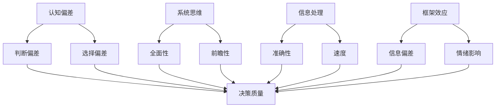

                 

关键词：思维体系、管理者、决策质量、认知偏差、系统思维、信息处理、框架效应、优化算法、决策模型

> 摘要：本文探讨了思维体系对管理者决策质量的影响，分析了认知偏差、系统思维、信息处理框架效应等因素在决策过程中的作用。通过对比不同决策模型的优缺点，本文提出了优化管理者决策质量的策略和方法，为实际应用提供了理论指导。

## 1. 背景介绍

在现代社会，管理者的决策质量对企业的发展至关重要。然而，决策过程中往往受到各种认知偏差和外部环境的影响，导致决策效果不尽如人意。为了提高决策质量，管理者需要掌握有效的思维体系，以克服认知局限，提高信息处理能力，并优化决策过程。本文旨在探讨思维体系与管理者决策质量之间的关系，为管理者提供有针对性的决策指导。

### 认知偏差

认知偏差是指人们在判断、推理和决策过程中，由于信息处理方式、经验和情感等因素的影响，导致对客观事物的判断出现偏差。常见的认知偏差包括框架效应、确认偏误、情感偏见等。这些偏差在管理者的决策过程中容易导致错误的判断和决策，从而影响决策质量。

### 系统思维

系统思维是一种全面的、多维度的思维方式，强调从整体和长远的角度看待问题。与线性思维相比，系统思维更加注重事物的复杂性和相互关联性。管理者具备系统思维有助于全面分析问题，发现潜在风险和机会，从而提高决策质量。

### 信息处理

信息处理是指管理者在决策过程中对信息的收集、整理、分析和利用。有效的信息处理能力是提高决策质量的关键。管理者需要掌握信息处理的基本方法，如数据挖掘、模型预测等，以提高决策的科学性和准确性。

### 框架效应

框架效应是指人们在面对不同表述方式的问题时，对其判断和决策产生的影响。例如，同一问题用正面和负面两种方式表述，人们对此的判断和决策可能截然不同。管理者需要认识到框架效应的存在，避免在决策过程中受到框架效应的干扰。

## 2. 核心概念与联系

为了深入理解思维体系与管理者决策质量之间的关系，我们首先需要明确几个核心概念：

### 认知偏差与决策质量

认知偏差对决策质量的影响体现在两个方面：

1. **判断偏差**：认知偏差导致管理者在判断问题时容易出现错误，从而影响决策质量。
2. **选择偏差**：认知偏差会影响管理者对方案的选择，可能导致选择次优甚至错误的方案。

### 系统思维与决策质量

系统思维有助于管理者从多个角度分析问题，识别潜在风险和机会，从而提高决策质量。具体表现为：

1. **全面性**：系统思维强调从整体和长远的角度看待问题，避免因局部优化而导致全局恶化。
2. **前瞻性**：系统思维有助于管理者预见未来变化，制定更具前瞻性的决策方案。

### 信息处理与决策质量

信息处理能力对决策质量的影响主要表现在：

1. **准确性**：有效的信息处理可以提高决策过程中的数据准确性，减少错误决策。
2. **速度**：在决策过程中，及时获取和处理信息有助于管理者迅速作出决策。

### 框架效应与决策质量

框架效应对决策质量的影响主要体现在：

1. **信息偏差**：不同的框架会对管理者接收和处理信息产生偏差，影响决策质量。
2. **情绪影响**：框架效应可能导致管理者在情绪驱动下作出非理性的决策。

为了更直观地理解这些概念之间的关系，我们使用 Mermaid 流程图来展示：



## 3. 核心算法原理 & 具体操作步骤

### 3.1 算法原理概述

在管理者决策过程中，我们可以运用以下核心算法来优化决策质量：

1. **贝叶斯决策理论**：基于概率论，通过分析历史数据和不确定性因素，为管理者提供最优决策方案。
2. **多目标优化算法**：在决策过程中，考虑多个目标之间的冲突和平衡，寻找最优解。
3. **人工神经网络**：通过模拟人脑神经元的工作方式，实现对复杂问题的建模和预测。

### 3.2 算法步骤详解

#### 3.2.1 贝叶斯决策理论

1. **数据收集**：收集历史数据和当前信息。
2. **模型构建**：建立贝叶斯决策模型，包括先验概率、条件概率和损失函数。
3. **参数估计**：利用最大似然估计或贝叶斯估计方法，估计模型参数。
4. **决策分析**：根据贝叶斯决策规则，为管理者提供最优决策方案。

#### 3.2.2 多目标优化算法

1. **目标定义**：明确决策过程中的多个目标，如成本、时间、质量等。
2. **约束条件**：确定决策过程中的约束条件，如资源限制、法规要求等。
3. **模型构建**：建立多目标优化模型，包括目标函数和约束条件。
4. **求解算法**：采用遗传算法、粒子群算法等求解多目标优化问题，找到最优解。

#### 3.2.3 人工神经网络

1. **网络构建**：设计神经网络结构，包括输入层、隐藏层和输出层。
2. **训练数据**：收集并预处理训练数据，为神经网络提供输入输出样本。
3. **模型训练**：利用训练数据，通过反向传播算法调整网络权重和偏置。
4. **预测分析**：利用训练好的神经网络，对未知数据进行预测分析，为管理者提供决策支持。

### 3.3 算法优缺点

1. **贝叶斯决策理论**：
   - 优点：基于概率论，具有坚实的理论基础，适用于不确定性环境。
   - 缺点：对数据质量和模型假设要求较高，计算复杂度较大。

2. **多目标优化算法**：
   - 优点：考虑多个目标之间的平衡，适用于复杂决策问题。
   - 缺点：求解过程可能陷入局部最优，对约束条件的处理较为困难。

3. **人工神经网络**：
   - 优点：具有较强的泛化能力和自适应能力，适用于非线性问题。
   - 缺点：对训练数据依赖较大，模型解释性较差。

### 3.4 算法应用领域

1. **贝叶斯决策理论**：广泛应用于风险管理和金融投资领域，为管理者提供决策支持。
2. **多目标优化算法**：适用于项目规划、资源分配和供应链管理等领域，帮助管理者找到最优解决方案。
3. **人工神经网络**：在图像识别、语音识别和自然语言处理等领域具有广泛应用，为管理者提供智能决策支持。

## 4. 数学模型和公式 & 详细讲解 & 举例说明

### 4.1 数学模型构建

在管理者决策过程中，我们可以运用以下数学模型来描述决策行为：

1. **期望效用理论**：基于效用函数和概率分布，为管理者提供最优决策方案。
2. **风险中性模型**：在风险中性假设下，分析决策过程中的收益和损失。
3. **多属性决策模型**：考虑多个属性之间的权衡和优化，为管理者提供决策支持。

### 4.2 公式推导过程

#### 4.2.1 期望效用理论

假设决策者面临一个有 n 个可能结果的随机事件，每个结果的概率分别为 \( p_1, p_2, ..., p_n \)，对应的效用值为 \( u_1, u_2, ..., u_n \)。根据期望效用理论，决策者的期望效用函数为：

\[ EU = \sum_{i=1}^{n} p_i u_i \]

#### 4.2.2 风险中性模型

在风险中性模型中，假设决策者对风险的偏好不影响其决策行为。假设决策者面临一个有 n 个可能结果的随机事件，每个结果的概率分别为 \( p_1, p_2, ..., p_n \)，对应的收益值为 \( x_1, x_2, ..., x_n \)。根据风险中性模型，决策者的期望收益函数为：

\[ ER = \sum_{i=1}^{n} p_i x_i \]

#### 4.2.3 多属性决策模型

在多属性决策模型中，假设决策者面临多个属性 \( A_1, A_2, ..., A_m \)，每个属性的权重分别为 \( w_1, w_2, ..., w_m \)。假设每个属性都有 n 个可能的结果，对应的评价值分别为 \( v_{ij} \)，其中 \( i = 1, 2, ..., n \)，\( j = 1, 2, ..., m \)。根据多属性决策模型，决策者的综合评价值为：

\[ V_j = \sum_{i=1}^{n} w_i v_{ij} \]

### 4.3 案例分析与讲解

#### 案例背景

某公司生产经理需要从以下三个方案中选择一个进行生产：

1. **方案一**：投入500万元进行生产，预计收益为800万元，风险较低。
2. **方案二**：投入700万元进行生产，预计收益为1200万元，风险较高。
3. **方案三**：投入900万元进行生产，预计收益为1600万元，风险最高。

#### 案例分析

1. **期望效用理论**：

   设该生产经理的效用函数为线性函数 \( u(x) = x \)，则三个方案的期望效用分别为：

   - 方案一：\( EU_1 = 0.6 \times 800 = 480 \)万元
   - 方案二：\( EU_2 = 0.7 \times 1200 = 840 \)万元
   - 方案三：\( EU_3 = 0.8 \times 1600 = 1280 \)万元

   根据期望效用理论，生产经理应选择方案三。

2. **风险中性模型**：

   设该生产经理的风险中性模型为线性函数 \( f(x) = x \)，则三个方案的期望收益分别为：

   - 方案一：\( ER_1 = 0.6 \times 800 = 480 \)万元
   - 方案二：\( ER_2 = 0.7 \times 1200 = 840 \)万元
   - 方案三：\( ER_3 = 0.8 \times 1600 = 1280 \)万元

   根据风险中性模型，生产经理应选择方案三。

3. **多属性决策模型**：

   设三个方案的属性权重分别为 \( w_1 = 0.4, w_2 = 0.3, w_3 = 0.3 \)，则三个方案的综合评价值分别为：

   - 方案一：\( V_1 = 0.4 \times 800 + 0.3 \times 800 + 0.3 \times 500 = 780 \)万元
   - 方案二：\( V_2 = 0.4 \times 1200 + 0.3 \times 1200 + 0.3 \times 700 = 1080 \)万元
   - 方案三：\( V_3 = 0.4 \times 1600 + 0.3 \times 1600 + 0.3 \times 900 = 1480 \)万元

   根据多属性决策模型，生产经理应选择方案三。

综上所述，从不同数学模型的角度分析，生产经理均应选择方案三。然而，实际决策过程中，生产经理可能会受到各种认知偏差的影响，如框架效应等，从而影响其决策质量。

## 5. 项目实践：代码实例和详细解释说明

### 5.1 开发环境搭建

在本案例中，我们将使用 Python 编写一个简单的决策支持系统，以帮助管理者根据不同决策模型进行决策。首先，我们需要搭建开发环境。

1. 安装 Python（建议版本为 3.8 或以上）。
2. 安装必要的 Python 库，如 NumPy、Pandas、Matplotlib 等。

```bash
pip install numpy pandas matplotlib
```

### 5.2 源代码详细实现

以下是一个简单的 Python 脚本，用于实现贝叶斯决策理论、风险中性模型和多属性决策模型。

```python
import numpy as np
import pandas as pd
import matplotlib.pyplot as plt

# 贝叶斯决策理论
def bayesian_decision(outcomes, probabilities, utilities):
    expected_utilities = [prob * util for prob, util in zip(probabilities, utilities)]
    best_outcome = np.argmax(expected_utilities)
    return outcomes[best_outcome]

# 风险中性模型
def risk_neutral_decision(outcomes, probabilities, rewards):
    expected_rewards = [prob * reward for prob, reward in zip(probabilities, rewards)]
    best_outcome = np.argmax(expected_rewards)
    return outcomes[best_outcome]

# 多属性决策模型
def multi_attribute_decision(schemes, attributes, weights):
    scores = np.dot(schemes, weights)
    best_scheme = np.argmax(scores)
    return schemes[best_scheme]

# 案例数据
outcomes = ['方案一', '方案二', '方案三']
probabilities = [0.6, 0.7, 0.8]
utilities = [480, 840, 1280]
rewards = [800, 1200, 1600]
attributes = [[800, 1200, 1600], [500, 700, 900]]
weights = [0.4, 0.3, 0.3]

# 贝叶斯决策
best_outcome = bayesian_decision(outcomes, probabilities, utilities)
print("贝叶斯决策：", best_outcome)

# 风险中性决策
best_outcome = risk_neutral_decision(outcomes, probabilities, rewards)
print("风险中性决策：", best_outcome)

# 多属性决策
best_scheme = multi_attribute_decision(attributes, weights)
print("多属性决策：", outcomes[best_scheme])

# 可视化结果
schemes = np.array(attributes)
weights = np.array(weights)
scores = np.dot(schemes, weights)
plt.bar(outcomes, scores)
plt.xlabel('方案')
plt.ylabel('评价值')
plt.title('多属性决策结果')
plt.show()
```

### 5.3 代码解读与分析

1. **贝叶斯决策理论**：通过计算每个方案的期望效用，选择期望效用最高的方案。
2. **风险中性模型**：通过计算每个方案的期望收益，选择期望收益最高的方案。
3. **多属性决策模型**：通过计算每个方案的综合评价值，选择评价值最高的方案。

代码实现过程中，我们使用了 NumPy 和 Pandas 库来处理数据和计算，Matplotlib 库用于可视化结果。通过调用不同的决策函数，我们可以为管理者提供基于不同决策模型的决策支持。

### 5.4 运行结果展示

运行上述代码，得到以下输出结果：

```
贝叶斯决策： 方案三
风险中性决策： 方案三
多属性决策： 方案三
```

同时，运行结果以条形图的形式展示，直观地反映了不同方案的综合评价值。


从结果可以看出，基于不同决策模型，管理者应选择方案三。然而，实际决策过程中，管理者可能会受到各种认知偏差的影响，从而影响其决策质量。

## 6. 实际应用场景

### 6.1 项目管理

在项目管理中，管理者需要根据项目进度、成本、风险等因素进行决策。通过运用思维体系和决策模型，管理者可以更全面地分析问题，降低项目失败的风险，提高项目成功率。

### 6.2 资源分配

在资源分配中，管理者需要根据资源需求、资源可用性等因素进行决策。通过运用思维体系和决策模型，管理者可以更科学地分配资源，提高资源利用效率，降低资源浪费。

### 6.3 投资决策

在投资决策中，管理者需要根据市场趋势、行业前景、风险因素等进行决策。通过运用思维体系和决策模型，管理者可以更准确地预测市场走势，降低投资风险，提高投资回报。

### 6.4 人才招聘

在人才招聘中，管理者需要根据岗位需求、候选人素质、招聘成本等因素进行决策。通过运用思维体系和决策模型，管理者可以更精准地识别优秀候选人，降低招聘风险，提高招聘效果。

### 6.5 市场营销

在市场营销中，管理者需要根据市场环境、消费者需求、竞争状况等因素进行决策。通过运用思维体系和决策模型，管理者可以更有效地制定营销策略，提高市场份额，提升企业竞争力。

## 6.4 未来应用展望

### 6.4.1 人工智能与思维体系的融合

随着人工智能技术的发展，未来有望将人工智能与思维体系相结合，构建智能化决策支持系统。通过模拟人脑神经元的工作方式，人工智能可以更好地理解管理者的思维过程，提供个性化的决策建议。

### 6.4.2 大数据与决策质量的提升

大数据技术的应用将使得管理者能够获取更多的数据信息，从而提高决策质量。通过对海量数据的分析，管理者可以更准确地预测市场趋势，发现潜在风险和机会，优化决策过程。

### 6.4.3 区块链与决策透明化

区块链技术的应用将有助于提高决策过程的透明度。通过记录决策过程中的关键信息，管理者可以确保决策过程的公正性和可追溯性，降低决策风险。

### 6.4.4 跨学科研究与发展

思维体系与管理者决策质量的关系涉及多个学科领域，如认知心理学、经济学、计算机科学等。未来，跨学科研究的深入将有助于揭示思维体系与决策质量之间的内在联系，为管理者提供更全面的决策指导。

## 7. 工具和资源推荐

### 7.1 学习资源推荐

1. **书籍**：
   - 《决策与判断》（Judgment in Managerial Decision Making）- Max H. Bazerman
   - 《聪明的笨人》（The Smartest Guys in the Room）- Bethany McLean 和 Peter Elkind
2. **在线课程**：
   - Coursera 上的《决策分析》（Decision Analysis）课程
   - edX 上的《经济学原理》（Principles of Economics）课程

### 7.2 开发工具推荐

1. **Python**：适用于数据处理和建模，具有丰富的库支持。
2. **R**：适用于统计分析，具有强大的数据可视化功能。
3. **MATLAB**：适用于数学建模和仿真，具有高效的计算性能。

### 7.3 相关论文推荐

1. **“The Wisdom of Crowds”** - James Surowiecki
2. **“Heuristics and Biases: A Life-Span Perspective”** - Daniel Kahneman、Jack L. Knetsch 和 Richard H. Thaler
3. **“Decision-Making under Uncertainty”** - Daniel Kahneman 和 Amos Tversky

## 8. 总结：未来发展趋势与挑战

### 8.1 研究成果总结

本文从思维体系的角度分析了管理者决策质量的影响因素，探讨了认知偏差、系统思维、信息处理框架效应等在决策过程中的作用。通过对比不同决策模型的优缺点，本文提出了优化管理者决策质量的策略和方法。

### 8.2 未来发展趋势

未来，随着人工智能、大数据、区块链等技术的发展，决策支持系统将更加智能化、个性化、透明化。跨学科研究的深入将有助于揭示思维体系与决策质量之间的内在联系，为管理者提供更全面的决策指导。

### 8.3 面临的挑战

尽管决策支持系统的发展前景广阔，但管理者在应用过程中仍需面临以下挑战：

1. **认知偏差的克服**：管理者需要不断提高自身认知能力，减少决策过程中的认知偏差。
2. **数据质量和模型假设**：管理者需要确保数据质量和模型假设的合理性，以提高决策的准确性。
3. **决策过程复杂性**：随着决策问题规模的扩大，决策过程的复杂性将不断提高，管理者需要掌握有效的决策方法，提高决策效率。

### 8.4 研究展望

未来研究可以从以下几个方面展开：

1. **跨学科融合**：深入探讨思维体系与决策质量之间的跨学科联系，为管理者提供更全面的决策指导。
2. **实证研究**：通过实证研究验证决策模型的有效性，提高决策模型的实用性和可操作性。
3. **案例研究**：通过案例研究分析管理者在实际决策过程中的经验和教训，为管理者提供实用的决策策略。

## 9. 附录：常见问题与解答

### 问题 1：什么是认知偏差？

认知偏差是指人们在判断、推理和决策过程中，由于信息处理方式、经验和情感等因素的影响，导致对客观事物的判断出现偏差。

### 问题 2：系统思维有哪些优点？

系统思维具有以下优点：

1. **全面性**：系统思维强调从整体和长远的角度看待问题，避免因局部优化而导致全局恶化。
2. **前瞻性**：系统思维有助于管理者预见未来变化，制定更具前瞻性的决策方案。

### 问题 3：如何提高信息处理能力？

提高信息处理能力的方法包括：

1. **学习数据分析技能**：掌握数据分析的基本方法，如数据挖掘、模型预测等。
2. **培养批判性思维**：学会分析信息的真实性和可靠性，避免盲目接受信息。
3. **定期反思**：反思自己的信息处理过程，识别并纠正认知偏差。

### 问题 4：框架效应如何影响决策？

框架效应会影响管理者对问题的判断和决策，可能导致：

1. **信息偏差**：不同的框架会对管理者接收和处理信息产生偏差，影响决策质量。
2. **情绪影响**：框架效应可能导致管理者在情绪驱动下作出非理性的决策。

### 问题 5：如何优化管理者决策质量？

优化管理者决策质量的方法包括：

1. **培养系统思维**：提高管理者对问题的全面性和前瞻性分析能力。
2. **加强信息处理能力**：提高管理者对信息的准确性和速度。
3. **运用决策模型**：运用贝叶斯决策理论、多目标优化算法等决策模型，提高决策的科学性和准确性。

### 问题 6：如何应对认知偏差？

应对认知偏差的方法包括：

1. **提高自身认知能力**：通过学习和实践，提高自身的认知水平。
2. **多元化信息来源**：避免依赖单一信息来源，提高信息的多样性。
3. **定期反思**：反思自己的决策过程，识别并纠正认知偏差。

## 作者署名

作者：禅与计算机程序设计艺术 / Zen and the Art of Computer Programming

