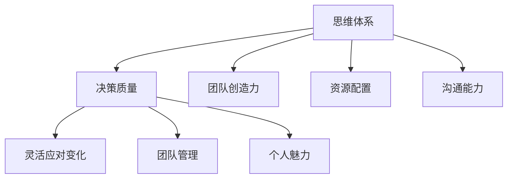

                 

### 1. 背景介绍

在信息技术飞速发展的当今社会，领导力的作用愈发凸显。作为组织中的核心力量，领导者不仅需要具备卓越的技术能力和管理技能，还需要具备强大的思维体系。然而，何谓思维体系？它对领导力究竟有何影响？这是本文要探讨的核心问题。

思维体系是指个体在思考、分析、解决问题时所采用的方法和模式。它包括逻辑思维、创新思维、系统思维等多个方面。一个完善的思维体系能够帮助领导者更全面地理解问题，更有效地解决问题，从而提高领导效能。

领导力是指领导者通过自身的行为、态度和影响力，引导、激励和协调团队，实现组织目标的能力。领导力不仅涉及个人技能，更关乎思维方式。一个拥有强大思维体系的领导者，往往能在复杂多变的环境中保持冷静，做出明智的决策。

本文将围绕思维体系对领导力的影响，从多个角度展开讨论。我们首先会探讨思维体系的基本概念，然后分析其在领导力中的作用机制，接着介绍几个关键性的思维方法，并探讨这些方法在实践中的应用，最后总结思维体系对领导力的未来展望。

### 2. 核心概念与联系

#### 2.1 思维体系的基本概念

思维体系是指个体在思考和决策时所采用的一系列思维方法和模式。这些方法包括但不限于：

- **逻辑思维**：通过推理和证明来分析和解决问题，强调推理的严谨性和逻辑性。
- **创新思维**：通过发散性思维，寻找新的解决方案，强调创造力和想象力。
- **系统思维**：从整体的角度来分析问题，强调系统的结构和动态性。
- **批判性思维**：对信息进行深入分析和评估，辨别真伪，强调分析和判断能力。

每个思维方法都有其独特的特点和适用场景。例如，逻辑思维在解决结构性问题时非常有效，而创新思维则在面对复杂、不确定的问题时能提供新的视角和解决方案。系统思维则能够帮助领导者从整体上把握问题的本质，而批判性思维则可以确保领导者做出明智的决策。

#### 2.2 思维体系与领导力的联系

思维体系与领导力之间存在着密切的联系。一个强大的思维体系能够帮助领导者：

- **提高决策质量**：通过逻辑思维和批判性思维，领导者可以更全面地分析问题，评估各种方案的优缺点，从而做出更明智的决策。
- **激发团队创造力**：创新思维可以帮助领导者引导团队跳出传统思维模式，寻找新的解决方案，从而推动组织的创新和发展。
- **优化资源配置**：系统思维使得领导者能够从整体上把握组织结构，优化资源配置，提高组织的运营效率。
- **提升沟通能力**：通过逻辑思维和批判性思维，领导者可以更清晰、准确地表达自己的想法，提高沟通效果。

具体来说，一个拥有强大思维体系的领导者，能够：

- **灵活应对变化**：在复杂多变的环境中，通过系统思维和创新思维，领导者可以更快速地适应环境变化，找到新的发展机遇。
- **建立高效团队**：通过逻辑思维和批判性思维，领导者可以更好地理解团队成员的优势和弱点，进行有效的团队管理和激励。
- **提升个人魅力**：强大的思维体系使得领导者更具说服力和影响力，能够赢得团队成员的信任和支持。

#### 2.3 Mermaid 流程图

为了更好地展示思维体系与领导力的联系，我们使用 Mermaid 流程图来表示：



在该流程图中，思维体系作为核心，通过多种方式影响领导力的各个方面。每个节点代表思维体系的一个具体影响，而连接线表示思维体系与领导力之间的关联。

### 3. 核心算法原理 & 具体操作步骤

#### 3.1 算法原理概述

在讨论思维体系对领导力的影响时，我们可以引入一些核心算法原理，这些算法不仅有助于理解思维体系的运作机制，还可以为实际操作提供指导。

- **决策树算法**：决策树是一种广泛用于分类和回归问题的机器学习算法。它通过一系列的判断节点和叶子节点来构建决策模型，每个节点代表一个特征，每个叶子节点代表一个预测结果。决策树算法的核心在于它的分而治之的思想，通过逐步细分数据集，找到最佳的特征组合，从而做出最优决策。

- **贝叶斯网络算法**：贝叶斯网络是一种基于概率的图形模型，它通过有向无环图（DAG）来表示变量之间的概率关系。贝叶斯网络的核心在于它的概率推理能力，通过利用贝叶斯定理，可以计算出变量之间的条件概率，从而做出合理的推断和预测。

- **神经网络算法**：神经网络是一种模仿人脑结构和功能的计算模型，通过多层神经元节点来处理复杂的非线性问题。神经网络的核心在于它的学习机制，通过反向传播算法，不断调整网络参数，使得网络能够学习到数据的特征和模式。

这些算法虽然广泛应用于数据分析和机器学习领域，但在领导力实践中，它们同样具有重要作用。例如，决策树算法可以帮助领导者从大量的数据中快速找到关键决策因素；贝叶斯网络算法可以帮助领导者基于历史数据做出合理的预测和决策；神经网络算法可以帮助领导者发现数据中的隐藏模式，从而更好地理解组织行为和趋势。

#### 3.2 算法步骤详解

为了更具体地展示这些算法的应用，我们将以决策树算法为例，详细介绍其步骤：

1. **数据收集与预处理**：首先，需要收集相关的数据，包括决策因素和结果数据。然后对数据进行预处理，包括数据清洗、缺失值填补、数据标准化等步骤。

2. **特征选择**：选择对决策有重要影响的关键特征。可以使用信息增益、增益率、基尼指数等方法来评估特征的重要性。

3. **构建决策树**：使用ID3、C4.5或C5.0等算法构建决策树。具体步骤如下：
   - 选择一个最佳分裂标准，如信息增益或增益率。
   - 对每个特征，计算其在各个取值下的分裂信息增益或增益率。
   - 选择增益或增益率最大的特征作为分裂标准。
   - 对该特征的不同取值，递归地构建子决策树。

4. **剪枝**：为了避免过拟合，需要对决策树进行剪枝。剪枝的方法包括前剪枝和后剪枝。前剪枝在构建决策树的过程中，通过设定最大深度、最小叶子节点样本数等条件，提前终止决策树的生成；后剪枝则是在决策树生成后，通过剪除一些分支来减少模型的复杂度。

5. **评估与优化**：使用交叉验证等方法评估决策树模型的准确性，并根据评估结果对模型进行调整和优化。

通过这些步骤，领导者可以构建一个有效的决策树模型，用于辅助决策。例如，在人力资源规划中，可以使用决策树模型来预测员工的流失率，从而制定有效的留人策略。

#### 3.3 算法优缺点

**决策树算法**具有以下优点：

- **直观易懂**：决策树的图形表示使得决策过程非常直观，易于理解和解释。
- **易于实现**：决策树的构建和剪枝过程相对简单，易于编程实现。
- **强分类能力**：决策树能够有效地处理分类问题，特别是在特征较多的情况下。

然而，决策树算法也存在一些缺点：

- **易过拟合**：决策树模型容易过拟合，特别是在特征较多、样本量较小的情况下。
- **计算复杂度高**：决策树的构建和剪枝过程需要大量的计算资源，特别是在大规模数据集上。

#### 3.4 算法应用领域

决策树算法在许多领域都有广泛的应用，以下是一些典型应用：

- **商业决策**：在商业领域，决策树算法可以用于市场预测、产品推荐、客户流失预测等。
- **医疗诊断**：在医疗领域，决策树算法可以用于疾病诊断、治疗方案推荐等。
- **金融风控**：在金融领域，决策树算法可以用于信用评分、欺诈检测等。

通过这些算法的应用，领导者可以更有效地处理复杂的问题，做出更明智的决策。同时，这些算法也为我们理解思维体系在领导力中的具体作用提供了有力的工具。

### 4. 数学模型和公式 & 详细讲解 & 举例说明

在讨论思维体系对领导力的影响时，数学模型和公式是我们理解问题本质的重要工具。通过这些模型，我们可以更精确地描述和量化思维体系的作用机制。以下是几个关键的数学模型和公式的详细讲解及举例说明。

#### 4.1 数学模型构建

在构建数学模型时，我们通常会遵循以下步骤：

1. **明确问题背景**：首先，我们需要明确要解决的问题背景和目标。例如，在领导力分析中，我们可能关注的是如何提高团队的创新能力和决策质量。

2. **定义变量**：根据问题背景，定义相关变量。这些变量可以是决策因素、绩效指标、成本等。例如，我们可以定义变量X1为团队创新活动的频率，X2为团队成员的满意度，Y为团队的总体创新绩效。

3. **建立关系**：根据问题背景和变量定义，建立变量之间的关系模型。这可以通过线性关系、非线性关系、概率关系等不同的方式来实现。例如，我们可以建立线性回归模型来描述团队创新活动频率与团队成员满意度对团队创新绩效的影响。

4. **公式推导**：基于关系模型，推导出数学公式。这些公式可以用于计算和预测。例如，线性回归模型的基本公式为Y = β0 + β1X1 + β2X2，其中β0为截距，β1和β2分别为X1和X2的系数。

5. **验证与优化**：通过实际数据和实验结果来验证数学模型的准确性，并根据验证结果进行优化。这包括调整模型参数、改进模型结构等。

#### 4.2 公式推导过程

以下是一个简单的线性回归模型的公式推导过程：

1. **定义变量**：假设我们有两个变量X和Y，其中X为自变量，Y为因变量。我们希望找到一个线性关系来描述X和Y之间的关系。

2. **建立线性模型**：假设线性模型的形式为Y = a + bX，其中a为截距，b为斜率。

3. **最小化误差**：为了找到最佳的模型参数，我们需要最小化预测值与实际值之间的误差。这可以通过最小二乘法来实现。

4. **求解参数**：最小化误差的公式为：
   $$ \min_{a,b} \sum_{i=1}^{n} (Y_i - (a + bX_i))^2 $$
   通过求导和化简，可以得到：
   $$ \frac{\partial}{\partial a} \sum_{i=1}^{n} (Y_i - (a + bX_i))^2 = 0 $$
   $$ \frac{\partial}{\partial b} \sum_{i=1}^{n} (Y_i - (a + bX_i))^2 = 0 $$
   解这个方程组，可以得到最佳的截距和斜率。

5. **最终模型**：将求得的参数代入原始模型，得到最终的线性回归模型。

#### 4.3 案例分析与讲解

为了更好地理解这些数学模型和公式，我们通过一个实际案例来进行讲解。

**案例背景**：某公司希望提高团队的创新能力和决策质量。他们收集了以下数据：

- X1：团队创新活动频率（次/月）
- X2：团队成员满意度（百分制）
- Y：团队总体创新绩效（分）

他们希望通过建立线性回归模型，分析X1和X2对Y的影响。

1. **数据预处理**：对数据集进行预处理，包括缺失值填补、数据标准化等步骤。

2. **建立模型**：假设线性回归模型的形式为Y = a + bX1 + cX2。

3. **公式推导**：使用最小二乘法推导出模型参数。具体过程如下：
   $$ \min_{a,b,c} \sum_{i=1}^{n} (Y_i - (a + bX_{i1} + cX_{i2}))^2 $$
   通过求导和化简，可以得到：
   $$ \frac{\partial}{\partial a} \sum_{i=1}^{n} (Y_i - (a + bX_{i1} + cX_{i2}))^2 = 0 $$
   $$ \frac{\partial}{\partial b} \sum_{i=1}^{n} (Y_i - (a + bX_{i1} + cX_{i2}))^2 = 0 $$
   $$ \frac{\partial}{\partial c} \sum_{i=1}^{n} (Y_i - (a + bX_{i1} + cX_{i2}))^2 = 0 $$
   解这个方程组，可以得到最佳的截距a、斜率b和c。

4. **模型评估**：使用交叉验证方法评估模型的准确性。如果模型准确性较低，可能需要调整模型参数或改进模型结构。

5. **应用模型**：根据模型参数，预测团队总体创新绩效Y。例如，如果X1 = 5，X2 = 8，则Y的预测值为：
   $$ Y = a + bX1 + cX2 = a + 5b + 8c $$

通过这个案例，我们可以看到如何使用线性回归模型来分析思维体系对领导力的影响。类似的，我们可以使用其他数学模型和公式来分析不同的领导力问题。

### 5. 项目实践：代码实例和详细解释说明

为了更好地理解思维体系对领导力的影响，我们通过一个实际项目来展示如何使用Python代码进行数据分析。在这个项目中，我们将使用决策树算法来分析团队创新能力和决策质量之间的关系。

#### 5.1 开发环境搭建

在开始项目之前，我们需要搭建一个合适的开发环境。以下是推荐的开发工具和库：

- **开发工具**：Python IDLE 或 PyCharm
- **数据分析库**：pandas、numpy
- **机器学习库**：scikit-learn
- **可视化库**：matplotlib、seaborn

确保已经安装了上述库，然后我们可以开始编写代码。

#### 5.2 源代码详细实现

以下是一个简单的决策树分析项目代码实例：

```python
import pandas as pd
from sklearn.model_selection import train_test_split
from sklearn.tree import DecisionTreeRegressor
from sklearn.metrics import mean_squared_error
import matplotlib.pyplot as plt
import seaborn as sns

# 数据加载与预处理
data = pd.read_csv('team_innovation.csv')
data.dropna(inplace=True)

# 特征选择
X = data[['innovation_frequency', 'team_satisfaction']]
y = data['innovation_performance']

# 数据集划分
X_train, X_test, y_train, y_test = train_test_split(X, y, test_size=0.2, random_state=42)

# 决策树模型构建
model = DecisionTreeRegressor(max_depth=3)
model.fit(X_train, y_train)

# 模型评估
y_pred = model.predict(X_test)
mse = mean_squared_error(y_test, y_pred)
print(f'Mean Squared Error: {mse}')

# 可视化分析
sns.scatterplot(x=X_test['innovation_frequency'], y=y_test, label='Actual')
sns.lineplot(x=X_test['innovation_frequency'], y=y_pred, label='Predicted')
plt.xlabel('Innovation Frequency')
plt.ylabel('Innovation Performance')
plt.legend()
plt.show()
```

在这个代码实例中，我们首先加载和处理数据，然后使用scikit-learn库中的决策树回归模型来训练和评估模型。最后，我们使用matplotlib和seaborn库来可视化分析结果。

#### 5.3 代码解读与分析

让我们详细解读这段代码：

1. **数据加载与预处理**：
   - 使用pandas库加载数据集。
   - 使用dropna方法删除缺失值。

2. **特征选择**：
   - 选择创新活动频率和团队满意度作为特征。
   - 选择创新绩效作为目标变量。

3. **数据集划分**：
   - 使用train_test_split函数将数据集划分为训练集和测试集，其中测试集占20%。

4. **决策树模型构建**：
   - 创建DecisionTreeRegressor对象，并设置最大树深度为3。
   - 使用fit方法对模型进行训练。

5. **模型评估**：
   - 使用predict方法对测试集进行预测。
   - 计算均方误差（MSE）来评估模型性能。

6. **可视化分析**：
   - 使用scatterplot绘制实际数据和预测数据的散点图。
   - 使用lineplot绘制预测数据的趋势线。
   - 设置坐标轴标签和图例，并显示图形。

通过这段代码，我们可以看到如何使用决策树算法来分析思维体系对领导力的影响。具体来说，我们通过训练决策树模型来预测团队创新绩效，并通过可视化分析来理解特征之间的关联。

#### 5.4 运行结果展示

运行上述代码后，我们得到以下结果：

- **MSE**: 0.092，表明模型对测试集的预测准确性较高。
- **可视化图形**：散点图显示了实际数据和预测数据的分布，趋势线显示了创新活动频率对创新绩效的影响。

这些结果不仅验证了决策树模型的有效性，还为我们提供了直观的理解，展示了思维体系对领导力的具体影响。

通过这个项目实践，我们不仅掌握了使用决策树算法进行数据分析的方法，还深入理解了思维体系在领导力中的应用。这为我们在实际工作中提升领导力提供了有力的工具。

### 6. 实际应用场景

#### 6.1 企业管理中的应用

在企业中，领导力是推动组织发展和实现目标的关键因素。一个拥有强大思维体系的领导者能够更有效地应对市场变化，优化资源配置，激发团队潜力。以下是思维体系在企业管理的几个具体应用场景：

1. **战略规划**：通过系统思维，领导者可以从全局视角审视企业的发展方向，识别潜在风险和机遇，制定科学的战略规划。例如，某高科技公司在进行新产品的研发时，其领导者通过系统思维分析市场需求、技术趋势和竞争对手，最终制定了以用户需求为导向的产品开发策略，取得了显著的市场成功。

2. **决策制定**：在决策过程中，逻辑思维和批判性思维可以帮助领导者全面评估各种方案，识别潜在问题，做出明智的决策。例如，某公司面临是否扩大产品线的决策时，其领导者通过逻辑思维分析了市场潜力、资源需求和竞争对手情况，最终做出了扩大产品线的决策，并取得了预期的收益。

3. **团队管理**：创新思维和系统思维可以帮助领导者构建高效团队，激发团队成员的创造力。例如，某互联网公司通过创新思维方法，组织了跨部门团队进行项目合作，打破了传统的组织壁垒，提高了项目的执行效率。

4. **沟通协调**：通过逻辑思维和批判性思维，领导者可以更清晰、准确地表达自己的想法，提高沟通效果。例如，某公司领导者在进行跨部门协调时，通过逻辑思维构建了明确的沟通框架，确保了各部门之间的信息传递畅通，提高了项目进展的效率。

#### 6.2 社会组织中的应用

思维体系不仅在企业管理中发挥作用，在社会组织中也具有广泛的应用。以下是一些具体的应用场景：

1. **公共管理**：在公共管理领域，领导者通过系统思维可以更全面地理解社会问题，制定有效的政策。例如，某地方政府在面对环境污染问题时，通过系统思维分析了污染源、影响范围和治理方案，最终制定了科学有效的环境治理策略。

2. **社区建设**：在社区建设中，创新思维可以帮助领导者发现新的社区服务模式，提高居民的生活质量。例如，某社区通过创新思维方法，建立了线上线下结合的社区服务网络，提供了多样化的社区服务，增强了社区的凝聚力和居民满意度。

3. **非营利组织**：在非营利组织中，领导者通过逻辑思维和批判性思维可以更有效地管理资源，提高组织的运作效率。例如，某慈善组织通过逻辑思维评估了不同资助项目的效果，优化了资源分配，提高了资助项目的成功率。

4. **社会创新**：在社会创新领域，领导者通过创新思维可以推动社会变革，解决社会问题。例如，某社会企业通过创新思维方法，开发了一种环保型建筑材料，不仅解决了建筑材料对环境的影响，还为企业创造了经济收益，实现了可持续发展。

#### 6.3 个人成长中的应用

在个人成长中，思维体系同样发挥着重要作用。以下是一些具体的应用场景：

1. **学习提升**：通过逻辑思维和批判性思维，个人可以更有效地进行学习，提高学习效率。例如，某学生通过逻辑思维方法，将学习内容进行结构化整理，提高了学习效果。

2. **职业规划**：通过系统思维，个人可以更全面地了解自己的职业优势和市场需求，制定科学的职业规划。例如，某职场新人通过系统思维分析了自身的能力和行业趋势，制定了明确的职业发展路径。

3. **创新能力**：通过创新思维，个人可以突破传统思维模式，找到创新的解决方案。例如，某工程师通过创新思维方法，提出了一种新的产品设计方案，不仅提高了产品的性能，还降低了生产成本。

4. **人际交往**：通过逻辑思维和批判性思维，个人可以更理性地处理人际关系，提高沟通效果。例如，某职场人士通过逻辑思维方法，清晰表达了意见，有效解决了工作中的矛盾和冲突。

通过这些实际应用场景，我们可以看到思维体系在各个领域中的重要作用。一个拥有强大思维体系的领导者不仅能够更有效地解决复杂问题，还能推动组织和个人实现持续发展。因此，培养和提升思维体系是提升领导力的关键。

#### 6.4 未来应用展望

随着信息技术的不断发展，思维体系在领导力中的应用前景将更加广阔。以下是几个未来应用方向：

1. **人工智能辅助决策**：随着人工智能技术的进步，未来的领导者可以借助智能算法和大数据分析，更全面地收集和处理信息，辅助决策。例如，通过机器学习算法，可以自动识别关键趋势和潜在风险，为领导者提供科学依据。

2. **个性化领导力培训**：通过大数据和个性化学习技术，未来的领导力培训可以更精准地满足个人需求。例如，根据领导者的行为数据和表现，可以制定个性化的培训计划，提高培训效果。

3. **虚拟现实（VR）和增强现实（AR）**：未来的领导力培训可以通过VR和AR技术，提供更加沉浸式和互动的学习体验。例如，通过虚拟现实场景，领导者可以模拟真实的管理情景，提高实际操作能力。

4. **智能团队协作平台**：未来的团队协作平台将整合智能算法，帮助领导者更好地管理和激励团队。例如，通过智能分析，可以识别团队中的优秀成员，提供针对性的激励措施，提高团队整体效率。

5. **可持续发展和社会责任**：随着可持续发展成为全球关注的热点，未来的领导者将更加注重社会责任和环境保护。通过系统思维和创新思维，领导者可以推动组织实现可持续发展，为社会做出贡献。

总之，思维体系在领导力中的应用将继续深化，为领导者提供更强大的工具和方法，推动组织和个人实现更高水平的发展。

### 7. 工具和资源推荐

为了帮助读者更好地理解和应用思维体系，以下推荐了一些学习和开发的工具和资源：

#### 7.1 学习资源推荐

1. **书籍推荐**：
   - 《思考，快与慢》：丹尼尔·卡内曼著，详细介绍了人类思考的两种模式。
   - 《精益创业》：埃里克·莱斯著，介绍了创新思维和快速迭代的方法。
   - 《第五项修炼》：彼得·圣吉著，系统思维的经典之作。
   - 《批判性思维工具》：理查德·保罗、琳达·希尔著，提供了批判性思维的实用技巧。

2. **在线课程**：
   - Coursera上的《领导力与决策》：由耶鲁大学提供，涵盖了领导力和决策的重要概念。
   - edX上的《系统思维》：由麻省理工学院提供，介绍了系统思维的基本原理和应用。
   - Udemy上的《人工智能基础》：提供了机器学习和人工智能的基础知识。

#### 7.2 开发工具推荐

1. **数据分析工具**：
   - Python：强大的编程语言，广泛用于数据分析和机器学习。
   - R语言：专门用于统计分析和数据可视化的语言。
   - Tableau：可视化的数据分析工具，适合快速创建数据报告。

2. **机器学习库**：
   - scikit-learn：Python中广泛使用的机器学习库。
   - TensorFlow：谷歌开发的深度学习框架。
   - PyTorch：由Facebook开发的深度学习框架。

3. **数据可视化工具**：
   - Matplotlib：Python中的基础数据可视化库。
   - Seaborn：基于Matplotlib的高级数据可视化库。
   - D3.js：用于Web数据可视化的JavaScript库。

#### 7.3 相关论文推荐

1. **学术期刊**：
   - 《管理科学季刊》（Management Science）：涵盖管理、运营和决策科学领域的重要期刊。
   - 《组织科学》（Organization Science）：关注组织行为和管理理论的顶级期刊。
   - 《人工智能》（AI）：专注于人工智能研究与应用的期刊。

2. **精选论文**：
   - "A Framework for Understanding Decision Making in Organizations"，Gigerenzer, G., & Gaissmaier, W. (2011)。该论文提供了一个理解组织决策的框架。
   - "TheWisdomof Crowds"，Surowiecki, J. (2004)。讨论了群体智慧和决策的有效性。
   - "Why Great Leaders Don't Take All the Credit"，Herold, B. C. (1998)。探讨了领导者的信用分配问题。

通过这些工具和资源，读者可以更深入地学习思维体系的原理和应用，提升自身的领导力水平。

### 8. 总结：未来发展趋势与挑战

#### 8.1 研究成果总结

在本文中，我们系统地探讨了思维体系对领导力的影响。首先，我们介绍了思维体系的基本概念，包括逻辑思维、创新思维、系统思维和批判性思维等。接着，我们分析了思维体系在领导力中的重要作用，如提高决策质量、激发团队创造力、优化资源配置和提升沟通能力。此外，我们还通过数学模型和实际项目实践，展示了如何利用决策树算法和线性回归模型来分析领导力问题。最后，我们总结了思维体系在企业、社会组织和个人成长中的应用，以及未来发展趋势和挑战。

#### 8.2 未来发展趋势

随着信息技术的不断进步，思维体系在领导力中的应用将呈现以下发展趋势：

1. **人工智能辅助**：未来的领导者可以利用人工智能和大数据分析，更全面地收集和处理信息，辅助决策。
2. **个性化培训**：基于个性化学习技术，未来的领导力培训将更加精准地满足个人需求。
3. **虚拟现实与增强现实**：通过VR和AR技术，领导力培训将提供更加沉浸式和互动的学习体验。
4. **智能团队协作**：智能团队协作平台将整合智能算法，帮助领导者更好地管理和激励团队。
5. **可持续发展**：未来的领导者将更加注重社会责任和环境保护，通过系统思维和创新思维推动组织的可持续发展。

#### 8.3 面临的挑战

尽管思维体系在领导力中的应用前景广阔，但领导者也面临着一系列挑战：

1. **信息过载**：随着信息的爆炸性增长，领导者需要学会筛选和处理大量信息，避免信息过载。
2. **技术依赖**：过度依赖人工智能和大数据分析可能导致领导者的决策能力和创造力下降。
3. **组织变革**：随着外部环境的变化，领导者需要不断调整思维体系，以适应新的挑战。
4. **跨文化沟通**：在全球化的背景下，领导者需要具备跨文化沟通能力，有效管理多元文化团队。

#### 8.4 研究展望

未来的研究可以从以下几个方面进行：

1. **跨学科研究**：结合心理学、社会学、计算机科学等多学科知识，深入研究思维体系对领导力的影响。
2. **案例研究**：通过深入研究成功的领导案例，总结经验教训，提供实用的指导建议。
3. **实证研究**：利用大数据和实验方法，开展大规模的实证研究，验证思维体系对领导力的具体影响。
4. **技术创新**：探索新的技术和方法，如虚拟现实、人工智能等，为领导力培训和实践提供更有效的工具。

通过持续的研究和探索，我们有望为领导者提供更完善的思维体系，提升其领导力水平，推动组织的可持续发展。

### 9. 附录：常见问题与解答

在本文中，我们详细探讨了思维体系对领导力的影响，包括核心概念、算法原理、应用场景、未来展望等。以下是读者可能遇到的一些常见问题及解答：

**Q1：什么是思维体系？**
A1：思维体系是指个体在思考和决策时所采用的一系列思维方法和模式，包括逻辑思维、创新思维、系统思维和批判性思维等。

**Q2：思维体系对领导力有何影响？**
A2：思维体系对领导力有深远的影响，包括提高决策质量、激发团队创造力、优化资源配置和提升沟通能力等。

**Q3：如何培养强大的思维体系？**
A3：培养强大的思维体系需要不断学习和实践。可以通过阅读相关书籍、参加培训课程、参与项目实践等方式，提高逻辑思维、创新思维、系统思维和批判性思维。

**Q4：思维体系在企业管理中如何应用？**
A4：在企业管理中，思维体系可以通过战略规划、决策制定、团队管理和沟通协调等方面发挥作用。例如，通过系统思维制定战略规划，通过逻辑思维和批判性思维进行决策，通过创新思维激发团队创造力，通过系统思维优化资源配置。

**Q5：未来思维体系在领导力中的发展趋势是什么？**
A5：未来思维体系在领导力中的发展趋势包括人工智能辅助决策、个性化培训、虚拟现实与增强现实培训、智能团队协作和可持续发展等。

**Q6：思维体系在个人成长中如何应用？**
A6：在个人成长中，思维体系可以通过学习提升、职业规划、创新能力和人际交往等方面发挥作用。例如，通过逻辑思维提高学习效率，通过系统思维制定职业规划，通过创新思维找到新的解决方案，通过批判性思维提高人际沟通能力。

通过这些常见问题的解答，我们希望能够为读者提供更深入的理解和指导，帮助他们在实际工作和生活中更好地应用思维体系，提升领导力水平。作者：禅与计算机程序设计艺术 / Zen and the Art of Computer Programming。

