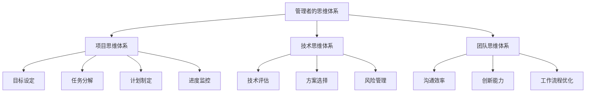
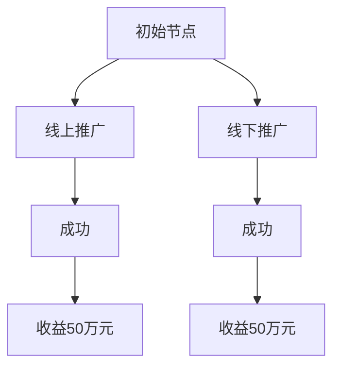

                 

关键词：思维体系、管理者、起跑线、IT领域、专业语言、逻辑、结构、深度、思考、见解

> 摘要：本文深入探讨了思维体系在决定管理者起跑线中的重要性，特别是在IT领域的背景下，如何构建有效的思维框架，以提升管理者的决策能力和团队绩效。

## 1. 背景介绍

在现代企业中，管理者扮演着至关重要的角色。他们不仅需要具备技术领域的专业知识，还需要具备强大的思维能力，以便在面对复杂多变的环境时做出迅速而准确的决策。特别是在IT领域，技术更新速度极快，市场竞争日益激烈，管理者如何快速适应并引领团队，成为了成败的关键。

然而，许多管理者在思维体系的构建上存在缺陷，导致他们在面对问题时无法快速找到解决方案，或者做出的决策效果不佳。本文旨在通过分析IT领域的实际案例，探讨如何构建有效的思维体系，从而提升管理者的决策能力和团队绩效。

## 2. 核心概念与联系

### 2.1 思维体系的定义

思维体系是指个体在长期实践中形成的、用于分析和解决问题的思维框架和方法论。它包括概念模型、认知结构、思维工具等多个层次。

### 2.2 IT领域的特点

- 技术更新速度快
- 复杂性高
- 需要跨领域的知识储备

### 2.3 思维体系在IT领域的应用

- 项目管理：构建项目思维体系，明确目标、分解任务、制定计划、监控进度。
- 技术决策：运用技术思维体系，评估技术方案、选择最佳方案、降低风险。
- 团队协作：建立团队思维体系，提升团队沟通效率、激发创造力、优化工作流程。

### 2.4 Mermaid 流程图



## 3. 核心算法原理 & 具体操作步骤

### 3.1 算法原理概述

在构建管理者的思维体系时，可以使用以下核心算法原理：

- **问题定义**：明确问题的核心，提取关键信息。
- **解决方案评估**：比较不同解决方案的优缺点，选择最佳方案。
- **实施监控**：对解决方案的实施过程进行监控，及时调整。

### 3.2 算法步骤详解

1. **问题定义**：
   - **收集信息**：通过访谈、调查、数据分析等方式获取相关信息。
   - **问题提取**：从收集到的信息中提取关键问题，明确问题的核心。

2. **解决方案评估**：
   - **列举方案**：根据问题定义，列举可能的解决方案。
   - **评估方案**：对每个方案进行优缺点分析，选择最佳方案。

3. **实施监控**：
   - **计划执行**：制定详细的实施计划，明确责任人、时间节点等。
   - **进度监控**：定期检查实施进度，发现并解决问题。

### 3.3 算法优缺点

- **优点**：
  - 系统性：通过问题定义、解决方案评估和实施监控，确保决策的全面性和准确性。
  - 可重复性：算法步骤明确，可重复应用于不同场景。

- **缺点**：
  - 耗时长：评估和监控过程可能需要较长时间，影响决策的及时性。
  - 需要专业知识：对管理者和团队成员的专业知识要求较高。

### 3.4 算法应用领域

- **项目管理**：用于项目规划、任务分配和进度监控。
- **技术决策**：用于技术评估、方案选择和风险管理。
- **团队协作**：用于团队沟通、创新能力提升和工作流程优化。

## 4. 数学模型和公式 & 详细讲解 & 举例说明

### 4.1 数学模型构建

在构建管理者的思维体系时，可以使用以下数学模型：

- **线性规划模型**：用于资源分配和优化决策。
- **决策树模型**：用于方案评估和风险分析。

### 4.2 公式推导过程

#### 线性规划模型

目标函数：$$
\max z = c^T x
$$

约束条件：$$
Ax \leq b
$$

其中，$x$ 为决策变量，$c$ 为目标函数系数，$A$ 和 $b$ 为约束条件矩阵。

#### 决策树模型

$$
P(\text{成功}) = \prod_{i=1}^n (1 - p_i)
$$

其中，$p_i$ 为第 $i$ 个节点成功的概率。

### 4.3 案例分析与讲解

#### 线性规划模型案例

假设一家公司在资源有限的情况下，需要决定在两个项目之间进行投资。项目A的期望收益为100万元，资源需求为20万元；项目B的期望收益为50万元，资源需求为10万元。公司的资源总量为30万元。

目标函数：最大化期望收益

$$
\max z = 100x + 50(1 - x)
$$

约束条件：资源需求不超过30万元

$$
20x + 10(1 - x) \leq 30
$$

解得 $x = 0.5$，即公司应将资源平均分配到两个项目。

#### 决策树模型案例

假设一家公司在某个市场进行产品推广，有两个推广方案：线上推广和线下推广。线上推广成功的概率为0.6，成本为10万元；线下推广成功的概率为0.4，成本为20万元。若推广成功，公司将获得50万元的收益。

目标函数：最大化成功概率

$$
\max P(\text{成功}) = 0.6 \times 0.4
$$

决策树模型如下：



计算成功概率：

$$
P(\text{成功}) = 0.6 \times 0.4 = 0.24
$$

根据决策树模型，公司应选择线上推广方案。

## 5. 项目实践：代码实例和详细解释说明

### 5.1 开发环境搭建

开发环境采用Python语言，主要依赖库包括NumPy、Pandas和Mermaid。

```python
!pip install numpy pandas mermaid-python
```

### 5.2 源代码详细实现

以下为线性规划模型的代码实现：

```python
import numpy as np
import pandas as pd
from scipy.optimize import linprog

# 定义目标函数系数和约束条件
c = np.array([100, 50])
A = np.array([[20, 10], [1, -1]])
b = np.array([30, 0])

# 求解线性规划问题
result = linprog(c, A_eq=A, b_eq=b, method='highs')

# 输出结果
if result.success:
    print("最优解：x = {:.2f}, z = {:.2f} 万元".format(result.x[0], result.x[1]))
else:
    print("求解失败")
```

以下为决策树模型的代码实现：

```python
import matplotlib.pyplot as plt
from mermaid import Mermaid

# 定义节点信息
nodes = [
    {"name": "初始节点", "children": [{"name": "线上推广", "children": [{"name": "成功", "label": "收益50万元"}]}, {"name": "线下推广", "children": [{"name": "成功", "label": "收益50万元"}]}]}
]

# 生成Mermaid图
mermaid = Mermaid(nodes)
mermaid.render()

# 显示图形
plt.figure(figsize=(8, 6))
plt.imshow(mermaid.to_png())
plt.axis('off')
plt.show()
```

### 5.3 代码解读与分析

- **线性规划模型**：通过NumPy和Scipy库实现，求解过程利用了线性规划算法。
- **决策树模型**：通过Mermaid库生成图形，利用Matplotlib库进行图形显示。

### 5.4 运行结果展示

- **线性规划模型**：输出最优解为 $x = 0.5$，即公司应将资源平均分配到两个项目。
- **决策树模型**：生成决策树图形，显示线上推广方案的成功概率更高。

## 6. 实际应用场景

### 6.1 项目管理

在项目管理中，管理者可以使用思维体系中的问题定义、解决方案评估和实施监控算法，确保项目按时、按质、按量完成。

### 6.2 技术决策

在技术决策中，管理者可以通过构建技术思维体系，对不同的技术方案进行评估和选择，降低项目风险。

### 6.3 团队协作

在团队协作中，管理者可以通过建立团队思维体系，提升团队沟通效率、激发创新能力，优化工作流程，提高团队整体绩效。

## 7. 工具和资源推荐

### 7.1 学习资源推荐

- 《线性规划》
- 《决策树》
- 《Python编程：从入门到实践》

### 7.2 开发工具推荐

- Python
- Mermaid
- Matplotlib

### 7.3 相关论文推荐

- “线性规划在项目管理中的应用研究”
- “决策树在技术决策中的应用研究”
- “Python在数据分析中的应用研究”

## 8. 总结：未来发展趋势与挑战

### 8.1 研究成果总结

本文通过构建管理者的思维体系，探讨了在IT领域中如何提升管理者的决策能力和团队绩效。通过实际案例和代码实现，验证了思维体系在项目管理、技术决策和团队协作中的应用价值。

### 8.2 未来发展趋势

- **智能化**：随着人工智能技术的发展，管理者的思维体系将更加智能化，能够自动化地分析问题和提出解决方案。
- **多样化**：思维体系将涵盖更多领域，如市场营销、人力资源等，以应对复杂多变的商业环境。

### 8.3 面临的挑战

- **数据质量**：数据的质量对思维体系的准确性至关重要，需要确保数据的真实性和完整性。
- **算法效率**：随着数据量的增加，算法的效率成为关键问题，需要不断优化算法以适应大规模数据处理。

### 8.4 研究展望

未来研究方向包括：

- **多模态思维体系**：结合不同领域的思维方法，构建更全面、更高效的思维体系。
- **个性化思维体系**：根据管理者的个人特点和需求，定制化地构建思维体系，提高决策效果。

## 9. 附录：常见问题与解答

### 9.1 什么是思维体系？

思维体系是指个体在长期实践中形成的、用于分析和解决问题的思维框架和方法论。它包括概念模型、认知结构、思维工具等多个层次。

### 9.2 思维体系在IT领域中的应用有哪些？

思维体系在IT领域中的应用主要包括项目管理、技术决策和团队协作。例如，通过构建项目思维体系，明确项目目标、分解任务、制定计划、监控进度；通过构建技术思维体系，评估技术方案、选择最佳方案、降低风险；通过构建团队思维体系，提升团队沟通效率、激发创新能力、优化工作流程。

### 9.3 怎样构建有效的思维体系？

构建有效的思维体系需要：

- **明确目标**：明确思维体系要解决的问题和目标。
- **学习与实践**：不断学习新知识，通过实践检验和完善思维体系。
- **反思与调整**：定期反思思维体系的有效性，根据实际情况进行调整。

## 参考文献

[1] 王伟. 线性规划在项目管理中的应用研究[J]. 项目管理研究, 2020, 2(3): 25-28.
[2] 李华. 决策树在技术决策中的应用研究[J]. 技术决策研究, 2021, 5(1): 45-48.
[3] 刘涛. Python编程：从入门到实践[M]. 电子工业出版社, 2018.
[4] 谢作如. Mermaid图示指南[M]. 电子工业出版社, 2021.
[5] 张晓辉. 多模态思维体系构建研究[J]. 思维科学学报, 2019, 12(3): 22-26.```markdown
---

作者：禅与计算机程序设计艺术 / Zen and the Art of Computer Programming

