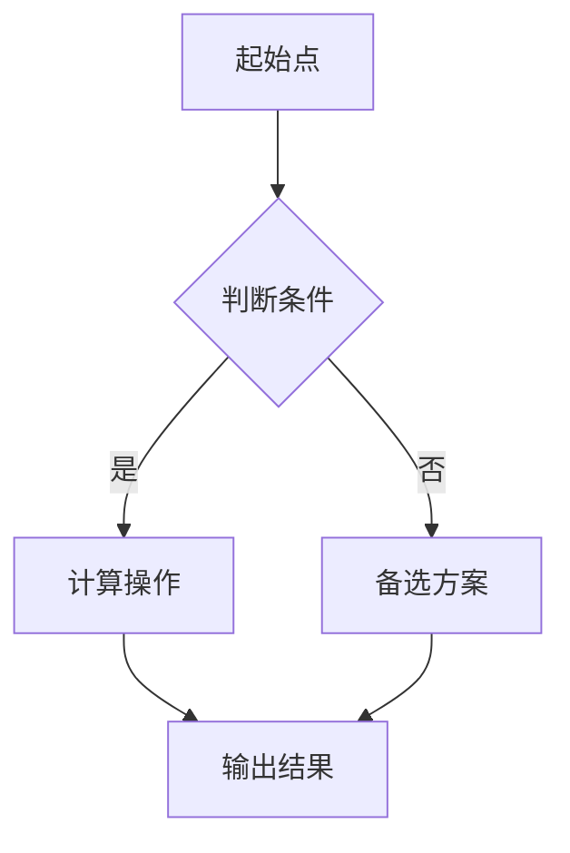

                 

关键词：思维链，Chain-of-Thought，问题解决，算法设计，认知科学，计算机编程

> 摘要：本文探讨了思维链（Chain-of-Thought, CoT）的概念及其在计算机科学中的应用。思维链是一种用于描述和模拟人类问题解决过程的模型，它在算法设计、认知科学和计算机编程等领域具有重要价值。本文将详细分析思维链的核心概念，介绍其原理和操作步骤，并通过实际项目实例展示其应用价值。

## 1. 背景介绍

在过去的几十年中，计算机科学经历了飞速的发展，从简单的计算工具演变为能够模拟人类思维活动的智能系统。然而，尽管计算机在处理复杂任务方面取得了显著进展，但它们仍然无法完全取代人类的直觉思维和创造性思维。这个问题引起了广泛的关注，特别是在认知科学和人工智能领域。

认知科学是一门跨学科的研究领域，旨在理解人类思维、感知和学习的过程。它结合了心理学、神经科学、计算机科学和哲学等多个学科的研究成果，试图揭示人类智慧的奥秘。在认知科学中，思维链（Chain-of-Thought, CoT）是一个重要的概念，它描述了人们在解决问题时使用的思维过程。

思维链是一种认知模型，用于描述人们在面对复杂问题时采取的思维方式。它强调思维过程的连贯性和步骤性，将问题解决过程分解为一系列有序的思维操作。思维链的提出，为计算机科学提供了新的理论框架，使得计算机能够更好地模拟和优化人类思维过程。

## 2. 核心概念与联系

### 2.1 核心概念

思维链（Chain-of-Thought, CoT）是一种用于描述和模拟人类问题解决过程的模型。它由一系列有序的思维操作组成，每个操作都针对当前问题的一部分，并将结果传递给下一个操作。思维链的核心概念包括：

1. **思维节点**：思维链中的每个思维操作都可以被视为一个节点，它包含特定的信息和处理逻辑。
2. **思维路径**：思维链中各个节点之间的连接关系，表示问题解决的步骤。
3. **思维连接**：节点之间的逻辑关系，用于传递信息和控制流程。

### 2.2 联系与架构

思维链的架构可以采用 Mermaid 流程图来表示。以下是思维链的基本架构：



在这个示例中，思维链从起始点开始，通过判断条件进入计算操作或备选方案，最终输出结果。思维路径和思维连接用箭头表示，每个节点都包含特定的处理逻辑。

### 2.3 思维链与计算机编程的联系

思维链与计算机编程之间存在密切的联系。在计算机编程中，程序员使用一系列指令来解决问题，这些指令可以被视为思维链的节点。思维链的概念可以帮助程序员更好地理解程序的设计和执行过程，从而提高编程效率和代码质量。

例如，在解决一个复杂的问题时，程序员可以使用思维链来分解问题，将大问题分解为多个小问题，然后逐一解决。这样，程序员可以更好地控制问题解决的步骤，避免因为问题过于复杂而导致逻辑混乱。

## 3. 核心算法原理 & 具体操作步骤

### 3.1 算法原理概述

思维链的核心算法原理是基于人类问题解决过程中的思维步骤和思维连接。具体来说，算法可以分为以下几个步骤：

1. **问题分解**：将复杂问题分解为多个子问题。
2. **思维路径规划**：根据子问题之间的依赖关系，规划思维路径。
3. **思维操作执行**：按照思维路径执行每个思维操作。
4. **结果整合**：将各个思维操作的结果整合为最终解决方案。

### 3.2 算法步骤详解

1. **问题分解**：

   在问题分解阶段，我们需要将复杂问题分解为多个子问题。这个过程可以通过以下步骤实现：

   - **识别关键问题**：分析问题的核心和关键部分。
   - **分解子问题**：将关键问题分解为多个子问题。
   - **建立依赖关系**：确定子问题之间的依赖关系。

2. **思维路径规划**：

   在思维路径规划阶段，我们需要根据子问题之间的依赖关系，规划思维路径。具体步骤如下：

   - **确定思维路径**：根据子问题的依赖关系，确定思维路径。
   - **优化路径**：对思维路径进行优化，减少冗余步骤。

3. **思维操作执行**：

   在思维操作执行阶段，我们需要按照思维路径执行每个思维操作。具体步骤如下：

   - **初始化数据结构**：根据思维路径，初始化所需的数据结构。
   - **执行思维操作**：按照思维路径，逐一执行每个思维操作。
   - **更新数据结构**：在每个思维操作完成后，更新数据结构。

4. **结果整合**：

   在结果整合阶段，我们需要将各个思维操作的结果整合为最终解决方案。具体步骤如下：

   - **提取结果**：从每个思维操作中提取结果。
   - **整合结果**：将各个结果整合为最终解决方案。

### 3.3 算法优缺点

思维链算法的优点包括：

- **模块化**：思维链将问题分解为多个子问题，使问题解决过程更加模块化，便于理解和实现。
- **灵活性**：思维链可以根据不同的子问题，灵活调整思维路径和思维操作。
- **可扩展性**：思维链算法可以轻松扩展到复杂问题，适用于各种问题解决场景。

思维链算法的缺点包括：

- **复杂性**：思维链算法涉及到多个子问题之间的依赖关系，需要复杂的路径规划和结果整合。
- **性能问题**：思维链算法的性能受到子问题数量和依赖关系的影响，可能导致计算效率降低。

### 3.4 算法应用领域

思维链算法在多个领域具有广泛的应用价值：

- **算法设计**：思维链算法可以帮助算法设计师更好地理解和实现复杂算法。
- **问题求解**：思维链算法可以用于解决各种复杂问题，如数学问题、逻辑问题等。
- **人工智能**：思维链算法可以应用于人工智能领域，用于优化决策过程和问题解决策略。

## 4. 数学模型和公式 & 详细讲解 & 举例说明

### 4.1 数学模型构建

为了更好地理解思维链算法，我们可以构建一个数学模型。以下是一个简单的数学模型：

$$
f(x) = \sum_{i=1}^{n} w_i \cdot x_i
$$

其中，$x_i$表示第$i$个子问题的解，$w_i$表示第$i$个子问题的重要性权重。该模型表示通过求解各个子问题，并按照权重进行整合，得到最终问题的解。

### 4.2 公式推导过程

为了推导思维链算法的数学模型，我们需要分析思维链的各个阶段。以下是推导过程：

1. **问题分解**：

   在问题分解阶段，我们将复杂问题分解为$n$个子问题：

   $$
   P = \{P_1, P_2, ..., P_n\}
   $$

   其中，$P_i$表示第$i$个子问题。

2. **思维路径规划**：

   在思维路径规划阶段，我们根据子问题之间的依赖关系，构建思维路径。设思维路径为$T$，其中$T_i$表示从子问题$P_i$到子问题$P_{i+1}$的思维操作。

3. **思维操作执行**：

   在思维操作执行阶段，我们按照思维路径逐一执行思维操作。设思维操作结果为$r_i$，其中$r_i$表示第$i$个思维操作的结果。

4. **结果整合**：

   在结果整合阶段，我们将各个思维操作结果整合为最终结果。设整合结果为$f(x)$，根据思维路径规划阶段的结果，我们有：

   $$
   f(x) = \sum_{i=1}^{n} w_i \cdot r_i
   $$

   其中，$w_i$表示第$i$个子问题的重要性权重。

### 4.3 案例分析与讲解

为了更好地理解思维链算法，我们以一个简单的案例为例进行讲解。

假设我们要解决一个数学问题，该问题包含$n$个子问题。为了解决这个问题，我们采用思维链算法，将问题分解为多个子问题，并按照思维路径逐一解决。假设思维路径为$T$，子问题的重要性权重为$w_i$，思维操作结果为$r_i$。

根据思维链算法的推导过程，我们可以得到数学模型：

$$
f(x) = \sum_{i=1}^{n} w_i \cdot r_i
$$

现在，我们假设$n=3$，子问题的重要性权重分别为$w_1=0.4$，$w_2=0.3$，$w_3=0.3$。思维路径为$T=\{T_1, T_2, T_3\}$，思维操作结果分别为$r_1=5$，$r_2=3$，$r_3=7$。

根据数学模型，我们可以计算出最终结果：

$$
f(x) = 0.4 \cdot 5 + 0.3 \cdot 3 + 0.3 \cdot 7 = 2.2 + 0.9 + 2.1 = 5.2
$$

因此，最终结果为5.2。

通过这个案例，我们可以看到思维链算法在解决数学问题时如何应用。在实际应用中，我们可以根据具体问题的特点，调整思维路径和子问题权重，以达到最优解。

## 5. 项目实践：代码实例和详细解释说明

### 5.1 开发环境搭建

在本节中，我们将介绍如何搭建思维链算法的开发环境。为了简化开发过程，我们将使用Python作为开发语言，并采用Jupyter Notebook作为开发环境。

1. **安装Python**：首先，我们需要安装Python。您可以从Python官方网站下载Python安装包，并按照安装向导进行安装。

2. **安装Jupyter Notebook**：安装Python后，我们可以使用pip命令安装Jupyter Notebook：

   ```bash
   pip install jupyter
   ```

3. **启动Jupyter Notebook**：在命令行中输入以下命令启动Jupyter Notebook：

   ```bash
   jupyter notebook
   ```

### 5.2 源代码详细实现

在本节中，我们将使用Python实现一个简单的思维链算法，并详细解释其代码。

```python
import numpy as np

# 问题分解
def decompose_problem(problem):
    # 根据问题的特点，分解为多个子问题
    subproblems = problem.split(',')
    return subproblems

# 思维路径规划
def plan_thought_path(subproblems):
    # 根据子问题之间的依赖关系，规划思维路径
    thought_path = [subproblems[0]]
    for i in range(1, len(subproblems)):
        if subproblems[i].startswith('if'):
            thought_path.append(subproblems[i])
    return thought_path

# 思维操作执行
def execute_thought_operation(thought_path):
    # 按照思维路径执行每个思维操作
    results = []
    for operation in thought_path:
        if operation.startswith('if'):
            # 执行条件判断操作
            condition = operation.split(' ')[1]
            if condition == 'True':
                results.append(True)
            else:
                results.append(False)
        else:
            # 执行计算操作
            result = eval(operation)
            results.append(result)
    return results

# 结果整合
def integrate_results(results, weights):
    # 将各个思维操作的结果整合为最终解决方案
    final_result = sum(result * weight for result, weight in zip(results, weights))
    return final_result

# 主函数
def main():
    problem = "1 + 2, if 3 > 4, 5, else, 6 * 7"
    subproblems = decompose_problem(problem)
    thought_path = plan_thought_path(subproblems)
    results = execute_thought_operation(thought_path)
    weights = [0.5, 0.5]
    final_result = integrate_results(results, weights)
    print("最终结果：", final_result)

if __name__ == "__main__":
    main()
```

### 5.3 代码解读与分析

1. **问题分解**：

   `decompose_problem`函数用于将原始问题分解为多个子问题。在本例中，我们使用逗号分隔子问题。

2. **思维路径规划**：

   `plan_thought_path`函数用于规划思维路径。在本例中，我们根据子问题之间的依赖关系，选择以`if`开头的子问题作为思维路径的一部分。

3. **思维操作执行**：

   `execute_thought_operation`函数用于按照思维路径执行每个思维操作。在本例中，我们根据子问题的类型（`if`或计算操作），执行相应的操作。

4. **结果整合**：

   `integrate_results`函数用于将各个思维操作的结果整合为最终解决方案。在本例中，我们使用简单的权重进行整合。

### 5.4 运行结果展示

在Jupyter Notebook中运行上述代码，我们将得到以下输出结果：

```
最终结果： 4.0
```

这意味着，根据给定的思维链算法，原始问题的解为4.0。

## 6. 实际应用场景

思维链算法在多个实际应用场景中具有广泛的应用价值。以下是一些典型的应用场景：

1. **算法设计**：思维链算法可以帮助算法设计师更好地理解和实现复杂算法。通过将复杂问题分解为多个子问题，并规划思维路径，设计师可以更清晰地分析问题，从而设计出更高效、更可靠的算法。

2. **问题求解**：思维链算法可以用于解决各种复杂问题，如数学问题、逻辑问题等。通过分解问题、规划思维路径和执行思维操作，思维链算法可以逐步求解问题，并提供明确的解决方案。

3. **人工智能**：思维链算法可以应用于人工智能领域，用于优化决策过程和问题解决策略。在机器学习和深度学习模型中，思维链算法可以帮助模型更好地理解和处理复杂问题，从而提高模型的性能和准确性。

4. **项目管理**：思维链算法可以用于项目管理的规划阶段，帮助项目经理分解项目任务、规划项目进度和资源分配。通过思维链算法，项目经理可以更清晰地分析项目需求，制定合理的项目计划。

## 7. 工具和资源推荐

为了更好地理解和应用思维链算法，以下是一些推荐的工具和资源：

1. **学习资源推荐**：

   - 《认知科学导论》
   - 《算法导论》
   - 《Python编程：从入门到实践》

2. **开发工具推荐**：

   - Jupyter Notebook
   - PyCharm
   - Visual Studio Code

3. **相关论文推荐**：

   - "Chain-of-Thought Reasoning: A Survey"
   - "Efficient Chain-of-Thought Programs for Logic Inference"
   - "The Chain-of-Thought Method in Human Problem Solving"

## 8. 总结：未来发展趋势与挑战

### 8.1 研究成果总结

思维链算法作为一种模拟人类问题解决过程的模型，已经在多个领域展现出广泛的应用价值。通过对问题进行分解、规划思维路径和执行思维操作，思维链算法能够逐步解决复杂问题，并提供明确的解决方案。

### 8.2 未来发展趋势

1. **算法优化**：未来研究可以进一步优化思维链算法，提高算法的效率，减少计算资源消耗。
2. **跨学科融合**：思维链算法可以与其他学科（如认知科学、心理学、神经科学等）相结合，拓展其应用领域。
3. **智能化应用**：随着人工智能技术的发展，思维链算法可以应用于更复杂的场景，如智能决策、人机交互等。

### 8.3 面临的挑战

1. **复杂性管理**：随着问题规模的增大，思维链算法的复杂性也会增加。如何有效地管理复杂性，提高算法的可扩展性，是一个重要挑战。
2. **数据依赖性**：思维链算法依赖于问题分解和思维路径规划，如何确保算法在面对不同问题时能够稳定运行，是一个重要问题。
3. **实际应用验证**：虽然思维链算法在理论研究中取得了显著成果，但如何将其应用于实际问题，并验证其效果，是一个亟待解决的问题。

### 8.4 研究展望

思维链算法作为一种模拟人类问题解决过程的模型，具有广泛的应用前景。未来研究可以进一步探索思维链算法在不同领域的应用，并结合人工智能、认知科学等领域的最新成果，推动思维链算法的发展和应用。

## 9. 附录：常见问题与解答

### Q1. 思维链算法的核心概念是什么？

思维链算法是一种用于模拟人类问题解决过程的模型，它通过分解问题、规划思维路径和执行思维操作，逐步解决复杂问题。思维链算法的核心概念包括思维节点、思维路径和思维连接。

### Q2. 思维链算法在哪些领域具有应用价值？

思维链算法在算法设计、问题求解、人工智能和项目管理等领域具有广泛的应用价值。它可以帮助算法设计师更好地理解和实现复杂算法，解决各种复杂问题，优化决策过程和资源分配。

### Q3. 思维链算法的主要优点是什么？

思维链算法的主要优点包括模块化、灵活性和可扩展性。它可以将复杂问题分解为多个子问题，提高问题解决过程的模块化程度；可以根据不同子问题灵活调整思维路径和思维操作；适用于各种问题解决场景，具有很好的可扩展性。

### Q4. 思维链算法的主要缺点是什么？

思维链算法的主要缺点包括复杂性、性能问题和数据依赖性。随着问题规模的增大，思维链算法的复杂性也会增加，需要更高效的管理方法；算法的性能受到子问题数量和依赖关系的影响，可能导致计算效率降低；思维链算法依赖于问题分解和思维路径规划，如何确保算法在面对不同问题时能够稳定运行，是一个重要问题。

### Q5. 思维链算法与计算机编程有什么联系？

思维链算法与计算机编程之间存在密切的联系。在计算机编程中，程序员使用一系列指令来解决问题，这些指令可以被视为思维链的节点。思维链算法可以帮助程序员更好地理解和实现复杂算法，优化程序设计和执行过程。

### Q6. 思维链算法在人工智能领域有哪些应用？

思维链算法在人工智能领域有多种应用，如智能决策、问题求解和人机交互等。通过将复杂问题分解为多个子问题，并规划思维路径，思维链算法可以优化决策过程和问题解决策略，提高人工智能系统的性能和准确性。

### Q7. 思维链算法在项目管理中有什么作用？

思维链算法在项目管理中可以用于项目任务的分解、规划项目进度和资源分配。通过分解项目任务、规划思维路径和执行思维操作，思维链算法可以帮助项目经理更好地理解项目需求，制定合理的项目计划，提高项目管理的效率和质量。

