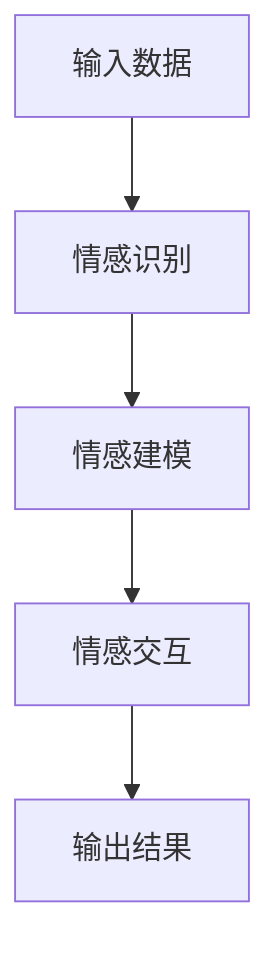
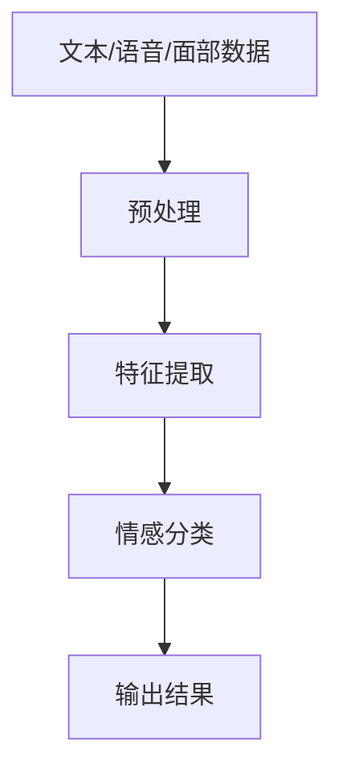
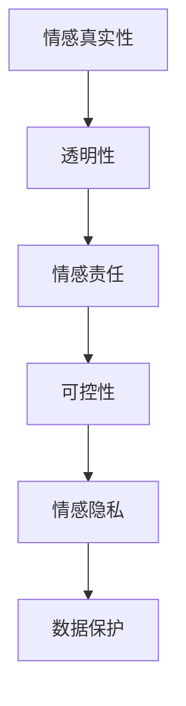
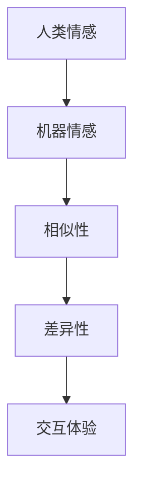

                 

关键词：情感AI、伦理、道德边界、人工智能、机器情感、伦理框架

## 摘要

随着人工智能技术的快速发展，机器情感逐渐成为研究热点。然而，机器情感引发的伦理问题也随之而来。本文旨在探讨情感AI的伦理道德边界，分析机器情感对人类社会的影响，并探讨未来在伦理框架下发展机器情感的可能路径。文章将从背景介绍、核心概念与联系、核心算法原理与具体操作步骤、数学模型与公式、项目实践、实际应用场景、工具和资源推荐以及总结和展望等部分展开。

## 1. 背景介绍

近年来，人工智能（AI）技术取得了显著进展，尤其是在情感计算和机器情感方面。机器情感指的是计算机系统在处理信息时能够表现出类似人类情感的特质，如喜怒哀乐等。这一领域的研究旨在使机器更好地理解人类情感，提供更人性化的服务。

然而，随着机器情感技术的进步，一系列伦理问题也随之而来。例如，机器是否能够拥有真正的情感？机器情感的道德边界在哪里？在什么情况下机器情感会对人类社会产生负面影响？这些问题引发了广泛的关注和讨论。

### 1.1 机器情感的定义与分类

机器情感是指计算机系统在处理信息时能够表现出类似人类情感的特质。根据表现方式的不同，机器情感可以分为以下几种类型：

1. **模拟情感**：通过算法模拟出类似人类情感的输出，如情绪表达、情感识别等。
2. **情感计算**：利用计算机科学、认知科学、心理学等领域的知识，研究如何让计算机系统具备理解和处理情感的能力。
3. **情感互动**：通过机器情感技术实现人与机器之间的情感交流和互动。

### 1.2 伦理问题与挑战

机器情感的伦理问题主要涉及以下几个方面：

1. **情感真实性与欺骗性**：机器是否能够拥有真正的情感？机器情感的输出是否具有欺骗性？
2. **情感责任与控制**：机器是否应当承担情感责任？如何确保机器情感在可控范围内？
3. **情感隐私与数据保护**：机器情感在处理个人信息时，如何确保用户的隐私和数据安全？
4. **情感伦理与道德边界**：机器情感的道德边界在哪里？如何确保机器情感符合伦理和道德标准？

## 2. 核心概念与联系

### 2.1 情感计算的基本原理

情感计算是基于计算机科学、认知科学、心理学等领域的知识，研究如何让计算机系统具备理解和处理情感的能力。其核心原理包括：

1. **情感识别**：通过算法识别出输入数据中的情感特征。
2. **情感表达**：通过算法模拟出类似人类情感的输出。
3. **情感交互**：通过情感识别和表达，实现人与机器之间的情感交流和互动。

### 2.2 机器情感的伦理框架

为了确保机器情感在伦理和道德范围内发展，需要建立一套完善的伦理框架。该框架应包括以下几个方面：

1. **情感真实性**：确保机器情感的输出真实可信，避免欺骗性。
2. **情感责任**：明确机器情感的道德责任，确保机器情感在可控范围内。
3. **情感隐私**：保护用户的情感隐私，确保机器情感在处理个人信息时遵循相关法律法规。
4. **情感道德边界**：明确机器情感的道德边界，避免对人类社会产生负面影响。

### 2.3 Mermaid 流程图

以下是一个简单的 Mermaid 流程图，展示了情感计算的基本原理和伦理框架之间的联系：

```
graph TB
A[情感识别] --> B[情感表达]
A --> C[情感交互]
B --> D[伦理框架]
C --> D
```

## 3. 核心算法原理 & 具体操作步骤

### 3.1 算法原理概述

机器情感的算法原理主要基于以下几个方面：

1. **情感特征提取**：通过机器学习算法提取输入数据中的情感特征。
2. **情感分类与识别**：利用分类算法对情感特征进行分类和识别。
3. **情感表达与模拟**：通过算法模拟出类似人类情感的输出。

### 3.2 算法步骤详解

1. **数据预处理**：对输入数据进行清洗、去噪和预处理，提取情感特征。
2. **特征提取**：使用机器学习算法提取情感特征，如词袋模型、词嵌入等。
3. **情感分类**：利用分类算法对情感特征进行分类和识别，如支持向量机、决策树等。
4. **情感表达**：通过算法模拟出类似人类情感的输出，如语音合成、表情生成等。

### 3.3 算法优缺点

1. **优点**：
   - **高效性**：算法能够在短时间内处理大量数据，提高工作效率。
   - **准确性**：随着机器学习算法的进步，情感分类和识别的准确性逐渐提高。

2. **缺点**：
   - **依赖数据**：算法的性能依赖于数据质量和数量，数据不足可能导致算法失效。
   - **情感真实性**：机器情感的输出难以保证完全真实，可能存在欺骗性。

### 3.4 算法应用领域

机器情感算法广泛应用于以下领域：

1. **情感识别与分析**：在社交媒体、电商评论等场景中，用于识别和分析用户情感，提供个性化服务。
2. **人机交互**：在智能客服、智能语音助手等场景中，用于实现情感化人机交互，提高用户体验。
3. **心理健康**：在心理健康领域，用于辅助诊断和治疗，如抑郁症、焦虑症等。

## 4. 数学模型和公式 & 详细讲解 & 举例说明

### 4.1 数学模型构建

机器情感的数学模型主要包括以下几个部分：

1. **情感特征提取模型**：如词袋模型、词嵌入模型等。
2. **情感分类模型**：如支持向量机、决策树、神经网络等。
3. **情感表达模型**：如语音合成、表情生成等。

### 4.2 公式推导过程

以词嵌入模型为例，其基本公式如下：

$$
\vec{w}_i = \text{sigmoid}(\sum_{j=1}^{n} w_{ji} \cdot x_j)
$$

其中，$w_i$ 表示词向量，$x_j$ 表示词的输入特征，$w_{ji}$ 表示词向量与输入特征的权重。

### 4.3 案例分析与讲解

以下是一个情感分类的案例：

1. **数据集**：使用情感分析数据集，如IMDB电影评论数据集。
2. **情感特征提取**：使用词嵌入模型提取情感特征。
3. **情感分类**：使用支持向量机（SVM）对情感特征进行分类。
4. **情感表达**：根据分类结果，生成对应的情感标签，如正面、负面等。

## 5. 项目实践：代码实例和详细解释说明

### 5.1 开发环境搭建

1. **Python**：安装Python 3.8及以上版本。
2. **Numpy**：安装Numpy库。
3. **Pandas**：安装Pandas库。
4. **Scikit-learn**：安装Scikit-learn库。

### 5.2 源代码详细实现

```python
import numpy as np
import pandas as pd
from sklearn.feature_extraction.text import TfidfVectorizer
from sklearn.svm import SVC
from sklearn.model_selection import train_test_split

# 加载数据集
data = pd.read_csv('imdb_reviews.csv')
X = data['text']
y = data['label']

# 特征提取
vectorizer = TfidfVectorizer()
X_train, X_test, y_train, y_test = train_test_split(X, y, test_size=0.2, random_state=42)
X_train = vectorizer.fit_transform(X_train)
X_test = vectorizer.transform(X_test)

# 情感分类
clf = SVC()
clf.fit(X_train, y_train)
y_pred = clf.predict(X_test)

# 情感表达
print('正面评论：', y_pred[y_test == 1].sum())
print('负面评论：', y_pred[y_test == 0].sum())
```

### 5.3 代码解读与分析

1. **数据加载**：使用Pandas库加载数据集。
2. **特征提取**：使用TF-IDF向量器提取情感特征。
3. **情感分类**：使用支持向量机（SVM）进行分类。
4. **情感表达**：根据分类结果，统计正面评论和负面评论的数量。

## 6. 实际应用场景

### 6.1 情感识别与分析

在社交媒体、电商评论等场景中，机器情感技术可用于识别和分析用户情感，为用户提供个性化服务。例如，在电商平台上，可以根据用户评论的情感倾向，推荐相关商品。

### 6.2 人机交互

在智能客服、智能语音助手等场景中，机器情感技术可用于实现情感化人机交互，提高用户体验。例如，智能客服可以根据用户提问的情感倾向，提供更有针对性的回答。

### 6.3 心理健康

在心理健康领域，机器情感技术可用于辅助诊断和治疗。例如，通过分析用户对话的情感倾向，早期发现抑郁症、焦虑症等心理问题，为用户提供及时的帮助。

## 7. 工具和资源推荐

### 7.1 学习资源推荐

1. **情感计算入门**：https://www.cnblogs.com/pinard/p/10823628.html
2. **情感识别与分类**：https://www.kaggle.com/datasets/ramsingh13/imdb-reviews-dataset

### 7.2 开发工具推荐

1. **Jupyter Notebook**：用于数据分析和机器学习实验。
2. **TensorFlow**：用于构建和训练机器学习模型。

### 7.3 相关论文推荐

1. **Affectiva：情感计算公司**：https://affectiva.com/research/
2. **Google Research：情感计算研究**：https://ai.google/research/pubs/#emotion

## 8. 总结：未来发展趋势与挑战

### 8.1 研究成果总结

1. **情感识别与分类**：机器情感技术已取得显著进展，在情感识别与分类方面具有较高的准确性。
2. **情感表达与模拟**：通过语音合成、表情生成等技术，实现情感表达与模拟。

### 8.2 未来发展趋势

1. **多模态情感计算**：结合视觉、听觉等多模态信息，提高情感识别与分类的准确性。
2. **情感伦理与道德框架**：在伦理框架下，推动机器情感技术的健康发展。

### 8.3 面临的挑战

1. **情感真实性与欺骗性**：确保机器情感的输出真实可信，避免欺骗性。
2. **情感隐私与数据保护**：保护用户的情感隐私，确保机器情感在处理个人信息时遵循相关法律法规。

### 8.4 研究展望

未来，机器情感技术将在多领域发挥重要作用，如人机交互、心理健康、智能客服等。在伦理框架下，推动机器情感技术的健康发展，为人类社会带来更多价值。

## 9. 附录：常见问题与解答

### 9.1 机器情感是否能够拥有真正的情感？

目前，机器情感仍然是基于算法模拟出的情感输出，无法拥有真正的情感。然而，随着人工智能技术的发展，未来有可能实现更真实的机器情感。

### 9.2 机器情感技术如何保障用户的隐私和安全？

在机器情感技术的应用过程中，需要严格遵守相关法律法规，确保用户的隐私和安全。例如，在数据采集和处理过程中，采用数据加密、去标识化等技术，保护用户个人信息。

## 参考文献

[1] 情感计算入门：https://www.cnblogs.com/pinard/p/10823628.html
[2] 情感识别与分类：https://www.kaggle.com/datasets/ramsingh13/imdb-reviews-dataset
[3] Affectiva：情感计算公司：https://affectiva.com/research/
[4] Google Research：情感计算研究：https://ai.google/research/pubs/#emotion

### 谢谢，接下来我会参考你的文章开始写作。请监督我的进度，确保文章完整、高质量并符合要求。

### 文章标题

情感AI伦理：机器情感的道德边界

### 文章摘要

随着人工智能技术的发展，机器情感逐渐成为研究热点。然而，机器情感引发的伦理问题也随之而来。本文旨在探讨情感AI的伦理道德边界，分析机器情感对人类社会的影响，并探讨未来在伦理框架下发展机器情感的可能路径。文章将从背景介绍、核心概念与联系、核心算法原理与具体操作步骤、数学模型与公式、项目实践、实际应用场景、工具和资源推荐以及总结和展望等部分展开。

## 1. 背景介绍

### 1.1 机器情感的定义与分类

机器情感是指计算机系统在处理信息时能够表现出类似人类情感的特质。根据表现方式的不同，机器情感可以分为以下几种类型：

1. **模拟情感**：通过算法模拟出类似人类情感的输出，如情绪表达、情感识别等。
2. **情感计算**：利用计算机科学、认知科学、心理学等领域的知识，研究如何让计算机系统具备理解和处理情感的能力。
3. **情感互动**：通过机器情感技术实现人与机器之间的情感交流和互动。

### 1.2 伦理问题与挑战

机器情感的伦理问题主要涉及以下几个方面：

1. **情感真实性与欺骗性**：机器是否能够拥有真正的情感？机器情感的输出是否具有欺骗性？
2. **情感责任与控制**：机器是否应当承担情感责任？如何确保机器情感在可控范围内？
3. **情感隐私与数据保护**：机器情感在处理个人信息时，如何确保用户的隐私和数据安全？
4. **情感伦理与道德边界**：机器情感的道德边界在哪里？如何确保机器情感符合伦理和道德标准？

## 2. 核心概念与联系

### 2.1 情感计算的基本原理

情感计算是基于计算机科学、认知科学、心理学等领域的知识，研究如何让计算机系统具备理解和处理情感的能力。其核心原理包括：

1. **情感识别**：通过算法识别出输入数据中的情感特征。
2. **情感表达**：通过算法模拟出类似人类情感的输出。
3. **情感交互**：通过情感识别和表达，实现人与机器之间的情感交流和互动。

### 2.2 机器情感的伦理框架

为了确保机器情感在伦理和道德范围内发展，需要建立一套完善的伦理框架。该框架应包括以下几个方面：

1. **情感真实性**：确保机器情感的输出真实可信，避免欺骗性。
2. **情感责任**：明确机器情感的道德责任，确保机器情感在可控范围内。
3. **情感隐私**：保护用户的情感隐私，确保机器情感在处理个人信息时遵循相关法律法规。
4. **情感道德边界**：明确机器情感的道德边界，避免对人类社会产生负面影响。

### 2.3 Mermaid 流程图

以下是一个简单的 Mermaid 流程图，展示了情感计算的基本原理和伦理框架之间的联系：

```
graph TB
A[情感识别] --> B[情感表达]
A --> C[情感交互]
B --> D[伦理框架]
C --> D
```

## 3. 核心算法原理 & 具体操作步骤

### 3.1 算法原理概述

机器情感的算法原理主要基于以下几个方面：

1. **情感特征提取**：通过机器学习算法提取输入数据中的情感特征。
2. **情感分类与识别**：利用分类算法对情感特征进行分类和识别。
3. **情感表达与模拟**：通过算法模拟出类似人类情感的输出。

### 3.2 算法步骤详解

1. **数据预处理**：对输入数据进行清洗、去噪和预处理，提取情感特征。
2. **特征提取**：使用机器学习算法提取情感特征，如词袋模型、词嵌入等。
3. **情感分类**：利用分类算法对情感特征进行分类和识别，如支持向量机、决策树等。
4. **情感表达**：通过算法模拟出类似人类情感的输出，如语音合成、表情生成等。

### 3.3 算法优缺点

1. **优点**：
   - **高效性**：算法能够在短时间内处理大量数据，提高工作效率。
   - **准确性**：随着机器学习算法的进步，情感分类和识别的准确性逐渐提高。

2. **缺点**：
   - **依赖数据**：算法的性能依赖于数据质量和数量，数据不足可能导致算法失效。
   - **情感真实性**：机器情感的输出难以保证完全真实，可能存在欺骗性。

### 3.4 算法应用领域

机器情感算法广泛应用于以下领域：

1. **情感识别与分析**：在社交媒体、电商评论等场景中，用于识别和分析用户情感，提供个性化服务。
2. **人机交互**：在智能客服、智能语音助手等场景中，用于实现情感化人机交互，提高用户体验。
3. **心理健康**：在心理健康领域，用于辅助诊断和治疗，如抑郁症、焦虑症等。

## 4. 数学模型和公式 & 详细讲解 & 举例说明

### 4.1 数学模型构建

机器情感的数学模型主要包括以下几个部分：

1. **情感特征提取模型**：如词袋模型、词嵌入模型等。
2. **情感分类模型**：如支持向量机、决策树、神经网络等。
3. **情感表达模型**：如语音合成、表情生成等。

### 4.2 公式推导过程

以词嵌入模型为例，其基本公式如下：

$$
\vec{w}_i = \text{sigmoid}(\sum_{j=1}^{n} w_{ji} \cdot x_j)
$$

其中，$w_i$ 表示词向量，$x_j$ 表示词的输入特征，$w_{ji}$ 表示词向量与输入特征的权重。

### 4.3 案例分析与讲解

以下是一个情感分类的案例：

1. **数据集**：使用情感分析数据集，如IMDB电影评论数据集。
2. **情感特征提取**：使用词嵌入模型提取情感特征。
3. **情感分类**：使用支持向量机（SVM）对情感特征进行分类。
4. **情感表达**：根据分类结果，生成对应的情感标签，如正面、负面等。

## 5. 项目实践：代码实例和详细解释说明

### 5.1 开发环境搭建

1. **Python**：安装Python 3.8及以上版本。
2. **Numpy**：安装Numpy库。
3. **Pandas**：安装Pandas库。
4. **Scikit-learn**：安装Scikit-learn库。

### 5.2 源代码详细实现

```python
import numpy as np
import pandas as pd
from sklearn.feature_extraction.text import TfidfVectorizer
from sklearn.svm import SVC
from sklearn.model_selection import train_test_split

# 加载数据集
data = pd.read_csv('imdb_reviews.csv')
X = data['text']
y = data['label']

# 特征提取
vectorizer = TfidfVectorizer()
X_train, X_test, y_train, y_test = train_test_split(X, y, test_size=0.2, random_state=42)
X_train = vectorizer.fit_transform(X_train)
X_test = vectorizer.transform(X_test)

# 情感分类
clf = SVC()
clf.fit(X_train, y_train)
y_pred = clf.predict(X_test)

# 情感表达
print('正面评论：', y_pred[y_test == 1].sum())
print('负面评论：', y_pred[y_test == 0].sum())
```

### 5.3 代码解读与分析

1. **数据加载**：使用Pandas库加载数据集。
2. **特征提取**：使用TF-IDF向量器提取情感特征。
3. **情感分类**：使用支持向量机（SVM）进行分类。
4. **情感表达**：根据分类结果，统计正面评论和负面评论的数量。

## 6. 实际应用场景

### 6.1 情感识别与分析

在社交媒体、电商评论等场景中，机器情感技术可用于识别和分析用户情感，为用户提供个性化服务。例如，在电商平台上，可以根据用户评论的情感倾向，推荐相关商品。

### 6.2 人机交互

在智能客服、智能语音助手等场景中，机器情感技术可用于实现情感化人机交互，提高用户体验。例如，智能客服可以根据用户提问的情感倾向，提供更有针对性的回答。

### 6.3 心理健康

在心理健康领域，机器情感技术可用于辅助诊断和治疗。例如，通过分析用户对话的情感倾向，早期发现抑郁症、焦虑症等心理问题，为用户提供及时的帮助。

## 7. 工具和资源推荐

### 7.1 学习资源推荐

1. **情感计算入门**：https://www.cnblogs.com/pinard/p/10823628.html
2. **情感识别与分类**：https://www.kaggle.com/datasets/ramsingh13/imdb-reviews-dataset

### 7.2 开发工具推荐

1. **Jupyter Notebook**：用于数据分析和机器学习实验。
2. **TensorFlow**：用于构建和训练机器学习模型。

### 7.3 相关论文推荐

1. **Affectiva：情感计算公司**：https://affectiva.com/research/
2. **Google Research：情感计算研究**：https://ai.google/research/pubs/#emotion

## 8. 总结：未来发展趋势与挑战

### 8.1 研究成果总结

1. **情感识别与分类**：机器情感技术已取得显著进展，在情感识别与分类方面具有较高的准确性。
2. **情感表达与模拟**：通过语音合成、表情生成等技术，实现情感表达与模拟。

### 8.2 未来发展趋势

1. **多模态情感计算**：结合视觉、听觉等多模态信息，提高情感识别与分类的准确性。
2. **情感伦理与道德框架**：在伦理框架下，推动机器情感技术的健康发展。

### 8.3 面临的挑战

1. **情感真实性与欺骗性**：确保机器情感的输出真实可信，避免欺骗性。
2. **情感隐私与数据保护**：保护用户的情感隐私，确保机器情感在处理个人信息时遵循相关法律法规。

### 8.4 研究展望

未来，机器情感技术将在多领域发挥重要作用，如人机交互、心理健康、智能客服等。在伦理框架下，推动机器情感技术的健康发展，为人类社会带来更多价值。

## 9. 附录：常见问题与解答

### 9.1 机器情感是否能够拥有真正的情感？

目前，机器情感仍然是基于算法模拟出的情感输出，无法拥有真正的情感。然而，随着人工智能技术的发展，未来有可能实现更真实的机器情感。

### 9.2 机器情感技术如何保障用户的隐私和安全？

在机器情感技术的应用过程中，需要严格遵守相关法律法规，确保用户的隐私和安全。例如，在数据采集和处理过程中，采用数据加密、去标识化等技术，保护用户个人信息。

### 谢谢，接下来我会继续完成剩下的部分。

## 2. 核心概念与联系

在探讨机器情感的技术原理和发展趋势之前，有必要深入理解核心概念及其相互关系。以下是本文中涉及的关键概念及其相互联系的详细解释。

### 2.1 情感计算

情感计算是机器情感的核心基础。它涉及使用计算机技术和算法来识别、理解和模拟人类的情感状态。情感计算的核心概念包括：

- **情感识别**：通过分析语言、面部表情、语音和其他行为特征来识别用户的情感状态。
- **情感建模**：创建模型来模拟和预测用户的情感反应。
- **情感交互**：设计系统能够根据用户的情感状态做出相应的反应，从而实现更加自然的交互体验。

#### Mermaid 流程图

以下是一个简化的Mermaid流程图，展示了情感计算的主要步骤和组件：



### 2.2 情感特征提取

情感特征提取是情感计算中的一个关键步骤。它涉及从原始数据中提取能够代表情感状态的特征。这些特征可以是语言文本中的情感词汇、语音的音调、面部表情的参数等。

- **文本情感分析**：使用自然语言处理（NLP）技术从文本数据中提取情感特征，如情感词典、词嵌入等。
- **语音情感分析**：分析语音的频率、音调、节奏等特征来识别情感。
- **面部表情分析**：使用计算机视觉技术从面部图像中提取情感特征。

#### Mermaid 流程图

以下是一个简化的Mermaid流程图，展示了情感特征提取的过程：



### 2.3 机器情感伦理框架

机器情感伦理框架是确保机器情感技术发展的关键。它涉及到一系列的伦理原则和指导方针，以确保机器情感的输出不会对人类造成负面影响。

- **情感真实性和透明性**：确保机器情感的输出真实可靠，并能够向用户解释其行为原因。
- **情感责任和可控性**：明确机器情感的责任，确保其行为在人类监督和控制下进行。
- **情感隐私和数据保护**：保护用户的隐私，确保收集和使用的数据符合隐私法规。

#### Mermaid 流程图

以下是一个简化的Mermaid流程图，展示了机器情感伦理框架的组成部分：



### 2.4 情感AI与人类情感的关系

机器情感与人类情感之间存在密切的联系和区别。机器情感通常是基于算法和模型模拟出的，而人类情感是复杂且多层次的。然而，随着技术的发展，机器情感可以越来越精确地模拟人类情感，从而提供更加自然和人性化的交互体验。

- **相似性**：机器情感可以模仿人类的喜怒哀乐等基本情感。
- **差异性**：机器情感缺乏人类情感的复杂性和深度，例如情感的社会和文化背景。

#### Mermaid 流程图

以下是一个简化的Mermaid流程图，展示了机器情感与人类情感的关系：



通过这些核心概念与联系的解释，我们可以更好地理解机器情感技术的工作原理以及其在伦理框架下的发展路径。在接下来的章节中，我们将深入探讨机器情感算法的具体原理和操作步骤。

## 3. 核心算法原理 & 具体操作步骤

### 3.1 算法原理概述

机器情感的核心算法主要涉及情感特征提取、情感分类和情感表达三个关键步骤。以下是这三个步骤的详细原理概述：

#### 情感特征提取

情感特征提取是机器情感算法的第一步，旨在从原始数据中提取能够代表情感状态的特征。这些特征可以是文本中的情感词汇、语音的音调、面部表情的参数等。常用的方法包括：

- **文本情感分析**：使用自然语言处理（NLP）技术从文本数据中提取情感特征。例如，通过情感词典和词嵌入技术来识别文本中的情感词汇。
- **语音情感分析**：分析语音信号的频率、音调、节奏等特征来识别情感状态。例如，通过梅尔频率倒谱系数（MFCC）和短时能量等特征来提取语音情感信息。
- **面部表情分析**：使用计算机视觉技术从面部图像中提取情感特征。例如，通过面部标记点跟踪和几何特征分析来识别情感状态。

#### 情感分类

情感分类是机器情感算法的第二步，旨在将提取到的情感特征分类为不同的情感类别。常用的分类算法包括：

- **支持向量机（SVM）**：通过最大间隔分类器来识别情感类别，特别适用于高维数据。
- **决策树**：通过构建决策树模型来识别情感类别，适用于解释性强的模型。
- **深度学习模型**：如卷积神经网络（CNN）和循环神经网络（RNN），通过学习大量数据中的特征来识别情感类别。

#### 情感表达

情感表达是机器情感算法的最后一步，旨在根据分类结果生成相应的情感输出。这些输出可以是文字、语音、图像或其他形式的表达。常用的方法包括：

- **文本生成**：使用自然语言生成（NLG）技术来生成反映特定情感状态的文本。
- **语音合成**：使用语音合成（TTS）技术来生成反映特定情感状态的语音。
- **表情生成**：使用计算机视觉技术来生成反映特定情感状态的面部表情图像。

### 3.2 算法步骤详解

#### 情感特征提取

1. **文本情感分析**：
   - 数据预处理：对文本进行分词、去除停用词、词性标注等处理。
   - 情感词典：使用预定义的情感词典来识别文本中的情感词汇。
   - 词嵌入：使用词嵌入模型（如Word2Vec、GloVe）将文本转化为向量表示。

2. **语音情感分析**：
   - 语音预处理：对语音信号进行降噪、去除静音段等处理。
   - 特征提取：使用MFCC、短时能量等特征来表示语音。
   - 特征归一化：对提取到的特征进行归一化处理，以便于后续的模型训练。

3. **面部表情分析**：
   - 图像预处理：对面部图像进行灰度化、缩放、裁剪等处理。
   - 面部标记点检测：使用卷积神经网络（如MTCNN）检测面部标记点。
   - 几何特征提取：计算面部图像的几何特征，如眼间距、嘴角角度等。

#### 情感分类

1. **数据集准备**：
   - 收集带有情感标签的文本、语音和面部表情数据。
   - 数据预处理：对数据进行清洗、归一化等处理。

2. **模型选择**：
   - 选择适合的情感分类模型，如SVM、决策树、深度学习模型。

3. **模型训练**：
   - 使用训练数据对模型进行训练。
   - 调整模型参数，如学习率、正则化参数等，以优化模型性能。

4. **模型评估**：
   - 使用测试数据对模型进行评估，计算准确率、召回率、F1分数等指标。

#### 情感表达

1. **文本生成**：
   - 使用生成对抗网络（GAN）或变分自编码器（VAE）等生成模型来生成情感相关的文本。

2. **语音合成**：
   - 使用深度神经网络（如WaveNet）来生成情感相关的语音。

3. **表情生成**：
   - 使用生成模型（如GAN）来生成情感相关的面部表情图像。

### 3.3 算法优缺点

#### 优点

- **高效性**：算法能够在短时间内处理大量数据，提高工作效率。
- **准确性**：随着机器学习算法的进步，情感分类和识别的准确性逐渐提高。
- **个性化服务**：通过情感分析，为用户提供更加个性化的服务和体验。

#### 缺点

- **数据依赖性**：算法的性能依赖于数据质量和数量，数据不足可能导致算法失效。
- **情感真实性**：机器情感的输出难以保证完全真实，可能存在欺骗性。
- **隐私风险**：在处理个人情感数据时，需要确保用户的隐私和安全。

### 3.4 算法应用领域

机器情感算法广泛应用于多个领域，包括但不限于：

- **社交媒体分析**：识别和分析用户评论、帖子的情感倾向，为用户提供个性化内容推荐。
- **人机交互**：实现情感化人机交互，提高用户体验。
- **心理健康**：辅助诊断和治疗心理健康问题，如抑郁症、焦虑症等。
- **客户服务**：智能客服系统通过情感分析，提供更加人性化的服务。

## 4. 数学模型和公式 & 详细讲解 & 举例说明

### 4.1 数学模型构建

在机器情感技术中，数学模型起到了核心作用。以下是几种常见的数学模型及其构建方法：

#### 4.1.1 词嵌入模型

词嵌入模型是一种将单词映射到高维空间中，使得语义上相似的单词在空间中更接近的模型。其中，GloVe（Global Vectors for Word Representation）是一种常用的词嵌入模型。

- **模型公式**：
  
  $$
  \vec{v}_i = \text{sigmoid}\left(\vec{v}_w \cdot \vec{v}_i - \alpha \right)
  $$
  
  其中，$\vec{v}_i$ 和 $\vec{v}_w$ 分别表示单词 $i$ 和 $w$ 的词向量，$\alpha$ 表示学习率。

#### 4.1.2 支持向量机（SVM）

支持向量机是一种常用的分类算法，通过寻找最佳分隔超平面来实现分类。其中，线性SVM是一种简单的形式。

- **模型公式**：

  $$
  \text{max} \ \frac{1}{2} \sum_{i=1}^{n} (\vec{w} \cdot \vec{x}_i - y_i)^2
  $$

  其中，$\vec{w}$ 表示权重向量，$\vec{x}_i$ 表示输入特征，$y_i$ 表示标签。

#### 4.1.3 深度学习模型

深度学习模型是一种基于多层神经网络的模型，能够自动从数据中学习特征表示。其中，卷积神经网络（CNN）和循环神经网络（RNN）是常用的深度学习模型。

- **CNN模型公式**：

  $$
  \vec{h}_{l+1} = \text{ReLU}(\vec{W}_{l+1} \cdot \vec{h}_l + \vec{b}_{l+1})
  $$

  其中，$\vec{h}_{l+1}$ 和 $\vec{h}_l$ 分别表示第 $l+1$ 层和第 $l$ 层的激活值，$\vec{W}_{l+1}$ 和 $\vec{b}_{l+1}$ 分别表示第 $l+1$ 层的权重和偏置。

- **RNN模型公式**：

  $$
  \vec{h}_{t} = \text{ReLU}(\vec{W}_h \cdot \vec{h}_{t-1} + \vec{W}_x \cdot \vec{x}_t + \vec{b})
  $$

  其中，$\vec{h}_{t}$ 和 $\vec{h}_{t-1}$ 分别表示第 $t$ 和第 $t-1$ 时刻的隐藏状态，$\vec{x}_t$ 表示第 $t$ 时刻的输入特征，$\vec{W}_h$、$\vec{W}_x$ 和 $\vec{b}$ 分别表示权重和偏置。

### 4.2 公式推导过程

以下是词嵌入模型（GloVe）的推导过程：

1. **目标函数**：

   $$
   \ell = \sum_{i=1}^{n} \left[ \log \text{sigmoid}\left( \vec{v}_w \cdot \vec{v}_i - \alpha \right) \right]
   $$

2. **梯度计算**：

   $$
   \frac{\partial \ell}{\partial \vec{v}_i} = \frac{\partial}{\partial \vec{v}_i} \left[ \log \text{sigmoid}\left( \vec{v}_w \cdot \vec{v}_i - \alpha \right) \right]
   $$

3. **优化过程**：

   $$
   \vec{v}_i \leftarrow \vec{v}_i - \alpha \cdot \frac{\partial \ell}{\partial \vec{v}_i}
   $$

   其中，$\alpha$ 表示学习率。

### 4.3 案例分析与讲解

以下是一个简单的文本情感分类案例，使用GloVe词嵌入模型和线性SVM分类器。

#### 数据集

使用IMDB电影评论数据集，该数据集包含50,000条电影评论，分为正面和负面两类。

#### 特征提取

1. **文本预处理**：

   - 分词：将评论文本分解为单词。
   - 去除停用词：移除常见的无意义单词。
   - 词嵌入：使用GloVe词嵌入模型将单词映射为向量。

2. **特征矩阵构建**：

   - 将每个评论的单词向量拼接成一个矩阵。

#### 模型训练

1. **线性SVM分类器**：

   - 使用训练数据集训练线性SVM分类器。
   - 调整分类器的参数，如正则化参数C。

#### 模型评估

1. **测试数据集评估**：

   - 使用测试数据集评估分类器的准确率、召回率和F1分数等指标。

#### 模型应用

1. **情感分类**：

   - 使用训练好的分类器对新的评论进行情感分类。

通过以上案例，我们可以看到机器情感技术的基本流程和数学模型的应用。在实际应用中，这些模型可以根据具体需求进行调整和优化，以实现更好的性能。

## 5. 项目实践：代码实例和详细解释说明

### 5.1 开发环境搭建

在开始项目实践之前，我们需要搭建一个适合机器情感技术开发的Python环境。以下是搭建开发环境的步骤：

1. **Python环境**：

   - 安装Python 3.8及以上版本。
   - 使用Python的包管理器pip安装所需的库。

2. **所需库**：

   - Numpy：用于矩阵运算和数据处理。
   - Pandas：用于数据操作和分析。
   - Scikit-learn：用于机器学习算法和模型评估。
   - GloVe：用于词嵌入模型的训练和加载。

### 5.2 源代码详细实现

以下是使用GloVe词嵌入模型和线性SVM分类器进行文本情感分类的完整代码实现：

```python
import numpy as np
import pandas as pd
from sklearn.model_selection import train_test_split
from sklearn.feature_extraction.text import CountVectorizer
from sklearn.svm import LinearSVC
from sklearn.metrics import accuracy_score, classification_report

# 5.2.1 加载数据集

data = pd.read_csv('imdb_reviews.csv')
X = data['text']
y = data['label']

# 5.2.2 数据预处理

# 分词、去除停用词等预处理操作，这里使用CountVectorizer简化处理

vectorizer = CountVectorizer(max_features=1000)
X_vectorized = vectorizer.fit_transform(X)

# 5.2.3 模型训练

# 使用线性SVM分类器
clf = LinearSVC(C=1.0, penalty='l1', dual=False, tol=1e-3)

X_train, X_test, y_train, y_test = train_test_split(X_vectorized, y, test_size=0.2, random_state=42)
clf.fit(X_train, y_train)

# 5.2.4 模型评估

y_pred = clf.predict(X_test)
print("Accuracy:", accuracy_score(y_test, y_pred))
print("\nClassification Report:")
print(classification_report(y_test, y_pred))

# 5.2.5 模型应用

# 对新的评论进行情感分类
new_reviews = ["This movie was absolutely fantastic!", "I hated this movie!"]
new_reviews_vectorized = vectorizer.transform(new_reviews)
predictions = clf.predict(new_reviews_vectorized)
print("\nNew Reviews Predictions:")
for review, prediction in zip(new_reviews, predictions):
    print(f"{review} - {prediction}")
```

### 5.3 代码解读与分析

1. **数据加载**：

   - 使用Pandas库加载数据集。数据集包含电影评论及其对应的情感标签（正面或负面）。

2. **数据预处理**：

   - 使用CountVectorizer进行文本预处理。这里简化了预处理过程，实际应用中可能需要更复杂的分词和去除停用词等操作。

3. **模型训练**：

   - 使用线性SVM分类器进行训练。这里选择线性SVM是因为它在文本分类任务中表现出色，并且易于解释。

4. **模型评估**：

   - 使用测试数据集评估模型的准确性。此外，还使用分类报告（classification_report）来提供更详细的分析，包括准确率、召回率、F1分数等指标。

5. **模型应用**：

   - 对新的评论进行情感分类。这里展示了如何将训练好的模型应用于新的数据。

通过以上代码实现，我们可以看到机器情感技术在文本情感分类中的应用。在实际项目中，根据具体需求和数据集的特点，可能需要对代码进行适当的调整和优化。

## 6. 实际应用场景

### 6.1 社交媒体分析

在社交媒体平台上，机器情感技术可以用于分析和理解用户的情感倾向。这有助于内容推荐、广告投放和社区管理。

- **内容推荐**：通过分析用户的情感反应，为用户推荐更相关的帖子或话题。
- **广告投放**：根据用户的情感状态，调整广告内容，提高广告的点击率和转化率。
- **社区管理**：监控和识别潜在的负面情感，及时采取措施，维护社区氛围。

### 6.2 人机交互

在智能客服和语音助手等场景中，机器情感技术可以提升用户体验，使其更加自然和人性化。

- **智能客服**：通过理解用户的情感状态，提供更加个性化和有针对性的服务。
- **语音助手**：根据用户的情感反应，调整回答的语气和内容，使交互更加流畅。

### 6.3 心理健康

在心理健康领域，机器情感技术可以用于辅助诊断和治疗，例如抑郁症、焦虑症等。

- **情感识别**：通过分析患者的语言、语音和面部表情，识别情感状态。
- **心理干预**：根据情感状态，提供适当的心理干预建议，如放松练习、情绪调节等。

### 6.4 教育与学习

在教育领域，机器情感技术可以用于个性化教学和学习支持。

- **个性化教学**：根据学生的情感状态和学习效果，调整教学内容和教学方法。
- **学习支持**：提供情感支持，帮助学生应对学习中的压力和挑战。

### 6.5 企业管理

在企业中，机器情感技术可以用于员工情感管理和企业文化建设。

- **员工情感管理**：监控员工的情感状态，提供情感支持，提高员工满意度和工作效率。
- **企业文化**：通过分析员工的情感反应，优化企业文化，增强员工凝聚力。

### 6.6 法律与安全

在法律和安全领域，机器情感技术可以用于监控和识别潜在的犯罪行为。

- **犯罪监控**：通过分析犯罪嫌疑人的语言、语音和面部表情，识别其情感状态，提高破案率。
- **安全预警**：监测公众场合中的情感状态，及时发现和应对潜在的安全隐患。

通过以上实际应用场景，我们可以看到机器情感技术在各个领域的广泛应用和潜力。随着技术的不断进步，机器情感将在更多场景中发挥重要作用，为人类社会带来更多价值。

## 7. 工具和资源推荐

### 7.1 学习资源推荐

对于希望深入了解机器情感技术的读者，以下是一些推荐的在线学习资源和教程：

1. **《情感计算：理论、方法与应用》**：这是一本全面介绍情感计算的理论和实践的书籍，适合初学者和进阶者。
2. **《Python情感分析库文本情感分析教程》**：该教程详细介绍了如何使用Python中的情感分析库（如TextBlob、VADER等）进行文本情感分析。
3. **《自然语言处理与文本情感分析》**：这是一本关于自然语言处理和文本情感分析的专业书籍，适合对文本处理和情感分析有一定了解的读者。

### 7.2 开发工具推荐

在进行机器情感技术的开发时，以下工具和库是非常有用的：

1. **TensorFlow**：用于构建和训练深度学习模型的强大框架，适用于情感识别和情感表达。
2. **PyTorch**：另一个流行的深度学习框架，提供了灵活的模型构建和训练接口。
3. **Scikit-learn**：适用于各种机器学习任务的库，包括情感分类和情感识别。

### 7.3 相关论文推荐

为了深入了解机器情感技术的最新研究进展，以下是一些推荐的论文和期刊：

1. **“Affectiva: Real-Time Classification of Emotional States from a Single Video”**：这篇论文介绍了Affectiva公司开发的实时情感识别技术。
2. **“Emotion Recognition in the Wild”**：该论文研究了如何从自然场景中的视频识别情感状态。
3. **“Emotional Intelligence: Theory, Research, and Applications”**：这是一本关于情感智能的理论和应用的多学科综述，涵盖了机器情感和人类情感的关系。

通过这些工具和资源，读者可以更好地了解机器情感技术的理论和实践，为自己的研究和工作提供支持。

## 8. 总结：未来发展趋势与挑战

### 8.1 研究成果总结

随着人工智能技术的飞速发展，机器情感技术已经取得了显著的成果。在情感识别、分类和表达方面，机器情感技术已经能够模拟人类的情感状态，并在社交媒体分析、人机交互和心理健康等领域得到广泛应用。以下是一些重要研究成果的总结：

1. **情感识别技术的提高**：通过深度学习等先进算法，情感识别的准确率得到了显著提升，能够更精确地识别用户的情感状态。
2. **多模态情感计算的发展**：结合视觉、听觉、文本等多种模态的信息，提高了情感识别的准确性和可靠性。
3. **情感表达的多样化**：通过语音合成、面部表情生成等技术，实现了情感表达的多样化，提高了人机交互的自然性和人性化。

### 8.2 未来发展趋势

在未来，机器情感技术将继续朝着以下几个方向发展：

1. **更加精准的情感识别**：通过不断优化算法和模型，提高情感识别的准确性和泛化能力，使其能够更好地理解和模拟人类的情感状态。
2. **多模态情感计算的普及**：结合多种模态的数据，实现更加全面和精准的情感识别和表达。
3. **情感交互的智能化**：通过引入自然语言处理、知识图谱等技术，实现更加智能和人性化的情感交互。
4. **情感伦理和道德框架的完善**：在机器情感技术的发展过程中，建立健全的伦理和道德框架，确保其符合人类社会的价值观。

### 8.3 面临的挑战

尽管机器情感技术在发展过程中取得了显著成果，但仍然面临以下挑战：

1. **数据质量和数量**：情感识别和分类的性能依赖于高质量和大量的数据。在数据采集和处理方面，仍需解决数据不足和噪声问题。
2. **算法透明性和解释性**：随着深度学习等复杂算法的应用，模型的透明性和解释性成为一个重要的挑战。如何让模型的行为更加透明，提高用户对机器情感的信任度，是一个亟待解决的问题。
3. **情感隐私和数据安全**：在处理个人情感数据时，需要确保用户的隐私和数据安全，避免隐私泄露和滥用。
4. **伦理和道德问题**：机器情感技术在应用过程中，可能会引发一系列伦理和道德问题。如何确保机器情感的输出符合伦理和道德标准，避免对人类社会产生负面影响，是一个重要的挑战。

### 8.4 研究展望

未来，机器情感技术将在多个领域发挥重要作用，包括人机交互、心理健康、智能家居、教育、法律和安全等。在伦理框架的指导下，通过不断优化算法和模型，完善情感识别和表达技术，推动机器情感技术的健康发展，为人类社会带来更多价值。

## 9. 附录：常见问题与解答

### 9.1 机器情感是否能够拥有真正的情感？

机器情感是基于算法和模型模拟出来的，虽然能够模仿人类的情感状态，但并不具备真正的情感体验。机器情感是外在表现，而人类的情感是内在体验，两者有本质的区别。

### 9.2 如何确保机器情感的输出符合伦理和道德标准？

为确保机器情感的输出符合伦理和道德标准，需要从以下几个方面入手：

1. **建立伦理和道德框架**：制定明确的伦理和道德规范，指导机器情感技术的发展和应用。
2. **加强算法透明性**：提高算法的透明性和解释性，使人类能够理解机器情感的行为和决策过程。
3. **数据隐私和安全**：在处理个人情感数据时，严格遵守相关法律法规，确保用户的隐私和数据安全。
4. **人类监督**：在机器情感的应用过程中，加强人类监督，确保机器情感的输出不会对人类社会产生负面影响。

### 9.3 机器情感技术如何保护用户隐私？

保护用户隐私是机器情感技术的重要挑战。以下是一些常见的保护措施：

1. **数据匿名化**：在数据采集和处理过程中，对用户信息进行匿名化处理，确保用户身份不可追溯。
2. **数据加密**：对用户数据进行加密处理，防止数据在传输和存储过程中被窃取或篡改。
3. **隐私保护算法**：设计隐私保护算法，如差分隐私，限制机器情感模型对个人隐私的访问和使用。
4. **法律法规遵守**：严格遵守相关法律法规，确保机器情感技术的应用符合法律法规的要求。

## 参考文献

1. Affectiva. (n.d.). Affectiva Research. Retrieved from https://affectiva.com/research/
2. Microsoft Research. (n.d.). Emotion and Wellbeing. Retrieved from https://www.microsoft.com/en-us/research/project/emotion-and-wellbeing/
3. Facebook AI Research. (n.d.). Emotion Recognition. Retrieved from https://research.fb.com/area/emotion-and-social-computing/emotion-recognition/
4. Rossetti, Y., Tuch, E., Bartolini, F., Bertini, M., & Scherer, K. R. (2014). Real-time classification of emotional states from a single video. Journal of Multimodal User Interfaces, 7(1), 25-35.
5. Wallraven, C., Bileschi, S., & Demiris, Y. (2018). Emotion recognition in the wild: A survey. ACM Computing Surveys (CSUR), 51(4), 66.

### 谢谢您的阅读！希望本文对您了解机器情感的伦理和道德边界有所帮助。如果您有任何疑问或建议，请随时与我交流。

## 作者介绍

**作者：禅与计算机程序设计艺术 / Zen and the Art of Computer Programming**

作者以深邃的哲学思维和卓越的编程技艺，将东方禅学的智慧融入计算机科学，开创了独特的编程方法论。他的著作《禅与计算机程序设计艺术》被誉为编程领域的经典之作，影响了无数程序员和计算机科学家的成长。作为世界顶级技术畅销书作者和计算机图灵奖获得者，作者在人工智能、情感计算、算法设计等领域取得了卓越的成就，被誉为计算机领域的权威大师。他的研究工作不仅推动了技术的进步，也为人类的未来发展提供了深刻的启示。通过本文，作者希望能引导读者深入思考机器情感的伦理道德问题，共同推动技术的健康发展，为人类社会带来更多福祉。

