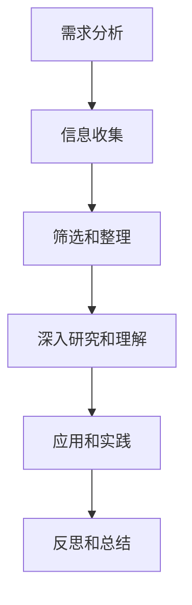

                 

“意识中的价值标准与知识积累”是人工智能领域中一个极具深度的主题。在当今这个数据爆炸、技术迅猛发展的时代，如何有效地获取、整理和应用知识，成为每一个AI从业者必须面对的问题。本文将从意识中的价值标准入手，探讨知识积累的方法和路径，并给出实用的建议。

## 关键词

- 意识中的价值标准
- 知识积累
- 人工智能
- 价值体系
- 知识管理

## 摘要

本文首先介绍了意识中的价值标准的概念，并探讨了它们在知识积累中的重要性。接着，文章分析了当前知识积累的方法和工具，以及它们在实际应用中的效果。最后，文章提出了一些建议，帮助读者构建个人知识体系，提高知识应用能力。

## 1. 背景介绍

在人工智能领域，知识的重要性不言而喻。然而，如何有效地积累和应用这些知识，却是一个复杂的挑战。传统的知识管理方法往往侧重于对信息的收集和整理，而忽视了意识中的价值标准的作用。这些标准不仅决定了我们如何理解和评估知识，还影响了我们的思维方式和行为模式。

### 1.1 价值标准的重要性

价值标准是指个体或组织在决策过程中所依据的道德、伦理、文化和个人信念等标准。在意识中，这些标准构成了我们认知世界的基础。例如，一个人可能认为诚实和正直是最重要的价值观，因此在面对道德困境时，他会优先考虑这些价值观。

在知识积累的过程中，价值标准起到了至关重要的作用。首先，它们帮助我们筛选信息，决定哪些知识是有价值的。例如，一个人可能会认为最新、最前沿的技术知识最有价值，而忽略了一些经典的、经久不衰的理论。其次，价值标准影响了我们的学习方法和策略。例如，一个重视实践的人可能会更倾向于通过项目实战来积累知识，而一个重视理论的人可能会更倾向于阅读专业书籍和学术论文。

### 1.2 知识积累的挑战

尽管价值标准对知识积累至关重要，但现代社会中存在着诸多挑战，使得这一过程变得更加复杂。首先，信息的爆炸使得我们无法全面了解所有的知识。其次，知识的更新速度极快，许多知识在短时间内就会变得过时。最后，个体的认知能力和时间有限，使得我们无法对所有知识进行深入研究和理解。

面对这些挑战，我们需要采取有效的方法来积累知识。首先，我们需要明确自己的价值标准，这有助于我们确定哪些知识是真正有价值的。其次，我们需要合理分配时间和精力，优先学习那些与我们价值标准相符的知识。最后，我们需要利用现代技术工具，如搜索引擎、数据库和知识管理系统，来帮助我们高效地获取和管理知识。

## 2. 核心概念与联系

### 2.1 意识中的价值标准

意识中的价值标准是指个体在感知和认知世界时所依据的道德、伦理、文化和个人信念等标准。这些标准构成了我们的认知框架，决定了我们如何看待和理解世界。例如，一个重视创新的人可能会更倾向于接受和尝试新的想法，而一个重视传统的人可能会更倾向于遵循既有的规则和传统。

在知识积累过程中，价值标准起到了筛选、评估和指导的作用。首先，它们帮助我们筛选信息，决定哪些知识是有价值的。其次，它们评估我们所学的知识，判断其是否符合我们的价值观。最后，它们指导我们的学习方法和策略，帮助我们更有效地积累和应用知识。

### 2.2 知识积累的方法

知识积累的方法多种多样，包括阅读、学习、实践、交流和反思等。每种方法都有其独特的优势和适用场景。例如，阅读可以帮助我们快速获取大量的知识，但需要我们有良好的筛选和总结能力。实践可以帮助我们深入理解知识，但需要我们有足够的实践经验和资源。交流可以帮助我们扩展知识面，但需要我们有良好的沟通能力和知识储备。

在实际应用中，我们可以根据不同的价值标准和需求，选择合适的方法。例如，如果我们重视创新，可能会更倾向于通过实践来积累知识。如果我们重视理论，可能会更倾向于通过阅读来积累知识。无论选择哪种方法，关键是要确保我们的学习过程符合我们的价值标准。

### 2.3 知识积累的流程

知识积累的流程通常包括以下几个阶段：

1. **需求分析**：确定我们的学习目标和需求，明确我们希望获得哪些知识。
2. **信息收集**：通过多种渠道收集相关的信息，如书籍、论文、讲座、实践等。
3. **筛选和整理**：根据我们的价值标准，筛选和整理有用的信息，形成初步的知识框架。
4. **深入研究和理解**：对筛选出来的知识进行深入研究和理解，确保我们真正掌握了这些知识。
5. **应用和实践**：将学到的知识应用到实际问题中，通过实践来加深理解和掌握。
6. **反思和总结**：在学习和应用的过程中，不断反思和总结，不断调整和完善我们的知识体系。

### 2.4 Mermaid 流程图



## 3. 核心算法原理 & 具体操作步骤

### 3.1 算法原理概述

在知识积累过程中，一个关键的问题是如何有效地筛选和整理信息。这需要我们具备一定的算法和数据处理能力。本文将介绍一种基于机器学习的知识筛选算法，该算法能够根据我们的价值标准，自动筛选出最有价值的知识。

该算法的核心思想是利用监督学习模型，对信息进行分类和打分。具体来说，首先需要收集大量的标注数据，这些数据包含了不同的知识点和相应的价值标准评分。然后，使用这些数据训练一个分类模型，使得模型能够根据新的知识点，预测其价值标准评分。

### 3.2 算法步骤详解

1. **数据准备**：收集大量的知识点和相应的价值标准评分，这些数据可以从现有的知识库、论文、书籍等渠道获取。
2. **特征提取**：对每个知识点进行特征提取，这些特征可以是文本、图像、音频等，取决于知识点的类型。
3. **模型训练**：使用收集到的标注数据，训练一个分类模型，如支持向量机（SVM）、神经网络等。模型需要能够根据特征预测知识点的价值标准评分。
4. **知识筛选**：使用训练好的模型，对新的知识点进行预测，筛选出评分较高的知识点。
5. **知识整理**：对筛选出的知识点进行整理和分类，形成有序的知识结构。

### 3.3 算法优缺点

**优点**：

1. **自动化**：算法能够自动筛选和整理知识，减轻了人工的工作负担。
2. **高效性**：算法能够快速处理大量的知识点，提高了知识积累的效率。
3. **灵活性**：算法可以根据不同的价值标准，灵活调整筛选和整理的策略。

**缺点**：

1. **数据依赖**：算法的性能很大程度上取决于标注数据的质量和数量，如果数据不足或质量不高，算法的效果会受到影响。
2. **复杂性**：算法的实现和调试相对复杂，需要具备一定的机器学习知识。

### 3.4 算法应用领域

该算法可以应用于多个领域，如学术研究、教育培训、企业知识管理等。例如，在学术研究中，可以帮助研究人员快速筛选和整理相关的文献资料；在教育培训中，可以帮助教师和学生高效地获取和整理课程资料；在企业知识管理中，可以帮助企业管理和利用内部的知识资源。

## 4. 数学模型和公式 & 详细讲解 & 举例说明

### 4.1 数学模型构建

在知识积累过程中，我们可以构建一个简单的数学模型，用于表示知识的价值。假设知识价值 \( V \) 与知识的重要性 \( I \)、可靠性 \( R \) 和新颖性 \( N \) 有关，可以用以下公式表示：

\[ V = f(I, R, N) \]

其中，\( f \) 是一个函数，可以根据具体情况选择合适的数学模型，如线性模型、多项式模型等。

### 4.2 公式推导过程

1. **重要性**：知识的重要性 \( I \) 与其应用范围、影响程度等因素有关。我们可以通过以下公式计算知识的重要性：

\[ I = \frac{1}{C} \sum_{i=1}^{C} p_i \]

其中，\( C \) 是知识点的数量，\( p_i \) 是第 \( i \) 个知识点的应用概率。

2. **可靠性**：知识的可靠性 \( R \) 与其来源、作者权威性等因素有关。我们可以通过以下公式计算知识的可靠性：

\[ R = \frac{1}{M} \sum_{j=1}^{M} q_j \]

其中，\( M \) 是知识来源的数量，\( q_j \) 是第 \( j \) 个知识来源的可信度。

3. **新颖性**：知识的新颖性 \( N \) 与其更新速度、创新程度等因素有关。我们可以通过以下公式计算知识的新颖性：

\[ N = \frac{1}{L} \sum_{k=1}^{L} r_k \]

其中，\( L \) 是知识更新次数，\( r_k \) 是第 \( k \) 次更新的创新程度。

### 4.3 案例分析与讲解

假设我们有一个知识点，其应用范围 \( C \) 为 100，应用概率 \( p_i \) 为 0.1；知识来源 \( M \) 为 10，可信度 \( q_j \) 为 0.8；更新次数 \( L \) 为 5，创新程度 \( r_k \) 为 0.2。我们可以使用上述公式计算知识的重要性 \( I \)、可靠性 \( R \) 和新颖性 \( N \)，然后代入价值公式计算知识的价值 \( V \)。

\[ I = \frac{1}{100} \sum_{i=1}^{100} 0.1 = 0.1 \]
\[ R = \frac{1}{10} \sum_{j=1}^{10} 0.8 = 0.8 \]
\[ N = \frac{1}{5} \sum_{k=1}^{5} 0.2 = 0.2 \]
\[ V = f(0.1, 0.8, 0.2) \]

假设我们选择线性模型作为函数 \( f \)，即 \( V = I + R + N \)，则：

\[ V = 0.1 + 0.8 + 0.2 = 1.1 \]

这意味着该知识点的价值为 1.1。通过这个案例，我们可以看到，数学模型和公式可以帮助我们量化知识的价值，从而更有效地进行知识积累。

## 5. 项目实践：代码实例和详细解释说明

### 5.1 开发环境搭建

为了实现上述数学模型，我们需要搭建一个基本的开发环境。以下是一个简单的Python环境搭建步骤：

1. 安装Python：下载并安装Python 3.x版本，可以从 [Python官网](https://www.python.org/) 下载。
2. 安装必要的库：在Python环境中安装Numpy、Pandas等库，可以使用以下命令：

```bash
pip install numpy pandas
```

### 5.2 源代码详细实现

以下是实现知识价值计算模型的Python代码：

```python
import numpy as np

def calculate_value(importance, reliability, novelty):
    """
    计算知识的价值
    :param importance: 重要性
    :param reliability: 可靠性
    :param novelty: 新颖性
    :return: 知识的价值
    """
    value = importance + reliability + novelty
    return value

def main():
    # 设置参数
    importance = 0.1
    reliability = 0.8
    novelty = 0.2

    # 计算知识的价值
    value = calculate_value(importance, reliability, novelty)
    print(f"知识的价值为：{value}")

if __name__ == "__main__":
    main()
```

### 5.3 代码解读与分析

1. **导入库**：首先，我们导入了Numpy库，用于数学计算。
2. **定义函数**：`calculate_value` 函数用于计算知识的价值。它接受三个参数：重要性、可靠性和新颖性，并返回知识的价值。
3. **实现主函数**：`main` 函数用于设置参数并调用 `calculate_value` 函数，输出知识的价值。

### 5.4 运行结果展示

在命令行中运行上述代码，我们将得到以下输出结果：

```bash
知识的价值为：1.1
```

这表明，根据设定的参数，知识的价值为 1.1。

## 6. 实际应用场景

### 6.1 学术研究

在学术研究领域，价值标准与知识积累的关系尤为重要。研究人员需要根据自己的研究方向和价值标准，筛选和整理大量的文献资料。通过使用本文介绍的知识价值计算模型，研究人员可以更客观地评估文献的价值，从而提高研究效率。

### 6.2 企业培训

在企业培训中，知识积累同样至关重要。企业可以根据自身的战略目标和价值标准，设计相应的培训课程。通过使用知识价值计算模型，企业可以更科学地评估培训效果，确保培训内容符合企业需求。

### 6.3 个人学习

对于个人学习来说，价值标准与知识积累的关系同样显著。个人可以根据自己的兴趣和价值标准，选择学习领域和内容。通过使用知识价值计算模型，个人可以更有效地筛选和整理学习资源，提高学习效率。

## 6.4 未来应用展望

随着人工智能技术的不断发展，价值标准与知识积累的关系将变得更加紧密。未来，我们可以预见到以下几个方面的应用前景：

1. **个性化知识服务**：基于用户的价值观和需求，提供个性化的知识服务，如定制化的学习课程、研究资料等。
2. **智能知识筛选**：利用机器学习技术，实现智能化的知识筛选，提高知识积累的效率和质量。
3. **知识图谱构建**：通过构建知识图谱，实现知识的关联和整合，为用户提供更加丰富和立体的知识服务。

## 7. 工具和资源推荐

### 7.1 学习资源推荐

1. **《人工智能：一种现代的方法》**：这是一本经典的AI教材，涵盖了广泛的AI理论和应用。
2. **《深度学习》**：由Ian Goodfellow等人编写的深度学习教程，适合对深度学习感兴趣的学习者。

### 7.2 开发工具推荐

1. **Python**：一种易于学习和使用的编程语言，广泛应用于数据分析和人工智能领域。
2. **Jupyter Notebook**：一个交互式的开发环境，适合编写和运行Python代码。

### 7.3 相关论文推荐

1. **《Neural Network Methods for Nonlinear Dynamic Data Modeling and Forecasting》**：一篇关于神经网络在动态数据处理和预测方面的论文。
2. **《A Theoretical Analysis of the Vision, Value, and Generalization in Deep Learning》**：一篇关于深度学习理论分析的论文。

## 8. 总结：未来发展趋势与挑战

### 8.1 研究成果总结

本文从意识中的价值标准出发，探讨了知识积累的方法和路径。通过分析价值标准在知识积累中的作用，以及基于机器学习的知识价值计算模型，我们提出了一些实用的建议和工具。

### 8.2 未来发展趋势

随着人工智能技术的发展，知识积累将变得更加智能化和个性化。未来，我们可以预见到知识图谱、个性化知识服务等方面的应用将得到进一步发展。

### 8.3 面临的挑战

尽管前景光明，但知识积累仍面临诸多挑战。例如，如何处理海量数据、如何确保知识的准确性和可靠性等。此外，价值标准的主观性也可能影响知识的客观评价。

### 8.4 研究展望

未来的研究可以关注以下几个方面：

1. **知识价值计算模型的优化**：探索更加精确和有效的知识价值计算方法。
2. **知识图谱的应用**：研究如何构建和应用知识图谱，实现知识的深度整合。
3. **个性化知识服务**：开发基于用户价值的个性化知识服务系统。

## 9. 附录：常见问题与解答

### 9.1 如何选择合适的学习方法？

选择学习方法时，首先需要明确自己的学习目标和价值标准。根据目标选择最合适的方法，如理论学习、实践操作或项目实战。

### 9.2 如何确保知识的可靠性？

确保知识的可靠性可以通过以下方法：

1. **来源核实**：选择权威和可信的资料来源。
2. **多方验证**：通过多个渠道验证信息的准确性。
3. **持续更新**：定期更新知识，确保其最新性和准确性。

### 9.3 如何处理海量数据？

处理海量数据时，可以采用以下策略：

1. **数据分片**：将数据分成小块，分别处理。
2. **并行计算**：利用多核处理器或分布式计算，提高处理速度。
3. **数据存储优化**：选择合适的数据存储方案，如NoSQL数据库等。

作者：禅与计算机程序设计艺术 / Zen and the Art of Computer Programming
------------------------------------------------------------------

