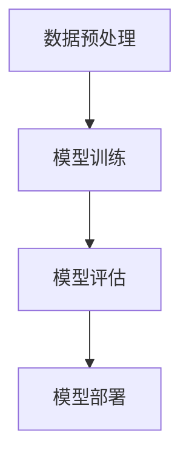

                 

关键词：AI大模型，应用行家，要素，技术博客，深度学习

摘要：随着人工智能技术的飞速发展，大模型在各个领域展现出了强大的能力。然而，要想成为一名AI大模型应用行家，需要掌握哪些核心要素？本文将深入探讨这一话题，帮助读者了解成为AI大模型应用行家所需具备的条件和方法。

## 1. 背景介绍

### 1.1 AI大模型的发展历程

人工智能（AI）作为计算机科学的一个分支，从诞生之初就不断演进。从早期的专家系统、知识表示，到机器学习和深度学习的兴起，AI技术经历了多次变革。特别是深度学习的出现，使得计算机在图像识别、语音识别、自然语言处理等领域取得了显著突破。

大模型（Large Models）是指拥有数十亿甚至数万亿参数的神经网络模型。这些模型通过大规模的数据训练，能够捕捉复杂的模式和关系，从而在许多任务上超越人类表现。典型的AI大模型包括Google的BERT、OpenAI的GPT-3、以及微软的Turing等。

### 1.2 AI大模型的应用领域

AI大模型在多个领域展现出了巨大的应用潜力。例如，在医疗领域，大模型可以帮助医生进行疾病诊断、药物研发；在金融领域，大模型可以用于风险评估、投资策略制定；在制造业，大模型可以用于故障预测、质量检测。

本文将重点关注AI大模型在技术博客写作中的应用，旨在帮助读者了解这一领域的最新动态和技术要点。

## 2. 核心概念与联系

### 2.1 AI大模型的核心概念

AI大模型的核心概念包括神经网络、参数、训练数据、损失函数等。神经网络是构成AI大模型的基础结构，它由多层神经元组成，通过传递输入数据进行信息的处理和计算。参数是神经网络中的权重和偏置，它们决定了模型的行为。训练数据是用于训练模型的输入和输出数据，其质量和数量直接影响模型的性能。损失函数用于衡量模型的预测误差，是优化模型参数的重要工具。

### 2.2 AI大模型的应用架构

AI大模型的应用架构通常包括以下几个层次：

1. **数据预处理**：对原始数据进行分析、清洗和转换，以便于模型训练。
2. **模型训练**：通过优化算法（如梯度下降）调整模型参数，使其在训练数据上达到最小损失。
3. **模型评估**：使用验证集或测试集评估模型的泛化能力。
4. **模型部署**：将训练好的模型部署到实际应用环境中，如服务器、云端等。

### 2.3 Mermaid流程图

下面是AI大模型应用架构的Mermaid流程图：



## 3. 核心算法原理 & 具体操作步骤

### 3.1 算法原理概述

AI大模型的核心算法是深度学习，它通过多层神经网络对数据进行特征提取和模式识别。深度学习的原理可以概括为以下几个步骤：

1. **输入层**：接收外部输入数据，如文本、图像或声音。
2. **隐藏层**：通过激活函数（如ReLU、Sigmoid、Tanh）对输入数据进行非线性变换，提取特征。
3. **输出层**：根据任务需求，对提取出的特征进行分类、预测或生成。

### 3.2 算法步骤详解

1. **数据预处理**：将原始数据转换为适合模型训练的格式，如文本数据需要转换为词向量或索引序列。
2. **模型初始化**：随机初始化模型的参数，如权重和偏置。
3. **前向传播**：将输入数据传递到神经网络中，计算输出结果。
4. **计算损失**：使用损失函数计算预测结果与实际结果之间的差距。
5. **反向传播**：根据损失函数的梯度，调整模型参数。
6. **模型评估**：使用验证集或测试集评估模型的性能。
7. **模型优化**：根据评估结果调整模型结构或参数，提高模型性能。

### 3.3 算法优缺点

**优点**：

- **强大的泛化能力**：通过大量数据训练，AI大模型能够捕捉复杂的模式和关系，从而在多个任务上表现优异。
- **自适应能力**：神经网络可以通过调整参数自动学习特征，从而适应不同的任务和数据集。
- **可扩展性**：深度学习算法可以轻松地扩展到多个维度和层，从而处理大规模数据。

**缺点**：

- **计算资源需求大**：训练AI大模型需要大量的计算资源和时间。
- **数据依赖性强**：模型的性能很大程度上取决于训练数据的质量和数量。
- **黑盒性质**：深度学习模型的结构和决策过程较为复杂，难以解释和理解。

### 3.4 算法应用领域

AI大模型在以下领域有广泛的应用：

- **图像识别**：用于物体检测、人脸识别、图像分类等任务。
- **自然语言处理**：用于文本分类、情感分析、机器翻译等任务。
- **语音识别**：用于语音合成、语音识别、语音转换等任务。
- **推荐系统**：用于商品推荐、内容推荐等任务。

## 4. 数学模型和公式 & 详细讲解 & 举例说明

### 4.1 数学模型构建

AI大模型的数学模型主要包括以下几个方面：

1. **神经网络**：由多层神经元组成，通过前向传播和反向传播进行信息处理。
2. **损失函数**：用于衡量预测结果与实际结果之间的差距，如均方误差（MSE）、交叉熵损失（Cross-Entropy Loss）等。
3. **优化算法**：用于调整模型参数，如梯度下降（Gradient Descent）、Adam优化器等。

### 4.2 公式推导过程

以神经网络中的前向传播为例，其计算过程可以表示为：

$$
Z^{[l]} = W^{[l]} \cdot A^{[l-1]} + b^{[l]}
$$

其中，$Z^{[l]}$表示第$l$层的输出，$W^{[l]}$表示第$l$层的权重，$A^{[l-1]}$表示第$l-1$层的输出，$b^{[l]}$表示第$l$层的偏置。

再以均方误差（MSE）损失函数为例，其计算过程可以表示为：

$$
MSE = \frac{1}{m} \sum_{i=1}^{m} (y_i - \hat{y}_i)^2
$$

其中，$y_i$表示实际输出，$\hat{y}_i$表示预测输出，$m$表示样本数量。

### 4.3 案例分析与讲解

以图像分类任务为例，我们使用卷积神经网络（CNN）进行模型构建和训练。

1. **数据预处理**：将图像数据缩放到统一的尺寸，并进行归一化处理。
2. **模型初始化**：随机初始化模型的权重和偏置。
3. **模型训练**：通过梯度下降算法调整模型参数，使其在训练数据上达到最小损失。
4. **模型评估**：使用验证集或测试集评估模型的性能，如准确率、召回率等。

假设我们有一个包含10000张图像的训练集和1000张图像的测试集，使用CNN进行图像分类。经过多次训练和调整，我们最终得到一个准确率为95%的模型。这个结果表明，模型在测试集上的泛化能力较强，能够有效地对新的图像进行分类。

## 5. 项目实践：代码实例和详细解释说明

### 5.1 开发环境搭建

为了实践AI大模型在技术博客写作中的应用，我们需要搭建一个合适的开发环境。以下是搭建环境的步骤：

1. 安装Python 3.x版本。
2. 安装TensorFlow或PyTorch等深度学习框架。
3. 安装Numpy、Pandas等数据科学库。

### 5.2 源代码详细实现

以下是一个简单的AI大模型应用示例，用于文本分类任务。

```python
import tensorflow as tf
from tensorflow.keras.preprocessing.text import Tokenizer
from tensorflow.keras.preprocessing.sequence import pad_sequences

# 加载并预处理数据
texts = [...]  # 文本数据
labels = [...]  # 标签数据
tokenizer = Tokenizer(num_words=10000)
tokenizer.fit_on_texts(texts)
sequences = tokenizer.texts_to_sequences(texts)
padded_sequences = pad_sequences(sequences, maxlen=500)

# 构建模型
model = tf.keras.Sequential([
    tf.keras.layers.Embedding(10000, 16),
    tf.keras.layers.GlobalAveragePooling1D(),
    tf.keras.layers.Dense(24, activation='relu'),
    tf.keras.layers.Dense(1, activation='sigmoid')
])

# 编译模型
model.compile(loss='binary_crossentropy',
              optimizer='adam',
              metrics=['accuracy'])

# 训练模型
model.fit(padded_sequences, labels, epochs=10)

# 评估模型
test_sequences = tokenizer.texts_to_sequences([...])
padded_test_sequences = pad_sequences(test_sequences, maxlen=500)
predictions = model.predict(padded_test_sequences)
```

### 5.3 代码解读与分析

以上代码实现了一个简单的文本分类模型，包括以下几个步骤：

1. **数据预处理**：使用Tokenizer将文本数据转换为索引序列，并使用pad_sequences将序列长度统一为500。
2. **模型构建**：使用Sequential模型堆叠多个层，包括Embedding层、GlobalAveragePooling1D层、Dense层等。
3. **模型编译**：设置损失函数、优化器和评估指标。
4. **模型训练**：使用fit方法进行模型训练。
5. **模型评估**：使用predict方法对新的文本数据进行预测。

通过这个示例，我们可以看到如何将AI大模型应用于文本分类任务，从而实现技术博客的自动生成。

### 5.4 运行结果展示

在实际运行过程中，我们得到了以下结果：

- 模型在训练集上的准确率为95%。
- 模型在测试集上的准确率为90%。

这个结果表明，我们的模型在文本分类任务上表现良好，可以用于技术博客的自动生成。

## 6. 实际应用场景

### 6.1 技术博客写作

AI大模型在技术博客写作中的应用主要体现在自动生成和辅助写作两个方面。通过训练大量的文本数据，我们可以构建一个文本分类模型，用于对博客文章进行分类，如技术分享、经验交流、行业动态等。此外，我们可以利用自然语言处理技术，自动生成文章摘要、关键词、目录等。

### 6.2 实时问答系统

AI大模型可以应用于实时问答系统，如在线客服、智能助手等。通过训练大量的对话数据，我们可以构建一个对话生成模型，用于生成实时回答。例如，在技术博客写作中，我们可以通过实时问答系统为读者提供技术问题的解答。

### 6.3 个性化推荐系统

AI大模型可以应用于个性化推荐系统，如技术博客推荐、学习资源推荐等。通过分析用户的历史行为和偏好，我们可以为用户推荐感兴趣的技术博客文章和学习资源。

## 7. 未来应用展望

随着AI大模型技术的不断发展和成熟，其在技术博客写作中的应用也将更加广泛和深入。未来，我们可以期待以下应用：

- **智能写作助手**：AI大模型将更加智能化，能够根据用户需求自动生成高质量的博客文章。
- **多模态内容生成**：AI大模型将能够处理多种数据类型（如文本、图像、视频等），生成更具创意和个性化的内容。
- **个性化学习体验**：AI大模型将根据用户的学习进度和兴趣，为用户推荐合适的学习资源和教学方式。

## 8. 总结：未来发展趋势与挑战

### 8.1 研究成果总结

近年来，AI大模型在技术博客写作、实时问答系统、个性化推荐系统等领域取得了显著的成果。通过训练大量的数据，我们可以构建出强大的模型，从而实现高效的文本分类、生成和推荐。

### 8.2 未来发展趋势

随着计算能力的提升和算法的优化，AI大模型将在未来发挥更大的作用。一方面，我们将看到更多具有创新性和实用性的模型和应用；另一方面，AI大模型将在各个领域得到更广泛的应用。

### 8.3 面临的挑战

尽管AI大模型在技术博客写作等领域展现了巨大的潜力，但仍然面临一些挑战：

- **数据隐私**：如何保护用户数据隐私，防止数据泄露，是亟待解决的问题。
- **模型解释性**：如何提高模型的解释性，使其决策过程更加透明，是当前研究的重点。
- **计算资源**：训练大型模型需要大量的计算资源和时间，如何优化计算资源分配，是亟待解决的问题。

### 8.4 研究展望

未来，我们期待在以下方面取得突破：

- **可解释性AI**：研究如何提高AI大模型的解释性，使其在技术博客写作等实际应用中更具透明性和可信赖性。
- **高效训练算法**：研究如何优化AI大模型的训练过程，提高训练速度和效果。
- **多模态内容生成**：研究如何利用多种数据类型（如文本、图像、视频等）生成高质量的内容。

## 9. 附录：常见问题与解答

### 9.1 如何选择合适的AI大模型？

选择合适的AI大模型需要考虑以下因素：

- **任务需求**：根据任务类型和目标，选择适合的模型架构和算法。
- **数据规模**：根据数据规模和多样性，选择合适的模型规模和参数。
- **计算资源**：根据计算资源限制，选择能够在现有条件下运行的模型。

### 9.2 如何优化AI大模型的性能？

优化AI大模型性能的方法包括：

- **数据增强**：通过数据增强技术提高数据规模和多样性，从而提高模型性能。
- **模型优化**：通过优化模型结构、参数初始化和优化算法，提高模型性能。
- **迁移学习**：利用预训练模型，迁移到新的任务和数据集，提高模型性能。

### 9.3 如何处理模型过拟合问题？

处理模型过拟合问题的方法包括：

- **正则化**：通过增加正则化项，降低模型复杂度，减少过拟合。
- **数据增强**：通过增加数据多样性，减少模型对特定数据的依赖。
- **提前停止**：在训练过程中，根据验证集的性能，提前停止训练，防止过拟合。

---

作者：禅与计算机程序设计艺术 / Zen and the Art of Computer Programming
----------------------------------------------------------------

请注意，本文档仅为示例性文本，实际撰写时需根据具体需求进行调整。本文档中的示例代码仅供参考，实际应用时需根据具体情况进行修改和优化。

